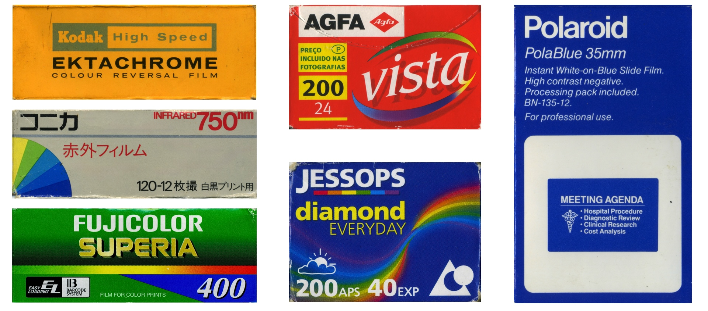

# Film Packaging Archive

Welcome! Here you can find high-resolution scans of:

* Photographic Film Packaging
* In-box Instruction Manuals / Leaflets / Processing Envelopes
* Old & new, popular & obscure.

## Why

Film packaging reflects the evolution of photography, technological progress, and branding / design trends.

Its preservation helps document history, inspire modern designs, and support research of branding and cultural aesthetics.

## I Want to Contribute!

Thanks! [Please follow this guide](contribution_guide.md).

## Browse Archive

Click to see all the scans!

Sort by...

* [Brand](./film_packaging/by_brand.md)
* Film Format (Under construction)
* ISO
* Photographic Process
* Expiry Date

The collection is by no means complete or exhaustive, but it's a start!

## Database

[Available as CSV file](./film_packaging/database.csv)

## Disclaimer

The images are provided for reference and educational purposes.

The designs may be protected under copyright and trademark laws. Use at your own risk.

## Questions or Comments?

Get in touch by [join the Discord chatroom](https://discord.gg/yvBx7dVG4B), or email skate.huddle-6r@icloud.com !
