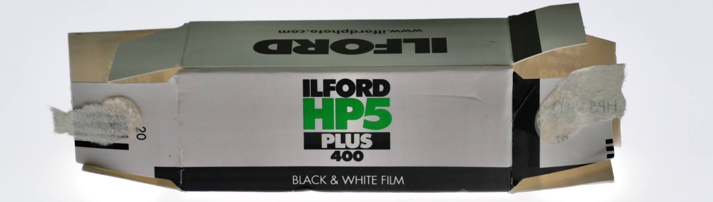
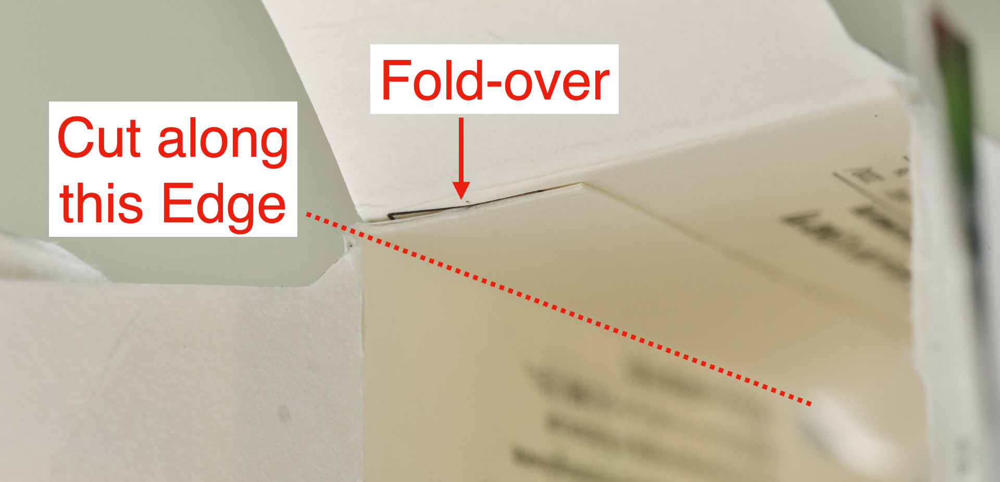

## Contribution Guide

[Main Page](README.md)

----------

Thank you for supporting this project!

Please read this short guide about how to submit your own images.

### Prerequisites

Your film packaging should be:

* Intact & Legible
	* Not missing any flaps / panels
	* Printing not obscured by stains / stickers
* Unique
	* [Take a look at the archive page](./film_packaging/by_brand.md)
	* It should be **NOT exactly the same** OR **in better condition** as the existing entries

Feel free to submit those requirements are met!

### Equipment

A **Flatbed Scanner** is highly recommended.

No need to be new or high-end, 1200DPI is plenty.

### Preparation

You need to **take apart the box** while **minimizing damage**.

⚠️ Don't remove any stickers! Do a scan first before attempting!

Each box is different, but generally you can:

* Carefully lift the end flaps

* Look at the inside of the box
* Locate the corner with the fold-over
* Cut straight along its edge

* Wipe with **dry** microfibre cloth to remove dust and fingerprints

### Scanning

* Scan at 800 / 1200 DPI
* 24-Bit colour
* JPEG format, 90% - 95% quality.

------

* Ensure the scans are **IN THE ORDER OF**:
	* Outside
	* Inside (**Only if there is text**)
	* Leaflets (All pages with text)
	* Processing Envelopes (If any)
* Straighten and crop if necessary

⚠️ DO NOT perform excessive post-processing! Flatter image is preferable.

### Submission

You can submit via the means below, I'll review and update once received.

#### WeTransfer

* Zip all your scans
* Send via [WeTransfer](https://wetransfer.com/) to skate.huddle-6r@icloud.com
	* **Include your nickname/real name/social media handle**!
	* Used to credit you in the database

#### Discord

* Zip all your scans
* [Join the chatroom](https://discord.gg/yvBx7dVG4B)
* Post in the `#submissions` channel
	* **Include your nickname/real name/social media handle**!
	* Used to credit you in the database

#### GitHub Pull Request

* Advanced User Only
* Clone this repo
* Add your scans in `to_add` folder
* Submit a pull request
* Keep image size under 10MB

