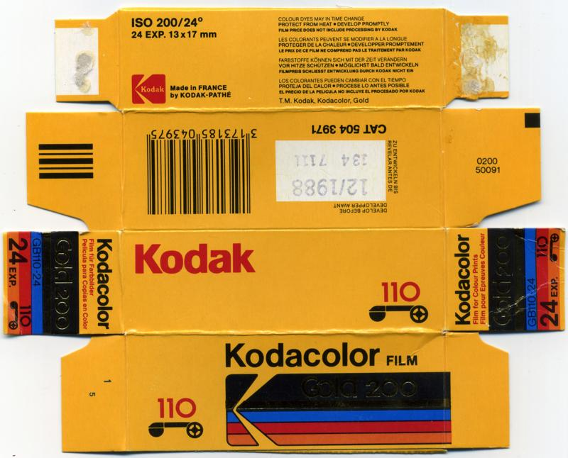

# Film Packaging Archive (Sorted by BRAND)

[Home Page](../README.md) | [GitHub Repo](https://github.com/dekuNukem/Film-Packaging)

-----

Find this useful? Please [credit the project page](https://github.com/dekuNukem/Film-Packaging)!

Want to contribute? [Check out the guidelines!](../contribution_guide.md)

👇👇👇👇👇👇👇👇👇👇👇👇👇👇👇👇👇👇👇👇👇👇

🔎🔎 **CLICK IMAGE FOR FULL SIZE** 🔍🔍

☝️☝️☝️☝️☝️☝️☝️☝️☝️☝️☝️☝️☝️☝️☝️☝️☝️☝️☝️☝️☝️☝️

```
Last Updated: Jun 05 2025

# of items: 127
```

-----


- [ADOX KB17 (ref: 2c95)](#adox-kb17-ref-2c95)
- [AGFA APX (ref: 12c7)](#agfa-apx-ref-12c7)
- [AGFA ULTRA 50 (ref: 4faa)](#agfa-ultra-50-ref-4faa)
- [AGFA Vista (ref: d3af)](#agfa-vista-ref-d3af)
- [Alien Film 5207/250D (ref: 8820)](#alien-film-5207250d-ref-8820)
- [Alien Film 5222/XX (ref: 3e49)](#alien-film-5222xx-ref-3e49)
- [CineStill 800T (ref: c86a)](#cinestill-800t-ref-c86a)
- [Efiniti UXi super 200 (ref: 471a)](#efiniti-uxi-super-200-ref-471a)
- [Efke IR 820 (ref: 43c9)](#efke-ir-820-ref-43c9)
- [Foma Fomapan (ref: 3e4f)](#foma-fomapan-ref-3e4f)
- [Fujifilm 200 (ref: 5b41)](#fujifilm-200-ref-5b41)
- [Fujifilm FUJICOLOR SUPER HR (ref: aaa0)](#fujifilm-fujicolor-super-hr-ref-aaa0)
- [Fujifilm FUJICOLOR SUPERIA (ref: 0683)](#fujifilm-fujicolor-superia-ref-0683)
- [Fujifilm Fujichrome Professional 100D (ref: 439d)](#fujifilm-fujichrome-professional-100d-ref-439d)
- [Fujifilm Fujicolor 100 (ref: 013b)](#fujifilm-fujicolor-100-ref-013b)
- [Fujifilm Fujicolor NPL 160 (ref: d10b)](#fujifilm-fujicolor-npl-160-ref-d10b)
- [Fujifilm NPS (ref: 5e85)](#fujifilm-nps-ref-5e85)
- [Fujifilm Pro 400H (ref: 66e3)](#fujifilm-pro-400h-ref-66e3)
- [Fujifilm Provia 100F (ref: 356d)](#fujifilm-provia-100f-ref-356d)
- [Fujifilm Velvia (ref: 3182)](#fujifilm-velvia-ref-3182)
- [Fujifilm Velvia 100F (ref: f7fb)](#fujifilm-velvia-100f-ref-f7fb)
- [Fujifilm Velvia 100F (ref: 32d4)](#fujifilm-velvia-100f-ref-32d4)
- [GAF Color Slide Film (ref: dea6)](#gaf-color-slide-film-ref-dea6)
- [HARMAN PHOENIX (ref: 637f)](#harman-phoenix-ref-637f)
- [Ilford Delta (ref: eb8d)](#ilford-delta-ref-eb8d)
- [Ilford HP5 Plus (ref: 1a5d)](#ilford-hp5-plus-ref-1a5d)
- [Ilford HP5 Plus (ref: efad)](#ilford-hp5-plus-ref-efad)
- [Ilford SFX 200 (ref: 6057)](#ilford-sfx-200-ref-6057)
- [Jessops Diamond Everyday (ref: 67d3)](#jessops-diamond-everyday-ref-67d3)
- [Kentmere PAN (ref: 827e)](#kentmere-pan-ref-827e)
- [Kentmere PAN (ref: d223)](#kentmere-pan-ref-d223)
- [Klick APS Film (ref: 4b88)](#klick-aps-film-ref-4b88)
- [Klick XD200 (ref: 44d7)](#klick-xd200-ref-44d7)
- [Kodak Advantix Ultra (ref: 566b)](#kodak-advantix-ultra-ref-566b)
- [Kodak Ektachrome (ref: ce7f)](#kodak-ektachrome-ref-ce7f)
- [Kodak Ektachrome (ref: 07c0)](#kodak-ektachrome-ref-07c0)
- [Kodak Ektachrome (ref: ec3d)](#kodak-ektachrome-ref-ec3d)
- [Kodak Ektachrome (ref: b21e)](#kodak-ektachrome-ref-b21e)
- [Kodak Ektacolor Pro Gold (ref: c3f8)](#kodak-ektacolor-pro-gold-ref-c3f8)
- [Kodak Elite Chrome (ref: 523c)](#kodak-elite-chrome-ref-523c)
- [Kodak Gold (ref: 933f)](#kodak-gold-ref-933f)
- [Kodak Gold (ref: f368)](#kodak-gold-ref-f368)
- [Kodak Kodachrome (ref: 3145)](#kodak-kodachrome-ref-3145)
- [Kodak Kodachrome (ref: 6477)](#kodak-kodachrome-ref-6477)
- [Kodak Kodachrome (ref: 3206)](#kodak-kodachrome-ref-3206)
- [Kodak Kodacolor-X (ref: 5302)](#kodak-kodacolor-x-ref-5302)
- [Kodak Kodacolor-X (ref: a4b1)](#kodak-kodacolor-x-ref-a4b1)
- [Kodak TMAX (ref: b3b1)](#kodak-tmax-ref-b3b1)
- [Kodak Technical Pan 6415 (ref: 03be)](#kodak-technical-pan-6415-ref-03be)
- [Kodak Tri-X (ref: 88c5)](#kodak-tri-x-ref-88c5)
- [Kodak Ultra (ref: 69a1)](#kodak-ultra-ref-69a1)
- [Kodak Verichrome Pan (ref: 0195)](#kodak-verichrome-pan-ref-0195)
- [Konica Infrared 750nm (ref: 2d93)](#konica-infrared-750nm-ref-2d93)
- [Konica Infrared 750nm (ref: e696)](#konica-infrared-750nm-ref-e696)
- [Lloyds Pharmacy APS Film (ref: c7cf)](#lloyds-pharmacy-aps-film-ref-c7cf)
- [Lloyds Pharmacy Colour Film (ref: 77d9)](#lloyds-pharmacy-colour-film-ref-77d9)
- [Lomography Lomochrome Turquoise (ref: 0d90)](#lomography-lomochrome-turquoise-ref-0d90)
- [Polaroid 665 (ref: e054)](#polaroid-665-ref-e054)
- [Polaroid 669 (ref: 3566)](#polaroid-669-ref-3566)
- [Polaroid GridFilm (ref: 8deb)](#polaroid-gridfilm-ref-8deb)
- [Polaroid PolaBlue (ref: df66)](#polaroid-polablue-ref-df66)
- [Polaroid PolaChrome (ref: 3b60)](#polaroid-polachrome-ref-3b60)
- [Porst Color N21 (ref: 494a)](#porst-color-n21-ref-494a)
- [Rollei Infrared (ref: 4f54)](#rollei-infrared-ref-4f54)
- [Rollei Infrared (ref: eae2)](#rollei-infrared-ref-eae2)
- [Rollei Retro 80S (ref: e6c0)](#rollei-retro-80s-ref-e6c0)
- [Rollei SUPERPAN (ref: ee8f)](#rollei-superpan-ref-ee8f)
- [Rossmann Jahreszeiten Pack (ref: 7670)](#rossmann-jahreszeiten-pack-ref-7670)
- [Shanghai GP3 (ref: 52aa)](#shanghai-gp3-ref-52aa)
- [Three Film Rolls 5207 (ref: 0292)](#three-film-rolls-5207-ref-0292)
- [Wolfen NC500 (ref: 91c1)](#wolfen-nc500-ref-91c1)
- [York Photo Labs DXG 200 (ref: 4bf8)](#york-photo-labs-dxg-200-ref-4bf8)


-----


#### ADOX KB17 (ref: 2c95)
```
ISO     : 40
Format  : 35mm
Process : BW
Expiry  : 196401
UUID    : 14047842e1a641268bfd4d01fcf02c95
Scanned By: dekuNukem
```

[](./archive/00065_000.jpg)

[Click me for **BOX INSIDE** for ADOX KB17 (ref: d3b7)](./archive/00065_001.jpg)

#### AGFA APX (ref: 12c7)
```
ISO     : 100
Format  : 120
Process : BW
Expiry  : 200807
UUID    : a20bbca534454915a6970b6ede2212c7
Scanned By: dekuNukem
```

[](./archive/00011_000.jpg)

[Click me for **BOX INSIDE** for AGFA APX (ref: a8dd)](./archive/00011_001.jpg)

#### AGFA ULTRA 50 (ref: 4faa)
```
ISO     : 50
Format  : 35mm
Process : C-41
Expiry  : 200110
UUID    : d10e846ba5154f1d940ed7009a904faa
Scanned By: dekuNukem
```

[](./archive/00010_000.jpg)

[Click me for **BOX INSIDE** for AGFA ULTRA 50 (ref: 8fc0)](./archive/00010_001.jpg)

#### AGFA Vista (ref: d3af)
```
ISO     : 200
Format  : 35mm
Process : C-41
Expiry  : 200312
UUID    : f1e50745927f4b7cb16af36fd30dd3af
Scanned By: dekuNukem
```

[](./archive/00014_000.jpg)

[Click me for **BOX INSIDE** for AGFA Vista (ref: cd56)](./archive/00014_001.jpg)

#### Alien Film 5207/250D (ref: 8820)
```
ISO     : 250
Format  : 120
Process : ECN-2
Expiry  : 202606
UUID    : aedc4b00bd174e0baf7c744ed21d8820
Scanned By: dekuNukem
```

[](./archive/00001_000.jpg)

#### Alien Film 5222/XX (ref: 3e49)
```
ISO     : 250
Format  : 35mm
Process : BW
Expiry  : 202406
UUID    : 9984ed6c13cd4be496e7e4b58e313e49
Scanned By: dekuNukem
```

[](./archive/00057_000.jpg)

#### CineStill 800T (ref: c86a)
```
ISO     : 800
Format  : 120
Process : C-41
Expiry  : 201803
UUID    : 53253eca96d841f5b98bfb3590fec86a
Scanned By: dekuNukem
```

[](./archive/00006_000.jpg)

[Click me for **BOX INSIDE** for CineStill 800T (ref: d1a6)](./archive/00006_001.jpg)

#### Efiniti UXi super 200 (ref: 471a)
```
ISO     : 200
Format  : 35mm
Process : C-41
Expiry  : 201310
UUID    : cde1122dafbc47088a11d9ee12b6471a
Scanned By: dekuNukem
```

[](./archive/00002_000.jpg)

#### Efke IR 820 (ref: 43c9)
```
ISO     : 100
Format  : 120
Process : BW
Expiry  : 201303
UUID    : 716e410a3823476e9befa704361f43c9
Scanned By: dekuNukem
```

[](./archive/00038_000.jpg)

[Click me for **BOX INSIDE** for Efke IR 820 (ref: 5e19)](./archive/00038_001.jpg)

#### Foma Fomapan (ref: 3e4f)
```
ISO     : 200
Format  : 120
Process : BW
Expiry  : 202703
UUID    : 7be1cb0047f14034a7386cd7b1843e4f
Scanned By: benikum
```

[](./archive/00070_000.jpg)

[Click me for **BOX INSIDE** for Foma Fomapan (ref: bd71)](./archive/00070_001.jpg)

#### Fujifilm 200 (ref: 5b41)
```
ISO     : 200
Format  : 35mm
Process : C-41
Expiry  : 202606
UUID    : fe02d85cb9294ee2ba64e8543ce65b41
Scanned By: Yrikonchik
```

[](./archive/00073_000.jpg)

#### Fujifilm FUJICOLOR SUPER HR (ref: aaa0)
```
ISO     : 200
Format  : 35mm
Process : C-41
Expiry  : 199002
UUID    : 2d27c9a865aa4de19ad8dc0bcdc8aaa0
Scanned By: dekuNukem
```

[](./archive/00007_000.jpg)

[Click me for **LEAFLET** for Fujifilm FUJICOLOR SUPER HR (ref: 57f6)](./archive/00007_001.jpg)

[Click me for **LEAFLET** for Fujifilm FUJICOLOR SUPER HR (ref: ca7b)](./archive/00007_002.jpg)

#### Fujifilm FUJICOLOR SUPERIA (ref: 0683)
```
ISO     : 400
Format  : 120
Process : C-41
Expiry  : 200205
UUID    : c3d9e51d22e241f69133be30d5a00683
Scanned By: dekuNukem
```

[](./archive/00012_000.jpg)

[Click me for **BOX INSIDE** for Fujifilm FUJICOLOR SUPERIA (ref: 118f)](./archive/00012_001.jpg)

#### Fujifilm Fujichrome Professional 100D (ref: 439d)
```
ISO     : 100
Format  : 120
Process : E-6
Expiry  : 199212
UUID    : 5dcdd19ddf654415b7eac69183e7439d
Scanned By: dekuNukem
```

[](./archive/00032_000.jpg)

[Click me for **LEAFLET** for Fujifilm Fujichrome Professional 100D (ref: c977)](./archive/00032_001.jpg)

[Click me for **LEAFLET** for Fujifilm Fujichrome Professional 100D (ref: 8974)](./archive/00032_002.jpg)

#### Fujifilm Fujicolor 100 (ref: 013b)
```
ISO     : 100
Format  : 35mm
Process : C-41
Expiry  : 201007
UUID    : 27d88b35933b4ede958b5b5b5b42013b
Scanned By: b0baspace
```

[](./archive/00040_000.jpg)

#### Fujifilm Fujicolor NPL 160 (ref: d10b)
```
ISO     : 160
Format  : 120
Process : C-41
Expiry  : 199807
UUID    : ce40cc432d9e445b987fdd72fd88d10b
Scanned By: dekuNukem
```

[](./archive/00034_000.jpg)

[Click me for **LEAFLET** for Fujifilm Fujicolor NPL 160 (ref: 1455)](./archive/00034_001.jpg)

[Click me for **LEAFLET** for Fujifilm Fujicolor NPL 160 (ref: 4945)](./archive/00034_002.jpg)

#### Fujifilm NPS (ref: 5e85)
```
ISO     : 160
Format  : 35mm
Process : C-41
Expiry  : 200308
UUID    : 576142521c2f4fe5abc387032bcc5e85
Scanned By: b0baspace
```

[](./archive/00053_000.jpg)

[Click me for **BOX INSIDE** for Fujifilm NPS (ref: 69c4)](./archive/00053_001.jpg)

#### Fujifilm Pro 400H (ref: 66e3)
```
ISO     : 400
Format  : 120
Process : C-41
Expiry  : 201809
UUID    : 0d89ecf11f3c46deb52171aa909566e3
Scanned By: dekuNukem
```

[](./archive/00022_000.jpg)

#### Fujifilm Provia 100F (ref: 356d)
```
ISO     : 100
Format  : 35mm
Process : E-6
Expiry  : 202009
UUID    : a3603dbdd8ca49b893c8ce2bc76f356d
Scanned By: @seklerek
```

[](./archive/00055_000.jpg)

#### Fujifilm Velvia (ref: 3182)
```
ISO     : 50
Format  : 35mm
Process : E-6
Expiry  : 200101
UUID    : 9b9ee1c1c0e94d968674987799d33182
Scanned By: @ob.skura
```

[](./archive/00044_000.jpg)

[Click me for **LEAFLET** for Fujifilm Velvia (ref: 7e76)](./archive/00044_001.jpg)

[Click me for **LEAFLET** for Fujifilm Velvia (ref: fc6f)](./archive/00044_002.jpg)

#### Fujifilm Velvia 100F (ref: f7fb)
```
ISO     : 100
Format  : 120
Process : E-6
Expiry  : 200604
UUID    : 0fef128c3b17437eb25d5c4f0520f7fb
Scanned By: dekuNukem
```

[](./archive/00023_000.jpg)

#### Fujifilm Velvia 100F (ref: 32d4)
```
ISO     : 100
Format  : 35mm
Process : E-6
Expiry  : 200703
UUID    : ce5c1d786286427ba5633091b06432d4
Scanned By: @seklerek
```

[](./archive/00056_000.jpg)

#### GAF Color Slide Film (ref: dea6)
```
ISO     : 64
Format  : 126
Process : AR-1
Expiry  : 197401
UUID    : c426ea17398c4c549c6a2720103adea6
Scanned By: b0baspace
```

[](./archive/00054_000.jpg)

[Click me for **LEAFLET** for GAF Color Slide Film (ref: 2332)](./archive/00054_001.jpg)

[Click me for **LEAFLET** for GAF Color Slide Film (ref: 3fdf)](./archive/00054_002.jpg)

[Click me for **PROCESSING ENVELOPE** for GAF Color Slide Film (ref: f986)](./archive/00054_003.jpg)

[Click me for **PROCESSING ENVELOPE** for GAF Color Slide Film (ref: f0dd)](./archive/00054_004.jpg)

[Click me for **PROCESSING ENVELOPE** for GAF Color Slide Film (ref: c283)](./archive/00054_005.jpg)

#### HARMAN PHOENIX (ref: 637f)
```
ISO     : 200
Format  : 120
Process : C-41
Expiry  : 202608
UUID    : 0b11ba38c9a34f58a2f13d696b05637f
Scanned By: dekuNukem
```

[](./archive/00004_000.jpg)

#### Ilford Delta (ref: eb8d)
```
ISO     : 100
Format  : 120
Process : BW
Expiry  : 202408
UUID    : e39c5eca4e3e4e5badfa00ee512deb8d
Scanned By: @ob.skura
```

[](./archive/00048_000.jpg)

[Click me for **BOX INSIDE** for Ilford Delta (ref: 01d0)](./archive/00048_001.jpg)

#### Ilford HP5 Plus (ref: 1a5d)
```
ISO     : 400
Format  : 120
Process : BW
Expiry  : 202609
UUID    : 36151f6b7cc045c2b43d7f5cbee41a5d
Scanned By: dekuNukem
```

[](./archive/00000_000.jpg)

[Click me for **BOX INSIDE** for Ilford HP5 Plus (ref: 5f25)](./archive/00000_001.jpg)

#### Ilford HP5 Plus (ref: efad)
```
ISO     : 400
Format  : 120
Process : BW
Expiry  : 202511
UUID    : ddf9b76e633f43718144af7dcb89efad
Scanned By: dekuNukem
```

[](./archive/00016_000.jpg)

[Click me for **BOX INSIDE** for Ilford HP5 Plus (ref: 8dda)](./archive/00016_001.jpg)

#### Ilford SFX 200 (ref: 6057)
```
ISO     : 200
Format  : 120
Process : BW
Expiry  : 201309
UUID    : 7856b5442362453caa67628c93be6057
Scanned By: dekuNukem
```

[](./archive/00009_000.jpg)

[Click me for **BOX INSIDE** for Ilford SFX 200 (ref: 422d)](./archive/00009_001.jpg)

#### Jessops Diamond Everyday (ref: 67d3)
```
ISO     : 200
Format  : APS
Process : C-41
Expiry  : 200610
UUID    : b53e5c167866448d812a4dc8e85967d3
Scanned By: dekuNukem
```

[](./archive/00033_000.jpg)

#### Kentmere PAN (ref: 827e)
```
ISO     : 400
Format  : 35mm
Process : BW
Expiry  : 202906
UUID    : d2cf9753f6fd49a78404c72d848a827e
Scanned By: dekuNukem
```

[](./archive/00015_000.jpg)

[Click me for **BOX INSIDE** for Kentmere PAN (ref: 9f55)](./archive/00015_001.jpg)

#### Kentmere PAN (ref: d223)
```
ISO     : 400
Format  : 35mm
Process : BW
Expiry  : 202609
UUID    : e876f866f1e9430494356ad098c7d223
Scanned By: dekuNukem
```

[](./archive/00058_000.jpg)

[Click me for **BOX INSIDE** for Kentmere PAN (ref: 6587)](./archive/00058_001.jpg)

#### Klick APS Film (ref: 4b88)
```
ISO     : 200
Format  : APS
Process : C-41
Expiry  : 200610
UUID    : 1dc3d9dbb8bb42b4acfbfbe0737a4b88
Scanned By: dekuNukem
```

[](./archive/00063_000.jpg)

[Click me for **BOX INSIDE** for Klick APS Film (ref: ed86)](./archive/00063_001.jpg)

#### Klick XD200 (ref: 44d7)
```
ISO     : 200
Format  : 110
Process : C-41
Expiry  : 199802
UUID    : 2276628aa2794442ae81221329fc44d7
Scanned By: dekuNukem
```

[](./archive/00062_000.jpg)

#### Kodak Advantix Ultra (ref: 566b)
```
ISO     : 200
Format  : APS
Process : C-41
Expiry  : 200608
UUID    : 041622f239024ffb8b75c367619a566b
Scanned By: dekuNukem
```

[](./archive/00066_000.jpg)

#### Kodak Ektachrome (ref: ce7f)
```
ISO     : 160
Format  : 120
Process : E-2
Expiry  : 196301
UUID    : ec7cf78858fc48c59e5a0875ec74ce7f
Scanned By: dekuNukem
```

[](./archive/00017_000.jpg)

#### Kodak Ektachrome (ref: 07c0)
```
ISO     : 64
Format  : 110
Process : Unknown
Expiry  : 197910
UUID    : 8131d8c6fbf14016be9c17a2586b07c0
Scanned By: dekuNukem
```

[](./archive/00025_000.jpg)

#### Kodak Ektachrome (ref: ec3d)
```
ISO     : 160
Format  : 35mm
Process : E-2
Expiry  : 197006
UUID    : 9702189f65de43c59fce151094a7ec3d
Scanned By: @ob.skura
```

[](./archive/00045_000.jpg)

[Click me for **LEAFLET** for Kodak Ektachrome (ref: 86cd)](./archive/00045_001.jpg)

[Click me for **LEAFLET** for Kodak Ektachrome (ref: fc87)](./archive/00045_002.jpg)

#### Kodak Ektachrome (ref: b21e)
```
ISO     : 200
Format  : 35mm
Process : E-6
Expiry  : 199210
UUID    : 7d8346073bbe4d6a84e57cc2bb28b21e
Scanned By: b0baspace
```

[](./archive/00052_000.jpg)

[Click me for **LEAFLET** for Kodak Ektachrome (ref: 8943)](./archive/00052_001.jpg)

[Click me for **LEAFLET** for Kodak Ektachrome (ref: 7ca8)](./archive/00052_002.jpg)

#### Kodak Ektacolor Pro Gold (ref: c3f8)
```
ISO     : 160
Format  : 220
Process : C-41
Expiry  : 200007
UUID    : 7456456d09c844c8ab046abd9c17c3f8
Scanned By: dekuNukem
```

[](./archive/00027_000.jpg)

[Click me for **BOX INSIDE** for Kodak Ektacolor Pro Gold (ref: a6ff)](./archive/00027_001.jpg)

[Click me for **LEAFLET** for Kodak Ektacolor Pro Gold (ref: ca71)](./archive/00027_002.jpg)

[Click me for **LEAFLET** for Kodak Ektacolor Pro Gold (ref: ceb0)](./archive/00027_003.jpg)

#### Kodak Elite Chrome (ref: 523c)
```
ISO     : 100
Format  : 35mm
Process : E-6
Expiry  : 200108
UUID    : e0b3ec957ade47a99d5cd5abe2a4523c
Scanned By: @ob.skura
```

[](./archive/00042_000.jpg)

#### Kodak Gold (ref: 933f)
```
ISO     : 200
Format  : 35mm
Process : C-41
Expiry  : 202611
UUID    : e8aefc10fa0d43cebbac73bdcf10933f
Scanned By: dekuNukem
```

[](./archive/00021_000.jpg)

#### Kodak Gold (ref: f368)
```
ISO     : 200
Format  : 110
Process : C-41
Expiry  : 198812
UUID    : 78bfeed667154d819902ec92d7dcf368
Scanned By: dekuNukem
```

[](./archive/00068_000.jpg)

#### Kodak Kodachrome (ref: 3145)
```
ISO     : 64
Format  : 110
Process : K-14
Expiry  : 197910
UUID    : 68c945b76fc14ab699b944a3c7b93145
Scanned By: dekuNukem
```

[](./archive/00026_000.jpg)

[Click me for **PROCESSING ENVELOPE** for Kodak Kodachrome (ref: 9bdf)](./archive/00026_001.jpg)

[Click me for **PROCESSING ENVELOPE** for Kodak Kodachrome (ref: 0091)](./archive/00026_002.jpg)

#### Kodak Kodachrome (ref: 6477)
```
ISO     : 25
Format  : 35mm
Process : K-14
Expiry  : 197801
UUID    : 483191da2aa742bba3343cbe9f296477
Scanned By: dekuNukem
```

[](./archive/00035_000.jpg)

[Click me for **LEAFLET** for Kodak Kodachrome (ref: 83b8)](./archive/00035_001.jpg)

[Click me for **LEAFLET** for Kodak Kodachrome (ref: 7f0b)](./archive/00035_002.jpg)

[Click me for **PROCESSING ENVELOPE** for Kodak Kodachrome (ref: acfa)](./archive/00035_003.jpg)

[Click me for **PROCESSING ENVELOPE** for Kodak Kodachrome (ref: 1b8d)](./archive/00035_004.jpg)

#### Kodak Kodachrome (ref: 3206)
```
ISO     : 64
Format  : 35mm
Process : K-14
Expiry  : 200705
UUID    : dc9c151b87de48339e564e6692663206
Scanned By: dekuNukem
```

[](./archive/00060_000.jpg)

#### Kodak Kodacolor-X (ref: 5302)
```
ISO     : 80
Format  : 126
Process : C-22
Expiry  : 197505
UUID    : 5a3d2ba8ff7649c9b3450d7069445302
Scanned By: dekuNukem
```

[](./archive/00024_000.jpg)

#### Kodak Kodacolor-X (ref: a4b1)
```
ISO     : 80
Format  : 120
Process : C-22
Expiry  : 197401
UUID    : 01bfcffd1db54d6eadefbc1442f7a4b1
Scanned By: dekuNukem
```

[](./archive/00064_000.jpg)

[Click me for **LEAFLET** for Kodak Kodacolor-X (ref: 97fa)](./archive/00064_001.jpg)

[Click me for **LEAFLET** for Kodak Kodacolor-X (ref: 5c50)](./archive/00064_002.jpg)

#### Kodak TMAX (ref: b3b1)
```
ISO     : 100
Format  : 120
Process : BW
Expiry  : 202307
UUID    : 9a43d0c373354e1989ea7bb7a43db3b1
Scanned By: dekuNukem
```

[](./archive/00069_000.jpg)

#### Kodak Technical Pan 6415 (ref: 03be)
```
ISO     : 25
Format  : 120
Process : BW
Expiry  : 198805
UUID    : 3a03860d64d2400caee97955197703be
Scanned By: dekuNukem
```

[](./archive/00037_000.jpg)

[Click me for **LEAFLET** for Kodak Technical Pan 6415 (ref: 1bc8)](./archive/00037_001.jpg)

[Click me for **LEAFLET** for Kodak Technical Pan 6415 (ref: d075)](./archive/00037_002.jpg)

#### Kodak Tri-X (ref: 88c5)
```
ISO     : 400
Format  : 120
Process : BW
Expiry  : 202512
UUID    : f7f99b9d46a4491c9cbfda4f030f88c5
Scanned By: dekuNukem
```

[](./archive/00028_000.jpg)

#### Kodak Ultra (ref: 69a1)
```
ISO     : 400
Format  : 35mm
Process : C-41
Expiry  : 200512
UUID    : 77dfbdf80e3a4950b40c7ea8c1e369a1
Scanned By: @ob.skura
```

[](./archive/00043_000.jpg)

#### Kodak Verichrome Pan (ref: 0195)
```
ISO     : 125
Format  : 620
Process : BW
Expiry  : 197103
UUID    : 75c7c232d44949c3b1d766b0d2580195
Scanned By: b0baspace
```

[](./archive/00041_000.jpg)

#### Konica Infrared 750nm (ref: 2d93)
```
ISO     : 32
Format  : 120
Process : BW
Expiry  : 200003
UUID    : 63b2857f2df549878446cc1963362d93
Scanned By: dekuNukem
```

[](./archive/00036_000.jpg)

#### Konica Infrared 750nm (ref: e696)
```
ISO     : 32
Format  : 120
Process : BW
Expiry  : 199102
UUID    : 79a0275aee8e43e895b5794a8538e696
Scanned By: dekuNukem
```

[](./archive/00039_000.jpg)

[Click me for **LEAFLET** for Konica Infrared 750nm (ref: f1ad)](./archive/00039_001.jpg)

#### Lloyds Pharmacy APS Film (ref: c7cf)
```
ISO     : 200
Format  : APS
Process : C-41
Expiry  : 200708
UUID    : 44bd7d4688e04d19a958d961c2abc7cf
Scanned By: dekuNukem
```

[](./archive/00067_000.jpg)

#### Lloyds Pharmacy Colour Film (ref: 77d9)
```
ISO     : 200
Format  : 35mm
Process : C-41
Expiry  : 200907
UUID    : c58dda071d1741fda90e20b4252277d9
Scanned By: dekuNukem
```

[](./archive/00013_000.jpg)

#### Lomography Lomochrome Turquoise (ref: 0d90)
```
ISO     : 100-400
Format  : 120
Process : C-41
Expiry  : 202507
UUID    : 99643a4fc27b4ff298e834fc72970d90
Scanned By: dekuNukem
```

[](./archive/00008_000.jpg)

[Click me for **BOX INSIDE** for Lomography Lomochrome Turquoise (ref: 1ca2)](./archive/00008_001.jpg)

#### Polaroid 665 (ref: e054)
```
ISO     : 80
Format  : Pack Film
Process : Instant
Expiry  : 199608
UUID    : 311d896d68b74b1193afcfa129c5e054
Scanned By: dekuNukem
```

[](./archive/00018_000.jpg)

#### Polaroid 669 (ref: 3566)
```
ISO     : 80
Format  : Pack Film
Process : Instant
Expiry  : 200603
UUID    : bb62de3a22c04f699c780aeae7c83566
Scanned By: dekuNukem
```

[](./archive/00020_000.jpg)

#### Polaroid GridFilm (ref: 8deb)
```
ISO     : 640
Format  : Integral Film
Process : Instant
Expiry  : 200610
UUID    : 4f1aabf29f724c9ea3b2bee414b08deb
Scanned By: dekuNukem
```

[](./archive/00031_000.jpg)


[](./archive/00031_001.jpg)

[Click me for **BOX INSIDE** for Polaroid GridFilm (ref: 0077)](./archive/00031_002.jpg)

[Click me for **BOX INSIDE** for Polaroid GridFilm (ref: 3d18)](./archive/00031_003.jpg)

#### Polaroid PolaBlue (ref: df66)
```
ISO     : 12
Format  : 35mm
Process : Instant
Expiry  : 199208
UUID    : 8236180d686f4e9ca4aa8e6fc397df66
Scanned By: dekuNukem
```

[](./archive/00019_000.jpg)

#### Polaroid PolaChrome (ref: 3b60)
```
ISO     : 40
Format  : 35mm
Process : Instant
Expiry  : 199209
UUID    : b0041b1e44a64f6591d49e918e033b60
Scanned By: dekuNukem
```

[](./archive/00029_000.jpg)

#### Porst Color N21 (ref: 494a)
```
ISO     : 100
Format  : 35mm
Process : C-22
Expiry  : 197401
UUID    : e08418889f714c9dbda0858718e0494a
Scanned By: @ob.skura
```

[](./archive/00046_000.jpg)

[Click me for **LEAFLET** for Porst Color N21 (ref: 2359)](./archive/00046_001.jpg)

#### Rollei Infrared (ref: 4f54)
```
ISO     : 200
Format  : 120
Process : BW
Expiry  : 202708
UUID    : b7bb7d65979543d0a8e5c9179d734f54
Scanned By: dekuNukem
```

[](./archive/00030_000.jpg)

#### Rollei Infrared (ref: eae2)
```
ISO     : 200
Format  : 35mm
Process : BW
Expiry  : 202704
UUID    : 9ef642a09d294cbfad7e040a701deae2
Scanned By: @ob.skura
```

[](./archive/00047_000.jpg)

[Click me for **BOX INSIDE** for Rollei Infrared (ref: e71e)](./archive/00047_001.jpg)

#### Rollei Retro 80S (ref: e6c0)
```
ISO     : 80
Format  : 120
Process : BW
Expiry  : 202602
UUID    : fb2ccfebcf2f4a17afe00acaaea5e6c0
Scanned By: dekuNukem
```

[](./archive/00005_000.jpg)

[Click me for **BOX INSIDE** for Rollei Retro 80S (ref: 200c)](./archive/00005_001.jpg)

#### Rollei SUPERPAN (ref: ee8f)
```
ISO     : 200
Format  : 35mm
Process : BW
Expiry  : 202801
UUID    : f22d3e1e2f70453f87aea4b67db3ee8f
Scanned By: benikum
```

[](./archive/00071_000.jpg)

[Click me for **BOX INSIDE** for Rollei SUPERPAN (ref: a6dd)](./archive/00071_001.jpg)

#### Rossmann Jahreszeiten Pack (ref: 7670)
```
ISO     : 100
Format  : 35mm
Process : C-41
Expiry  : 200605
UUID    : b09413c4c1f44fceaa31ea8e50bf7670
Scanned By: benikum
```

[](./archive/00072_000.jpg)

#### Shanghai GP3 (ref: 52aa)
```
ISO     : 100
Format  : 127
Process : BW
Expiry  : 202407
UUID    : 0e16f7ae50164c658acd22b8d62e52aa
Scanned By: @ob.skura
```

[](./archive/00050_000.jpg)

#### Three Film Rolls 5207 (ref: 0292)
```
ISO     : 250
Format  : 35mm
Process : ECN-2
Expiry  : 202512
UUID    : 4de0f5e76dd748c488fa81be23340292
Scanned By: dekuNukem
```

[](./archive/00059_000.jpg)

#### Wolfen NC500 (ref: 91c1)
```
ISO     : 400
Format  : 35mm
Process : C-41
Expiry  : 202612
UUID    : 6e3408d7e97247e380ea52077a7491c1
Scanned By: @ob.skura
```

[](./archive/00049_000.jpg)

#### York Photo Labs DXG 200 (ref: 4bf8)
```
ISO     : 200
Format  : 35mm
Process : C-41
Expiry  : 199409
UUID    : 46037fb6c55244b6ae47c55d0e454bf8
Scanned By: b0baspace
```

[](./archive/00051_000.jpg)


## Want to contribute?

[Check out the guidelines!](../contribution_guide.md)

## Questions or Comments?

Get in touch by joining [the Discord chatroom](https://discord.gg/yvBx7dVG4B), or `email skate.huddle-6r@icloud.com` !

## Back to Home Page

[Click me](../README.md)


