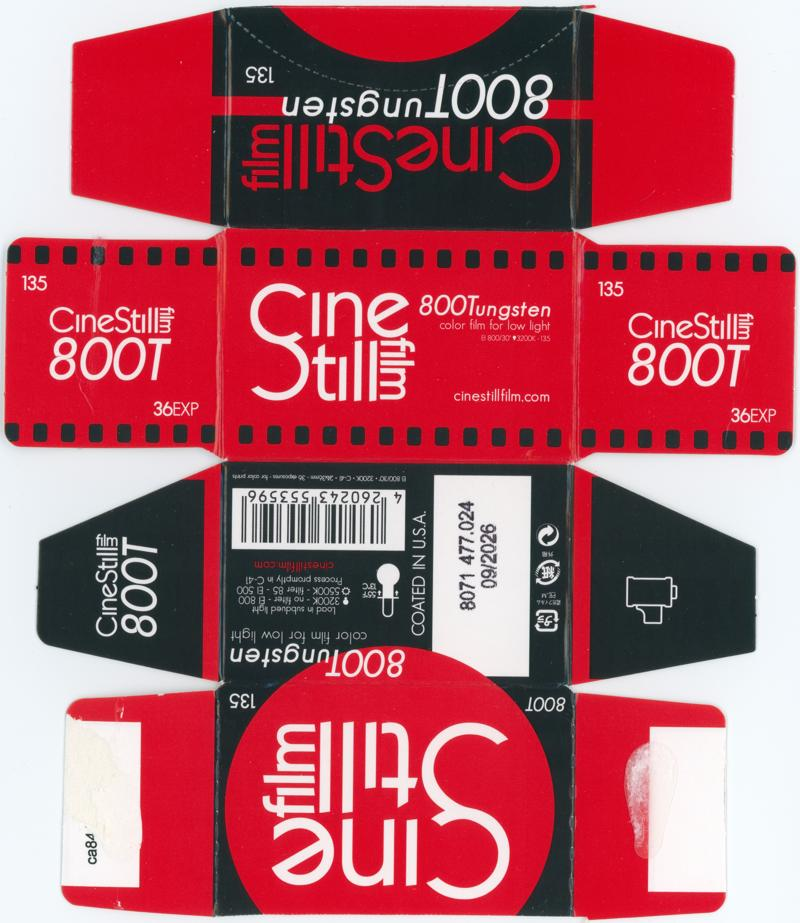
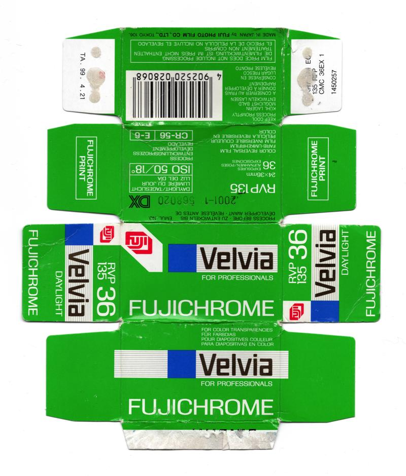
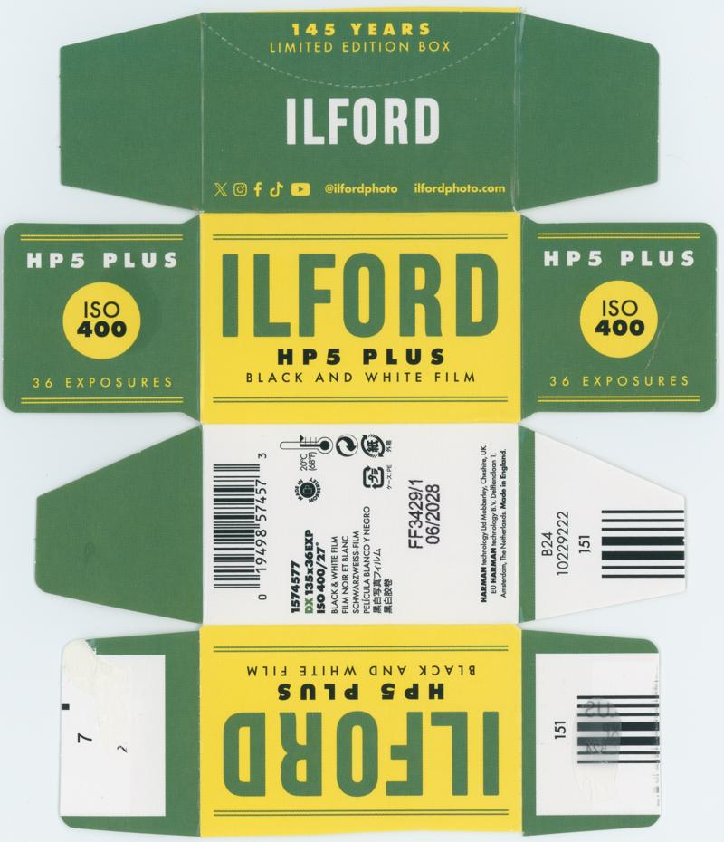
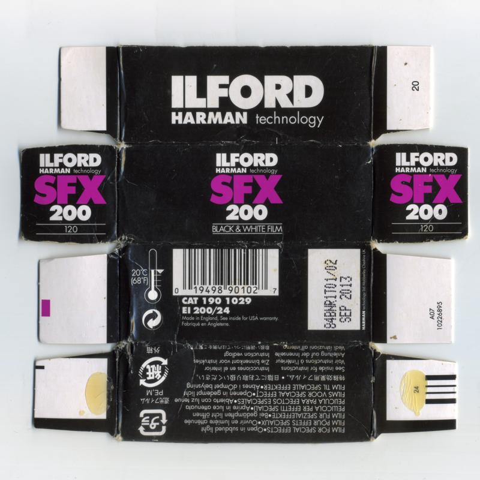
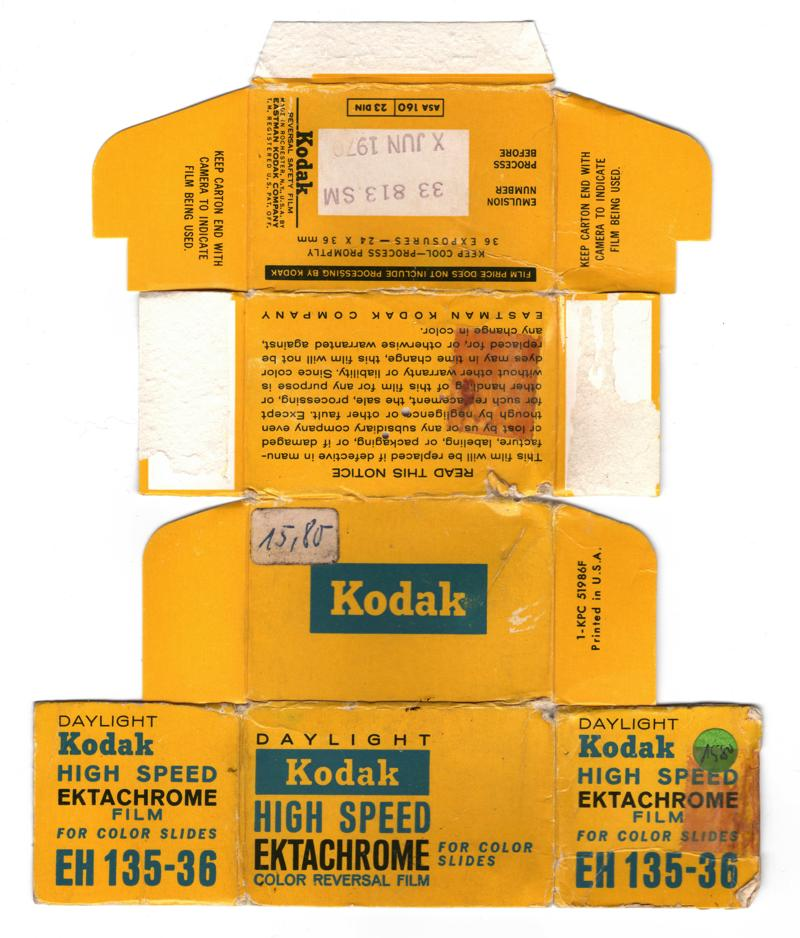
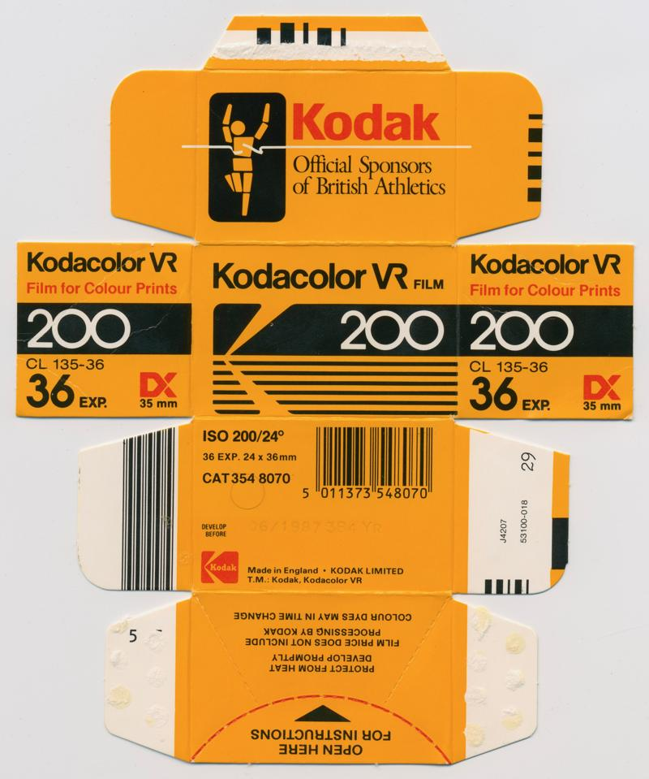
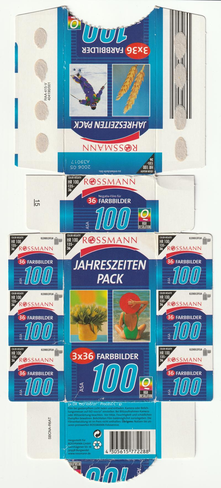

# Film Packaging Archive (Sorted by BRAND)

[Home Page](../README.md) | [GitHub Repo](https://github.com/dekuNukem/Film-Packaging)

-----

Find this useful? Please [credit the project page](../README.md)!

Want to contribute? [Check out the guidelines!](../contribution_guide.md)

👇👇👇👇👇👇👇👇👇👇👇👇👇👇👇👇👇👇👇👇👇👇

🔎🔎 **CLICK IMAGE FOR FULL SIZE** 🔍🔍

☝️☝️☝️☝️☝️☝️☝️☝️☝️☝️☝️☝️☝️☝️☝️☝️☝️☝️☝️☝️☝️☝️

```
Last Updated: Aug 05 2025

# of items: 287
```

-----

- [ADOX KB17 (ref: 2c95)](#adox-kb17-ref-2c95)
- [Agfa APX (ref: 12c7)](#agfa-apx-ref-12c7)
- [Agfa APX (ref: 5276)](#agfa-apx-ref-5276)
- [Agfa Agfacolor XRG (ref: 689e)](#agfa-agfacolor-xrg-ref-689e)
- [Agfa Agfapan Rapid (ref: 5e7b)](#agfa-agfapan-rapid-ref-5e7b)
- [Agfa Autolith Repo (ref: 8e68)](#agfa-autolith-repo-ref-8e68)
- [Agfa Isopan FF (ref: 3700)](#agfa-isopan-ff-ref-3700)
- [Agfa Isopan ISS (ref: 75fa)](#agfa-isopan-iss-ref-75fa)
- [Agfa ULTRA 50 (ref: 4faa)](#agfa-ultra-50-ref-4faa)
- [Agfa Vista (ref: d3af)](#agfa-vista-ref-d3af)
- [Alfo ALFOcolor PR-G (ref: 94b9)](#alfo-alfocolor-pr-g-ref-94b9)
- [Alien Film 5207/250D (ref: 8820)](#alien-film-5207250d-ref-8820)
- [Alien Film 5222/XX (ref: 3e49)](#alien-film-5222xx-ref-3e49)
- [Bergger Pancro400 (ref: ad7b)](#bergger-pancro400-ref-ad7b)
- [Bergger Pancro400 (ref: f619)](#bergger-pancro400-ref-f619)
- [CineStill 800T (ref: c86a)](#cinestill-800t-ref-c86a)
- [CineStill 800T (ref: b3ff)](#cinestill-800t-ref-b3ff)
- [Efiniti UXi super 200 (ref: 471a)](#efiniti-uxi-super-200-ref-471a)
- [Efke IR 820 (ref: 43c9)](#efke-ir-820-ref-43c9)
- [Foma Fomapan (ref: 3e4f)](#foma-fomapan-ref-3e4f)
- [Foma Fomapan (ref: 65ad)](#foma-fomapan-ref-65ad)
- [Foma Fomapan (ref: 0030)](#foma-fomapan-ref-0030)
- [Foma Fomapan (ref: 84a5)](#foma-fomapan-ref-84a5)
- [Foma Fomapan21 (ref: 75d9)](#foma-fomapan21-ref-75d9)
- [Foma Ortho (ref: 89e7)](#foma-ortho-ref-89e7)
- [Fujifilm 200 (ref: 5b41)](#fujifilm-200-ref-5b41)
- [Fujifilm Fujichrome Professional 100D (ref: 439d)](#fujifilm-fujichrome-professional-100d-ref-439d)
- [Fujifilm Fujicolor 100 (ref: 013b)](#fujifilm-fujicolor-100-ref-013b)
- [Fujifilm Fujicolor NPL 160 (ref: d10b)](#fujifilm-fujicolor-npl-160-ref-d10b)
- [Fujifilm Fujicolor Professional (ref: 28da)](#fujifilm-fujicolor-professional-ref-28da)
- [Fujifilm Fujicolor Super HR (ref: aaa0)](#fujifilm-fujicolor-super-hr-ref-aaa0)
- [Fujifilm Fujicolor SuperHG (ref: ee94)](#fujifilm-fujicolor-superhg-ref-ee94)
- [Fujifilm Fujicolor Superia (ref: d1b7)](#fujifilm-fujicolor-superia-ref-d1b7)
- [Fujifilm Fujicolor Superia (ref: 0683)](#fujifilm-fujicolor-superia-ref-0683)
- [Fujifilm NPS (ref: 5e85)](#fujifilm-nps-ref-5e85)
- [Fujifilm Neopan SS Rapid (ref: 9db3)](#fujifilm-neopan-ss-rapid-ref-9db3)
- [Fujifilm Pro 400H (ref: 66e3)](#fujifilm-pro-400h-ref-66e3)
- [Fujifilm Provia 100F (ref: 356d)](#fujifilm-provia-100f-ref-356d)
- [Fujifilm Sensia (ref: a59b)](#fujifilm-sensia-ref-a59b)
- [Fujifilm Superia Reala (ref: a7de)](#fujifilm-superia-reala-ref-a7de)
- [Fujifilm Velvia (ref: 3182)](#fujifilm-velvia-ref-3182)
- [Fujifilm Velvia 100F (ref: f7fb)](#fujifilm-velvia-100f-ref-f7fb)
- [Fujifilm Velvia 100F (ref: 32d4)](#fujifilm-velvia-100f-ref-32d4)
- [GAF Color Slide Film (ref: dea6)](#gaf-color-slide-film-ref-dea6)
- [Harman Phoenix (ref: 8eb4)](#harman-phoenix-ref-8eb4)
- [Harman Phoenix (ref: 637f)](#harman-phoenix-ref-637f)
- [Harman Phoenix II (ref: f686)](#harman-phoenix-ii-ref-f686)
- [Harman Phoenix II (ref: 40df)](#harman-phoenix-ii-ref-40df)
- [Hazenfilm Sorolla Chrome (ref: 889f)](#hazenfilm-sorolla-chrome-ref-889f)
- [Ilford Delta (ref: eb8d)](#ilford-delta-ref-eb8d)
- [Ilford Delta (ref: 920f)](#ilford-delta-ref-920f)
- [Ilford Delta (ref: 9b54)](#ilford-delta-ref-9b54)
- [Ilford FP4 Plus (ref: 76e7)](#ilford-fp4-plus-ref-76e7)
- [Ilford HP5 Plus (ref: 11a8)](#ilford-hp5-plus-ref-11a8)
- [Ilford HP5 Plus (ref: c725)](#ilford-hp5-plus-ref-c725)
- [Ilford HP5 Plus (ref: efad)](#ilford-hp5-plus-ref-efad)
- [Ilford HP5 Plus (ref: 1a5d)](#ilford-hp5-plus-ref-1a5d)
- [Ilford HP5 Plus (ref: df49)](#ilford-hp5-plus-ref-df49)
- [Ilford SFX 200 (ref: 6057)](#ilford-sfx-200-ref-6057)
- [JCH Streetpan (ref: 6e58)](#jch-streetpan-ref-6e58)
- [Jessops Diamond Everyday (ref: 67d3)](#jessops-diamond-everyday-ref-67d3)
- [Kentmere PAN (ref: d223)](#kentmere-pan-ref-d223)
- [Kentmere PAN (ref: c907)](#kentmere-pan-ref-c907)
- [Kentmere PAN (ref: 827e)](#kentmere-pan-ref-827e)
- [Kentmere PAN (ref: a327)](#kentmere-pan-ref-a327)
- [Klick APS Film (ref: 4b88)](#klick-aps-film-ref-4b88)
- [Klick XD200 (ref: 44d7)](#klick-xd200-ref-44d7)
- [Kodak Advantix Ultra (ref: 566b)](#kodak-advantix-ultra-ref-566b)
- [Kodak ColorPlus (ref: 79ca)](#kodak-colorplus-ref-79ca)
- [Kodak ColorPlus (ref: 6637)](#kodak-colorplus-ref-6637)
- [Kodak Eastman High Contrast Panchromatic 7369 (ref: faec)](#kodak-eastman-high-contrast-panchromatic-7369-ref-faec)
- [Kodak Ektachrome (ref: 07c0)](#kodak-ektachrome-ref-07c0)
- [Kodak Ektachrome (ref: 8f62)](#kodak-ektachrome-ref-8f62)
- [Kodak Ektachrome (ref: 3c96)](#kodak-ektachrome-ref-3c96)
- [Kodak Ektachrome (ref: b21e)](#kodak-ektachrome-ref-b21e)
- [Kodak Ektachrome 100 Plus (ref: 5d9f)](#kodak-ektachrome-100-plus-ref-5d9f)
- [Kodak Ektachrome E100 (ref: ae10)](#kodak-ektachrome-e100-ref-ae10)
- [Kodak Ektachrome E100VS (ref: a8d3)](#kodak-ektachrome-e100vs-ref-a8d3)
- [Kodak Ektachrome Elite (ref: 26ef)](#kodak-ektachrome-elite-ref-26ef)
- [Kodak Ektachrome-X (ref: ae7e)](#kodak-ektachrome-x-ref-ae7e)
- [Kodak Ektachrome-X (ref: aec5)](#kodak-ektachrome-x-ref-aec5)
- [Kodak Ektacolor Pro Gold (ref: c3f8)](#kodak-ektacolor-pro-gold-ref-c3f8)
- [Kodak Ektar (ref: 3498)](#kodak-ektar-ref-3498)
- [Kodak Elite Chrome (ref: 523c)](#kodak-elite-chrome-ref-523c)
- [Kodak Gold (ref: f368)](#kodak-gold-ref-f368)
- [Kodak Gold (ref: 2f8d)](#kodak-gold-ref-2f8d)
- [Kodak Gold (ref: ea58)](#kodak-gold-ref-ea58)
- [Kodak Gold (ref: 3e7f)](#kodak-gold-ref-3e7f)
- [Kodak Gold (ref: 933f)](#kodak-gold-ref-933f)
- [Kodak Gold (ref: 855e)](#kodak-gold-ref-855e)
- [Kodak Gold Ultra (ref: 1358)](#kodak-gold-ultra-ref-1358)
- [Kodak High Speed Ektachrome (ref: ce7f)](#kodak-high-speed-ektachrome-ref-ce7f)
- [Kodak High Speed Ektachrome (ref: ec3d)](#kodak-high-speed-ektachrome-ref-ec3d)
- [Kodak High Speed Ektachrome (ref: b8f8)](#kodak-high-speed-ektachrome-ref-b8f8)
- [Kodak High Speed Infrared (ref: 4294)](#kodak-high-speed-infrared-ref-4294)
- [Kodak High Speed Infrared (ref: 883e)](#kodak-high-speed-infrared-ref-883e)
- [Kodak Kodachrome (ref: 6477)](#kodak-kodachrome-ref-6477)
- [Kodak Kodachrome (ref: 3145)](#kodak-kodachrome-ref-3145)
- [Kodak Kodachrome (ref: 8833)](#kodak-kodachrome-ref-8833)
- [Kodak Kodachrome (ref: 3206)](#kodak-kodachrome-ref-3206)
- [Kodak Kodacolor VR (ref: 035f)](#kodak-kodacolor-vr-ref-035f)
- [Kodak Kodacolor VR Plus (ref: f8bf)](#kodak-kodacolor-vr-plus-ref-f8bf)
- [Kodak Kodacolor-X (ref: a4b1)](#kodak-kodacolor-x-ref-a4b1)
- [Kodak Kodacolor-X (ref: 5302)](#kodak-kodacolor-x-ref-5302)
- [Kodak Portra 160 (ref: ce56)](#kodak-portra-160-ref-ce56)
- [Kodak Portra 800 (ref: 7d65)](#kodak-portra-800-ref-7d65)
- [Kodak Rapid Process Copy Film (ref: e66e)](#kodak-rapid-process-copy-film-ref-e66e)
- [Kodak TMAX (ref: 1dff)](#kodak-tmax-ref-1dff)
- [Kodak TMAX (ref: b3b1)](#kodak-tmax-ref-b3b1)
- [Kodak TMAX (ref: 521a)](#kodak-tmax-ref-521a)
- [Kodak TMAX (ref: 43a2)](#kodak-tmax-ref-43a2)
- [Kodak Technical Pan (ref: f4cf)](#kodak-technical-pan-ref-f4cf)
- [Kodak Technical Pan 6415 (ref: 03be)](#kodak-technical-pan-6415-ref-03be)
- [Kodak Tri-X (ref: 88c5)](#kodak-tri-x-ref-88c5)
- [Kodak Tri-X (ref: c671)](#kodak-tri-x-ref-c671)
- [Kodak Ultra (ref: 69a1)](#kodak-ultra-ref-69a1)
- [Kodak UltraMax (ref: aaa6)](#kodak-ultramax-ref-aaa6)
- [Kodak Verichrome Pan (ref: 0195)](#kodak-verichrome-pan-ref-0195)
- [Kodak Värikuvafilmi (ref: f9ff)](#kodak-värikuvafilmi-ref-f9ff)
- [Konica Infrared 750nm (ref: e696)](#konica-infrared-750nm-ref-e696)
- [Konica Infrared 750nm (ref: 2d93)](#konica-infrared-750nm-ref-2d93)
- [Konica VX200 (ref: fe53)](#konica-vx200-ref-fe53)
- [Kosmo Foto Mono (ref: b74f)](#kosmo-foto-mono-ref-b74f)
- [Lloyds Pharmacy APS Film (ref: c7cf)](#lloyds-pharmacy-aps-film-ref-c7cf)
- [Lloyds Pharmacy Colour Film (ref: 77d9)](#lloyds-pharmacy-colour-film-ref-77d9)
- [Lomography Babylon (ref: 7afa)](#lomography-babylon-ref-7afa)
- [Lomography Fantome (ref: 4340)](#lomography-fantome-ref-4340)
- [Lomography Lomochrome Purple (ref: 068f)](#lomography-lomochrome-purple-ref-068f)
- [Lomography Lomochrome Turquoise (ref: 0d90)](#lomography-lomochrome-turquoise-ref-0d90)
- [Lomography Orca (ref: d506)](#lomography-orca-ref-d506)
- [Lomography Tiger (ref: 26dd)](#lomography-tiger-ref-26dd)
- [Minolta Minolta 16 Color Film For Prints (ref: a2ff)](#minolta-minolta-16-color-film-for-prints-ref-a2ff)
- [ORWO NP 20 SL (ref: b16c)](#orwo-np-20-sl-ref-b16c)
- [Perutz Superomnia (ref: c90d)](#perutz-superomnia-ref-c90d)
- [Polaroid 665 (ref: e054)](#polaroid-665-ref-e054)
- [Polaroid 669 (ref: 3566)](#polaroid-669-ref-3566)
- [Polaroid 87 (ref: 62ef)](#polaroid-87-ref-62ef)
- [Polaroid Color 600 Film Round Frame (ref: d985)](#polaroid-color-600-film-round-frame-ref-d985)
- [Polaroid Color SX-70 Film (ref: dc7f)](#polaroid-color-sx-70-film-ref-dc7f)
- [Polaroid GridFilm (ref: 8deb)](#polaroid-gridfilm-ref-8deb)
- [Polaroid PolaBlue 35mm (ref: df66)](#polaroid-polablue-35mm-ref-df66)
- [Polaroid PolaChrome 35mm (ref: 3b60)](#polaroid-polachrome-35mm-ref-3b60)
- [Polaroid PolaPan 35mm (ref: 9825)](#polaroid-polapan-35mm-ref-9825)
- [Polaroid Polacolor 679 (ref: 625c)](#polaroid-polacolor-679-ref-625c)
- [Porst Color N21 (ref: 494a)](#porst-color-n21-ref-494a)
- [Rollei Infrared (ref: eae2)](#rollei-infrared-ref-eae2)
- [Rollei Infrared (ref: 4f54)](#rollei-infrared-ref-4f54)
- [Rollei RPX 400 (ref: 2155)](#rollei-rpx-400-ref-2155)
- [Rollei Retro 80S (ref: e6c0)](#rollei-retro-80s-ref-e6c0)
- [Rollei SUPERPAN (ref: ee8f)](#rollei-superpan-ref-ee8f)
- [Rossmann Jahreszeiten Pack (ref: 7670)](#rossmann-jahreszeiten-pack-ref-7670)
- [Sakura Sakuracolor II (ref: 4f7d)](#sakura-sakuracolor-ii-ref-4f7d)
- [SantaColor SantaColor (ref: cb58)](#santacolor-santacolor-ref-cb58)
- [SantaColor SantaColor (ref: f3a7)](#santacolor-santacolor-ref-f3a7)
- [Shanghai GP3 (ref: 52aa)](#shanghai-gp3-ref-52aa)
- [Svema Foto (ref: 26ad)](#svema-foto-ref-26ad)
- [Tasma OCh 50 (ref: 5c43)](#tasma-och-50-ref-5c43)
- [Three Film Rolls 5207 (ref: 0292)](#three-film-rolls-5207-ref-0292)
- [Wolfen NC500 (ref: 91c1)](#wolfen-nc500-ref-91c1)
- [Wolfen NP100 (ref: 71a6)](#wolfen-np100-ref-71a6)
- [York Photo Labs DXG 200 (ref: 4bf8)](#york-photo-labs-dxg-200-ref-4bf8)


-----

#### ADOX KB17 (ref: 2c95)

```
Format: 35mm         |  Process: BW       
ISO   : 40           |  Expiry : 1964-01  
Added : 2025-05-24   |  Author : dekuNukem
UUID  : 14047842e1a641268bfd4d01fcf02c95
```

<a href="./archive/00065_000.jpg">
	
</a>


`UUID: 04f60deb3d044553a9d662db1d30d3b7`↓

<a href="./archive/00065_001.jpg">
	
</a>

#### Agfa APX (ref: 12c7)

```
Format: 120          |  Process: BW       
ISO   : 100          |  Expiry : 2008-07  
Added : 2025-01-04   |  Author : dekuNukem
UUID  : a20bbca534454915a6970b6ede2212c7
```

<a href="./archive/00011_000.jpg">
	
</a>


`UUID: dd262792b6a446dcab73a07738f8a8dd`↓

<a href="./archive/00011_001.jpg">
	
</a>

#### Agfa APX (ref: 5276)

```
Format: 35mm         |  Process: BW       
ISO   : 100          |  Expiry : 2028-05  
Added : 2025-07-28   |  Author : lilyu.xyz
UUID  : ecf4e081ccf64a9a8606601f9f665276
```

<a href="./archive/00093_000.jpg">
	
</a>


`UUID: 286ea2dbf5394a36b8f013b9aaa33a46`↓

<a href="./archive/00093_001.jpg">
	
</a>

#### Agfa Agfacolor XRG (ref: 689e)

```
Format: 35mm         |  Process: C-41     
ISO   : 200          |  Expiry : 2005-03  
Added : 2025-07-31   |  Author : stefanie 
UUID  : 86136eea89d14e15b60dfcdf45b1689e
```

<a href="./archive/00152_000.jpg">
	
</a>


`UUID: 5598d8aac5844772a87d019a7d37e9f6`↓

<a href="./archive/00152_001.jpg">
	
</a>

#### Agfa Agfapan Rapid (ref: 5e7b)

```
Format: 35mm         |  Process: BW       
ISO   : 40           |  Expiry : 1969-02  
Added : 2025-07-31   |  Author : The Compartmentalist
UUID  : b2470c1734d344698f6e1c01eaa85e7b
```

<a href="./archive/00115_000.jpg">
	
</a>

#### Agfa Autolith Repo (ref: 8e68)

```
Format: 9x12         |  Process: BW       
ISO   : Unknown      |  Expiry : Unknown  
Added : 2025-07-29   |  Author : Nano_Burger
UUID  : 952823ad9ef14c75a83ac8e230b38e68
```

<a href="./archive/00098_000.jpg">
	
</a>

#### Agfa Isopan FF (ref: 3700)

```
Format: 35mm         |  Process: BW       
ISO   : 8            |  Expiry : 1946-10  
Added : 2025-07-29   |  Author : Nano_Burger
UUID  : 9ea6437ea85442048ffe63b8b64c3700
```

<a href="./archive/00101_000.jpg">
	
</a>

#### Agfa Isopan ISS (ref: 75fa)

```
Format: 35mm         |  Process: BW       
ISO   : 100          |  Expiry : 1963-11  
Added : 2025-07-31   |  Author : Pelicram 
UUID  : cdcaa912ee0142c3b76eb1500e2375fa
```

<a href="./archive/00148_000.jpg">
	
</a>

#### Agfa ULTRA 50 (ref: 4faa)

```
Format: 35mm         |  Process: C-41     
ISO   : 50           |  Expiry : 2001-10  
Added : 2025-01-04   |  Author : dekuNukem
UUID  : d10e846ba5154f1d940ed7009a904faa
```

<a href="./archive/00010_000.jpg">
	
</a>


`UUID: 8594d11f816c45b6a18dd122f8e38fc0`↓

<a href="./archive/00010_001.jpg">
	
</a>

#### Agfa Vista (ref: d3af)

```
Format: 35mm         |  Process: C-41     
ISO   : 200          |  Expiry : 2003-12  
Added : 2025-01-04   |  Author : dekuNukem
UUID  : f1e50745927f4b7cb16af36fd30dd3af
```

<a href="./archive/00014_000.jpg">
	
</a>


`UUID: 300a430fc19f4eeeb4892e58d3c3cd56`↓

<a href="./archive/00014_001.jpg">
	
</a>

#### Alfo ALFOcolor PR-G (ref: 94b9)

```
Format: 35mm         |  Process: C-41     
ISO   : 1600         |  Expiry : 1993-08  
Added : 2025-07-31   |  Author : stefanie 
UUID  : cc723aa89e9e43ec8ac1ebd18efa94b9
```

<a href="./archive/00151_000.jpg">
	
</a>

#### Alien Film 5207/250D (ref: 8820)

```
Format: 120          |  Process: ECN-2    
ISO   : 250          |  Expiry : 2026-06  
Added : 2025-01-04   |  Author : dekuNukem
UUID  : aedc4b00bd174e0baf7c744ed21d8820
```

<a href="./archive/00001_000.jpg">
	
</a>

#### Alien Film 5222/XX (ref: 3e49)

```
Format: 35mm         |  Process: BW       
ISO   : 250          |  Expiry : 2024-06  
Added : 2025-05-24   |  Author : dekuNukem
UUID  : 9984ed6c13cd4be496e7e4b58e313e49
```

<a href="./archive/00057_000.jpg">
	
</a>

#### Bergger Pancro400 (ref: ad7b)

```
Format: 120          |  Process: BW       
ISO   : 400          |  Expiry : 2026-03  
Added : 2025-07-31   |  Author : Pelicram 
UUID  : 73396128854a4c6ab3723a549225ad7b
```

<a href="./archive/00124_000.jpg">
	
</a>


`UUID: 5643e1130f1949c48dfdeddc7c7a955f`↓

<a href="./archive/00124_001.jpg">
	
</a>

#### Bergger Pancro400 (ref: f619)

```
Format: 35mm         |  Process: BW       
ISO   : 400          |  Expiry : 2026-12  
Added : 2025-07-31   |  Author : Pelicram 
UUID  : 0d9fee6b29f445f089acde3247d1f619
```

<a href="./archive/00123_000.jpg">
	
</a>


`UUID: 29d10e873e704093bd65148f288f968b`↓

<a href="./archive/00123_001.jpg">
	
</a>

#### CineStill 800T (ref: c86a)

```
Format: 120          |  Process: C-41     
ISO   : 800          |  Expiry : 2018-03  
Added : 2025-01-04   |  Author : dekuNukem
UUID  : 53253eca96d841f5b98bfb3590fec86a
```

<a href="./archive/00006_000.jpg">
	
</a>


`UUID: 6576b3b48e8244469a692f2e0edcd1a6`↓

<a href="./archive/00006_001.jpg">
	
</a>

#### CineStill 800T (ref: b3ff)

```
Format: 35mm         |  Process: C-41     
ISO   : 800          |  Expiry : 2026-09  
Added : 2025-07-22   |  Author : @SirBrentsworth
UUID  : 81978ca6f6d048b3a759dffdb80fb3ff
```

<a href="./archive/00085_000.jpg">
	
</a>


`UUID: fbd9b946fd4d46f8a45a46112dcd16ae`↓

<a href="./archive/00085_001.jpg">
	
</a>

#### Efiniti UXi super 200 (ref: 471a)

```
Format: 35mm         |  Process: C-41     
ISO   : 200          |  Expiry : 2013-10  
Added : 2025-01-04   |  Author : dekuNukem
UUID  : cde1122dafbc47088a11d9ee12b6471a
```

<a href="./archive/00002_000.jpg">
	
</a>

#### Efke IR 820 (ref: 43c9)

```
Format: 120          |  Process: BW       
ISO   : 100          |  Expiry : 2013-03  
Added : 2025-01-05   |  Author : dekuNukem
UUID  : 716e410a3823476e9befa704361f43c9
```

<a href="./archive/00038_000.jpg">
	
</a>


`UUID: 4c7b545000f04f4da046d18c43575e19`↓

<a href="./archive/00038_001.jpg">
	
</a>

#### Foma Fomapan (ref: 3e4f)

```
Format: 120          |  Process: BW       
ISO   : 200          |  Expiry : 2027-03  
Added : 2025-06-05   |  Author : benikum  
UUID  : 7be1cb0047f14034a7386cd7b1843e4f
```

<a href="./archive/00070_000.jpg">
	
</a>


`UUID: b049b10ae15b40319e7b70fed1ccbd71`↓

<a href="./archive/00070_001.jpg">
	
</a>

#### Foma Fomapan (ref: 65ad)

```
Format: 120          |  Process: BW       
ISO   : 100          |  Expiry : 2027-04  
Added : 2025-07-31   |  Author : Pelicram 
UUID  : a0786cc1bc884f66bbb84118d55665ad
```

<a href="./archive/00133_000.jpg">
	
</a>


`UUID: 0d7f7062ffb34d0c91f0080e3749cbe4`↓

<a href="./archive/00133_001.jpg">
	
</a>

#### Foma Fomapan (ref: 0030)

```
Format: 35mm         |  Process: BW       
ISO   : 100          |  Expiry : 2027-07  
Added : 2025-07-31   |  Author : Pelicram 
UUID  : bf1734a1ea48495d92afb7d03bdf0030
```

<a href="./archive/00129_000.jpg">
	
</a>


`UUID: 01adf7d0b4df41f990c60d5cafb7f55f`↓

<a href="./archive/00129_001.jpg">
	
</a>

#### Foma Fomapan (ref: 84a5)

```
Format: 35mm         |  Process: BW       
ISO   : 200          |  Expiry : 2028-01  
Added : 2025-07-28   |  Author : lilyu.xyz
UUID  : c3d51159b481435b90dbe2411de784a5
```

<a href="./archive/00092_000.jpg">
	
</a>


`UUID: ae13defc8e3d43e2988974430ea63335`↓

<a href="./archive/00092_001.jpg">
	
</a>

#### Foma Fomapan21 (ref: 75d9)

```
Format: 120          |  Process: BW       
ISO   : 100          |  Expiry : 1971-04  
Added : 2025-06-21   |  Author : benikum  
UUID  : 098e510bfaa14be39697b9d8218475d9
```

<a href="./archive/00074_000.jpg">
	
</a>

#### Foma Ortho (ref: 89e7)

```
Format: 120          |  Process: BW       
ISO   : 400          |  Expiry : 2026-04  
Added : 2025-07-31   |  Author : Pelicram 
UUID  : 4c97e2b7413b42278b0fd129c1c589e7
```

<a href="./archive/00127_000.jpg">
	
</a>


`UUID: 728d195752464a448163dbb0ad4e8aa0`↓

<a href="./archive/00127_001.jpg">
	
</a>

#### Fujifilm 200 (ref: 5b41)

```
Format: 35mm         |  Process: C-41     
ISO   : 200          |  Expiry : 2026-06  
Added : 2025-06-05   |  Author : Yrikonchik
UUID  : fe02d85cb9294ee2ba64e8543ce65b41
```

<a href="./archive/00073_000.jpg">
	
</a>

#### Fujifilm Fujichrome Professional 100D (ref: 439d)

```
Format: 120          |  Process: E-6      
ISO   : 100          |  Expiry : 1992-12  
Added : 2025-01-05   |  Author : dekuNukem
UUID  : 5dcdd19ddf654415b7eac69183e7439d
```

<a href="./archive/00032_000.jpg">
	
</a>


`UUID: 2e00754170744438a318b7f71da1c977`↓

<a href="./archive/00032_001.jpg">
	
</a>


`UUID: 2d0ef64e672342509bad0f88d7908974`↓

<a href="./archive/00032_002.jpg">
	
</a>

#### Fujifilm Fujicolor 100 (ref: 013b)

```
Format: 35mm         |  Process: C-41     
ISO   : 100          |  Expiry : 2010-07  
Added : 2025-01-12   |  Author : b0baspace
UUID  : 27d88b35933b4ede958b5b5b5b42013b
```

<a href="./archive/00040_000.jpg">
	
</a>

#### Fujifilm Fujicolor NPL 160 (ref: d10b)

```
Format: 120          |  Process: C-41     
ISO   : 160          |  Expiry : 1998-07  
Added : 2025-01-05   |  Author : dekuNukem
UUID  : ce40cc432d9e445b987fdd72fd88d10b
```

<a href="./archive/00034_000.jpg">
	
</a>


`UUID: 2e3f349e094b49d8ba6e026a98eb1455`↓

<a href="./archive/00034_001.jpg">
	
</a>


`UUID: 10efb3e22574460db3db552e55684945`↓

<a href="./archive/00034_002.jpg">
	
</a>

#### Fujifilm Fujicolor Professional (ref: 28da)

```
Format: 35mm         |  Process: C-41     
ISO   : 100          |  Expiry : 2012-02  
Added : 2025-07-31   |  Author : The Compartmentalist
UUID  : cb85af928a7f454e9673960e22b428da
```

<a href="./archive/00117_000.jpg">
	
</a>

#### Fujifilm Fujicolor Super HR (ref: aaa0)

```
Format: 35mm         |  Process: C-41     
ISO   : 200          |  Expiry : 1990-02  
Added : 2025-01-04   |  Author : dekuNukem
UUID  : 2d27c9a865aa4de19ad8dc0bcdc8aaa0
```

<a href="./archive/00007_000.jpg">
	
</a>


`UUID: a179b7257aaf455fa69df546545457f6`↓

<a href="./archive/00007_001.jpg">
	
</a>


`UUID: e5688fcb7e8943a987ca6b882275ca7b`↓

<a href="./archive/00007_002.jpg">
	
</a>

#### Fujifilm Fujicolor SuperHG (ref: ee94)

```
Format: 35mm         |  Process: C-41     
ISO   : 100          |  Expiry : 1994-07  
Added : 2025-07-31   |  Author : stefanie 
UUID  : 9233714654ff481089c2d4ff1334ee94
```

<a href="./archive/00150_000.jpg">
	
</a>


`UUID: 302969081f4442239212b8e123d38378`↓

<a href="./archive/00150_001.jpg">
	
</a>

#### Fujifilm Fujicolor Superia (ref: d1b7)

```
Format: 35mm         |  Process: C-41     
ISO   : 200          |  Expiry : 2000-07  
Added : 2025-07-31   |  Author : Pelicram 
UUID  : 2b50b3d82a7340ffbe9bff871793d1b7
```

<a href="./archive/00139_000.jpg">
	
</a>


`UUID: a193a13c20a24dada68357552593974f`↓

<a href="./archive/00139_001.jpg">
	
</a>

#### Fujifilm Fujicolor Superia (ref: 0683)

```
Format: 120          |  Process: C-41     
ISO   : 400          |  Expiry : 2002-05  
Added : 2025-01-04   |  Author : dekuNukem
UUID  : c3d9e51d22e241f69133be30d5a00683
```

<a href="./archive/00012_000.jpg">
	
</a>


`UUID: 5cd39510c35f4b9cbae3089311db118f`↓

<a href="./archive/00012_001.jpg">
	
</a>

#### Fujifilm NPS (ref: 5e85)

```
Format: 35mm         |  Process: C-41     
ISO   : 160          |  Expiry : 2003-08  
Added : 2025-02-04   |  Author : b0baspace
UUID  : 576142521c2f4fe5abc387032bcc5e85
```

<a href="./archive/00053_000.jpg">
	
</a>


`UUID: a11cf7e8abea41a8854da816157269c4`↓

<a href="./archive/00053_001.jpg">
	
</a>

#### Fujifilm Neopan SS Rapid (ref: 9db3)

```
Format: 35mm         |  Process: BW       
ISO   : 100          |  Expiry : 1975-02  
Added : 2025-07-31   |  Author : The Compartmentalist
UUID  : 1c541b4c837944d788eab8986f349db3
```

<a href="./archive/00118_000.jpg">
	
</a>

#### Fujifilm Pro 400H (ref: 66e3)

```
Format: 120          |  Process: C-41     
ISO   : 400          |  Expiry : 2018-09  
Added : 2025-01-04   |  Author : dekuNukem
UUID  : 0d89ecf11f3c46deb52171aa909566e3
```

<a href="./archive/00022_000.jpg">
	
</a>

#### Fujifilm Provia 100F (ref: 356d)

```
Format: 35mm         |  Process: E-6      
ISO   : 100          |  Expiry : 2020-09  
Added : 2025-02-21   |  Author : @seklerek
UUID  : a3603dbdd8ca49b893c8ce2bc76f356d
```

<a href="./archive/00055_000.jpg">
	
</a>

#### Fujifilm Sensia (ref: a59b)

```
Format: 35mm         |  Process: E-6      
ISO   : 100          |  Expiry : 1998-01  
Added : 2025-07-31   |  Author : The Compartmentalist
UUID  : d4fdfa0d829f4fcab984381a31f2a59b
```

<a href="./archive/00116_000.jpg">
	
</a>


`UUID: 4f21cef93ed3401caed74619ffa2b595`↓

<a href="./archive/00116_001.jpg">
	
</a>

#### Fujifilm Superia Reala (ref: a7de)

```
Format: 35mm         |  Process: C-41     
ISO   : 100          |  Expiry : 2007-04  
Added : 2025-07-28   |  Author : @recycling.film
UUID  : bab5fa204b25431a9872c4ce8e9aa7de
```

<a href="./archive/00087_000.jpg">
	
</a>

#### Fujifilm Velvia (ref: 3182)

```
Format: 35mm         |  Process: E-6      
ISO   : 50           |  Expiry : 2001-01  
Added : 2025-01-14   |  Author : @ob.skura
UUID  : 9b9ee1c1c0e94d968674987799d33182
```

<a href="./archive/00044_000.jpg">
	
</a>


`UUID: 2e2e20a0b57542e4908ad9fc825e7e76`↓

<a href="./archive/00044_001.jpg">
	
</a>


`UUID: 03951cb49c8a44229aa4b5760744fc6f`↓

<a href="./archive/00044_002.jpg">
	
</a>

#### Fujifilm Velvia 100F (ref: f7fb)

```
Format: 120          |  Process: E-6      
ISO   : 100          |  Expiry : 2006-04  
Added : 2025-01-04   |  Author : dekuNukem
UUID  : 0fef128c3b17437eb25d5c4f0520f7fb
```

<a href="./archive/00023_000.jpg">
	
</a>

#### Fujifilm Velvia 100F (ref: 32d4)

```
Format: 35mm         |  Process: E-6      
ISO   : 100          |  Expiry : 2007-03  
Added : 2025-02-21   |  Author : @seklerek
UUID  : ce5c1d786286427ba5633091b06432d4
```

<a href="./archive/00056_000.jpg">
	
</a>

#### GAF Color Slide Film (ref: dea6)

```
Format: 126          |  Process: AR-1     
ISO   : 64           |  Expiry : 1974-01  
Added : 2025-02-04   |  Author : b0baspace
UUID  : c426ea17398c4c549c6a2720103adea6
```

<a href="./archive/00054_000.jpg">
	
</a>


`UUID: f8987f712bca4daaae3f732500332332`↓

<a href="./archive/00054_001.jpg">
	
</a>


`UUID: 02c9a3b0b9f547c4ab3cabb2d1173fdf`↓

<a href="./archive/00054_002.jpg">
	
</a>


`UUID: a332a7492f2b4a708c8a0ead5b9af986`↓

<a href="./archive/00054_003.jpg">
	
</a>


`UUID: dd9347600c9a47299504239d1038f0dd`↓

<a href="./archive/00054_004.jpg">
	
</a>


`UUID: 90cc6194552d42dd873d9af54a9bc283`↓

<a href="./archive/00054_005.jpg">
	
</a>

#### Harman Phoenix (ref: 8eb4)

```
Format: 35mm         |  Process: C-41     
ISO   : 200          |  Expiry : 2025-12  
Added : 2025-06-25   |  Author : yc128    
UUID  : 2fe522ef01b84a9aa6263807135f8eb4
```

<a href="./archive/00076_000.jpg">
	
</a>


`UUID: a7a70b20b4224baeb85c732245eb31d1`↓

<a href="./archive/00076_001.jpg">
	
</a>

#### Harman Phoenix (ref: 637f)

```
Format: 120          |  Process: C-41     
ISO   : 200          |  Expiry : 2026-08  
Added : 2025-01-04   |  Author : dekuNukem
UUID  : 0b11ba38c9a34f58a2f13d696b05637f
```

<a href="./archive/00004_000.jpg">
	
</a>


`UUID: c5a0132ac51a488ba35ebd6cc48911e7`↓

<a href="./archive/00004_001.jpg">
	
</a>

#### Harman Phoenix II (ref: f686)

```
Format: 120          |  Process: C-41     
ISO   : 200          |  Expiry : 2027-06  
Added : 2025-07-30   |  Author : yc128    
UUID  : 42f9d40379814cf8b02c3f0daf74f686
```

<a href="./archive/00109_000.jpg">
	
</a>


`UUID: db80264f66ae451abd1b0cc6f34e3280`↓

<a href="./archive/00109_001.jpg">
	
</a>

#### Harman Phoenix II (ref: 40df)

```
Format: 35mm         |  Process: C-41     
ISO   : 200          |  Expiry : 2027-06  
Added : 2025-07-30   |  Author : yc128    
UUID  : f12ed23e31e14008a969fe05f29940df
```

<a href="./archive/00110_000.jpg">
	
</a>


`UUID: b6dcbe9ae6ea4aebabaf290f3160a553`↓

<a href="./archive/00110_001.jpg">
	
</a>

#### Hazenfilm Sorolla Chrome (ref: 889f)

```
Format: 35mm         |  Process: E-6      
ISO   : 100          |  Expiry : 2026-08  
Added : 2025-07-31   |  Author : Pelicram 
UUID  : 462e32d45cd740cf866732a73a00889f
```

<a href="./archive/00137_000.jpg">
	
</a>

#### Ilford Delta (ref: eb8d)

```
Format: 120          |  Process: BW       
ISO   : 100          |  Expiry : 2024-08  
Added : 2025-01-21   |  Author : @ob.skura
UUID  : e39c5eca4e3e4e5badfa00ee512deb8d
```

<a href="./archive/00048_000.jpg">
	
</a>


`UUID: e4c76c5b957347178af448f4aa6001d0`↓

<a href="./archive/00048_001.jpg">
	
</a>

#### Ilford Delta (ref: 920f)

```
Format: 120          |  Process: BW       
ISO   : 3200         |  Expiry : 2025-05  
Added : 2025-07-31   |  Author : Pelicram 
UUID  : 78d1111d1b234dcfb272c00d7935920f
```

<a href="./archive/00125_000.jpg">
	
</a>


`UUID: 06dcb1f1f350482ba935ad30bd5a42b6`↓

<a href="./archive/00125_001.jpg">
	
</a>

#### Ilford Delta (ref: 9b54)

```
Format: 35mm         |  Process: BW       
ISO   : 3200         |  Expiry : 2027-06  
Added : 2025-07-31   |  Author : Pelicram 
UUID  : d6f377dbe74745a0aacdf51ce7669b54
```

<a href="./archive/00126_000.jpg">
	
</a>


`UUID: 3921b5a404564bb2b4231bf59d22e6d3`↓

<a href="./archive/00126_001.jpg">
	
</a>

#### Ilford FP4 Plus (ref: 76e7)

```
Format: 120          |  Process: BW       
ISO   : 125          |  Expiry : 2026-04  
Added : 2025-07-30   |  Author : yc128    
UUID  : c6c88d6d009048e9ac3721bdc7f076e7
```

<a href="./archive/00111_000.jpg">
	
</a>


`UUID: 95c6d78d0b0540a9ba70dc769609a112`↓

<a href="./archive/00111_001.jpg">
	
</a>

#### Ilford HP5 Plus (ref: 11a8)

```
Format: 120          |  Process: BW       
ISO   : 400          |  Expiry : 2012-06  
Added : 2025-07-31   |  Author : Pelicram 
UUID  : dbf3817f506a444b9d394745dba311a8
```

<a href="./archive/00140_000.jpg">
	
</a>


`UUID: 17ab4481b81243c9bbc211688ba2336a`↓

<a href="./archive/00140_001.jpg">
	
</a>

#### Ilford HP5 Plus (ref: c725)

```
Format: 35mm         |  Process: BW       
ISO   : 400          |  Expiry : 2022-08  
Added : 2025-07-28   |  Author : @recycling.film
UUID  : fcbc3377fa3d4ca9b58779f86ed7c725
```

<a href="./archive/00090_000.jpg">
	
</a>

#### Ilford HP5 Plus (ref: efad)

```
Format: 120          |  Process: BW       
ISO   : 400          |  Expiry : 2025-11  
Added : 2025-01-04   |  Author : dekuNukem
UUID  : ddf9b76e633f43718144af7dcb89efad
```

<a href="./archive/00016_000.jpg">
	
</a>


`UUID: 1d938d2d844d498caf9fe2bc83618dda`↓

<a href="./archive/00016_001.jpg">
	
</a>

#### Ilford HP5 Plus (ref: 1a5d)

```
Format: 120          |  Process: BW       
ISO   : 400          |  Expiry : 2026-09  
Added : 2025-01-04   |  Author : dekuNukem
UUID  : 36151f6b7cc045c2b43d7f5cbee41a5d
```

<a href="./archive/00000_000.jpg">
	
</a>


`UUID: 3d64b751d4dd412889855a65731d5f25`↓

<a href="./archive/00000_001.jpg">
	
</a>

#### Ilford HP5 Plus (ref: df49)

```
Format: 35mm         |  Process: BW       
ISO   : 400          |  Expiry : 2028-06  
Added : 2025-07-22   |  Author : @SirBrentsworth
UUID  : 8db6d8343d544c21bfd539c32525df49
```

<a href="./archive/00083_000.jpg">
	
</a>


`UUID: aa635d75717e4083a0ab53a0c2e1b892`↓

<a href="./archive/00083_001.jpg">
	
</a>

#### Ilford SFX 200 (ref: 6057)

```
Format: 120          |  Process: BW       
ISO   : 200          |  Expiry : 2013-09  
Added : 2025-01-04   |  Author : dekuNukem
UUID  : 7856b5442362453caa67628c93be6057
```

<a href="./archive/00009_000.jpg">
	
</a>


`UUID: 2579a55634474187bac08797a02f422d`↓

<a href="./archive/00009_001.jpg">
	
</a>

#### JCH Streetpan (ref: 6e58)

```
Format: 35mm         |  Process: BW       
ISO   : 400          |  Expiry : 2025-02  
Added : 2025-07-31   |  Author : Pelicram 
UUID  : 1873b4d20d2a47659ab15d0af4146e58
```

<a href="./archive/00132_000.jpg">
	
</a>


`UUID: 19dfce255f604980b0f596b8895d923f`↓

<a href="./archive/00132_001.jpg">
	
</a>

#### Jessops Diamond Everyday (ref: 67d3)

```
Format: APS          |  Process: C-41     
ISO   : 200          |  Expiry : 2006-10  
Added : 2025-01-05   |  Author : dekuNukem
UUID  : b53e5c167866448d812a4dc8e85967d3
```

<a href="./archive/00033_000.jpg">
	
</a>

#### Kentmere PAN (ref: d223)

```
Format: 35mm         |  Process: BW       
ISO   : 400          |  Expiry : 2026-09  
Added : 2025-05-24   |  Author : dekuNukem
UUID  : e876f866f1e9430494356ad098c7d223
```

<a href="./archive/00058_000.jpg">
	
</a>


`UUID: ecc653f10f124afe9b4225edb7e06587`↓

<a href="./archive/00058_001.jpg">
	
</a>

#### Kentmere PAN (ref: c907)

```
Format: 35mm         |  Process: BW       
ISO   : 100          |  Expiry : 2028-11  
Added : 2025-07-22   |  Author : @SirBrentsworth
UUID  : c4c934a23c59430f8b99c71a9322c907
```

<a href="./archive/00082_000.jpg">
	
</a>


`UUID: c91fc253637a47dc8507a7dab7d38475`↓

<a href="./archive/00082_001.jpg">
	
</a>

#### Kentmere PAN (ref: 827e)

```
Format: 35mm         |  Process: BW       
ISO   : 400          |  Expiry : 2029-06  
Added : 2025-01-04   |  Author : dekuNukem
UUID  : d2cf9753f6fd49a78404c72d848a827e
```

<a href="./archive/00015_000.jpg">
	
</a>


`UUID: 3514628a650741c8abb104047d809f55`↓

<a href="./archive/00015_001.jpg">
	
</a>

#### Kentmere PAN (ref: a327)

```
Format: 35mm         |  Process: BW       
ISO   : 400          |  Expiry : 2029-07  
Added : 2025-07-31   |  Author : Pelicram 
UUID  : 58f2bea3a3204a1dafebf2881d99a327
```

<a href="./archive/00145_000.jpg">
	
</a>


`UUID: c771fff8ecbb4c9b981f3606dd4fa428`↓

<a href="./archive/00145_001.jpg">
	
</a>

#### Klick APS Film (ref: 4b88)

```
Format: APS          |  Process: C-41     
ISO   : 200          |  Expiry : 2006-10  
Added : 2025-05-24   |  Author : dekuNukem
UUID  : 1dc3d9dbb8bb42b4acfbfbe0737a4b88
```

<a href="./archive/00063_000.jpg">
	
</a>


`UUID: dff53610cf16453fb97135efcc0eed86`↓

<a href="./archive/00063_001.jpg">
	
</a>

#### Klick XD200 (ref: 44d7)

```
Format: 110          |  Process: C-41     
ISO   : 200          |  Expiry : 1998-02  
Added : 2025-05-24   |  Author : dekuNukem
UUID  : 2276628aa2794442ae81221329fc44d7
```

<a href="./archive/00062_000.jpg">
	
</a>

#### Kodak Advantix Ultra (ref: 566b)

```
Format: APS          |  Process: C-41     
ISO   : 200          |  Expiry : 2006-08  
Added : 2025-05-24   |  Author : dekuNukem
UUID  : 041622f239024ffb8b75c367619a566b
```

<a href="./archive/00066_000.jpg">
	
</a>

#### Kodak ColorPlus (ref: 79ca)

```
Format: 35mm         |  Process: C-41     
ISO   : 200          |  Expiry : 2025-08  
Added : 2025-07-22   |  Author : @SirBrentsworth
UUID  : 087223fc24654e3882a4596e3cea79ca
```

<a href="./archive/00084_000.jpg">
	
</a>

#### Kodak ColorPlus (ref: 6637)

```
Format: 35mm         |  Process: C-41     
ISO   : 200          |  Expiry : 2026-08  
Added : 2025-07-28   |  Author : @recycling.film
UUID  : bd00cd25958d4108a7501bf4be9d6637
```

<a href="./archive/00091_000.jpg">
	
</a>

#### Kodak Eastman High Contrast Panchromatic 7369 (ref: faec)

```
Format: 16mm         |  Process: D-97     
ISO   : Unknown      |  Expiry : Unknown  
Added : 2025-07-29   |  Author : Nano_Burger
UUID  : 46cc0a179fc34cb4832e1d3336bafaec
```

<a href="./archive/00099_000.jpg">
	
</a>

#### Kodak Ektachrome (ref: 07c0)

```
Format: 110          |  Process: Unknown  
ISO   : 64           |  Expiry : 1979-10  
Added : 2025-01-04   |  Author : dekuNukem
UUID  : 8131d8c6fbf14016be9c17a2586b07c0
```

<a href="./archive/00025_000.jpg">
	
</a>

#### Kodak Ektachrome (ref: 8f62)

```
Format: Super 8      |  Process: Unknown  
ISO   : 160          |  Expiry : 1980-11  
Added : 2025-07-31   |  Author : stefanie 
UUID  : 6032680a3aba41b39c600d7e23998f62
```

<a href="./archive/00154_000.jpg">
	
</a>


`UUID: 28c6f19bd37e4199a072687d11b19961`↓

<a href="./archive/00154_001.jpg">
	
</a>


`UUID: 5d06a8833e0e44e8ab8d53bc0ce11095`↓

<a href="./archive/00154_002.jpg">
	
</a>


`UUID: 870ff01807e949a7b361cdad01dddf7f`↓

<a href="./archive/00154_003.jpg">
	
</a>


`UUID: 31df442b386446679540b0cf52c92fd7`↓

<a href="./archive/00154_004.jpg">
	
</a>

#### Kodak Ektachrome (ref: 3c96)

```
Format: 35mm         |  Process: E-6      
ISO   : 400          |  Expiry : 1990-11  
Added : 2025-07-29   |  Author : Nano_Burger
UUID  : 2330da9237ad4dbaac0028199f363c96
```

<a href="./archive/00100_000.jpg">
	
</a>


`UUID: c8ecef6f805d4a7eab60f82855687e17`↓

<a href="./archive/00100_001.jpg">
	
</a>

#### Kodak Ektachrome (ref: b21e)

```
Format: 35mm         |  Process: E-6      
ISO   : 200          |  Expiry : 1992-10  
Added : 2025-02-04   |  Author : b0baspace
UUID  : 7d8346073bbe4d6a84e57cc2bb28b21e
```

<a href="./archive/00052_000.jpg">
	
</a>


`UUID: cbae471aa4184cbeabc5b1f8b49f8943`↓

<a href="./archive/00052_001.jpg">
	
</a>


`UUID: c6c1d49626e14661a700da5b26e07ca8`↓

<a href="./archive/00052_002.jpg">
	
</a>

#### Kodak Ektachrome 100 Plus (ref: 5d9f)

```
Format: 35mm         |  Process: E-6      
ISO   : 100          |  Expiry : 2002-08  
Added : 2025-07-31   |  Author : toader   
UUID  : b17b7b46926e49ae88a7b74904245d9f
```

<a href="./archive/00113_000.jpg">
	
</a>


`UUID: 1ac536af04e3459fa3389050a3c93bee`↓

<a href="./archive/00113_001.jpg">
	
</a>

#### Kodak Ektachrome E100 (ref: ae10)

```
Format: 35mm         |  Process: E-6      
ISO   : 100          |  Expiry : 2027-02  
Added : 2025-08-02   |  Author : toader   
UUID  : 829cd9dd98cd489f8bff71e403c1ae10
```

<a href="./archive/00155_000.jpg">
	
</a>

#### Kodak Ektachrome E100VS (ref: a8d3)

```
Format: 120          |  Process: E-6      
ISO   : 100          |  Expiry : 2010-04  
Added : 2025-08-03   |  Author : dekuNukem
UUID  : e8673d04cee440bd9c065a37a485a8d3
```

<a href="./archive/00160_000.jpg">
	
</a>

#### Kodak Ektachrome Elite (ref: 26ef)

```
Format: 35mm         |  Process: E-6      
ISO   : 100          |  Expiry : 1995-11  
Added : 2025-07-31   |  Author : toader   
UUID  : 175cf2b69fe3413093d9d7f9ea0d26ef
```

<a href="./archive/00114_000.jpg">
	
</a>


`UUID: 89d1b19f3e364f55adc2523a07ed9ddb`↓

<a href="./archive/00114_001.jpg">
	
</a>

#### Kodak Ektachrome-X (ref: ae7e)

```
Format: 828          |  Process: E-4      
ISO   : 64           |  Expiry : 1972-03  
Added : 2025-07-31   |  Author : The Compartmentalist
UUID  : 4ee1eec740dd4838a83384cc19c6ae7e
```

<a href="./archive/00120_000.jpg">
	
</a>

#### Kodak Ektachrome-X (ref: aec5)

```
Format: 35mm         |  Process: E-4      
ISO   : 64           |  Expiry : 1973-06  
Added : 2025-07-31   |  Author : The Compartmentalist
UUID  : 6a81b1428cfe46c8b9cf187fb672aec5
```

<a href="./archive/00119_000.jpg">
	
</a>

#### Kodak Ektacolor Pro Gold (ref: c3f8)

```
Format: 220          |  Process: C-41     
ISO   : 160          |  Expiry : 2000-07  
Added : 2025-01-04   |  Author : dekuNukem
UUID  : 7456456d09c844c8ab046abd9c17c3f8
```

<a href="./archive/00027_000.jpg">
	
</a>


`UUID: e9e4b4c649dc4b62aecc7bc004a1a6ff`↓

<a href="./archive/00027_001.jpg">
	
</a>


`UUID: c13296cf46f04c1dba4ef93110f3ca71`↓

<a href="./archive/00027_002.jpg">
	
</a>


`UUID: 53e024b9a272410888a6d44549f7ceb0`↓

<a href="./archive/00027_003.jpg">
	
</a>

#### Kodak Ektar (ref: 3498)

```
Format: 35mm         |  Process: C-41     
ISO   : 100          |  Expiry : 2026-09  
Added : 2025-07-22   |  Author : @SirBrentsworth
UUID  : 8552091a80a844a5aec3e9b8185e3498
```

<a href="./archive/00081_000.jpg">
	
</a>

#### Kodak Elite Chrome (ref: 523c)

```
Format: 35mm         |  Process: E-6      
ISO   : 100          |  Expiry : 2001-08  
Added : 2025-01-14   |  Author : @ob.skura
UUID  : e0b3ec957ade47a99d5cd5abe2a4523c
```

<a href="./archive/00042_000.jpg">
	
</a>

#### Kodak Gold (ref: f368)

```
Format: 110          |  Process: C-41     
ISO   : 200          |  Expiry : 1988-12  
Added : 2025-05-24   |  Author : dekuNukem
UUID  : 78bfeed667154d819902ec92d7dcf368
```

<a href="./archive/00068_000.jpg">
	
</a>

#### Kodak Gold (ref: 2f8d)

```
Format: 35mm         |  Process: C-41     
ISO   : 100          |  Expiry : 1999-05  
Added : 2025-07-31   |  Author : stefanie 
UUID  : c56f944bf87d40dcac75cf41aeb82f8d
```

<a href="./archive/00149_000.jpg">
	
</a>

#### Kodak Gold (ref: ea58)

```
Format: 35mm         |  Process: C-41     
ISO   : 100          |  Expiry : 2001-10  
Added : 2025-07-28   |  Author : lilyu.xyz
UUID  : e45118f7bd5e4ae682e5747a81f0ea58
```

<a href="./archive/00095_000.jpg">
	
</a>


`UUID: 86ebec2c1a1d41359d84654d24dbac69`↓

<a href="./archive/00095_001.jpg">
	
</a>

#### Kodak Gold (ref: 3e7f)

```
Format: 35mm         |  Process: C-41     
ISO   : 200          |  Expiry : 2026-06  
Added : 2025-07-22   |  Author : @SirBrentsworth
UUID  : d2e434e91001465dbea2d815d5e23e7f
```

<a href="./archive/00080_000.jpg">
	
</a>

#### Kodak Gold (ref: 933f)

```
Format: 35mm         |  Process: C-41     
ISO   : 200          |  Expiry : 2026-11  
Added : 2025-01-04   |  Author : dekuNukem
UUID  : e8aefc10fa0d43cebbac73bdcf10933f
```

<a href="./archive/00021_000.jpg">
	
</a>

#### Kodak Gold (ref: 855e)

```
Format: 35mm         |  Process: C-41     
ISO   : 200          |  Expiry : 2027-04  
Added : 2025-07-22   |  Author : @SirBrentsworth
UUID  : 856af2ca15fd4a0bad0df6eb29a2855e
```

<a href="./archive/00086_000.jpg">
	
</a>

#### Kodak Gold Ultra (ref: 1358)

```
Format: 35mm         |  Process: C-41     
ISO   : 400          |  Expiry : 2001-01  
Added : 2025-07-28   |  Author : lilyu.xyz
UUID  : c2dc7711cd38434da5cfea8750f61358
```

<a href="./archive/00094_000.jpg">
	
</a>


`UUID: 1501f7eec7f34d3788b6c7b94a4134df`↓

<a href="./archive/00094_001.jpg">
	
</a>

#### Kodak High Speed Ektachrome (ref: ce7f)

```
Format: 120          |  Process: E-2      
ISO   : 160          |  Expiry : 1963-01  
Added : 2025-01-04   |  Author : dekuNukem
UUID  : ec7cf78858fc48c59e5a0875ec74ce7f
```

<a href="./archive/00017_000.jpg">
	
</a>

#### Kodak High Speed Ektachrome (ref: ec3d)

```
Format: 35mm         |  Process: E-4      
ISO   : 160          |  Expiry : 1970-06  
Added : 2025-01-14   |  Author : @ob.skura
UUID  : 9702189f65de43c59fce151094a7ec3d
```

<a href="./archive/00045_000.jpg">
	
</a>


`UUID: 1fc1082f5b524367820b31b7669e86cd`↓

<a href="./archive/00045_001.jpg">
	
</a>


`UUID: 6b248d300438476aa38c9b6bce04fc87`↓

<a href="./archive/00045_002.jpg">
	
</a>

#### Kodak High Speed Ektachrome (ref: b8f8)

```
Format: 35mm         |  Process: E-4      
ISO   : 125          |  Expiry : 1977-01  
Added : 2025-07-29   |  Author : Henry Gunn
UUID  : 86470a73e4b5436b97ffb272be6bb8f8
```

<a href="./archive/00107_000.jpg">
	
</a>


`UUID: 6d7d9f75f74b4caebbb7a7c6e27c663b`↓

<a href="./archive/00107_001.jpg">
	
</a>


`UUID: e582ca2ca6ec44e49e9d9e96a56b930e`↓

<a href="./archive/00107_002.jpg">
	
</a>

#### Kodak High Speed Infrared (ref: 4294)

```
Format: 35mm         |  Process: BW       
ISO   : 80           |  Expiry : 1990-03  
Added : 2025-07-29   |  Author : Nano_Burger
UUID  : 7b611fc399af469a80ac1a0124c84294
```

<a href="./archive/00102_000.jpg">
	
</a>


`UUID: 5cdb927687974c8db4458239ed9a09b4`↓

<a href="./archive/00102_001.jpg">
	
</a>


`UUID: 1058c3167209457aac0f4336c911c8b3`↓

<a href="./archive/00102_002.jpg">
	
</a>

#### Kodak High Speed Infrared (ref: 883e)

```
Format: 35mm         |  Process: BW       
ISO   : 80           |  Expiry : 2008-10  
Added : 2025-07-29   |  Author : Nano_Burger
UUID  : 77352e93d73748eca98cff7b30d7883e
```

<a href="./archive/00103_000.jpg">
	
</a>


`UUID: 5667abf6f7f04edba88137bd54153841`↓

<a href="./archive/00103_001.jpg">
	
</a>

#### Kodak Kodachrome (ref: 6477)

```
Format: 35mm         |  Process: K-14     
ISO   : 25           |  Expiry : 1978-01  
Added : 2025-01-05   |  Author : dekuNukem
UUID  : 483191da2aa742bba3343cbe9f296477
```

<a href="./archive/00035_000.jpg">
	
</a>


`UUID: 71a9b098894d4f00a8006ba4b37783b8`↓

<a href="./archive/00035_001.jpg">
	
</a>


`UUID: 547384566f7d4aff89c18059a11e7f0b`↓

<a href="./archive/00035_002.jpg">
	
</a>


`UUID: a64a927ad3a348ae9eeb445a9725acfa`↓

<a href="./archive/00035_003.jpg">
	
</a>


`UUID: 754d321490a3453981be592ac6221b8d`↓

<a href="./archive/00035_004.jpg">
	
</a>

#### Kodak Kodachrome (ref: 3145)

```
Format: 110          |  Process: K-14     
ISO   : 64           |  Expiry : 1979-10  
Added : 2025-01-04   |  Author : dekuNukem
UUID  : 68c945b76fc14ab699b944a3c7b93145
```

<a href="./archive/00026_000.jpg">
	
</a>


`UUID: 54ea8372830b463391dec9cc43789bdf`↓

<a href="./archive/00026_001.jpg">
	
</a>


`UUID: 045746d5a421440487c431bf74ad0091`↓

<a href="./archive/00026_002.jpg">
	
</a>

#### Kodak Kodachrome (ref: 8833)

```
Format: 35mm         |  Process: K-14     
ISO   : 25           |  Expiry : 1983-03  
Added : 2025-07-31   |  Author : The Compartmentalist
UUID  : 6239a04366d74208a9010cd231688833
```

<a href="./archive/00121_000.jpg">
	
</a>

#### Kodak Kodachrome (ref: 3206)

```
Format: 35mm         |  Process: K-14     
ISO   : 64           |  Expiry : 2007-05  
Added : 2025-05-24   |  Author : dekuNukem
UUID  : dc9c151b87de48339e564e6692663206
```

<a href="./archive/00060_000.jpg">
	
</a>

#### Kodak Kodacolor VR (ref: 035f)

```
Format: 35mm         |  Process: C-41     
ISO   : 200          |  Expiry : 1987-06  
Added : 2025-07-28   |  Author : @ftfilmphotos
UUID  : a26daa2cb6e44957af3d978bc67e035f
```

<a href="./archive/00097_000.jpg">
	
</a>


`UUID: 185225c336bc491683c7a1806458c4e8`↓

<a href="./archive/00097_001.jpg">
	
</a>

#### Kodak Kodacolor VR Plus (ref: f8bf)

```
Format: 35mm         |  Process: C-41     
ISO   : 400          |  Expiry : 2012-03  
Added : 2025-07-31   |  Author : stefanie 
UUID  : faf0a44eece541a9b701feb772f4f8bf
```

<a href="./archive/00153_000.jpg">
	
</a>

#### Kodak Kodacolor-X (ref: a4b1)

```
Format: 120          |  Process: C-22     
ISO   : 80           |  Expiry : 1974-01  
Added : 2025-05-24   |  Author : dekuNukem
UUID  : 01bfcffd1db54d6eadefbc1442f7a4b1
```

<a href="./archive/00064_000.jpg">
	
</a>


`UUID: 20e8ec19e41a4c1e99eac4cd7ce097fa`↓

<a href="./archive/00064_001.jpg">
	
</a>


`UUID: fc168256a6044253a1cf1c8362cf5c50`↓

<a href="./archive/00064_002.jpg">
	
</a>

#### Kodak Kodacolor-X (ref: 5302)

```
Format: 126          |  Process: C-22     
ISO   : 80           |  Expiry : 1975-05  
Added : 2025-01-04   |  Author : dekuNukem
UUID  : 5a3d2ba8ff7649c9b3450d7069445302
```

<a href="./archive/00024_000.jpg">
	
</a>

#### Kodak Portra 160 (ref: ce56)

```
Format: 35mm         |  Process: C-41     
ISO   : 160          |  Expiry : 2013-08  
Added : 2025-07-28   |  Author : @recycling.film
UUID  : 9131fb90db70475dbad5f63f1448ce56
```

<a href="./archive/00089_000.jpg">
	
</a>

#### Kodak Portra 800 (ref: 7d65)

```
Format: 35mm         |  Process: C-41     
ISO   : 800          |  Expiry : 2025-06  
Added : 2025-07-28   |  Author : @recycling.film
UUID  : 7ebac9d7fb8c4ff9b7fbabcaec1d7d65
```

<a href="./archive/00088_000.jpg">
	
</a>

#### Kodak Rapid Process Copy Film (ref: e66e)

```
Format: 35mm         |  Process: BW       
ISO   : 0.06         |  Expiry : 2000-06  
Added : 2025-07-29   |  Author : Nano_Burger
UUID  : 396a3645cb9a40a4b0a6dd2fd854e66e
```

<a href="./archive/00105_000.jpg">
	
</a>


`UUID: bab6cc70d0044171a1afcf33b6cb5556`↓

<a href="./archive/00105_001.jpg">
	
</a>


`UUID: fc2e102fecae4f2dbd04fd341fdb7afd`↓

<a href="./archive/00105_002.jpg">
	
</a>

#### Kodak TMAX (ref: 1dff)

```
Format: 35mm         |  Process: BW       
ISO   : 3200         |  Expiry : 1991-07  
Added : 2025-07-29   |  Author : Nano_Burger
UUID  : 9e4ea1efa5a54938985fdf8901951dff
```

<a href="./archive/00104_000.jpg">
	
</a>


`UUID: b9d1b08379d9482bbc799101f6881f12`↓

<a href="./archive/00104_001.jpg">
	
</a>


`UUID: a6740f1fc4df4b80a8a4dee83a26c04b`↓

<a href="./archive/00104_002.jpg">
	
</a>

#### Kodak TMAX (ref: b3b1)

```
Format: 120          |  Process: BW       
ISO   : 100          |  Expiry : 2023-07  
Added : 2025-05-24   |  Author : dekuNukem
UUID  : 9a43d0c373354e1989ea7bb7a43db3b1
```

<a href="./archive/00069_000.jpg">
	
</a>

#### Kodak TMAX (ref: 521a)

```
Format: 35mm         |  Process: BW       
ISO   : 3200         |  Expiry : 2026-04  
Added : 2025-07-31   |  Author : Pelicram 
UUID  : 39fa3ae0251e4cdbaf8240602537521a
```

<a href="./archive/00144_000.jpg">
	
</a>

#### Kodak TMAX (ref: 43a2)

```
Format: 35mm         |  Process: BW       
ISO   : 3200         |  Expiry : 2026-08  
Added : 2025-07-31   |  Author : Pelicram 
UUID  : 8f91948e930f491a8684337e32d443a2
```

<a href="./archive/00142_000.jpg">
	
</a>

#### Kodak Technical Pan (ref: f4cf)

```
Format: 35mm         |  Process: BW       
ISO   : 25           |  Expiry : 1995-04  
Added : 2025-07-29   |  Author : Nano_Burger
UUID  : e65b4252384141028ee037892c6bf4cf
```

<a href="./archive/00106_000.jpg">
	
</a>


`UUID: fd713c7576534f62832529c13f74996b`↓

<a href="./archive/00106_001.jpg">
	
</a>

#### Kodak Technical Pan 6415 (ref: 03be)

```
Format: 120          |  Process: BW       
ISO   : 25           |  Expiry : 1988-05  
Added : 2025-01-05   |  Author : dekuNukem
UUID  : 3a03860d64d2400caee97955197703be
```

<a href="./archive/00037_000.jpg">
	
</a>


`UUID: 579e1eee184e49669d586cf512ec1bc8`↓

<a href="./archive/00037_001.jpg">
	
</a>


`UUID: 6bcd669b9d2e44c6929e55a446d1d075`↓

<a href="./archive/00037_002.jpg">
	
</a>

#### Kodak Tri-X (ref: 88c5)

```
Format: 120          |  Process: BW       
ISO   : 400          |  Expiry : 2025-12  
Added : 2025-01-04   |  Author : dekuNukem
UUID  : f7f99b9d46a4491c9cbfda4f030f88c5
```

<a href="./archive/00028_000.jpg">
	
</a>

#### Kodak Tri-X (ref: c671)

```
Format: 35mm         |  Process: BW       
ISO   : 400          |  Expiry : 2026-09  
Added : 2025-07-31   |  Author : Pelicram 
UUID  : 0417faf4f5be42538db49741140bc671
```

<a href="./archive/00135_000.jpg">
	
</a>

#### Kodak Ultra (ref: 69a1)

```
Format: 35mm         |  Process: C-41     
ISO   : 400          |  Expiry : 2005-12  
Added : 2025-01-14   |  Author : @ob.skura
UUID  : 77dfbdf80e3a4950b40c7ea8c1e369a1
```

<a href="./archive/00043_000.jpg">
	
</a>

#### Kodak UltraMax (ref: aaa6)

```
Format: 35mm         |  Process: C-41     
ISO   : 400          |  Expiry : 2027-03  
Added : 2025-07-22   |  Author : @SirBrentsworth
UUID  : 8b0e255948ad4bbc8689d371569caaa6
```

<a href="./archive/00079_000.jpg">
	
</a>

#### Kodak Verichrome Pan (ref: 0195)

```
Format: 620          |  Process: BW       
ISO   : 125          |  Expiry : 1971-03  
Added : 2025-01-12   |  Author : b0baspace
UUID  : 75c7c232d44949c3b1d766b0d2580195
```

<a href="./archive/00041_000.jpg">
	
</a>

#### Kodak Värikuvafilmi (ref: f9ff)

```
Format: 35mm         |  Process: C-41     
ISO   : 200          |  Expiry : 2001-12  
Added : 2025-07-31   |  Author : Pelicram 
UUID  : b8795d19697a453c8f27fde773eaf9ff
```

<a href="./archive/00146_000.jpg">
	
</a>

#### Konica Infrared 750nm (ref: e696)

```
Format: 120          |  Process: BW       
ISO   : 32           |  Expiry : 1991-02  
Added : 2025-01-05   |  Author : dekuNukem
UUID  : 79a0275aee8e43e895b5794a8538e696
```

<a href="./archive/00039_000.jpg">
	
</a>


`UUID: b5abc293fb26450eab9bfdda971cf1ad`↓

<a href="./archive/00039_001.jpg">
	
</a>

#### Konica Infrared 750nm (ref: 2d93)

```
Format: 120          |  Process: BW       
ISO   : 32           |  Expiry : 2000-03  
Added : 2025-01-05   |  Author : dekuNukem
UUID  : 63b2857f2df549878446cc1963362d93
```

<a href="./archive/00036_000.jpg">
	
</a>

#### Konica VX200 (ref: fe53)

```
Format: 35mm         |  Process: C-41     
ISO   : 200          |  Expiry : 2003-03  
Added : 2025-07-31   |  Author : Pelicram 
UUID  : dd3a6c347560484295ca09c86e3dfe53
```

<a href="./archive/00138_000.jpg">
	
</a>


`UUID: 9f45eb2e52134da79a732605103a6f39`↓

<a href="./archive/00138_001.jpg">
	
</a>

#### Kosmo Foto Mono (ref: b74f)

```
Format: 35mm         |  Process: BW       
ISO   : 100          |  Expiry : 2027-04  
Added : 2025-06-25   |  Author : yc128    
UUID  : 678648d080ba4e3e8f8e3bd7f429b74f
```

<a href="./archive/00077_000.jpg">
	
</a>

#### Lloyds Pharmacy APS Film (ref: c7cf)

```
Format: APS          |  Process: C-41     
ISO   : 200          |  Expiry : 2007-08  
Added : 2025-05-24   |  Author : dekuNukem
UUID  : 44bd7d4688e04d19a958d961c2abc7cf
```

<a href="./archive/00067_000.jpg">
	
</a>

#### Lloyds Pharmacy Colour Film (ref: 77d9)

```
Format: 35mm         |  Process: C-41     
ISO   : 200          |  Expiry : 2009-07  
Added : 2025-01-04   |  Author : dekuNukem
UUID  : c58dda071d1741fda90e20b4252277d9
```

<a href="./archive/00013_000.jpg">
	
</a>

#### Lomography Babylon (ref: 7afa)

```
Format: 35mm         |  Process: BW       
ISO   : 13           |  Expiry : 2025-09  
Added : 2025-07-31   |  Author : Pelicram 
UUID  : 9d7f531c7a764f9689228ab477297afa
```

<a href="./archive/00147_000.jpg">
	
</a>

#### Lomography Fantome (ref: 4340)

```
Format: 35mm         |  Process: BW       
ISO   : 8            |  Expiry : 2026-01  
Added : 2025-07-31   |  Author : Pelicram 
UUID  : 538e7611233a4cc3bd733763bf694340
```

<a href="./archive/00141_000.jpg">
	
</a>

#### Lomography Lomochrome Purple (ref: 068f)

```
Format: 35mm         |  Process: C-41     
ISO   : 100-400      |  Expiry : 2027-05  
Added : 2025-07-22   |  Author : @SirBrentsworth
UUID  : b02540ba4b454a639f8096f9474d068f
```

<a href="./archive/00078_000.jpg">
	
</a>


`UUID: bd02e2aa40df4da59c616139d8d06db6`↓

<a href="./archive/00078_001.jpg">
	
</a>

#### Lomography Lomochrome Turquoise (ref: 0d90)

```
Format: 120          |  Process: C-41     
ISO   : 100-400      |  Expiry : 2025-07  
Added : 2025-01-04   |  Author : dekuNukem
UUID  : 99643a4fc27b4ff298e834fc72970d90
```

<a href="./archive/00008_000.jpg">
	
</a>


`UUID: adc4ed82e419439c8bec5348db4a1ca2`↓

<a href="./archive/00008_001.jpg">
	
</a>

#### Lomography Orca (ref: d506)

```
Format: 110          |  Process: BW       
ISO   : 100          |  Expiry : 2027-07  
Added : 2025-07-31   |  Author : Pelicram 
UUID  : 6d10288df24748fa8944774857f3d506
```

<a href="./archive/00134_000.jpg">
	
</a>

#### Lomography Tiger (ref: 26dd)

```
Format: 110          |  Process: C-41     
ISO   : 200          |  Expiry : 2026-09  
Added : 2025-07-31   |  Author : Pelicram 
UUID  : e8a5b04ef68c43ae9e79df89123726dd
```

<a href="./archive/00143_000.jpg">
	
</a>

#### Minolta Minolta 16 Color Film For Prints (ref: a2ff)

```
Format: 16mm         |  Process: C-41     
ISO   : 100          |  Expiry : 1992-06  
Added : 2025-08-05   |  Author : The Compartmentalist
UUID  : a2cfc71ac0e24ea58f4e3350423aa2ff
```

<a href="./archive/00162_000.jpg">
	
</a>

#### ORWO NP 20 SL (ref: b16c)

```
Format: 35mm         |  Process: BW       
ISO   : 80           |  Expiry : 1992-12  
Added : 2025-08-05   |  Author : The Compartmentalist
UUID  : 9791c2074fdd4340a1463312ed77b16c
```

<a href="./archive/00163_000.jpg">
	
</a>

#### Perutz Superomnia (ref: c90d)

```
Format: 9x12         |  Process: BW       
ISO   : 125          |  Expiry : Unknown  
Added : 2025-07-28   |  Author : lilyu.xyz
UUID  : b220e7d5dbee49898fbd1d42ee67c90d
```

<a href="./archive/00096_000.jpg">
	
</a>

#### Polaroid 665 (ref: e054)

```
Format: Pack Film    |  Process: Instant  
ISO   : 80           |  Expiry : 1996-08  
Added : 2025-01-04   |  Author : dekuNukem
UUID  : 311d896d68b74b1193afcfa129c5e054
```

<a href="./archive/00018_000.jpg">
	
</a>

#### Polaroid 669 (ref: 3566)

```
Format: Pack Film    |  Process: Instant  
ISO   : 80           |  Expiry : 2006-03  
Added : 2025-01-04   |  Author : dekuNukem
UUID  : bb62de3a22c04f699c780aeae7c83566
```

<a href="./archive/00020_000.jpg">
	
</a>

#### Polaroid 87 (ref: 62ef)

```
Format: Pack Film    |  Process: Instant  
ISO   : 3000         |  Expiry : 2006-07  
Added : 2025-08-03   |  Author : dekuNukem
UUID  : 5a63521777ca4f788d01aac5f94862ef
```

<a href="./archive/00158_000.jpg">
	
</a>


`UUID: 55178f72127944e898f8804ac2663c79`↓

<a href="./archive/00158_001.jpg">
	
</a>

#### Polaroid Color 600 Film Round Frame (ref: d985)

```
Format: Integral Film|  Process: Instant  
ISO   : 640          |  Expiry : 2024-12  
Added : 2025-08-02   |  Author : toader   
UUID  : e798fdd114be4a018cb7651bba94d985
```

<a href="./archive/00157_000.jpg">
	
</a>


`UUID: b9ec4052b0d548ef90f77d7fc99d0ccb`↓

<a href="./archive/00157_001.jpg">
	
</a>


`UUID: 95b81cc72d3646d6966a2341510333aa`↓

<a href="./archive/00157_002.jpg">
	
</a>


`UUID: 038f964e849d4fd1a0c6f1aeb6dd4b0e`↓

<a href="./archive/00157_003.jpg">
	
</a>

#### Polaroid Color SX-70 Film (ref: dc7f)

```
Format: Integral Film|  Process: Instant  
ISO   : 160          |  Expiry : 2025-04  
Added : 2025-08-02   |  Author : toader   
UUID  : b4af154cea6f40c0aa1d4154d0c2dc7f
```

<a href="./archive/00156_000.jpg">
	
</a>


`UUID: 5ce2d6b8b1894bf7b67c5a9fdd635a6e`↓

<a href="./archive/00156_001.jpg">
	
</a>


`UUID: 170151c0a84e459db08a9b3718b67743`↓

<a href="./archive/00156_002.jpg">
	
</a>


`UUID: 3c3020e2767a48b88a7dd8662a0ec06d`↓

<a href="./archive/00156_003.jpg">
	
</a>

#### Polaroid GridFilm (ref: 8deb)

```
Format: Integral Film|  Process: Instant  
ISO   : 640          |  Expiry : 2006-10  
Added : 2025-01-05   |  Author : dekuNukem
UUID  : 4f1aabf29f724c9ea3b2bee414b08deb
```

<a href="./archive/00031_000.jpg">
	
</a>


`UUID: 1dda008c9a844e1b9b64527511fdc282`↓

<a href="./archive/00031_001.jpg">
	
</a>


`UUID: 727d6925fdca4834bd96d71c32f40077`↓

<a href="./archive/00031_002.jpg">
	
</a>


`UUID: aa6fba27f7c9484291dbf8279a8e3d18`↓

<a href="./archive/00031_003.jpg">
	
</a>

#### Polaroid PolaBlue 35mm (ref: df66)

```
Format: 35mm         |  Process: Instant  
ISO   : 8            |  Expiry : 1992-08  
Added : 2025-01-04   |  Author : dekuNukem
UUID  : 8236180d686f4e9ca4aa8e6fc397df66
```

<a href="./archive/00019_000.jpg">
	
</a>


`UUID: 6f0d7187f2aa4396ab9879964db7a22a`↓

<a href="./archive/00019_001.jpg">
	
</a>


`UUID: 69c6bc7256f542acadde9fa0441c8c8f`↓

<a href="./archive/00019_002.jpg">
	
</a>


`UUID: 6a168a96e48f45c5b2e4e730e1644fb4`↓

<a href="./archive/00019_003.jpg">
	
</a>


`UUID: 21253e4311ae4a25b46ba931aa78f266`↓

<a href="./archive/00019_004.jpg">
	
</a>


`UUID: de72b5b522a749fbb6aa280253eea1bd`↓

<a href="./archive/00019_005.jpg">
	
</a>


`UUID: e48473352ab04761b968bdcae19a1ab5`↓

<a href="./archive/00019_006.jpg">
	
</a>

#### Polaroid PolaChrome 35mm (ref: 3b60)

```
Format: 35mm         |  Process: Instant  
ISO   : 40           |  Expiry : 1992-09  
Added : 2025-01-05   |  Author : dekuNukem
UUID  : b0041b1e44a64f6591d49e918e033b60
```

<a href="./archive/00029_000.jpg">
	
</a>


`UUID: 1d0b621cf6f44481b941423f04103243`↓

<a href="./archive/00029_001.jpg">
	
</a>


`UUID: ca6b169f6ec949a4a77874ccee054951`↓

<a href="./archive/00029_002.jpg">
	
</a>


`UUID: 705197bbfdc24b92a581a8070d4ee0d2`↓

<a href="./archive/00029_003.jpg">
	
</a>


`UUID: 67abf5aa56574fafab78e2ade2112475`↓

<a href="./archive/00029_004.jpg">
	
</a>

#### Polaroid PolaPan 35mm (ref: 9825)

```
Format: 35mm         |  Process: Instant  
ISO   : 125          |  Expiry : 1988-04  
Added : 2025-08-03   |  Author : dekuNukem
UUID  : 24a8ae46c50049afb35fc44e956a9825
```

<a href="./archive/00159_000.jpg">
	
</a>


`UUID: a650b451e12b4e1fabb05b4f1f23fb29`↓

<a href="./archive/00159_001.jpg">
	
</a>


`UUID: 30abcb19f7ce46d39021fb057efb95f6`↓

<a href="./archive/00159_002.jpg">
	
</a>


`UUID: 61e5cb43037441ca9a06dd2a4883833c`↓

<a href="./archive/00159_003.jpg">
	
</a>


`UUID: d4369d4ac7bc432cb5bf9acdb0d835d7`↓

<a href="./archive/00159_004.jpg">
	
</a>

#### Polaroid Polacolor 679 (ref: 625c)

```
Format: Pack Film    |  Process: Instant  
ISO   : 100          |  Expiry : 1998-06  
Added : 2025-08-03   |  Author : dekuNukem
UUID  : 5844215c1fc74612b6118648b845625c
```

<a href="./archive/00161_000.jpg">
	
</a>


`UUID: cca2cc887edb44adb3b00fc9b6cb0dfd`↓

<a href="./archive/00161_001.jpg">
	
</a>


`UUID: 35d7f44a3b59463fabb387917d8f4808`↓

<a href="./archive/00161_002.jpg">
	
</a>


`UUID: cc5370f8b582460ebd5a9e27380bd3d2`↓

<a href="./archive/00161_003.jpg">
	
</a>

#### Porst Color N21 (ref: 494a)

```
Format: 35mm         |  Process: C-22     
ISO   : 100          |  Expiry : 1974-01  
Added : 2025-01-14   |  Author : @ob.skura
UUID  : e08418889f714c9dbda0858718e0494a
```

<a href="./archive/00046_000.jpg">
	
</a>


`UUID: e9bc17db34fa4b779e283c96c92b2359`↓

<a href="./archive/00046_001.jpg">
	
</a>

#### Rollei Infrared (ref: eae2)

```
Format: 35mm         |  Process: BW       
ISO   : 200          |  Expiry : 2027-04  
Added : 2025-01-21   |  Author : @ob.skura
UUID  : 9ef642a09d294cbfad7e040a701deae2
```

<a href="./archive/00047_000.jpg">
	
</a>


`UUID: 5bbaeaec47a046a683f87f266c73e71e`↓

<a href="./archive/00047_001.jpg">
	
</a>

#### Rollei Infrared (ref: 4f54)

```
Format: 120          |  Process: BW       
ISO   : 200          |  Expiry : 2027-08  
Added : 2025-01-05   |  Author : dekuNukem
UUID  : b7bb7d65979543d0a8e5c9179d734f54
```

<a href="./archive/00030_000.jpg">
	
</a>

#### Rollei RPX 400 (ref: 2155)

```
Format: 35mm         |  Process: BW       
ISO   : 400          |  Expiry : 2028-08  
Added : 2025-07-31   |  Author : Pelicram 
UUID  : 19ef81d6d03844b088250c7b54032155
```

<a href="./archive/00136_000.jpg">
	
</a>


`UUID: 962831862dbc4da89c8b979e5fb6584b`↓

<a href="./archive/00136_001.jpg">
	
</a>

#### Rollei Retro 80S (ref: e6c0)

```
Format: 120          |  Process: BW       
ISO   : 80           |  Expiry : 2026-02  
Added : 2025-01-04   |  Author : dekuNukem
UUID  : fb2ccfebcf2f4a17afe00acaaea5e6c0
```

<a href="./archive/00005_000.jpg">
	
</a>


`UUID: a57794309f6b44d784d9555b416a200c`↓

<a href="./archive/00005_001.jpg">
	
</a>

#### Rollei SUPERPAN (ref: ee8f)

```
Format: 35mm         |  Process: BW       
ISO   : 200          |  Expiry : 2028-01  
Added : 2025-06-05   |  Author : benikum  
UUID  : f22d3e1e2f70453f87aea4b67db3ee8f
```

<a href="./archive/00071_000.jpg">
	
</a>


`UUID: 7c96a37e3f0f4550876f507554b2a6dd`↓

<a href="./archive/00071_001.jpg">
	
</a>

#### Rossmann Jahreszeiten Pack (ref: 7670)

```
Format: 35mm         |  Process: C-41     
ISO   : 100          |  Expiry : 2006-05  
Added : 2025-06-05   |  Author : benikum  
UUID  : b09413c4c1f44fceaa31ea8e50bf7670
```

<a href="./archive/00072_000.jpg">
	
</a>

#### Sakura Sakuracolor II (ref: 4f7d)

```
Format: 35mm         |  Process: C-41     
ISO   : 100          |  Expiry : 1978-02  
Added : 2025-07-31   |  Author : The Compartmentalist
UUID  : 0143ad8539d84710845f4d2dc82e4f7d
```

<a href="./archive/00122_000.jpg">
	
</a>

#### SantaColor SantaColor (ref: cb58)

```
Format: 35mm         |  Process: C-41     
ISO   : 100          |  Expiry : 2025-09  
Added : 2025-07-30   |  Author : yc128    
UUID  : e54ce68c797b4846b9aee3f5818ecb58
```

<a href="./archive/00112_000.jpg">
	
</a>

#### SantaColor SantaColor (ref: f3a7)

```
Format: 35mm         |  Process: C-41     
ISO   : 100          |  Expiry : 2025-09  
Added : 2025-07-31   |  Author : Pelicram 
UUID  : 0a141b49a84a4b06a18355308940f3a7
```

<a href="./archive/00128_000.jpg">
	
</a>

#### Shanghai GP3 (ref: 52aa)

```
Format: 127          |  Process: BW       
ISO   : 100          |  Expiry : 2024-07  
Added : 2025-01-21   |  Author : @ob.skura
UUID  : 0e16f7ae50164c658acd22b8d62e52aa
```

<a href="./archive/00050_000.jpg">
	
</a>

#### Svema Foto (ref: 26ad)

```
Format: 35mm         |  Process: BW       
ISO   : 400          |  Expiry : 2026-04  
Added : 2025-07-31   |  Author : Pelicram 
UUID  : 6e9f27ffcfea4f298be7d33d7f3826ad
```

<a href="./archive/00130_000.jpg">
	
</a>

#### Tasma OCh 50 (ref: 5c43)

```
Format: 35mm         |  Process: BW       
ISO   : 50           |  Expiry : 1991-05  
Added : 2025-07-29   |  Author : Henry Gunn
UUID  : 58211887217046be9d2dfcce8d0c5c43
```

<a href="./archive/00108_000.jpg">
	
</a>

#### Three Film Rolls 5207 (ref: 0292)

```
Format: 35mm         |  Process: ECN-2    
ISO   : 250          |  Expiry : 2025-12  
Added : 2025-05-24   |  Author : dekuNukem
UUID  : 4de0f5e76dd748c488fa81be23340292
```

<a href="./archive/00059_000.jpg">
	
</a>

#### Wolfen NC500 (ref: 91c1)

```
Format: 35mm         |  Process: C-41     
ISO   : 400          |  Expiry : 2026-12  
Added : 2025-01-21   |  Author : @ob.skura
UUID  : 6e3408d7e97247e380ea52077a7491c1
```

<a href="./archive/00049_000.jpg">
	
</a>

#### Wolfen NP100 (ref: 71a6)

```
Format: 35mm         |  Process: BW       
ISO   : 100          |  Expiry : 2027-12  
Added : 2025-07-31   |  Author : Pelicram 
UUID  : 898148fa3a754866a407bbecec4a71a6
```

<a href="./archive/00131_000.jpg">
	
</a>

#### York Photo Labs DXG 200 (ref: 4bf8)

```
Format: 35mm         |  Process: C-41     
ISO   : 200          |  Expiry : 1994-09  
Added : 2025-02-04   |  Author : b0baspace
UUID  : 46037fb6c55244b6ae47c55d0e454bf8
```

<a href="./archive/00051_000.jpg">
	
</a>

## Want to Contribute?

[Check out the guidelines!](../contribution_guide.md)

## Contributor List

```
Rank  Username                 Contributions
---------------------------------------------
1     dekuNukem                111   
2     Pelicram                 39    
3     Nano_Burger              18    
4     @ob.skura                16    
5     b0baspace                14    
6     @SirBrentsworth          13    
7     toader                   13    
8     stefanie                 12    
9     yc128                    11    
10    The Compartmentalist     11    
11    lilyu.xyz                9     
12    benikum                  6     
13    @recycling.film          5     
14    Henry Gunn               4     
15    @seklerek                2     
16    @ftfilmphotos            2     
17    Yrikonchik               1     
```

## Questions or Comments?

Get in touch by joining [the Discord chatroom](https://discord.gg/yvBx7dVG4B), or `email skate.huddle-6r@icloud.com` !

## Back to Home Page

[Click me](../README.md)

