# Film Packaging Archive (Sorted by EXPIRY DATE)

[Home Page](../README.md) | [GitHub Repo](https://github.com/dekuNukem/Film-Packaging)

-----

Find this useful? Please [credit the project page](../README.md)!

Want to contribute? [Check out the guidelines!](../contribution_guide.md)

👇👇👇👇👇👇👇👇👇👇👇👇👇👇👇👇👇👇👇👇👇👇

🔎🔎 **CLICK IMAGE FOR FULL SIZE** 🔍🔍

☝️☝️☝️☝️☝️☝️☝️☝️☝️☝️☝️☝️☝️☝️☝️☝️☝️☝️☝️☝️☝️☝️

```
Last Updated: Oct 27 2025
Unique items: 455
Total scans : 843
```

-----

- [[1941] Agfa Fine-Grain Plenachrome (ref: e5d4)](#1941-agfa-fine-grain-plenachrome-ref-e5d4)
- [[1943] Kodak Super-XX (ref: 07c8)](#1943-kodak-super-xx-ref-07c8)
- [[1946] Agfa Isopan FF (ref: 3700)](#1946-agfa-isopan-ff-ref-3700)
- [[1947] Gevaert Superchrome (ref: af27)](#1947-gevaert-superchrome-ref-af27)
- [[1947] Kodak Verichrome (ref: e465)](#1947-kodak-verichrome-ref-e465)
- [[1947] Agfa Isopan Portrait (ref: 19b5)](#1947-agfa-isopan-portrait-ref-19b5)
- [[1947] Perutz Perpantic Film (ref: 58b1)](#1947-perutz-perpantic-film-ref-58b1)
- [[1951] Kodak Plus-X (ref: 4b73)](#1951-kodak-plus-x-ref-4b73)
- [[1951] Kodak Verichrome (ref: c9c2)](#1951-kodak-verichrome-ref-c9c2)
- [[1956] Ansco Plenachrome (ref: 3c6c)](#1956-ansco-plenachrome-ref-3c6c)
- [[1956] Filmfabrik Köpenick Dekopan Feinkorn (ref: 1bb7)](#1956-filmfabrik-köpenick-dekopan-feinkorn-ref-1bb7)
- [[1957] Kodak Plus-X (ref: b867)](#1957-kodak-plus-x-ref-b867)
- [[1957] Gevaert Gevachrome 30 (ref: c0e3)](#1957-gevaert-gevachrome-30-ref-c0e3)
- [[1958] Kodak Plus-X (ref: 7958)](#1958-kodak-plus-x-ref-7958)
- [[1958] Kodak Panatomic-X (ref: 7ed1)](#1958-kodak-panatomic-x-ref-7ed1)
- [[1958] ADOX KB 17 (ref: 88a5)](#1958-adox-kb-17-ref-88a5)
- [[1959] Ilford FP3 (ref: 84f7)](#1959-ilford-fp3-ref-84f7)
- [[1959] Kodak Kodacolor (ref: 5d25)](#1959-kodak-kodacolor-ref-5d25)
- [[1960] Ilford FP3 Series 2 (ref: 03e7)](#1960-ilford-fp3-series-2-ref-03e7)
- [[1961] Perutz Peromnia 21 (ref: fa4a)](#1961-perutz-peromnia-21-ref-fa4a)
- [[1961] VEB Fotochemische Werke Berlin Dekopan Feinkorn (ref: dba0)](#1961-veb-fotochemische-werke-berlin-dekopan-feinkorn-ref-dba0)
- [[1961] VEB Fotochemische Werke Berlin Dekopan Super S (ref: 1620)](#1961-veb-fotochemische-werke-berlin-dekopan-super-s-ref-1620)
- [[1961] Ricoh Golden "16" (ref: c02c)](#1961-ricoh-golden-16-ref-c02c)
- [[1962] Kodak Verichrome Pan (ref: 7984)](#1962-kodak-verichrome-pan-ref-7984)
- [[1963] Kodak High Speed Ektachrome (ref: ce7f)](#1963-kodak-high-speed-ektachrome-ref-ce7f)
- [[1963] Perutz Peromnia 21 (ref: bf2a)](#1963-perutz-peromnia-21-ref-bf2a)
- [[1963] Agfa Isopan ISS (ref: 75fa)](#1963-agfa-isopan-iss-ref-75fa)
- [[1964] ADOX KB17 (ref: 2c95)](#1964-adox-kb17-ref-2c95)
- [[1964] Perfect Photo Inc. Perfect-Pan Film (ref: c214)](#1964-perfect-photo-inc-perfect-pan-film-ref-c214)
- [[1965] Ilford Selochrome (ref: f534)](#1965-ilford-selochrome-ref-f534)
- [[1967] Walgreen All Purpose Film (ref: 541b)](#1967-walgreen-all-purpose-film-ref-541b)
- [[1967] Agfa AgfaColor CT 18 (ref: 1fef)](#1967-agfa-agfacolor-ct-18-ref-1fef)
- [[1968] Kodak Kodachrome II (ref: 0982)](#1968-kodak-kodachrome-ii-ref-0982)
- [[1969] Foton Fotopan F (ref: 0ad6)](#1969-foton-fotopan-f-ref-0ad6)
- [[1969] Agfa Agfapan Rapid (ref: 5e7b)](#1969-agfa-agfapan-rapid-ref-5e7b)
- [[1969] Agfa Isopan IF Rapid (ref: 5962)](#1969-agfa-isopan-if-rapid-ref-5962)
- [[1969] Ilford HP3 (ref: 1afc)](#1969-ilford-hp3-ref-1afc)
- [[1969] Agfa Agfacolor Reversal Film CK (ref: 3502)](#1969-agfa-agfacolor-reversal-film-ck-ref-3502)
- [[1970] Kodak Plus-X Pan (ref: f5cc)](#1970-kodak-plus-x-pan-ref-f5cc)
- [[1970] Kodak High Speed Ektachrome (ref: ec3d)](#1970-kodak-high-speed-ektachrome-ref-ec3d)
- [[1970] Famous Brand Labs Color Negative Film (ref: b271)](#1970-famous-brand-labs-color-negative-film-ref-b271)
- [[1970] Kodak High Contrast Copy Film (ref: db52)](#1970-kodak-high-contrast-copy-film-ref-db52)
- [[1971] Agfa Agfacolor Special Negative Film CN S (ref: 1e83)](#1971-agfa-agfacolor-special-negative-film-cn-s-ref-1e83)
- [[1971] Kodak Ektachrome-X (ref: c057)](#1971-kodak-ektachrome-x-ref-c057)
- [[1971] Kodak Verichrome Pan (ref: 0195)](#1971-kodak-verichrome-pan-ref-0195)
- [[1971] Foma Fomapan21 (ref: 75d9)](#1971-foma-fomapan21-ref-75d9)
- [[1971] Famous Brand Labs Color Negative Film (ref: 0cd6)](#1971-famous-brand-labs-color-negative-film-ref-0cd6)
- [[1972] Kodak Ektachrome-X (ref: ae7e)](#1972-kodak-ektachrome-x-ref-ae7e)
- [[1973] Kodak Ektachrome-X (ref: aec5)](#1973-kodak-ektachrome-x-ref-aec5)
- [[1974] Agfa Isopan ISS (ref: 5ba6)](#1974-agfa-isopan-iss-ref-5ba6)
- [[1974] Agfa Isopan ISS Rapid (ref: 9799)](#1974-agfa-isopan-iss-rapid-ref-9799)
- [[1974] GAF Color Slide Film (ref: dea6)](#1974-gaf-color-slide-film-ref-dea6)
- [[1974] Kodak High Speed Infrared Film 2481 (ref: aa7a)](#1974-kodak-high-speed-infrared-film-2481-ref-aa7a)
- [[1974] Kodak Kodacolor-X (ref: a4b1)](#1974-kodak-kodacolor-x-ref-a4b1)
- [[1974] Porst Color N21 (ref: 494a)](#1974-porst-color-n21-ref-494a)
- [[1974] Kodak Kodacolor-X (ref: 0ce5)](#1974-kodak-kodacolor-x-ref-0ce5)
- [[1974] Kodak Ektachrome Professional Type B (ref: 1d9d)](#1974-kodak-ektachrome-professional-type-b-ref-1d9d)
- [[1974] Kodak High Speed Ektachrome (ref: be8f)](#1974-kodak-high-speed-ektachrome-ref-be8f)
- [[1975] Fujifilm Neopan SS Rapid (ref: 9db3)](#1975-fujifilm-neopan-ss-rapid-ref-9db3)
- [[1975] Kodak Kodacolor-X (ref: 5302)](#1975-kodak-kodacolor-x-ref-5302)
- [[1975] Kodak Tri-X Pan (ref: 6608)](#1975-kodak-tri-x-pan-ref-6608)
- [[1975] PrinzColor Colour Negative Film (ref: 448c)](#1975-prinzcolor-colour-negative-film-ref-448c)
- [[1976] Agfa Isopan IF Rapid (ref: 2b99)](#1976-agfa-isopan-if-rapid-ref-2b99)
- [[1976] Triple-Print Film Labs Color Negative Film (ref: 88e6)](#1976-triple-print-film-labs-color-negative-film-ref-88e6)
- [[1976] Film Corporation of America TriFCA 35 (ref: 8f0a)](#1976-film-corporation-of-america-trifca-35-ref-8f0a)
- [[1976] Agfa Agfacolor Negative Film Special CNS (ref: 9b03)](#1976-agfa-agfacolor-negative-film-special-cns-ref-9b03)
- [[1976] Film Corporation of America TriFCA 120 (ref: d024)](#1976-film-corporation-of-america-trifca-120-ref-d024)
- [[1976] Kodak Panatomic-X (ref: 8d69)](#1976-kodak-panatomic-x-ref-8d69)
- [[1977] Kodak High Speed Ektachrome (ref: b8f8)](#1977-kodak-high-speed-ektachrome-ref-b8f8)
- [[1977] Kodak High Speed Ektachrome (ref: 7533)](#1977-kodak-high-speed-ektachrome-ref-7533)
- [[1977] Kodak Panatomic-X (ref: 35f6)](#1977-kodak-panatomic-x-ref-35f6)
- [[1977] Kodak Ektachrome Professional (ref: 02a1)](#1977-kodak-ektachrome-professional-ref-02a1)
- [[1978] Kodak Kodachrome 25 (ref: 6477)](#1978-kodak-kodachrome-25-ref-6477)
- [[1978] Sakura Sakuracolor II (ref: 4f7d)](#1978-sakura-sakuracolor-ii-ref-4f7d)
- [[1978] Kodak Kodacolor II (ref: 4108)](#1978-kodak-kodacolor-ii-ref-4108)
- [[1978] Kodak Ektachrome 200 (ref: f372)](#1978-kodak-ektachrome-200-ref-f372)
- [[1979] GAF Color Slide Film (ref: 6815)](#1979-gaf-color-slide-film-ref-6815)
- [[1979] Kodak Kodacolor II (ref: b19e)](#1979-kodak-kodacolor-ii-ref-b19e)
- [[1979] Kodak Ektachrome 64 (ref: 07c0)](#1979-kodak-ektachrome-64-ref-07c0)
- [[1979] Kodak Kodachrome 64 (ref: 3145)](#1979-kodak-kodachrome-64-ref-3145)
- [[1979] Kodak Tri-X Pan (ref: 85e9)](#1979-kodak-tri-x-pan-ref-85e9)
- [[1980] Agfa Isopan ISS Rapid (ref: 3aee)](#1980-agfa-isopan-iss-rapid-ref-3aee)
- [[1980] Polaroid Polavision Phototape Land Cassette Type 608 (ref: 90b9)](#1980-polaroid-polavision-phototape-land-cassette-type-608-ref-90b9)
- [[1980] Kodak Ektachrome 400 (ref: 2b94)](#1980-kodak-ektachrome-400-ref-2b94)
- [[1980] Kodak Ektachrome 160 Movie Film Type A (ref: 8f62)](#1980-kodak-ektachrome-160-movie-film-type-a-ref-8f62)
- [[1981] Kodak Kodacolor 400 (ref: 9e4c)](#1981-kodak-kodacolor-400-ref-9e4c)
- [[1981] Agfa AgfaChrome 50 S (ref: 71a8)](#1981-agfa-agfachrome-50-s-ref-71a8)
- [[1981] Minox Minocolor 2 (ref: fadd)](#1981-minox-minocolor-2-ref-fadd)
- [[1981] Kodak Kodachrome 40 Movie Film (Type A) for Post-process Sound Striping (ref: c143)](#1981-kodak-kodachrome-40-movie-film-type-a-for-post-process-sound-striping-ref-c143)
- [[1982] Herzog Duxopan (ref: a9ad)](#1982-herzog-duxopan-ref-a9ad)
- [[1983] Ilford FP4 (ref: b2f0)](#1983-ilford-fp4-ref-b2f0)
- [[1983] Kodak Kodachrome 25 (ref: 8833)](#1983-kodak-kodachrome-25-ref-8833)
- [[1983] Kodak Kodacolor II (ref: 7310)](#1983-kodak-kodacolor-ii-ref-7310)
- [[1985] Konica Konica Color II (ref: fb5b)](#1985-konica-konica-color-ii-ref-fb5b)
- [[1986] Fujifilm Fujicolor HR100 (ref: 23c5)](#1986-fujifilm-fujicolor-hr100-ref-23c5)
- [[1986] Kodak Ektachrome 64 (ref: 02cc)](#1986-kodak-ektachrome-64-ref-02cc)
- [[1986] Kodak Tri-X Pan (ref: f201)](#1986-kodak-tri-x-pan-ref-f201)
- [[1987] Kodak Kodacolor VR (ref: 035f)](#1987-kodak-kodacolor-vr-ref-035f)
- [[1987] Fujifilm Fujicolor HR 1600 (ref: 1d39)](#1987-fujifilm-fujicolor-hr-1600-ref-1d39)
- [[1988] Polaroid PolaPan 35mm (ref: 9825)](#1988-polaroid-polapan-35mm-ref-9825)
- [[1988] Kodak Technical Pan 6415 (ref: 03be)](#1988-kodak-technical-pan-6415-ref-03be)
- [[1988] Fujifilm Neopan SS (ref: d848)](#1988-fujifilm-neopan-ss-ref-d848)
- [[1988] Kodak Kodacolor Gold 200 (ref: f368)](#1988-kodak-kodacolor-gold-200-ref-f368)
- [[1989] Minox MinoColor 3 (ref: d209)](#1989-minox-minocolor-3-ref-d209)
- [[1990] Fujifilm Fujicolor Super HR (ref: aaa0)](#1990-fujifilm-fujicolor-super-hr-ref-aaa0)
- [[1990] Kodak High Speed Infrared (ref: 4294)](#1990-kodak-high-speed-infrared-ref-4294)
- [[1990] Kodak Kodacolor Gold 400 (ref: 473d)](#1990-kodak-kodacolor-gold-400-ref-473d)
- [[1990] Kodak Ektachrome 400 (ref: 3c96)](#1990-kodak-ektachrome-400-ref-3c96)
- [[1991] Foma Fomapan F17 (ref: a10e)](#1991-foma-fomapan-f17-ref-a10e)
- [[1991] Konica Infrared 750nm (ref: e696)](#1991-konica-infrared-750nm-ref-e696)
- [[1991] ORWO Chrom UT21 (ref: 3fd5)](#1991-orwo-chrom-ut21-ref-3fd5)
- [[1991] Tasma OCh 50 (ref: 5c43)](#1991-tasma-och-50-ref-5c43)
- [[1991] Kodak TMAX P3200 (ref: 1dff)](#1991-kodak-tmax-p3200-ref-1dff)
- [[1991] Kodak TMAX 400 (ref: a34d)](#1991-kodak-tmax-400-ref-a34d)
- [[1991] Premium Super XG (ref: 8ccd)](#1991-premium-super-xg-ref-8ccd)
- [[1992] Svema Foto 64 (ref: 18f8)](#1992-svema-foto-64-ref-18f8)
- [[1992] Ificolor SHR 100 (ref: 0198)](#1992-ificolor-shr-100-ref-0198)
- [[1992] Minolta Minolta 16 Color Film For Prints (ref: a2ff)](#1992-minolta-minolta-16-color-film-for-prints-ref-a2ff)
- [[1992] Svema Foto 32 (ref: 8b44)](#1992-svema-foto-32-ref-8b44)
- [[1992] ORWO NP15 (ref: 9a20)](#1992-orwo-np15-ref-9a20)
- [[1992] Polaroid PolaBlue 35mm (ref: df66)](#1992-polaroid-polablue-35mm-ref-df66)
- [[1992] Polaroid PolaChrome 35mm (ref: 3b60)](#1992-polaroid-polachrome-35mm-ref-3b60)
- [[1992] Kodak Ektachrome 200 (ref: b21e)](#1992-kodak-ektachrome-200-ref-b21e)
- [[1992] Fujifilm Fujichrome Professional 100D (ref: 439d)](#1992-fujifilm-fujichrome-professional-100d-ref-439d)
- [[1992] Fujifilm Fujicolor Super HG (ref: feb7)](#1992-fujifilm-fujicolor-super-hg-ref-feb7)
- [[1992] ORWO NP 20 SL (ref: b16c)](#1992-orwo-np-20-sl-ref-b16c)
- [[1993] Konica Infrared 750nm (ref: 6b0e)](#1993-konica-infrared-750nm-ref-6b0e)
- [[1993] Ificolor Super FG HQ 200 (ref: ff86)](#1993-ificolor-super-fg-hq-200-ref-ff86)
- [[1993] SupaSnaps Snappit Film (ref: c41b)](#1993-supasnaps-snappit-film-ref-c41b)
- [[1993] Svema Foto 32 (ref: d1fd)](#1993-svema-foto-32-ref-d1fd)
- [[1993] Alfo ALFOcolor PR-G (ref: 94b9)](#1993-alfo-alfocolor-pr-g-ref-94b9)
- [[1993] Polaroid PolaChrome 35mm (ref: b202)](#1993-polaroid-polachrome-35mm-ref-b202)
- [[1993] Kodak Gold II (ref: 61d0)](#1993-kodak-gold-ii-ref-61d0)
- [[1993] Nishika Color Print Film (ref: baeb)](#1993-nishika-color-print-film-ref-baeb)
- [[1994] Fujifilm Fujicolor Super HG (ref: ee94)](#1994-fujifilm-fujicolor-super-hg-ref-ee94)
- [[1994] York Photo Labs DXG 200 (ref: 4bf8)](#1994-york-photo-labs-dxg-200-ref-4bf8)
- [[1994] Ilford XP2 (ref: 7d94)](#1994-ilford-xp2-ref-7d94)
- [[1994] Kodak Ektachrome 100HC (ref: 3ab9)](#1994-kodak-ektachrome-100hc-ref-3ab9)
- [[1994] Kodak Ektachrome 100HC (ref: 775a)](#1994-kodak-ektachrome-100hc-ref-775a)
- [[1995] Kodak Technical Pan (ref: f4cf)](#1995-kodak-technical-pan-ref-f4cf)
- [[1995] Kodak Ektachrome Elite 100 (ref: 26ef)](#1995-kodak-ektachrome-elite-100-ref-26ef)
- [[1996] efke R100 (ref: 10ad)](#1996-efke-r100-ref-10ad)
- [[1996] Kodak Gold (ref: 1962)](#1996-kodak-gold-ref-1962)
- [[1996] Polaroid 665 (ref: e054)](#1996-polaroid-665-ref-e054)
- [[1997] Fujifilm Fujichrome Provia 400 Professional (ref: b7b2)](#1997-fujifilm-fujichrome-provia-400-professional-ref-b7b2)
- [[1997] Kodak Ektachrome Elite 200 (ref: a391)](#1997-kodak-ektachrome-elite-200-ref-a391)
- [[1997] Max Spielmann Maxi Color (ref: bf60)](#1997-max-spielmann-maxi-color-ref-bf60)
- [[1998] Fujifilm Fujichrome Sensia 100 (ref: a59b)](#1998-fujifilm-fujichrome-sensia-100-ref-a59b)
- [[1998] Klick XD200 (ref: 44d7)](#1998-klick-xd200-ref-44d7)
- [[1998] Kodak Ektachrome Slide Duplicating Film (ref: 596a)](#1998-kodak-ektachrome-slide-duplicating-film-ref-596a)
- [[1998] Konica KonicaColor VX 100 (ref: 8350)](#1998-konica-konicacolor-vx-100-ref-8350)
- [[1998] Polaroid Polacolor 679 (ref: 625c)](#1998-polaroid-polacolor-679-ref-625c)
- [[1998] Fujifilm Fujicolor NPL 160 (ref: d10b)](#1998-fujifilm-fujicolor-npl-160-ref-d10b)
- [[1998] efke R100 (ref: 100d)](#1998-efke-r100-ref-100d)
- [[1998] Kodak Ektachrome 64T (ref: 8f4f)](#1998-kodak-ektachrome-64t-ref-8f4f)
- [[1998] Kodak Vericolor 400 Plus (ref: bd88)](#1998-kodak-vericolor-400-plus-ref-bd88)
- [[1999] Fujifilm Fujichrome 64T (ref: 311b)](#1999-fujifilm-fujichrome-64t-ref-311b)
- [[1999] Kodak Gold (ref: 2f8d)](#1999-kodak-gold-ref-2f8d)
- [[1999] Kodak Ektachrome Slide Duplicating Film (ref: d53a)](#1999-kodak-ektachrome-slide-duplicating-film-ref-d53a)
- [[2000] Konica Infrared 750nm (ref: 2d93)](#2000-konica-infrared-750nm-ref-2d93)
- [[2000] Agfa AgfaColor Optima 200 (ref: 393d)](#2000-agfa-agfacolor-optima-200-ref-393d)
- [[2000] Kodak Rapid Process Copy Film (ref: e66e)](#2000-kodak-rapid-process-copy-film-ref-e66e)
- [[2000] Fujifilm Fujicolor Superia (ref: d1b7)](#2000-fujifilm-fujicolor-superia-ref-d1b7)
- [[2000] Kodak Ektacolor Pro Gold (ref: c3f8)](#2000-kodak-ektacolor-pro-gold-ref-c3f8)
- [[2000] Kodak Vericolor III (ref: 4b3e)](#2000-kodak-vericolor-iii-ref-4b3e)
- [[2001] Fujifilm Fujichrome Velvia (ref: 3182)](#2001-fujifilm-fujichrome-velvia-ref-3182)
- [[2001] Kodak Gold Ultra 400 (ref: 1358)](#2001-kodak-gold-ultra-400-ref-1358)
- [[2001] Agfa AgfaColor HDC Plus (ref: d22b)](#2001-agfa-agfacolor-hdc-plus-ref-d22b)
- [[2001] Kodak Elite Chrome (ref: 523c)](#2001-kodak-elite-chrome-ref-523c)
- [[2001] Agfa AgfaColor ULTRA 50 (ref: 4faa)](#2001-agfa-agfacolor-ultra-50-ref-4faa)
- [[2001] Fujifilm Fujichrome 64T Type II Professional (ref: 74a1)](#2001-fujifilm-fujichrome-64t-type-ii-professional-ref-74a1)
- [[2001] Kodak Gold (ref: ea58)](#2001-kodak-gold-ref-ea58)
- [[2001] Kodak Ektachrome 400X (ref: 5b82)](#2001-kodak-ektachrome-400x-ref-5b82)
- [[2001] Kodak Värikuvafilmi (ref: f9ff)](#2001-kodak-värikuvafilmi-ref-f9ff)
- [[2002] Kodak Gold (ref: bdd5)](#2002-kodak-gold-ref-bdd5)
- [[2002] Polaroid High Definition (ref: deb6)](#2002-polaroid-high-definition-ref-deb6)
- [[2002] Agfa Optima II 400 (ref: fdf0)](#2002-agfa-optima-ii-400-ref-fdf0)
- [[2002] Fujifilm Fujicolor Superia (ref: 0683)](#2002-fujifilm-fujicolor-superia-ref-0683)
- [[2002] Konica Sepia Professional (ref: 0b40)](#2002-konica-sepia-professional-ref-0b40)
- [[2002] Kodak Ektachrome 100 Plus (ref: 5d9f)](#2002-kodak-ektachrome-100-plus-ref-5d9f)
- [[2002] Polaroid Spectra Film (ref: 7a94)](#2002-polaroid-spectra-film-ref-7a94)
- [[2002] Kirkland Signature Color Print Film (ref: 0441)](#2002-kirkland-signature-color-print-film-ref-0441)
- [[2003] Konica KonicaColor VX 200 (ref: fe53)](#2003-konica-konicacolor-vx-200-ref-fe53)
- [[2003] Fujifilm Fujicolor Superia X-TRA (ref: 713b)](#2003-fujifilm-fujicolor-superia-x-tra-ref-713b)
- [[2003] Agfa AgfaColor Vista (ref: 2f14)](#2003-agfa-agfacolor-vista-ref-2f14)
- [[2003] Fujifilm Fujichrome Provia 400F Professional (ref: 4591)](#2003-fujifilm-fujichrome-provia-400f-professional-ref-4591)
- [[2003] Fujifilm Fujicolor Super G (ref: 55ff)](#2003-fujifilm-fujicolor-super-g-ref-55ff)
- [[2003] Konica Centuria 200 (ref: e155)](#2003-konica-centuria-200-ref-e155)
- [[2003] Fujifilm Fujicolor Pro400 (ref: 1b8d)](#2003-fujifilm-fujicolor-pro400-ref-1b8d)
- [[2003] Club Color Natural Color System (ref: 813a)](#2003-club-color-natural-color-system-ref-813a)
- [[2003] Fujifilm Fujicolor Superia (ref: 9272)](#2003-fujifilm-fujicolor-superia-ref-9272)
- [[2003] Kodak Advantix Ultra (ref: 030a)](#2003-kodak-advantix-ultra-ref-030a)
- [[2003] Fujifilm Fujicolor NPS 160 (ref: 5e85)](#2003-fujifilm-fujicolor-nps-160-ref-5e85)
- [[2003] Jessops CS100 (ref: 4288)](#2003-jessops-cs100-ref-4288)
- [[2003] Agfa AgfaColor Vista (ref: d3af)](#2003-agfa-agfacolor-vista-ref-d3af)
- [[2004] Fujifilm Neopan 400 (ref: c088)](#2004-fujifilm-neopan-400-ref-c088)
- [[2004] Fujifilm Fujichrome Sensia 200 (ref: 3a01)](#2004-fujifilm-fujichrome-sensia-200-ref-3a01)
- [[2004] Fujifilm Fujichrome Sensia 100 (ref: a859)](#2004-fujifilm-fujichrome-sensia-100-ref-a859)
- [[2004] Fujifilm Fujicolor Superia X-TRA (ref: 7980)](#2004-fujifilm-fujicolor-superia-x-tra-ref-7980)
- [[2004] Kodak Advantix Ultra Max (ref: 1ca2)](#2004-kodak-advantix-ultra-max-ref-1ca2)
- [[2004] Kodak Black & White + (ref: 2ff3)](#2004-kodak-black-white-ref-2ff3)
- [[2004] Lloyds Pharmacy Colour Film (ref: 074c)](#2004-lloyds-pharmacy-colour-film-ref-074c)
- [[2004] Kodak Portra 400UC (ref: 5b9e)](#2004-kodak-portra-400uc-ref-5b9e)
- [[2004] Kodak Portra 400VC (ref: b67b)](#2004-kodak-portra-400vc-ref-b67b)
- [[2005] Fujifilm Fujicolor Superia X-TRA (ref: 0446)](#2005-fujifilm-fujicolor-superia-x-tra-ref-0446)
- [[2005] Ilford Delta 100 Professional (ref: 93b9)](#2005-ilford-delta-100-professional-ref-93b9)
- [[2005] Agfa AgfaColor XRG 200 (ref: 689e)](#2005-agfa-agfacolor-xrg-200-ref-689e)
- [[2005] Agfa Agfapan APX 100 (ref: e271)](#2005-agfa-agfapan-apx-100-ref-e271)
- [[2005] Agfa Agfapan APX 400 (ref: 5855)](#2005-agfa-agfapan-apx-400-ref-5855)
- [[2005] Kodak Ektachrome 100 Plus (ref: 0183)](#2005-kodak-ektachrome-100-plus-ref-0183)
- [[2005] Ilford FP4 Plus (ref: 5b36)](#2005-ilford-fp4-plus-ref-5b36)
- [[2005] Jessops Diamond Everyday (ref: 6d5a)](#2005-jessops-diamond-everyday-ref-6d5a)
- [[2005] Kodak Ultra (ref: 69a1)](#2005-kodak-ultra-ref-69a1)
- [[2006] Agfa Agfapan APX 400 (ref: 19bc)](#2006-agfa-agfapan-apx-400-ref-19bc)
- [[2006] Polaroid 669 (ref: 3566)](#2006-polaroid-669-ref-3566)
- [[2006] Fujifilm Fujichrome Velvia 100F (ref: f7fb)](#2006-fujifilm-fujichrome-velvia-100f-ref-f7fb)
- [[2006] Rossmann Jahreszeiten Pack (ref: 7670)](#2006-rossmann-jahreszeiten-pack-ref-7670)
- [[2006] Fujifilm Fujicolor Superia X-TRA 400 (ref: da37)](#2006-fujifilm-fujicolor-superia-x-tra-400-ref-da37)
- [[2006] Polaroid 87 (ref: 62ef)](#2006-polaroid-87-ref-62ef)
- [[2006] Kodak Advantix Ultra (ref: 566b)](#2006-kodak-advantix-ultra-ref-566b)
- [[2006] Kodak Portra 400NC (ref: b8de)](#2006-kodak-portra-400nc-ref-b8de)
- [[2006] Jessops Diamond Everyday (ref: 67d3)](#2006-jessops-diamond-everyday-ref-67d3)
- [[2006] Klick APS Film (ref: 4b88)](#2006-klick-aps-film-ref-4b88)
- [[2006] Polaroid GridFilm (ref: 8deb)](#2006-polaroid-gridfilm-ref-8deb)
- [[2006] Fujifilm Fujichrome Provia 100F (ref: 1b4b)](#2006-fujifilm-fujichrome-provia-100f-ref-1b4b)
- [[2007] Klick 400ASA (ref: 8779)](#2007-klick-400asa-ref-8779)
- [[2007] Kodak 110 Film (ref: 8cca)](#2007-kodak-110-film-ref-8cca)
- [[2007] Konica Minolta Commercial Color Film (ref: e903)](#2007-konica-minolta-commercial-color-film-ref-e903)
- [[2007] Fujifilm Fujichrome Velvia 100F (ref: 32d4)](#2007-fujifilm-fujichrome-velvia-100f-ref-32d4)
- [[2007] Kodak MAX (ref: 2361)](#2007-kodak-max-ref-2361)
- [[2007] Fujifilm Fujicolor Superia Reala (ref: a7de)](#2007-fujifilm-fujicolor-superia-reala-ref-a7de)
- [[2007] Kodak Kodachrome 64 (ref: 3206)](#2007-kodak-kodachrome-64-ref-3206)
- [[2007] Klick Max Extra Definition Multi Purpose Film (ref: 8ae4)](#2007-klick-max-extra-definition-multi-purpose-film-ref-8ae4)
- [[2007] Ilford Delta 400 Professional (ref: 8f8b)](#2007-ilford-delta-400-professional-ref-8f8b)
- [[2007] Polaroid Image Instant Film (ref: ee6d)](#2007-polaroid-image-instant-film-ref-ee6d)
- [[2007] Lloyds Pharmacy APS Film (ref: c7cf)](#2007-lloyds-pharmacy-aps-film-ref-c7cf)
- [[2007] Fujifilm Fujicolor Pro 400H (ref: 48ed)](#2007-fujifilm-fujicolor-pro-400h-ref-48ed)
- [[2007] Kodak Elite Chrome (ref: 3943)](#2007-kodak-elite-chrome-ref-3943)
- [[2007] Kodak Ultra (ref: 5701)](#2007-kodak-ultra-ref-5701)
- [[2008] Agfa APX (ref: 12c7)](#2008-agfa-apx-ref-12c7)
- [[2008] Agfa CT Precisa 100 (ref: bc36)](#2008-agfa-ct-precisa-100-ref-bc36)
- [[2008] Kodak High Speed Infrared (ref: 883e)](#2008-kodak-high-speed-infrared-ref-883e)
- [[2008] Polaroid 990 (ref: e3bc)](#2008-polaroid-990-ref-e3bc)
- [[2009] Fujifilm Fujicolor Pro 400H (ref: dc37)](#2009-fujifilm-fujicolor-pro-400h-ref-dc37)
- [[2009] Kodak Portra 400VC (ref: 7669)](#2009-kodak-portra-400vc-ref-7669)
- [[2009] Fujifilm Fujicolor Superia (ref: 0d8e)](#2009-fujifilm-fujicolor-superia-ref-0d8e)
- [[2009] Lloyds Pharmacy Colour Film (ref: 77d9)](#2009-lloyds-pharmacy-colour-film-ref-77d9)
- [[2009] Kodak FarbWelt 400 (ref: e9b6)](#2009-kodak-farbwelt-400-ref-e9b6)
- [[2010] Fujifilm Fujicolor Superia Reala (ref: a624)](#2010-fujifilm-fujicolor-superia-reala-ref-a624)
- [[2010] Fujifilm Neopan 400 Presto (ref: 21a7)](#2010-fujifilm-neopan-400-presto-ref-21a7)
- [[2010] Kodak Ektachrome E100VS (ref: a8d3)](#2010-kodak-ektachrome-e100vs-ref-a8d3)
- [[2010] Fujifilm Fujicolor 100 (ref: 013b)](#2010-fujifilm-fujicolor-100-ref-013b)
- [[2012] Fujifilm Fujicolor Professional (ref: 28da)](#2012-fujifilm-fujicolor-professional-ref-28da)
- [[2012] Kodak Kodacolor VR Plus (ref: f8bf)](#2012-kodak-kodacolor-vr-plus-ref-f8bf)
- [[2012] Ilford HP5 Plus (ref: 11a8)](#2012-ilford-hp5-plus-ref-11a8)
- [[2013] Mr. Negative Eterna 250D (ref: 6d6e)](#2013-mr-negative-eterna-250d-ref-6d6e)
- [[2013] Boots Colour Print Film (ref: a30f)](#2013-boots-colour-print-film-ref-a30f)
- [[2013] Efke IR 820 Aura (ref: 43c9)](#2013-efke-ir-820-aura-ref-43c9)
- [[2013] Kodak Portra 160 (ref: ce56)](#2013-kodak-portra-160-ref-ce56)
- [[2013] Ilford SFX 200 (ref: 6057)](#2013-ilford-sfx-200-ref-6057)
- [[2013] Efiniti UXi Super 200 (ref: 471a)](#2013-efiniti-uxi-super-200-ref-471a)
- [[2013] Impossible Project Color Instant Film for Polaroid SX-70 Type Cameras (ref: 861c)](#2013-impossible-project-color-instant-film-for-polaroid-sx-70-type-cameras-ref-861c)
- [[2013] Kodak Professional Microfilm Type I (ref: a444)](#2013-kodak-professional-microfilm-type-i-ref-a444)
- [[2014] Ilford HP5 Plus (ref: 072e)](#2014-ilford-hp5-plus-ref-072e)
- [[2014] Kodak Portra 400 (ref: cf9c)](#2014-kodak-portra-400-ref-cf9c)
- [[2014] Fujifilm Fujicolor Natura 1600 (ref: 2e06)](#2014-fujifilm-fujicolor-natura-1600-ref-2e06)
- [[2014] Fujifilm Fujichrome Provia 400X (ref: 3c08)](#2014-fujifilm-fujichrome-provia-400x-ref-3c08)
- [[2015] Fujifilm FP-100C (ref: 5cda)](#2015-fujifilm-fp-100c-ref-5cda)
- [[2015] Lomography Tiger (ref: 5b62)](#2015-lomography-tiger-ref-5b62)
- [[2015] Lomography Lobster Redscale Negative (ref: 4dcd)](#2015-lomography-lobster-redscale-negative-ref-4dcd)
- [[2018] CineStill 800T (ref: c86a)](#2018-cinestill-800t-ref-c86a)
- [[2018] Agfa Vista Plus 200 (ref: f5f7)](#2018-agfa-vista-plus-200-ref-f5f7)
- [[2018] Fujifilm Fujicolor Pro 400H (ref: 66e3)](#2018-fujifilm-fujicolor-pro-400h-ref-66e3)
- [[2019] Agfa Vista Plus 200 (ref: f08a)](#2019-agfa-vista-plus-200-ref-f08a)
- [[2019] Fujifilm Fujicolor Professional (ref: 02f7)](#2019-fujifilm-fujicolor-professional-ref-02f7)
- [[2020] Fujifilm Fujicolor C200 (ref: 2ff8)](#2020-fujifilm-fujicolor-c200-ref-2ff8)
- [[2020] Fujifilm Fujichrome Provia 100F (ref: 356d)](#2020-fujifilm-fujichrome-provia-100f-ref-356d)
- [[2020] Building 2 250D (ref: 7d4f)](#2020-building-2-250d-ref-7d4f)
- [[2021] Building 2 200T (ref: c025)](#2021-building-2-200t-ref-c025)
- [[2021] Building 2 500T (ref: 70d9)](#2021-building-2-500t-ref-70d9)
- [[2021] Building 2 50D (ref: e548)](#2021-building-2-50d-ref-e548)
- [[2021] Rollei RPX 100 (ref: 7cd1)](#2021-rollei-rpx-100-ref-7cd1)
- [[2022] Kodak Ektar 100 (ref: 4631)](#2022-kodak-ektar-100-ref-4631)
- [[2022] Film Never Die IRO (ref: 2a22)](#2022-film-never-die-iro-ref-2a22)
- [[2022] Film Never Die Kiro (ref: 796d)](#2022-film-never-die-kiro-ref-796d)
- [[2022] Ilford HP5 Plus (ref: c725)](#2022-ilford-hp5-plus-ref-c725)
- [[2022] Lomography Lomochrome Purple (ref: 8b00)](#2022-lomography-lomochrome-purple-ref-8b00)
- [[2022] Rollei RPX 400 (ref: c097)](#2022-rollei-rpx-400-ref-c097)
- [[2022] Kodak Portra 800 (ref: 21f9)](#2022-kodak-portra-800-ref-21f9)
- [[2022] Fujifilm Fujicolor Pro 400H (ref: ff20)](#2022-fujifilm-fujicolor-pro-400h-ref-ff20)
- [[2023] Kodak ProImage 100 (ref: fe32)](#2023-kodak-proimage-100-ref-fe32)
- [[2023] Kodak UltraMax (ref: 3b23)](#2023-kodak-ultramax-ref-3b23)
- [[2023] Lomography Lomochrome Metropolis (ref: 5546)](#2023-lomography-lomochrome-metropolis-ref-5546)
- [[2023] CineStill 50D (ref: 3452)](#2023-cinestill-50d-ref-3452)
- [[2023] Kodak Gold (ref: d48d)](#2023-kodak-gold-ref-d48d)
- [[2023] Kodak TMAX 100 (ref: b3b1)](#2023-kodak-tmax-100-ref-b3b1)
- [[2023] CineStill BWXX (ref: 66eb)](#2023-cinestill-bwxx-ref-66eb)
- [[2023] Fujifilm Fujicolor C200 (ref: a0de)](#2023-fujifilm-fujicolor-c200-ref-a0de)
- [[2024] Kodak Ektar 100 (ref: 95ec)](#2024-kodak-ektar-100-ref-95ec)
- [[2024] Mr. Negative 250D (ref: 3574)](#2024-mr-negative-250d-ref-3574)
- [[2024] Mr. Negative Silver Screen Negative (ref: c968)](#2024-mr-negative-silver-screen-negative-ref-c968)
- [[2024] Alien Film 5222/XX (ref: 3e49)](#2024-alien-film-5222xx-ref-3e49)
- [[2024] CineStill 400Dynamic (ref: 88dc)](#2024-cinestill-400dynamic-ref-88dc)
- [[2024] Shanghai GP3 (ref: 52aa)](#2024-shanghai-gp3-ref-52aa)
- [[2024] Fujifilm Fujicolor Superia X-TRA (ref: 8923)](#2024-fujifilm-fujicolor-superia-x-tra-ref-8923)
- [[2024] Ilford Delta 100 Professional (ref: eb8d)](#2024-ilford-delta-100-professional-ref-eb8d)
- [[2024] Kodak Portra 400 (ref: 9f18)](#2024-kodak-portra-400-ref-9f18)
- [[2024] Kodak Gold (ref: 6587)](#2024-kodak-gold-ref-6587)
- [[2024] Kodak Ektachrome E100 (ref: 94ff)](#2024-kodak-ektachrome-e100-ref-94ff)
- [[2024] Kodak Portra 400 (ref: 8b1c)](#2024-kodak-portra-400-ref-8b1c)
- [[2024] Kodak UltraMax (ref: 3c02)](#2024-kodak-ultramax-ref-3c02)
- [[2024] Polaroid Color 600 Film Round Frame (ref: d985)](#2024-polaroid-color-600-film-round-frame-ref-d985)
- [[2024] Reto Amber D400 (ref: 08ad)](#2024-reto-amber-d400-ref-08ad)
- [[2025] JCH Streetpan (ref: 6e58)](#2025-jch-streetpan-ref-6e58)
- [[2025] Foma Fomapan Classic 100 (ref: 1731)](#2025-foma-fomapan-classic-100-ref-1731)
- [[2025] Polaroid Color SX-70 Film (ref: dc7f)](#2025-polaroid-color-sx-70-film-ref-dc7f)
- [[2025] Ilford Delta 3200 Professional (ref: 920f)](#2025-ilford-delta-3200-professional-ref-920f)
- [[2025] Kodak Portra 800 (ref: 7d65)](#2025-kodak-portra-800-ref-7d65)
- [[2025] Lomography Lomochrome Turquoise (ref: 0d90)](#2025-lomography-lomochrome-turquoise-ref-0d90)
- [[2025] CineStill 400Dynamic (ref: fccd)](#2025-cinestill-400dynamic-ref-fccd)
- [[2025] Fujifilm 400 (ref: 82be)](#2025-fujifilm-400-ref-82be)
- [[2025] Kodak ColorPlus (ref: 79ca)](#2025-kodak-colorplus-ref-79ca)
- [[2025] Fujifilm Fujicolor 100 (ref: b3c9)](#2025-fujifilm-fujicolor-100-ref-b3c9)
- [[2025] Lomography Babylon (ref: 7afa)](#2025-lomography-babylon-ref-7afa)
- [[2025] Rollei Retro 80S (ref: e23d)](#2025-rollei-retro-80s-ref-e23d)
- [[2025] SantaColor SantaColor (ref: cb58)](#2025-santacolor-santacolor-ref-cb58)
- [[2025] SantaColor SantaColor (ref: f3a7)](#2025-santacolor-santacolor-ref-f3a7)
- [[2025] Ilford HP5 Plus (ref: efad)](#2025-ilford-hp5-plus-ref-efad)
- [[2025] Harman Phoenix (ref: 8eb4)](#2025-harman-phoenix-ref-8eb4)
- [[2025] Kodak Tri-X 400 (ref: 88c5)](#2025-kodak-tri-x-400-ref-88c5)
- [[2025] Three Film Rolls 5207 (ref: 0292)](#2025-three-film-rolls-5207-ref-0292)
- [[2026] Alien Film Aeronega (ref: d1c5)](#2026-alien-film-aeronega-ref-d1c5)
- [[2026] Fujifilm Fujicolor Superia X-TRA (ref: 6b8a)](#2026-fujifilm-fujicolor-superia-x-tra-ref-6b8a)
- [[2026] Kodak Portra 160 (ref: 6b0a)](#2026-kodak-portra-160-ref-6b0a)
- [[2026] Kodak UltraMax (ref: e3ba)](#2026-kodak-ultramax-ref-e3ba)
- [[2026] Lomography Fantome (ref: 4340)](#2026-lomography-fantome-ref-4340)
- [[2026] Rollei Retro 80S (ref: e6c0)](#2026-rollei-retro-80s-ref-e6c0)
- [[2026] Bergger Pancro400 (ref: ad7b)](#2026-bergger-pancro400-ref-ad7b)
- [[2026] Foma Ortho 400 (ref: 89e7)](#2026-foma-ortho-400-ref-89e7)
- [[2026] Ilford FP4 Plus (ref: 76e7)](#2026-ilford-fp4-plus-ref-76e7)
- [[2026] JCH Streetpan (ref: 5c70)](#2026-jch-streetpan-ref-5c70)
- [[2026] Kodak TMAX P3200 (ref: 521a)](#2026-kodak-tmax-p3200-ref-521a)
- [[2026] Lomography Lomochrome Color'92 (ref: 12b4)](#2026-lomography-lomochrome-color92-ref-12b4)
- [[2026] Svema Foto 200 (ref: 6991)](#2026-svema-foto-200-ref-6991)
- [[2026] Svema Foto 400 (ref: 26ad)](#2026-svema-foto-400-ref-26ad)
- [[2026] Hands On Film Midnight 1600 (ref: 4411)](#2026-hands-on-film-midnight-1600-ref-4411)
- [[2026] Ilford Ilfochrome (ref: ac24)](#2026-ilford-ilfochrome-ref-ac24)
- [[2026] Alien Film 5207/250D (ref: 8820)](#2026-alien-film-5207250d-ref-8820)
- [[2026] Fujifilm 200 (ref: 5b41)](#2026-fujifilm-200-ref-5b41)
- [[2026] Kodak Gold (ref: 3e7f)](#2026-kodak-gold-ref-3e7f)
- [[2026] Harman Red (ref: da3a)](#2026-harman-red-ref-da3a)
- [[2026] Kodak UltraMax (ref: e4ad)](#2026-kodak-ultramax-ref-e4ad)
- [[2026] Lomography Lomochrome Color’92 (ref: 0960)](#2026-lomography-lomochrome-color-92-ref-0960)
- [[2026] Harman Phoenix (ref: 637f)](#2026-harman-phoenix-ref-637f)
- [[2026] Hazenfilm Sorolla Chrome (ref: 889f)](#2026-hazenfilm-sorolla-chrome-ref-889f)
- [[2026] Kodak ColorPlus (ref: 6637)](#2026-kodak-colorplus-ref-6637)
- [[2026] Kodak TMAX P3200 (ref: 43a2)](#2026-kodak-tmax-p3200-ref-43a2)
- [[2026] CineStill 800T (ref: b3ff)](#2026-cinestill-800t-ref-b3ff)
- [[2026] Ilford HP5 Plus (ref: 1a5d)](#2026-ilford-hp5-plus-ref-1a5d)
- [[2026] Kentmere PAN 400 (ref: d223)](#2026-kentmere-pan-400-ref-d223)
- [[2026] Kodak Ektar 100 (ref: 3498)](#2026-kodak-ektar-100-ref-3498)
- [[2026] Kodak Tri-X 400 (ref: c671)](#2026-kodak-tri-x-400-ref-c671)
- [[2026] Lomography Tiger (ref: 26dd)](#2026-lomography-tiger-ref-26dd)
- [[2026] Fujifilm Fujichrome Provia 100F (ref: df27)](#2026-fujifilm-fujichrome-provia-100f-ref-df27)
- [[2026] Kodak Portra 400 (ref: c869)](#2026-kodak-portra-400-ref-c869)
- [[2026] Ilford XP2 Super (ref: 484f)](#2026-ilford-xp2-super-ref-484f)
- [[2026] Kodak Gold 200 (ref: 933f)](#2026-kodak-gold-200-ref-933f)
- [[2026] Bergger Pancro400 (ref: f619)](#2026-bergger-pancro400-ref-f619)
- [[2026] CatLABS X Film 320 Pro (ref: 1c69)](#2026-catlabs-x-film-320-pro-ref-1c69)
- [[2026] Hope Film Bubble (ref: 41f4)](#2026-hope-film-bubble-ref-41f4)
- [[2026] Ilford Delta 400 Professional (ref: f3da)](#2026-ilford-delta-400-professional-ref-f3da)
- [[2026] Marix Professional Negative Movie Color Film (ref: c457)](#2026-marix-professional-negative-movie-color-film-ref-c457)
- [[2026] Wolfen NC500 (ref: 91c1)](#2026-wolfen-nc500-ref-91c1)
- [[2027] CatLABS X Film 80 MKII (ref: bcd1)](#2027-catlabs-x-film-80-mkii-ref-bcd1)
- [[2027] Ilford Delta 100 Professional (ref: bf01)](#2027-ilford-delta-100-professional-ref-bf01)
- [[2027] Kodak Ektachrome E100 (ref: ae10)](#2027-kodak-ektachrome-e100-ref-ae10)
- [[2027] Foma Fomapan Creative 200 (ref: 3e4f)](#2027-foma-fomapan-creative-200-ref-3e4f)
- [[2027] Kodak UltraMax (ref: aaa6)](#2027-kodak-ultramax-ref-aaa6)
- [[2027] Foma Fomapan Classic 100 (ref: 65ad)](#2027-foma-fomapan-classic-100-ref-65ad)
- [[2027] Fujifilm Instax Mini (ref: e5e7)](#2027-fujifilm-instax-mini-ref-e5e7)
- [[2027] Kodak Gold (ref: 855e)](#2027-kodak-gold-ref-855e)
- [[2027] Kosmo Foto Mono (ref: b74f)](#2027-kosmo-foto-mono-ref-b74f)
- [[2027] Lomography Lomochrome Color'92 (ref: 9fdb)](#2027-lomography-lomochrome-color92-ref-9fdb)
- [[2027] Rollei Infrared (ref: eae2)](#2027-rollei-infrared-ref-eae2)
- [[2027] Foma Ortho 400 (ref: c559)](#2027-foma-ortho-400-ref-c559)
- [[2027] Fujifilm Superia Premium 400 (ref: ef1f)](#2027-fujifilm-superia-premium-400-ref-ef1f)
- [[2027] Lomography Lomochrome Purple (ref: 068f)](#2027-lomography-lomochrome-purple-ref-068f)
- [[2027] Reflx Lab Pro 100 (ref: 8bec)](#2027-reflx-lab-pro-100-ref-8bec)
- [[2027] Harman Phoenix II (ref: f686)](#2027-harman-phoenix-ii-ref-f686)
- [[2027] Harman Phoenix II (ref: 40df)](#2027-harman-phoenix-ii-ref-40df)
- [[2027] Ilford Delta 3200 Professional (ref: 9b54)](#2027-ilford-delta-3200-professional-ref-9b54)
- [[2027] ADOX CHS 100 II (ref: 8adf)](#2027-adox-chs-100-ii-ref-8adf)
- [[2027] ADOX HR 50 (ref: 4da7)](#2027-adox-hr-50-ref-4da7)
- [[2027] Foma Fomapan Classic 100 (ref: 0030)](#2027-foma-fomapan-classic-100-ref-0030)
- [[2027] Lomography Orca (ref: d506)](#2027-lomography-orca-ref-d506)
- [[2027] Rollei RPX 25 (ref: b14c)](#2027-rollei-rpx-25-ref-b14c)
- [[2027] Rollei Infrared (ref: 4f54)](#2027-rollei-infrared-ref-4f54)
- [[2027] Ilford XP2 Super (ref: 622a)](#2027-ilford-xp2-super-ref-622a)
- [[2027] Kodak Kodacolor 100 (ref: 73e0)](#2027-kodak-kodacolor-100-ref-73e0)
- [[2027] Lomography Color Negative Film (ref: 1529)](#2027-lomography-color-negative-film-ref-1529)
- [[2027] ADOX CMS 20 II Pro (ref: 0bea)](#2027-adox-cms-20-ii-pro-ref-0bea)
- [[2027] Reflx Lab 250D (ref: 1a3e)](#2027-reflx-lab-250d-ref-1a3e)
- [[2027] Reflx Lab Pro 100 (ref: 1311)](#2027-reflx-lab-pro-100-ref-1311)
- [[2027] Wolfen NP100 (ref: 71a6)](#2027-wolfen-np100-ref-71a6)
- [[2028] Foma Fomapan Creative 200 (ref: 84a5)](#2028-foma-fomapan-creative-200-ref-84a5)
- [[2028] Rollei SUPERPAN 200 (ref: ee8f)](#2028-rollei-superpan-200-ref-ee8f)
- [[2028] Agfa APX (ref: 5276)](#2028-agfa-apx-ref-5276)
- [[2028] Foma Fomapan 200 (ref: 60ee)](#2028-foma-fomapan-200-ref-60ee)
- [[2028] Harman Phoenix II (ref: 37c7)](#2028-harman-phoenix-ii-ref-37c7)
- [[2028] Harman Phoenix II (ref: 41d4)](#2028-harman-phoenix-ii-ref-41d4)
- [[2028] Ilford HP5 Plus (ref: df49)](#2028-ilford-hp5-plus-ref-df49)
- [[2028] Rollei RPX 400 (ref: 2155)](#2028-rollei-rpx-400-ref-2155)
- [[2028] Ilford FP4 Plus (ref: 3bc0)](#2028-ilford-fp4-plus-ref-3bc0)
- [[2028] Kentmere PAN 100 (ref: c907)](#2028-kentmere-pan-100-ref-c907)
- [[2029] Kentmere PAN 400 (ref: 827e)](#2029-kentmere-pan-400-ref-827e)
- [[2029] Kentmere PAN 400 (ref: a327)](#2029-kentmere-pan-400-ref-a327)
- [[2030] Kentmere PAN 200 (ref: 0e32)](#2030-kentmere-pan-200-ref-0e32)
- [[Unknown] Agfa Agfacolor Umkehr-Ultra T (ref: 01db)](#unknown-agfa-agfacolor-umkehr-ultra-t-ref-01db)
- [[Unknown] Agfa Agfapan  APX 25 (ref: 805f)](#unknown-agfa-agfapan-apx-25-ref-805f)
- [[Unknown] Agfa Autolith Repo (ref: 8e68)](#unknown-agfa-autolith-repo-ref-8e68)
- [[Unknown] Agfa Extra Rapid Platten (ref: 7418)](#unknown-agfa-extra-rapid-platten-ref-7418)
- [[Unknown] Agfa Isopan ISS (ref: b9d7)](#unknown-agfa-isopan-iss-ref-b9d7)
- [[Unknown] Agfa Trockenplatten (ref: 0937)](#unknown-agfa-trockenplatten-ref-0937)
- [[Unknown] Defender Extra Fast Panchromatic (ref: 348b)](#unknown-defender-extra-fast-panchromatic-ref-348b)
- [[Unknown] Defender Extra Special Fast Panchromatic (ref: afcf)](#unknown-defender-extra-special-fast-panchromatic-ref-afcf)
- [[Unknown] Defender Portrait HGS (ref: d69c)](#unknown-defender-portrait-hgs-ref-d69c)
- [[Unknown] Ferrania Solaris (ref: a929)](#unknown-ferrania-solaris-ref-a929)
- [[Unknown] Film Corporation of America TriFCA 120 (ref: 9937)](#unknown-film-corporation-of-america-trifca-120-ref-9937)
- [[Unknown] Gevaert Infra-R (ref: fc88)](#unknown-gevaert-infra-r-ref-fc88)
- [[Unknown] Gevaert Studio Film (ref: 75f9)](#unknown-gevaert-studio-film-ref-75f9)
- [[Unknown] Gevaert Ultra Panchro Normal (ref: 1ff6)](#unknown-gevaert-ultra-panchro-normal-ref-1ff6)
- [[Unknown] Great Films Processing Kodachrome (ref: c012)](#unknown-great-films-processing-kodachrome-ref-c012)
- [[Unknown] Hasselblad Hassel-plåtar E.R.Orto (ref: ec67)](#unknown-hasselblad-hassel-plåtar-erorto-ref-ec67)
- [[Unknown] Ilford HP3 (ref: ae35)](#unknown-ilford-hp3-ref-ae35)
- [[Unknown] Illingworth's Fleet H&D (ref: 54fe)](#unknown-illingworths-fleet-h-d-ref-54fe)
- [[Unknown] Impossible Project PX 600 Silver Shade UV+ (ref: 20f3)](#unknown-impossible-project-px-600-silver-shade-uv-ref-20f3)
- [[Unknown] Kodak Eastman High Contrast Panchromatic 7369 (ref: faec)](#unknown-kodak-eastman-high-contrast-panchromatic-7369-ref-faec)
- [[Unknown] Kodak Eastman Tri-X Reversal Film 7278 (ref: 8468)](#unknown-kodak-eastman-tri-x-reversal-film-7278-ref-8468)
- [[Unknown] Kodak Super-XX (ref: e684)](#unknown-kodak-super-xx-ref-e684)
- [[Unknown] Kodak Super-sensitive Panchromatic Films (ref: 21a0)](#unknown-kodak-super-sensitive-panchromatic-films-ref-21a0)
- [[Unknown] Kodak Tri-X 400 Pro (ref: f05c)](#unknown-kodak-tri-x-400-pro-ref-f05c)
- [[Unknown] Minox MinoColor 100 Pro (ref: 5338)](#unknown-minox-minocolor-100-pro-ref-5338)
- [[Unknown] Mutascan Kodak Vision3 500T/5219 (ref: 5150)](#unknown-mutascan-kodak-vision3-500t5219-ref-5150)
- [[Unknown] Northwest Custom Film Processing Ultra Minituature Film (ref: 70b1)](#unknown-northwest-custom-film-processing-ultra-minituature-film-ref-70b1)
- [[Unknown] ORWO Chrom UT18 (ref: 81b7)](#unknown-orwo-chrom-ut18-ref-81b7)
- [[Unknown] Optik Oldschool OptiColour 200 (ref: 80d7)](#unknown-optik-oldschool-opticolour-200-ref-80d7)
- [[Unknown] Perutz Superomnia (ref: c90d)](#unknown-perutz-superomnia-ref-c90d)
- [[Unknown] Phöbus-Platten Sheet Film (ref: d505)](#unknown-phöbus-platten-sheet-film-ref-d505)
- [[Unknown] Robot NR-Cassette (ref: bc7a)](#unknown-robot-nr-cassette-ref-bc7a)
- [[Unknown] Sharan Black-and-white Negative Film (ref: a884)](#unknown-sharan-black-and-white-negative-film-ref-a884)
- [[Unknown] Sharan Color Negative Film (ref: 4913)](#unknown-sharan-color-negative-film-ref-4913)
- [[Unknown] Space Cat Film Mars 250D (ref: 5027)](#unknown-space-cat-film-mars-250d-ref-5027)
- [[Unknown] Svema Foto 64 (ref: 10cb)](#unknown-svema-foto-64-ref-10cb)
- [[Unknown] Walkens Speed 400 (ref: 740f)](#unknown-walkens-speed-400-ref-740f)
- [[Unkonwn] Agfa Trockenplatten (ref: 41a8)](#unkonwn-agfa-trockenplatten-ref-41a8)


-----

#### [1941] Agfa Fine-Grain Plenachrome (ref: e5d4)

```
Format: 35mm         |  Process : BW      
ISO   : Unknown      |  Expiry  : 1941-01 
Type  : Bulk Roll    |  Quantity: 27.5ft  
Added : 2025-08-14   |  Author  : Camera.Riley
UUID  : 66a105cd605748d78884e5c305a4e5d4
```

<a href="./archive/00179_000.jpg" target="_blank">
	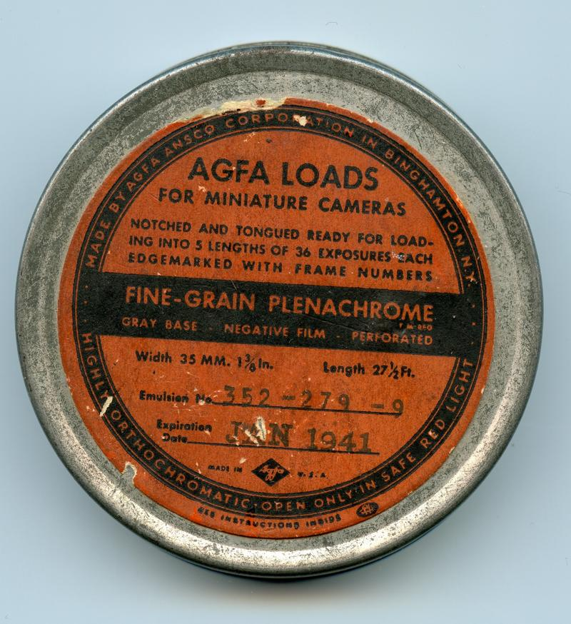
</a>


`UUID: c199fff31c474139afcea6ed0b66ff7e`↓

<a href="./archive/00179_001.jpg" target="_blank">
	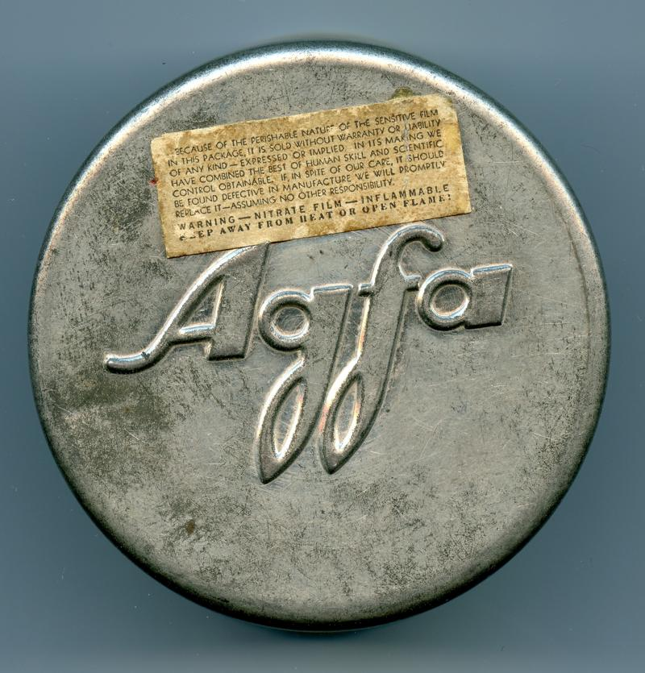
</a>

#### [1943] Kodak Super-XX (ref: 07c8)

```
Format: 616          |  Process : BW      
ISO   : Unknown      |  Expiry  : 1943-01 
Type  : Single Pack  |  Quantity: 8exp    
Added : 2025-10-17   |  Author  : @recycling.film
UUID  : ec96eb9587cf4485a00f2af323eb07c8
```

<a href="./archive/00411_000.jpg" target="_blank">
	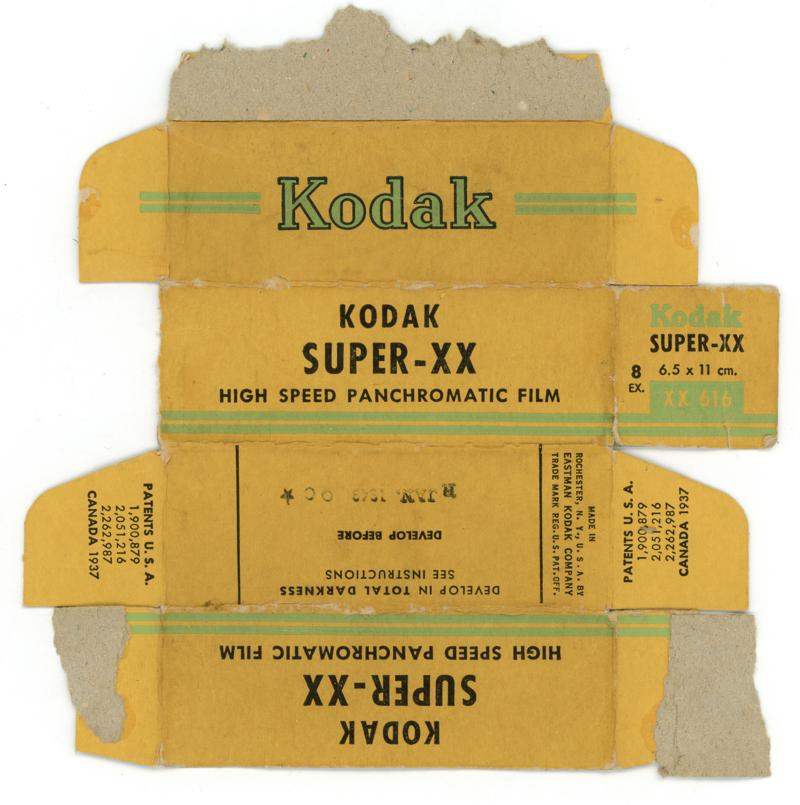
</a>

#### [1946] Agfa Isopan FF (ref: 3700)

```
Format: 35mm         |  Process : BW      
ISO   : 8            |  Expiry  : 1946-10 
Type  : Single Pack  |  Quantity: 36exp   
Added : 2025-07-29   |  Author  : Nano_Burger
UUID  : 9ea6437ea85442048ffe63b8b64c3700
```

<a href="./archive/00101_000.jpg" target="_blank">
	
</a>

#### [1947] Gevaert Superchrome (ref: af27)

```
Format: 127          |  Process : BW      
ISO   : Unknown      |  Expiry  : 1947-01 
Type  : Single Pack  |  Quantity: 8exp    
Added : 2025-10-12   |  Author  : dekuNukem
UUID  : 5b7606bb875b4930bafa486534e6af27
```

<a href="./archive/00389_000.jpg" target="_blank">
	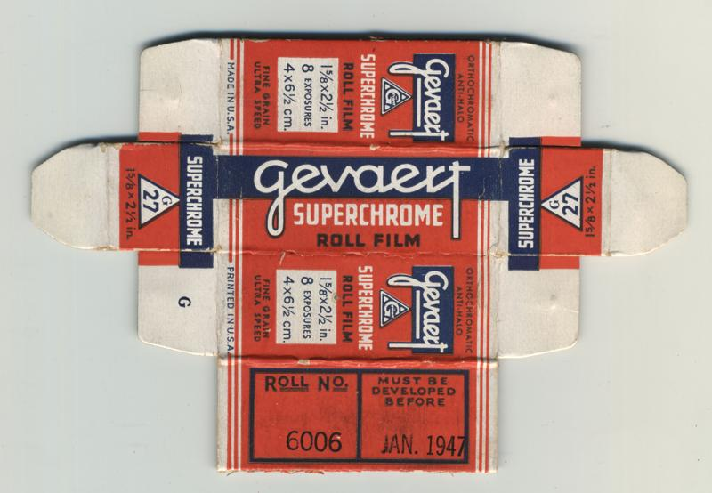
</a>

#### [1947] Kodak Verichrome (ref: e465)

```
Format: 616          |  Process : BW      
ISO   : Unknown      |  Expiry  : 1947-02 
Type  : Single Pack  |  Quantity: 8exp    
Added : 2025-10-21   |  Author  : dekuNukem
UUID  : a7d5a1c6923e4090b91381a1c853e465
```

<a href="./archive/00443_000.jpg" target="_blank">
	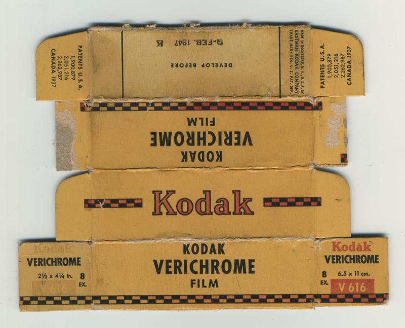
</a>

#### [1947] Agfa Isopan Portrait (ref: 19b5)

```
Format: 12x16.5cm    |  Process : BW      
ISO   : 80           |  Expiry  : 1947-09 
Type  : Single Pack  |  Quantity: Unknown 
Added : 2025-10-27   |  Author  : @ellafridalindblom
UUID  : 08e940883895476d8de94bc5137419b5
```

<a href="./archive/00456_000.jpg" target="_blank">
	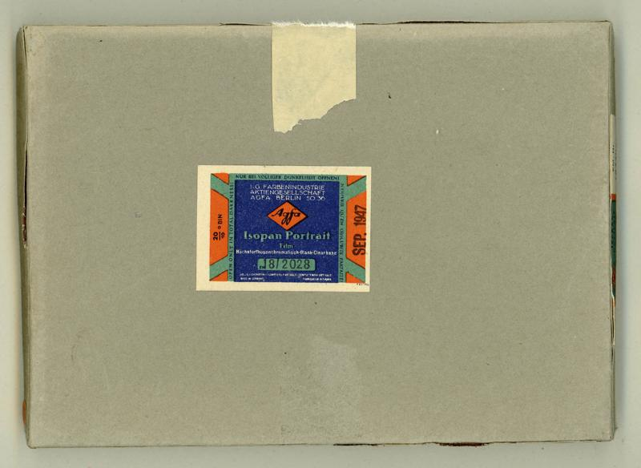
</a>

#### [1947] Perutz Perpantic Film (ref: 58b1)

```
Format: 120          |  Process : BW      
ISO   : 40           |  Expiry  : 1947-12 
Type  : Single Pack  |  Quantity: N/A     
Added : 2025-10-17   |  Author  : @recycling.film
UUID  : 795c66ef065f442ab27e4ffb9de758b1
```

<a href="./archive/00420_000.jpg" target="_blank">
	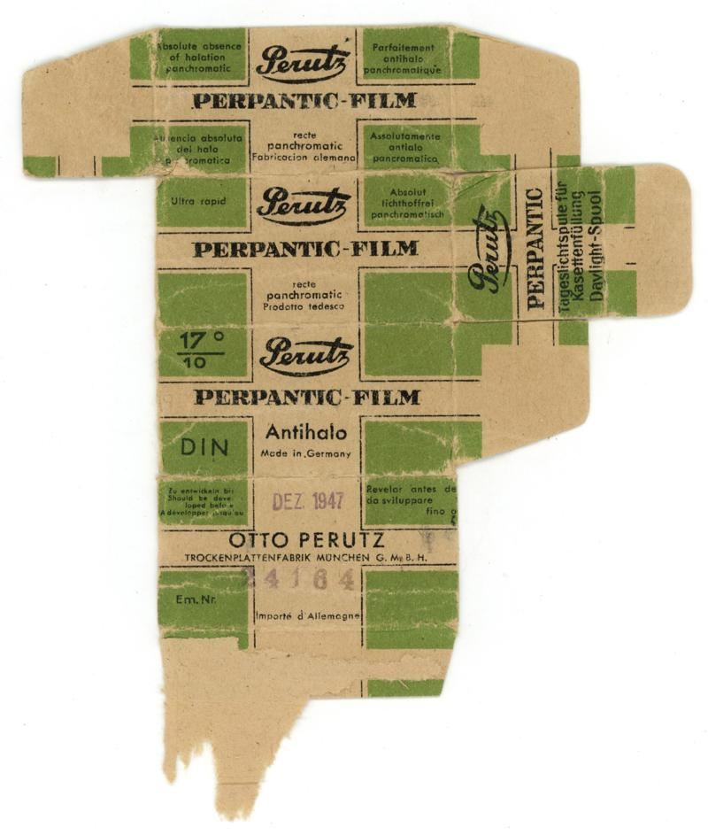
</a>

#### [1951] Kodak Plus-X (ref: 4b73)

```
Format: 35mm         |  Process : BW      
ISO   : 50           |  Expiry  : 1951-02 
Type  : Single Pack  |  Quantity: 20exp   
Added : 2025-10-21   |  Author  : dekuNukem
UUID  : bcad57bbd65146fbb2bdcf9fc79a4b73
```

<a href="./archive/00424_000.jpg" target="_blank">
	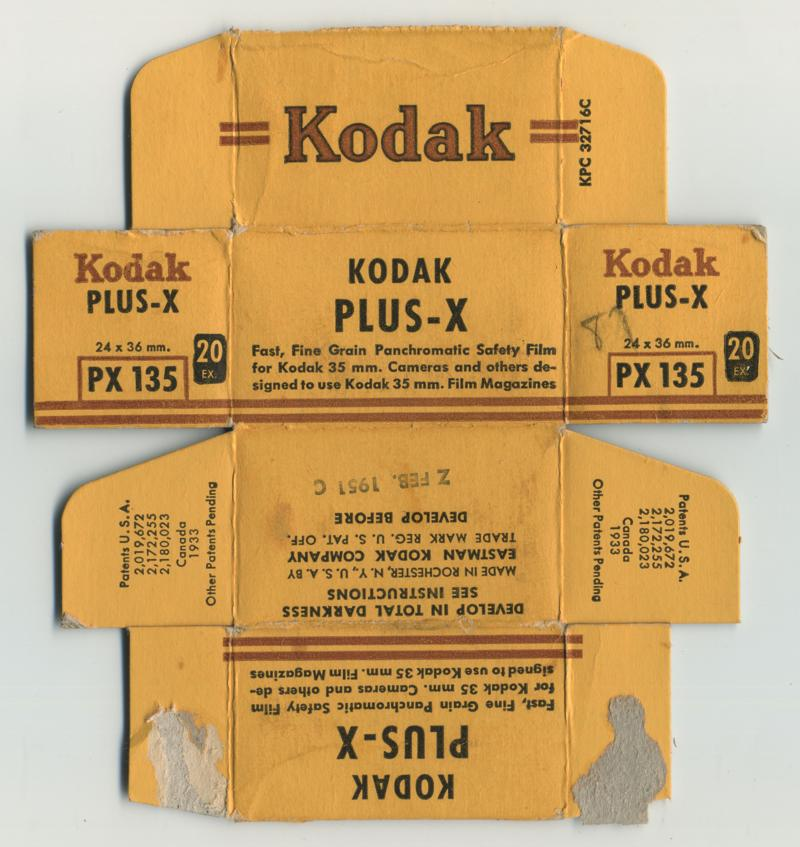
</a>


`UUID: cdd61b019a054a4d86f52daeeac8de52`↓

<a href="./archive/00424_001.jpg" target="_blank">
	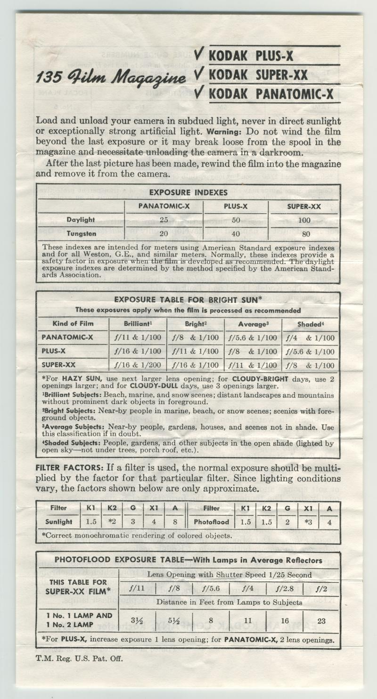
</a>


`UUID: 55cbb2fe9f184b828a171a1dafd8e2da`↓

<a href="./archive/00424_002.jpg" target="_blank">
	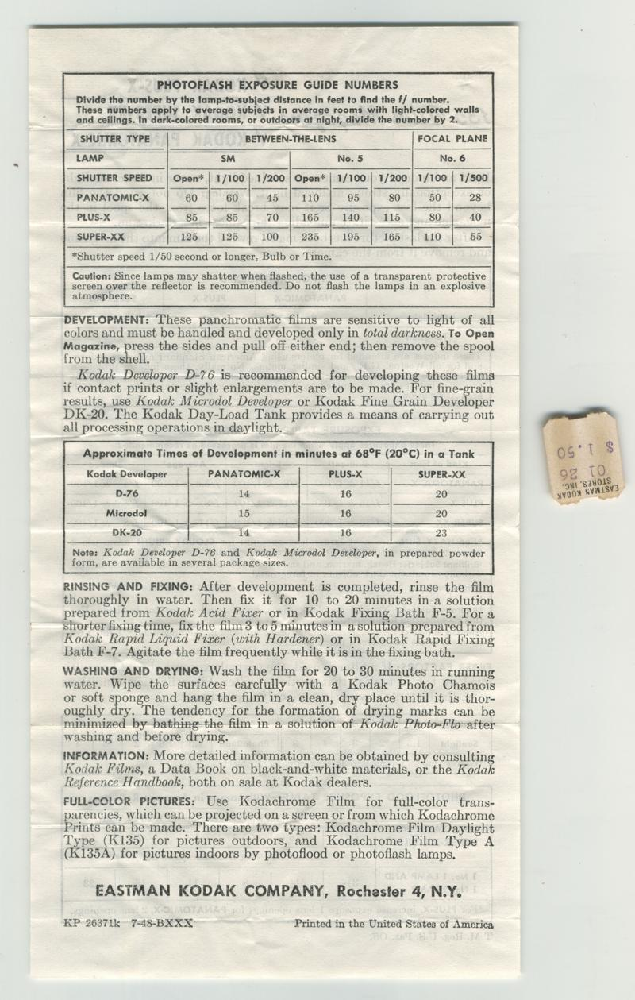
</a>

#### [1951] Kodak Verichrome (ref: c9c2)

```
Format: 122          |  Process : BW      
ISO   : Unknown      |  Expiry  : 1951-09 
Type  : Single Pack  |  Quantity: 6exp    
Added : 2025-10-21   |  Author  : dekuNukem
UUID  : adf90d5a8c2b4ad6ba1b6524bf00c9c2
```

<a href="./archive/00430_000.jpg" target="_blank">
	
</a>

#### [1956] Ansco Plenachrome (ref: 3c6c)

```
Format: 120          |  Process : BW      
ISO   : Unknown      |  Expiry  : 1956-04 
Type  : Single Pack  |  Quantity: N/A     
Added : 2025-10-12   |  Author  : dekuNukem
UUID  : 39756172435749ed870105a77fa53c6c
```

<a href="./archive/00385_000.jpg" target="_blank">
	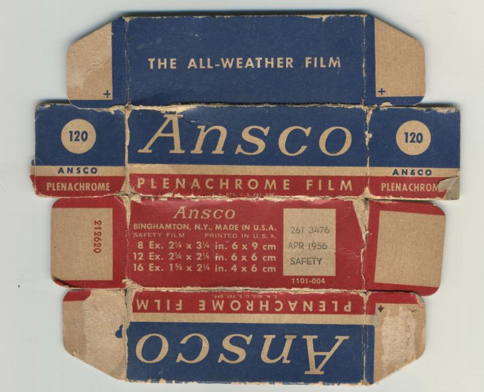
</a>

#### [1956] Filmfabrik Köpenick Dekopan Feinkorn (ref: 1bb7)

```
Format: 35mm         |  Process : BW      
ISO   : 40           |  Expiry  : 1956-11 
Type  : Single Pack  |  Quantity: 36exp   
Added : 2025-10-07   |  Author  : Pelicram
UUID  : 60cc4bc5cdde4f79946e61ff1fc81bb7
```

<a href="./archive/00373_000.jpg" target="_blank">
	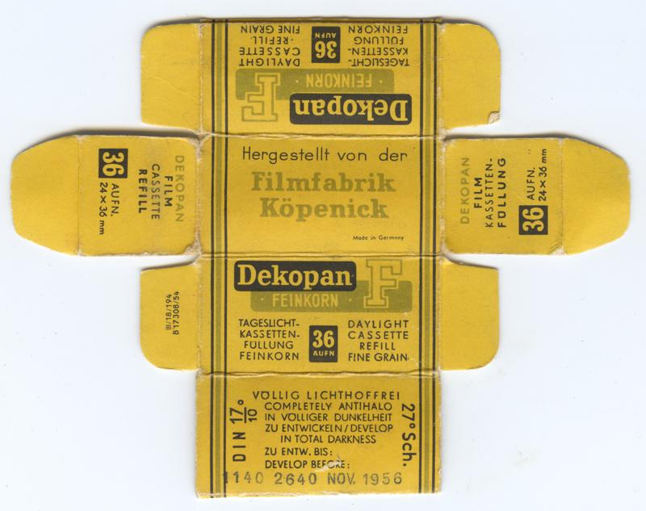
</a>

#### [1957] Kodak Plus-X (ref: b867)

```
Format: 35mm         |  Process : BW      
ISO   : Unknown      |  Expiry  : 1957-06 
Type  : Bulk Roll    |  Quantity: 5m      
Added : 2025-10-07   |  Author  : Pelicram
UUID  : def2a04d52794b00aa61a0b801bdb867
```

<a href="./archive/00379_000.jpg" target="_blank">
	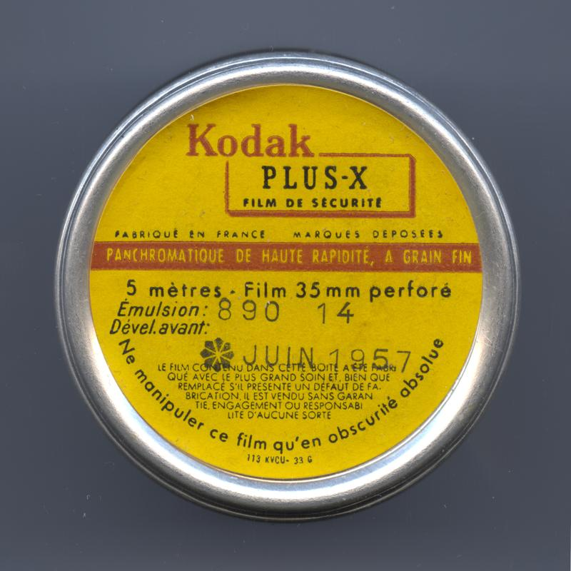
</a>

#### [1957] Gevaert Gevachrome 30 (ref: c0e3)

```
Format: 122          |  Process : BW      
ISO   : 40           |  Expiry  : 1957-10 
Type  : Single Pack  |  Quantity: 6exp    
Added : 2025-10-21   |  Author  : dekuNukem
UUID  : 4cce875d701d4fd4b1d28353305ac0e3
Notes : 30 most likely is European Scheiner film speed
```

<a href="./archive/00432_000.jpg" target="_blank">
	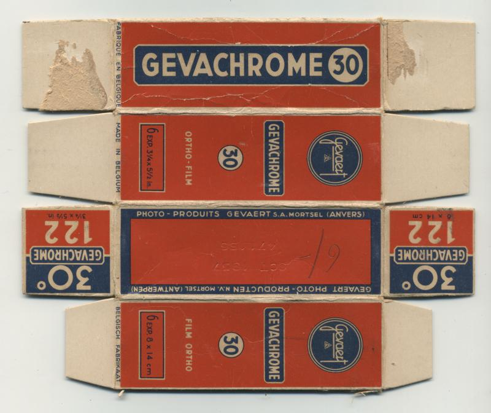
</a>

#### [1958] Kodak Plus-X (ref: 7958)

```
Format: 35mm         |  Process : BW      
ISO   : Unknown      |  Expiry  : 1958-01 
Type  : Bulk Roll    |  Quantity: 5m      
Added : 2025-10-07   |  Author  : Pelicram
UUID  : 274e94b488d64e3a890da1f77b607958
```

<a href="./archive/00376_000.jpg" target="_blank">
	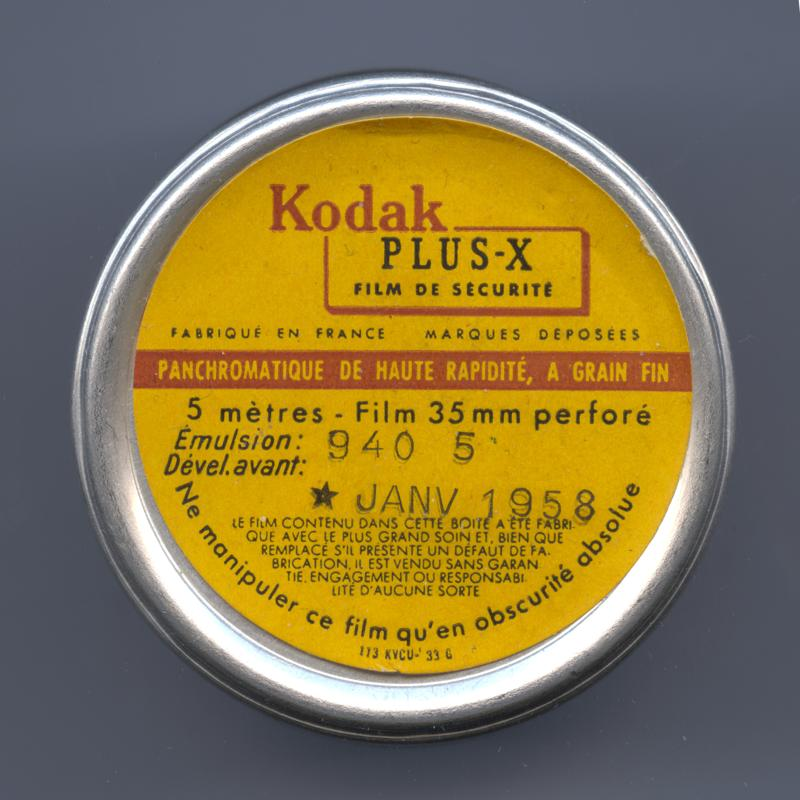
</a>

#### [1958] Kodak Panatomic-X (ref: 7ed1)

```
Format: 35mm         |  Process : BW      
ISO   : Unknown      |  Expiry  : 1958-03 
Type  : Bulk Roll    |  Quantity: 5m      
Added : 2025-10-07   |  Author  : Pelicram
UUID  : a4dcee02869a4274b81b453160ca7ed1
```

<a href="./archive/00378_000.jpg" target="_blank">
	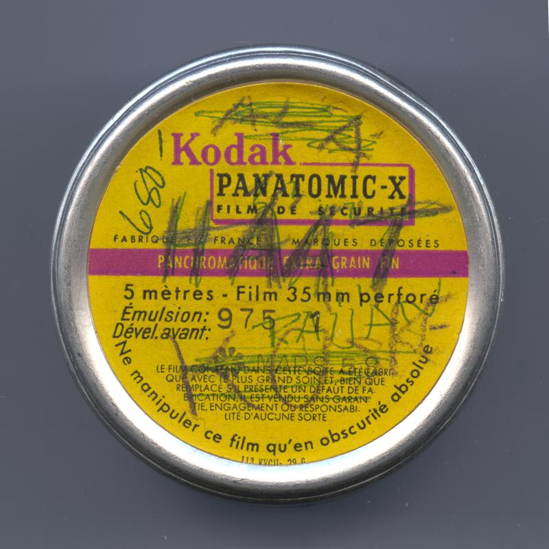
</a>

#### [1958] ADOX KB 17 (ref: 88a5)

```
Format: 35mm         |  Process : BW      
ISO   : 32           |  Expiry  : 1958-07 
Type  : Single Pack  |  Quantity: 20exp   
Added : 2025-10-17   |  Author  : @recycling.film
UUID  : ee054df9bf0f4ad09ef142c01c2788a5
```

<a href="./archive/00416_000.jpg" target="_blank">
	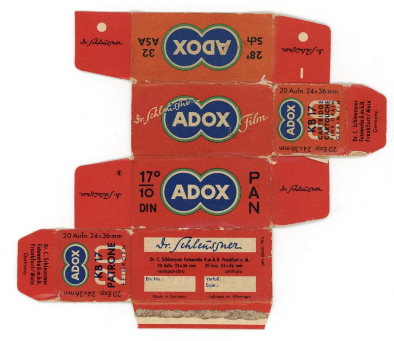
</a>

#### [1959] Ilford FP3 (ref: 84f7)

```
Format: 35mm         |  Process : BW      
ISO   : 125          |  Expiry  : 1959-03 
Type  : Bulk Roll    |  Quantity: 5m      
Added : 2025-10-07   |  Author  : Pelicram
UUID  : 6775b898e26f4b649bd5323259f284f7
```

<a href="./archive/00377_000.jpg" target="_blank">
	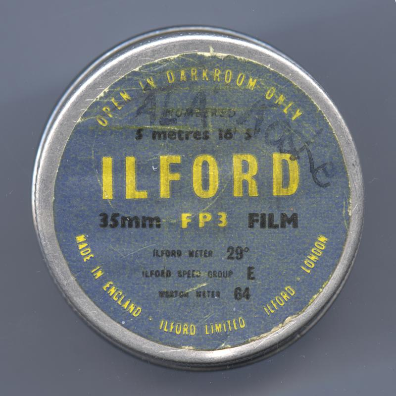
</a>

#### [1959] Kodak Kodacolor (ref: 5d25)

```
Format: 35mm         |  Process : C-22    
ISO   : 32           |  Expiry  : 1959-10 
Type  : Single Pack  |  Quantity: 20exp   
Added : 2025-10-12   |  Author  : dekuNukem
UUID  : 1c8fa96c92974edaa7cbf69b3e535d25
```

<a href="./archive/00390_000.jpg" target="_blank">
	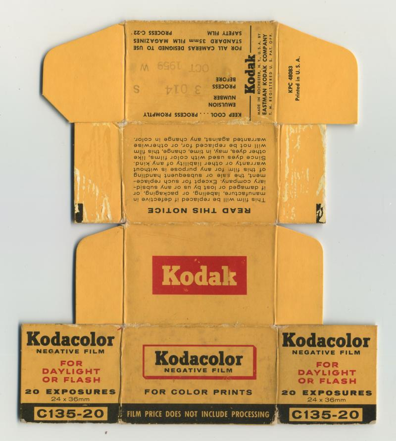
</a>


`UUID: ce169d8c6e8c49b883bf3c1149128398`↓

<a href="./archive/00390_001.jpg" target="_blank">
	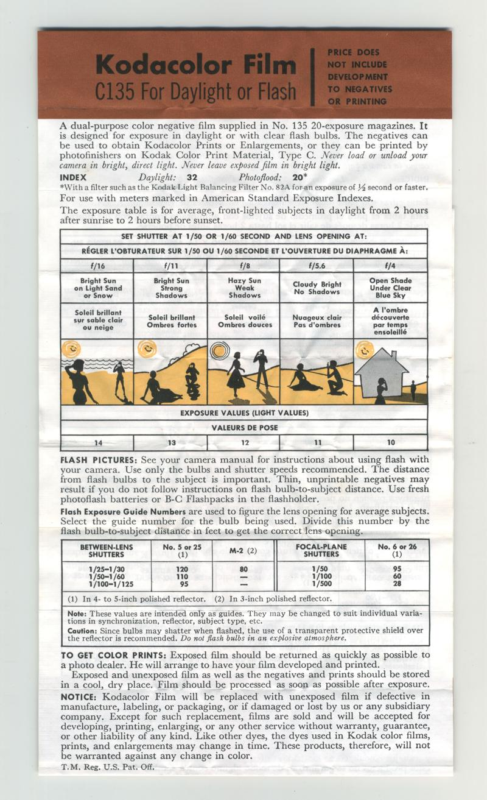
</a>


`UUID: bf8091dc91444595bf58e0b11e2c051c`↓

<a href="./archive/00390_002.jpg" target="_blank">
	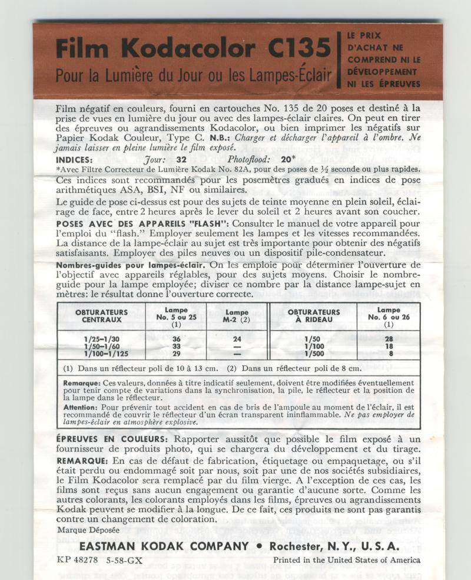
</a>


`UUID: c84743c44edd485eb047e566a249609f`↓

<a href="./archive/00390_003.jpg" target="_blank">
	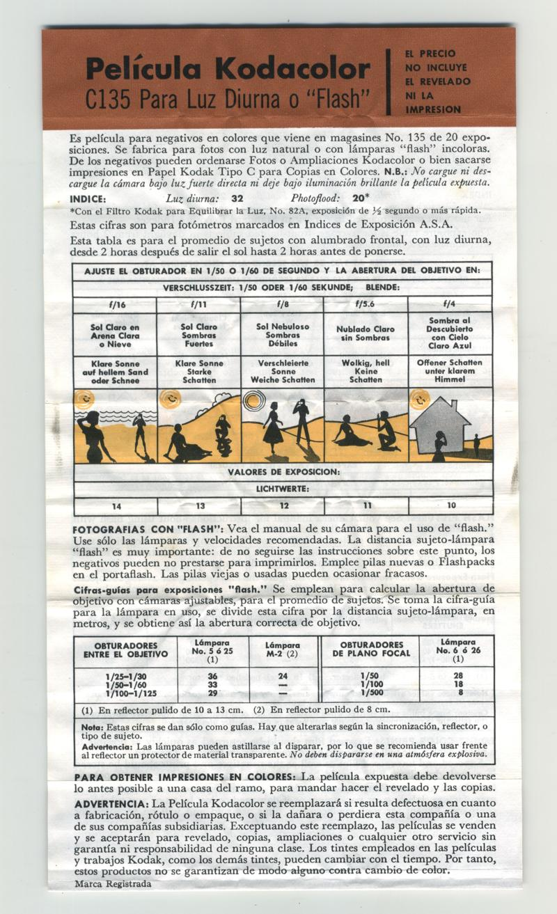
</a>


`UUID: 8e3103da87194d3abc7e557078ad9130`↓

<a href="./archive/00390_004.jpg" target="_blank">
	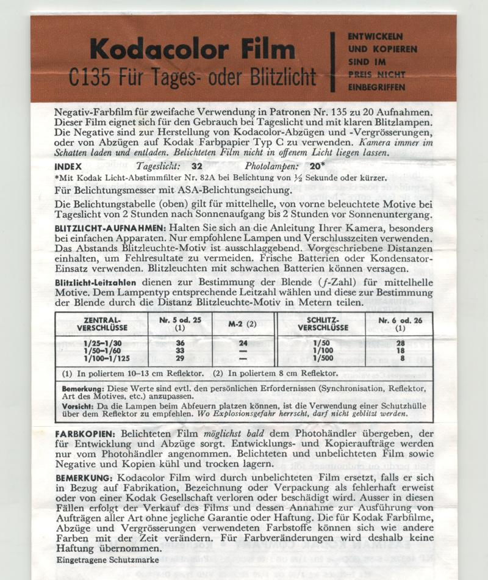
</a>

#### [1960] Ilford FP3 Series 2 (ref: 03e7)

```
Format: 35mm         |  Process : BW      
ISO   : 125          |  Expiry  : 1960-11 
Type  : Bulk Roll    |  Quantity: 5m      
Added : 2025-10-07   |  Author  : Pelicram
UUID  : bb411872cc384c19b35debf6662503e7
```

<a href="./archive/00375_000.jpg" target="_blank">
	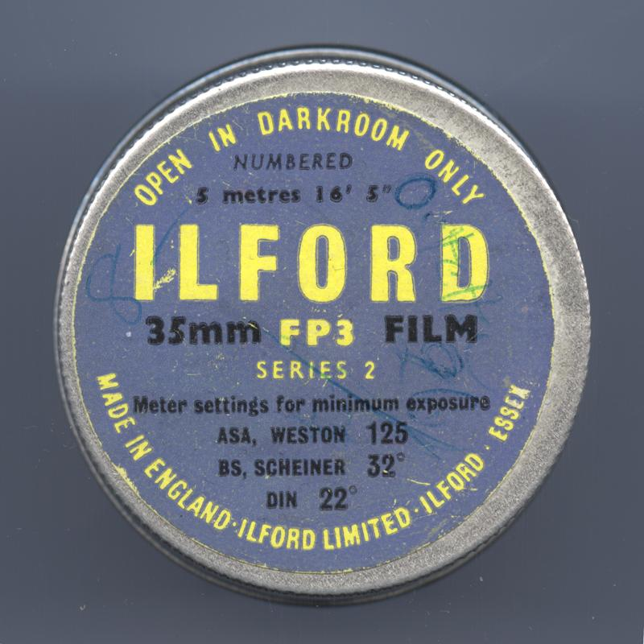
</a>

#### [1961] Perutz Peromnia 21 (ref: fa4a)

```
Format: 35mm         |  Process : BW      
ISO   : 100          |  Expiry  : 1961-03 
Type  : Single Pack  |  Quantity: 20exp   
Added : 2025-10-17   |  Author  : @recycling.film
UUID  : 05554da8891c470facbddfd5fe35fa4a
```

<a href="./archive/00419_000.jpg" target="_blank">
	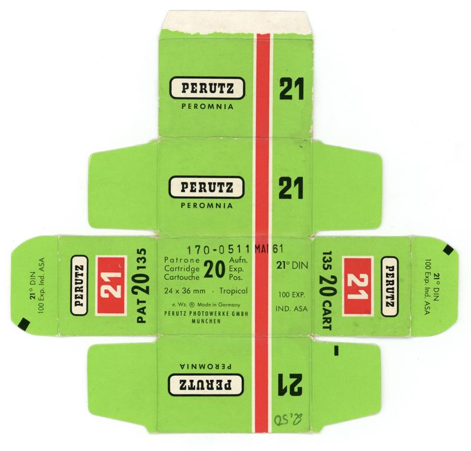
</a>

#### [1961] VEB Fotochemische Werke Berlin Dekopan Feinkorn (ref: dba0)

```
Format: 35mm         |  Process : BW      
ISO   : 32           |  Expiry  : 1961-08 
Type  : Single Pack  |  Quantity: 36exp   
Added : 2025-10-05   |  Author  : benikum 
UUID  : a26198b637074f36b099870688e7dba0
```

<a href="./archive/00368_000.jpg" target="_blank">
	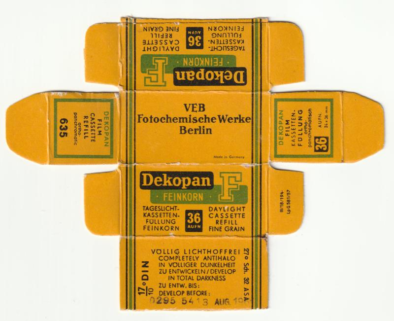
</a>

#### [1961] VEB Fotochemische Werke Berlin Dekopan Super S (ref: 1620)

```
Format: 35mm         |  Process : BW      
ISO   : 80           |  Expiry  : 1961-08 
Type  : Single Pack  |  Quantity: 36exp   
Added : 2025-10-05   |  Author  : benikum 
UUID  : da22aec5f8564cd8b34023047f511620
```

<a href="./archive/00369_000.jpg" target="_blank">
	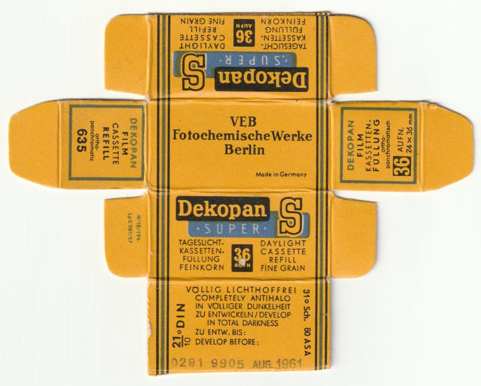
</a>


`UUID: 4220a86f04794b568159c0b119859985`↓

<a href="./archive/00369_001.jpg" target="_blank">
	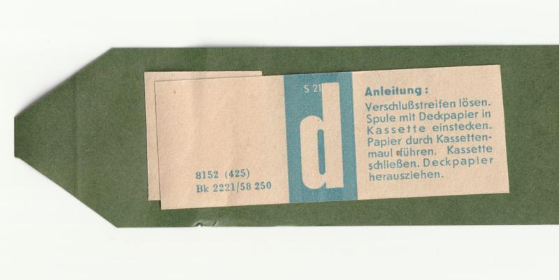
</a>

#### [1961] Ricoh Golden "16" (ref: c02c)

```
Format: 16mm         |  Process : BW      
ISO   : 160          |  Expiry  : 1961-09 
Type  : Single Pack  |  Quantity: 20exp   
Added : 2025-10-12   |  Author  : dekuNukem
UUID  : c4263f60ad284b669f5db75e79d2c02c
```

<a href="./archive/00383_000.jpg" target="_blank">
	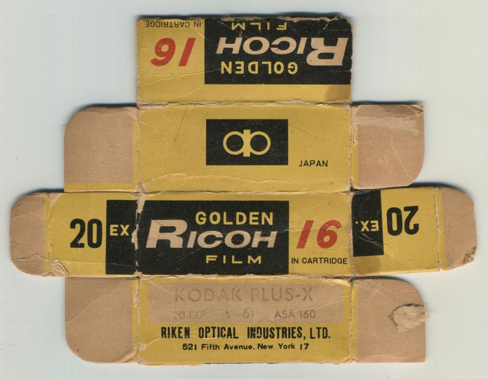
</a>


`UUID: 0bd17a0f246c41b79322a478901003c5`↓

<a href="./archive/00383_001.jpg" target="_blank">
	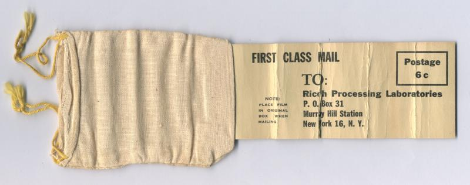
</a>


`UUID: d99990b484984277a0be54182937d422`↓

<a href="./archive/00383_002.jpg" target="_blank">
	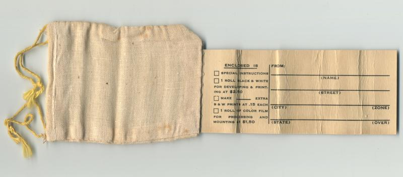
</a>


`UUID: 59c184351d13442dab4fb0f74ddd25ee`↓

<a href="./archive/00383_003.jpg" target="_blank">
	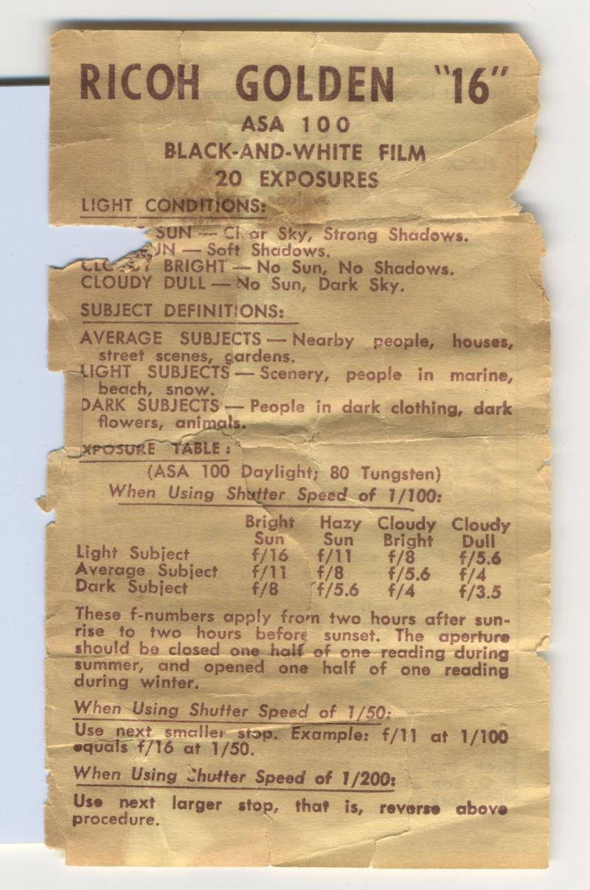
</a>


`UUID: 0d69320f7ded493590d6abb0ea69f750`↓

<a href="./archive/00383_004.jpg" target="_blank">
	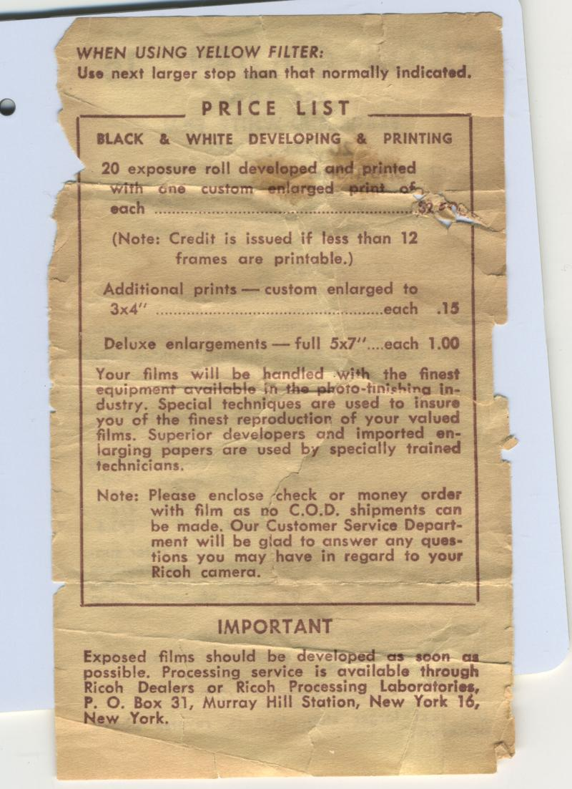
</a>

#### [1962] Kodak Verichrome Pan (ref: 7984)

```
Format: 122          |  Process : BW      
ISO   : Unknown      |  Expiry  : 1962-03 
Type  : Single Pack  |  Quantity: 6exp    
Added : 2025-10-21   |  Author  : dekuNukem
UUID  : c17a688403b646e6aebd74e8ec357984
```

<a href="./archive/00433_000.jpg" target="_blank">
	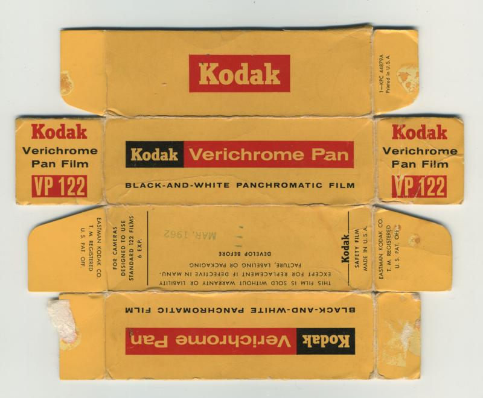
</a>

#### [1963] Kodak High Speed Ektachrome (ref: ce7f)

```
Format: 120          |  Process : E-2     
ISO   : 160          |  Expiry  : 1963-01 
Type  : Single Pack  |  Quantity: N/A     
Added : 2025-01-04   |  Author  : dekuNukem
UUID  : ec7cf78858fc48c59e5a0875ec74ce7f
```

<a href="./archive/00017_000.jpg" target="_blank">
	
</a>

#### [1963] Perutz Peromnia 21 (ref: bf2a)

```
Format: 127          |  Process : BW      
ISO   : 100          |  Expiry  : 1963-09 
Type  : Single Pack  |  Quantity: N/A     
Added : 2025-10-25   |  Author  : dekuNukem
UUID  : 931cd13271f74ddf96233e783ea9bf2a
```

<a href="./archive/00451_000.jpg" target="_blank">
	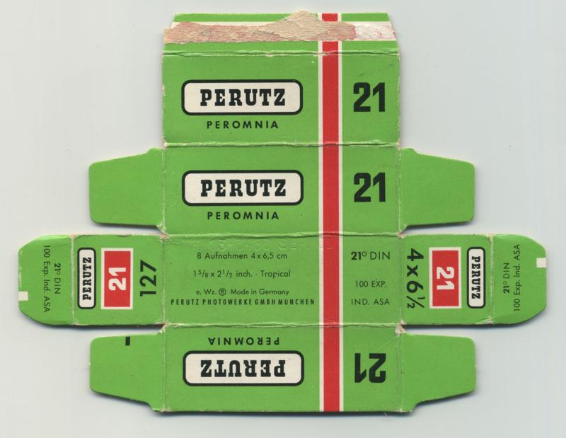
</a>

#### [1963] Agfa Isopan ISS (ref: 75fa)

```
Format: 35mm         |  Process : BW      
ISO   : 100          |  Expiry  : 1963-11 
Type  : Single Pack  |  Quantity: 20exp   
Added : 2025-07-31   |  Author  : Pelicram
UUID  : cdcaa912ee0142c3b76eb1500e2375fa
```

<a href="./archive/00148_000.jpg" target="_blank">
	
</a>

#### [1964] ADOX KB17 (ref: 2c95)

```
Format: 35mm         |  Process : BW      
ISO   : 40           |  Expiry  : 1964-01 
Type  : Single Pack  |  Quantity: 36exp   
Added : 2025-05-24   |  Author  : dekuNukem
UUID  : 14047842e1a641268bfd4d01fcf02c95
```

<a href="./archive/00065_000.jpg" target="_blank">
	
</a>


`UUID: 04f60deb3d044553a9d662db1d30d3b7`↓

<a href="./archive/00065_001.jpg" target="_blank">
	
</a>

#### [1964] Perfect Photo Inc. Perfect-Pan Film (ref: c214)

```
Format: 120          |  Process : BW      
ISO   : 125          |  Expiry  : 1964-10 
Type  : Single Pack  |  Quantity: N/A     
Added : 2025-10-17   |  Author  : @recycling.film
UUID  : 4eb2d274d28c41339ad3bd385476c214
```

<a href="./archive/00412_000.jpg" target="_blank">
	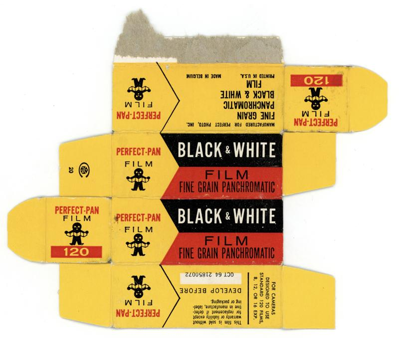
</a>


`UUID: da91308a6c3a42d4b6665e82ee0ab24c`↓

<a href="./archive/00412_001.jpg" target="_blank">
	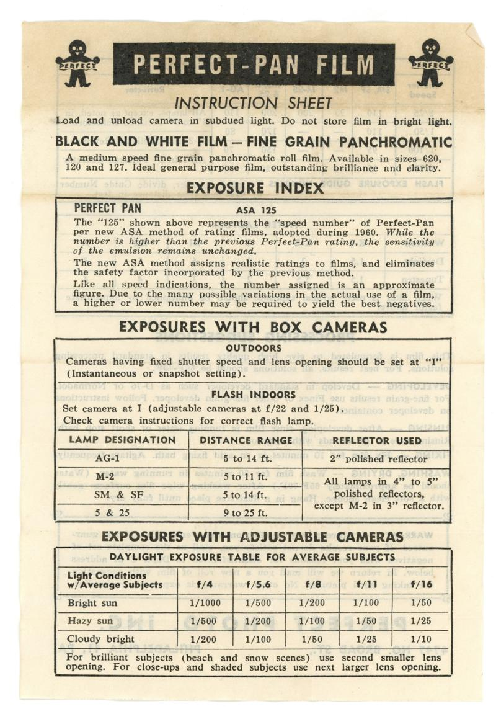
</a>


`UUID: 8ceb71b4c7204eda9fe3eac689142058`↓

<a href="./archive/00412_002.jpg" target="_blank">
	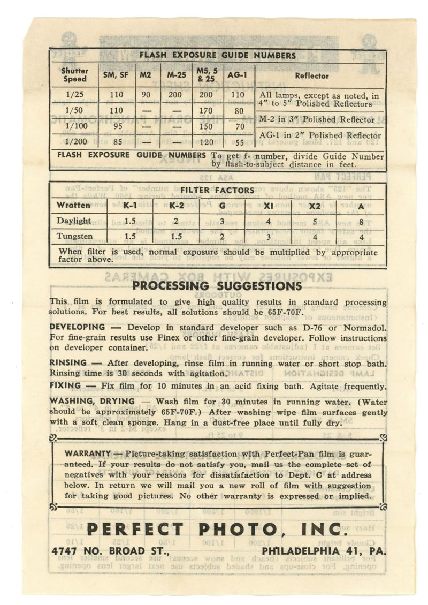
</a>

#### [1965] Ilford Selochrome (ref: f534)

```
Format: 120          |  Process : BW      
ISO   : 160          |  Expiry  : 1965-09 
Type  : Single Pack  |  Quantity: N/A     
Added : 2025-10-21   |  Author  : dekuNukem
UUID  : f085080d08414582a703e7a1982df534
```

<a href="./archive/00436_000.jpg" target="_blank">
	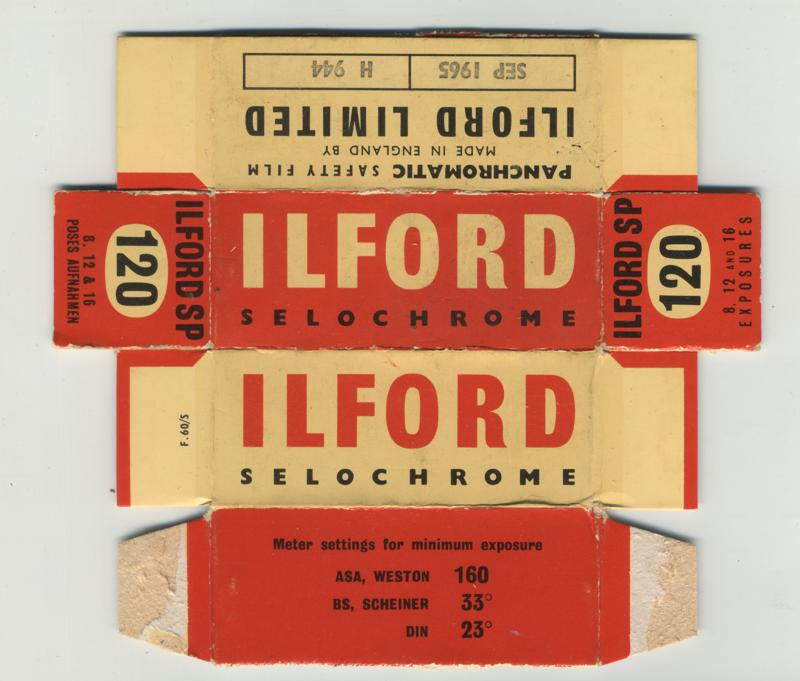
</a>


`UUID: 71077f96d6e74825b04d8c7b1a3a29b2`↓

<a href="./archive/00436_001.jpg" target="_blank">
	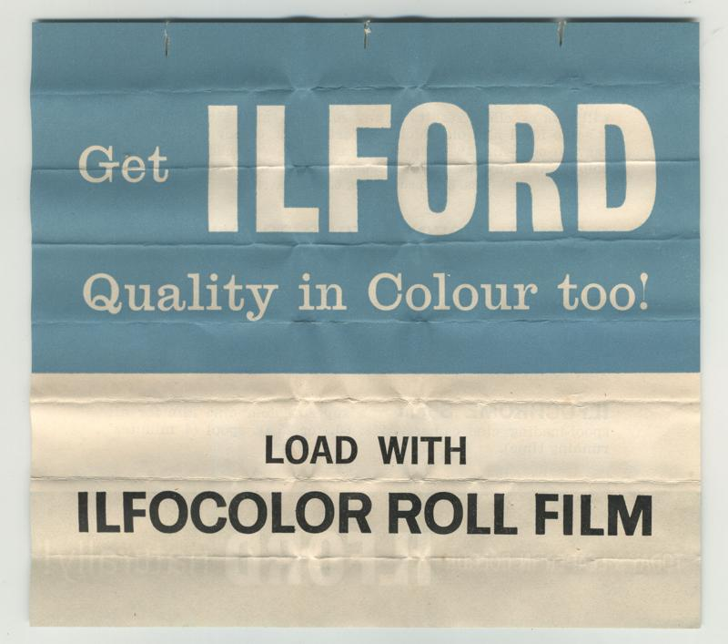
</a>


`UUID: aa3d982c74984e12b6a621205250c1d5`↓

<a href="./archive/00436_002.jpg" target="_blank">
	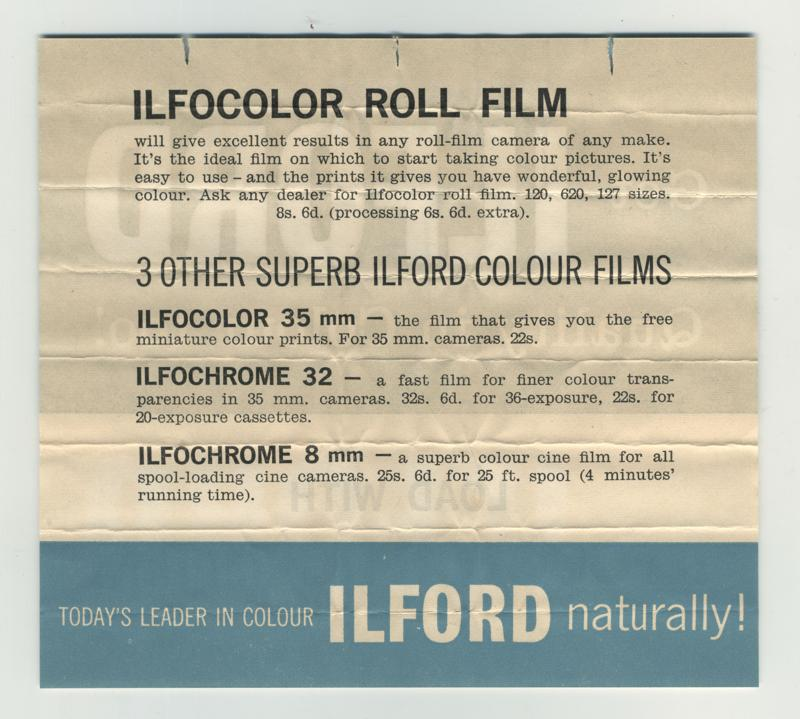
</a>

#### [1967] Walgreen All Purpose Film (ref: 541b)

```
Format: 620          |  Process : BW      
ISO   : 80           |  Expiry  : 1967-01 
Type  : Single Pack  |  Quantity: N/A     
Added : 2025-10-12   |  Author  : dekuNukem
UUID  : ed28012d8a77465898bf1bf978db541b
```

<a href="./archive/00388_000.jpg" target="_blank">
	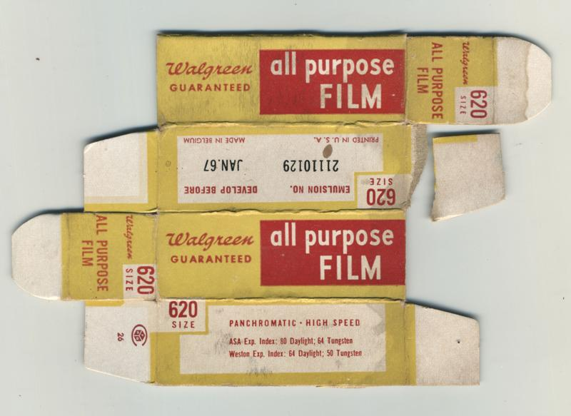
</a>


`UUID: 8bbe0c722eb84948bcdd35b683dca54a`↓

<a href="./archive/00388_001.jpg" target="_blank">
	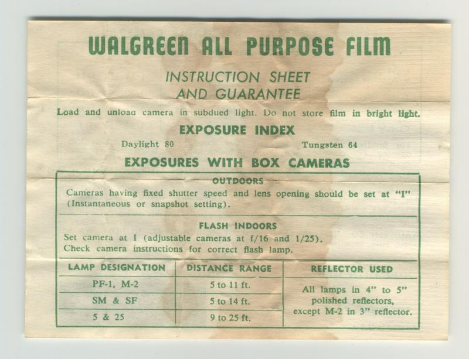
</a>


`UUID: b41e3644f2f6434c807ce95df8c37561`↓

<a href="./archive/00388_002.jpg" target="_blank">
	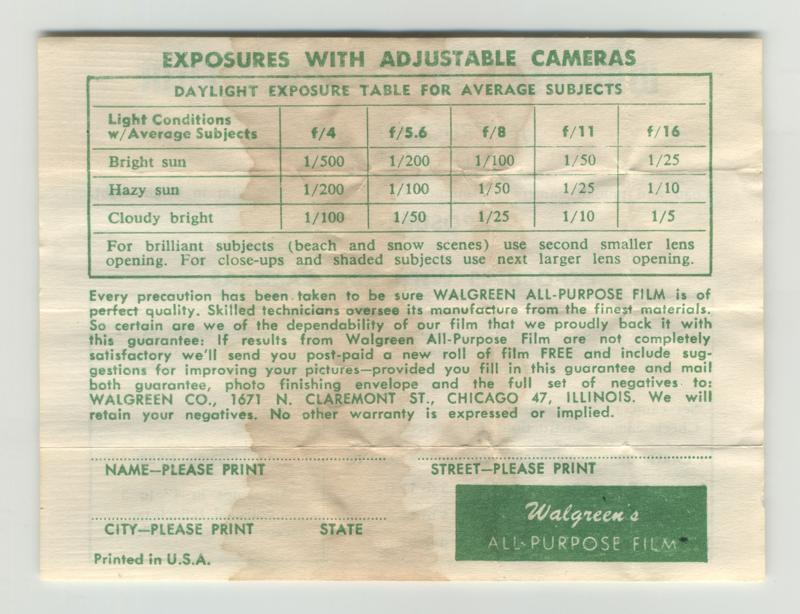
</a>


`UUID: 5162cf96587443cead98bdbef85a229c`↓

<a href="./archive/00388_003.jpg" target="_blank">
	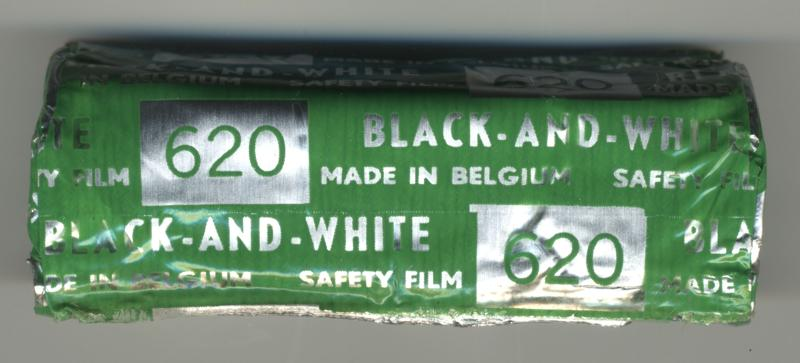
</a>

#### [1967] Agfa AgfaColor CT 18 (ref: 1fef)

```
Format: 35mm         |  Process : Unknown 
ISO   : 50           |  Expiry  : 1967-07 
Type  : Single Pack  |  Quantity: 20exp   
Added : 2025-08-30   |  Author  : dekuNukem
UUID  : 0e445a9b612a487b90df4e94a3831fef
```

<a href="./archive/00272_000.jpg" target="_blank">
	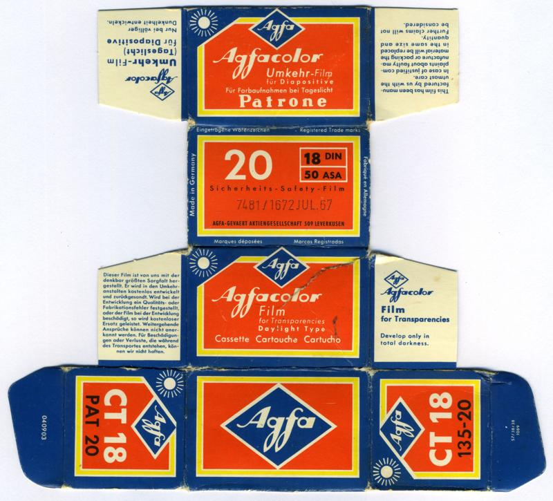
</a>


`UUID: a873cb888fb747898307b01aefc735f5`↓

<a href="./archive/00272_001.jpg" target="_blank">
	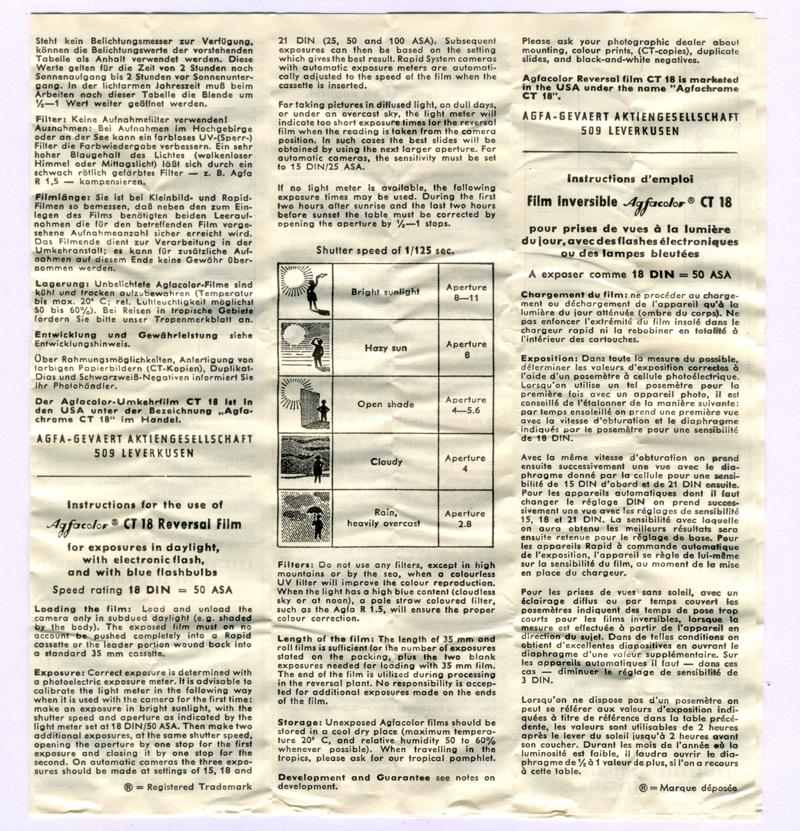
</a>


`UUID: 9b5f0876d6bb4d049b1a352116b1edfa`↓

<a href="./archive/00272_002.jpg" target="_blank">
	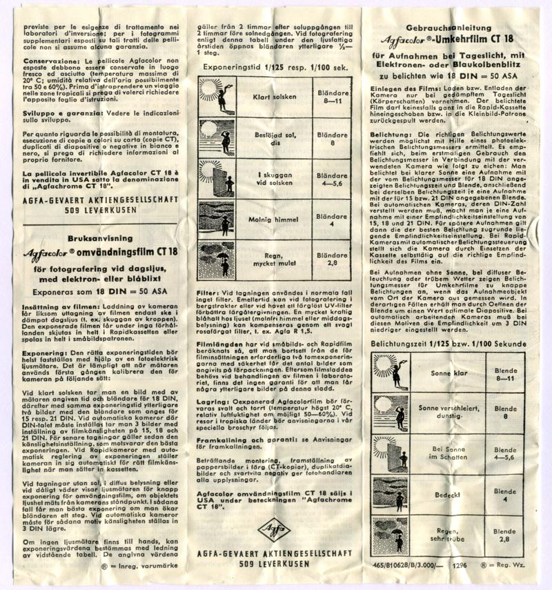
</a>


`UUID: 60fd9b682b714bda937f1489895e3f04`↓

<a href="./archive/00272_003.jpg" target="_blank">
	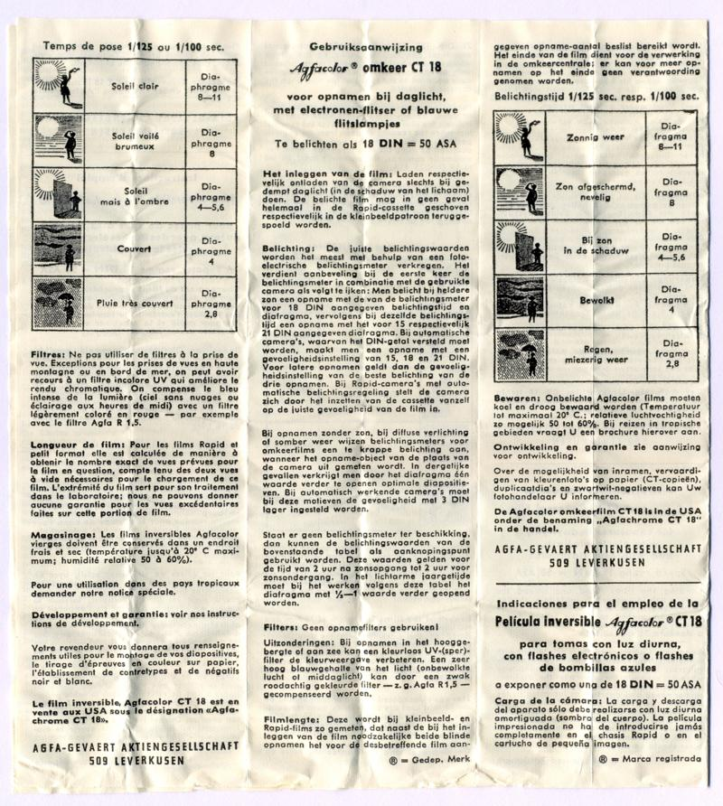
</a>


`UUID: b2c42b0d1fca464e8813d18e3e709abe`↓

<a href="./archive/00272_004.jpg" target="_blank">
	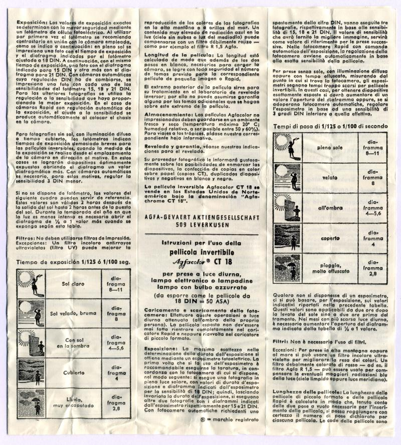
</a>


`UUID: 92d1c329ca9c4714bfe7ae4ccca5cc86`↓

<a href="./archive/00272_005.jpg" target="_blank">
	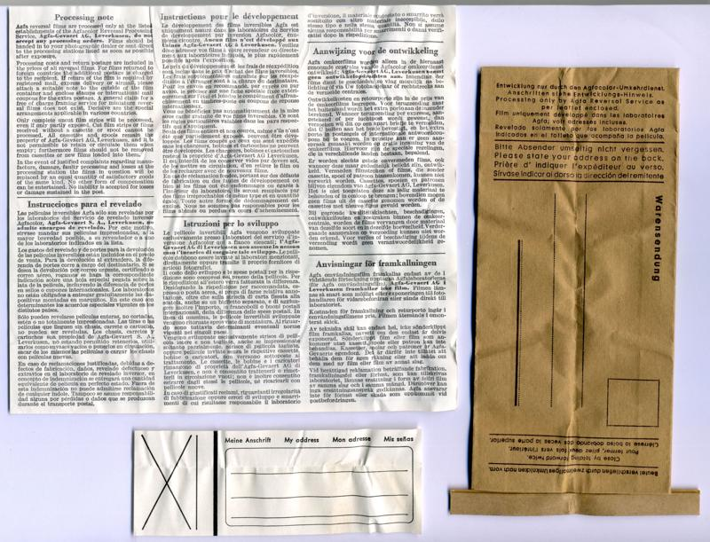
</a>


`UUID: bb549196d49a4992afdb1a15e70f51b8`↓

<a href="./archive/00272_006.jpg" target="_blank">
	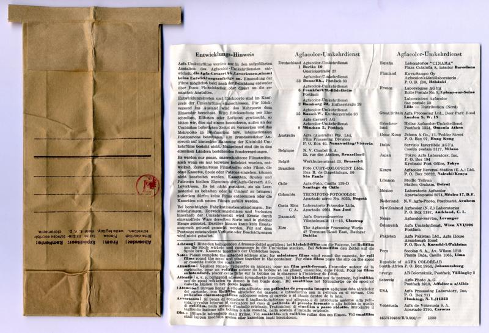
</a>

#### [1968] Kodak Kodachrome II (ref: 0982)

```
Format: 828          |  Process : K-14    
ISO   : 25           |  Expiry  : 1968-01 
Type  : Single Pack  |  Quantity: 12exp   
Added : 2025-10-21   |  Author  : dekuNukem
UUID  : b9c0bacb3ac64fc6bb46b1e728710982
```

<a href="./archive/00441_000.jpg" target="_blank">
	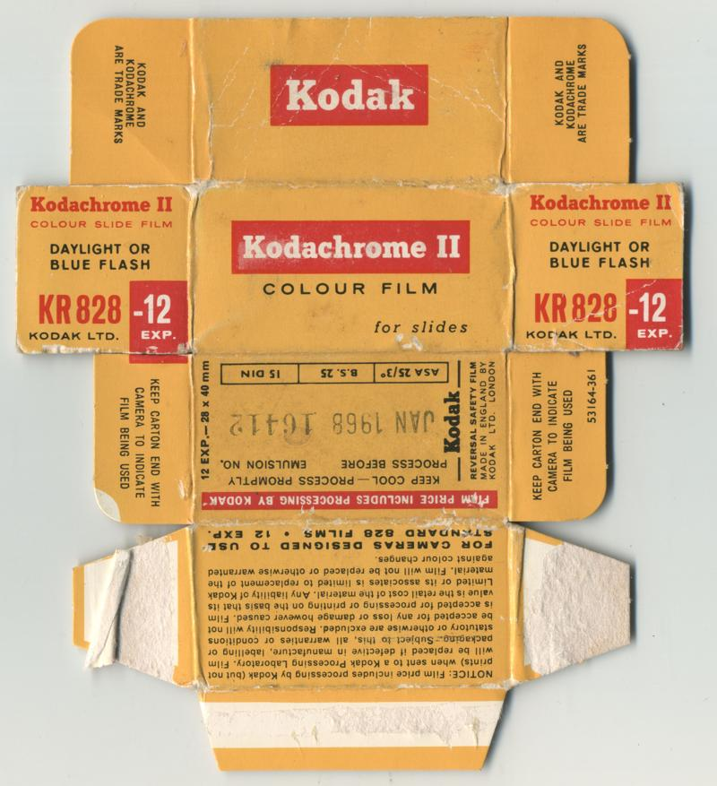
</a>


`UUID: 9f37569423ef4a36aa7a1c15976f0b2e`↓

<a href="./archive/00441_001.jpg" target="_blank">
	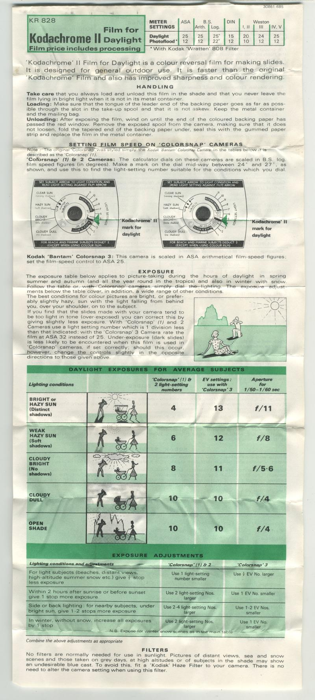
</a>


`UUID: 54a70d5cac414623925c05d402aa1df7`↓

<a href="./archive/00441_002.jpg" target="_blank">
	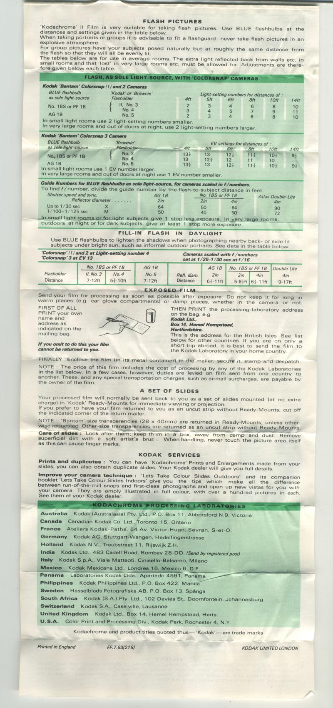
</a>


`UUID: 60d2979073e4417c9511260b6d004d8c`↓

<a href="./archive/00441_003.jpg" target="_blank">
	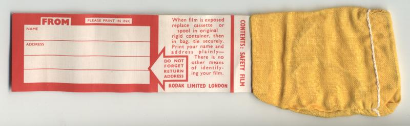
</a>


`UUID: b776358cf6654afc867da7efc26e681b`↓

<a href="./archive/00441_004.jpg" target="_blank">
	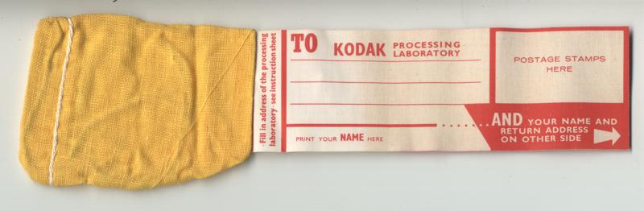
</a>

#### [1969] Foton Fotopan F (ref: 0ad6)

```
Format: 120          |  Process : BW      
ISO   : 50           |  Expiry  : 1969-01 
Type  : Single Pack  |  Quantity: N/A     
Added : 2025-08-19   |  Author  : @ellafridalindblom
UUID  : f2002785f14a4aba9fd1da2386890ad6
```

<a href="./archive/00205_000.jpg" target="_blank">
	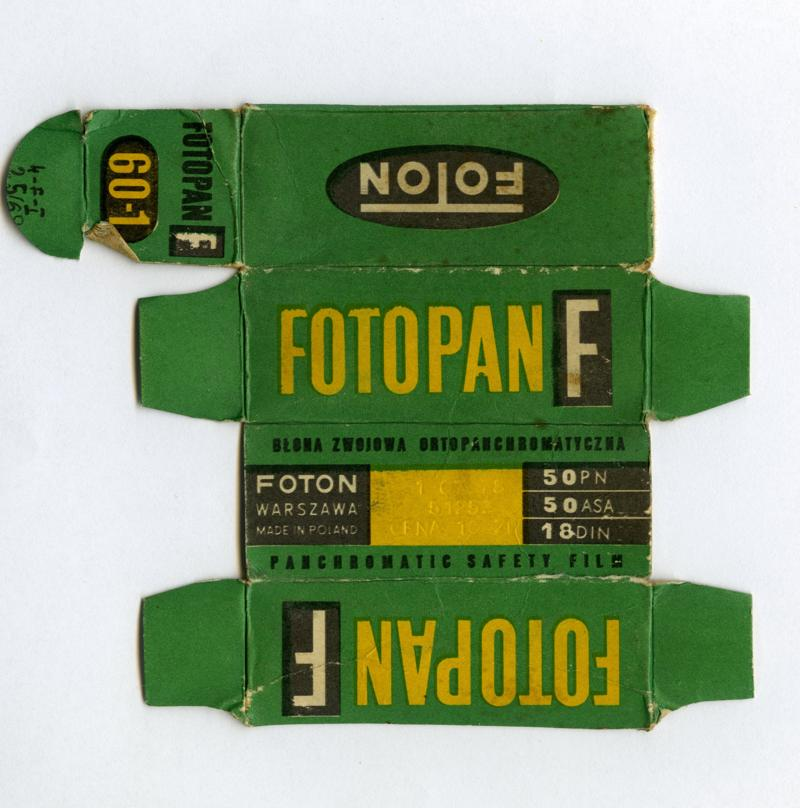
</a>

#### [1969] Agfa Agfapan Rapid (ref: 5e7b)

```
Format: 35mm         |  Process : BW      
ISO   : 40           |  Expiry  : 1969-02 
Type  : Single Pack  |  Quantity: 12exp   
Added : 2025-07-31   |  Author  : The Compartmentalist
UUID  : b2470c1734d344698f6e1c01eaa85e7b
```

<a href="./archive/00115_000.jpg" target="_blank">
	
</a>

#### [1969] Agfa Isopan IF Rapid (ref: 5962)

```
Format: 35mm         |  Process : BW      
ISO   : 40           |  Expiry  : 1969-02 
Type  : Single Pack  |  Quantity: Unknown 
Added : 2025-10-21   |  Author  : dekuNukem
UUID  : 2eb6c6a9aa784c2e871b7edd33fb5962
```

<a href="./archive/00437_000.jpg" target="_blank">
	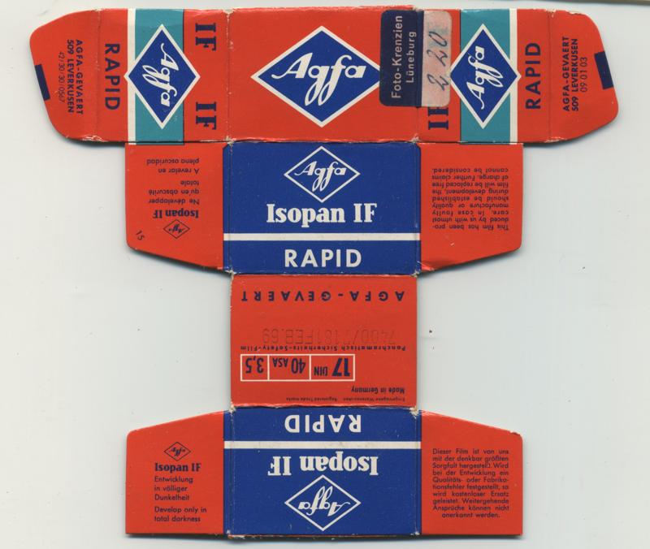
</a>


`UUID: 4a001e5fb1774942933060bd00e6c6ef`↓

<a href="./archive/00437_001.jpg" target="_blank">
	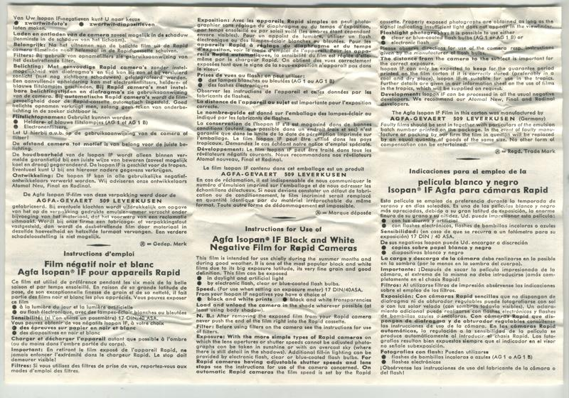
</a>


`UUID: 6ca26308da0547e3bb8ffee5cffdd94e`↓

<a href="./archive/00437_002.jpg" target="_blank">
	
</a>

#### [1969] Ilford HP3 (ref: 1afc)

```
Format: 620          |  Process : BW      
ISO   : 400          |  Expiry  : 1969-02 
Type  : Single Pack  |  Quantity: N/A     
Added : 2025-10-12   |  Author  : dekuNukem
UUID  : df6db4a9d0a24f4689647a4ece831afc
```

<a href="./archive/00382_000.jpg" target="_blank">
	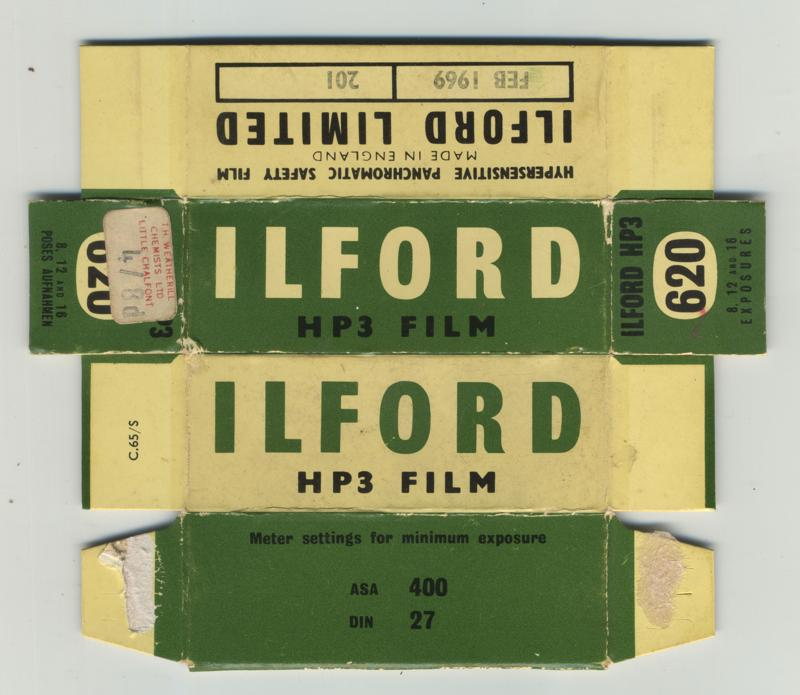
</a>


`UUID: 5c38e6e7bb004036a0b59661d33a5d8b`↓

<a href="./archive/00382_001.jpg" target="_blank">
	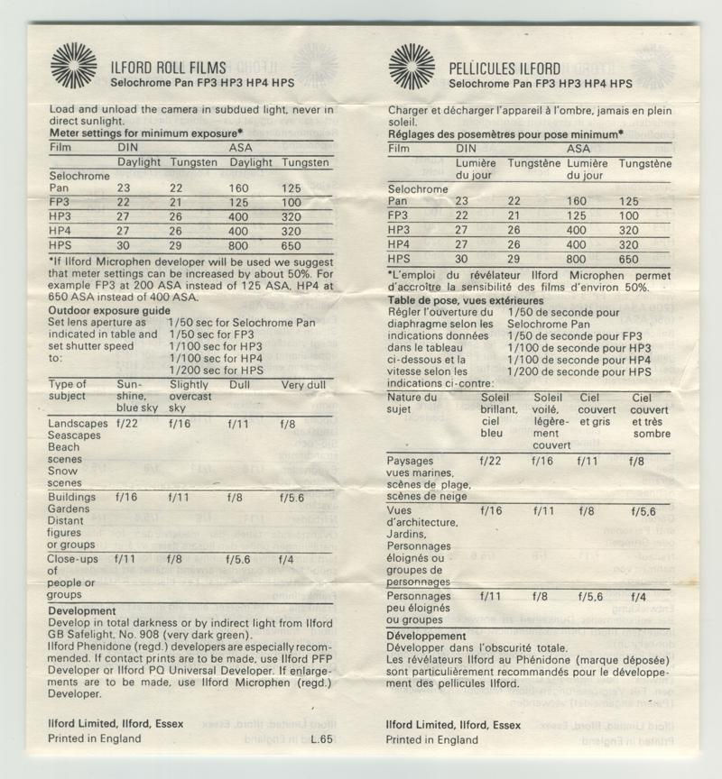
</a>


`UUID: 9298339353774799a2918c495d225335`↓

<a href="./archive/00382_002.jpg" target="_blank">
	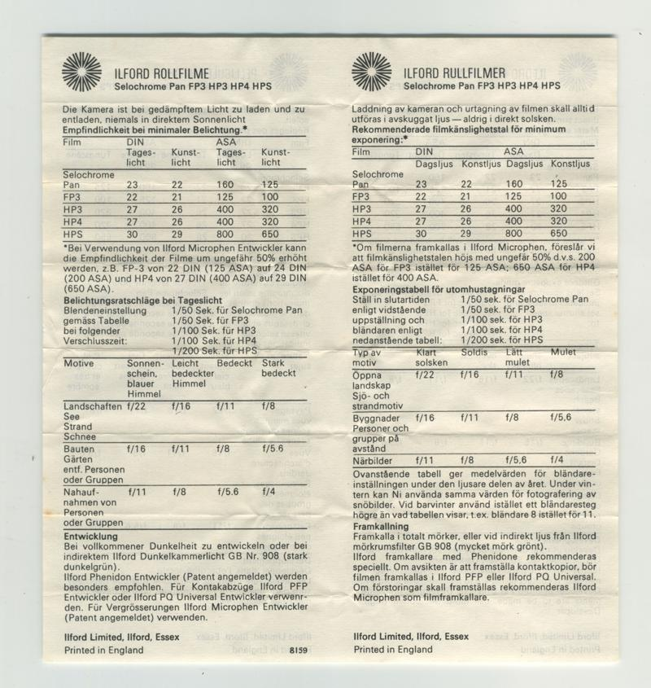
</a>

#### [1969] Agfa Agfacolor Reversal Film CK (ref: 3502)

```
Format: 35mm         |  Process : Unknown 
ISO   : 80           |  Expiry  : 1969-03 
Type  : Single Pack  |  Quantity: 36exp   
Added : 2025-10-21   |  Author  : dekuNukem
UUID  : 9129d9db8e114656a58fd2a422b43502
```

<a href="./archive/00444_000.jpg" target="_blank">
	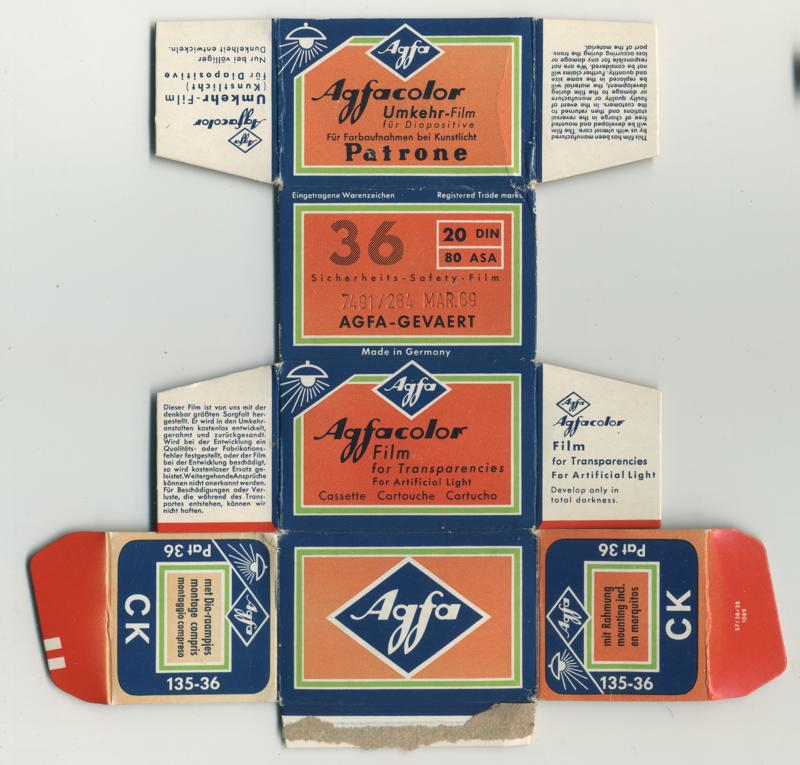
</a>


`UUID: 5d631a69e3e048208c70ec8f859c6045`↓

<a href="./archive/00444_001.jpg" target="_blank">
	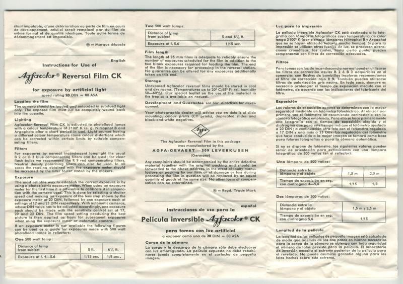
</a>


`UUID: 68d8ba930ba94a23bcc2c63cd9eb85d0`↓

<a href="./archive/00444_002.jpg" target="_blank">
	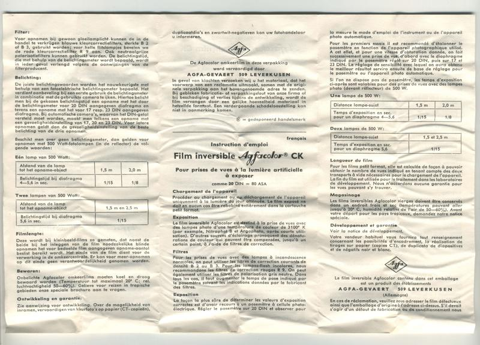
</a>


`UUID: 704456920a9943f6bb8a6527d730503c`↓

<a href="./archive/00444_003.jpg" target="_blank">
	
</a>


`UUID: d777eafbaf03482ca3766210fa8d0e47`↓

<a href="./archive/00444_004.jpg" target="_blank">
	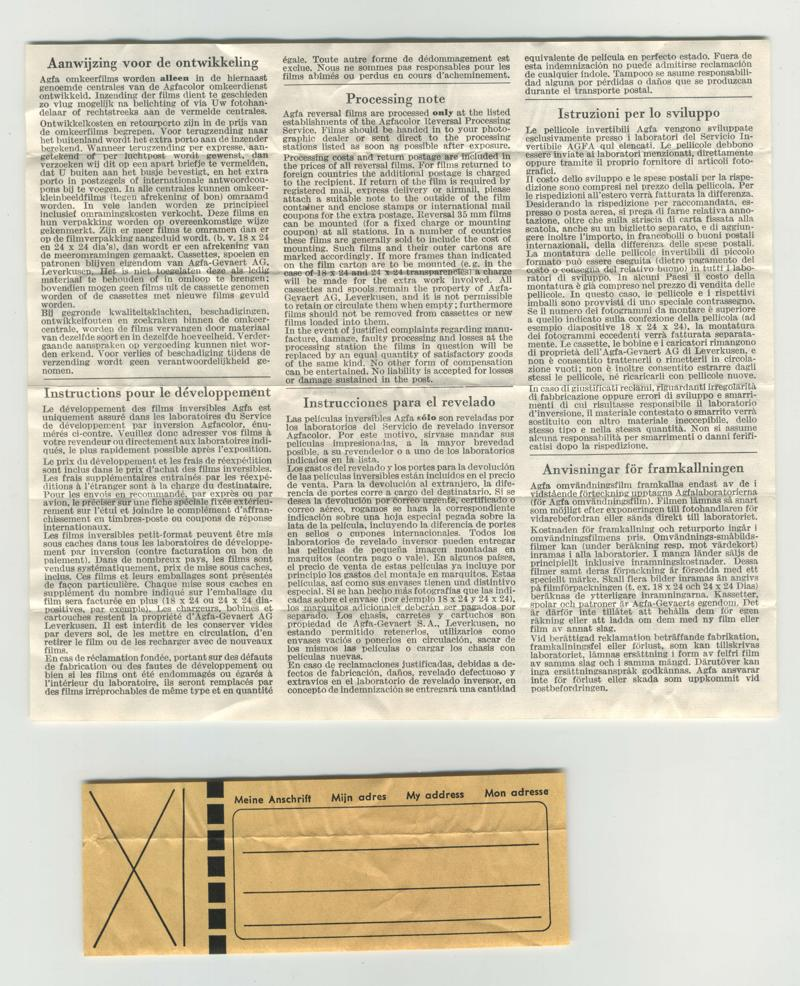
</a>


`UUID: 38c2b3a21696430db60ee99a8c55eb0b`↓

<a href="./archive/00444_005.jpg" target="_blank">
	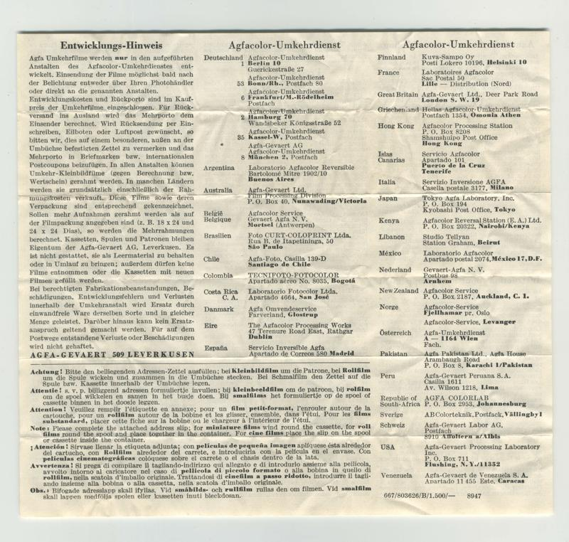
</a>


`UUID: accd90cdf18945939b51da0450c76fa7`↓

<a href="./archive/00444_006.jpg" target="_blank">
	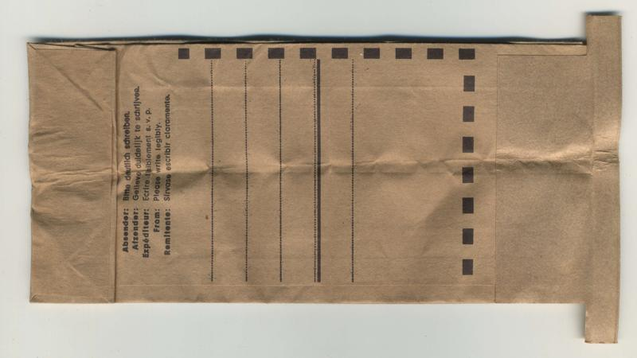
</a>


`UUID: c4b98fe88f5144df9629f289423fe72e`↓

<a href="./archive/00444_007.jpg" target="_blank">
	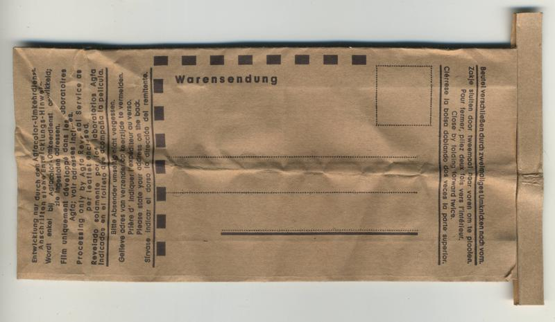
</a>

#### [1970] Kodak Plus-X Pan (ref: f5cc)

```
Format: 35mm         |  Process : BW      
ISO   : 125          |  Expiry  : 1970-01 
Type  : Single Pack  |  Quantity: 36exp   
Added : 2025-08-30   |  Author  : dekuNukem
UUID  : 66f3d693560540d5b5a4cbfb3a91f5cc
```

<a href="./archive/00271_000.jpg" target="_blank">
	
</a>

#### [1970] Kodak High Speed Ektachrome (ref: ec3d)

```
Format: 35mm         |  Process : E-4     
ISO   : 160          |  Expiry  : 1970-06 
Type  : Single Pack  |  Quantity: 36exp   
Added : 2025-01-14   |  Author  : @ob.skura
UUID  : 9702189f65de43c59fce151094a7ec3d
```

<a href="./archive/00045_000.jpg" target="_blank">
	
</a>


`UUID: 1fc1082f5b524367820b31b7669e86cd`↓

<a href="./archive/00045_001.jpg" target="_blank">
	
</a>


`UUID: 6b248d300438476aa38c9b6bce04fc87`↓

<a href="./archive/00045_002.jpg" target="_blank">
	
</a>

#### [1970] Famous Brand Labs Color Negative Film (ref: b271)

```
Format: 127          |  Process : Unknown 
ISO   : 80           |  Expiry  : 1970-08 
Type  : Single Pack  |  Quantity: N/A     
Added : 2025-10-25   |  Author  : dekuNukem
UUID  : 60accb18d36a4358b857d58e5f91b271
Notes : Made in Belgium
```

<a href="./archive/00452_000.jpg" target="_blank">
	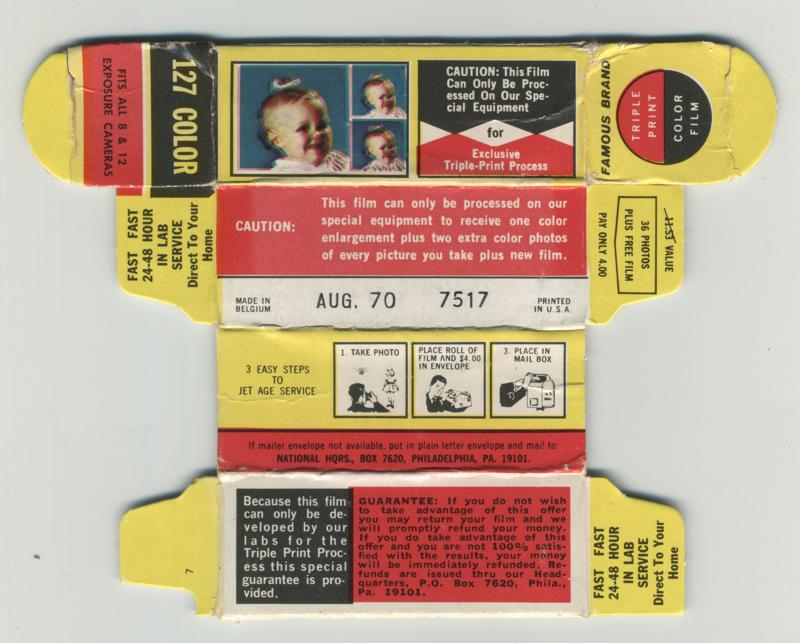
</a>


`UUID: 446f576effb34b8c9697e27a7dcbd109`↓

<a href="./archive/00452_001.jpg" target="_blank">
	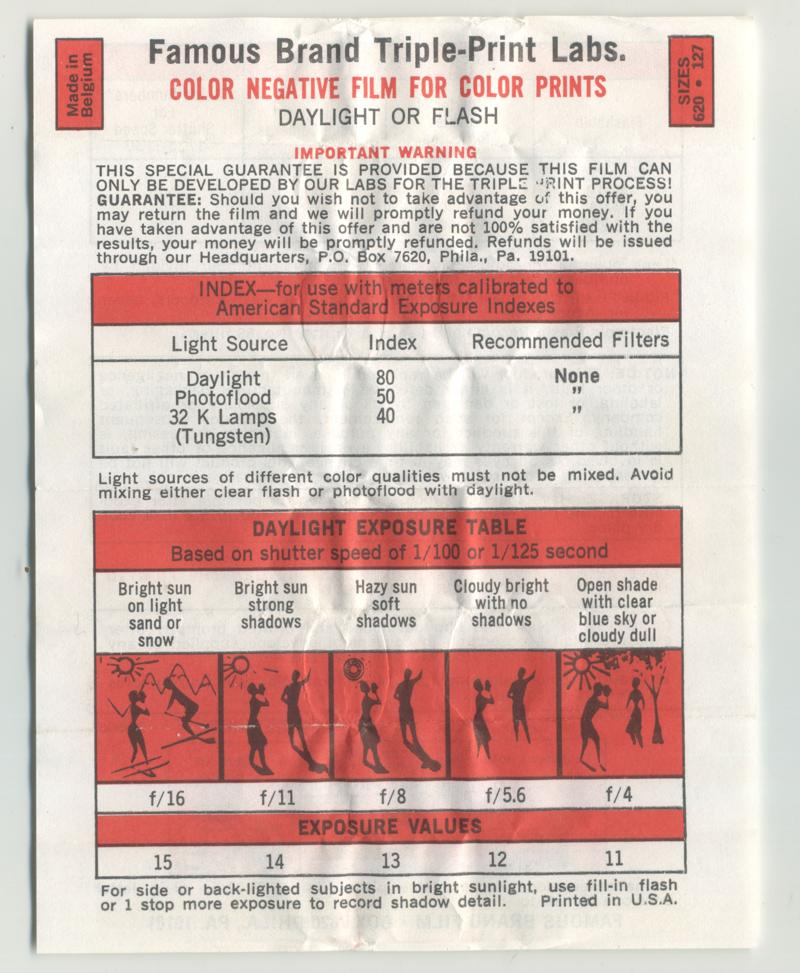
</a>


`UUID: 853499e631474d46b5d2d65e937f6ebd`↓

<a href="./archive/00452_002.jpg" target="_blank">
	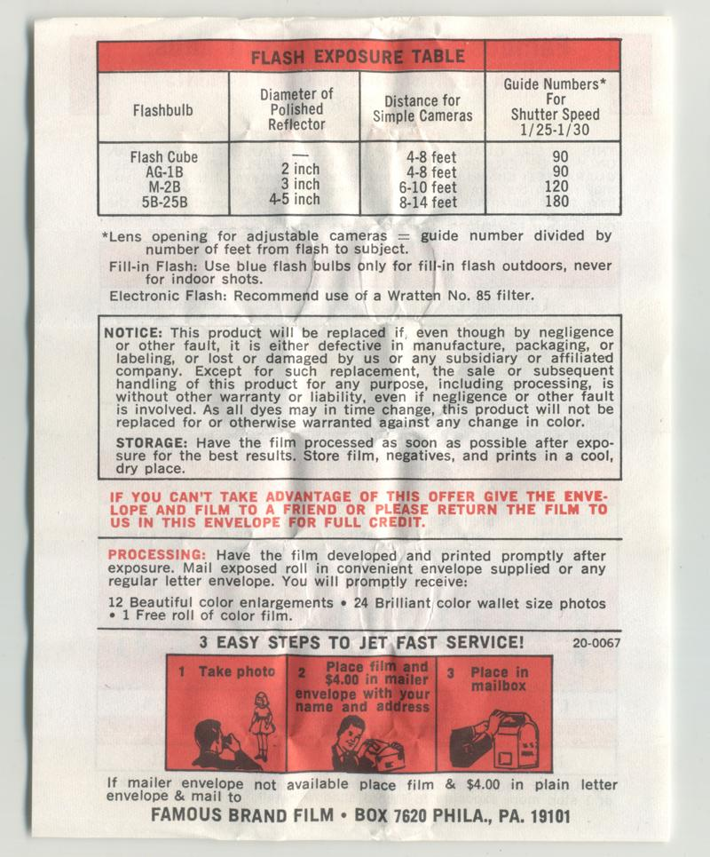
</a>

#### [1970] Kodak High Contrast Copy Film (ref: db52)

```
Format: 35mm         |  Process : BW      
ISO   : Unknown      |  Expiry  : 1970-09 
Type  : Bulk Roll    |  Quantity: 100ft   
Added : 2025-08-14   |  Author  : Camera.Riley
UUID  : 7a518ce06cc242f9a5af067c1ffedb52
```

<a href="./archive/00181_000.jpg" target="_blank">
	
</a>


`UUID: c18af4a6fe504e6bab7aaa0cdccb02a1`↓

<a href="./archive/00181_001.jpg" target="_blank">
	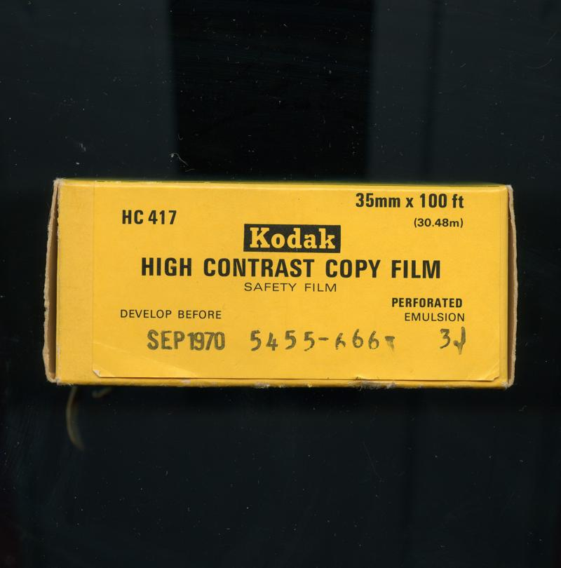
</a>


`UUID: 312da1e64f2f416f9b394ea7e4e34e86`↓

<a href="./archive/00181_002.jpg" target="_blank">
	
</a>


`UUID: 917cdc09fdc9435c90eb61f470def180`↓

<a href="./archive/00181_003.jpg" target="_blank">
	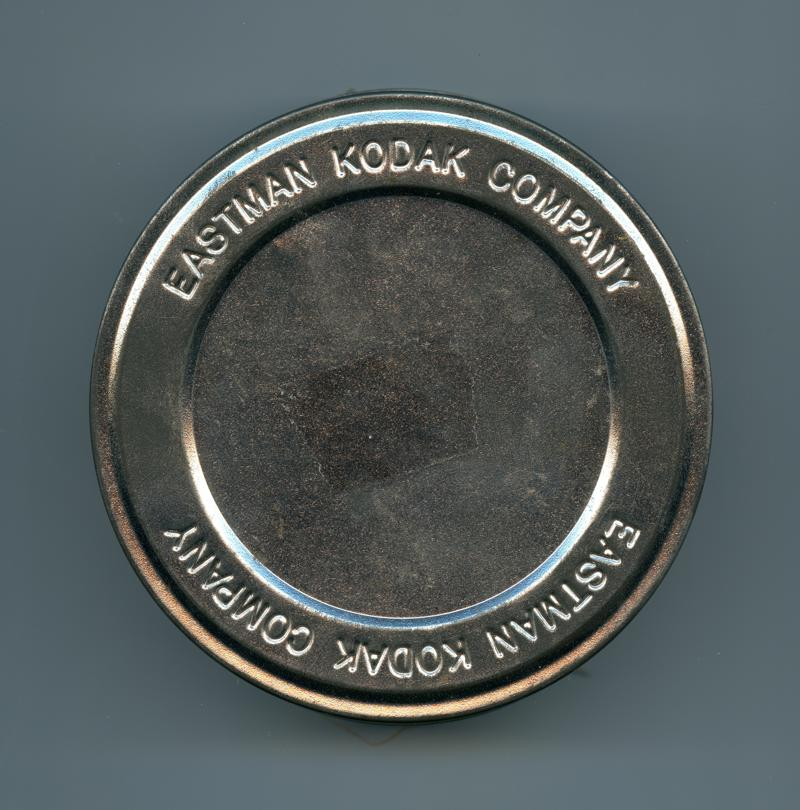
</a>

#### [1971] Agfa Agfacolor Special Negative Film CN S (ref: 1e83)

```
Format: 120          |  Process : Unknown 
ISO   : 80           |  Expiry  : 1971-01 
Type  : Single Pack  |  Quantity: Unknown 
Added : 2025-10-21   |  Author  : dekuNukem
UUID  : 2e99ee5a9888408093d6983ed9871e83
```

<a href="./archive/00439_000.jpg" target="_blank">
	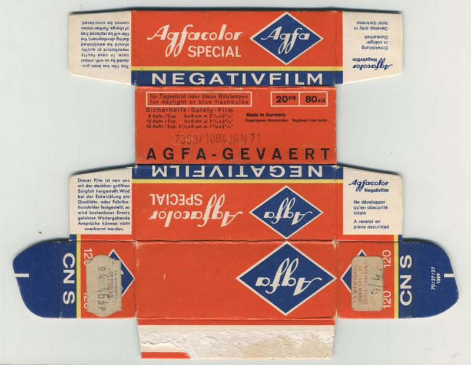
</a>


`UUID: 019691600c184b2e8e1128dc6207790f`↓

<a href="./archive/00439_001.jpg" target="_blank">
	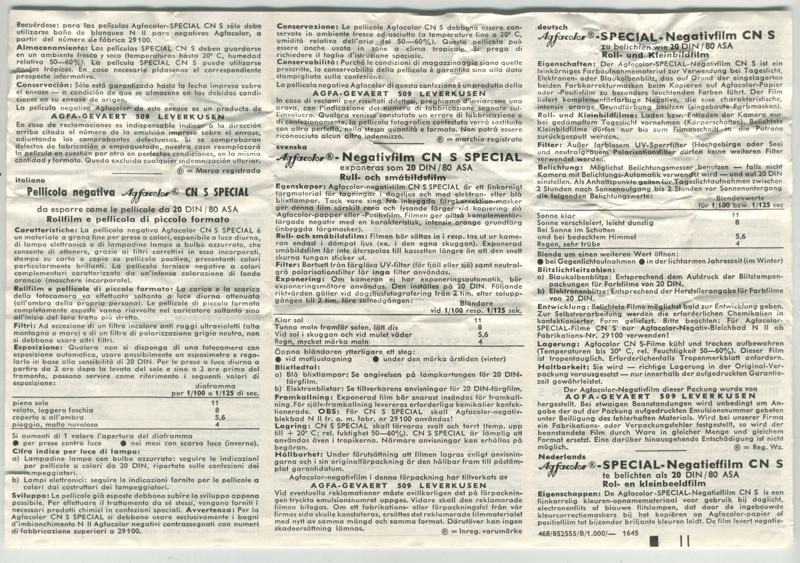
</a>


`UUID: 7950cdc041654b77a36cee356ebc02b8`↓

<a href="./archive/00439_002.jpg" target="_blank">
	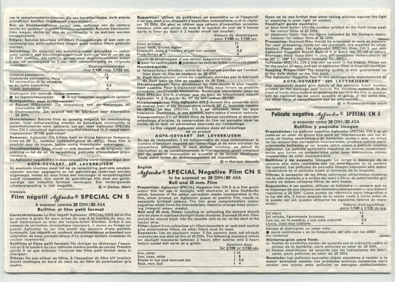
</a>

#### [1971] Kodak Ektachrome-X (ref: c057)

```
Format: 620          |  Process : E-4     
ISO   : 64           |  Expiry  : 1971-02 
Type  : Single Pack  |  Quantity: N/A     
Added : 2025-10-21   |  Author  : dekuNukem
UUID  : 769ecaf549984530942ed4b96e1dc057
```

<a href="./archive/00423_000.jpg" target="_blank">
	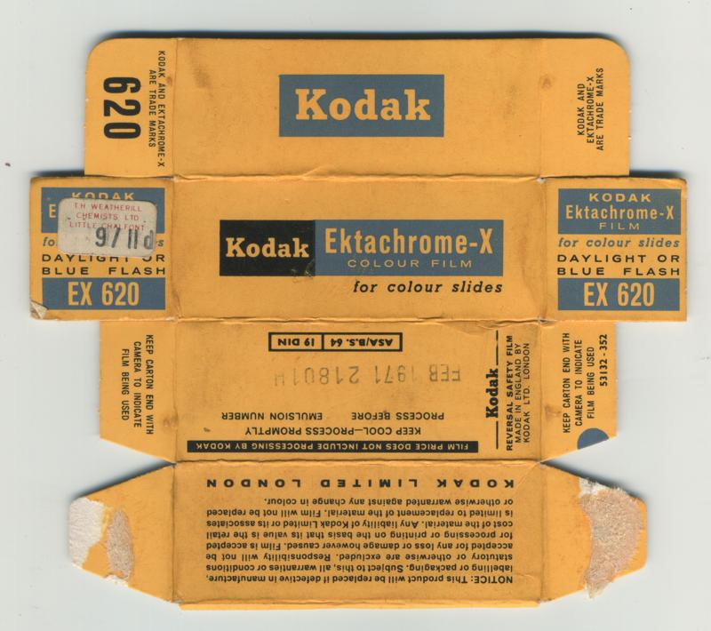
</a>


`UUID: 2708b5dd22794189a31d5bf789bd32be`↓

<a href="./archive/00423_001.jpg" target="_blank">
	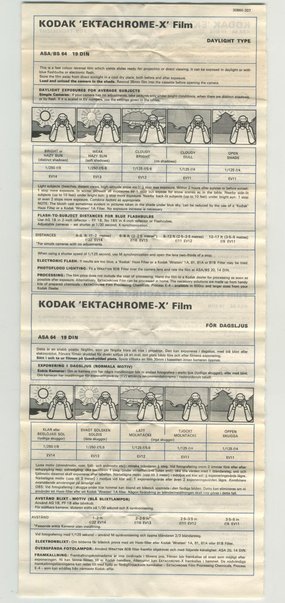
</a>


`UUID: 9fef42045e314c30a39c59e90b9e457e`↓

<a href="./archive/00423_002.jpg" target="_blank">
	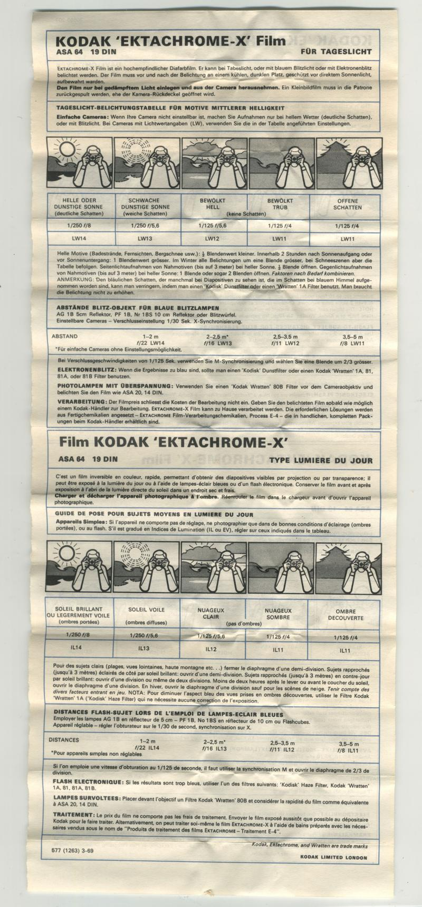
</a>

#### [1971] Kodak Verichrome Pan (ref: 0195)

```
Format: 620          |  Process : BW      
ISO   : 125          |  Expiry  : 1971-03 
Type  : Single Pack  |  Quantity: N/A     
Added : 2025-01-12   |  Author  : b0baspace
UUID  : 75c7c232d44949c3b1d766b0d2580195
```

<a href="./archive/00041_000.jpg" target="_blank">
	
</a>

#### [1971] Foma Fomapan21 (ref: 75d9)

```
Format: 120          |  Process : BW      
ISO   : 100          |  Expiry  : 1971-04 
Type  : Single Pack  |  Quantity: N/A     
Added : 2025-06-21   |  Author  : benikum 
UUID  : 098e510bfaa14be39697b9d8218475d9
```

<a href="./archive/00074_000.jpg" target="_blank">
	
</a>

#### [1971] Famous Brand Labs Color Negative Film (ref: 0cd6)

```
Format: 127          |  Process : Unknown 
ISO   : 64           |  Expiry  : 1971-06 
Type  : Single Pack  |  Quantity: N/A     
Added : 2025-10-21   |  Author  : dekuNukem
UUID  : 1c73b3f95ae14be5ab9a506ac83a0cd6
```

<a href="./archive/00434_000.jpg" target="_blank">
	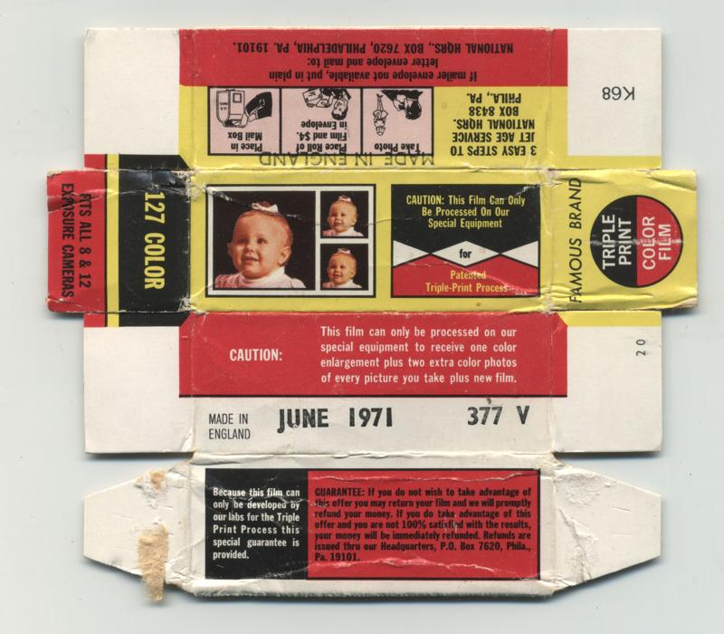
</a>


`UUID: c36b6fd7f2b84c8c804db6b318563ece`↓

<a href="./archive/00434_001.jpg" target="_blank">
	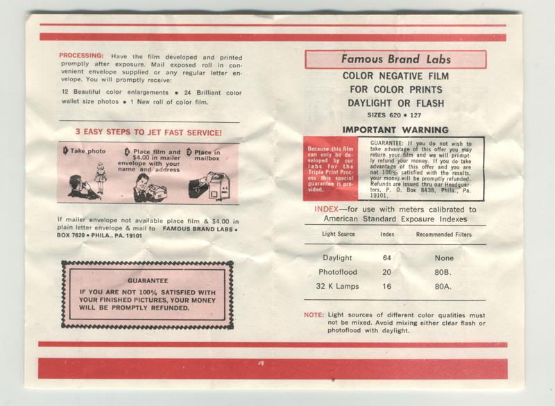
</a>


`UUID: f1b06cc535f346edbc6c46be4b11c79a`↓

<a href="./archive/00434_002.jpg" target="_blank">
	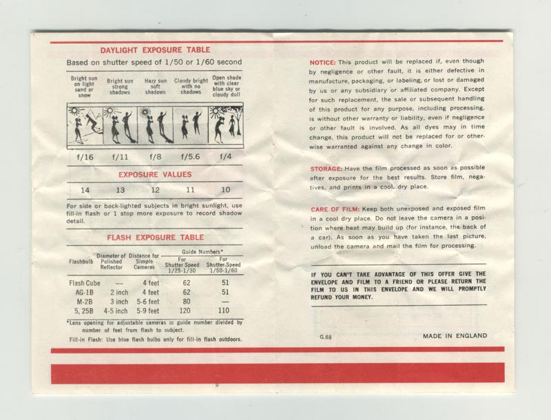
</a>

#### [1972] Kodak Ektachrome-X (ref: ae7e)

```
Format: 828          |  Process : E-4     
ISO   : 64           |  Expiry  : 1972-03 
Type  : Single Pack  |  Quantity: 8exp    
Added : 2025-07-31   |  Author  : The Compartmentalist
UUID  : 4ee1eec740dd4838a83384cc19c6ae7e
```

<a href="./archive/00120_000.jpg" target="_blank">
	
</a>

#### [1973] Kodak Ektachrome-X (ref: aec5)

```
Format: 35mm         |  Process : E-4     
ISO   : 64           |  Expiry  : 1973-06 
Type  : Single Pack  |  Quantity: 20exp   
Added : 2025-07-31   |  Author  : The Compartmentalist
UUID  : 6a81b1428cfe46c8b9cf187fb672aec5
```

<a href="./archive/00119_000.jpg" target="_blank">
	
</a>

#### [1974] Agfa Isopan ISS (ref: 5ba6)

```
Format: 127          |  Process : BW      
ISO   : 100          |  Expiry  : 1974-01 
Type  : Single Pack  |  Quantity: N/A     
Added : 2025-09-28   |  Author  : fine-seat
UUID  : ab1d4ea5f512444e92d82e4610c75ba6
```

<a href="./archive/00357_000.jpg" target="_blank">
	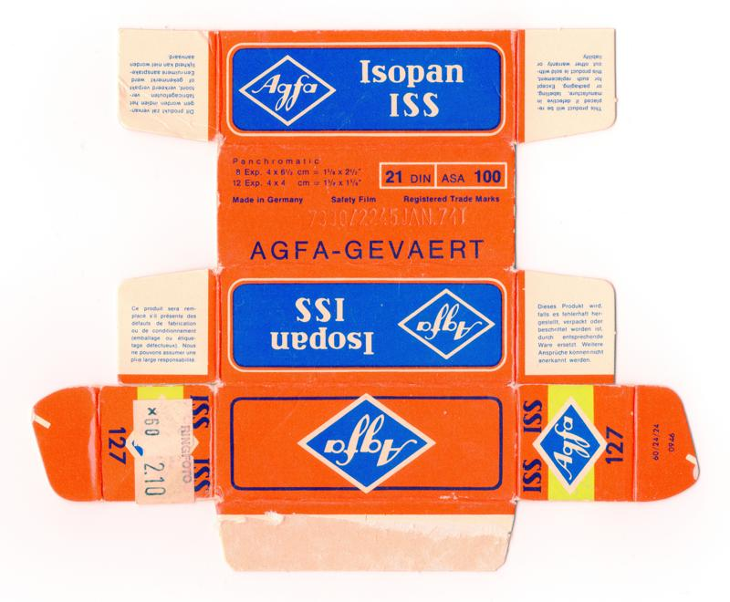
</a>

#### [1974] Agfa Isopan ISS Rapid (ref: 9799)

```
Format: 35mm         |  Process : BW      
ISO   : 100          |  Expiry  : 1974-01 
Type  : Single Pack  |  Quantity: Unknown 
Added : 2025-10-21   |  Author  : dekuNukem
UUID  : 3b6a16ff2678454590c574c2fd969799
```

<a href="./archive/00449_000.jpg" target="_blank">
	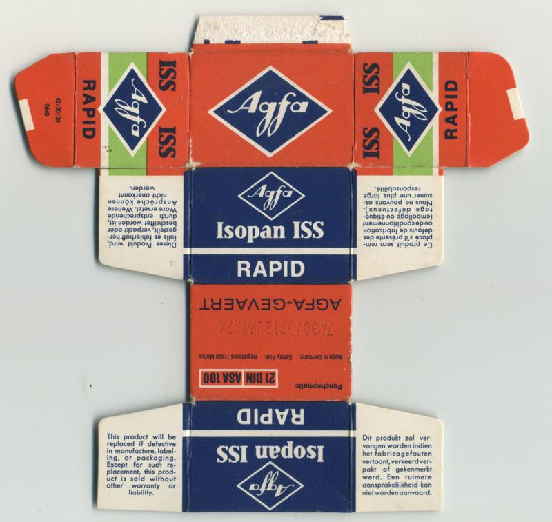
</a>

#### [1974] GAF Color Slide Film (ref: dea6)

```
Format: 126          |  Process : AR-1    
ISO   : 64           |  Expiry  : 1974-01 
Type  : Single Pack  |  Quantity: 20exp   
Added : 2025-02-04   |  Author  : b0baspace
UUID  : c426ea17398c4c549c6a2720103adea6
```

<a href="./archive/00054_000.jpg" target="_blank">
	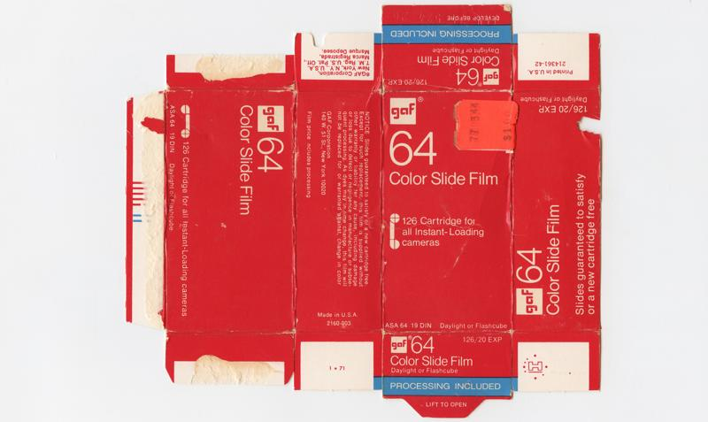
</a>


`UUID: f8987f712bca4daaae3f732500332332`↓

<a href="./archive/00054_001.jpg" target="_blank">
	
</a>


`UUID: 02c9a3b0b9f547c4ab3cabb2d1173fdf`↓

<a href="./archive/00054_002.jpg" target="_blank">
	
</a>


`UUID: a332a7492f2b4a708c8a0ead5b9af986`↓

<a href="./archive/00054_003.jpg" target="_blank">
	
</a>


`UUID: dd9347600c9a47299504239d1038f0dd`↓

<a href="./archive/00054_004.jpg" target="_blank">
	
</a>


`UUID: 90cc6194552d42dd873d9af54a9bc283`↓

<a href="./archive/00054_005.jpg" target="_blank">
	
</a>

#### [1974] Kodak High Speed Infrared Film 2481 (ref: aa7a)

```
Format: 35mm         |  Process : BW      
ISO   : Unknown      |  Expiry  : 1974-01 
Type  : Bulk Roll    |  Quantity: 150ft   
Added : 2025-09-28   |  Author  : @ellafridalindblom
UUID  : 6670d5214ea545e99bfb7aadb6d4aa7a
```

<a href="./archive/00353_000.jpg" target="_blank">
	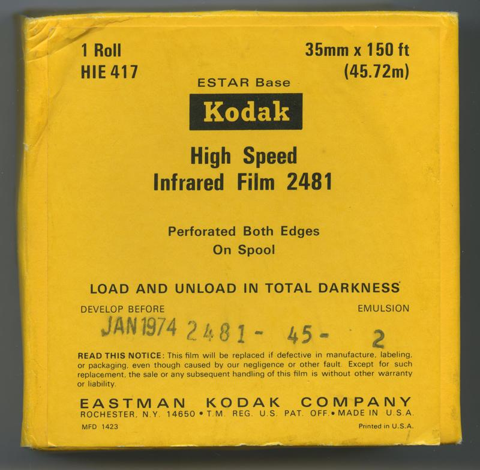
</a>

#### [1974] Kodak Kodacolor-X (ref: a4b1)

```
Format: 120          |  Process : C-22    
ISO   : 80           |  Expiry  : 1974-01 
Type  : Single Pack  |  Quantity: N/A     
Added : 2025-05-24   |  Author  : dekuNukem
UUID  : 01bfcffd1db54d6eadefbc1442f7a4b1
```

<a href="./archive/00064_000.jpg" target="_blank">
	
</a>


`UUID: 20e8ec19e41a4c1e99eac4cd7ce097fa`↓

<a href="./archive/00064_001.jpg" target="_blank">
	
</a>


`UUID: fc168256a6044253a1cf1c8362cf5c50`↓

<a href="./archive/00064_002.jpg" target="_blank">
	
</a>

#### [1974] Porst Color N21 (ref: 494a)

```
Format: 35mm         |  Process : C-22    
ISO   : 100          |  Expiry  : 1974-01 
Type  : Single Pack  |  Quantity: 20exp   
Added : 2025-01-14   |  Author  : @ob.skura
UUID  : e08418889f714c9dbda0858718e0494a
```

<a href="./archive/00046_000.jpg" target="_blank">
	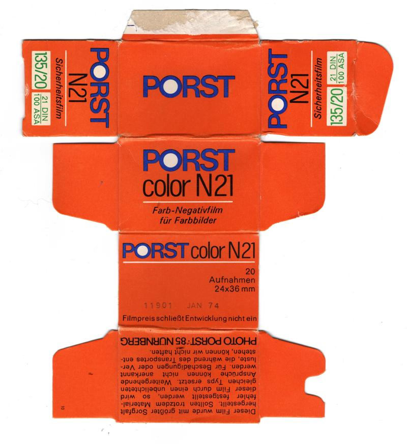
</a>


`UUID: e9bc17db34fa4b779e283c96c92b2359`↓

<a href="./archive/00046_001.jpg" target="_blank">
	
</a>

#### [1974] Kodak Kodacolor-X (ref: 0ce5)

```
Format: 126          |  Process : C-22    
ISO   : 80           |  Expiry  : 1974-09 
Type  : Single Pack  |  Quantity: 12exp   
Added : 2025-09-01   |  Author  : dekuNukem
UUID  : 818038affb2c4137a33e5de403510ce5
```

<a href="./archive/00280_000.jpg" target="_blank">
	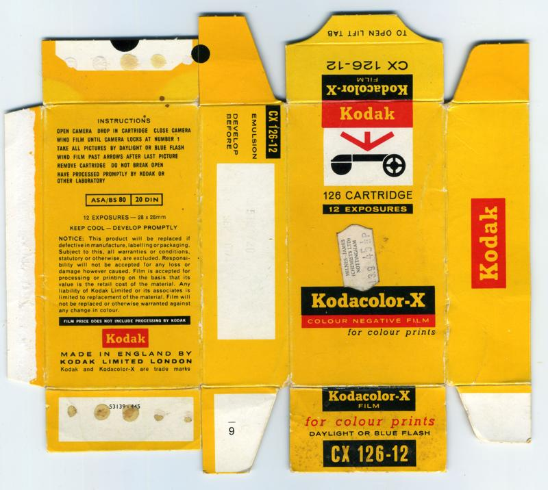
</a>

#### [1974] Kodak Ektachrome Professional Type B (ref: 1d9d)

```
Format: 120          |  Process : E-3     
ISO   : 32           |  Expiry  : 1974-11 
Type  : Single Pack  |  Quantity: N/A     
Added : 2025-09-03   |  Author  : dekuNukem
UUID  : 666d8c45723a458199b88976a68e1d9d
```

<a href="./archive/00296_000.jpg" target="_blank">
	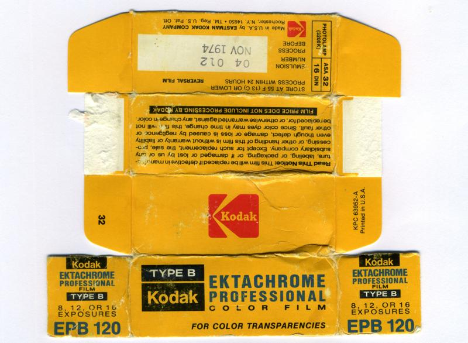
</a>


`UUID: f334a74bb5b94b8f9b24bda99e8ef2ab`↓

<a href="./archive/00296_001.jpg" target="_blank">
	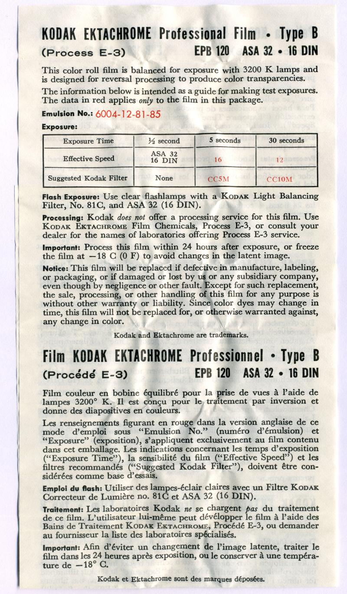
</a>


`UUID: 5b61ba8200934d8b8f89c63c03d389f1`↓

<a href="./archive/00296_002.jpg" target="_blank">
	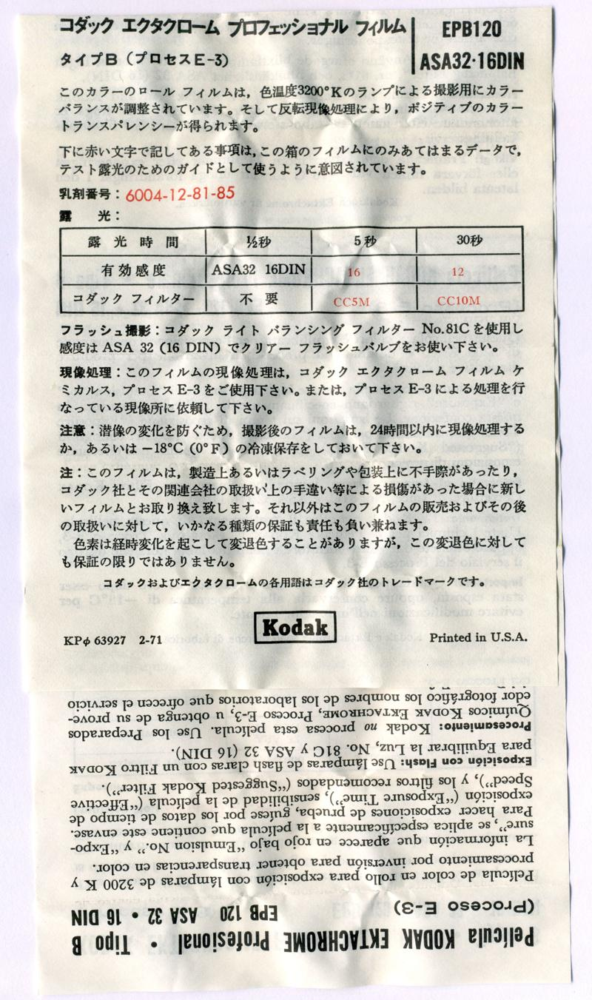
</a>


`UUID: 349ef3a2ea8244f78955530ca905e8c9`↓

<a href="./archive/00296_003.jpg" target="_blank">
	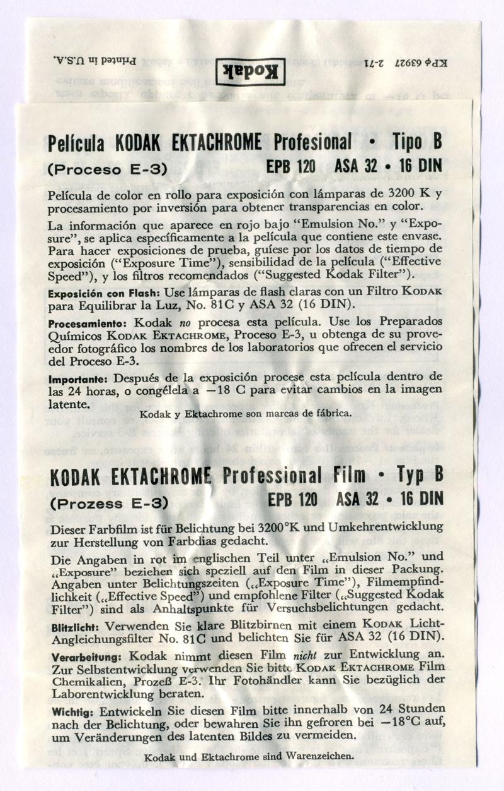
</a>


`UUID: b7c2b191e72e4ae297c4c78d98585957`↓

<a href="./archive/00296_004.jpg" target="_blank">
	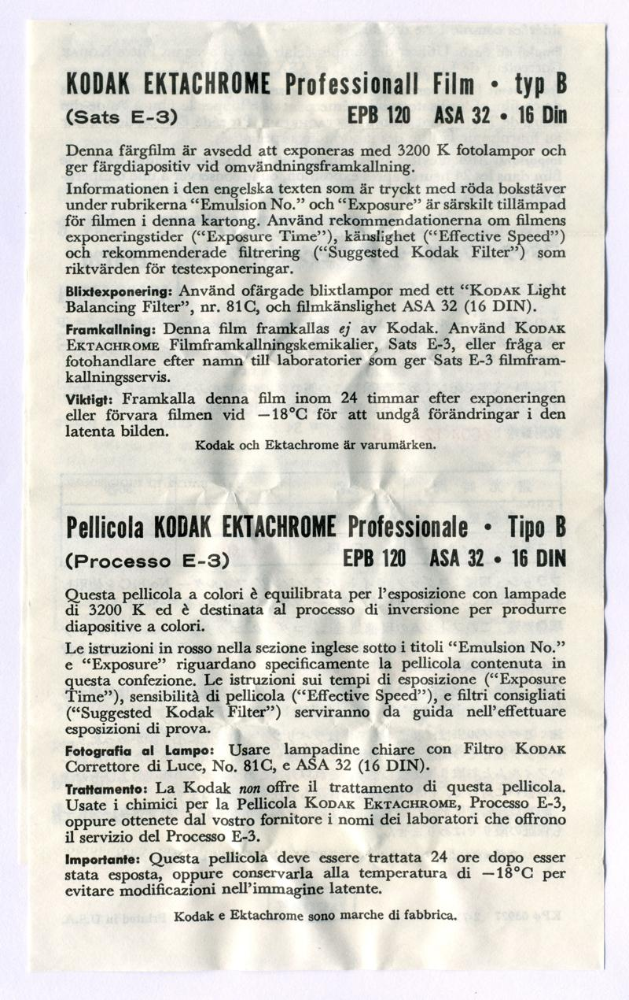
</a>

#### [1974] Kodak High Speed Ektachrome (ref: be8f)

```
Format: 120          |  Process : E-4     
ISO   : 160          |  Expiry  : 1974-12 
Type  : Single Pack  |  Quantity: N/A     
Added : 2025-08-28   |  Author  : The Compartmentalist
UUID  : 221130722e5d4ecfb94b4c1326dcbe8f
```

<a href="./archive/00262_000.jpg" target="_blank">
	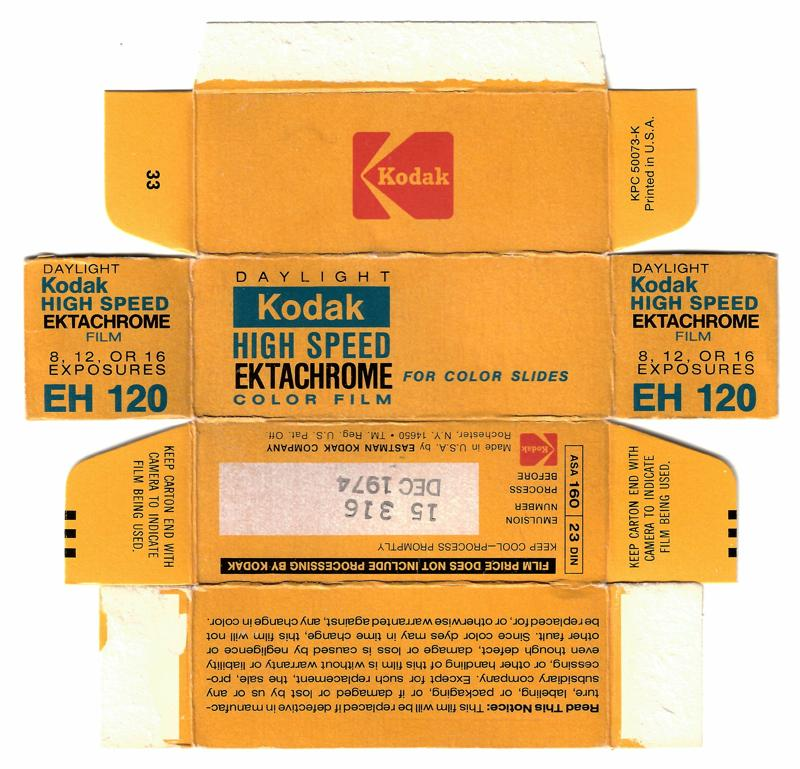
</a>


`UUID: 92d31dfc11894fdbbaa954ad3a06fdec`↓

<a href="./archive/00262_001.jpg" target="_blank">
	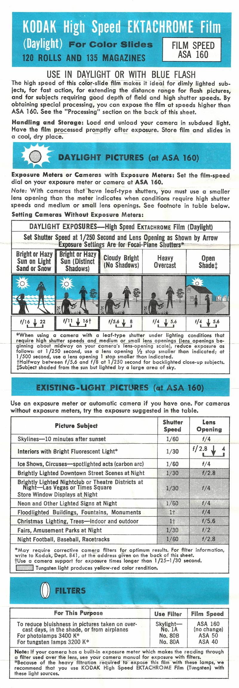
</a>


`UUID: 240477250c92463e90e7887b069dcb03`↓

<a href="./archive/00262_002.jpg" target="_blank">
	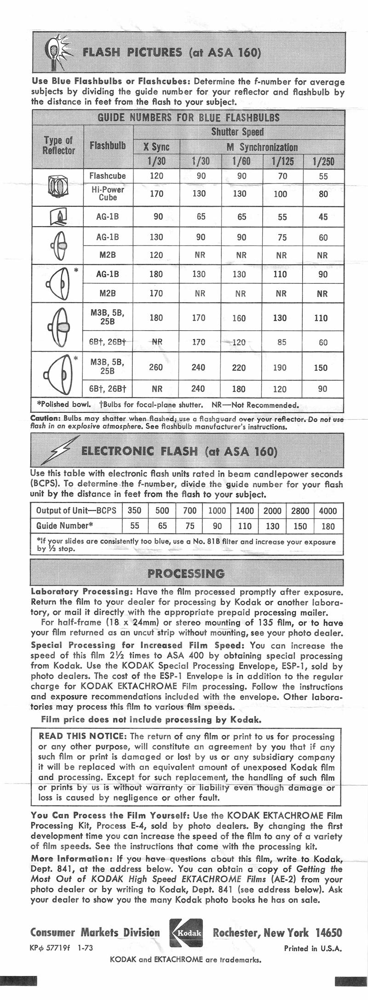
</a>

#### [1975] Fujifilm Neopan SS Rapid (ref: 9db3)

```
Format: 35mm         |  Process : BW      
ISO   : 100          |  Expiry  : 1975-02 
Type  : Single Pack  |  Quantity: 12exp   
Added : 2025-07-31   |  Author  : The Compartmentalist
UUID  : 1c541b4c837944d788eab8986f349db3
```

<a href="./archive/00118_000.jpg" target="_blank">
	
</a>

#### [1975] Kodak Kodacolor-X (ref: 5302)

```
Format: 126          |  Process : C-22    
ISO   : 80           |  Expiry  : 1975-05 
Type  : Single Pack  |  Quantity: 20exp   
Added : 2025-01-04   |  Author  : dekuNukem
UUID  : 5a3d2ba8ff7649c9b3450d7069445302
```

<a href="./archive/00024_000.jpg" target="_blank">
	
</a>

#### [1975] Kodak Tri-X Pan (ref: 6608)

```
Format: 12x16.5cm    |  Process : BW      
ISO   : 320          |  Expiry  : 1975-09 
Type  : Single Pack  |  Quantity: 25 Sheets
Added : 2025-10-27   |  Author  : @ellafridalindblom
UUID  : 2210a8e9fb4c400d8258a652aaba6608
Notes : Estar Thick Base 4164
```

<a href="./archive/00454_000.jpg" target="_blank">
	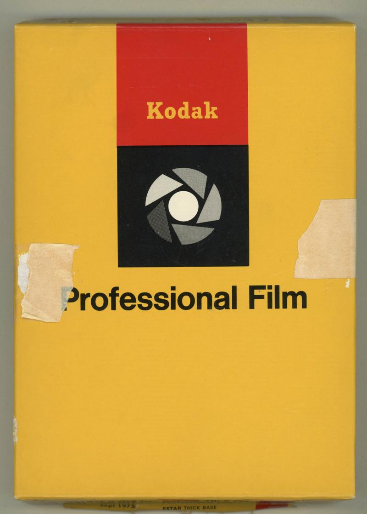
</a>


`UUID: 8c0dda70e6d44bde9777605dc13cf00f`↓

<a href="./archive/00454_001.jpg" target="_blank">
	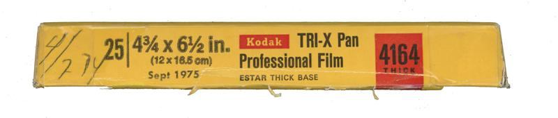
</a>


`UUID: 4f0a47ed8f2a4625956d3e2255b35bd1`↓

<a href="./archive/00454_002.jpg" target="_blank">
	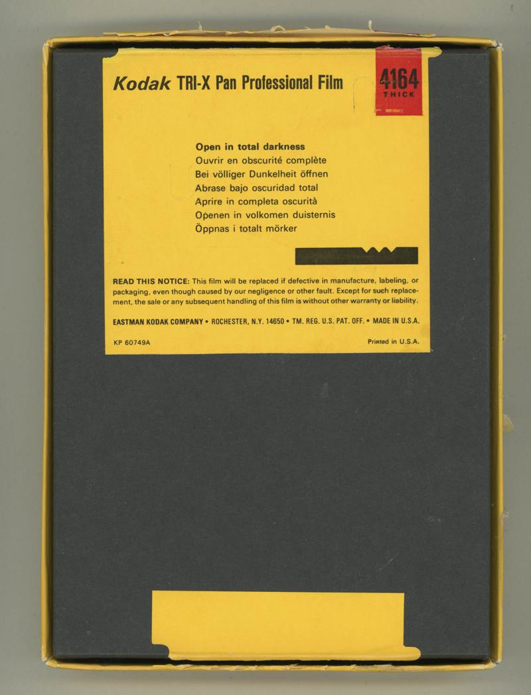
</a>

#### [1975] PrinzColor Colour Negative Film (ref: 448c)

```
Format: 35mm         |  Process : Unknown 
ISO   : 80           |  Expiry  : 1975-10 
Type  : Single Pack  |  Quantity: 20exp   
Added : 2025-10-02   |  Author  : dekuNukem
UUID  : 1d1377fcb4fa495e9f3009a4c69b448c
```

<a href="./archive/00363_000.jpg" target="_blank">
	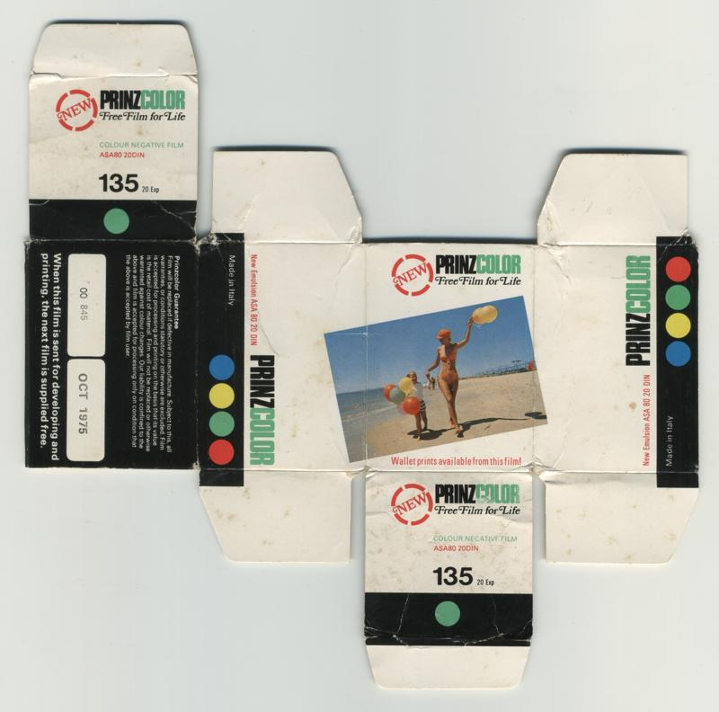
</a>


`UUID: 95f013bdd442471d9258bb0cc8eb77fc`↓

<a href="./archive/00363_001.jpg" target="_blank">
	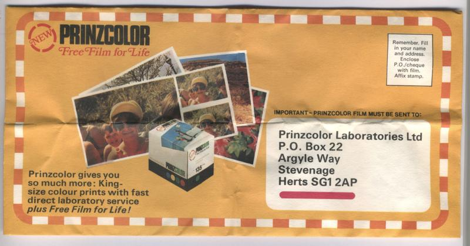
</a>


`UUID: a29f494b970044eab313b00b12096cf3`↓

<a href="./archive/00363_002.jpg" target="_blank">
	
</a>


`UUID: 2672ff6891f14e44b7f3077a501ae234`↓

<a href="./archive/00363_003.jpg" target="_blank">
	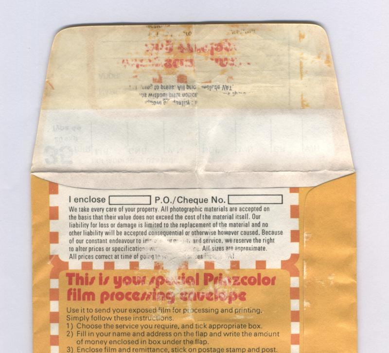
</a>


`UUID: 4e513a5356fb4b3e8bbc3b0d6ae62543`↓

<a href="./archive/00363_004.jpg" target="_blank">
	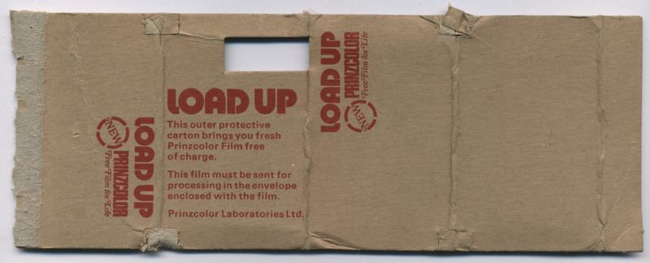
</a>

#### [1976] Agfa Isopan IF Rapid (ref: 2b99)

```
Format: 35mm         |  Process : BW      
ISO   : 40           |  Expiry  : 1976-01 
Type  : Single Pack  |  Quantity: Unknown 
Added : 2025-10-21   |  Author  : dekuNukem
UUID  : f8785e8bcd5748aeb847c3f6b2d62b99
```

<a href="./archive/00447_000.jpg" target="_blank">
	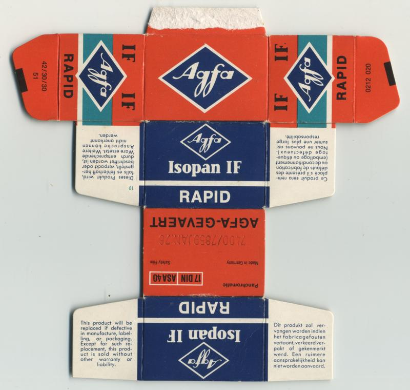
</a>

#### [1976] Triple-Print Film Labs Color Negative Film (ref: 88e6)

```
Format: 127          |  Process : Unknown 
ISO   : 80           |  Expiry  : 1976-02 
Type  : Single Pack  |  Quantity: N/A     
Added : 2025-10-21   |  Author  : dekuNukem
UUID  : 25dfa3f80baf4a72ac548c507f8088e6
Notes : Division of Film Corporation of America
```

<a href="./archive/00427_000.jpg" target="_blank">
	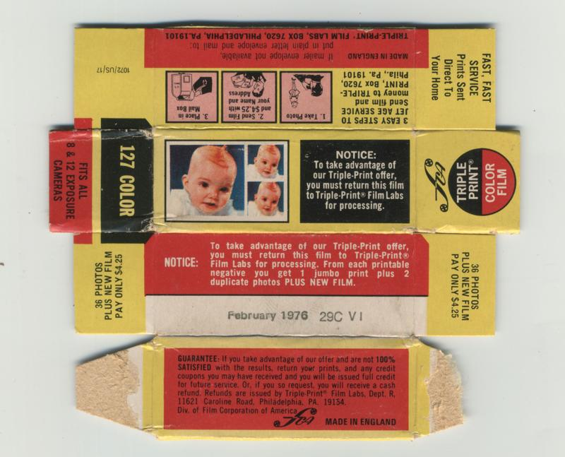
</a>


`UUID: 9047ef27d1be40198e23acb1b7adba39`↓

<a href="./archive/00427_001.jpg" target="_blank">
	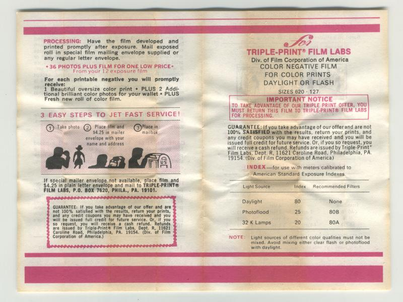
</a>


`UUID: e76e6347947f40ba97b0e11522ce7144`↓

<a href="./archive/00427_002.jpg" target="_blank">
	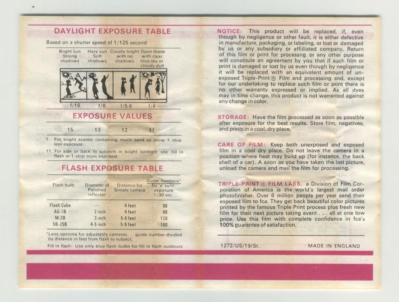
</a>

#### [1976] Film Corporation of America TriFCA 35 (ref: 8f0a)

```
Format: 35mm         |  Process : Unknown 
ISO   : 80           |  Expiry  : 1976-08 
Type  : Single Pack  |  Quantity: 20exp   
Added : 2025-10-02   |  Author  : dekuNukem
UUID  : a3346f80db3b4032a2c69665f7448f0a
```

<a href="./archive/00362_000.jpg" target="_blank">
	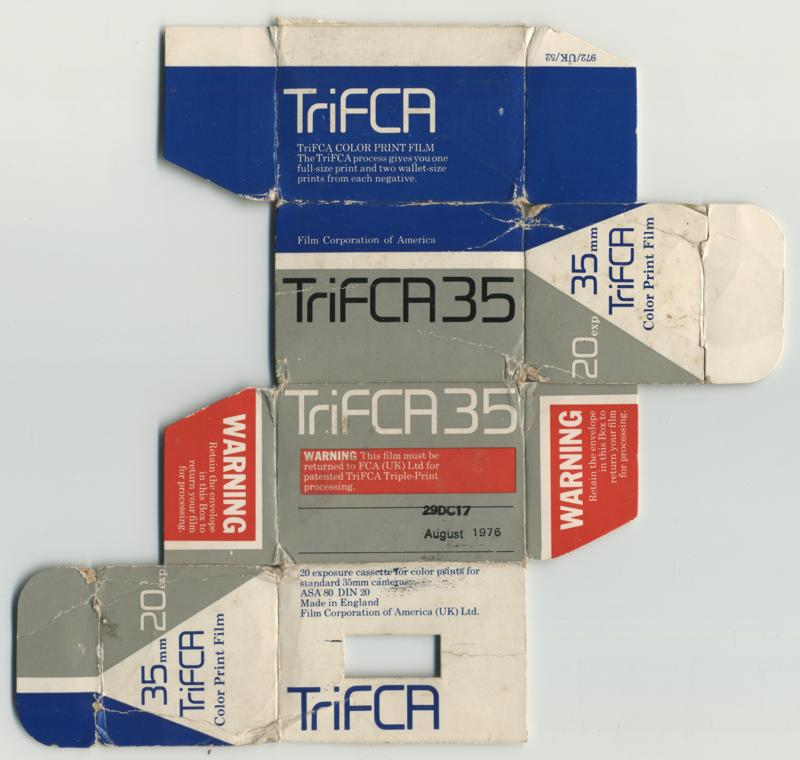
</a>


`UUID: fc5bf25a0e624483a581e4171fb368e1`↓

<a href="./archive/00362_001.jpg" target="_blank">
	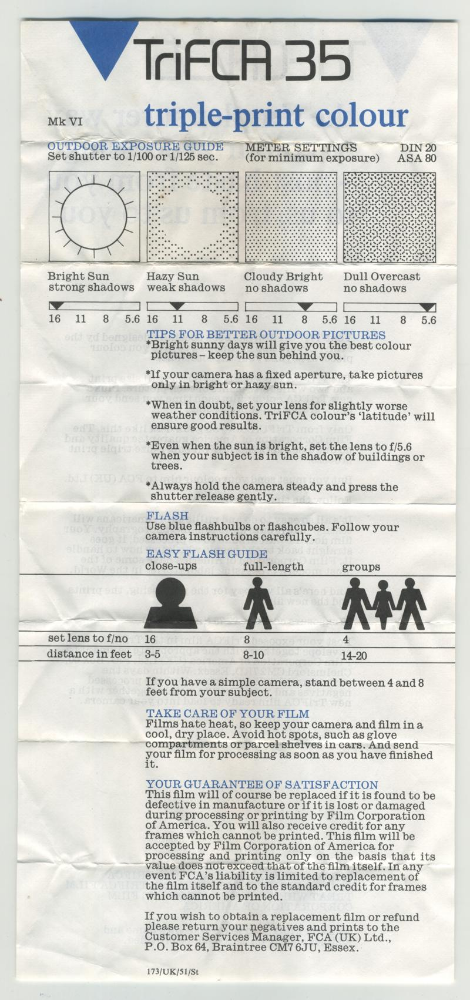
</a>


`UUID: ced4b9758b32450183e2359abbb2dd8a`↓

<a href="./archive/00362_002.jpg" target="_blank">
	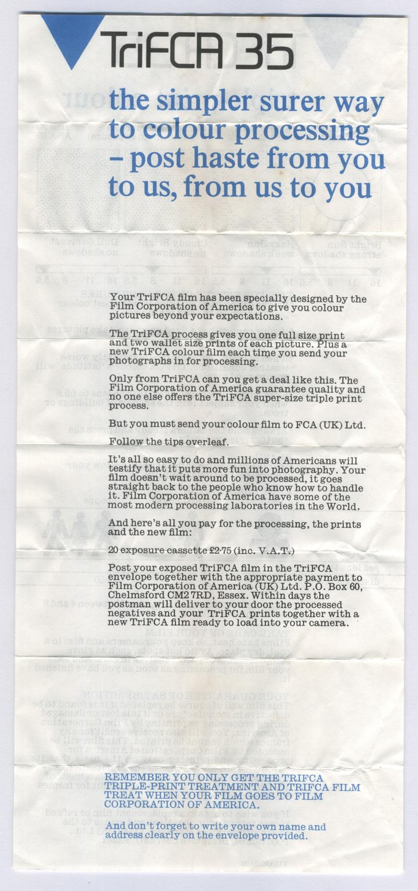
</a>


`UUID: 7527ca56668c467386813a8357601289`↓

<a href="./archive/00362_003.jpg" target="_blank">
	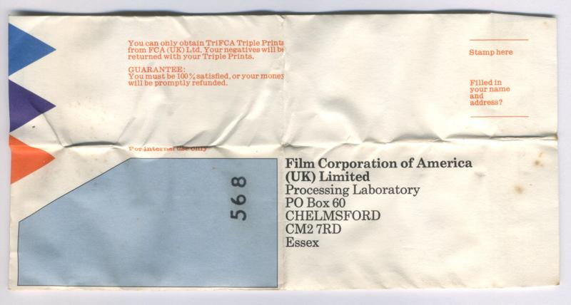
</a>


`UUID: 8c332dbe2d0f4a6389bbcbc8eb93e0aa`↓

<a href="./archive/00362_004.jpg" target="_blank">
	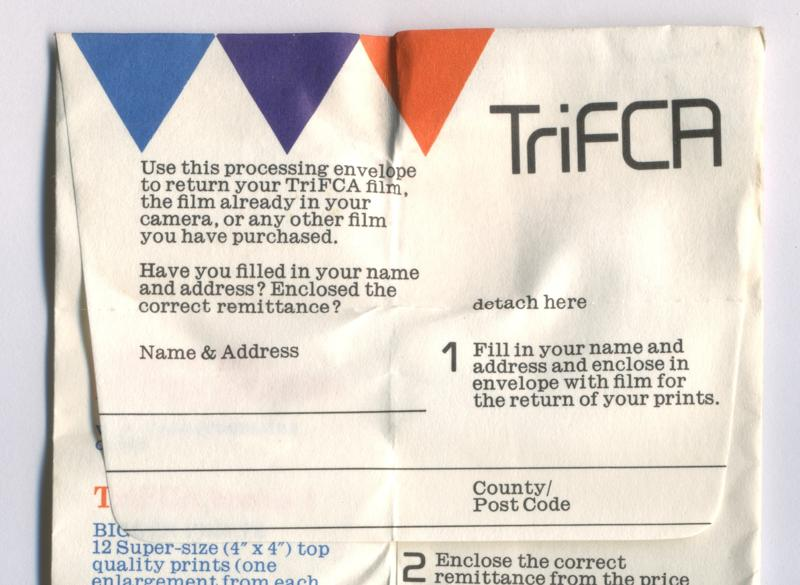
</a>


`UUID: c893ed2ea45f4220b7e8c463a3621b6d`↓

<a href="./archive/00362_005.jpg" target="_blank">
	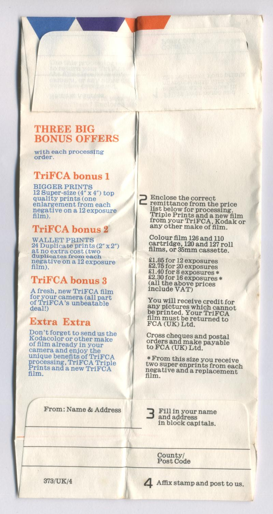
</a>

#### [1976] Agfa Agfacolor Negative Film Special CNS (ref: 9b03)

```
Format: 35mm         |  Process : Unknown 
ISO   : 80           |  Expiry  : 1976-09 
Type  : Single Pack  |  Quantity: 20exp   
Added : 2025-10-17   |  Author  : @recycling.film
UUID  : 1cf0e26c5894469ebdbd94e104c89b03
```

<a href="./archive/00418_000.jpg" target="_blank">
	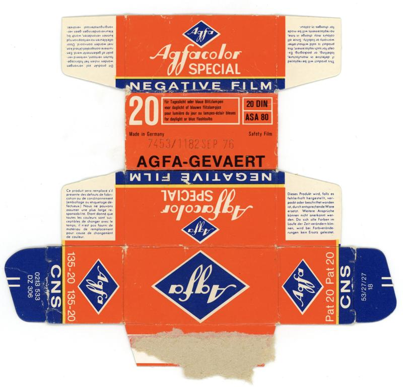
</a>


`UUID: 75c37ed61c3d4b04be3c432a2a80c21e`↓

<a href="./archive/00418_001.jpg" target="_blank">
	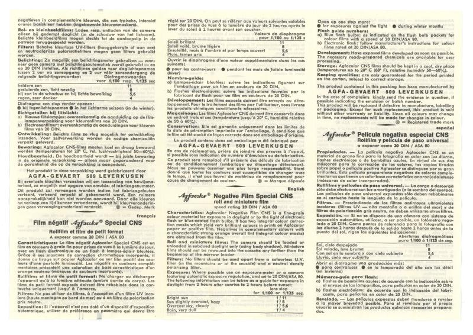
</a>


`UUID: 47363e4b17894d5d99a8c39dfdf981db`↓

<a href="./archive/00418_002.jpg" target="_blank">
	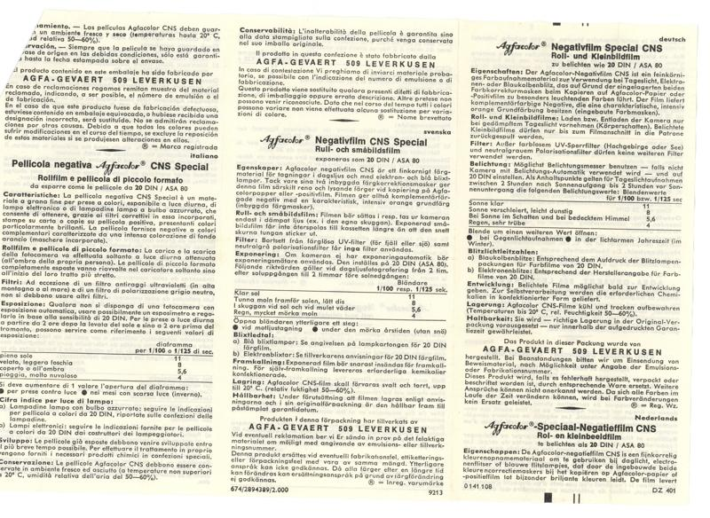
</a>

#### [1976] Film Corporation of America TriFCA 120 (ref: d024)

```
Format: 120          |  Process : Unknown 
ISO   : 80           |  Expiry  : 1976-10 
Type  : Single Pack  |  Quantity: N/A     
Added : 2025-09-18   |  Author  : dekuNukem
UUID  : 6041b4bb7a8149ee98f4b7e3b80ad024
```

<a href="./archive/00347_000.jpg" target="_blank">
	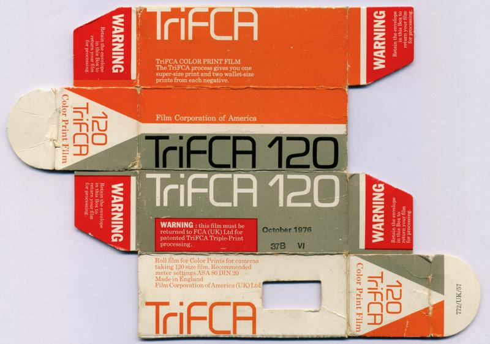
</a>


`UUID: d82edd4e175246df8a163421cbf276fe`↓

<a href="./archive/00347_001.jpg" target="_blank">
	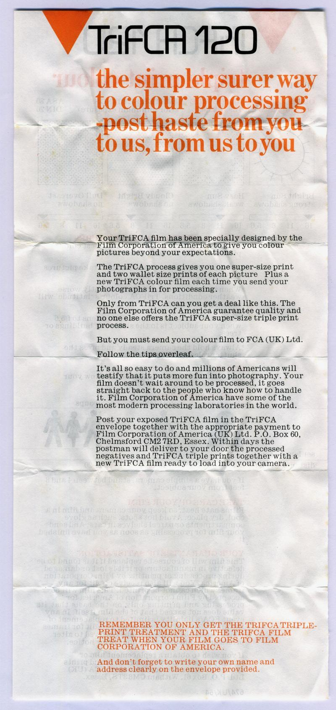
</a>


`UUID: f59f27c936cf4c98bfd8fb480a56f858`↓

<a href="./archive/00347_002.jpg" target="_blank">
	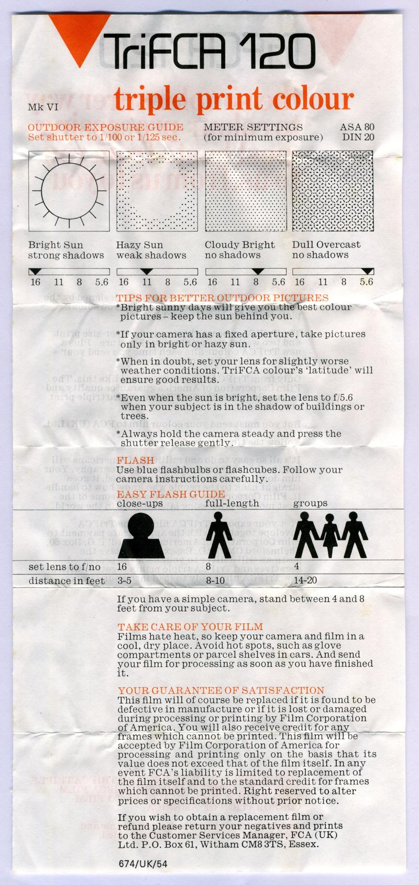
</a>


`UUID: 9d3c5d4e5a1948cc86a38226b1a51dc4`↓

<a href="./archive/00347_003.jpg" target="_blank">
	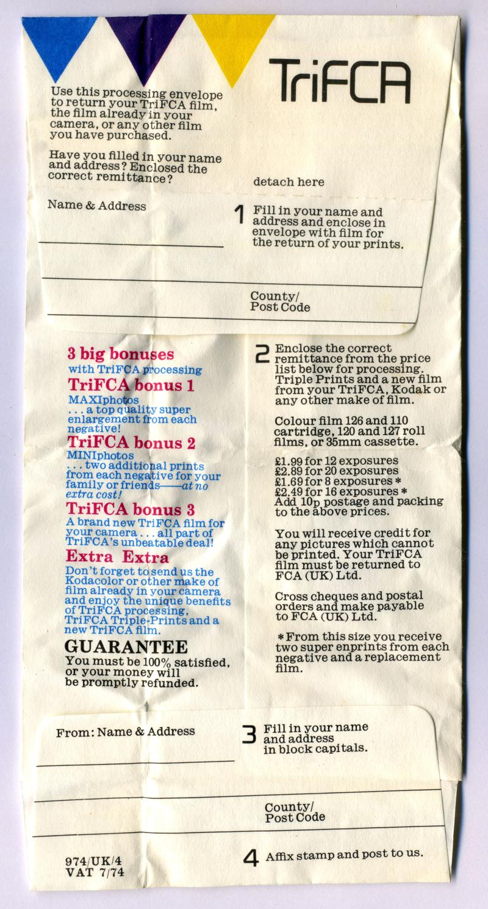
</a>


`UUID: 42849bf6f7684843ab2f412fadcd58e8`↓

<a href="./archive/00347_004.jpg" target="_blank">
	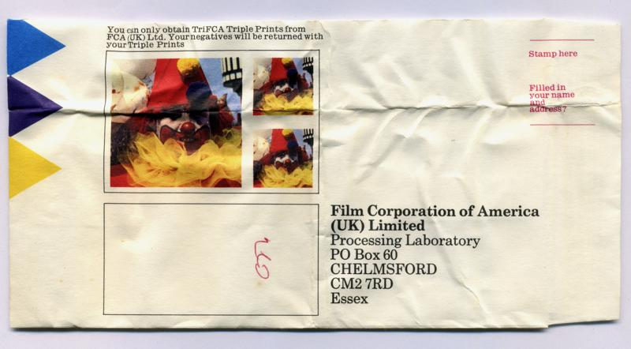
</a>

#### [1976] Kodak Panatomic-X (ref: 8d69)

```
Format: 35mm         |  Process : BW      
ISO   : 32           |  Expiry  : 1976-12 
Type  : Bulk Roll    |  Quantity: 100ft   
Added : 2025-08-16   |  Author  : u/ReeeSchmidtyWerber
UUID  : 386384f6be954ddc8ab42f3bcb1d8d69
```

<a href="./archive/00193_000.jpg" target="_blank">
	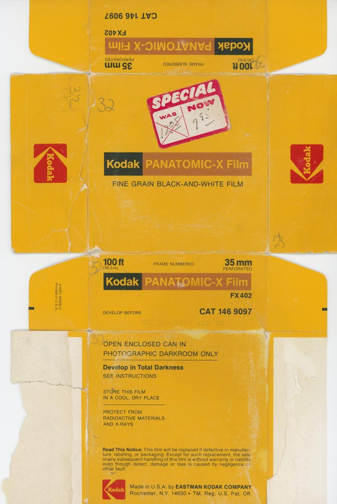
</a>

#### [1977] Kodak High Speed Ektachrome (ref: b8f8)

```
Format: 35mm         |  Process : E-4     
ISO   : 125          |  Expiry  : 1977-01 
Type  : Single Pack  |  Quantity: 36exp   
Added : 2025-07-29   |  Author  : Henry Gunn
UUID  : 86470a73e4b5436b97ffb272be6bb8f8
```

<a href="./archive/00107_000.jpg" target="_blank">
	
</a>


`UUID: 6d7d9f75f74b4caebbb7a7c6e27c663b`↓

<a href="./archive/00107_001.jpg" target="_blank">
	
</a>


`UUID: e582ca2ca6ec44e49e9d9e96a56b930e`↓

<a href="./archive/00107_002.jpg" target="_blank">
	
</a>

#### [1977] Kodak High Speed Ektachrome (ref: 7533)

```
Format: 120          |  Process : Unknown 
ISO   : 125          |  Expiry  : 1977-01 
Type  : Single Pack  |  Quantity: N/A     
Added : 2025-09-06   |  Author  : kaimon  
UUID  : ac9eab85f0874cf7aa5c67f0458e7533
Notes : Tungsten (3200K) EHB 120
```

<a href="./archive/00303_000.jpg" target="_blank">
	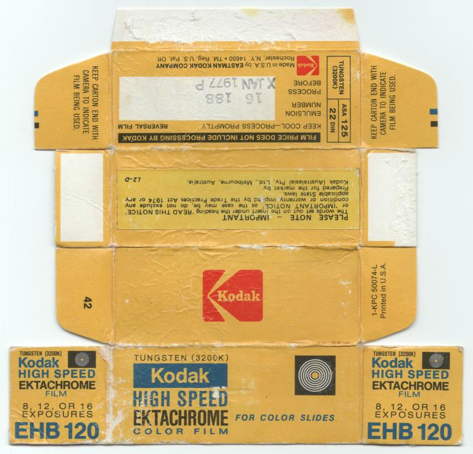
</a>


`UUID: 304a86e18bd841ee86c30538fe4e1940`↓

<a href="./archive/00303_001.jpg" target="_blank">
	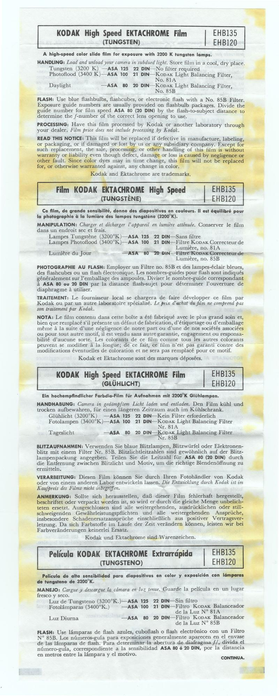
</a>


`UUID: 00e9096cb514470d8c00d2f66a652286`↓

<a href="./archive/00303_002.jpg" target="_blank">
	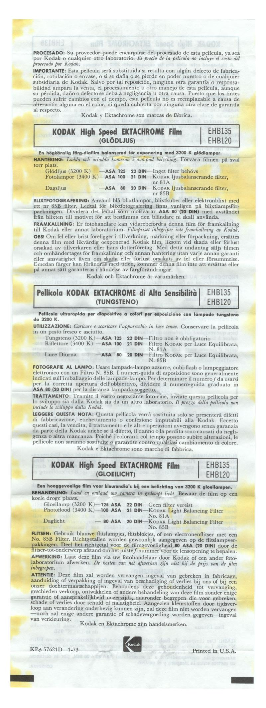
</a>

#### [1977] Kodak Panatomic-X (ref: 35f6)

```
Format: 35mm         |  Process : BW      
ISO   : 32           |  Expiry  : 1977013 
Type  : Single Pack  |  Quantity: 20exp   
Added : 2025-08-16   |  Author  : u/ReeeSchmidtyWerber
UUID  : 475b6bf4c66141b48fc73ace756435f6
```

<a href="./archive/00192_000.jpg" target="_blank">
	
</a>


`UUID: 662f12bfdc864efb861dd9ede2973332`↓

<a href="./archive/00192_001.jpg" target="_blank">
	
</a>


`UUID: 85fea329b0a34765987a30d8a728a8e0`↓

<a href="./archive/00192_002.jpg" target="_blank">
	
</a>

#### [1977] Kodak Ektachrome Professional (ref: 02a1)

```
Format: 120          |  Process : E-3     
ISO   : 50           |  Expiry  : 1977-12 
Type  : Single Pack  |  Quantity: N/A     
Added : 2025-09-03   |  Author  : dekuNukem
UUID  : aa971cf96ee94671899aff23564902a1
```

<a href="./archive/00295_000.jpg" target="_blank">
	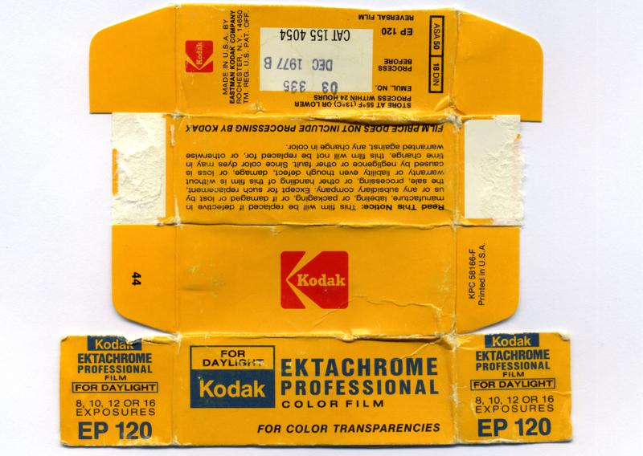
</a>


`UUID: 39df14e1dcee4f79bf2cb7ddb03265a8`↓

<a href="./archive/00295_001.jpg" target="_blank">
	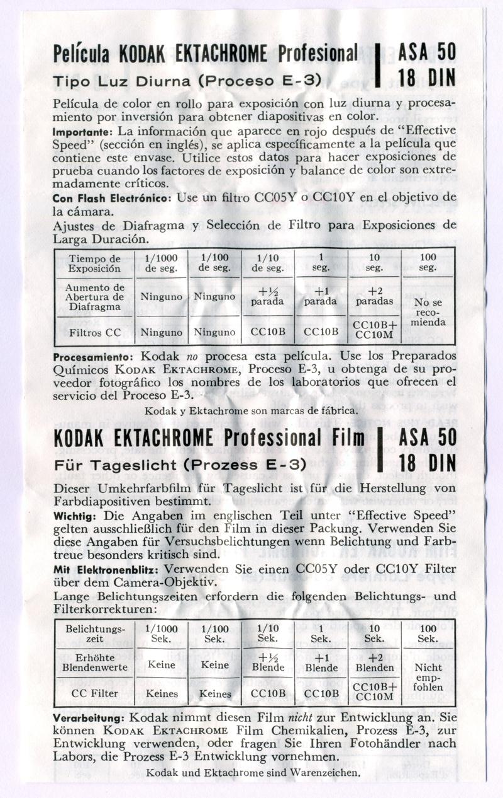
</a>


`UUID: fc04a897f24546cc9a6751b83c8e93ff`↓

<a href="./archive/00295_002.jpg" target="_blank">
	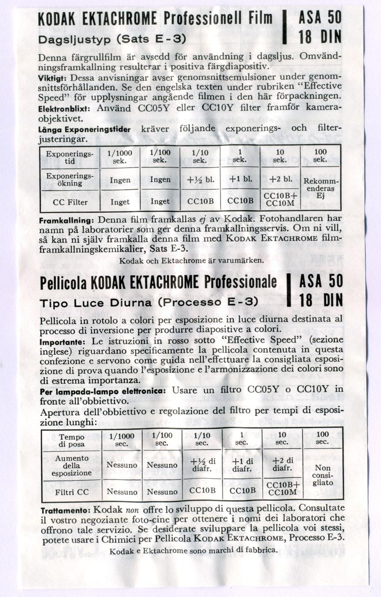
</a>


`UUID: 3dd8f1463a874d57bc90793c0245a9f4`↓

<a href="./archive/00295_003.jpg" target="_blank">
	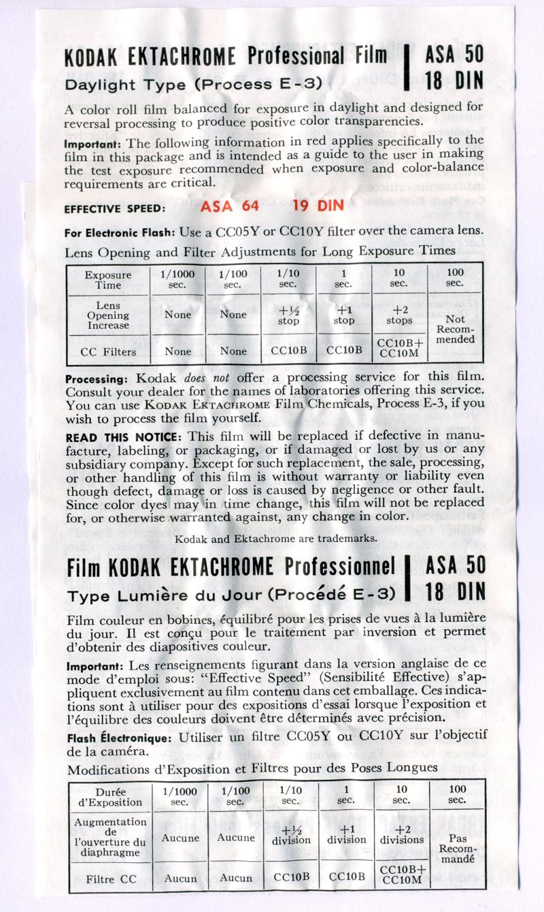
</a>


`UUID: 2d2b3b0808304c8fa9c8810ea8dcc6e4`↓

<a href="./archive/00295_004.jpg" target="_blank">
	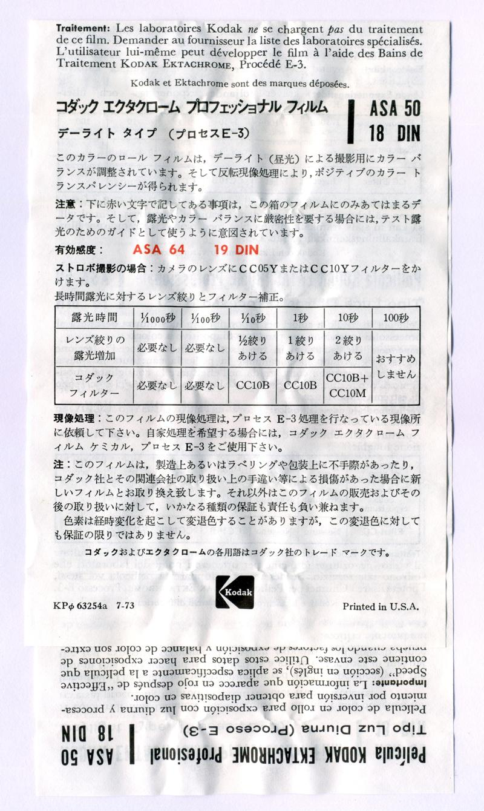
</a>

#### [1978] Kodak Kodachrome 25 (ref: 6477)

```
Format: 35mm         |  Process : K-14    
ISO   : 25           |  Expiry  : 1978-01 
Type  : Single Pack  |  Quantity: 20exp   
Added : 2025-01-05   |  Author  : dekuNukem
UUID  : 483191da2aa742bba3343cbe9f296477
```

<a href="./archive/00035_000.jpg" target="_blank">
	
</a>


`UUID: 71a9b098894d4f00a8006ba4b37783b8`↓

<a href="./archive/00035_001.jpg" target="_blank">
	
</a>


`UUID: 547384566f7d4aff89c18059a11e7f0b`↓

<a href="./archive/00035_002.jpg" target="_blank">
	
</a>


`UUID: a64a927ad3a348ae9eeb445a9725acfa`↓

<a href="./archive/00035_003.jpg" target="_blank">
	
</a>


`UUID: 754d321490a3453981be592ac6221b8d`↓

<a href="./archive/00035_004.jpg" target="_blank">
	
</a>

#### [1978] Sakura Sakuracolor II (ref: 4f7d)

```
Format: 35mm         |  Process : C-41    
ISO   : 100          |  Expiry  : 1978-02 
Type  : Single Pack  |  Quantity: 36exp   
Added : 2025-07-31   |  Author  : The Compartmentalist
UUID  : 0143ad8539d84710845f4d2dc82e4f7d
```

<a href="./archive/00122_000.jpg" target="_blank">
	
</a>

#### [1978] Kodak Kodacolor II (ref: 4108)

```
Format: 120          |  Process : C-22    
ISO   : 80           |  Expiry  : 1978-03 
Type  : Single Pack  |  Quantity: N/A     
Added : 2025-09-13   |  Author  : dekuNukem
UUID  : 3bfb81116e54468fb296098a03ad4108
```

<a href="./archive/00325_000.jpg" target="_blank">
	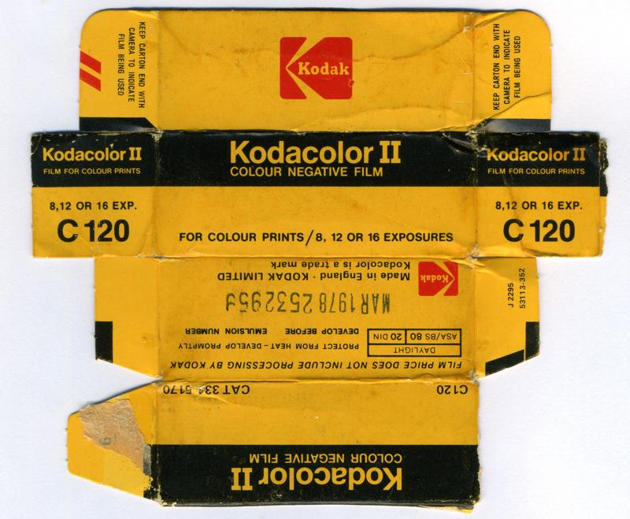
</a>


`UUID: cdd3df87cea649c7b8015b295520bd54`↓

<a href="./archive/00325_001.jpg" target="_blank">
	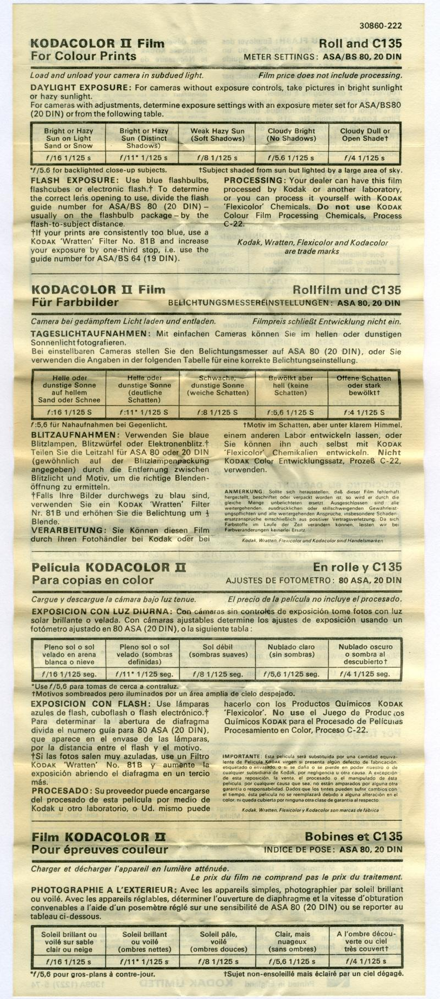
</a>


`UUID: 5bb72bffd3224a279eb4b01c201a80f2`↓

<a href="./archive/00325_002.jpg" target="_blank">
	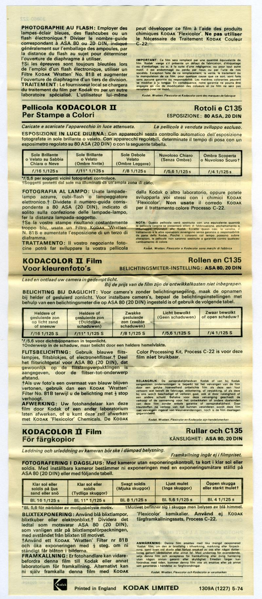
</a>

#### [1978] Kodak Ektachrome 200 (ref: f372)

```
Format: 126          |  Process : E-6     
ISO   : 200          |  Expiry  : 1978-11 
Type  : Single Pack  |  Quantity: 20exp   
Added : 2025-08-28   |  Author  : The Compartmentalist
UUID  : fef4be09ea484eecb10a13282d18f372
```

<a href="./archive/00261_000.jpg" target="_blank">
	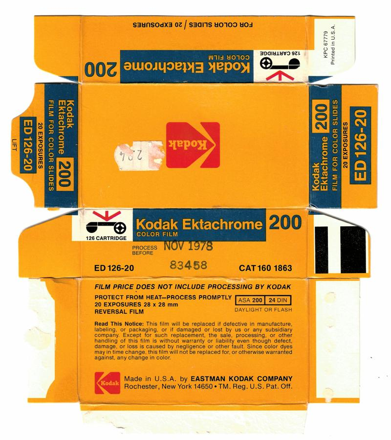
</a>


`UUID: 201fc821d3354cd7a82b0e1554ac06e4`↓

<a href="./archive/00261_001.jpg" target="_blank">
	
</a>


`UUID: 8a9d6009b1724610bbea230b5b2bdc73`↓

<a href="./archive/00261_002.jpg" target="_blank">
	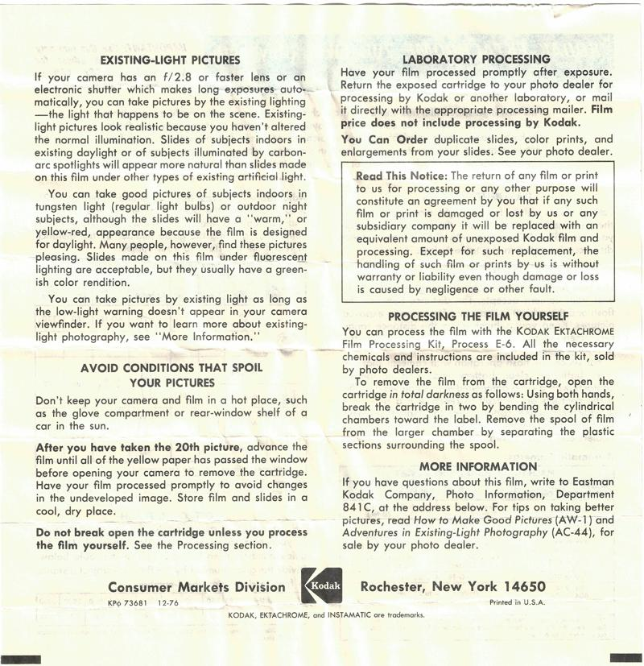
</a>

#### [1979] GAF Color Slide Film (ref: 6815)

```
Format: 35mm         |  Process : Unknown 
ISO   : 500          |  Expiry  : 1979-01 
Type  : Single Pack  |  Quantity: 20exp   
Added : 2025-10-17   |  Author  : @recycling.film
UUID  : b57e8c465ff94e02afa31d267b846815
```

<a href="./archive/00407_000.jpg" target="_blank">
	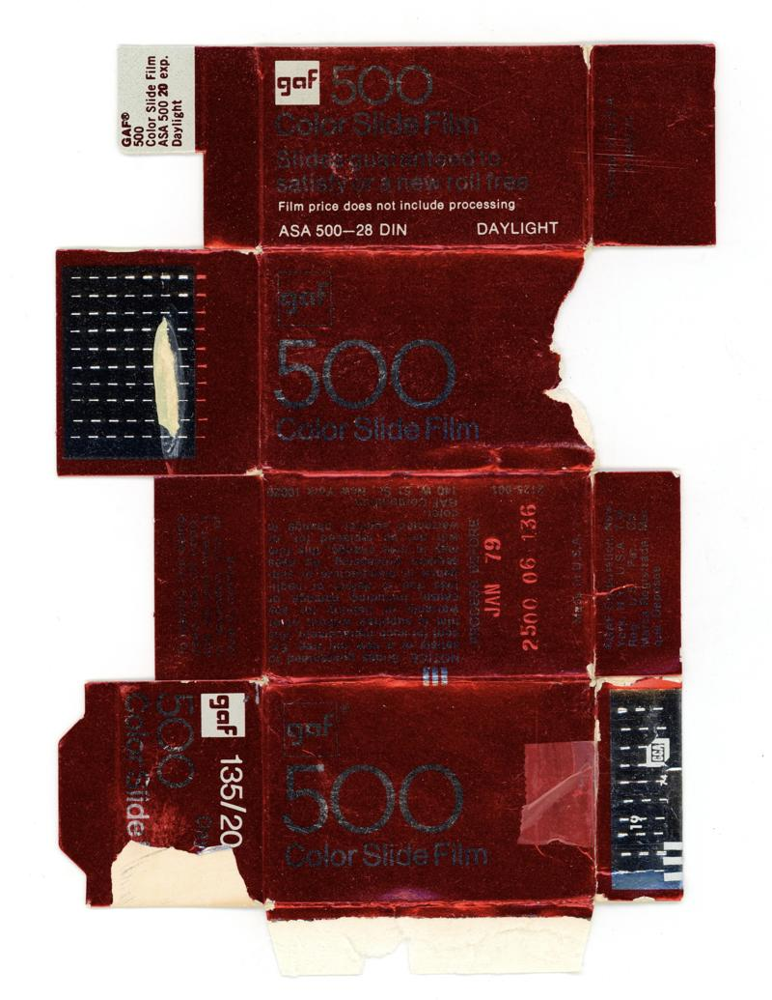
</a>

#### [1979] Kodak Kodacolor II (ref: b19e)

```
Format: 620          |  Process : C-41    
ISO   : 100          |  Expiry  : 1979-08 
Type  : Single Pack  |  Quantity: Unknown 
Added : 2025-10-21   |  Author  : dekuNukem
UUID  : 251b2a7fd42343e6b655b100794bb19e
```

<a href="./archive/00446_000.jpg" target="_blank">
	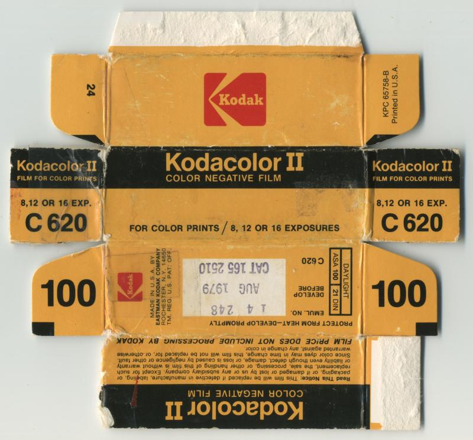
</a>


`UUID: 51b3490951d941be9922c1bf261a5551`↓

<a href="./archive/00446_001.jpg" target="_blank">
	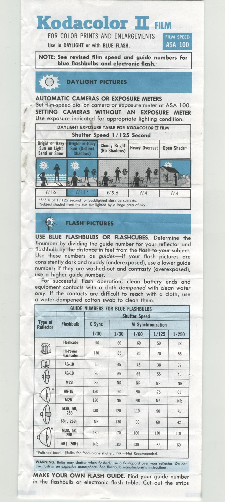
</a>


`UUID: 51a30e2c83294d4b858bef55f6a66d21`↓

<a href="./archive/00446_002.jpg" target="_blank">
	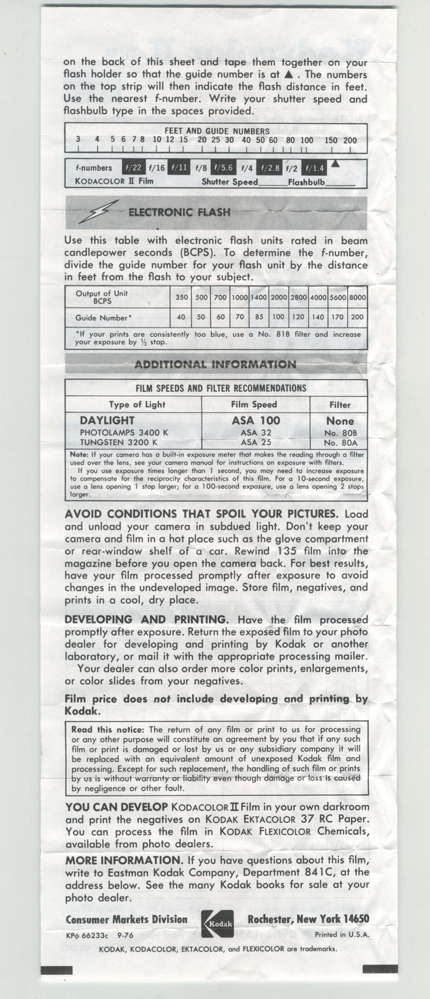
</a>

#### [1979] Kodak Ektachrome 64 (ref: 07c0)

```
Format: 110          |  Process : Unknown 
ISO   : 64           |  Expiry  : 1979-10 
Type  : Single Pack  |  Quantity: 20exp   
Added : 2025-01-04   |  Author  : dekuNukem
UUID  : 8131d8c6fbf14016be9c17a2586b07c0
```

<a href="./archive/00025_000.jpg" target="_blank">
	
</a>

#### [1979] Kodak Kodachrome 64 (ref: 3145)

```
Format: 110          |  Process : K-14    
ISO   : 64           |  Expiry  : 1979-10 
Type  : Single Pack  |  Quantity: 20exp   
Added : 2025-01-04   |  Author  : dekuNukem
UUID  : 68c945b76fc14ab699b944a3c7b93145
```

<a href="./archive/00026_000.jpg" target="_blank">
	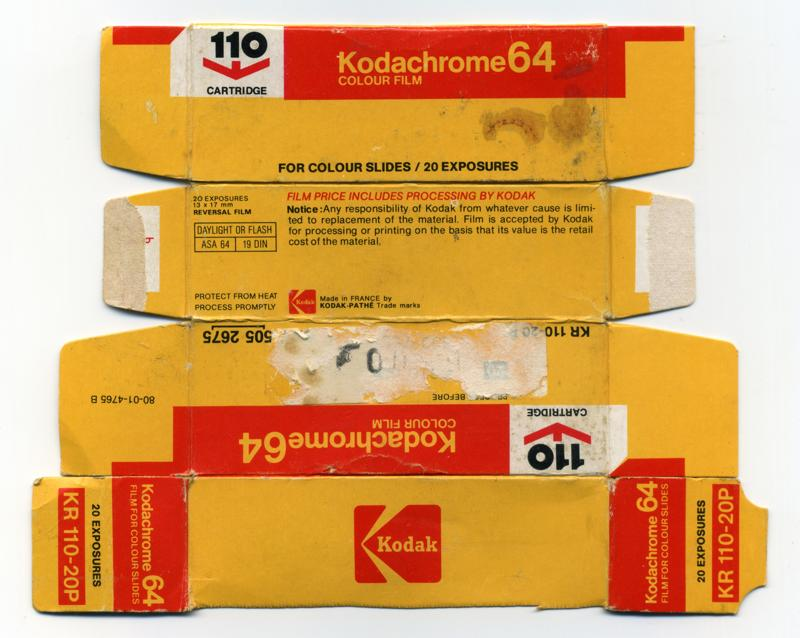
</a>


`UUID: 54ea8372830b463391dec9cc43789bdf`↓

<a href="./archive/00026_001.jpg" target="_blank">
	
</a>


`UUID: 045746d5a421440487c431bf74ad0091`↓

<a href="./archive/00026_002.jpg" target="_blank">
	
</a>

#### [1979] Kodak Tri-X Pan (ref: 85e9)

```
Format: 35mm         |  Process : BW      
ISO   : 400          |  Expiry  : 1979-12 
Type  : Single Pack  |  Quantity: 20exp   
Added : 2025-10-17   |  Author  : @recycling.film
UUID  : 09363ad5ddf84f67bb44ac27d17c85e9
```

<a href="./archive/00410_000.jpg" target="_blank">
	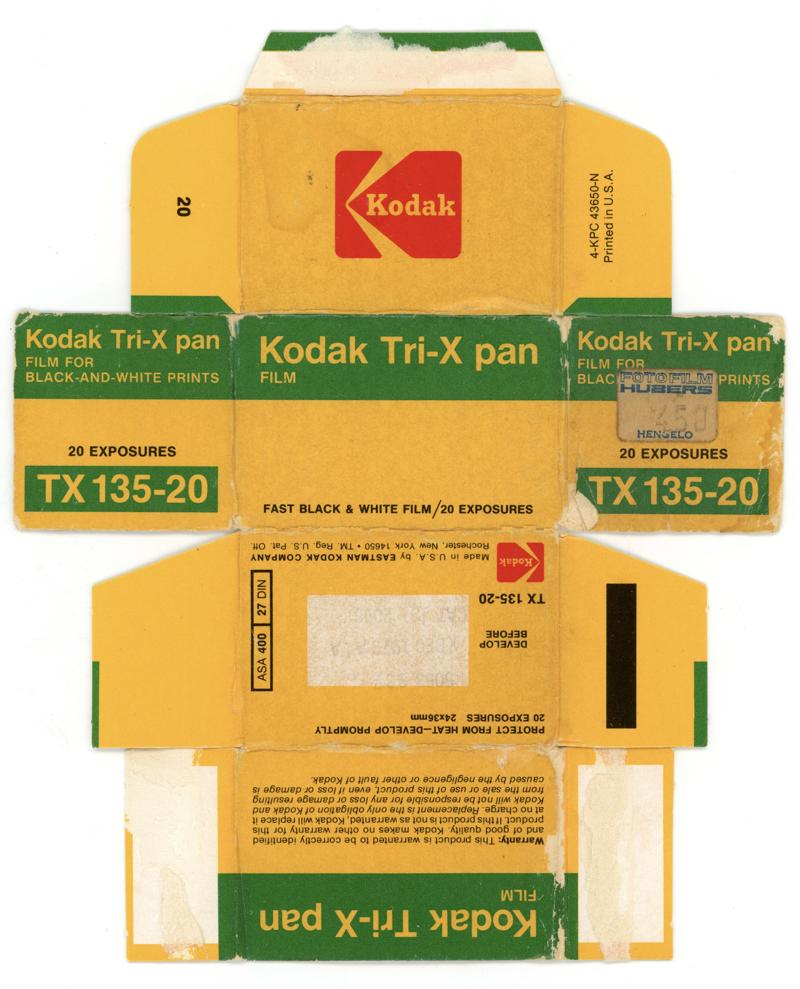
</a>

#### [1980] Agfa Isopan ISS Rapid (ref: 3aee)

```
Format: 35mm         |  Process : BW      
ISO   : 100          |  Expiry  : 1980-07 
Type  : Single Pack  |  Quantity: Unknown 
Added : 2025-10-21   |  Author  : dekuNukem
UUID  : d90937332f0a4392adb1f344b5ba3aee
```

<a href="./archive/00448_000.jpg" target="_blank">
	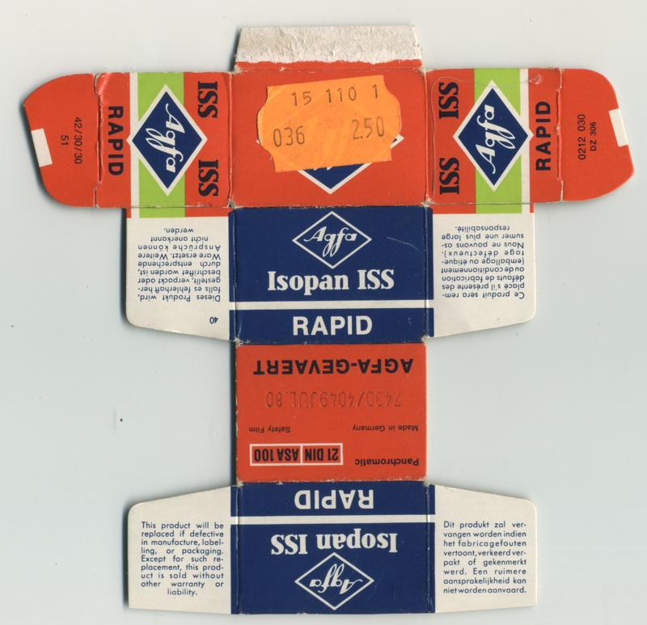
</a>

#### [1980] Polaroid Polavision Phototape Land Cassette Type 608 (ref: 90b9)

```
Format: Polavision   |  Process : Instant 
ISO   : 40           |  Expiry  : 1980-08 
Type  : Single Pack  |  Quantity: 38.5ft  
Added : 2025-09-18   |  Author  : dekuNukem
UUID  : 010a03a196a543beb83906a352d490b9
```

<a href="./archive/00346_000.jpg" target="_blank">
	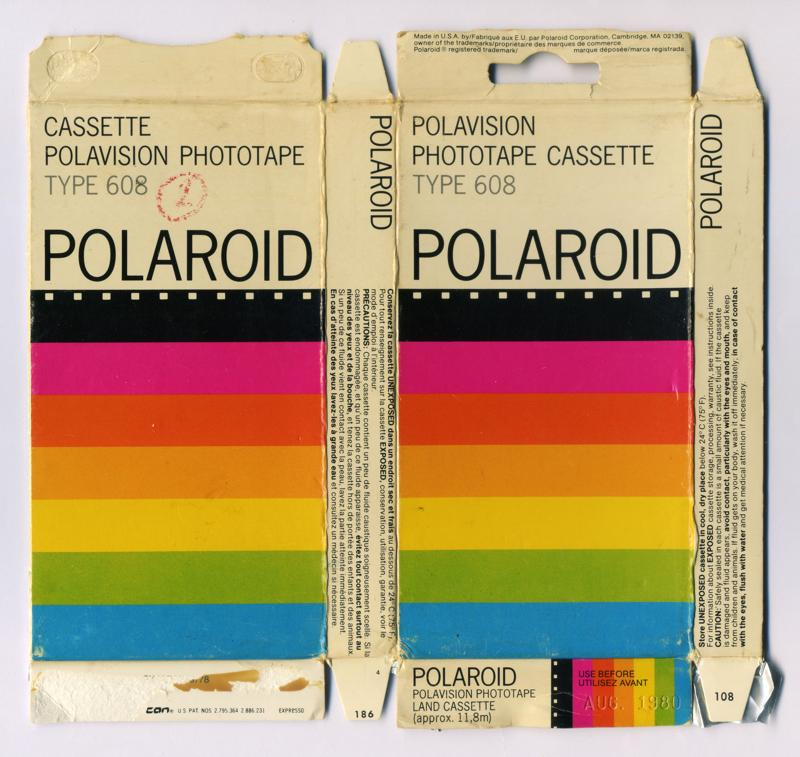
</a>

#### [1980] Kodak Ektachrome 400 (ref: 2b94)

```
Format: 120          |  Process : E-6     
ISO   : 400          |  Expiry  : 1980-10 
Type  : Single Pack  |  Quantity: N/A     
Added : 2025-09-03   |  Author  : dekuNukem
UUID  : 7c96865a4b554505b46710b016fd2b94
```

<a href="./archive/00294_000.jpg" target="_blank">
	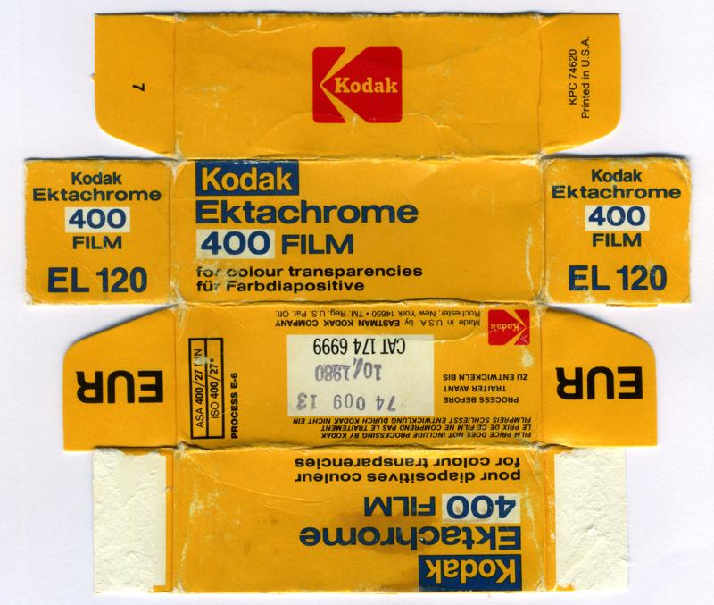
</a>


`UUID: 53dbbb4bb5fe48e88ed62f5f595f7bab`↓

<a href="./archive/00294_001.jpg" target="_blank">
	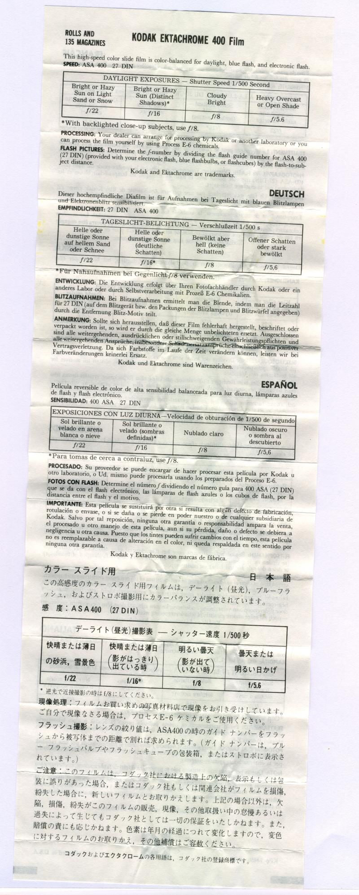
</a>


`UUID: 8d4656fd04a842ddafb29997f55ccb69`↓

<a href="./archive/00294_002.jpg" target="_blank">
	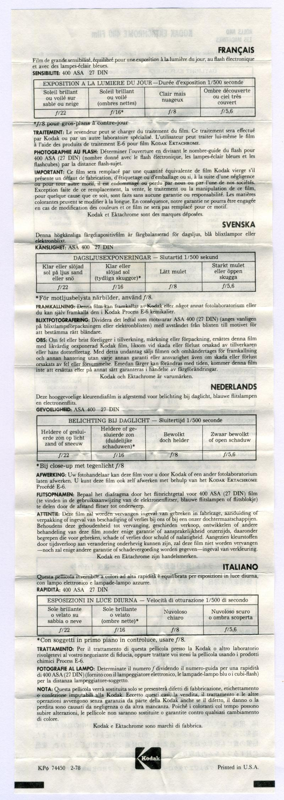
</a>

#### [1980] Kodak Ektachrome 160 Movie Film Type A (ref: 8f62)

```
Format: Super 8      |  Process : Unknown 
ISO   : 160          |  Expiry  : 1980-11 
Type  : Single Pack  |  Quantity: 50ft    
Added : 2025-07-31   |  Author  : fine-seat
UUID  : 6032680a3aba41b39c600d7e23998f62
```

<a href="./archive/00154_000.jpg" target="_blank">
	
</a>


`UUID: 28c6f19bd37e4199a072687d11b19961`↓

<a href="./archive/00154_001.jpg" target="_blank">
	
</a>


`UUID: 5d06a8833e0e44e8ab8d53bc0ce11095`↓

<a href="./archive/00154_002.jpg" target="_blank">
	
</a>


`UUID: 870ff01807e949a7b361cdad01dddf7f`↓

<a href="./archive/00154_003.jpg" target="_blank">
	
</a>


`UUID: 31df442b386446679540b0cf52c92fd7`↓

<a href="./archive/00154_004.jpg" target="_blank">
	
</a>

#### [1981] Kodak Kodacolor 400 (ref: 9e4c)

```
Format: 110          |  Process : C-41    
ISO   : 400          |  Expiry  : 1981-04 
Type  : Single Pack  |  Quantity: 20exp   
Added : 2025-09-13   |  Author  : @filmfotofella
UUID  : 3ef3252141a64ffe9d7e3fad745b9e4c
```

<a href="./archive/00331_000.jpg" target="_blank">
	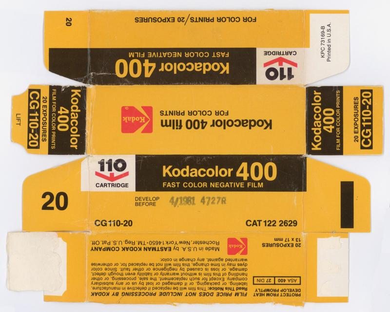
</a>


`UUID: 2227688b4c8b4ef796fb75f487359f71`↓

<a href="./archive/00331_001.jpg" target="_blank">
	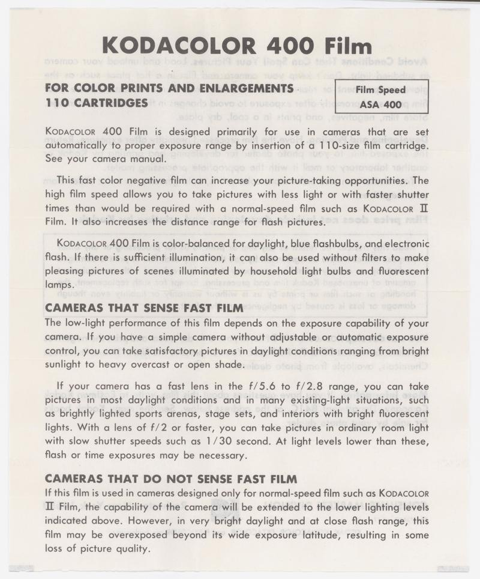
</a>


`UUID: a87701598e4540da8804dd29aa0922f7`↓

<a href="./archive/00331_002.jpg" target="_blank">
	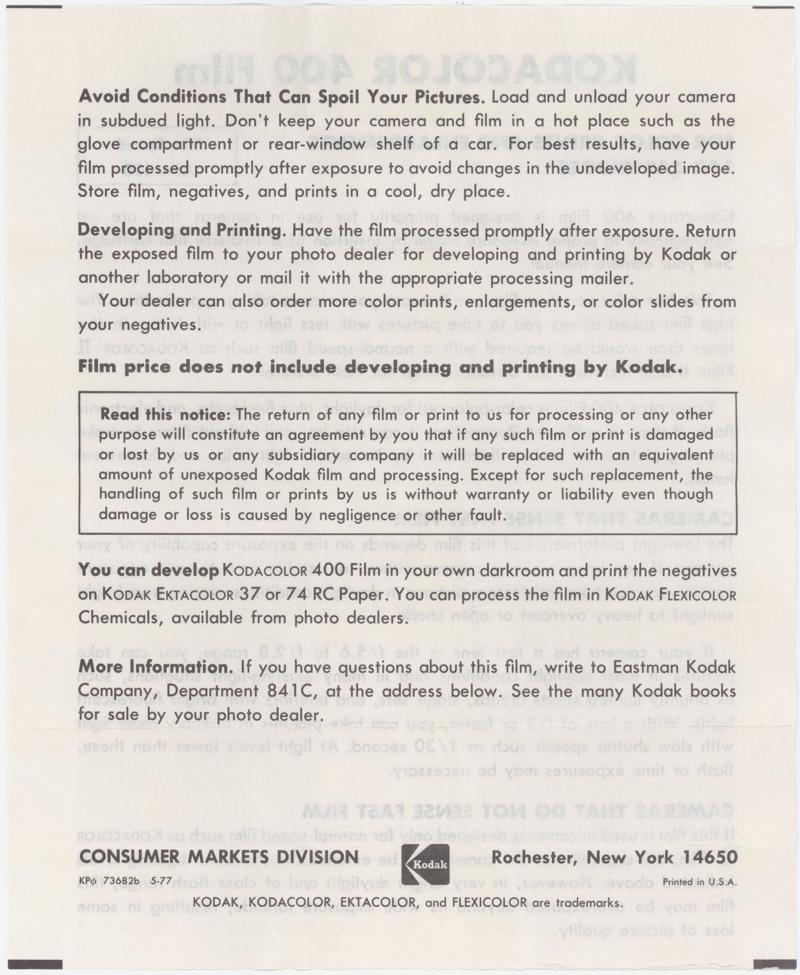
</a>

#### [1981] Agfa AgfaChrome 50 S (ref: 71a8)

```
Format: 35mm         |  Process : AP41    
ISO   : 50           |  Expiry  : 1981-07 
Type  : Single Pack  |  Quantity: 36exp   
Added : 2025-10-17   |  Author  : @recycling.film
UUID  : 364274d1357d458eacedde84db8a71a8
```

<a href="./archive/00417_000.jpg" target="_blank">
	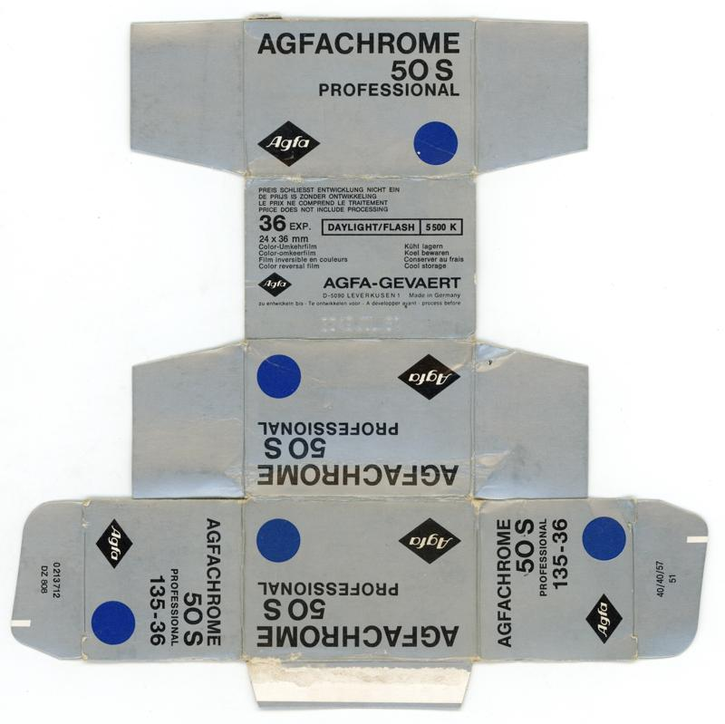
</a>


`UUID: ad0043191aad463eafef428fdd9383d5`↓

<a href="./archive/00417_001.jpg" target="_blank">
	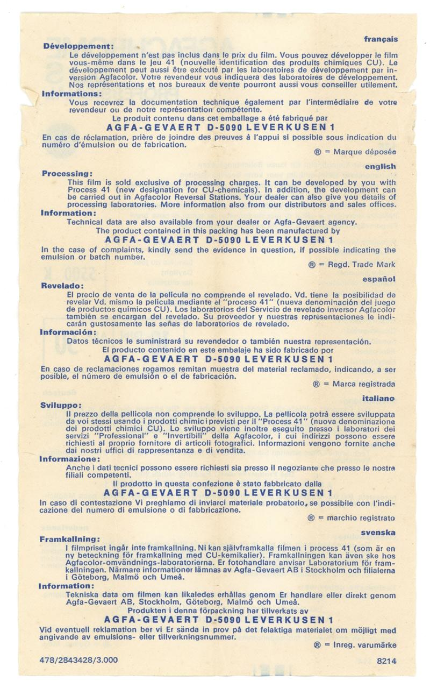
</a>


`UUID: 92c015c82f4345438875b286887a584d`↓

<a href="./archive/00417_002.jpg" target="_blank">
	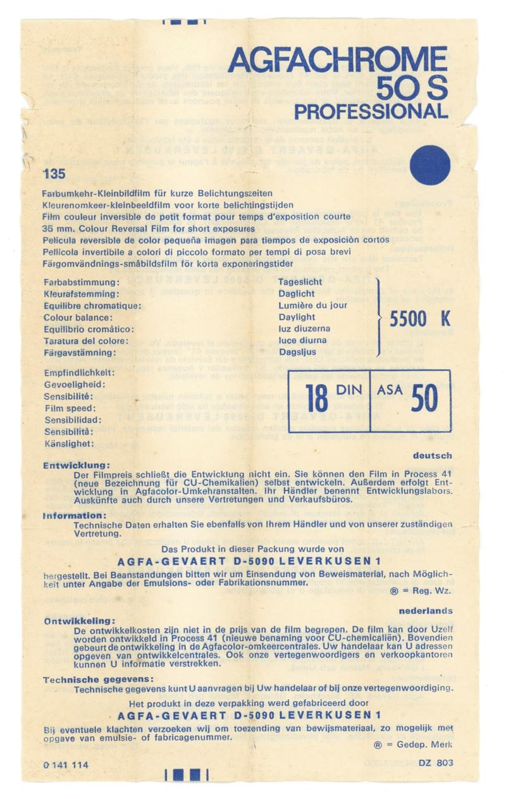
</a>

#### [1981] Minox Minocolor 2 (ref: fadd)

```
Format: 8x11mm       |  Process : C-41    
ISO   : 80           |  Expiry  : 1981-09 
Type  : Single Pack  |  Quantity: 15exp   
Added : 2025-10-21   |  Author  : dekuNukem
UUID  : 5ee281ded82c46e5b628a58b9f10fadd
```

<a href="./archive/00438_000.jpg" target="_blank">
	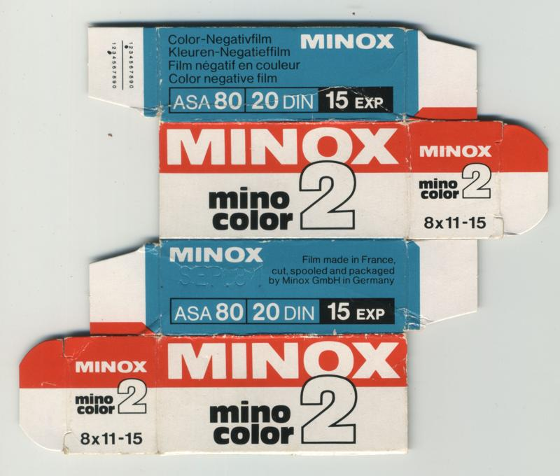
</a>


`UUID: 1590803fe8d045a480338838a869647e`↓

<a href="./archive/00438_001.jpg" target="_blank">
	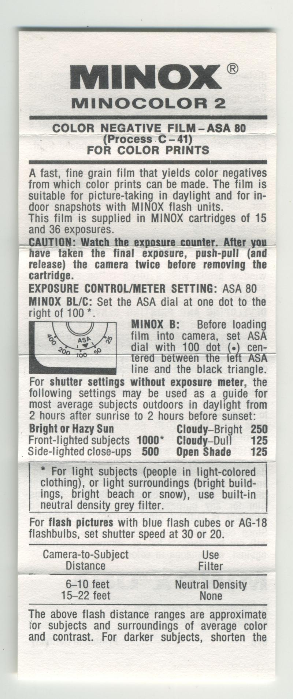
</a>


`UUID: dc750856812b447eaa0debe4122808ac`↓

<a href="./archive/00438_002.jpg" target="_blank">
	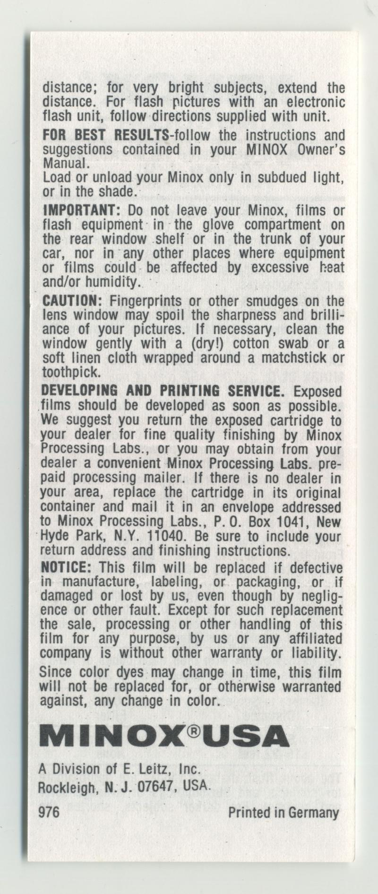
</a>

#### [1981] Kodak Kodachrome 40 Movie Film (Type A) for Post-process Sound Striping (ref: c143)

```
Format: Super 8      |  Process : K-14    
ISO   : 40           |  Expiry  : 1981-11 
Type  : Single Pack  |  Quantity: 15m     
Added : 2025-10-07   |  Author  : Pelicram
UUID  : 4f8758001bd74040b9e5a4bc6506c143
```

<a href="./archive/00381_000.jpg" target="_blank">
	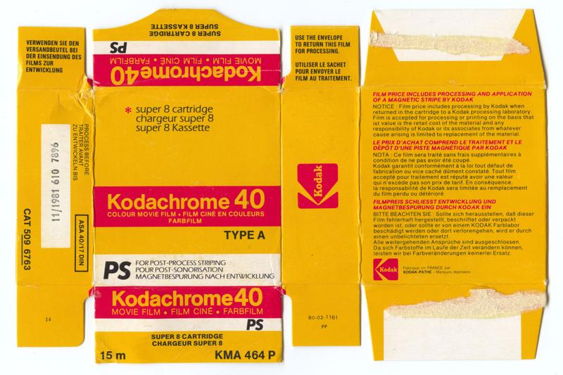
</a>


`UUID: 8364bd18c8c14b8b88fad55c8e0f6c48`↓

<a href="./archive/00381_001.jpg" target="_blank">
	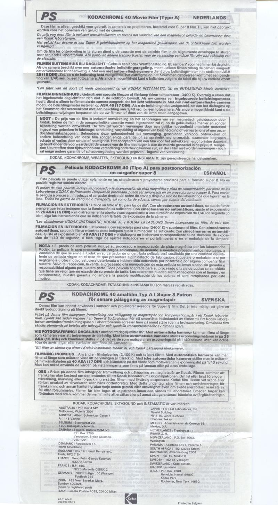
</a>


`UUID: afeea97aac0f462b845ed530d90edf14`↓

<a href="./archive/00381_002.jpg" target="_blank">
	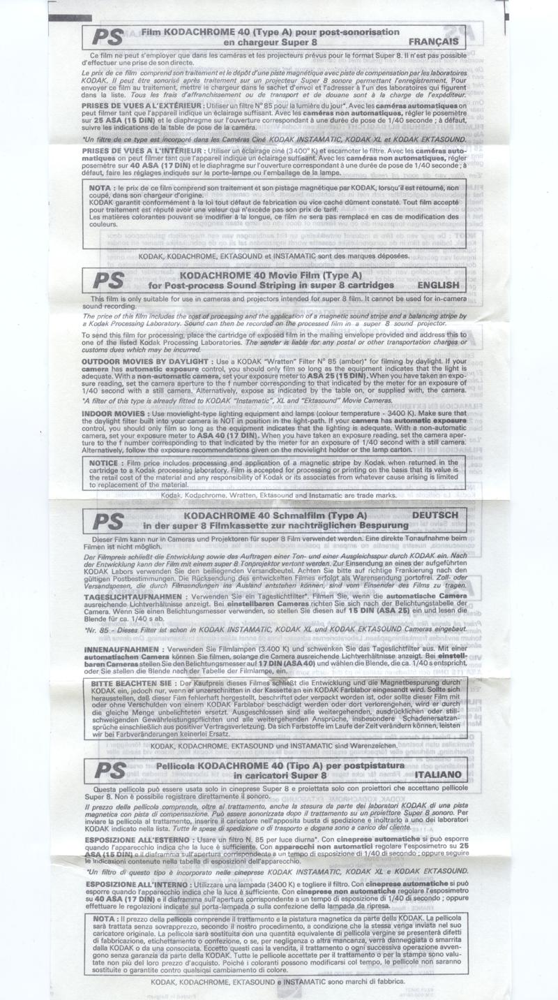
</a>


`UUID: d5614e94dc2b4dfb89e64a7f4e6f369a`↓

<a href="./archive/00381_003.jpg" target="_blank">
	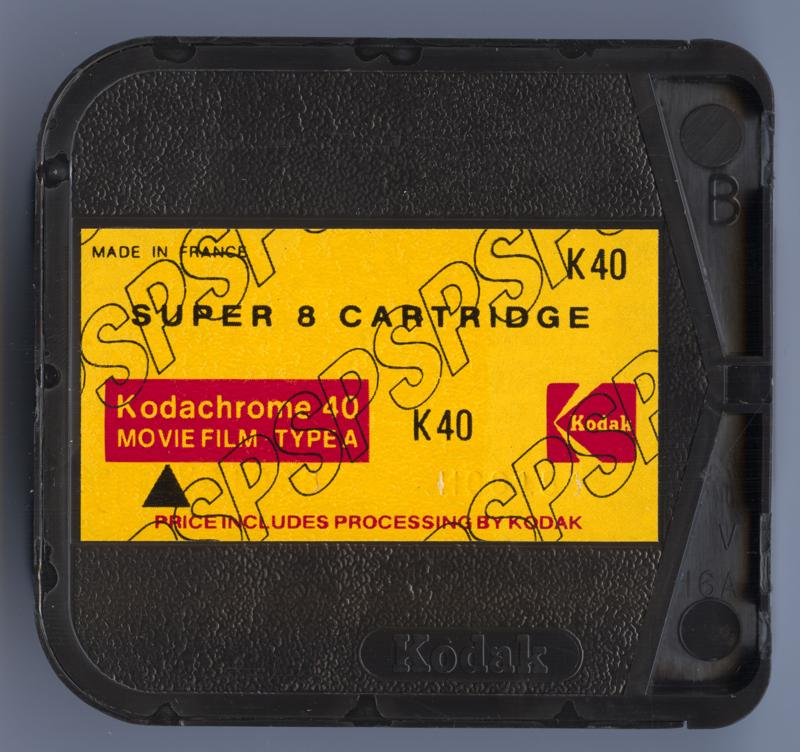
</a>


`UUID: cce11076e2304cd1881905d67a8eb7f5`↓

<a href="./archive/00381_004.jpg" target="_blank">
	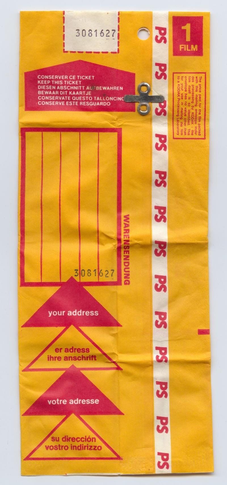
</a>


`UUID: 3d8c3f8d64e6401793eaea69cf7319da`↓

<a href="./archive/00381_005.jpg" target="_blank">
	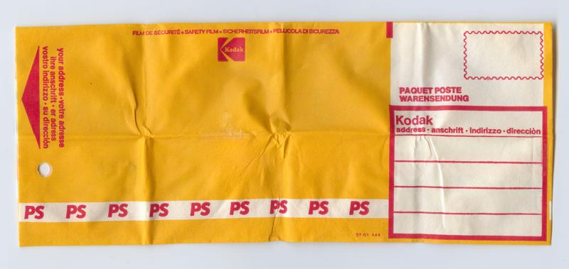
</a>

#### [1982] Herzog Duxopan (ref: a9ad)

```
Format: 35mm         |  Process : BW      
ISO   : 100          |  Expiry  : 1982-09 
Type  : Single Pack  |  Quantity: 12exp   
Added : 2025-09-28   |  Author  : fine-seat
UUID  : 7ac665727691429d9ea1ec73ebe9a9ad
```

<a href="./archive/00358_000.jpg" target="_blank">
	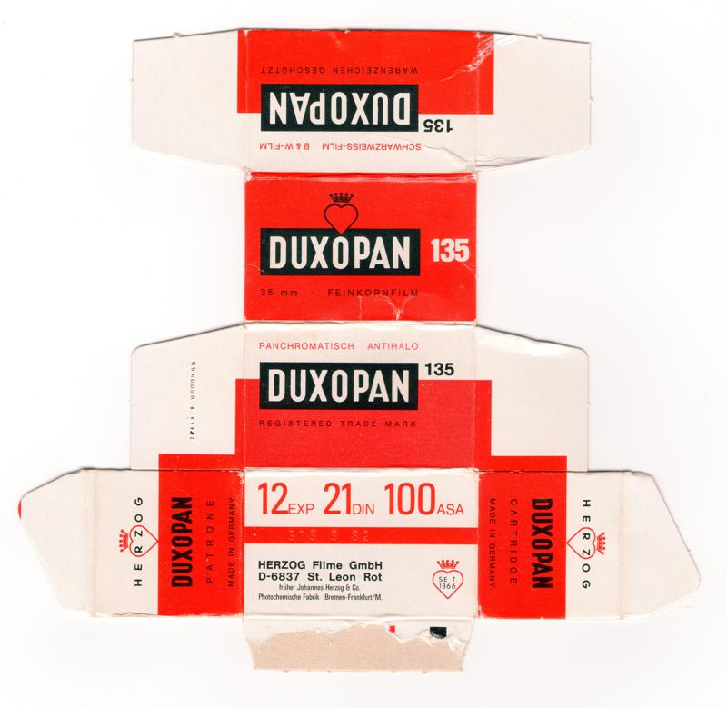
</a>

#### [1983] Ilford FP4 (ref: b2f0)

```
Format: 35mm         |  Process : BW      
ISO   : 125          |  Expiry  : 1983-02 
Type  : Single Pack  |  Quantity: 20exp   
Added : 2025-10-17   |  Author  : @recycling.film
UUID  : 68eb8a227e8b48358efc62cf7aabb2f0
```

<a href="./archive/00415_000.jpg" target="_blank">
	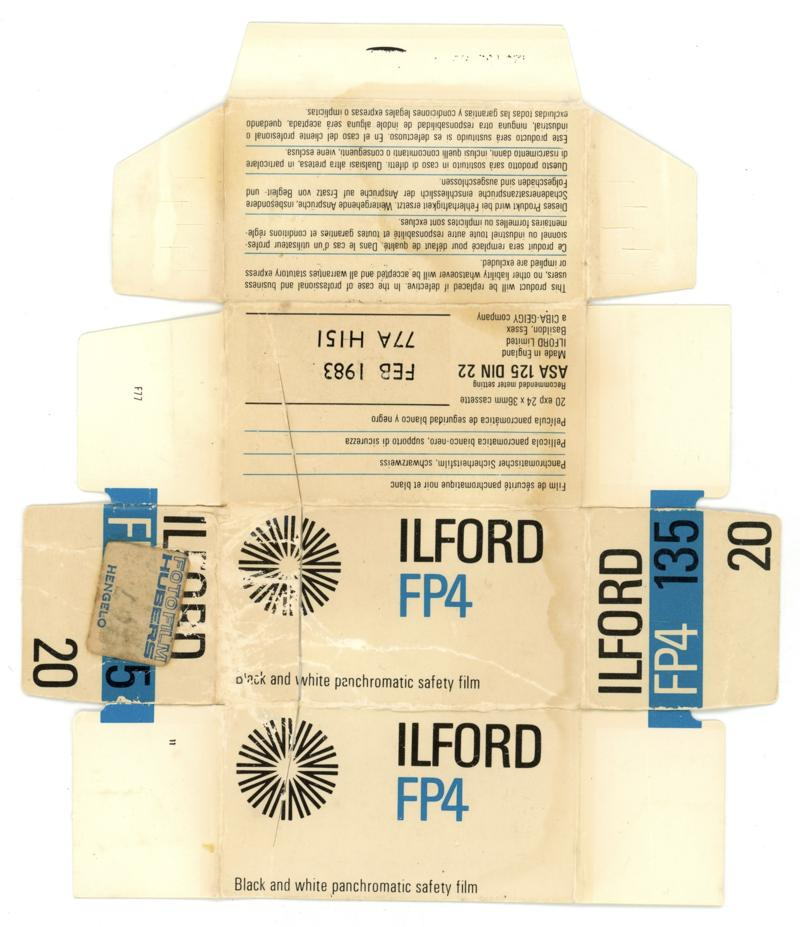
</a>

#### [1983] Kodak Kodachrome 25 (ref: 8833)

```
Format: 35mm         |  Process : K-14    
ISO   : 25           |  Expiry  : 1983-03 
Type  : Single Pack  |  Quantity: 36exp   
Added : 2025-07-31   |  Author  : The Compartmentalist
UUID  : 6239a04366d74208a9010cd231688833
```

<a href="./archive/00121_000.jpg" target="_blank">
	
</a>

#### [1983] Kodak Kodacolor II (ref: 7310)

```
Format: 126          |  Process : C-41    
ISO   : 100          |  Expiry  : 1983-10 
Type  : Single Pack  |  Quantity: 24exp   
Added : 2025-08-28   |  Author  : The Compartmentalist
UUID  : 08c1609b39a64daf8be1373ea99c7310
```

<a href="./archive/00263_000.jpg" target="_blank">
	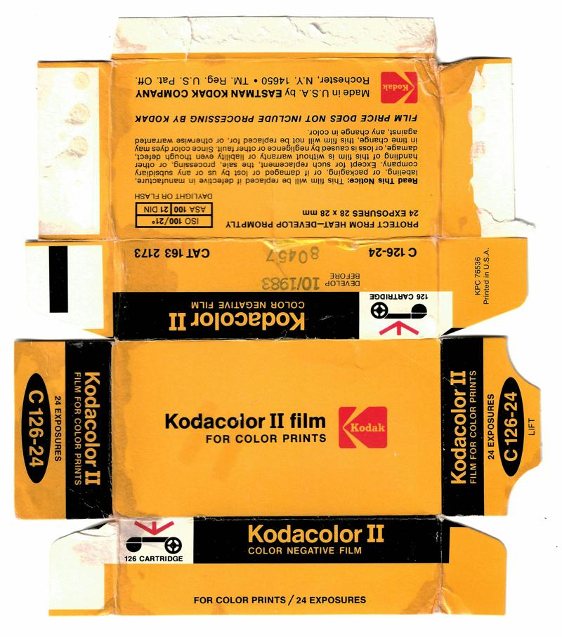
</a>

#### [1985] Konica Konica Color II (ref: fb5b)

```
Format: 35mm         |  Process : C-41    
ISO   : 100          |  Expiry  : 1985-01 
Type  : Bulk Roll    |  Quantity: 110ft   
Added : 2025-08-14   |  Author  : Camera.Riley
UUID  : 34d91c79c1704ac49f5376ca6424fb5b
```

<a href="./archive/00173_000.jpg" target="_blank">
	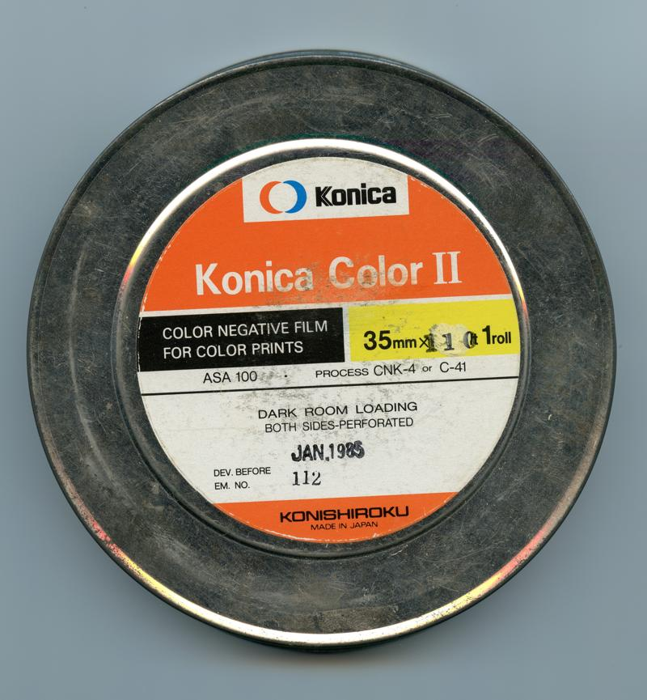
</a>

#### [1986] Fujifilm Fujicolor HR100 (ref: 23c5)

```
Format: 120          |  Process : C-41    
ISO   : 100          |  Expiry  : 1986-02 
Type  : Single Pack  |  Quantity: N/A     
Added : 2025-09-06   |  Author  : dekuNukem
UUID  : 934f2484197d41c7a5467b92a9ea23c5
```

<a href="./archive/00308_000.jpg" target="_blank">
	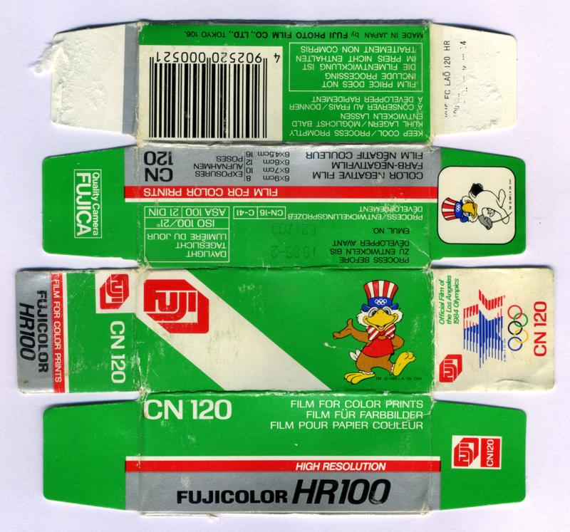
</a>


`UUID: 172bc614704c4391bd34e58f0b27b279`↓

<a href="./archive/00308_001.jpg" target="_blank">
	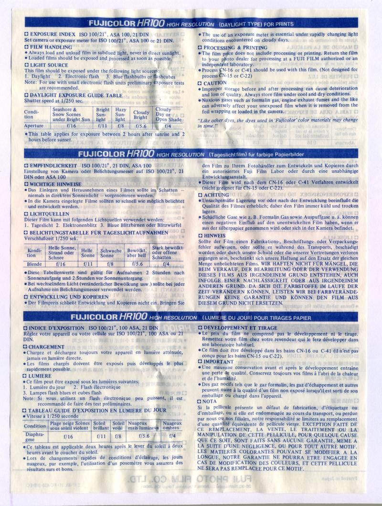
</a>


`UUID: 3e4277ca388248c5a4ea7d11988bf3a6`↓

<a href="./archive/00308_002.jpg" target="_blank">
	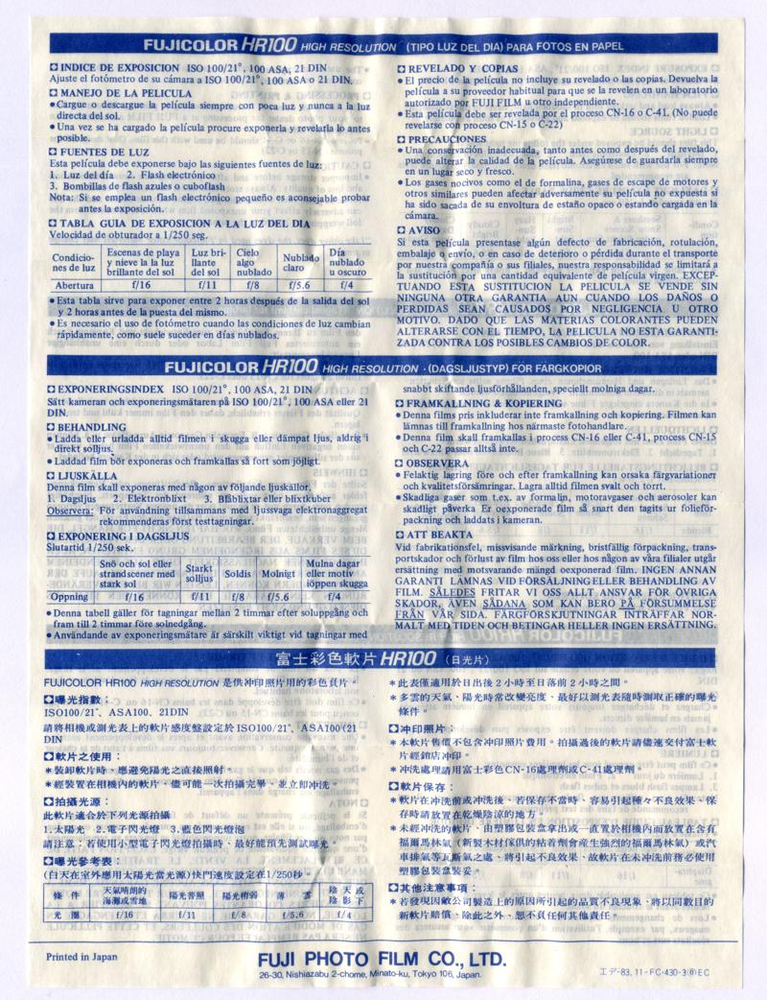
</a>

#### [1986] Kodak Ektachrome 64 (ref: 02cc)

```
Format: 35mm         |  Process : E-6     
ISO   : 64           |  Expiry  : 1986-07 
Type  : Single Pack  |  Quantity: 36exp   
Added : 2025-10-17   |  Author  : @recycling.film
UUID  : 61a248ee92404ad7bcf1a19adbf102cc
Notes : EPR
```

<a href="./archive/00414_000.jpg" target="_blank">
	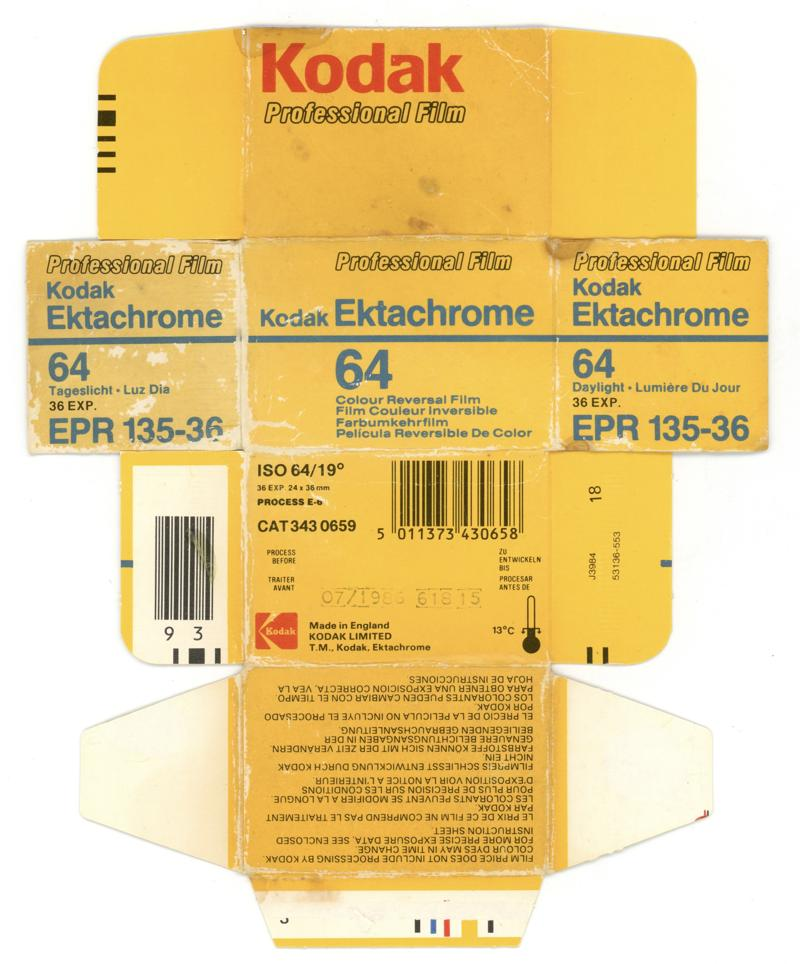
</a>


`UUID: 66aac838de9b4f4091acb02215e8b890`↓

<a href="./archive/00414_001.jpg" target="_blank">
	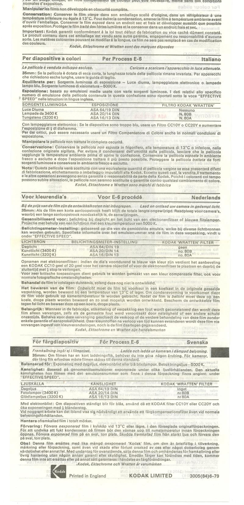
</a>


`UUID: ee61648a19bd4eaea584f3931618f488`↓

<a href="./archive/00414_002.jpg" target="_blank">
	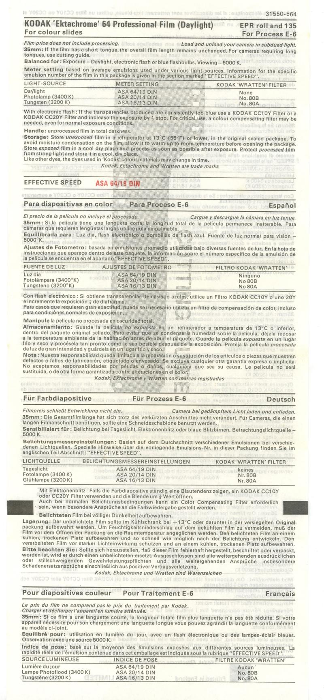
</a>

#### [1986] Kodak Tri-X Pan (ref: f201)

```
Format: 120          |  Process : BW      
ISO   : 400          |  Expiry  : 1986-12 
Type  : Single Pack  |  Quantity: N/A     
Added : 2025-09-17   |  Author  : @ellafridalindblom
UUID  : 496c4c1b618442bf933f48660acef201
```

<a href="./archive/00338_000.jpg" target="_blank">
	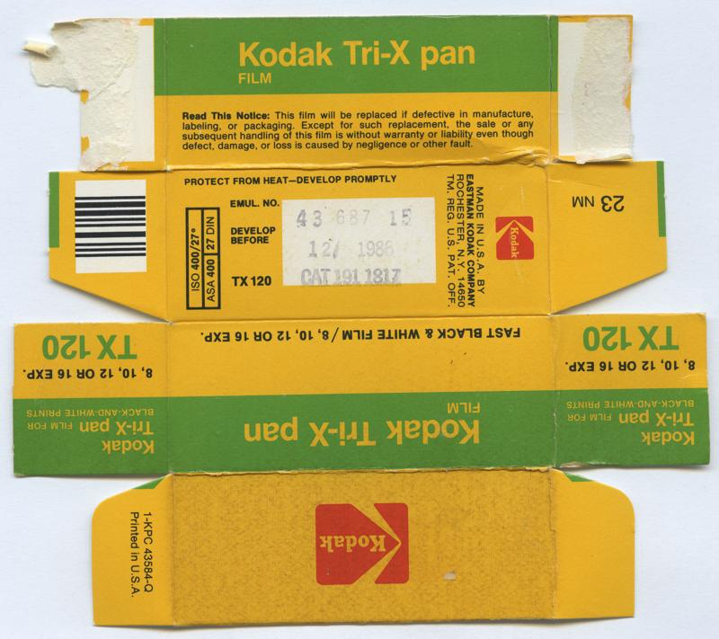
</a>


`UUID: 8dd3ba1b167542bb95a7661994e4246e`↓

<a href="./archive/00338_001.jpg" target="_blank">
	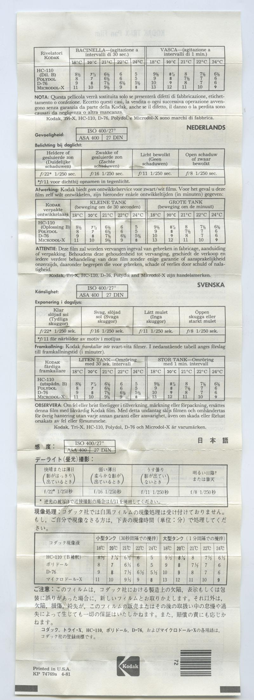
</a>


`UUID: 120f8d3620ca4d8d84af3c32c09c5bba`↓

<a href="./archive/00338_002.jpg" target="_blank">
	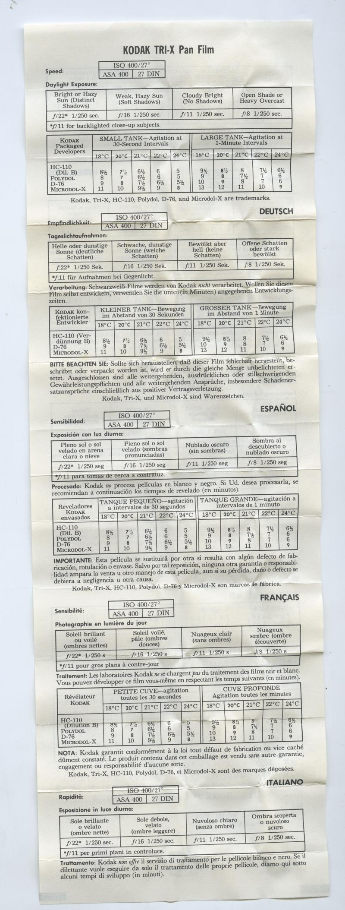
</a>

#### [1987] Kodak Kodacolor VR (ref: 035f)

```
Format: 35mm         |  Process : C-41    
ISO   : 200          |  Expiry  : 1987-06 
Type  : Single Pack  |  Quantity: 36exp   
Added : 2025-07-28   |  Author  : @ftfilmphotos
UUID  : a26daa2cb6e44957af3d978bc67e035f
```

<a href="./archive/00097_000.jpg" target="_blank">
	
</a>


`UUID: 185225c336bc491683c7a1806458c4e8`↓

<a href="./archive/00097_001.jpg" target="_blank">
	
</a>

#### [1987] Fujifilm Fujicolor HR 1600 (ref: 1d39)

```
Format: 35mm         |  Process : C-41    
ISO   : 1600         |  Expiry  : 1987-08 
Type  : Single Pack  |  Quantity: 12exp   
Added : 2025-09-18   |  Author  : dekuNukem
UUID  : bbcc3da99c5c4734a5a8a985b9b31d39
```

<a href="./archive/00350_000.jpg" target="_blank">
	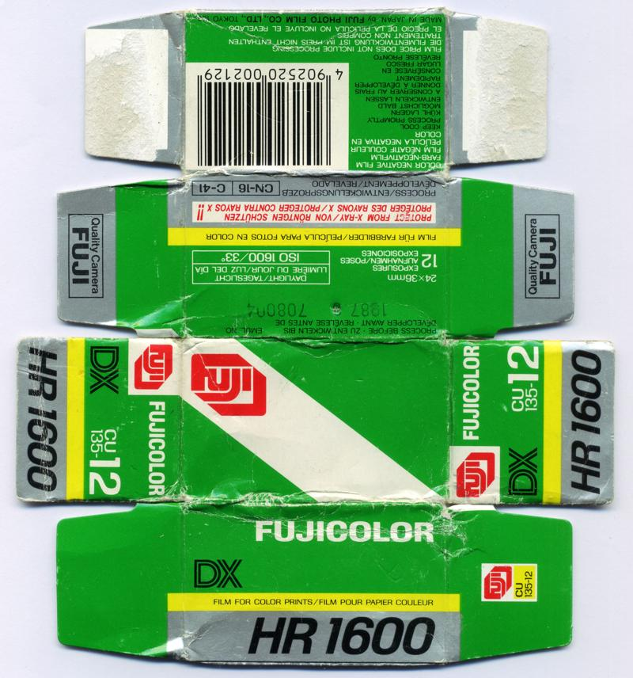
</a>


`UUID: 911c893c07554c488c396cebc100e6b5`↓

<a href="./archive/00350_001.jpg" target="_blank">
	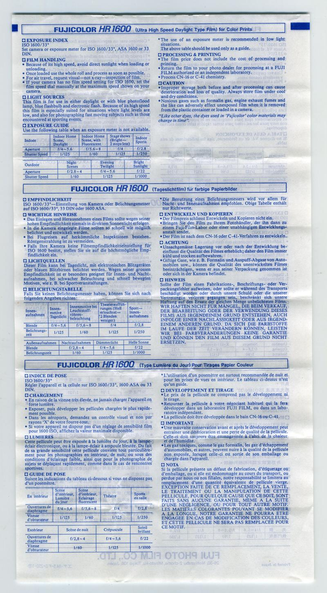
</a>


`UUID: f5abcdb901ff4bae82a7b52a8d8dda5c`↓

<a href="./archive/00350_002.jpg" target="_blank">
	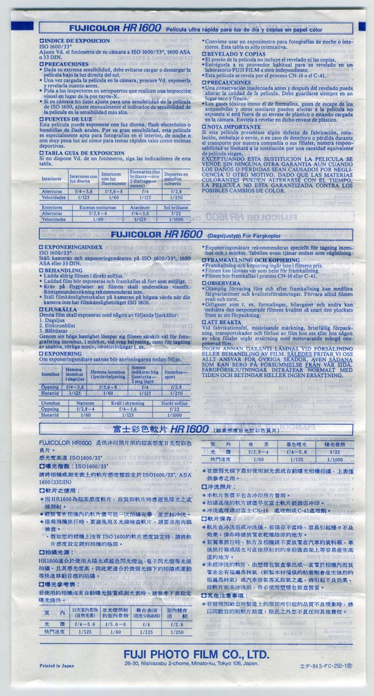
</a>

#### [1988] Polaroid PolaPan 35mm (ref: 9825)

```
Format: 35mm         |  Process : Instant 
ISO   : 125          |  Expiry  : 1988-04 
Type  : Single Pack  |  Quantity: 12exp   
Added : 2025-08-03   |  Author  : dekuNukem
UUID  : 24a8ae46c50049afb35fc44e956a9825
```

<a href="./archive/00159_000.jpg" target="_blank">
	
</a>


`UUID: a650b451e12b4e1fabb05b4f1f23fb29`↓

<a href="./archive/00159_001.jpg" target="_blank">
	
</a>


`UUID: 30abcb19f7ce46d39021fb057efb95f6`↓

<a href="./archive/00159_002.jpg" target="_blank">
	
</a>


`UUID: 61e5cb43037441ca9a06dd2a4883833c`↓

<a href="./archive/00159_003.jpg" target="_blank">
	
</a>


`UUID: d4369d4ac7bc432cb5bf9acdb0d835d7`↓

<a href="./archive/00159_004.jpg" target="_blank">
	
</a>

#### [1988] Kodak Technical Pan 6415 (ref: 03be)

```
Format: 120          |  Process : BW      
ISO   : 25           |  Expiry  : 1988-05 
Type  : Single Pack  |  Quantity: N/A     
Added : 2025-01-05   |  Author  : dekuNukem
UUID  : 3a03860d64d2400caee97955197703be
```

<a href="./archive/00037_000.jpg" target="_blank">
	
</a>


`UUID: 579e1eee184e49669d586cf512ec1bc8`↓

<a href="./archive/00037_001.jpg" target="_blank">
	
</a>


`UUID: 6bcd669b9d2e44c6929e55a446d1d075`↓

<a href="./archive/00037_002.jpg" target="_blank">
	
</a>

#### [1988] Fujifilm Neopan SS (ref: d848)

```
Format: 120          |  Process : BW      
ISO   : 100          |  Expiry  : 1988-07 
Type  : Single Pack  |  Quantity: N/A     
Added : 2025-09-17   |  Author  : @ellafridalindblom
UUID  : f211bfbc4ac9498bb83cfe5f3846d848
```

<a href="./archive/00343_000.jpg" target="_blank">
	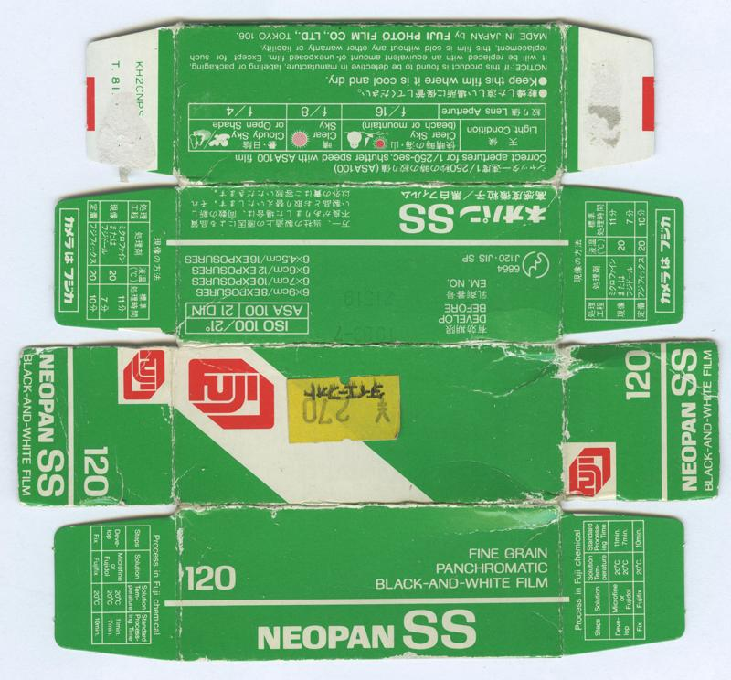
</a>

#### [1988] Kodak Kodacolor Gold 200 (ref: f368)

```
Format: 110          |  Process : C-41    
ISO   : 200          |  Expiry  : 1988-12 
Type  : Single Pack  |  Quantity: 24exp   
Added : 2025-05-24   |  Author  : dekuNukem
UUID  : 78bfeed667154d819902ec92d7dcf368
```

<a href="./archive/00068_000.jpg" target="_blank">
	
</a>

#### [1989] Minox MinoColor 3 (ref: d209)

```
Format: 8x11mm       |  Process : C-41    
ISO   : 100          |  Expiry  : 1989-10 
Type  : Single Pack  |  Quantity: 36exp   
Added : 2025-10-05   |  Author  : Pelicram
UUID  : a54b7c329f26403d91ffa69325a1d209
```

<a href="./archive/00370_000.jpg" target="_blank">
	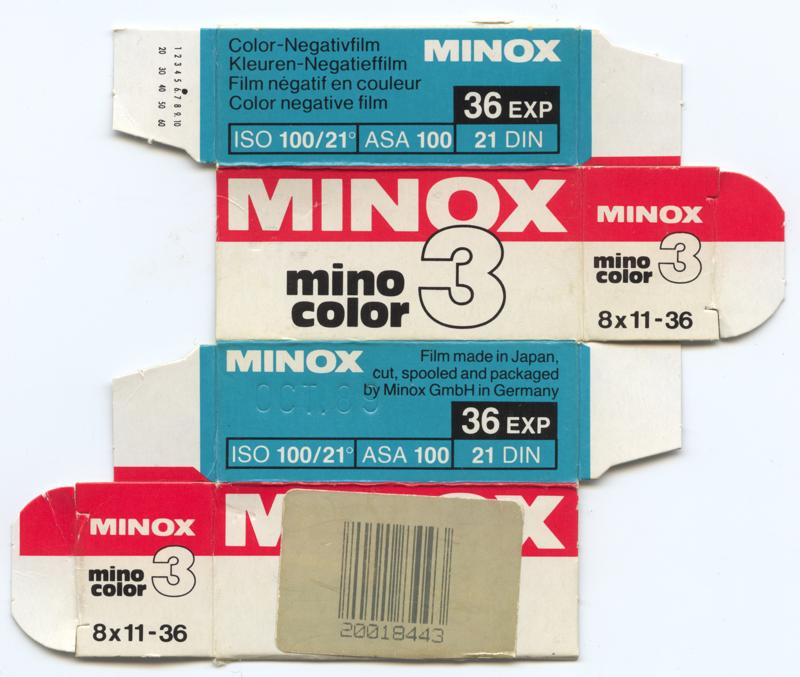
</a>

#### [1990] Fujifilm Fujicolor Super HR (ref: aaa0)

```
Format: 35mm         |  Process : C-41    
ISO   : 200          |  Expiry  : 1990-02 
Type  : Single Pack  |  Quantity: 36exp   
Added : 2025-01-04   |  Author  : dekuNukem
UUID  : 2d27c9a865aa4de19ad8dc0bcdc8aaa0
```

<a href="./archive/00007_000.jpg" target="_blank">
	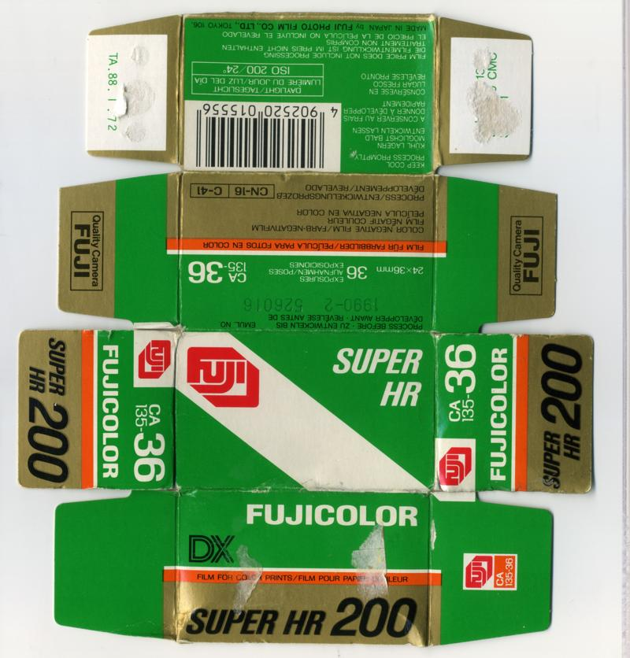
</a>


`UUID: a179b7257aaf455fa69df546545457f6`↓

<a href="./archive/00007_001.jpg" target="_blank">
	
</a>


`UUID: e5688fcb7e8943a987ca6b882275ca7b`↓

<a href="./archive/00007_002.jpg" target="_blank">
	
</a>

#### [1990] Kodak High Speed Infrared (ref: 4294)

```
Format: 35mm         |  Process : BW      
ISO   : 80           |  Expiry  : 1990-03 
Type  : Single Pack  |  Quantity: 36exp   
Added : 2025-07-29   |  Author  : Nano_Burger
UUID  : 7b611fc399af469a80ac1a0124c84294
```

<a href="./archive/00102_000.jpg" target="_blank">
	
</a>


`UUID: 5cdb927687974c8db4458239ed9a09b4`↓

<a href="./archive/00102_001.jpg" target="_blank">
	
</a>


`UUID: 1058c3167209457aac0f4336c911c8b3`↓

<a href="./archive/00102_002.jpg" target="_blank">
	
</a>

#### [1990] Kodak Kodacolor Gold 400 (ref: 473d)

```
Format: 110          |  Process : C-41    
ISO   : 400          |  Expiry  : 1990-09 
Type  : Single Pack  |  Quantity: 24exp   
Added : 2025-10-21   |  Author  : dekuNukem
UUID  : 9d06405332c04b80b8b6ec709131473d
```

<a href="./archive/00440_000.jpg" target="_blank">
	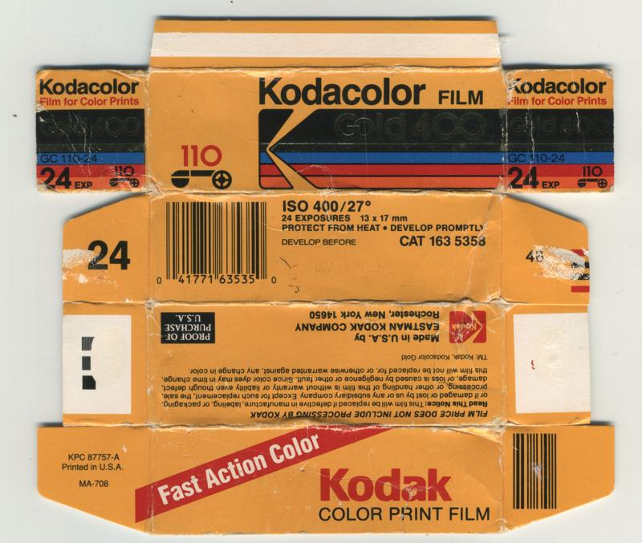
</a>

#### [1990] Kodak Ektachrome 400 (ref: 3c96)

```
Format: 35mm         |  Process : E-6     
ISO   : 400          |  Expiry  : 1990-11 
Type  : Single Pack  |  Quantity: 24exp   
Added : 2025-07-29   |  Author  : Nano_Burger
UUID  : 2330da9237ad4dbaac0028199f363c96
```

<a href="./archive/00100_000.jpg" target="_blank">
	
</a>


`UUID: c8ecef6f805d4a7eab60f82855687e17`↓

<a href="./archive/00100_001.jpg" target="_blank">
	
</a>

#### [1991] Foma Fomapan F17 (ref: a10e)

```
Format: 120          |  Process : BW      
ISO   : 40           |  Expiry  : 1991-01 
Type  : Single Pack  |  Quantity: N/A     
Added : 2025-10-17   |  Author  : @recycling.film
UUID  : 0315635e32bb4848aaa2fe65ac7aa10e
```

<a href="./archive/00413_000.jpg" target="_blank">
	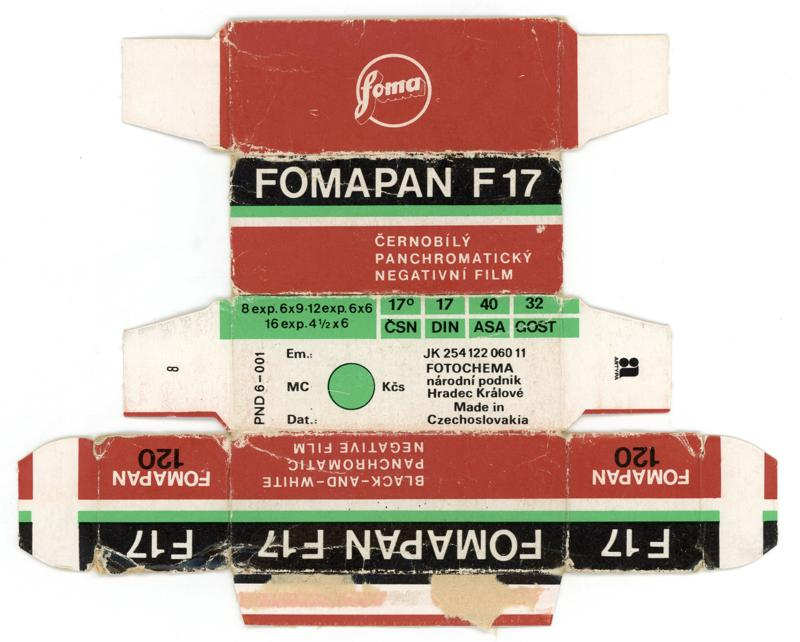
</a>


`UUID: 3c4f8b9bb3e74d20b67ac3611475608f`↓

<a href="./archive/00413_001.jpg" target="_blank">
	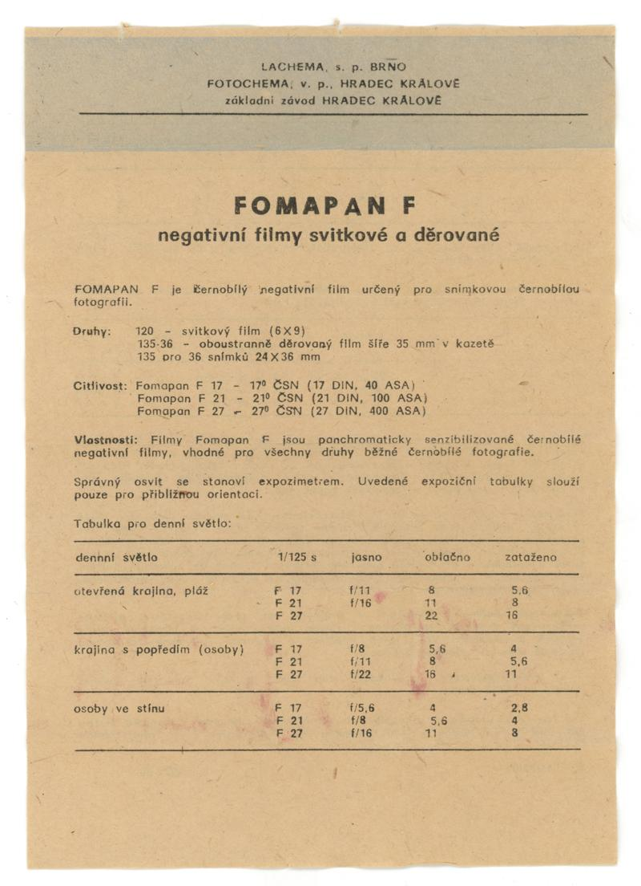
</a>


`UUID: 9db2e6deb48a408e8848fa333255036a`↓

<a href="./archive/00413_002.jpg" target="_blank">
	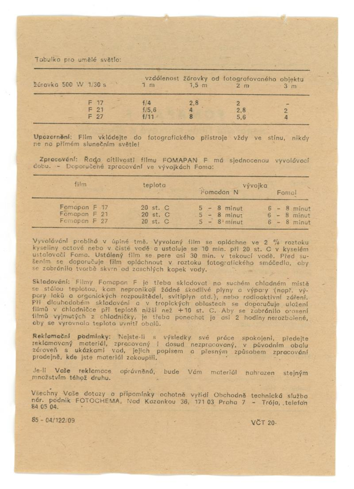
</a>

#### [1991] Konica Infrared 750nm (ref: e696)

```
Format: 120          |  Process : BW      
ISO   : 32           |  Expiry  : 1991-02 
Type  : Single Pack  |  Quantity: N/A     
Added : 2025-01-05   |  Author  : dekuNukem
UUID  : 79a0275aee8e43e895b5794a8538e696
```

<a href="./archive/00039_000.jpg" target="_blank">
	
</a>


`UUID: b5abc293fb26450eab9bfdda971cf1ad`↓

<a href="./archive/00039_001.jpg" target="_blank">
	
</a>

#### [1991] ORWO Chrom UT21 (ref: 3fd5)

```
Format: 35mm         |  Process : Unknown 
ISO   : 100          |  Expiry  : 1991-05 
Type  : Single Pack  |  Quantity: 24exp   
Added : 2025-09-28   |  Author  : fine-seat
UUID  : e3f739b7106044949b4f101684ad3fd5
```

<a href="./archive/00359_000.jpg" target="_blank">
	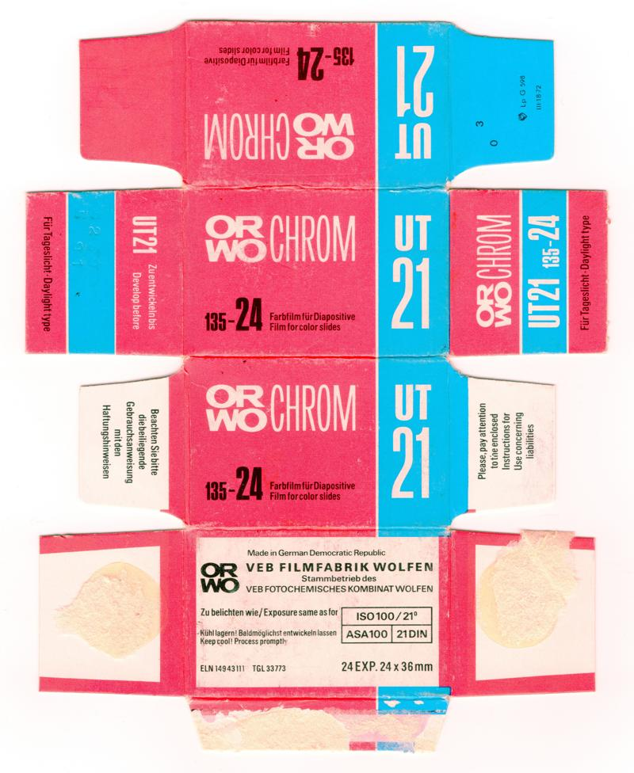
</a>


`UUID: a9dd1ce04a364ba9bf0610b68b3d3b89`↓

<a href="./archive/00359_001.jpg" target="_blank">
	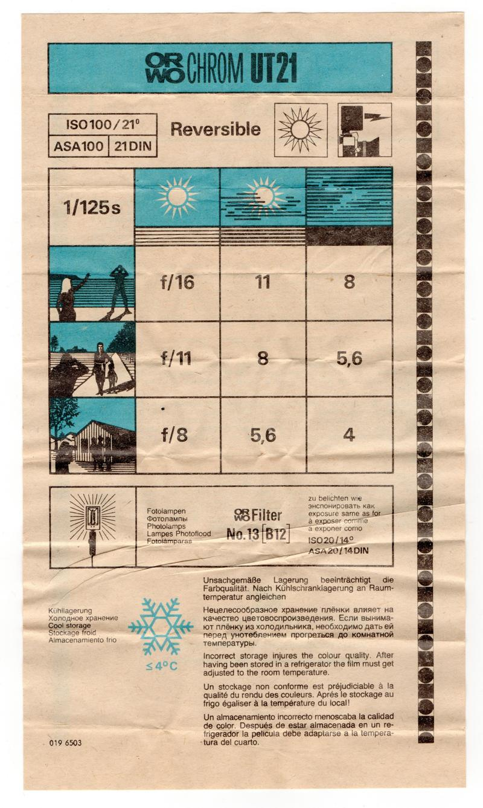
</a>


`UUID: 357b9379dea24d16b611aaf25ccdcd04`↓

<a href="./archive/00359_002.jpg" target="_blank">
	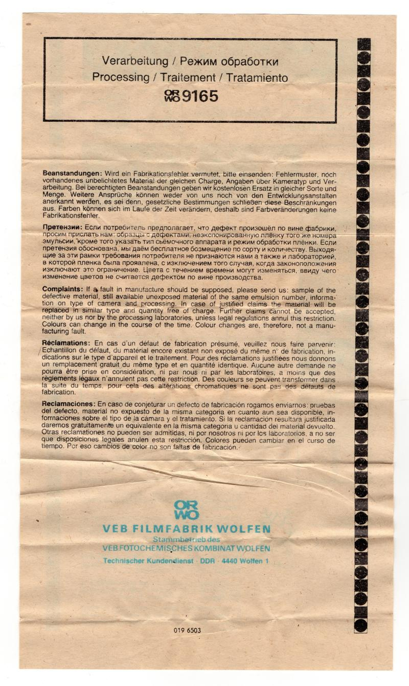
</a>


`UUID: 27c54d7248cb4d858c6773bc29ec69a3`↓

<a href="./archive/00359_003.jpg" target="_blank">
	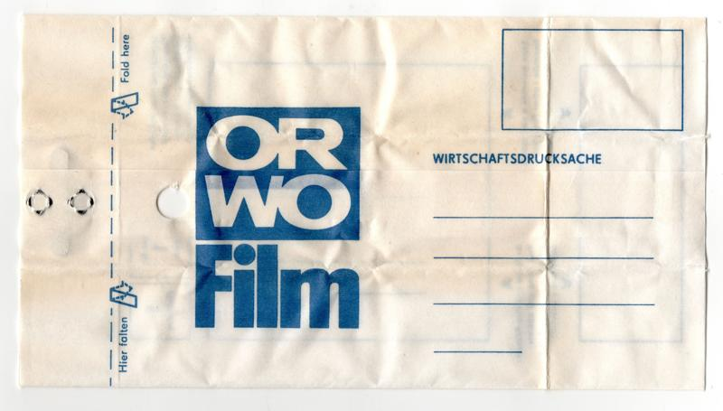
</a>


`UUID: 1340536f2f4b408a9129dea625da8168`↓

<a href="./archive/00359_004.jpg" target="_blank">
	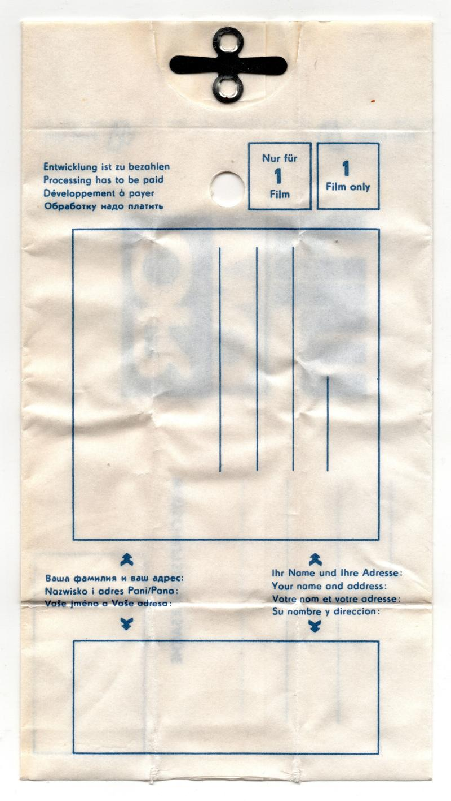
</a>

#### [1991] Tasma OCh 50 (ref: 5c43)

```
Format: 35mm         |  Process : BW      
ISO   : 50           |  Expiry  : 1991-05 
Type  : Single Pack  |  Quantity: 36exp   
Added : 2025-07-29   |  Author  : Henry Gunn
UUID  : 58211887217046be9d2dfcce8d0c5c43
```

<a href="./archive/00108_000.jpg" target="_blank">
	
</a>

#### [1991] Kodak TMAX P3200 (ref: 1dff)

```
Format: 35mm         |  Process : BW      
ISO   : 3200         |  Expiry  : 1991-07 
Type  : Single Pack  |  Quantity: 36exp   
Added : 2025-07-29   |  Author  : Nano_Burger
UUID  : 9e4ea1efa5a54938985fdf8901951dff
```

<a href="./archive/00104_000.jpg" target="_blank">
	
</a>


`UUID: b9d1b08379d9482bbc799101f6881f12`↓

<a href="./archive/00104_001.jpg" target="_blank">
	
</a>


`UUID: a6740f1fc4df4b80a8a4dee83a26c04b`↓

<a href="./archive/00104_002.jpg" target="_blank">
	
</a>

#### [1991] Kodak TMAX 400 (ref: a34d)

```
Format: 35mm         |  Process : BW      
ISO   : 400          |  Expiry  : 1991-09 
Type  : Single Pack  |  Quantity: 36exp   
Added : 2025-08-30   |  Author  : dekuNukem
UUID  : c3e0b9bbf7a94fe28d6c2fc3cab2a34d
```

<a href="./archive/00273_000.jpg" target="_blank">
	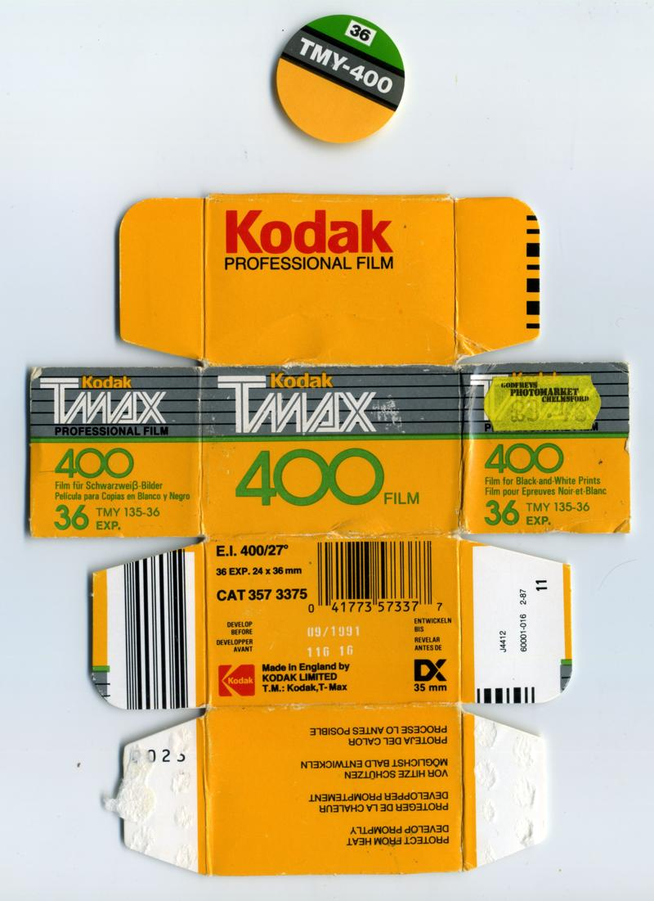
</a>


`UUID: 92e90ab4cddd4e9d92981ba28f810803`↓

<a href="./archive/00273_001.jpg" target="_blank">
	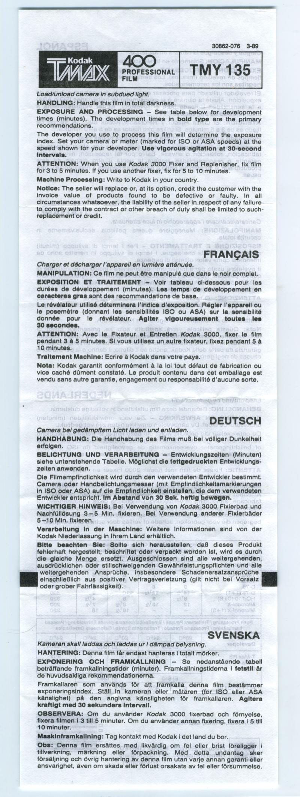
</a>


`UUID: c6b25c061c1649c1a5fd09059473a330`↓

<a href="./archive/00273_002.jpg" target="_blank">
	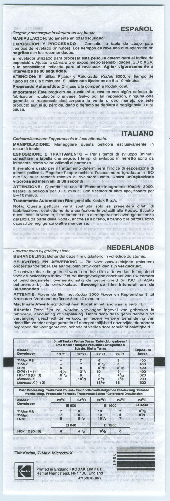
</a>

#### [1991] Premium Super XG (ref: 8ccd)

```
Format: 35mm         |  Process : C-41    
ISO   : 100          |  Expiry  : 1991-12 
Type  : Single Pack  |  Quantity: 36exp   
Added : 2025-08-30   |  Author  : dekuNukem
UUID  : 592592a0182a47dda6390cfc4fd18ccd
```

<a href="./archive/00265_000.jpg" target="_blank">
	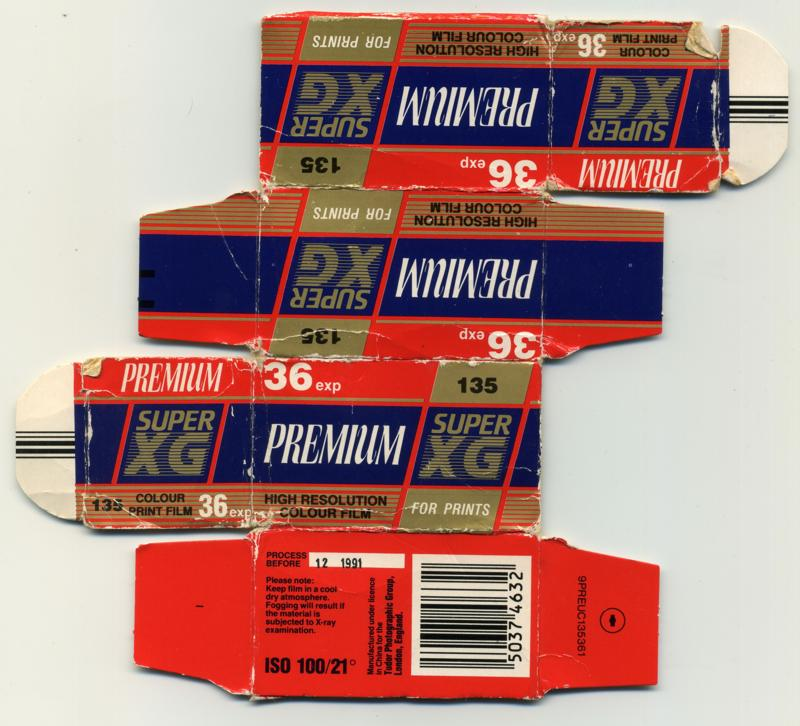
</a>


`UUID: 6a35a7c39a2e4083bc5faa53fb5abd4e`↓

<a href="./archive/00265_001.jpg" target="_blank">
	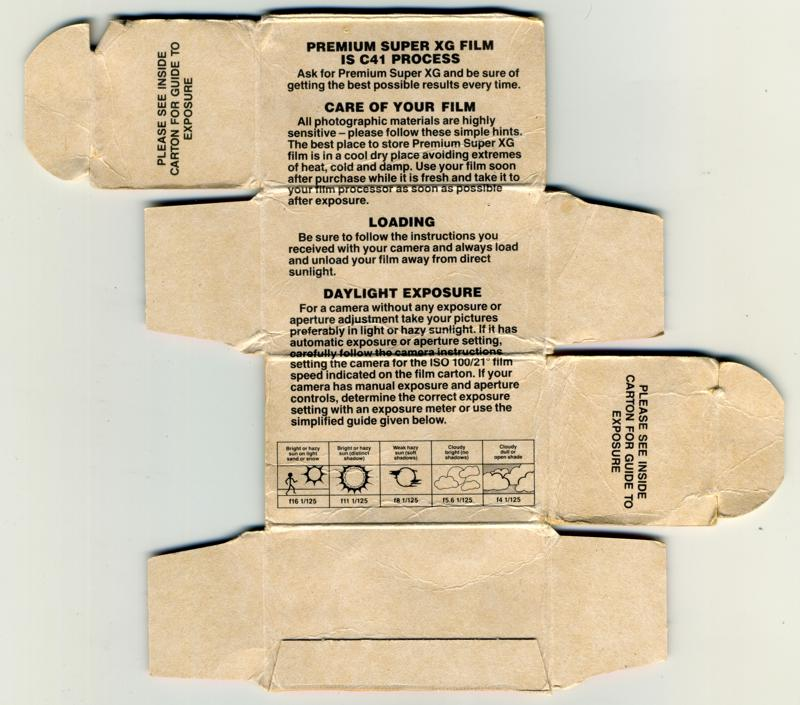
</a>

#### [1992] Svema Foto 64 (ref: 18f8)

```
Format: 16mm         |  Process : BW      
ISO   : 64           |  Expiry  : 1992-04 
Type  : Refill       |  Quantity: 20exp   
Added : 2025-10-12   |  Author  : dekuNukem
UUID  : 0c1f9c9669e6421a9d9ef9ac14b918f8
```

<a href="./archive/00387_000.jpg" target="_blank">
	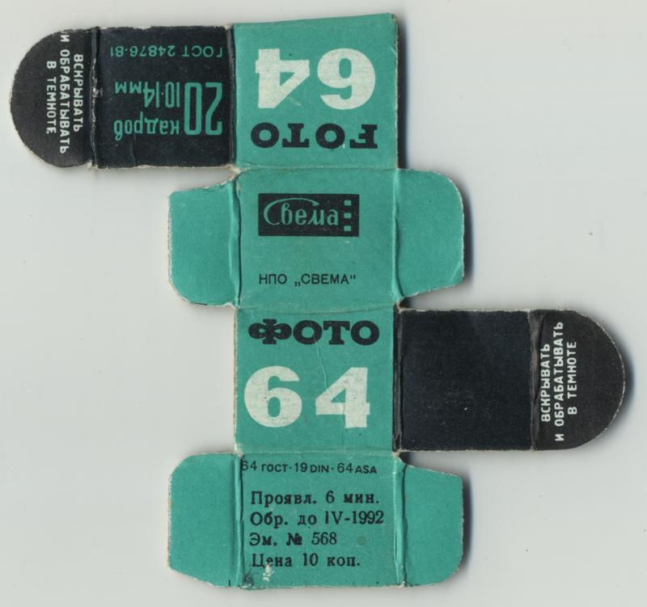
</a>

#### [1992] Ificolor SHR 100 (ref: 0198)

```
Format: 126          |  Process : C-41    
ISO   : 100          |  Expiry  : 1992-05 
Type  : Single Pack  |  Quantity: 24exp   
Added : 2025-09-17   |  Author  : @ellafridalindblom
UUID  : b5dd426d99ad43e5b289be7acd9c0198
```

<a href="./archive/00342_000.jpg" target="_blank">
	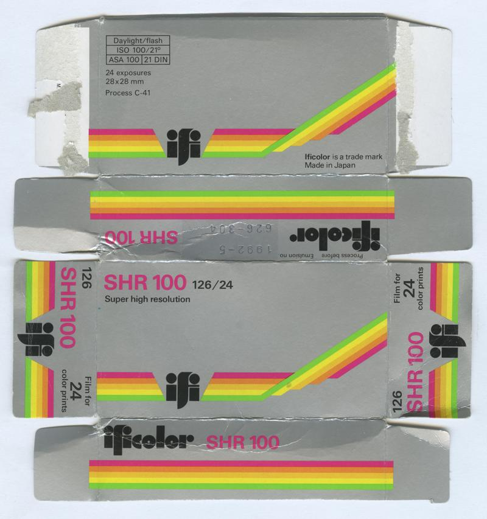
</a>

#### [1992] Minolta Minolta 16 Color Film For Prints (ref: a2ff)

```
Format: 16mm         |  Process : C-41    
ISO   : 100          |  Expiry  : 1992-06 
Type  : Single Pack  |  Quantity: 20exp   
Added : 2025-08-05   |  Author  : The Compartmentalist
UUID  : a2cfc71ac0e24ea58f4e3350423aa2ff
```

<a href="./archive/00162_000.jpg" target="_blank">
	
</a>

#### [1992] Svema Foto 32 (ref: 8b44)

```
Format: 120          |  Process : BW      
ISO   : 32           |  Expiry  : 1992-06 
Type  : Single Pack  |  Quantity: N/A     
Added : 2025-10-13   |  Author  : @recycling.film
UUID  : 9205929c91ba4c3bbbfacb1b2e678b44
```

<a href="./archive/00393_000.jpg" target="_blank">
	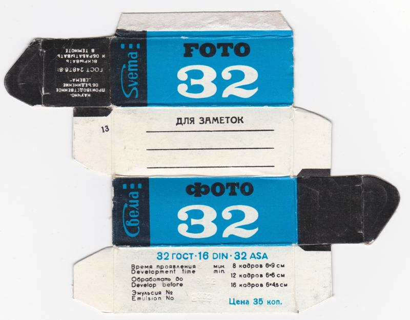
</a>

#### [1992] ORWO NP15 (ref: 9a20)

```
Format: 120          |  Process : BW      
ISO   : 25           |  Expiry  : 1992-08 
Type  : Single Pack  |  Quantity: N/A     
Added : 2025-10-13   |  Author  : @recycling.film
UUID  : 50956257d99f4f24a3ec712e77379a20
```

<a href="./archive/00394_000.jpg" target="_blank">
	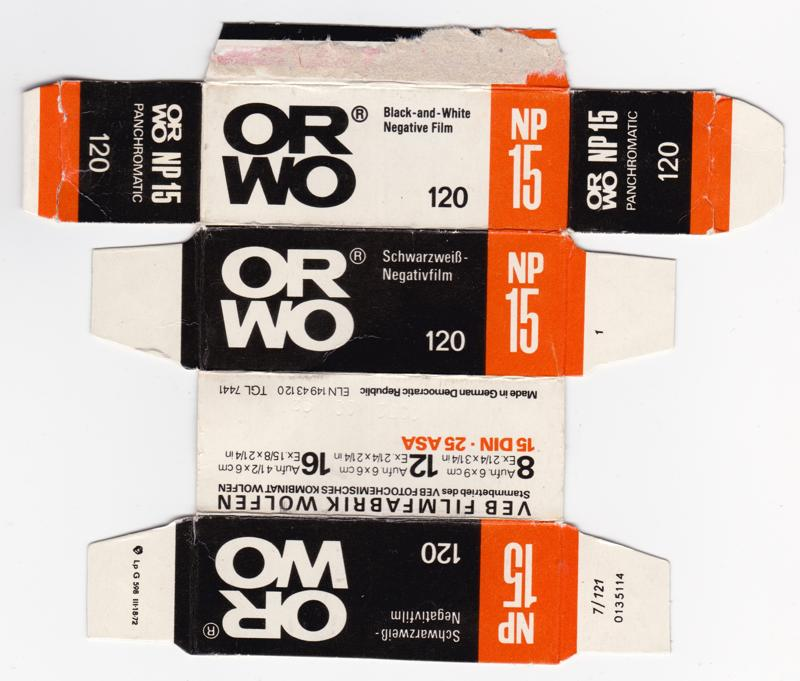
</a>


`UUID: 71624d5686d648ef9411cbed44ed3f49`↓

<a href="./archive/00394_001.jpg" target="_blank">
	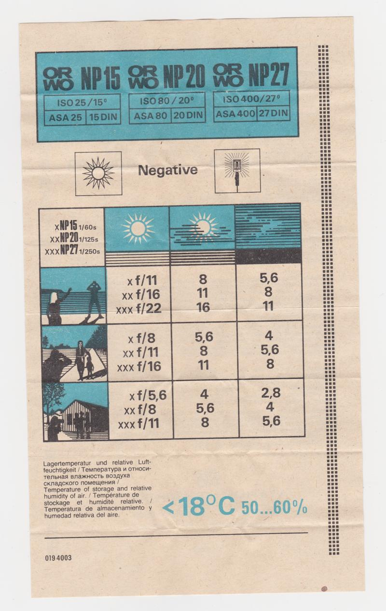
</a>


`UUID: 2528a0f231cf473597f3d594c67dc803`↓

<a href="./archive/00394_002.jpg" target="_blank">
	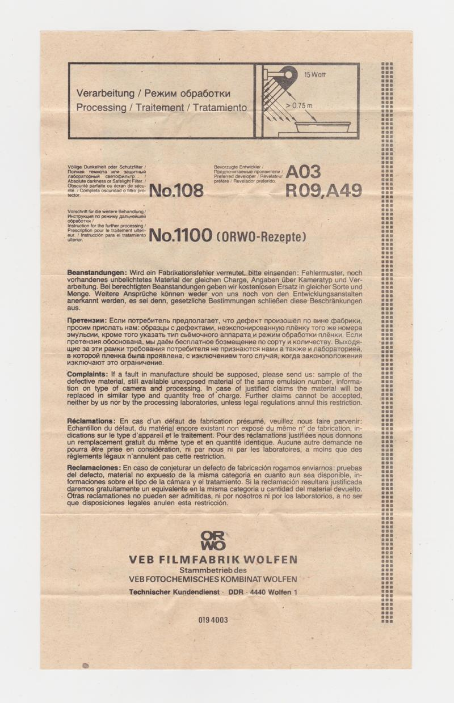
</a>

#### [1992] Polaroid PolaBlue 35mm (ref: df66)

```
Format: 35mm         |  Process : Instant 
ISO   : 8            |  Expiry  : 1992-08 
Type  : Single Pack  |  Quantity: 12exp   
Added : 2025-01-04   |  Author  : dekuNukem
UUID  : 8236180d686f4e9ca4aa8e6fc397df66
```

<a href="./archive/00019_000.jpg" target="_blank">
	
</a>


`UUID: 6f0d7187f2aa4396ab9879964db7a22a`↓

<a href="./archive/00019_001.jpg" target="_blank">
	
</a>


`UUID: 69c6bc7256f542acadde9fa0441c8c8f`↓

<a href="./archive/00019_002.jpg" target="_blank">
	
</a>


`UUID: 6a168a96e48f45c5b2e4e730e1644fb4`↓

<a href="./archive/00019_003.jpg" target="_blank">
	
</a>


`UUID: 21253e4311ae4a25b46ba931aa78f266`↓

<a href="./archive/00019_004.jpg" target="_blank">
	
</a>


`UUID: de72b5b522a749fbb6aa280253eea1bd`↓

<a href="./archive/00019_005.jpg" target="_blank">
	
</a>


`UUID: e48473352ab04761b968bdcae19a1ab5`↓

<a href="./archive/00019_006.jpg" target="_blank">
	
</a>

#### [1992] Polaroid PolaChrome 35mm (ref: 3b60)

```
Format: 35mm         |  Process : Instant 
ISO   : 40           |  Expiry  : 1992-09 
Type  : Single Pack  |  Quantity: 36exp   
Added : 2025-01-05   |  Author  : dekuNukem
UUID  : b0041b1e44a64f6591d49e918e033b60
```

<a href="./archive/00029_000.jpg" target="_blank">
	
</a>


`UUID: 1d0b621cf6f44481b941423f04103243`↓

<a href="./archive/00029_001.jpg" target="_blank">
	
</a>


`UUID: ca6b169f6ec949a4a77874ccee054951`↓

<a href="./archive/00029_002.jpg" target="_blank">
	
</a>


`UUID: 705197bbfdc24b92a581a8070d4ee0d2`↓

<a href="./archive/00029_003.jpg" target="_blank">
	
</a>


`UUID: 67abf5aa56574fafab78e2ade2112475`↓

<a href="./archive/00029_004.jpg" target="_blank">
	
</a>

#### [1992] Kodak Ektachrome 200 (ref: b21e)

```
Format: 35mm         |  Process : E-6     
ISO   : 200          |  Expiry  : 1992-10 
Type  : Single Pack  |  Quantity: 36exp   
Added : 2025-02-04   |  Author  : b0baspace
UUID  : 7d8346073bbe4d6a84e57cc2bb28b21e
```

<a href="./archive/00052_000.jpg" target="_blank">
	
</a>


`UUID: cbae471aa4184cbeabc5b1f8b49f8943`↓

<a href="./archive/00052_001.jpg" target="_blank">
	
</a>


`UUID: c6c1d49626e14661a700da5b26e07ca8`↓

<a href="./archive/00052_002.jpg" target="_blank">
	
</a>

#### [1992] Fujifilm Fujichrome Professional 100D (ref: 439d)

```
Format: 120          |  Process : E-6     
ISO   : 100          |  Expiry  : 1992-12 
Type  : Single Pack  |  Quantity: N/A     
Added : 2025-01-05   |  Author  : dekuNukem
UUID  : 5dcdd19ddf654415b7eac69183e7439d
```

<a href="./archive/00032_000.jpg" target="_blank">
	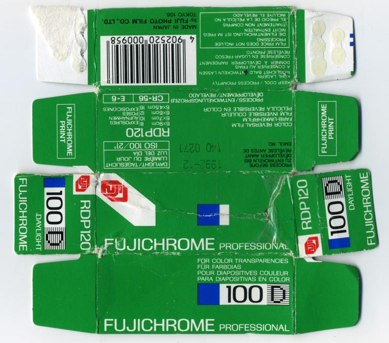
</a>


`UUID: 2e00754170744438a318b7f71da1c977`↓

<a href="./archive/00032_001.jpg" target="_blank">
	
</a>


`UUID: 2d0ef64e672342509bad0f88d7908974`↓

<a href="./archive/00032_002.jpg" target="_blank">
	
</a>

#### [1992] Fujifilm Fujicolor Super HG (ref: feb7)

```
Format: 35mm         |  Process : C-41    
ISO   : 400          |  Expiry  : 1992-12 
Type  : Single Pack  |  Quantity: 24exp   
Added : 2025-10-17   |  Author  : @recycling.film
UUID  : 90ac1c8117ef41d291bedc89cc65feb7
```

<a href="./archive/00404_000.jpg" target="_blank">
	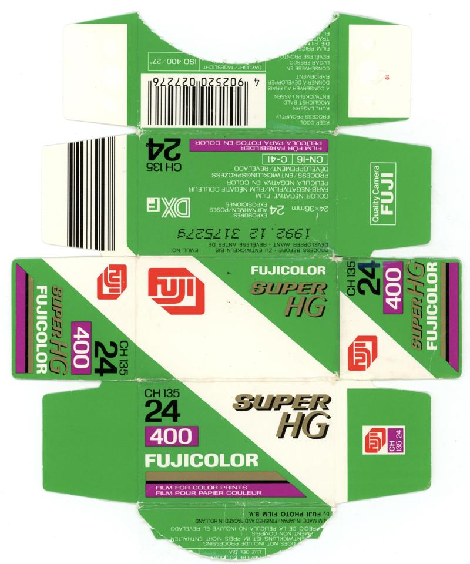
</a>


`UUID: d40e2c7220b94e2988936a7b4137a6cf`↓

<a href="./archive/00404_001.jpg" target="_blank">
	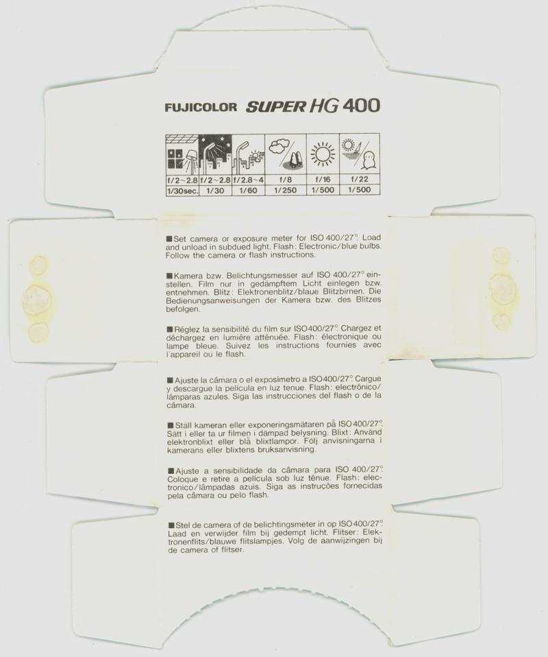
</a>

#### [1992] ORWO NP 20 SL (ref: b16c)

```
Format: 35mm         |  Process : BW      
ISO   : 80           |  Expiry  : 1992-12 
Type  : Single Pack  |  Quantity: 12exp   
Added : 2025-08-05   |  Author  : The Compartmentalist
UUID  : 9791c2074fdd4340a1463312ed77b16c
```

<a href="./archive/00163_000.jpg" target="_blank">
	
</a>

#### [1993] Konica Infrared 750nm (ref: 6b0e)

```
Format: 120          |  Process : BW      
ISO   : 32           |  Expiry  : 1993-02 
Type  : Single Pack  |  Quantity: N/A     
Added : 2025-09-03   |  Author  : @ellafridalindblom
UUID  : 25b1c5f73455417384b6ef1a78b06b0e
```

<a href="./archive/00293_000.jpg" target="_blank">
	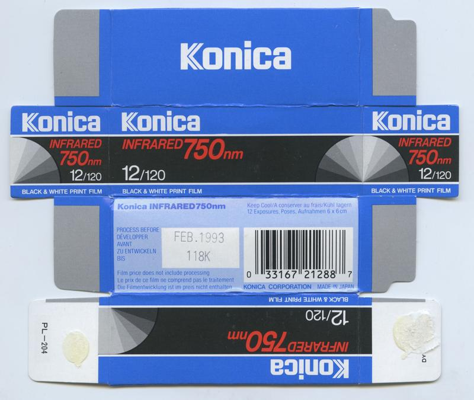
</a>


`UUID: 7b9dbba78af944b1a37dfe6112cdd9b0`↓

<a href="./archive/00293_001.jpg" target="_blank">
	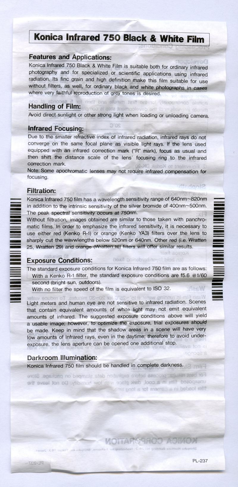
</a>


`UUID: 685cd88d9a3244ad8de01af68f32c144`↓

<a href="./archive/00293_002.jpg" target="_blank">
	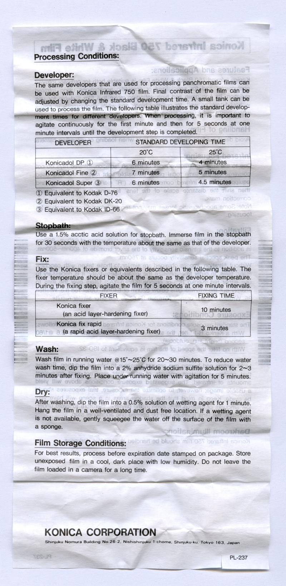
</a>

#### [1993] Ificolor Super FG HQ 200 (ref: ff86)

```
Format: 35mm         |  Process : C-41    
ISO   : 200          |  Expiry  : 1993-03 
Type  : Single Pack  |  Quantity: 36exp   
Added : 2025-09-17   |  Author  : @ellafridalindblom
UUID  : 07d897691a00479584d29dbe8c05ff86
```

<a href="./archive/00344_000.jpg" target="_blank">
	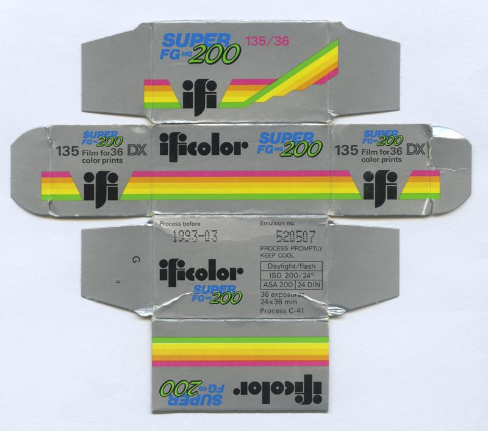
</a>

#### [1993] SupaSnaps Snappit Film (ref: c41b)

```
Format: 126          |  Process : C-41    
ISO   : 100          |  Expiry  : 1993-05 
Type  : Single Pack  |  Quantity: 24exp   
Added : 2025-09-13   |  Author  : dekuNukem
UUID  : 1cf47ce82b58418f9e009b4f0121c41b
```

<a href="./archive/00324_000.jpg" target="_blank">
	
</a>


`UUID: 2406fd96271a4db4b946e0e17a503b1b`↓

<a href="./archive/00324_001.jpg" target="_blank">
	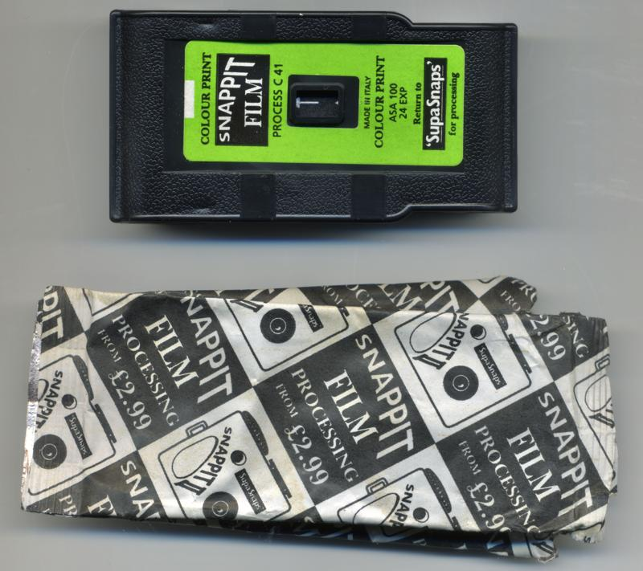
</a>

#### [1993] Svema Foto 32 (ref: d1fd)

```
Format: 35mm         |  Process : BW      
ISO   : 32           |  Expiry  : 1993-07 
Type  : Refill       |  Quantity: 36exp   
Added : 2025-10-17   |  Author  : @recycling.film
UUID  : 64289ff9fd4b4e589c5654a044dbd1fd
```

<a href="./archive/00405_000.jpg" target="_blank">
	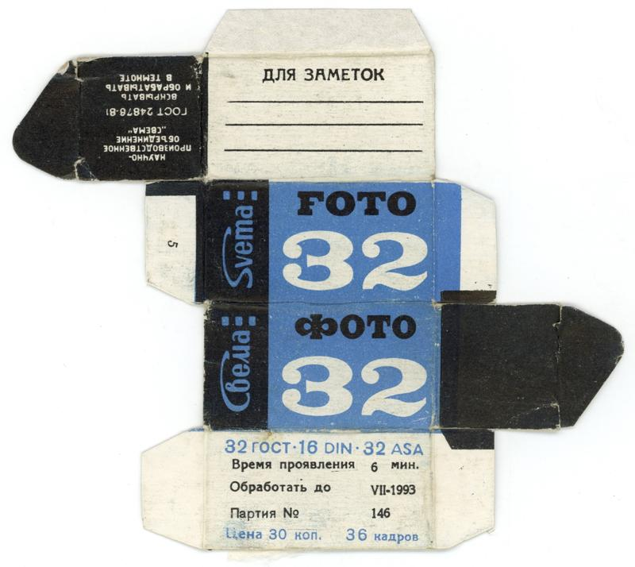
</a>

#### [1993] Alfo ALFOcolor PR-G (ref: 94b9)

```
Format: 35mm         |  Process : C-41    
ISO   : 1600         |  Expiry  : 1993-08 
Type  : Single Pack  |  Quantity: 24exp   
Added : 2025-07-31   |  Author  : fine-seat
UUID  : cc723aa89e9e43ec8ac1ebd18efa94b9
```

<a href="./archive/00151_000.jpg" target="_blank">
	
</a>

#### [1993] Polaroid PolaChrome 35mm (ref: b202)

```
Format: 35mm         |  Process : Instant 
ISO   : 40           |  Expiry  : 1993-08 
Type  : Single Pack  |  Quantity: 12exp   
Added : 2025-08-14   |  Author  : Camera.Riley
UUID  : 30947745f405445e88808deab9a4b202
```

<a href="./archive/00174_000.jpg" target="_blank">
	
</a>

#### [1993] Kodak Gold II (ref: 61d0)

```
Format: 35mm         |  Process : C-41    
ISO   : 200          |  Expiry  : 1993-11 
Type  : Single Pack  |  Quantity: 36exp   
Added : 2025-08-20   |  Author  : @photos.by.qi
UUID  : 63fd3851483d457d9fdc15b2d24461d0
```

<a href="./archive/00253_000.jpg" target="_blank">
	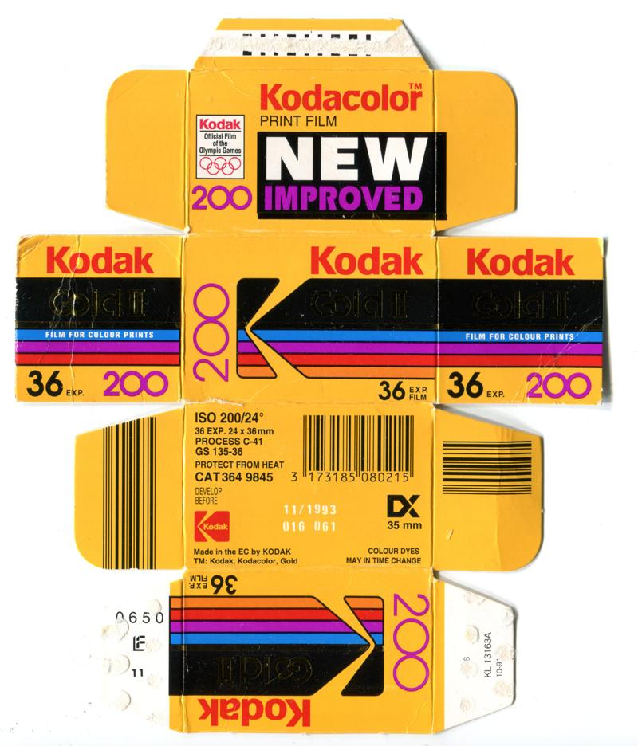
</a>


`UUID: 49bb438bb4a94d07b07d1bd3178a38d8`↓

<a href="./archive/00253_001.jpg" target="_blank">
	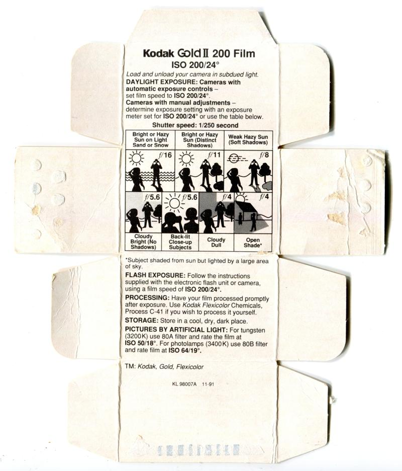
</a>

#### [1993] Nishika Color Print Film (ref: baeb)

```
Format: 35mm         |  Process : C-41    
ISO   : 100          |  Expiry  : 1993-12 
Type  : Single Pack  |  Quantity: 36exp   
Added : 2025-10-17   |  Author  : @recycling.film
UUID  : c8f31c7a1adf423bbc4d35eae399baeb
```

<a href="./archive/00406_000.jpg" target="_blank">
	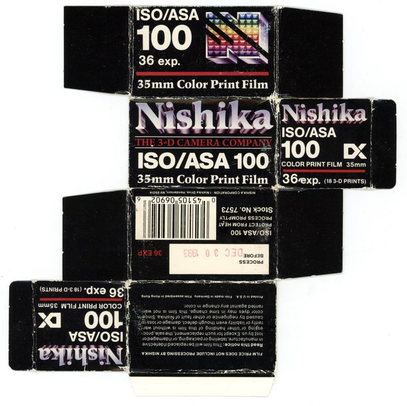
</a>

#### [1994] Fujifilm Fujicolor Super HG (ref: ee94)

```
Format: 35mm         |  Process : C-41    
ISO   : 100          |  Expiry  : 1994-07 
Type  : Single Pack  |  Quantity: 36exp   
Added : 2025-07-31   |  Author  : fine-seat
UUID  : 9233714654ff481089c2d4ff1334ee94
```

<a href="./archive/00150_000.jpg" target="_blank">
	
</a>


`UUID: 302969081f4442239212b8e123d38378`↓

<a href="./archive/00150_001.jpg" target="_blank">
	
</a>

#### [1994] York Photo Labs DXG 200 (ref: 4bf8)

```
Format: 35mm         |  Process : C-41    
ISO   : 200          |  Expiry  : 1994-09 
Type  : Single Pack  |  Quantity: 36exp   
Added : 2025-02-04   |  Author  : b0baspace
UUID  : 46037fb6c55244b6ae47c55d0e454bf8
```

<a href="./archive/00051_000.jpg" target="_blank">
	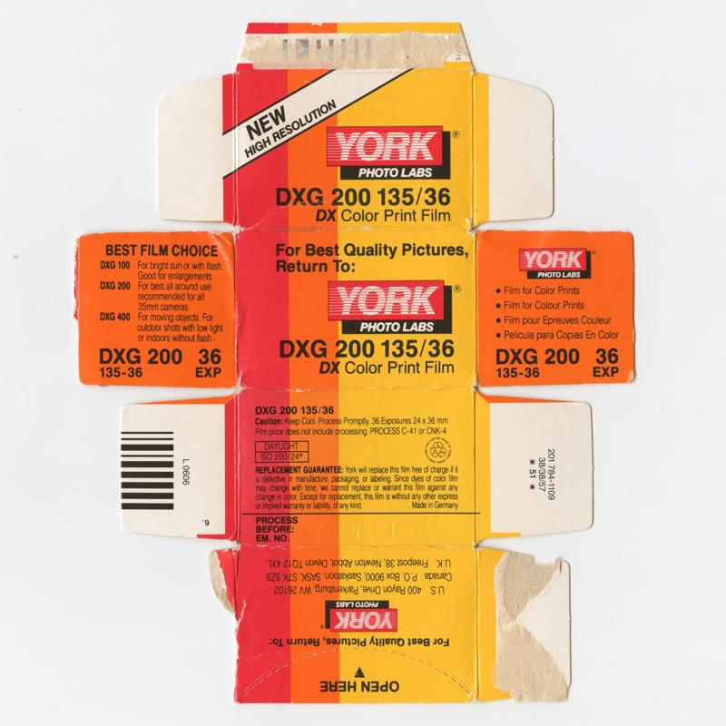
</a>

#### [1994] Ilford XP2 (ref: 7d94)

```
Format: 35mm         |  Process : C-41    
ISO   : 400          |  Expiry  : 1994-10 
Type  : Single Pack  |  Quantity: 20exp   
Added : 2025-10-17   |  Author  : @recycling.film
UUID  : bc6e58d62eb34ad6a54ea8d4ac877d94
```

<a href="./archive/00409_000.jpg" target="_blank">
	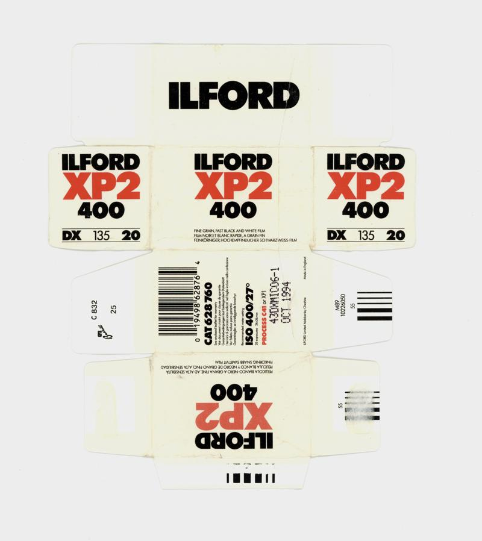
</a>


`UUID: bdd3a188431042dabb560e85287b517a`↓

<a href="./archive/00409_001.jpg" target="_blank">
	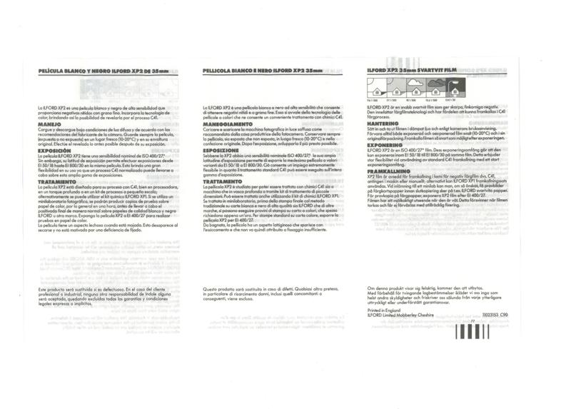
</a>


`UUID: 94aea5ecf4ab4e74b8e7205d7912c232`↓

<a href="./archive/00409_002.jpg" target="_blank">
	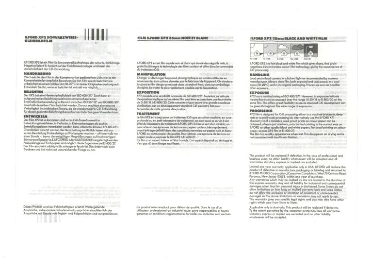
</a>

#### [1994] Kodak Ektachrome 100HC (ref: 3ab9)

```
Format: 35mm         |  Process : E-6     
ISO   : 100          |  Expiry  : 1994-11 
Type  : Single Pack  |  Quantity: 36exp   
Added : 2025-08-30   |  Author  : dekuNukem
UUID  : c7c26bb546634d47ae7fc5aa68b33ab9
```

<a href="./archive/00275_000.jpg" target="_blank">
	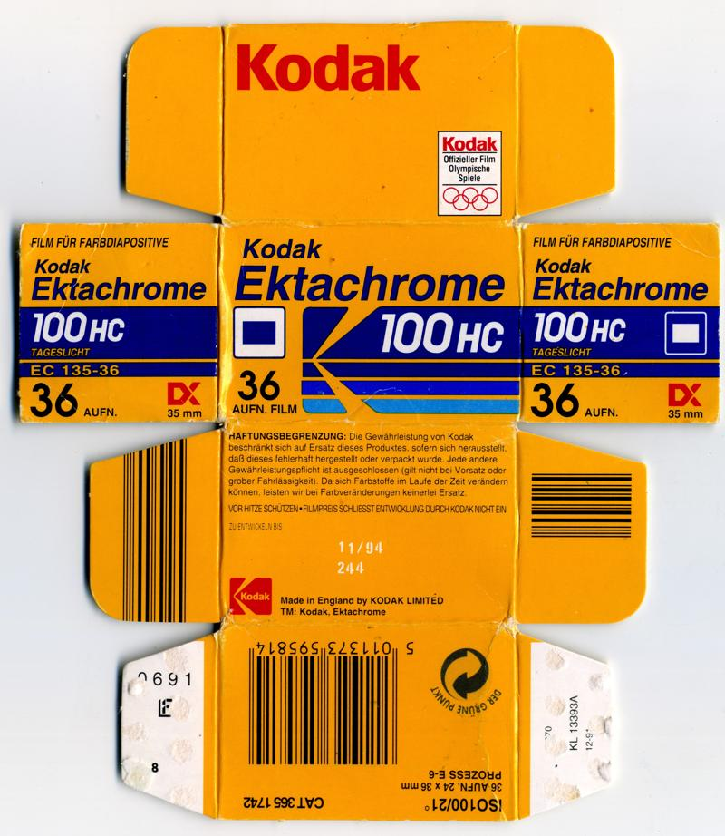
</a>


`UUID: de18a3dd00a744a3973965244938320f`↓

<a href="./archive/00275_001.jpg" target="_blank">
	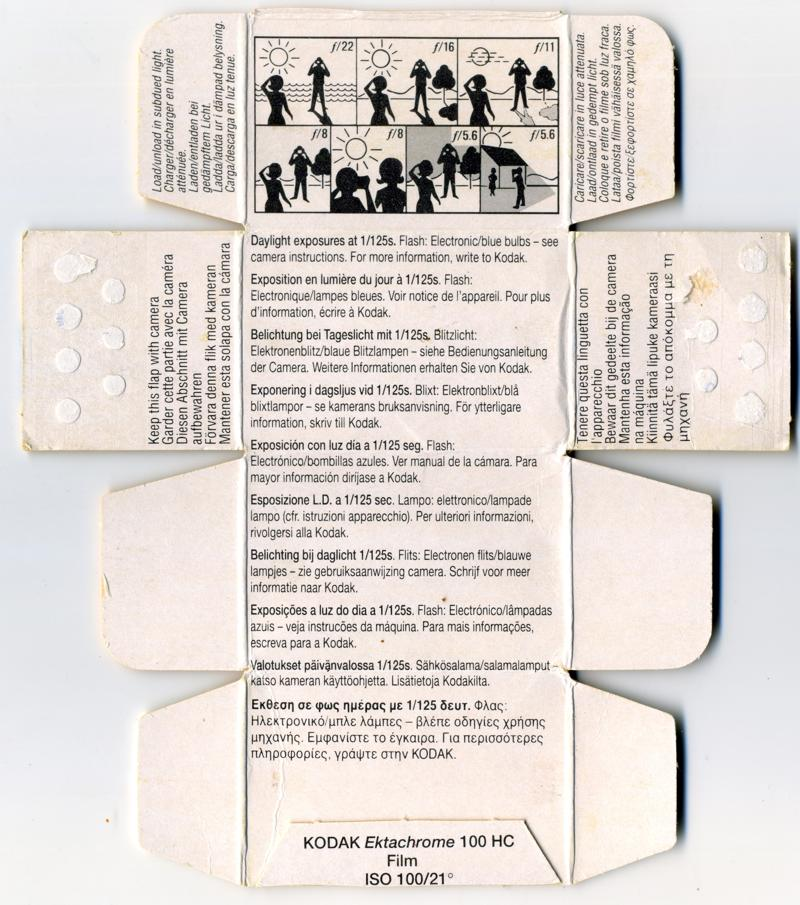
</a>

#### [1994] Kodak Ektachrome 100HC (ref: 775a)

```
Format: 35mm         |  Process : E-6     
ISO   : 100          |  Expiry  : 1994-11 
Type  : Single Pack  |  Quantity: 36exp   
Added : 2025-08-30   |  Author  : dekuNukem
UUID  : 064dbfe80ca84ac99329c252bce0775a
```

<a href="./archive/00276_000.jpg" target="_blank">
	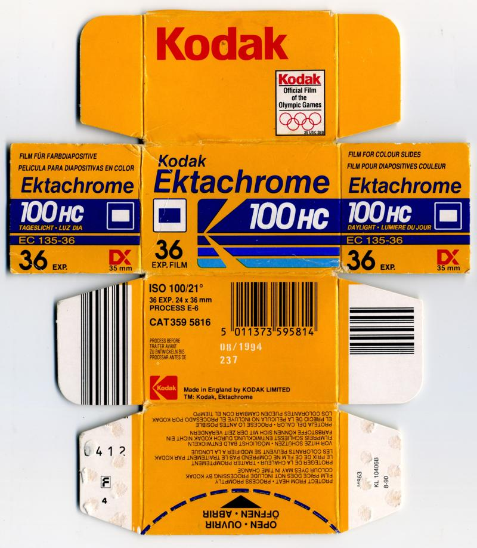
</a>


`UUID: 3c397dbea68649edb38d6464d6516746`↓

<a href="./archive/00276_001.jpg" target="_blank">
	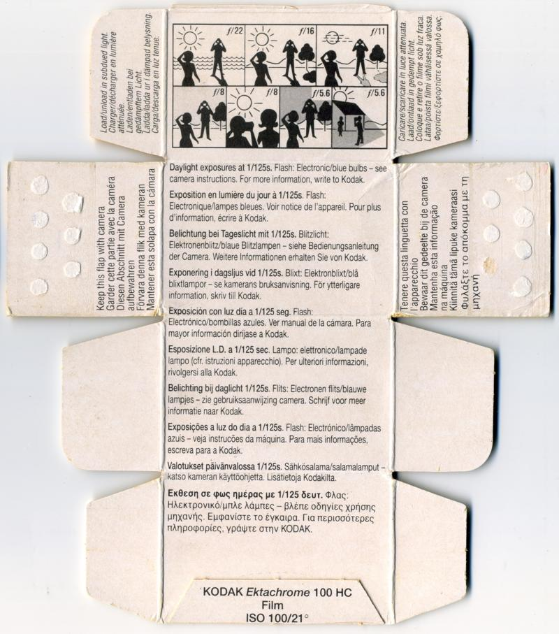
</a>

#### [1995] Kodak Technical Pan (ref: f4cf)

```
Format: 35mm         |  Process : BW      
ISO   : 25           |  Expiry  : 1995-04 
Type  : Bulk Roll    |  Quantity: 150ft   
Added : 2025-07-29   |  Author  : Nano_Burger
UUID  : e65b4252384141028ee037892c6bf4cf
```

<a href="./archive/00106_000.jpg" target="_blank">
	
</a>


`UUID: fd713c7576534f62832529c13f74996b`↓

<a href="./archive/00106_001.jpg" target="_blank">
	
</a>

#### [1995] Kodak Ektachrome Elite 100 (ref: 26ef)

```
Format: 35mm         |  Process : E-6     
ISO   : 100          |  Expiry  : 1995-11 
Type  : Single Pack  |  Quantity: 24exp   
Added : 2025-07-31   |  Author  : toader  
UUID  : 175cf2b69fe3413093d9d7f9ea0d26ef
```

<a href="./archive/00114_000.jpg" target="_blank">
	
</a>


`UUID: 89d1b19f3e364f55adc2523a07ed9ddb`↓

<a href="./archive/00114_001.jpg" target="_blank">
	
</a>

#### [1996] efke R100 (ref: 10ad)

```
Format: 127          |  Process : BW      
ISO   : 100          |  Expiry  : 1996-01 
Type  : Single Pack  |  Quantity: N/A     
Added : 2025-10-21   |  Author  : dekuNukem
UUID  : 686490575de4412b9309d5d797af10ad
```

<a href="./archive/00426_000.jpg" target="_blank">
	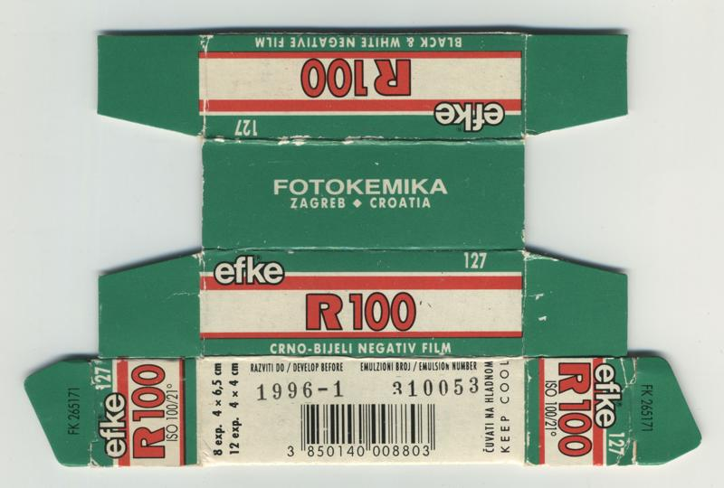
</a>


`UUID: 17e8ec86380144999ee0f93c6799030d`↓

<a href="./archive/00426_001.jpg" target="_blank">
	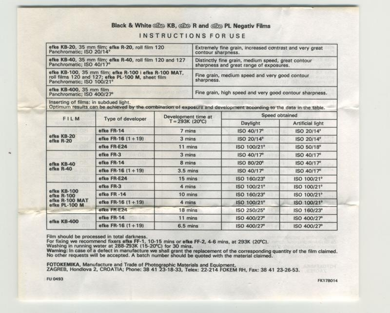
</a>


`UUID: 77788e6b682e47e089804190aecc56b7`↓

<a href="./archive/00426_002.jpg" target="_blank">
	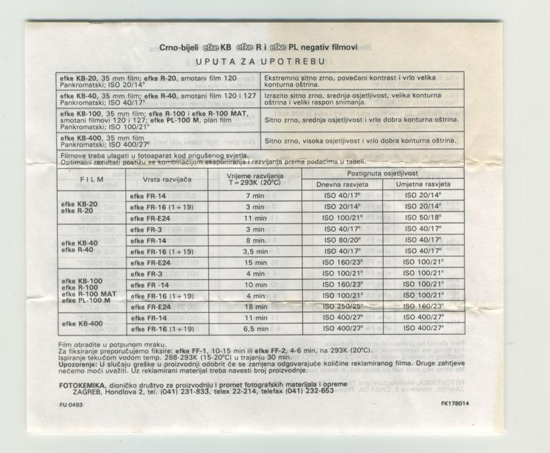
</a>

#### [1996] Kodak Gold (ref: 1962)

```
Format: 620          |  Process : C-41    
ISO   : 200          |  Expiry  : 1996-08 
Type  : Single Pack  |  Quantity: Unknown 
Added : 2025-10-21   |  Author  : dekuNukem
UUID  : 92c51161259045d5b726e32fa4ee1962
```

<a href="./archive/00442_000.jpg" target="_blank">
	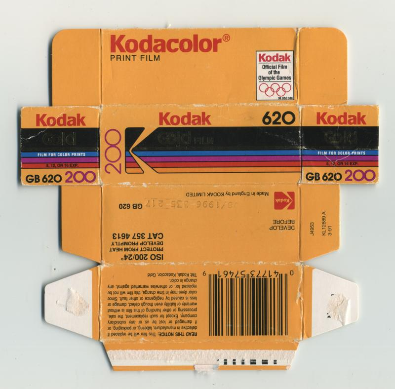
</a>


`UUID: 51e0c8950d164f8a985b46fe1b0e5f8b`↓

<a href="./archive/00442_001.jpg" target="_blank">
	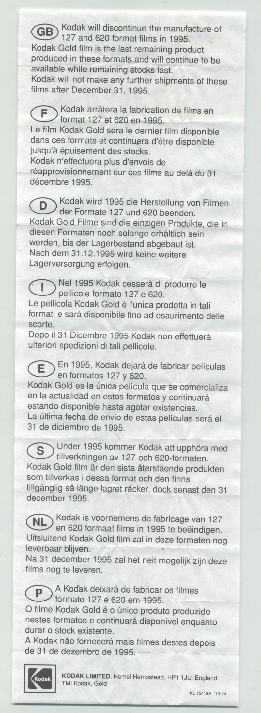
</a>

#### [1996] Polaroid 665 (ref: e054)

```
Format: Pack Film    |  Process : Instant 
ISO   : 80           |  Expiry  : 1996-08 
Type  : Single Pack  |  Quantity: 8exp    
Added : 2025-01-04   |  Author  : dekuNukem
UUID  : 311d896d68b74b1193afcfa129c5e054
```

<a href="./archive/00018_000.jpg" target="_blank">
	
</a>

#### [1997] Fujifilm Fujichrome Provia 400 Professional (ref: b7b2)

```
Format: 120          |  Process : E-6     
ISO   : 400          |  Expiry  : 1997-08 
Type  : Single Pack  |  Quantity: N/A     
Added : 2025-09-10   |  Author  : dekuNukem
UUID  : eb3d804130c64e0f9486b1134bc7b7b2
Notes : RHP
```

<a href="./archive/00318_000.jpg" target="_blank">
	
</a>


`UUID: 022093eba4ed4f8fa2875519ad245735`↓

<a href="./archive/00318_001.jpg" target="_blank">
	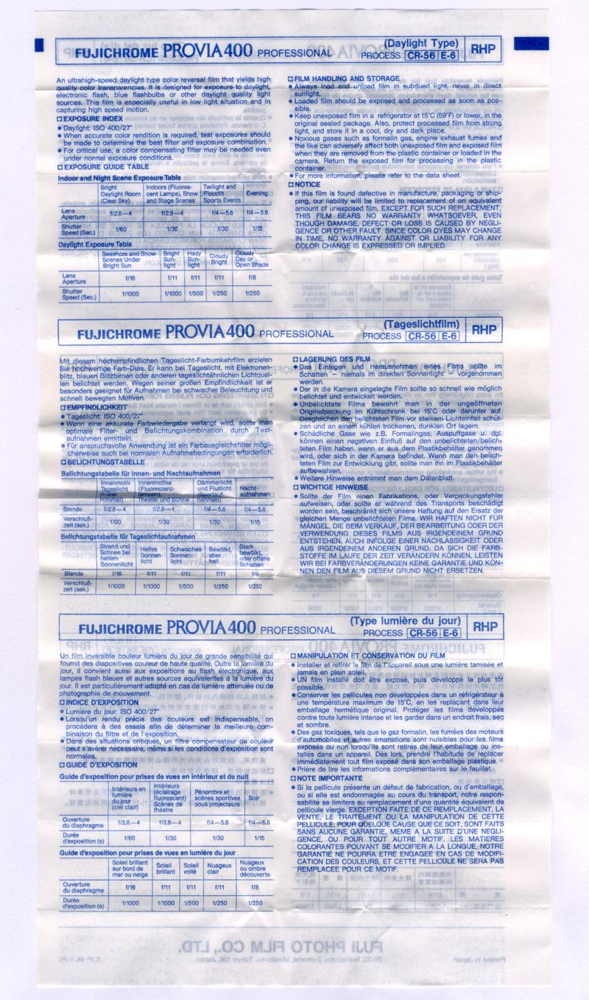
</a>


`UUID: 16af66bb84f245a89c2bdb1c2d548ce2`↓

<a href="./archive/00318_002.jpg" target="_blank">
	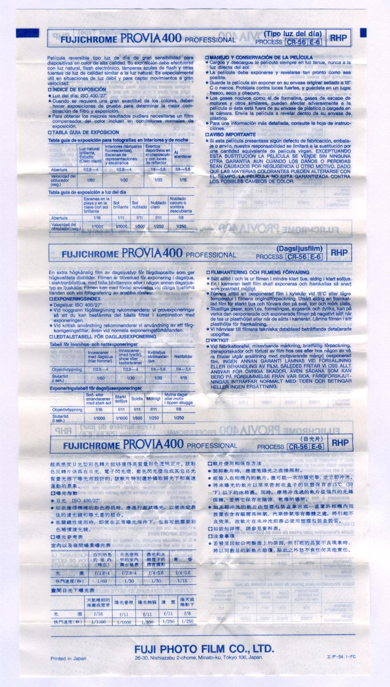
</a>

#### [1997] Kodak Ektachrome Elite 200 (ref: a391)

```
Format: 35mm         |  Process : E-6     
ISO   : 200          |  Expiry  : 1997-08 
Type  : Single Pack  |  Quantity: 36exp   
Added : 2025-08-30   |  Author  : dekuNukem
UUID  : 5f3a81c10cdb46baa28b1b1fbc56a391
```

<a href="./archive/00274_000.jpg" target="_blank">
	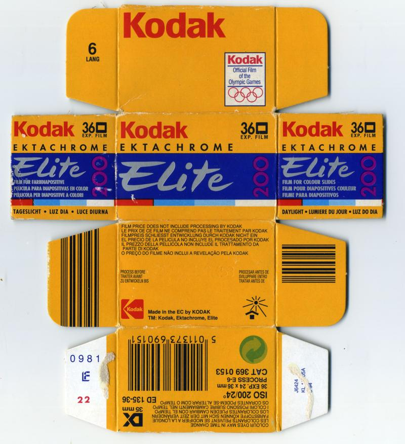
</a>


`UUID: 4c120316ad9f4fedb57d57138d37d0e1`↓

<a href="./archive/00274_001.jpg" target="_blank">
	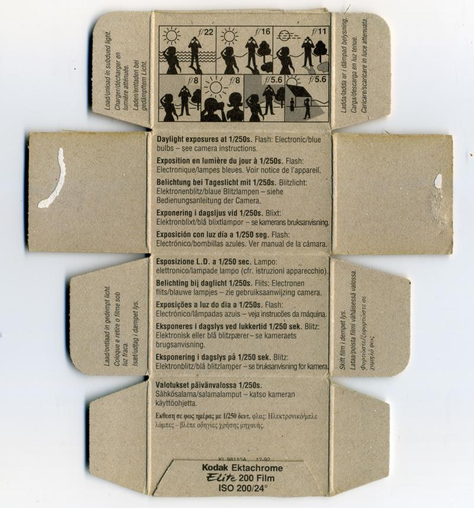
</a>

#### [1997] Max Spielmann Maxi Color (ref: bf60)

```
Format: 35mm         |  Process : C-41    
ISO   : 400          |  Expiry  : 1997-08 
Type  : Single Pack  |  Quantity: 24exp   
Added : 2025-08-30   |  Author  : dekuNukem
UUID  : 0953325be5e54102b7615a7a5f82bf60
```

<a href="./archive/00268_000.jpg" target="_blank">
	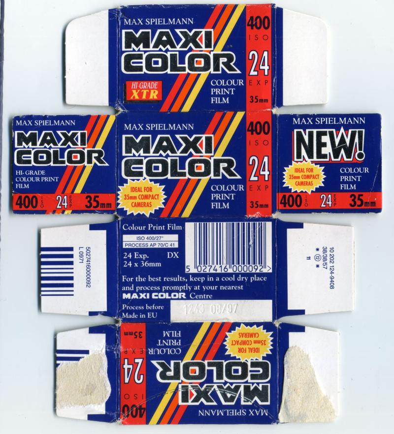
</a>

#### [1998] Fujifilm Fujichrome Sensia 100 (ref: a59b)

```
Format: 35mm         |  Process : E-6     
ISO   : 100          |  Expiry  : 1998-01 
Type  : Single Pack  |  Quantity: 36exp   
Added : 2025-07-31   |  Author  : The Compartmentalist
UUID  : d4fdfa0d829f4fcab984381a31f2a59b
```

<a href="./archive/00116_000.jpg" target="_blank">
	
</a>


`UUID: 4f21cef93ed3401caed74619ffa2b595`↓

<a href="./archive/00116_001.jpg" target="_blank">
	
</a>

#### [1998] Klick XD200 (ref: 44d7)

```
Format: 110          |  Process : C-41    
ISO   : 200          |  Expiry  : 1998-02 
Type  : Single Pack  |  Quantity: 24exp   
Added : 2025-05-24   |  Author  : dekuNukem
UUID  : 2276628aa2794442ae81221329fc44d7
```

<a href="./archive/00062_000.jpg" target="_blank">
	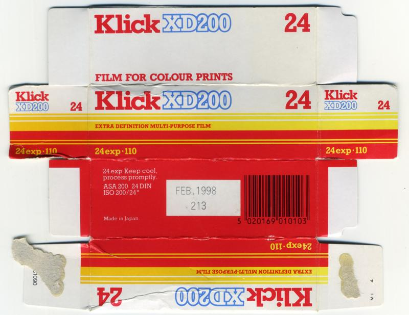
</a>

#### [1998] Kodak Ektachrome Slide Duplicating Film (ref: 596a)

```
Format: 35mm         |  Process : E-6     
ISO   : Unknown      |  Expiry  : 1998-04 
Type  : Bulk Roll    |  Quantity: 100ft   
Added : 2025-08-28   |  Author  : The Compartmentalist
UUID  : 82095e23320f4581be4672fd5559596a
```

<a href="./archive/00260_000.jpg" target="_blank">
	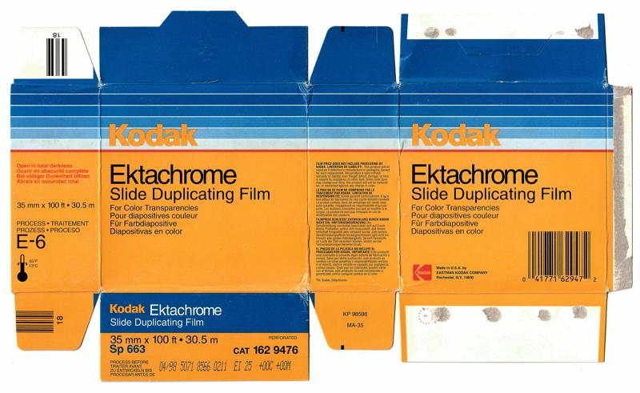
</a>

#### [1998] Konica KonicaColor VX 100 (ref: 8350)

```
Format: 35mm         |  Process : C-41    
ISO   : 100          |  Expiry  : 1998-06 
Type  : Single Pack  |  Quantity: 24exp   
Added : 2025-08-30   |  Author  : dekuNukem
UUID  : daee9d73b6d14f768e414b87260c8350
```

<a href="./archive/00269_000.jpg" target="_blank">
	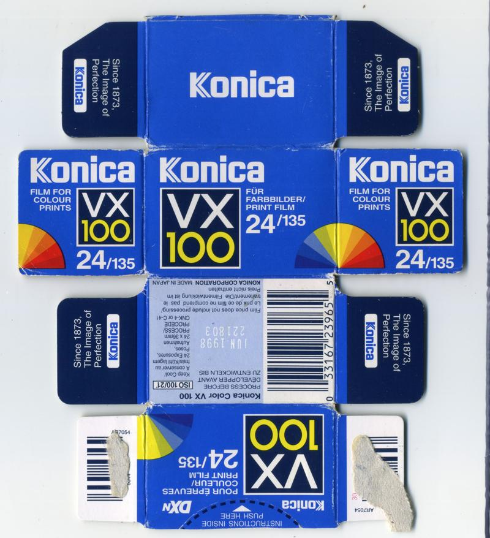
</a>


`UUID: 2e481382168c430c8a923e5a2aa60e05`↓

<a href="./archive/00269_001.jpg" target="_blank">
	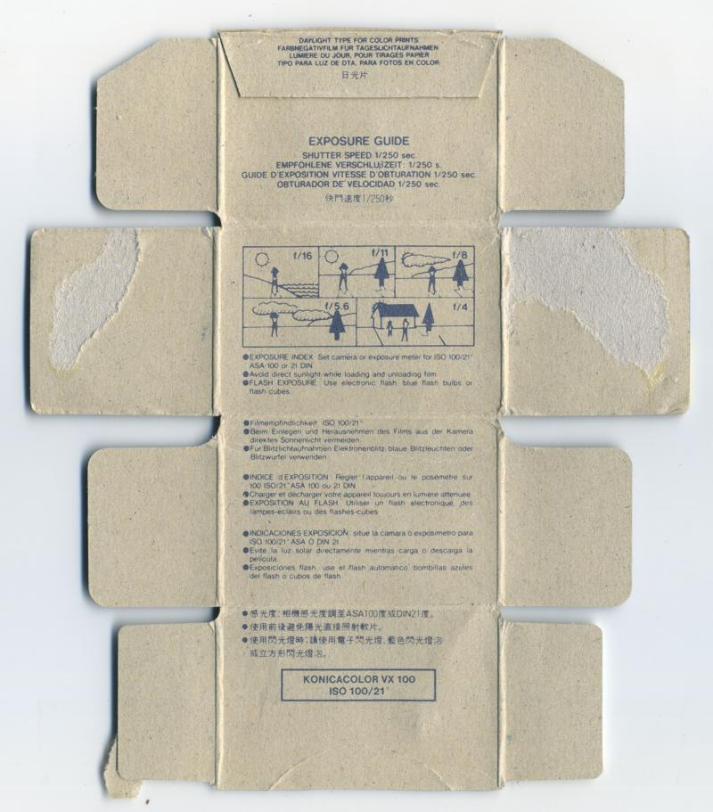
</a>

#### [1998] Polaroid Polacolor 679 (ref: 625c)

```
Format: Pack Film    |  Process : Instant 
ISO   : 100          |  Expiry  : 1998-06 
Type  : Multi-Pack-2 |  Quantity: 10exp   
Added : 2025-08-03   |  Author  : dekuNukem
UUID  : 5844215c1fc74612b6118648b845625c
```

<a href="./archive/00161_000.jpg" target="_blank">
	
</a>


`UUID: cca2cc887edb44adb3b00fc9b6cb0dfd`↓

<a href="./archive/00161_001.jpg" target="_blank">
	
</a>


`UUID: 35d7f44a3b59463fabb387917d8f4808`↓

<a href="./archive/00161_002.jpg" target="_blank">
	
</a>


`UUID: cc5370f8b582460ebd5a9e27380bd3d2`↓

<a href="./archive/00161_003.jpg" target="_blank">
	
</a>

#### [1998] Fujifilm Fujicolor NPL 160 (ref: d10b)

```
Format: 120          |  Process : C-41    
ISO   : 160          |  Expiry  : 1998-07 
Type  : Single Pack  |  Quantity: N/A     
Added : 2025-01-05   |  Author  : dekuNukem
UUID  : ce40cc432d9e445b987fdd72fd88d10b
```

<a href="./archive/00034_000.jpg" target="_blank">
	
</a>


`UUID: 2e3f349e094b49d8ba6e026a98eb1455`↓

<a href="./archive/00034_001.jpg" target="_blank">
	
</a>


`UUID: 10efb3e22574460db3db552e55684945`↓

<a href="./archive/00034_002.jpg" target="_blank">
	
</a>

#### [1998] efke R100 (ref: 100d)

```
Format: 127          |  Process : BW      
ISO   : 100          |  Expiry  : 1998-09 
Type  : Single Pack  |  Quantity: N/A     
Added : 2025-10-21   |  Author  : dekuNukem
UUID  : fc90db41b94d486491177a8407f1100d
```

<a href="./archive/00435_000.jpg" target="_blank">
	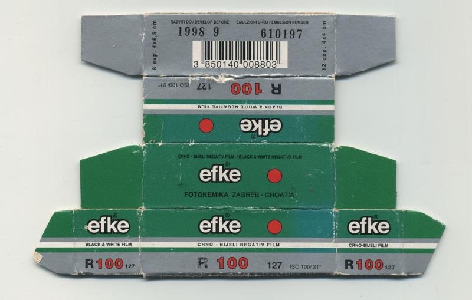
</a>


`UUID: 877813b4c98d406b8739c4310f0116a8`↓

<a href="./archive/00435_001.jpg" target="_blank">
	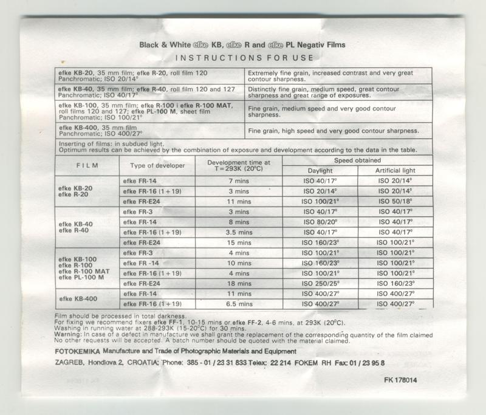
</a>


`UUID: fb3873078df9491491a4ff63374d80d2`↓

<a href="./archive/00435_002.jpg" target="_blank">
	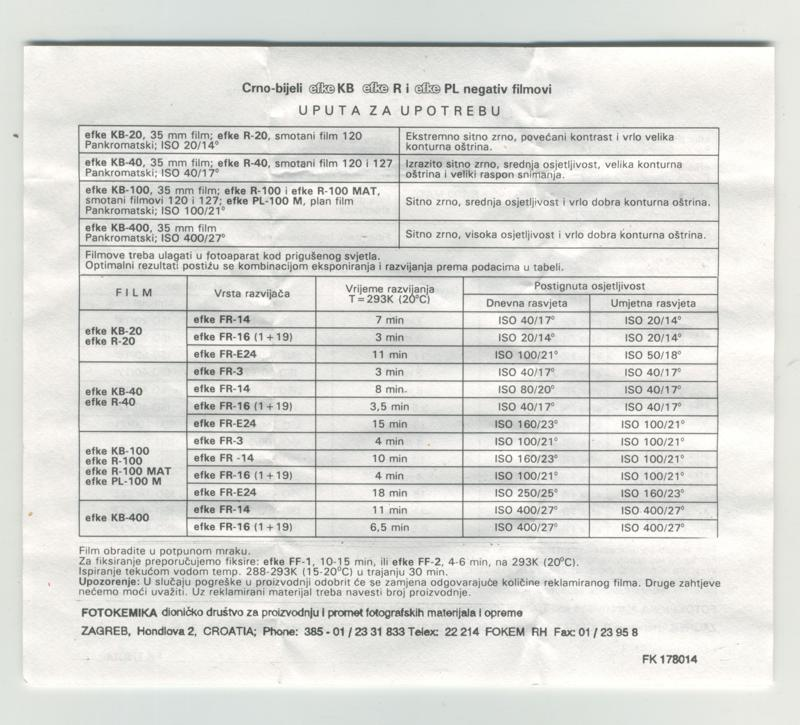
</a>

#### [1998] Kodak Ektachrome 64T (ref: 8f4f)

```
Format: 35mm         |  Process : E-6     
ISO   : 64           |  Expiry  : 1998-10 
Type  : Bulk Roll    |  Quantity: 100ft   
Added : 2025-08-14   |  Author  : Camera.Riley
UUID  : 25961b13fd6943a9b7dd77b2eba18f4f
```

<a href="./archive/00180_000.jpg" target="_blank">
	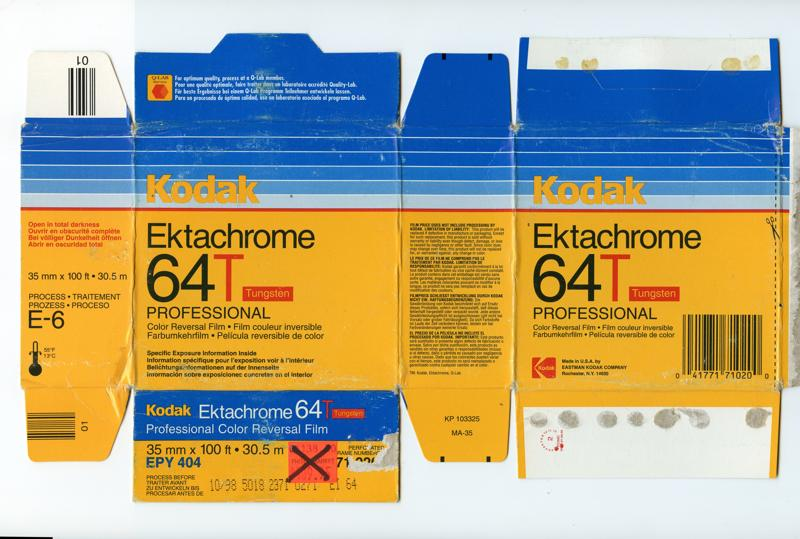
</a>


`UUID: 78441115e27d4fe8a442ce240ec160ef`↓

<a href="./archive/00180_001.jpg" target="_blank">
	
</a>

#### [1998] Kodak Vericolor 400 Plus (ref: bd88)

```
Format: 120          |  Process : C-41    
ISO   : 400          |  Expiry  : 1998-10 
Type  : Multi-Pack-5 |  Quantity: N/A     
Added : 2025-08-20   |  Author  : @photos.by.qi
UUID  : 8b882b8198ca4aeb8180b8743269bd88
```

<a href="./archive/00238_000.jpg" target="_blank">
	
</a>


`UUID: 07052f2a4fd8445aa344c21b79c06d9d`↓

<a href="./archive/00238_001.jpg" target="_blank">
	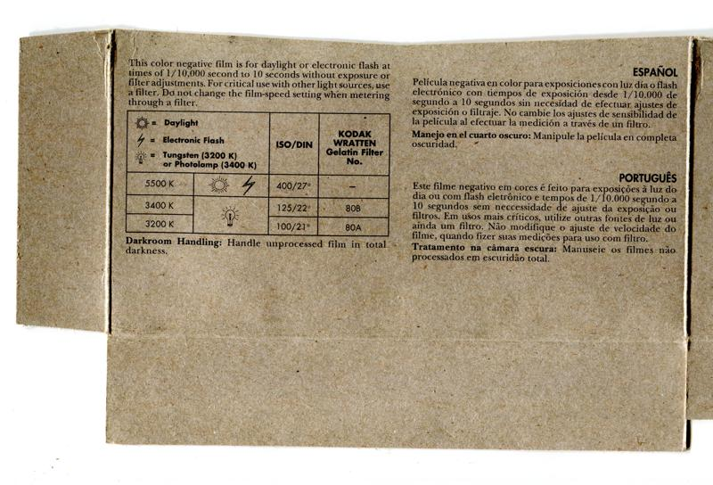
</a>


`UUID: 8a605cec4f594f37823796472cfb7005`↓

<a href="./archive/00238_002.jpg" target="_blank">
	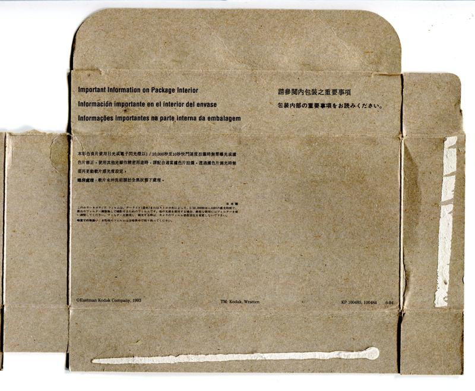
</a>


`UUID: cb3839d18fe44552bb710d82020a7743`↓

<a href="./archive/00238_003.jpg" target="_blank">
	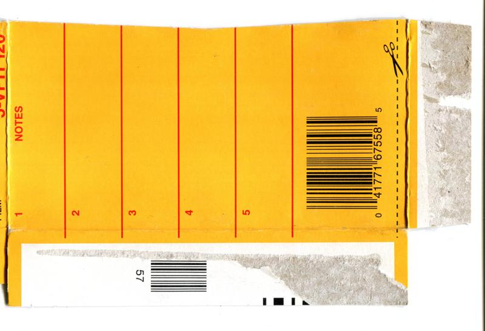
</a>

#### [1999] Fujifilm Fujichrome 64T (ref: 311b)

```
Format: 120          |  Process : E-6     
ISO   : 64           |  Expiry  : 1999-04 
Type  : Multi-Pack-5 |  Quantity: N/A     
Added : 2025-09-17   |  Author  : @ellafridalindblom
UUID  : 5bfbb5140c7943fcb52950d4db4c311b
```

<a href="./archive/00339_000.jpg" target="_blank">
	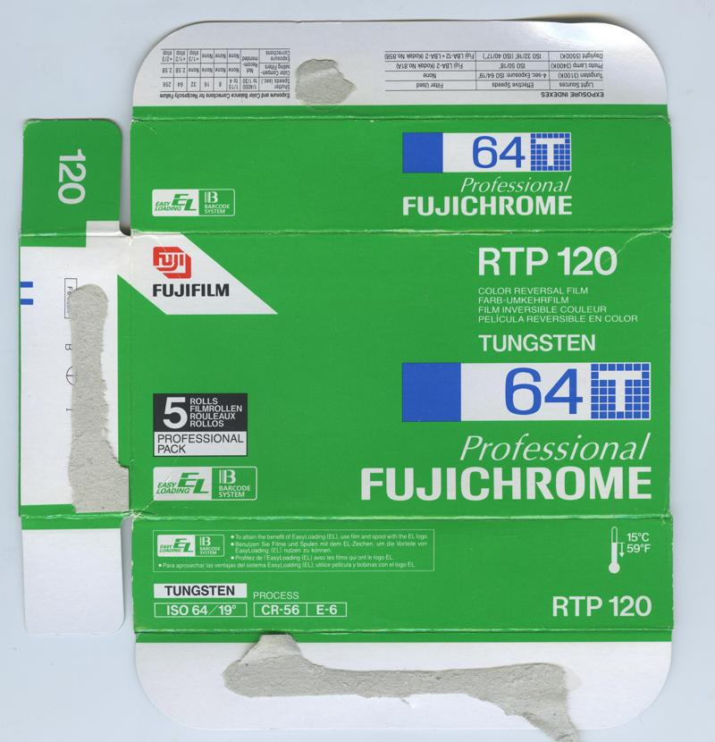
</a>


`UUID: be884dd0a48d4d35b510d4bfbf61bcd5`↓

<a href="./archive/00339_001.jpg" target="_blank">
	
</a>


`UUID: 0532cf90dadd4f8a9d5b2e6654989bbb`↓

<a href="./archive/00339_002.jpg" target="_blank">
	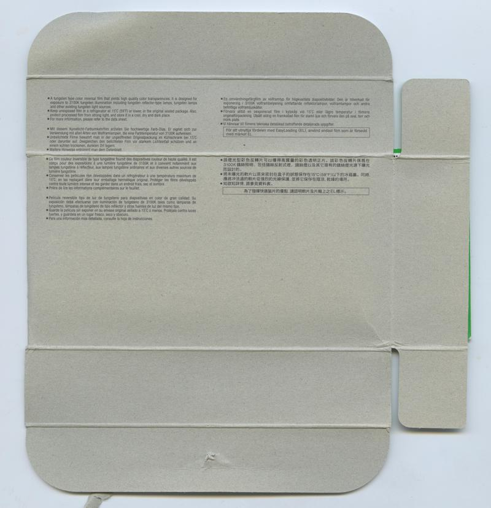
</a>

#### [1999] Kodak Gold (ref: 2f8d)

```
Format: 35mm         |  Process : C-41    
ISO   : 100          |  Expiry  : 1999-05 
Type  : Single Pack  |  Quantity: 36exp   
Added : 2025-07-31   |  Author  : fine-seat
UUID  : c56f944bf87d40dcac75cf41aeb82f8d
```

<a href="./archive/00149_000.jpg" target="_blank">
	
</a>

#### [1999] Kodak Ektachrome Slide Duplicating Film (ref: d53a)

```
Format: 35mm         |  Process : E-6     
ISO   : Unknown      |  Expiry  : 1999-12 
Type  : Single Pack  |  Quantity: 36exp   
Added : 2025-08-19   |  Author  : @ellafridalindblom
UUID  : 59aa1c52cf434a60976debe684a3d53a
```

<a href="./archive/00203_000.jpg" target="_blank">
	
</a>


`UUID: a15217b7a9c34d25a71276e952a8dce0`↓

<a href="./archive/00203_001.jpg" target="_blank">
	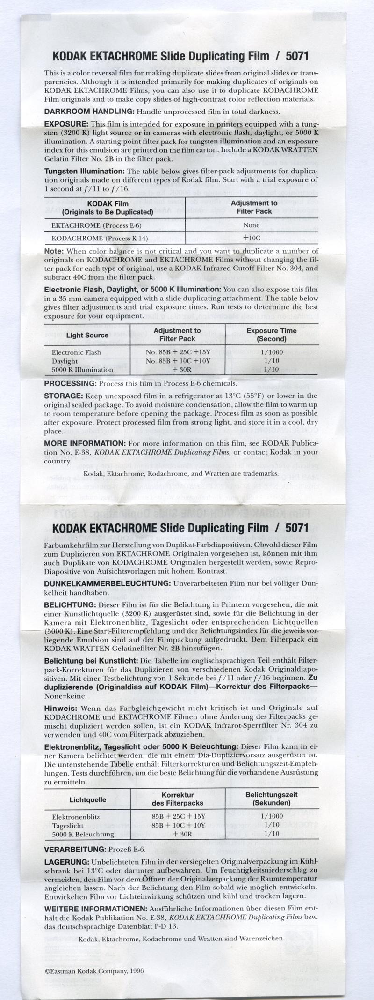
</a>


`UUID: 70ffb21210374c97a9fa3b819e9b3a1a`↓

<a href="./archive/00203_002.jpg" target="_blank">
	
</a>

#### [2000] Konica Infrared 750nm (ref: 2d93)

```
Format: 120          |  Process : BW      
ISO   : 32           |  Expiry  : 2000-03 
Type  : Single Pack  |  Quantity: N/A     
Added : 2025-01-05   |  Author  : dekuNukem
UUID  : 63b2857f2df549878446cc1963362d93
```

<a href="./archive/00036_000.jpg" target="_blank">
	
</a>

#### [2000] Agfa AgfaColor Optima 200 (ref: 393d)

```
Format: 120          |  Process : C-41    
ISO   : 200          |  Expiry  : 2000-06 
Type  : Single Pack  |  Quantity: N/A     
Added : 2025-09-05   |  Author  : dekuNukem
UUID  : e8465f64b1f84f32900d92caa25e393d
```

<a href="./archive/00301_000.jpg" target="_blank">
	
</a>


`UUID: af2f0855d49849daa5b8fbde77c2ce5d`↓

<a href="./archive/00301_001.jpg" target="_blank">
	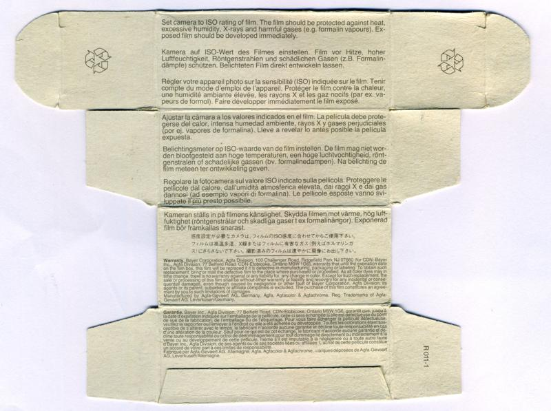
</a>

#### [2000] Kodak Rapid Process Copy Film (ref: e66e)

```
Format: 35mm         |  Process : BW      
ISO   : 0.06         |  Expiry  : 2000-06 
Type  : Single Pack  |  Quantity: 36exp   
Added : 2025-07-29   |  Author  : Nano_Burger
UUID  : 396a3645cb9a40a4b0a6dd2fd854e66e
```

<a href="./archive/00105_000.jpg" target="_blank">
	
</a>


`UUID: bab6cc70d0044171a1afcf33b6cb5556`↓

<a href="./archive/00105_001.jpg" target="_blank">
	
</a>


`UUID: fc2e102fecae4f2dbd04fd341fdb7afd`↓

<a href="./archive/00105_002.jpg" target="_blank">
	
</a>

#### [2000] Fujifilm Fujicolor Superia (ref: d1b7)

```
Format: 35mm         |  Process : C-41    
ISO   : 200          |  Expiry  : 2000-07 
Type  : Multi-Pack-3 |  Quantity: 24exp   
Added : 2025-07-31   |  Author  : Pelicram
UUID  : 2b50b3d82a7340ffbe9bff871793d1b7
```

<a href="./archive/00139_000.jpg" target="_blank">
	
</a>


`UUID: a193a13c20a24dada68357552593974f`↓

<a href="./archive/00139_001.jpg" target="_blank">
	
</a>

#### [2000] Kodak Ektacolor Pro Gold (ref: c3f8)

```
Format: 220          |  Process : C-41    
ISO   : 160          |  Expiry  : 2000-07 
Type  : Multi-Pack-5 |  Quantity: N/A     
Added : 2025-01-04   |  Author  : dekuNukem
UUID  : 7456456d09c844c8ab046abd9c17c3f8
```

<a href="./archive/00027_000.jpg" target="_blank">
	
</a>


`UUID: e9e4b4c649dc4b62aecc7bc004a1a6ff`↓

<a href="./archive/00027_001.jpg" target="_blank">
	
</a>


`UUID: c13296cf46f04c1dba4ef93110f3ca71`↓

<a href="./archive/00027_002.jpg" target="_blank">
	
</a>


`UUID: 53e024b9a272410888a6d44549f7ceb0`↓

<a href="./archive/00027_003.jpg" target="_blank">
	
</a>

#### [2000] Kodak Vericolor III (ref: 4b3e)

```
Format: 120          |  Process : C-41    
ISO   : 160          |  Expiry  : 2000-09 
Type  : Multi-Pack-5 |  Quantity: N/A     
Added : 2025-08-20   |  Author  : @photos.by.qi
UUID  : bcb6ab106d2941429eaf1088c1194b3e
```

<a href="./archive/00237_000.jpg" target="_blank">
	
</a>


`UUID: e4c84e87bd66459cbea1954dc32b5920`↓

<a href="./archive/00237_001.jpg" target="_blank">
	
</a>


`UUID: 6cbb4abac86e407d99055015b4719e95`↓

<a href="./archive/00237_002.jpg" target="_blank">
	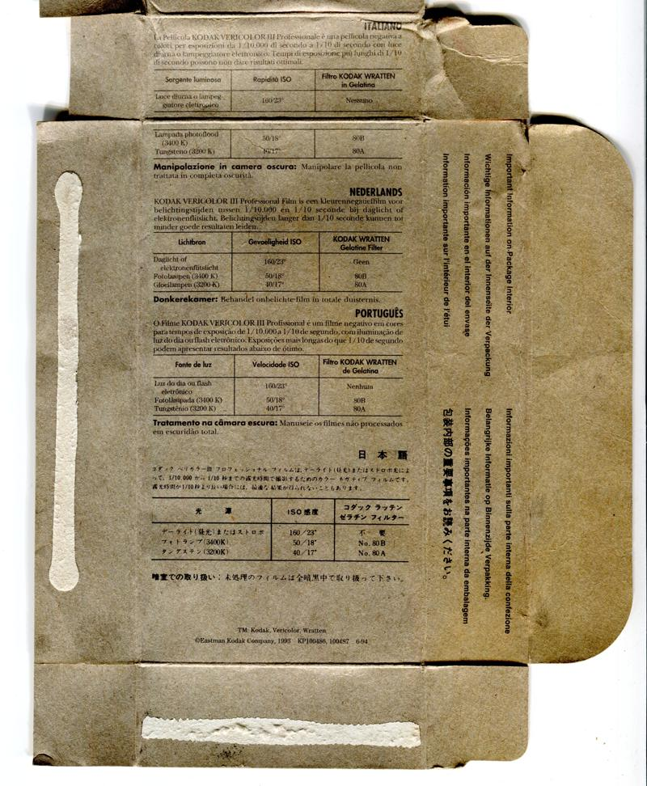
</a>


`UUID: ed6cc093b4e44b8b81bb19f6d1e6a4f2`↓

<a href="./archive/00237_003.jpg" target="_blank">
	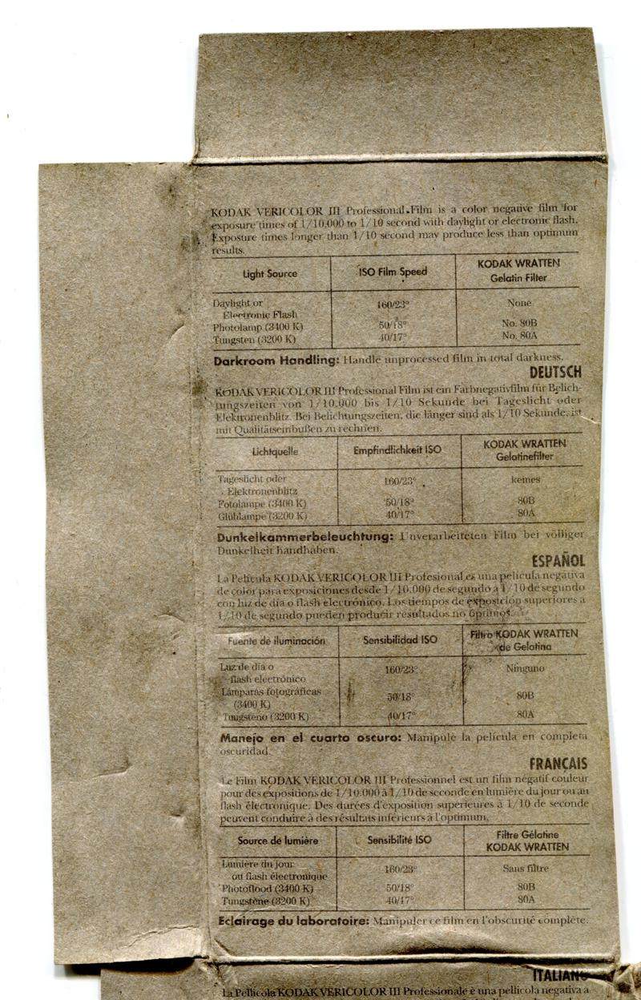
</a>

#### [2001] Fujifilm Fujichrome Velvia (ref: 3182)

```
Format: 35mm         |  Process : E-6     
ISO   : 50           |  Expiry  : 2001-01 
Type  : Single Pack  |  Quantity: 36exp   
Added : 2025-01-14   |  Author  : @ob.skura
UUID  : 9b9ee1c1c0e94d968674987799d33182
```

<a href="./archive/00044_000.jpg" target="_blank">
	
</a>


`UUID: 2e2e20a0b57542e4908ad9fc825e7e76`↓

<a href="./archive/00044_001.jpg" target="_blank">
	
</a>


`UUID: 03951cb49c8a44229aa4b5760744fc6f`↓

<a href="./archive/00044_002.jpg" target="_blank">
	
</a>

#### [2001] Kodak Gold Ultra 400 (ref: 1358)

```
Format: 35mm         |  Process : C-41    
ISO   : 400          |  Expiry  : 2001-01 
Type  : Multi-Pack-2 |  Quantity: 24exp   
Added : 2025-07-28   |  Author  : lilyu.xyz
UUID  : c2dc7711cd38434da5cfea8750f61358
```

<a href="./archive/00094_000.jpg" target="_blank">
	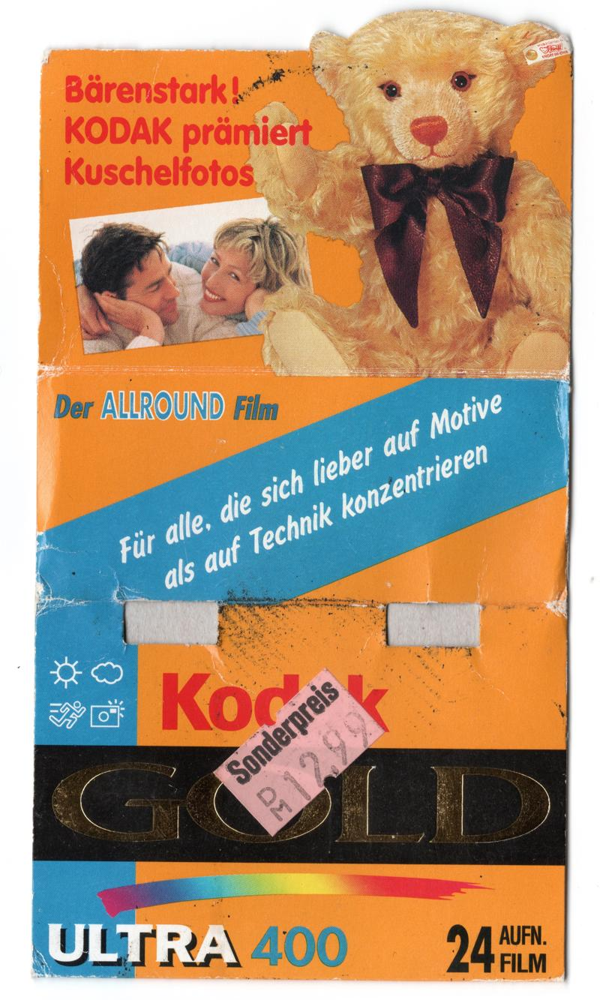
</a>


`UUID: 1501f7eec7f34d3788b6c7b94a4134df`↓

<a href="./archive/00094_001.jpg" target="_blank">
	
</a>

#### [2001] Agfa AgfaColor HDC Plus (ref: d22b)

```
Format: 110          |  Process : C-41    
ISO   : 200          |  Expiry  : 2001-07 
Type  : Single Pack  |  Quantity: 24exp   
Added : 2025-09-13   |  Author  : dekuNukem
UUID  : 9cec7faf26254e72bfb79611ea6ed22b
```

<a href="./archive/00328_000.jpg" target="_blank">
	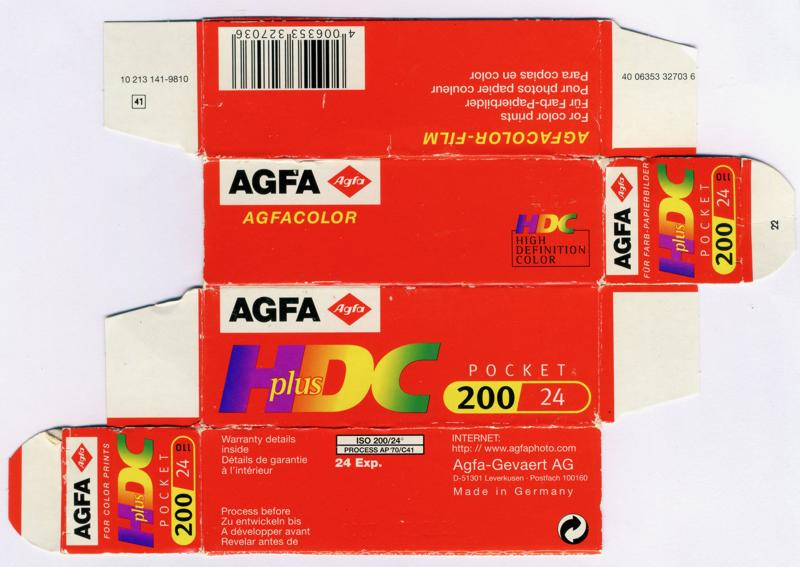
</a>

#### [2001] Kodak Elite Chrome (ref: 523c)

```
Format: 35mm         |  Process : E-6     
ISO   : 100          |  Expiry  : 2001-08 
Type  : Single Pack  |  Quantity: 36exp   
Added : 2025-01-14   |  Author  : @ob.skura
UUID  : e0b3ec957ade47a99d5cd5abe2a4523c
```

<a href="./archive/00042_000.jpg" target="_blank">
	
</a>

#### [2001] Agfa AgfaColor ULTRA 50 (ref: 4faa)

```
Format: 35mm         |  Process : C-41    
ISO   : 50           |  Expiry  : 2001-10 
Type  : Single Pack  |  Quantity: 36exp   
Added : 2025-01-04   |  Author  : dekuNukem
UUID  : d10e846ba5154f1d940ed7009a904faa
```

<a href="./archive/00010_000.jpg" target="_blank">
	
</a>


`UUID: 8594d11f816c45b6a18dd122f8e38fc0`↓

<a href="./archive/00010_001.jpg" target="_blank">
	
</a>

#### [2001] Fujifilm Fujichrome 64T Type II Professional (ref: 74a1)

```
Format: 35mm         |  Process : E-6     
ISO   : 64           |  Expiry  : 2001-10 
Type  : Bulk Roll    |  Quantity: 100ft   
Added : 2025-08-14   |  Author  : Camera.Riley
UUID  : f3d8be37c34a4055823836987a0a74a1
```

<a href="./archive/00171_000.jpg" target="_blank">
	
</a>

#### [2001] Kodak Gold (ref: ea58)

```
Format: 35mm         |  Process : C-41    
ISO   : 100          |  Expiry  : 2001-10 
Type  : Multi-Pack-3 |  Quantity: 36exp   
Added : 2025-07-28   |  Author  : lilyu.xyz
UUID  : e45118f7bd5e4ae682e5747a81f0ea58
```

<a href="./archive/00095_000.jpg" target="_blank">
	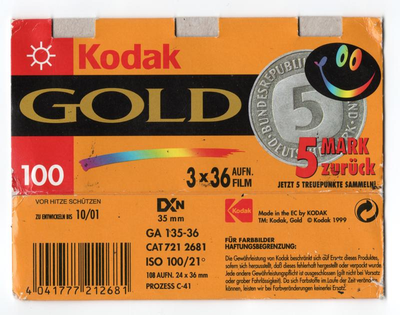
</a>


`UUID: 86ebec2c1a1d41359d84654d24dbac69`↓

<a href="./archive/00095_001.jpg" target="_blank">
	
</a>

#### [2001] Kodak Ektachrome 400X (ref: 5b82)

```
Format: 120          |  Process : E-6     
ISO   : 400          |  Expiry  : 2001-11 
Type  : Multi-Pack-5 |  Quantity: N/A     
Added : 2025-09-01   |  Author  : dekuNukem
UUID  : 877e28be6f7240898a95616c39a95b82
```

<a href="./archive/00278_000.jpg" target="_blank">
	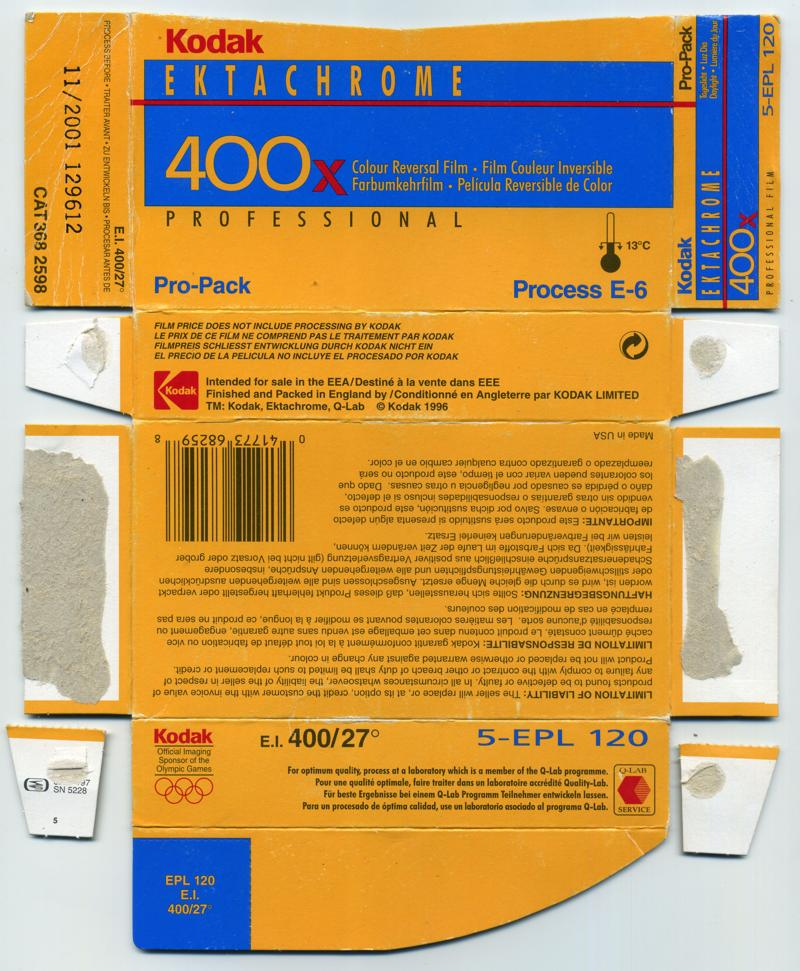
</a>


`UUID: b17891fbab094a19b7da26c8ac2b40b4`↓

<a href="./archive/00278_001.jpg" target="_blank">
	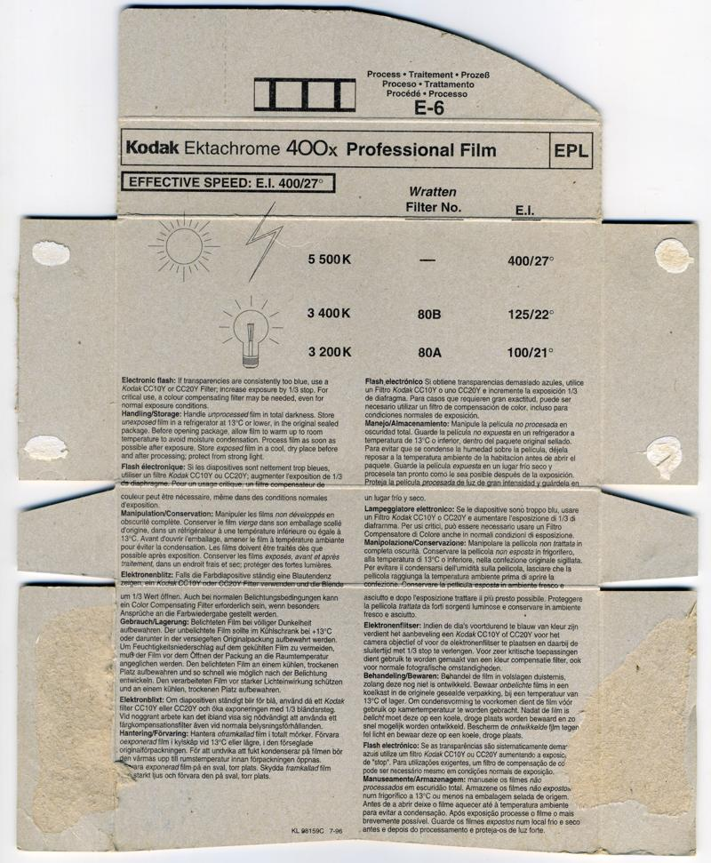
</a>

#### [2001] Kodak Värikuvafilmi (ref: f9ff)

```
Format: 35mm         |  Process : C-41    
ISO   : 200          |  Expiry  : 2001-12 
Type  : Multi-Pack-2 |  Quantity: 24exp   
Added : 2025-07-31   |  Author  : Pelicram
UUID  : b8795d19697a453c8f27fde773eaf9ff
```

<a href="./archive/00146_000.jpg" target="_blank">
	
</a>

#### [2002] Kodak Gold (ref: bdd5)

```
Format: 110          |  Process : C-41    
ISO   : 400          |  Expiry  : 2002-01 
Type  : Single Pack  |  Quantity: 12exp   
Added : 2025-10-21   |  Author  : dekuNukem
UUID  : f4719f9b5e534dbba19c194da39abdd5
```

<a href="./archive/00431_000.jpg" target="_blank">
	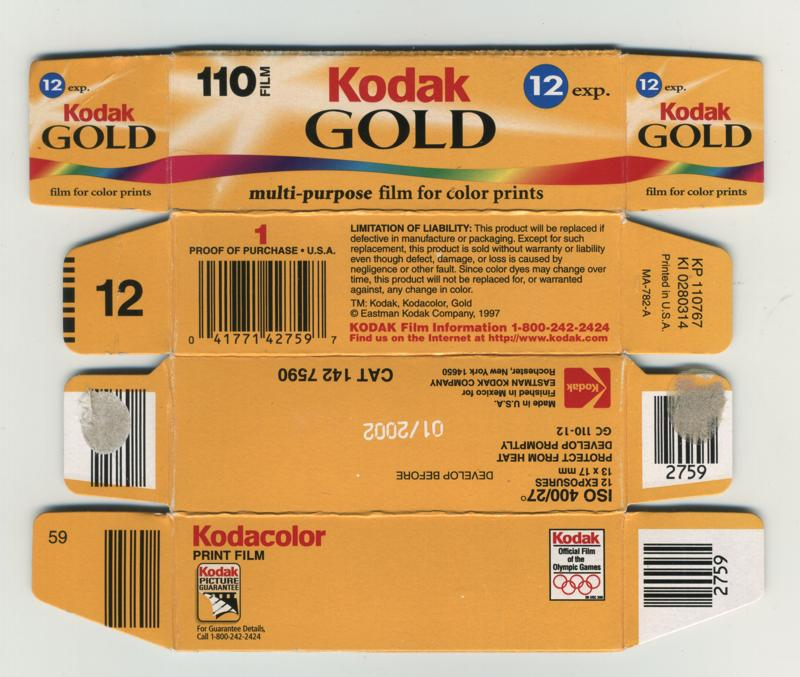
</a>

#### [2002] Polaroid High Definition (ref: deb6)

```
Format: 110          |  Process : C-41    
ISO   : 200          |  Expiry  : 2002-01 
Type  : Single Pack  |  Quantity: 24exp   
Added : 2025-09-13   |  Author  : dekuNukem
UUID  : 6c15a39618164543bfc2ef7f54addeb6
```

<a href="./archive/00327_000.jpg" target="_blank">
	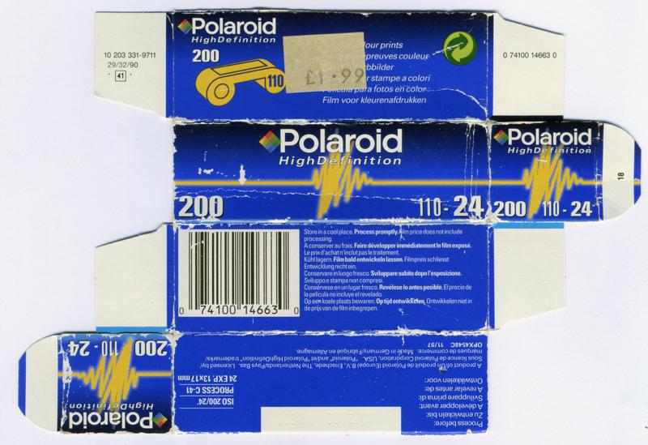
</a>

#### [2002] Agfa Optima II 400 (ref: fdf0)

```
Format: 120          |  Process : C-41    
ISO   : 400          |  Expiry  : 2002-02 
Type  : Single Pack  |  Quantity: N/A     
Added : 2025-09-05   |  Author  : dekuNukem
UUID  : 4ae0df57aeb24746a0a7854da202fdf0
```

<a href="./archive/00298_000.jpg" target="_blank">
	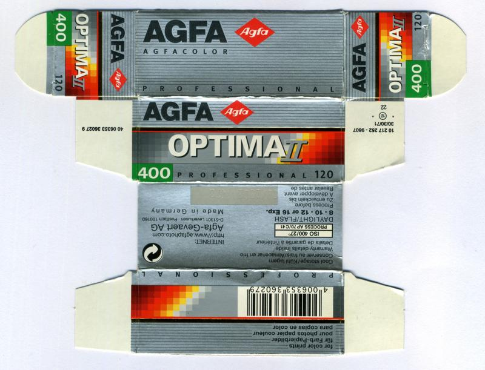
</a>


`UUID: 14bad93245df4dbdbcdaacff90eafb1a`↓

<a href="./archive/00298_001.jpg" target="_blank">
	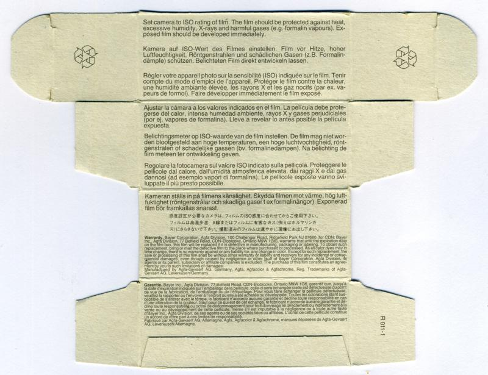
</a>

#### [2002] Fujifilm Fujicolor Superia (ref: 0683)

```
Format: 120          |  Process : C-41    
ISO   : 400          |  Expiry  : 2002-05 
Type  : Single Pack  |  Quantity: N/A     
Added : 2025-01-04   |  Author  : dekuNukem
UUID  : c3d9e51d22e241f69133be30d5a00683
```

<a href="./archive/00012_000.jpg" target="_blank">
	
</a>


`UUID: 5cd39510c35f4b9cbae3089311db118f`↓

<a href="./archive/00012_001.jpg" target="_blank">
	
</a>

#### [2002] Konica Sepia Professional (ref: 0b40)

```
Format: 120          |  Process : C-41    
ISO   : 400          |  Expiry  : 2002-05 
Type  : Single Pack  |  Quantity: N/A     
Added : 2025-09-17   |  Author  : @ellafridalindblom
UUID  : 83467c04e5254b4286b48e5a8e1b0b40
```

<a href="./archive/00340_000.jpg" target="_blank">
	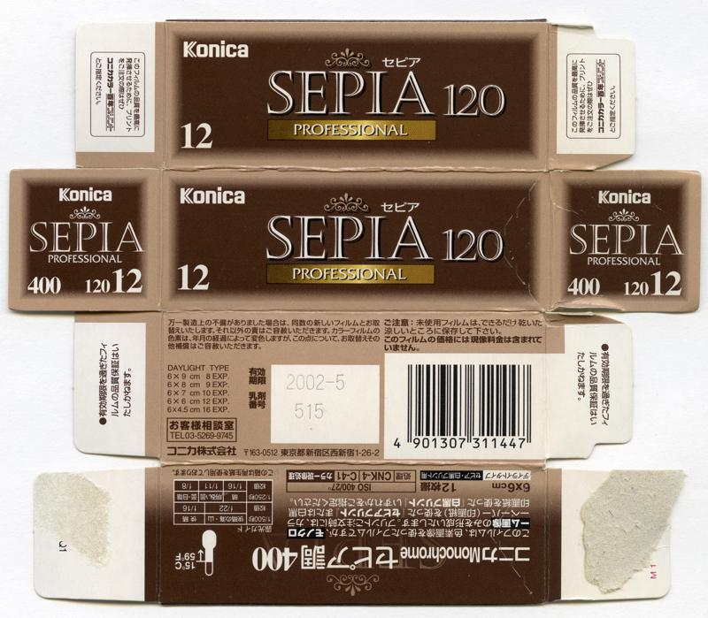
</a>

#### [2002] Kodak Ektachrome 100 Plus (ref: 5d9f)

```
Format: 35mm         |  Process : E-6     
ISO   : 100          |  Expiry  : 2002-08 
Type  : Single Pack  |  Quantity: 36exp   
Added : 2025-07-31   |  Author  : toader  
UUID  : b17b7b46926e49ae88a7b74904245d9f
```

<a href="./archive/00113_000.jpg" target="_blank">
	
</a>


`UUID: 1ac536af04e3459fa3389050a3c93bee`↓

<a href="./archive/00113_001.jpg" target="_blank">
	
</a>

#### [2002] Polaroid Spectra Film (ref: 7a94)

```
Format: Integral Film|  Process : Instant 
ISO   : 600          |  Expiry  : 2002-11 
Type  : Single Pack  |  Quantity: 10exp   
Added : 2025-09-28   |  Author  : @ellafridalindblom
UUID  : 2ec40bee5af2471cad92278123ba7a94
```

<a href="./archive/00352_000.jpg" target="_blank">
	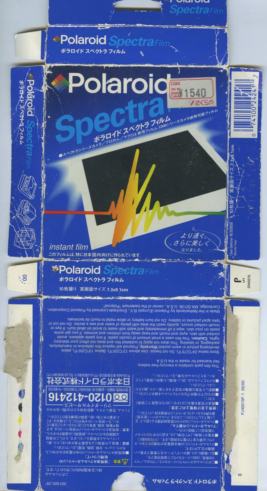
</a>

#### [2002] Kirkland Signature Color Print Film (ref: 0441)

```
Format: 35mm         |  Process : C-41    
ISO   : 200          |  Expiry  : 2002-12 
Type  : Single Pack  |  Quantity: 24exp   
Added : 2025-08-15   |  Author  : @ad.astra.per.aspera.1894
UUID  : 7f4a0fbd6be7494ab097f7f816700441
```

<a href="./archive/00184_000.jpg" target="_blank">
	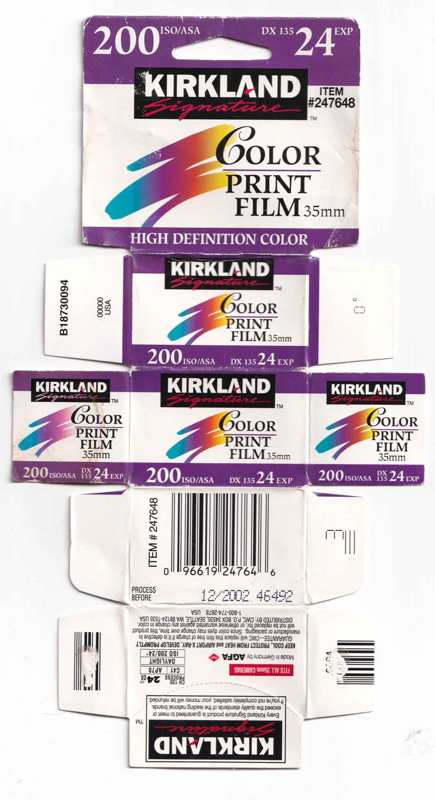
</a>

#### [2003] Konica KonicaColor VX 200 (ref: fe53)

```
Format: 35mm         |  Process : C-41    
ISO   : 200          |  Expiry  : 2003-03 
Type  : Multi-Pack-3 |  Quantity: 24exp   
Added : 2025-07-31   |  Author  : Pelicram
UUID  : dd3a6c347560484295ca09c86e3dfe53
```

<a href="./archive/00138_000.jpg" target="_blank">
	
</a>


`UUID: 9f45eb2e52134da79a732605103a6f39`↓

<a href="./archive/00138_001.jpg" target="_blank">
	
</a>

#### [2003] Fujifilm Fujicolor Superia X-TRA (ref: 713b)

```
Format: 35mm         |  Process : C-41    
ISO   : 400          |  Expiry  : 2003-04 
Type  : Single Pack  |  Quantity: 24exp   
Added : 2025-08-18   |  Author  : @recycling.film
UUID  : 89750d8a18fe4e238c76b97b4578713b
```

<a href="./archive/00197_000.jpg" target="_blank">
	
</a>


`UUID: 560832b2cfff4e60930fd3116f1ccffc`↓

<a href="./archive/00197_001.jpg" target="_blank">
	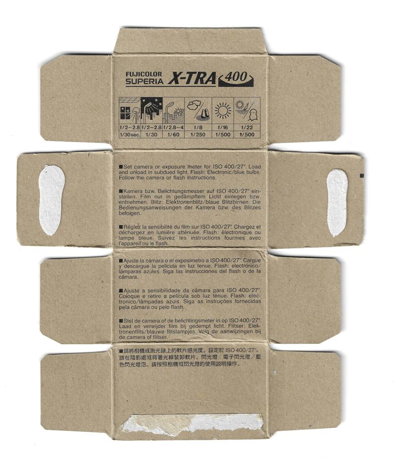
</a>

#### [2003] Agfa AgfaColor Vista (ref: 2f14)

```
Format: 110          |  Process : C-41    
ISO   : 200          |  Expiry  : 2003-05 
Type  : Single Pack  |  Quantity: 24exp   
Added : 2025-09-13   |  Author  : dekuNukem
UUID  : 81e8726a7d3b45beb1f1bd6c1cbc2f14
```

<a href="./archive/00329_000.jpg" target="_blank">
	
</a>

#### [2003] Fujifilm Fujichrome Provia 400F Professional (ref: 4591)

```
Format: 120          |  Process : E-6     
ISO   : 400          |  Expiry  : 2003-05 
Type  : Single Pack  |  Quantity: N/A     
Added : 2025-09-10   |  Author  : dekuNukem
UUID  : 41ebc0cc4fb746288adb198f58a84591
Notes : RHP III
```

<a href="./archive/00319_000.jpg" target="_blank">
	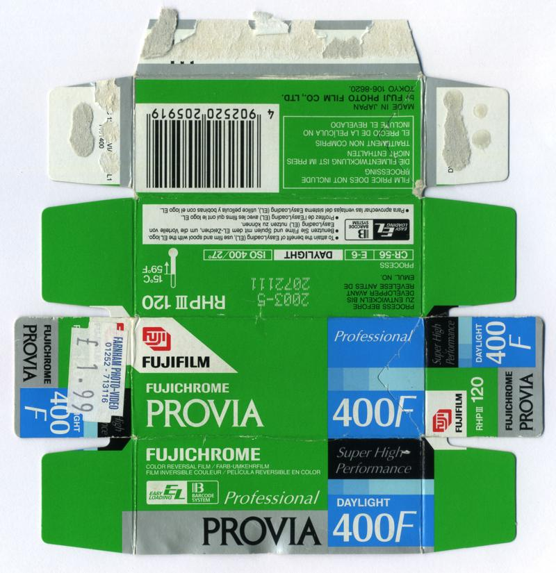
</a>


`UUID: af8da0bc734f498f80c6423b2d78667b`↓

<a href="./archive/00319_001.jpg" target="_blank">
	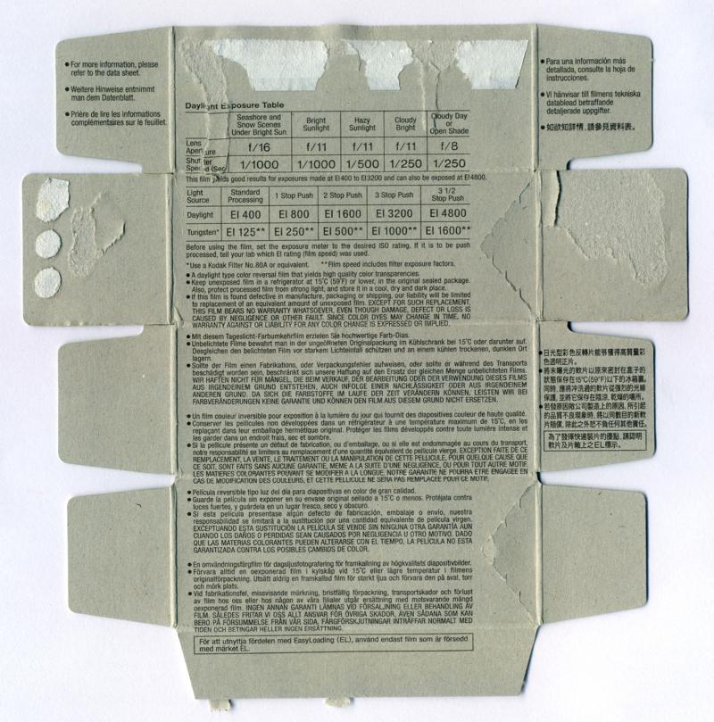
</a>

#### [2003] Fujifilm Fujicolor Super G (ref: 55ff)

```
Format: 120          |  Process : C-41    
ISO   : 100          |  Expiry  : 2003-05 
Type  : Single Pack  |  Quantity: N/A     
Added : 2025-08-20   |  Author  : @photos.by.qi
UUID  : 331bb2ddb04f4cd8ab637f79324e55ff
```

<a href="./archive/00218_000.jpg" target="_blank">
	
</a>

#### [2003] Konica Centuria 200 (ref: e155)

```
Format: 35mm         |  Process : C-41    
ISO   : 200          |  Expiry  : 2003-05 
Type  : Single Pack  |  Quantity: 24exp   
Added : 2025-08-30   |  Author  : dekuNukem
UUID  : 2f575e07049946ea981e1d53eb4ee155
```

<a href="./archive/00267_000.jpg" target="_blank">
	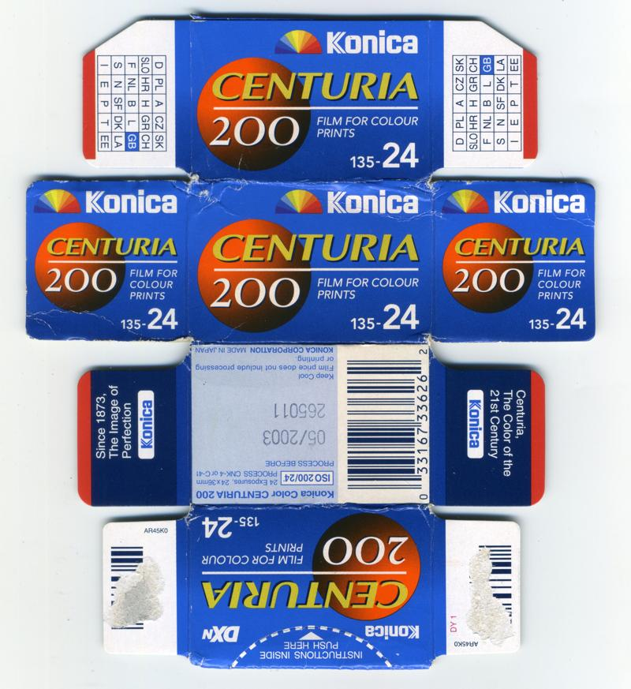
</a>


`UUID: 037c5e1f5185418c96aae0a01cf726a3`↓

<a href="./archive/00267_001.jpg" target="_blank">
	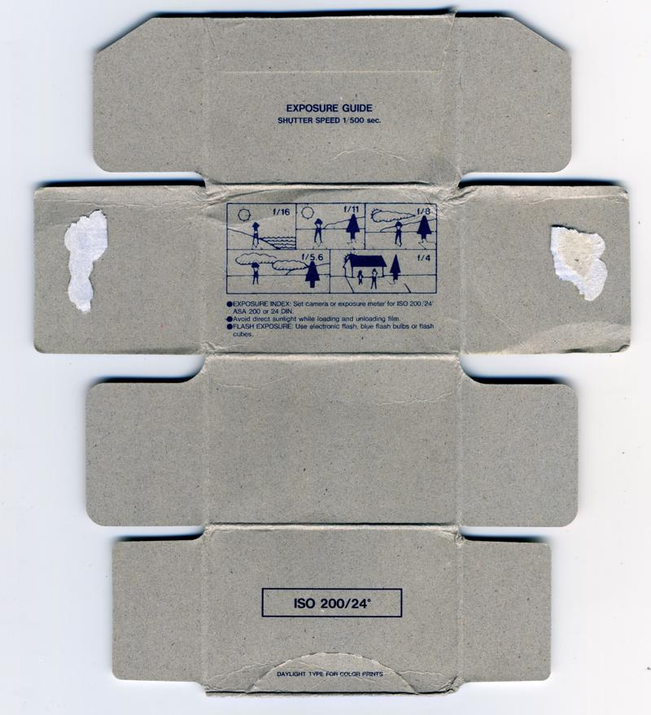
</a>

#### [2003] Fujifilm Fujicolor Pro400 (ref: 1b8d)

```
Format: 120          |  Process : C-41    
ISO   : 400          |  Expiry  : 2003-06 
Type  : Single Pack  |  Quantity: N/A     
Added : 2025-08-20   |  Author  : @photos.by.qi
UUID  : 0b59ba932e214f03a5069488e9651b8d
```

<a href="./archive/00221_000.jpg" target="_blank">
	
</a>

#### [2003] Club Color Natural Color System (ref: 813a)

```
Format: 35mm         |  Process : C-41    
ISO   : 800          |  Expiry  : 2003-07 
Type  : Single Pack  |  Quantity: 24exp   
Added : 2025-09-28   |  Author  : lemoniter
UUID  : 88f5c251c21546fba06cd2943e55813a
```

<a href="./archive/00356_000.jpg" target="_blank">
	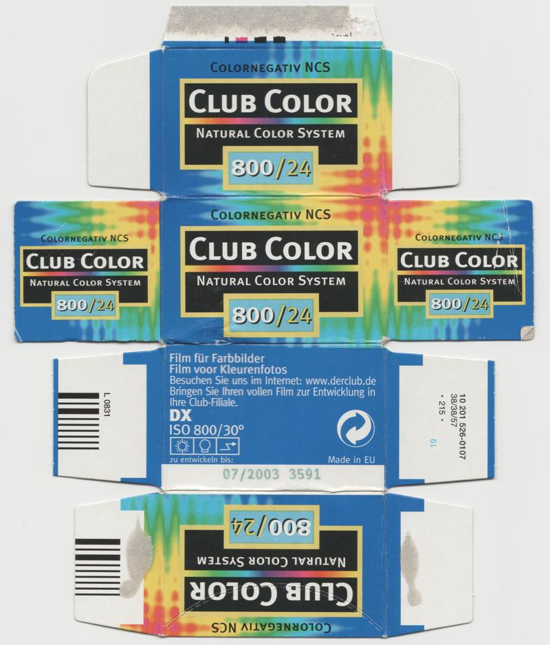
</a>

#### [2003] Fujifilm Fujicolor Superia (ref: 9272)

```
Format: 35mm         |  Process : C-41    
ISO   : 200          |  Expiry  : 2003-07 
Type  : Multi-Pack-2 |  Quantity: 36exp   
Added : 2025-08-20   |  Author  : @photos.by.qi
UUID  : 2acd2ce4aefb44b4a4c72b130edb9272
```

<a href="./archive/00229_000.jpg" target="_blank">
	
</a>

#### [2003] Kodak Advantix Ultra (ref: 030a)

```
Format: APS          |  Process : C-41    
ISO   : 200          |  Expiry  : 2003-07 
Type  : Single Pack  |  Quantity: 40exp   
Added : 2025-09-10   |  Author  : Aoi Yuki
UUID  : 59358e7096174d7f926ed0aab9fd030a
```

<a href="./archive/00320_000.jpg" target="_blank">
	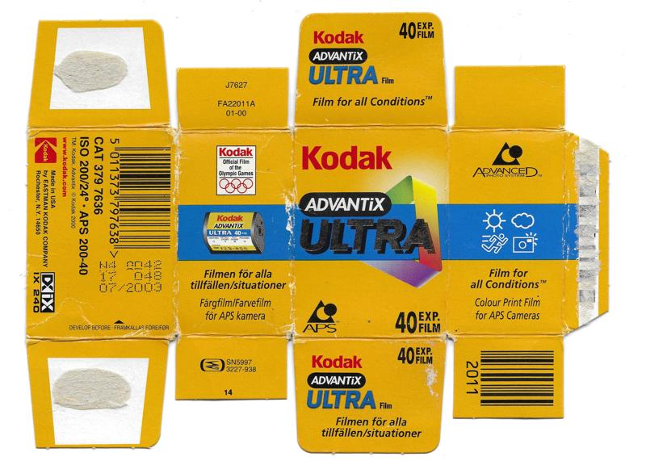
</a>

#### [2003] Fujifilm Fujicolor NPS 160 (ref: 5e85)

```
Format: 35mm         |  Process : C-41    
ISO   : 160          |  Expiry  : 2003-08 
Type  : Single Pack  |  Quantity: 36exp   
Added : 2025-02-04   |  Author  : b0baspace
UUID  : 576142521c2f4fe5abc387032bcc5e85
```

<a href="./archive/00053_000.jpg" target="_blank">
	
</a>


`UUID: a11cf7e8abea41a8854da816157269c4`↓

<a href="./archive/00053_001.jpg" target="_blank">
	
</a>

#### [2003] Jessops CS100 (ref: 4288)

```
Format: 35mm         |  Process : E-6     
ISO   : 100          |  Expiry  : 2003-09 
Type  : Single Pack  |  Quantity: 36exp   
Added : 2025-09-13   |  Author  : GreatGizmo74
UUID  : 6e2123fd1134408789902c16b3764288
```

<a href="./archive/00334_000.jpg" target="_blank">
	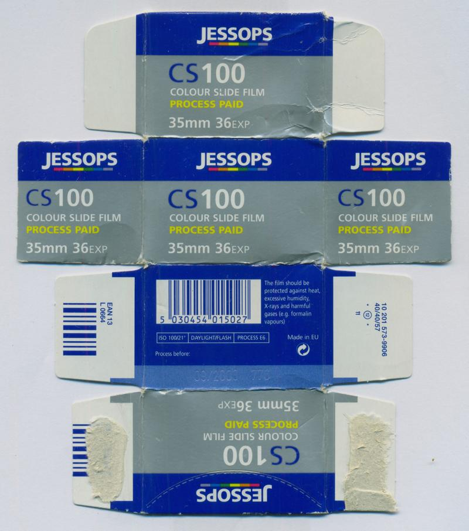
</a>


`UUID: 488ad47450f348a898c909433e87172f`↓

<a href="./archive/00334_001.jpg" target="_blank">
	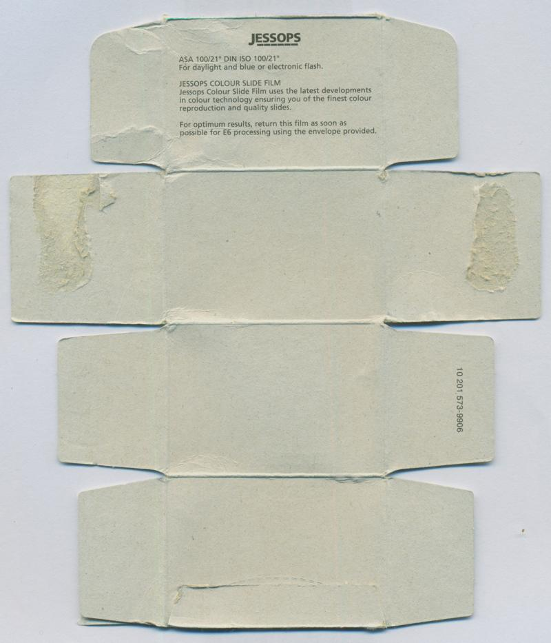
</a>


`UUID: 460cbe6f0af64e2d9a648dc1795c4605`↓

<a href="./archive/00334_002.jpg" target="_blank">
	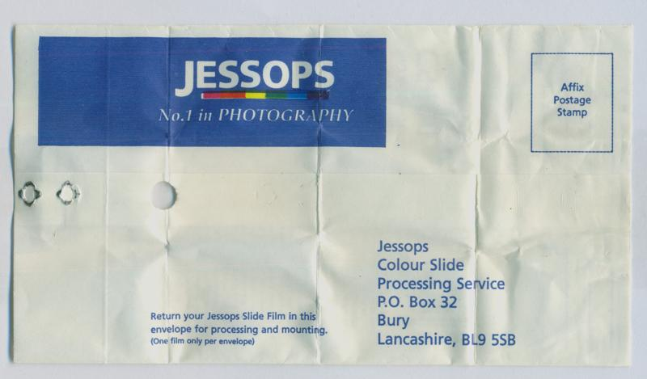
</a>


`UUID: c41e2cc23bee49768e995b15393af204`↓

<a href="./archive/00334_003.jpg" target="_blank">
	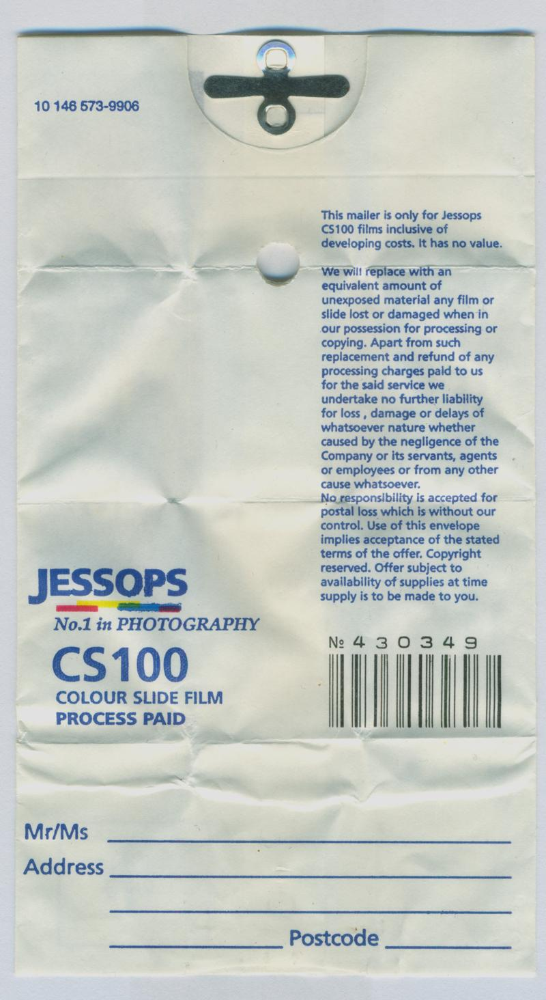
</a>

#### [2003] Agfa AgfaColor Vista (ref: d3af)

```
Format: 35mm         |  Process : C-41    
ISO   : 200          |  Expiry  : 2003-12 
Type  : Single Pack  |  Quantity: 24exp   
Added : 2025-01-04   |  Author  : dekuNukem
UUID  : f1e50745927f4b7cb16af36fd30dd3af
```

<a href="./archive/00014_000.jpg" target="_blank">
	
</a>


`UUID: 300a430fc19f4eeeb4892e58d3c3cd56`↓

<a href="./archive/00014_001.jpg" target="_blank">
	
</a>

#### [2004] Fujifilm Neopan 400 (ref: c088)

```
Format: 35mm         |  Process : BW      
ISO   : 400          |  Expiry  : 2004-01 
Type  : Single Pack  |  Quantity: 36exp   
Added : 2025-09-03   |  Author  : @ellafridalindblom
UUID  : 93700c4c5c904b40b9c311614ebac088
```

<a href="./archive/00289_000.jpg" target="_blank">
	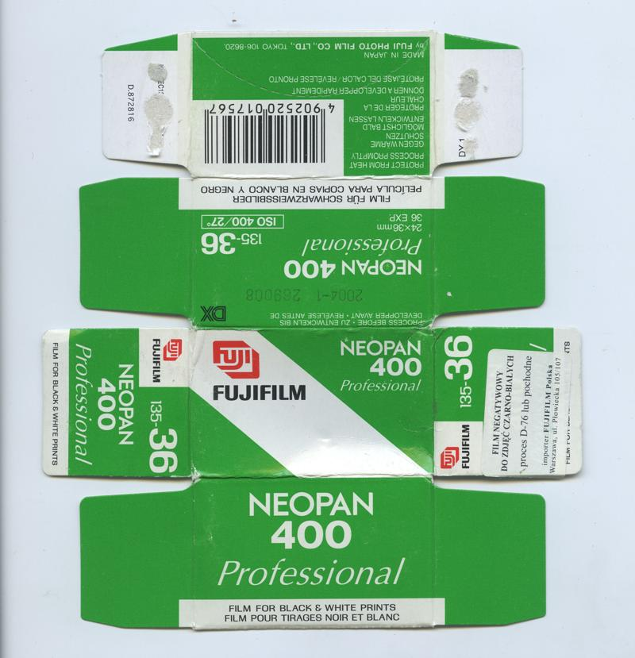
</a>


`UUID: 95ed7ff9054943edb1339bc4c06ee17e`↓

<a href="./archive/00289_001.jpg" target="_blank">
	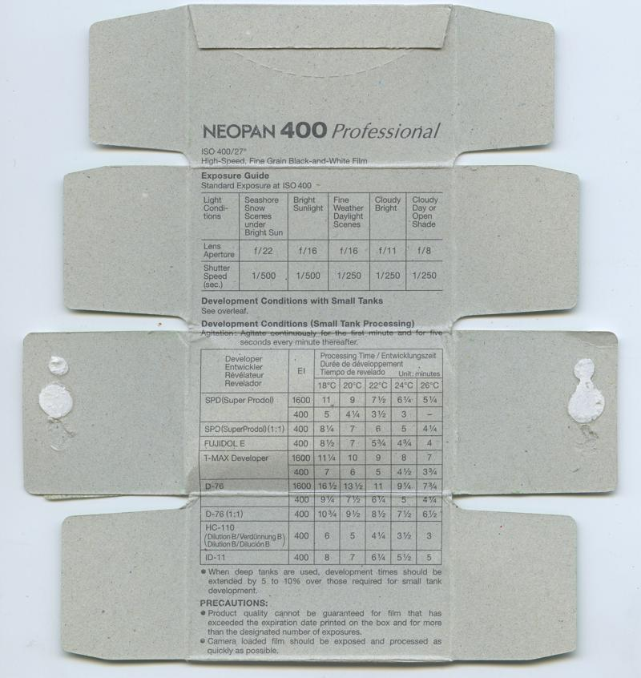
</a>

#### [2004] Fujifilm Fujichrome Sensia 200 (ref: 3a01)

```
Format: 35mm         |  Process : E-6     
ISO   : 200          |  Expiry  : 2004-05 
Type  : Single Pack  |  Quantity: 36exp   
Added : 2025-09-03   |  Author  : @ellafridalindblom
UUID  : 50c87b98fb1245c189e746556f6b3a01
```

<a href="./archive/00290_000.jpg" target="_blank">
	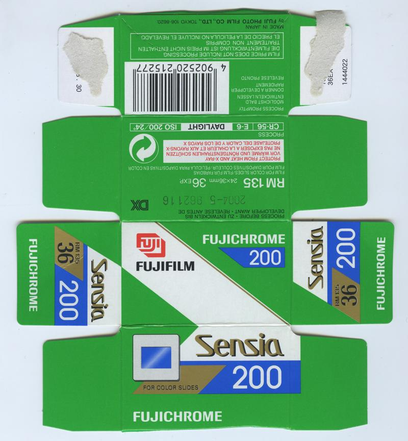
</a>


`UUID: 5ea770cbc81f42758f9e01cf960f01b3`↓

<a href="./archive/00290_001.jpg" target="_blank">
	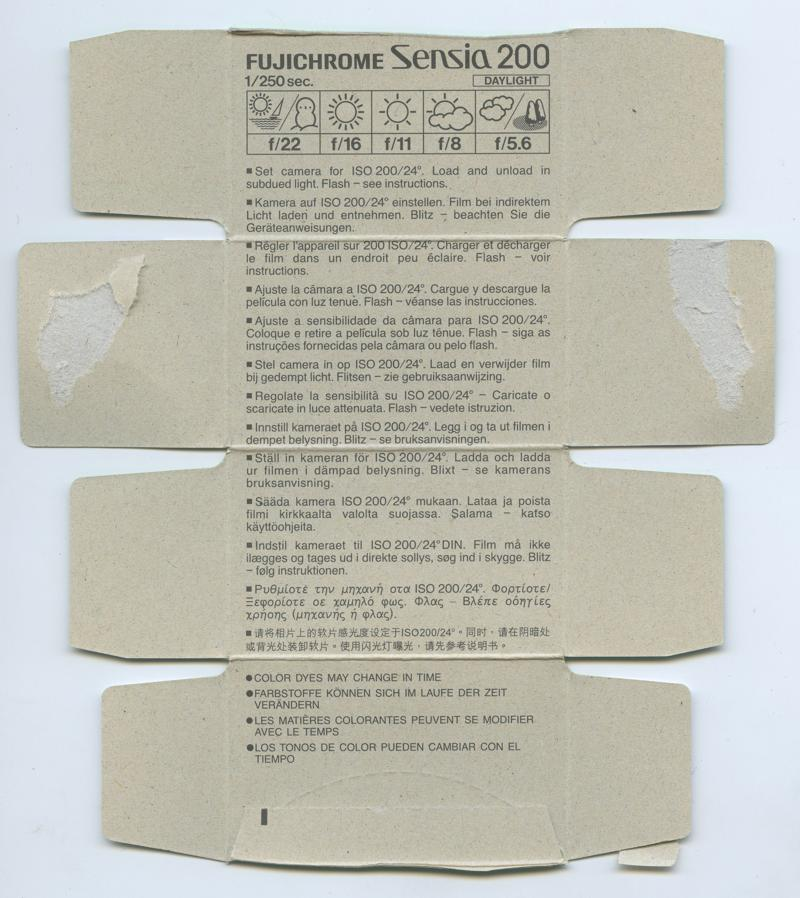
</a>

#### [2004] Fujifilm Fujichrome Sensia 100 (ref: a859)

```
Format: 35mm         |  Process : C-41    
ISO   : 100          |  Expiry  : 2004-06 
Type  : Multi-Pack-3 |  Quantity: 36exp   
Added : 2025-09-03   |  Author  : @ellafridalindblom
UUID  : ae2418a073074872aa2c46534649a859
```

<a href="./archive/00292_000.jpg" target="_blank">
	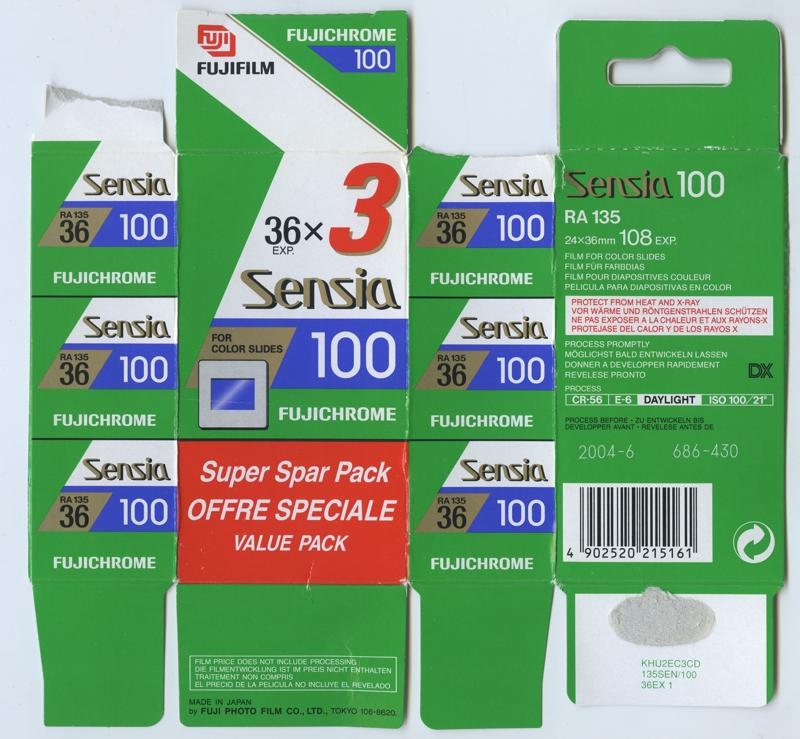
</a>

#### [2004] Fujifilm Fujicolor Superia X-TRA (ref: 7980)

```
Format: 120          |  Process : C-41    
ISO   : 400          |  Expiry  : 2004-06 
Type  : Single Pack  |  Quantity: N/A     
Added : 2025-08-19   |  Author  : @ellafridalindblom
UUID  : 9e774f36e4d34b3c81a30a5b44da7980
```

<a href="./archive/00209_000.jpg" target="_blank">
	
</a>


`UUID: 434f763fea0d4c4c9dc5aeb2eb10e8aa`↓

<a href="./archive/00209_001.jpg" target="_blank">
	
</a>

#### [2004] Kodak Advantix Ultra Max (ref: 1ca2)

```
Format: APS          |  Process : C-41    
ISO   : 400          |  Expiry  : 2004-07 
Type  : Single Pack  |  Quantity: 25exp   
Added : 2025-09-13   |  Author  : dekuNukem
UUID  : 5b9792793fd94c9a9f9f776fe34e1ca2
```

<a href="./archive/00326_000.jpg" target="_blank">
	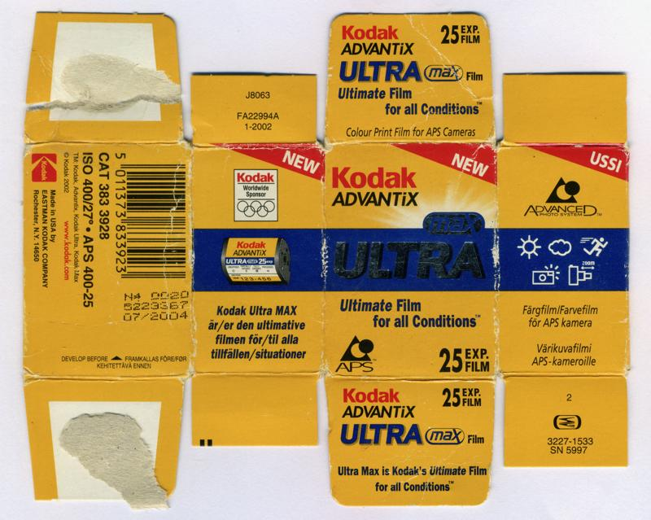
</a>

#### [2004] Kodak Black & White + (ref: 2ff3)

```
Format: 35mm         |  Process : C-41    
ISO   : 400          |  Expiry  : 2004-07 
Type  : Single Pack  |  Quantity: 24exp   
Added : 2025-08-16   |  Author  : Kraksen 
UUID  : 8ae6d75c042c48318fa711a412b72ff3
```

<a href="./archive/00189_000.jpg" target="_blank">
	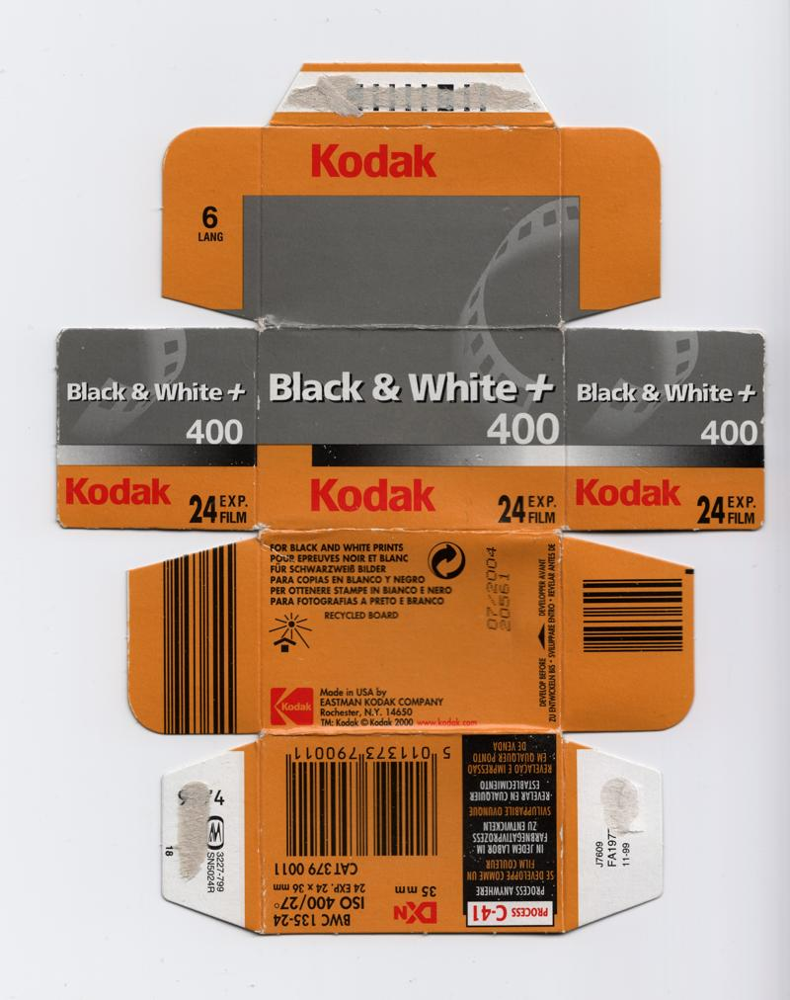
</a>

#### [2004] Lloyds Pharmacy Colour Film (ref: 074c)

```
Format: 35mm         |  Process : C-41    
ISO   : 200          |  Expiry  : 2004-07 
Type  : Single Pack  |  Quantity: 36exp   
Added : 2025-08-30   |  Author  : dekuNukem
UUID  : c4d16975eee44b9185b17cf0c0e4074c
```

<a href="./archive/00266_000.jpg" target="_blank">
	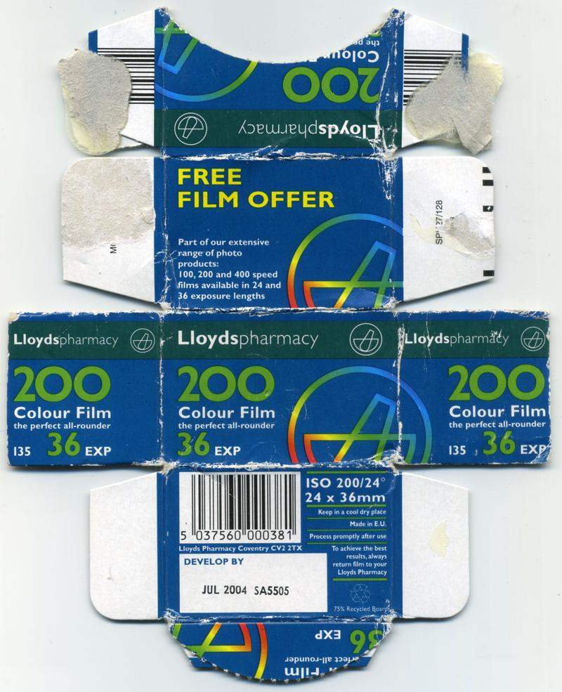
</a>

#### [2004] Kodak Portra 400UC (ref: 5b9e)

```
Format: 120          |  Process : C-41    
ISO   : 400          |  Expiry  : 2004-09 
Type  : Single Pack  |  Quantity: N/A     
Added : 2025-09-05   |  Author  : dekuNukem
UUID  : 87e948a92b624ef996d2e1da3a7b5b9e
Notes : sample pack, not for resale.
```

<a href="./archive/00299_000.jpg" target="_blank">
	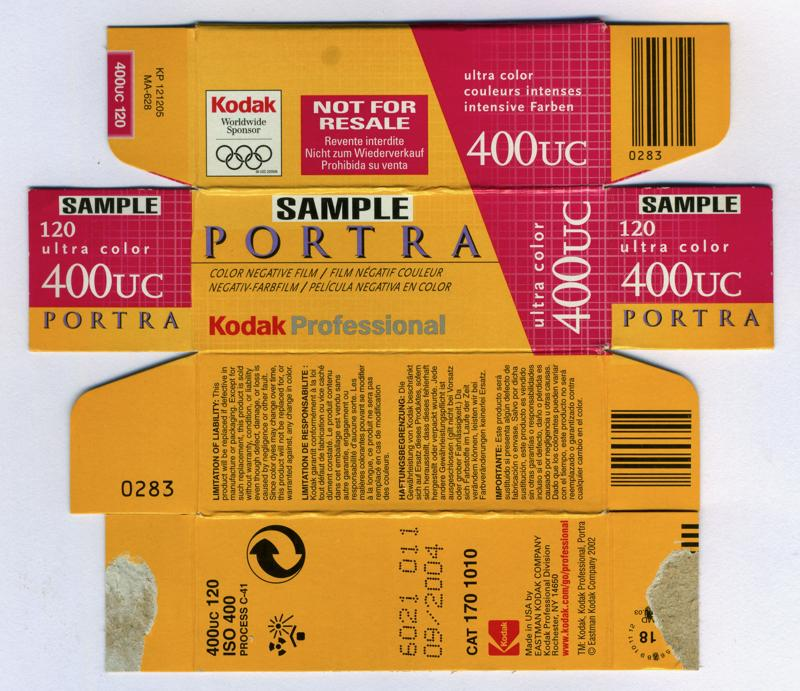
</a>


`UUID: 4d0264c90bd7476099107ddfac1ec67f`↓

<a href="./archive/00299_001.jpg" target="_blank">
	
</a>

#### [2004] Kodak Portra 400VC (ref: b67b)

```
Format: 120          |  Process : C-41    
ISO   : 400          |  Expiry  : 2004-12 
Type  : Multi-Pack-5 |  Quantity: N/A     
Added : 2025-08-20   |  Author  : @photos.by.qi
UUID  : 348bccb01edc4a6ea9a2f5c4d88cb67b
```

<a href="./archive/00243_000.jpg" target="_blank">
	
</a>


`UUID: 154cd3f3c85944ab87c33eaad232c3b6`↓

<a href="./archive/00243_001.jpg" target="_blank">
	
</a>


`UUID: de89359102c54df797bee4229920e191`↓

<a href="./archive/00243_002.jpg" target="_blank">
	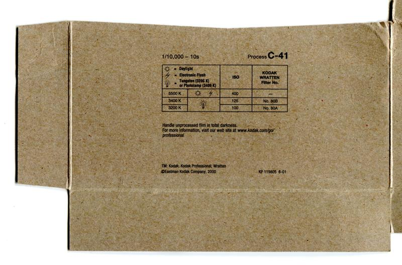
</a>


`UUID: c4a365adef6546cf945a04e9a6088a02`↓

<a href="./archive/00243_003.jpg" target="_blank">
	
</a>

#### [2005] Fujifilm Fujicolor Superia X-TRA (ref: 0446)

```
Format: 35mm         |  Process : C-41    
ISO   : 400          |  Expiry  : 2005-02 
Type  : Multi-Pack-3 |  Quantity: 24exp   
Added : 2025-08-20   |  Author  : @photos.by.qi
UUID  : 16351828954846229e7a4ca1193d0446
```

<a href="./archive/00232_000.jpg" target="_blank">
	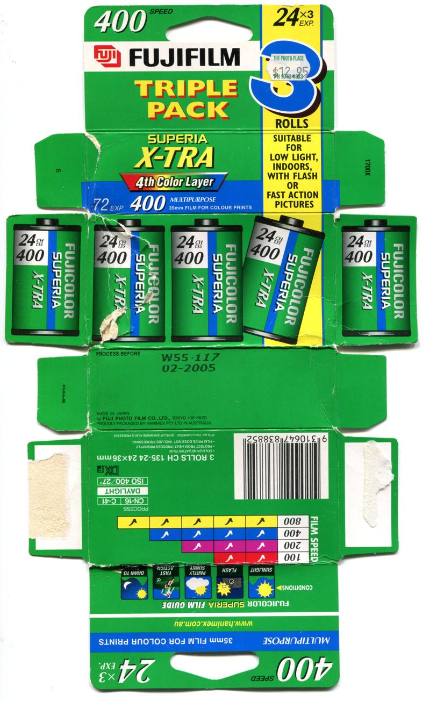
</a>

#### [2005] Ilford Delta 100 Professional (ref: 93b9)

```
Format: 120          |  Process : BW      
ISO   : 100          |  Expiry  : 2005-02 
Type  : Single Pack  |  Quantity: N/A     
Added : 2025-09-07   |  Author  : dekuNukem
UUID  : c2225dedcae040e7bb27a918c4ca93b9
```

<a href="./archive/00310_000.jpg" target="_blank">
	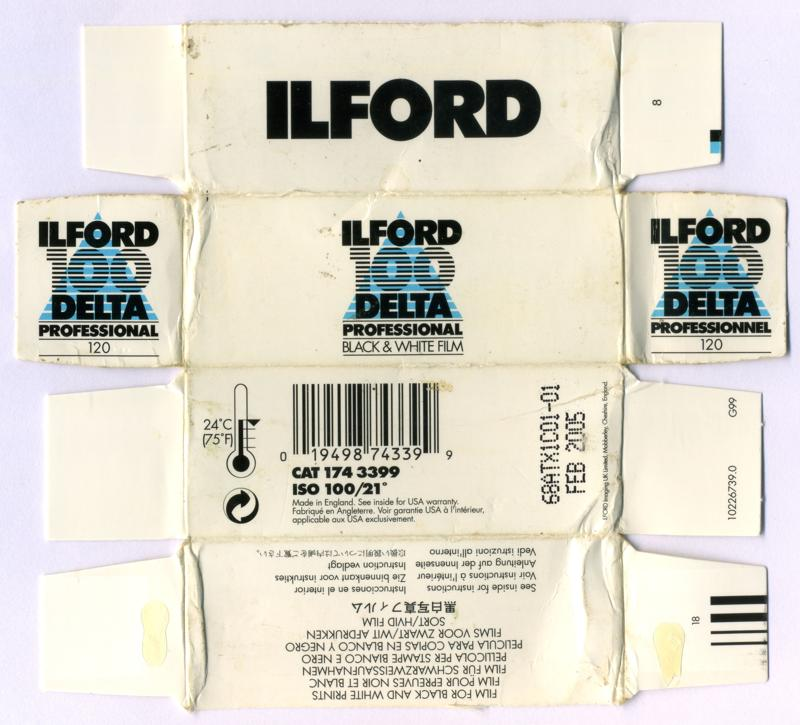
</a>


`UUID: 999648311ef040049db316f49db239b0`↓

<a href="./archive/00310_001.jpg" target="_blank">
	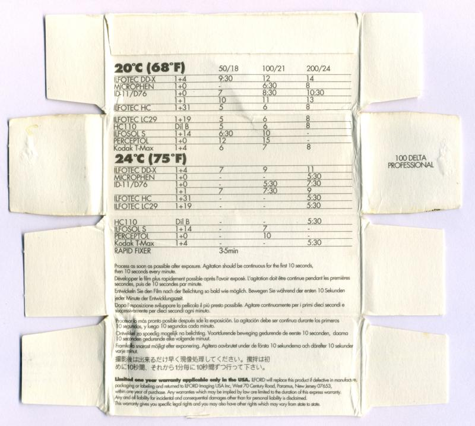
</a>

#### [2005] Agfa AgfaColor XRG 200 (ref: 689e)

```
Format: 35mm         |  Process : C-41    
ISO   : 200          |  Expiry  : 2005-03 
Type  : Single Pack  |  Quantity: 36exp   
Added : 2025-07-31   |  Author  : fine-seat
UUID  : 86136eea89d14e15b60dfcdf45b1689e
```

<a href="./archive/00152_000.jpg" target="_blank">
	
</a>


`UUID: 5598d8aac5844772a87d019a7d37e9f6`↓

<a href="./archive/00152_001.jpg" target="_blank">
	
</a>

#### [2005] Agfa Agfapan APX 100 (ref: e271)

```
Format: 35mm         |  Process : BW      
ISO   : 100          |  Expiry  : 2005-07 
Type  : Single Pack  |  Quantity: 24exp   
Added : 2025-08-16   |  Author  : Kraksen 
UUID  : e00a9a59b3d74a1d85ff4331bc73e271
```

<a href="./archive/00191_000.jpg" target="_blank">
	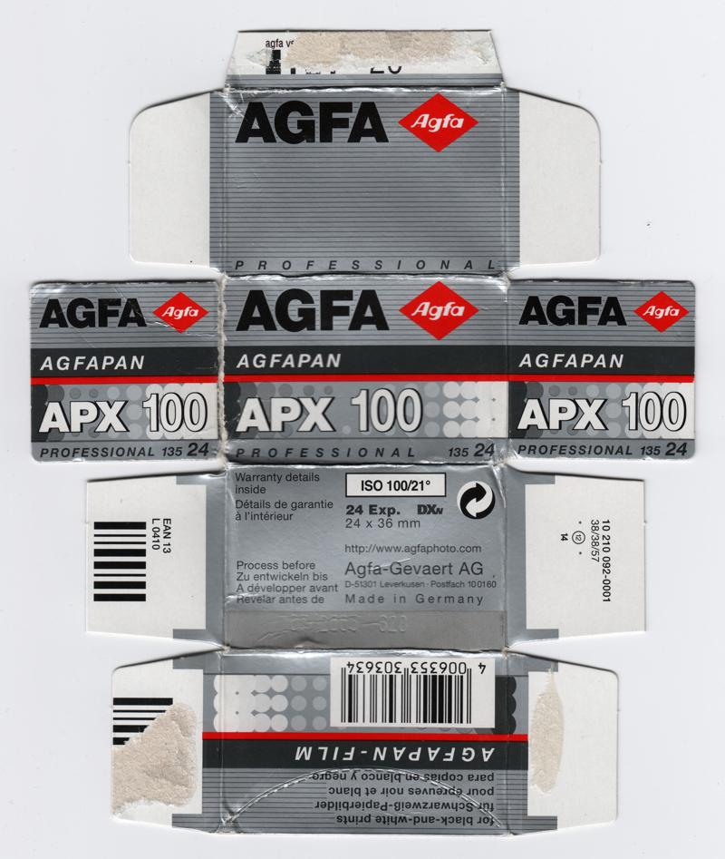
</a>

#### [2005] Agfa Agfapan APX 400 (ref: 5855)

```
Format: 120          |  Process : BW      
ISO   : 400          |  Expiry  : 2005-07 
Type  : Single Pack  |  Quantity: N/A     
Added : 2025-09-05   |  Author  : dekuNukem
UUID  : 4f4b0a2c13064863a1db469838095855
```

<a href="./archive/00300_000.jpg" target="_blank">
	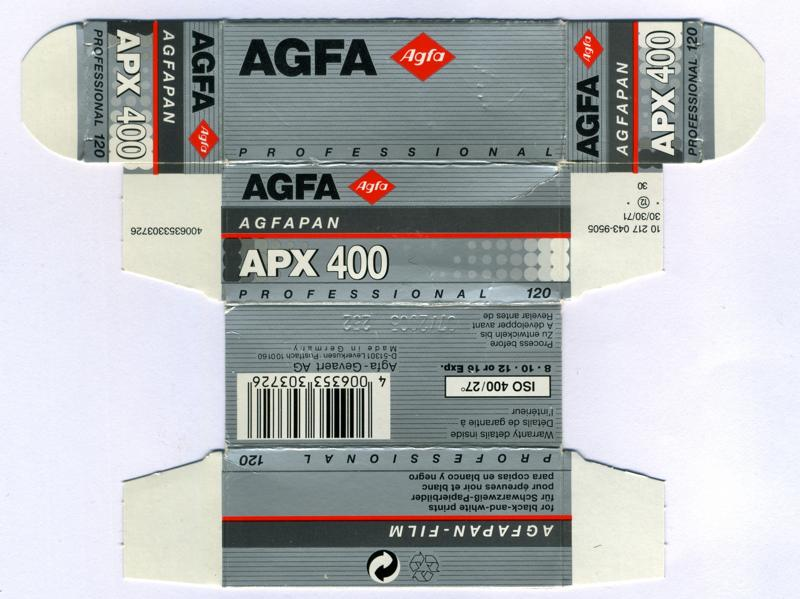
</a>


`UUID: a8ade8c85a504d288a6d5d7458843652`↓

<a href="./archive/00300_001.jpg" target="_blank">
	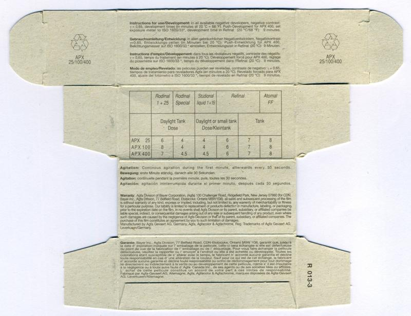
</a>

#### [2005] Kodak Ektachrome 100 Plus (ref: 0183)

```
Format: 220          |  Process : E-6     
ISO   : 100          |  Expiry  : 2005-08 
Type  : Multi-Pack-5 |  Quantity: N/A     
Added : 2025-09-01   |  Author  : dekuNukem
UUID  : 389f8e8d270647eda7b0b7d2ab060183
```

<a href="./archive/00279_000.jpg" target="_blank">
	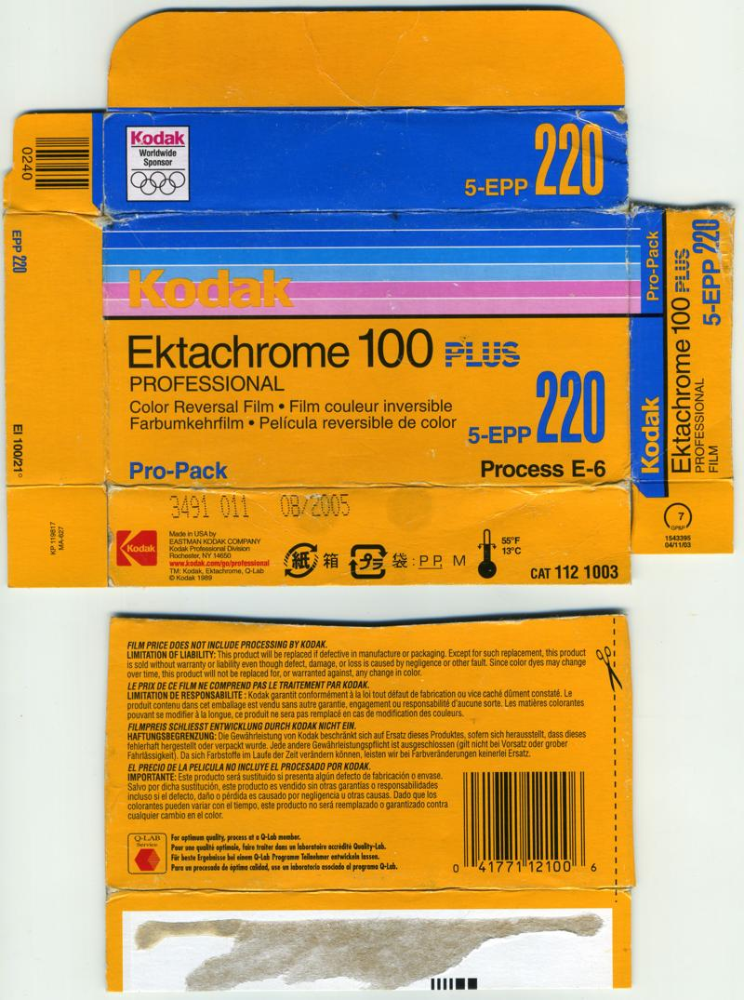
</a>


`UUID: 8a7459e9d8894fa8872872fea7032a9d`↓

<a href="./archive/00279_001.jpg" target="_blank">
	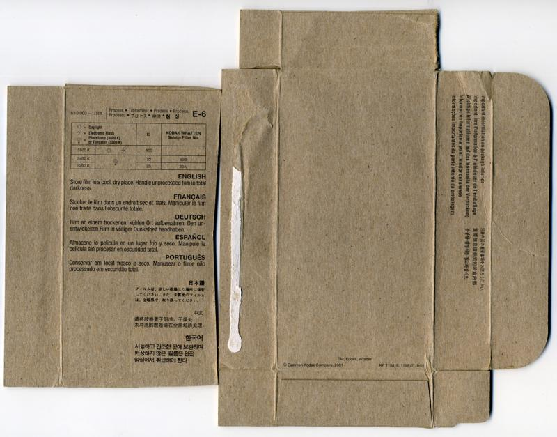
</a>

#### [2005] Ilford FP4 Plus (ref: 5b36)

```
Format: 120          |  Process : BW      
ISO   : 125          |  Expiry  : 2005-11 
Type  : Single Pack  |  Quantity: N/A     
Added : 2025-10-12   |  Author  : dekuNukem
UUID  : da6172ade5c540ee8a25e83586005b36
```

<a href="./archive/00386_000.jpg" target="_blank">
	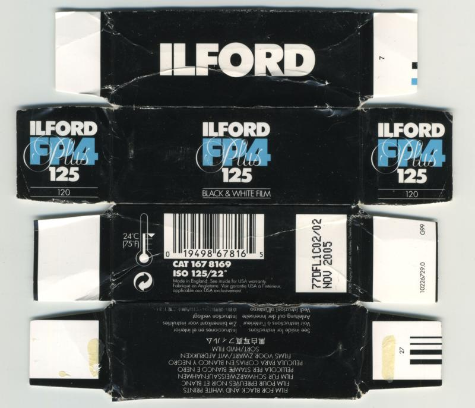
</a>


`UUID: 2cf8ba4121a04609a57253eea4e541fa`↓

<a href="./archive/00386_001.jpg" target="_blank">
	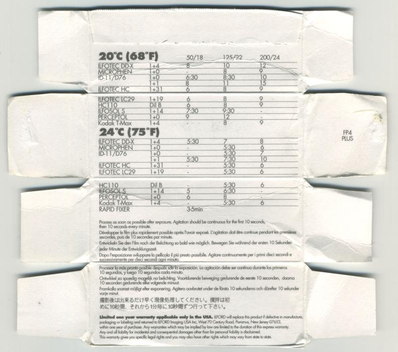
</a>

#### [2005] Jessops Diamond Everyday (ref: 6d5a)

```
Format: 35mm         |  Process : C-41    
ISO   : 200          |  Expiry  : 2005-12 
Type  : Single Pack  |  Quantity: 36exp   
Added : 2025-09-13   |  Author  : GreatGizmo74
UUID  : 44e526db85e94a63ac582d20a1cc6d5a
```

<a href="./archive/00335_000.jpg" target="_blank">
	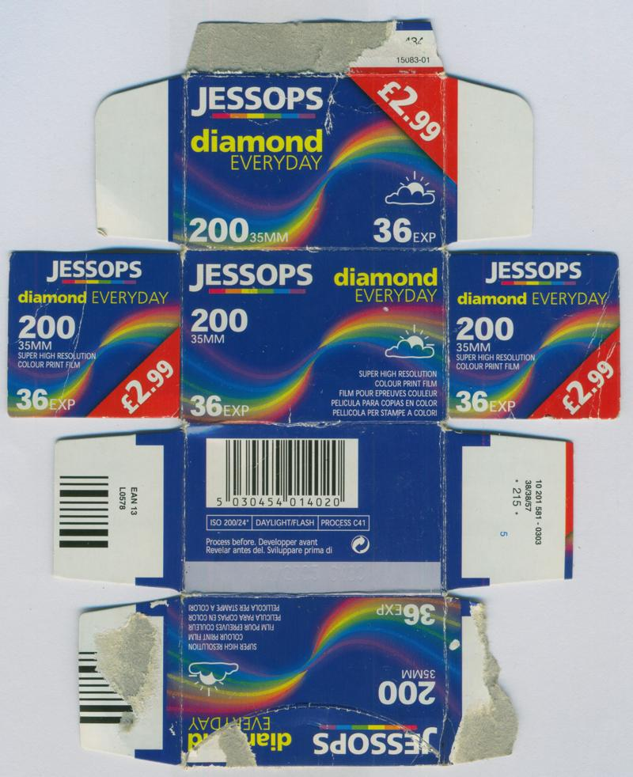
</a>


`UUID: 3e6eca45a0704e0da5c37631b1fd0b56`↓

<a href="./archive/00335_001.jpg" target="_blank">
	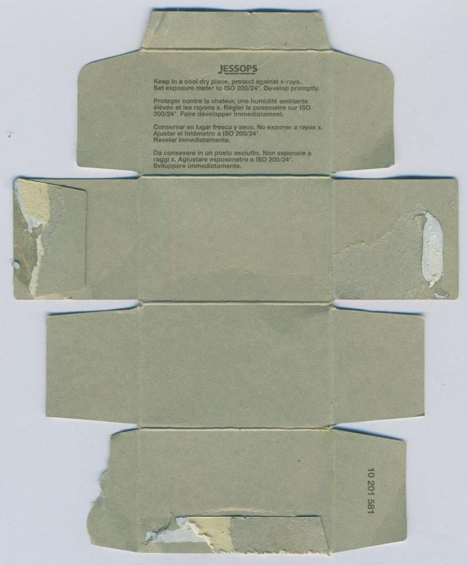
</a>

#### [2005] Kodak Ultra (ref: 69a1)

```
Format: 35mm         |  Process : C-41    
ISO   : 400          |  Expiry  : 2005-12 
Type  : Single Pack  |  Quantity: 24exp   
Added : 2025-01-14   |  Author  : @ob.skura
UUID  : 77dfbdf80e3a4950b40c7ea8c1e369a1
```

<a href="./archive/00043_000.jpg" target="_blank">
	
</a>

#### [2006] Agfa Agfapan APX 400 (ref: 19bc)

```
Format: 35mm         |  Process : BW      
ISO   : 400          |  Expiry  : 2006-01 
Type  : Single Pack  |  Quantity: 36exp   
Added : 2025-08-16   |  Author  : Kraksen 
UUID  : 7dd80a6f50584141ba1752071b9419bc
```

<a href="./archive/00190_000.jpg" target="_blank">
	
</a>


`UUID: 4ecb4b290f4845c196358776429baaec`↓

<a href="./archive/00190_001.jpg" target="_blank">
	
</a>

#### [2006] Polaroid 669 (ref: 3566)

```
Format: Pack Film    |  Process : Instant 
ISO   : 80           |  Expiry  : 2006-03 
Type  : Single Pack  |  Quantity: 20exp   
Added : 2025-01-04   |  Author  : dekuNukem
UUID  : bb62de3a22c04f699c780aeae7c83566
```

<a href="./archive/00020_000.jpg" target="_blank">
	
</a>

#### [2006] Fujifilm Fujichrome Velvia 100F (ref: f7fb)

```
Format: 120          |  Process : E-6     
ISO   : 100          |  Expiry  : 2006-04 
Type  : Multi-Pack-5 |  Quantity: N/A     
Added : 2025-01-04   |  Author  : dekuNukem
UUID  : 0fef128c3b17437eb25d5c4f0520f7fb
```

<a href="./archive/00023_000.jpg" target="_blank">
	
</a>

#### [2006] Rossmann Jahreszeiten Pack (ref: 7670)

```
Format: 35mm         |  Process : C-41    
ISO   : 100          |  Expiry  : 2006-05 
Type  : Multi-Pack-3 |  Quantity: 36exp   
Added : 2025-06-05   |  Author  : benikum 
UUID  : b09413c4c1f44fceaa31ea8e50bf7670
```

<a href="./archive/00072_000.jpg" target="_blank">
	
</a>

#### [2006] Fujifilm Fujicolor Superia X-TRA 400 (ref: da37)

```
Format: 120          |  Process : C-41    
ISO   : 400          |  Expiry  : 2006-07 
Type  : Single Pack  |  Quantity: N/A     
Added : 2025-09-07   |  Author  : @zruk_ts
UUID  : 905002d5cdc24e36b190fb04a38cda37
```

<a href="./archive/00315_000.jpg" target="_blank">
	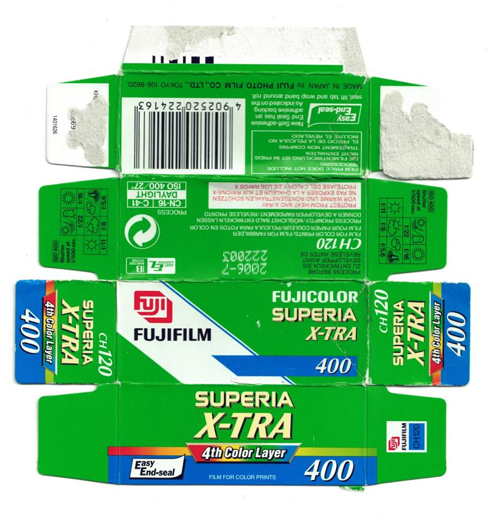
</a>


`UUID: 0e0ad3d8bf184fe4ba12b803f267b71e`↓

<a href="./archive/00315_001.jpg" target="_blank">
	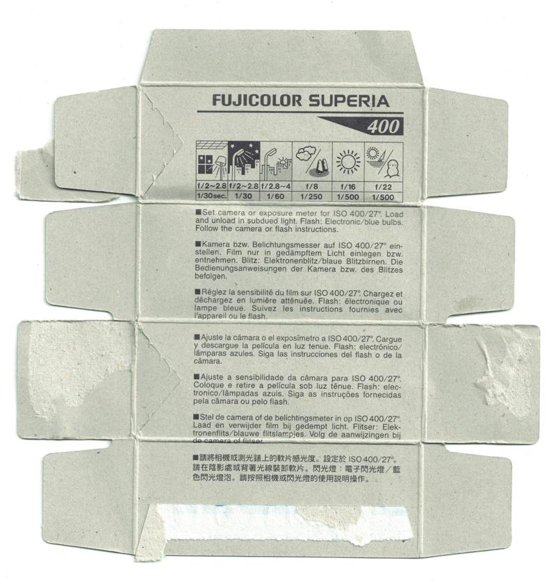
</a>

#### [2006] Polaroid 87 (ref: 62ef)

```
Format: Pack Film    |  Process : Instant 
ISO   : 3000         |  Expiry  : 2006-07 
Type  : Single Pack  |  Quantity: 10exp   
Added : 2025-08-03   |  Author  : dekuNukem
UUID  : 5a63521777ca4f788d01aac5f94862ef
```

<a href="./archive/00158_000.jpg" target="_blank">
	
</a>


`UUID: 55178f72127944e898f8804ac2663c79`↓

<a href="./archive/00158_001.jpg" target="_blank">
	
</a>

#### [2006] Kodak Advantix Ultra (ref: 566b)

```
Format: APS          |  Process : C-41    
ISO   : 200          |  Expiry  : 2006-08 
Type  : Single Pack  |  Quantity: 25exp   
Added : 2025-05-24   |  Author  : dekuNukem
UUID  : 041622f239024ffb8b75c367619a566b
```

<a href="./archive/00066_000.jpg" target="_blank">
	
</a>

#### [2006] Kodak Portra 400NC (ref: b8de)

```
Format: 70mm         |  Process : C-41    
ISO   : 400          |  Expiry  : 2006-08 
Type  : Bulk Roll    |  Quantity: 100ft   
Added : 2025-08-14   |  Author  : Camera.Riley
UUID  : 88ebc10c01ea46238c48e65157ddb8de
```

<a href="./archive/00175_000.jpg" target="_blank">
	
</a>

#### [2006] Jessops Diamond Everyday (ref: 67d3)

```
Format: APS          |  Process : C-41    
ISO   : 200          |  Expiry  : 2006-10 
Type  : Single Pack  |  Quantity: 40exp   
Added : 2025-01-05   |  Author  : dekuNukem
UUID  : b53e5c167866448d812a4dc8e85967d3
```

<a href="./archive/00033_000.jpg" target="_blank">
	
</a>

#### [2006] Klick APS Film (ref: 4b88)

```
Format: APS          |  Process : C-41    
ISO   : 200          |  Expiry  : 2006-10 
Type  : Single Pack  |  Quantity: 25exp   
Added : 2025-05-24   |  Author  : dekuNukem
UUID  : 1dc3d9dbb8bb42b4acfbfbe0737a4b88
```

<a href="./archive/00063_000.jpg" target="_blank">
	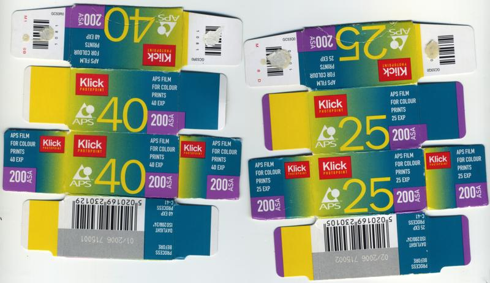
</a>


`UUID: dff53610cf16453fb97135efcc0eed86`↓

<a href="./archive/00063_001.jpg" target="_blank">
	
</a>

#### [2006] Polaroid GridFilm (ref: 8deb)

```
Format: Integral Film|  Process : Instant 
ISO   : 640          |  Expiry  : 2006-10 
Type  : Multi-Pack-2 |  Quantity: 10exp   
Added : 2025-01-05   |  Author  : dekuNukem
UUID  : 4f1aabf29f724c9ea3b2bee414b08deb
```

<a href="./archive/00031_000.jpg" target="_blank">
	
</a>


`UUID: 1dda008c9a844e1b9b64527511fdc282`↓

<a href="./archive/00031_001.jpg" target="_blank">
	
</a>


`UUID: 727d6925fdca4834bd96d71c32f40077`↓

<a href="./archive/00031_002.jpg" target="_blank">
	
</a>


`UUID: aa6fba27f7c9484291dbf8279a8e3d18`↓

<a href="./archive/00031_003.jpg" target="_blank">
	
</a>

#### [2006] Fujifilm Fujichrome Provia 100F (ref: 1b4b)

```
Format: 120          |  Process : E-6     
ISO   : 100          |  Expiry  : 2006-12 
Type  : Multi-Pack-5 |  Quantity: N/A     
Added : 2025-09-01   |  Author  : dekuNukem
UUID  : c7a59b3560b04f3a93f2ee26d1b21b4b
Notes : Japanese version?
```

<a href="./archive/00281_000.jpg" target="_blank">
	
</a>

#### [2007] Klick 400ASA (ref: 8779)

```
Format: 35mm         |  Process : C-41    
ISO   : 400          |  Expiry  : 2007-02 
Type  : Single Pack  |  Quantity: 24exp   
Added : 2025-08-30   |  Author  : dekuNukem
UUID  : 42f73c1448634cdb856d014e59098779
```

<a href="./archive/00270_000.jpg" target="_blank">
	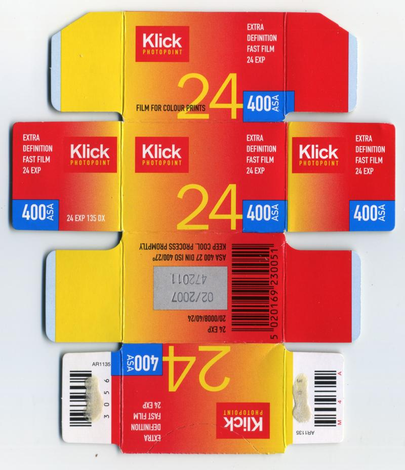
</a>


`UUID: f65991d851c249318d64793e8e7defeb`↓

<a href="./archive/00270_001.jpg" target="_blank">
	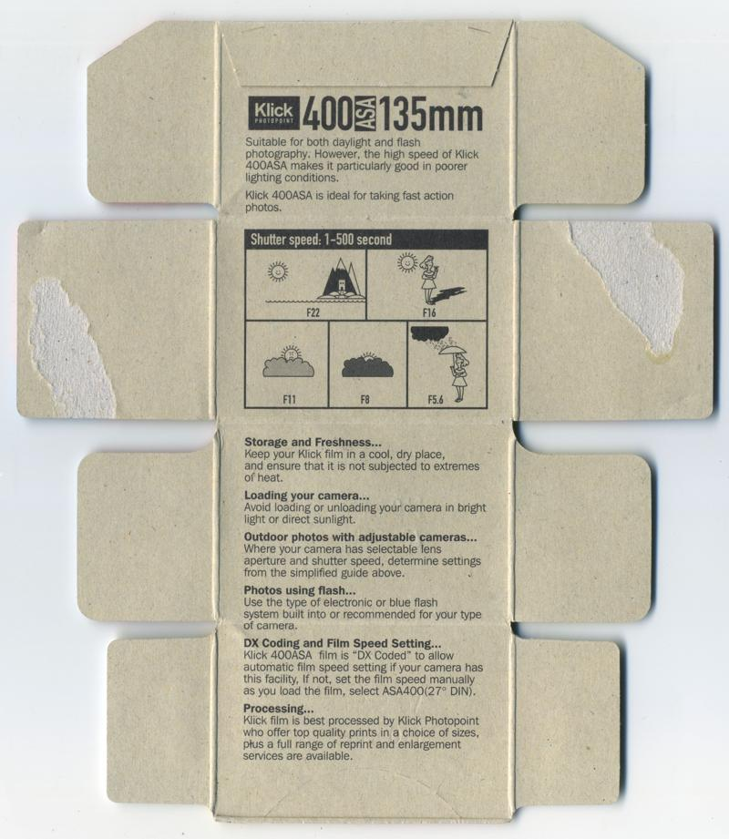
</a>

#### [2007] Kodak 110 Film (ref: 8cca)

```
Format: 110          |  Process : C-41    
ISO   : 400          |  Expiry  : 2007-02 
Type  : Single Pack  |  Quantity: 24exp   
Added : 2025-09-13   |  Author  : @filmfotofella
UUID  : 6c0cf01a1703494296ce60ad5dd28cca
```

<a href="./archive/00332_000.jpg" target="_blank">
	
</a>

#### [2007] Konica Minolta Commercial Color Film (ref: e903)

```
Format: 35mm         |  Process : C-41    
ISO   : 100          |  Expiry  : 2007-02 
Type  : Single Pack  |  Quantity: 24exp   
Added : 2025-09-03   |  Author  : @ellafridalindblom
UUID  : 0b703dc8e8c74e8b9dd3215fa370e903
```

<a href="./archive/00291_000.jpg" target="_blank">
	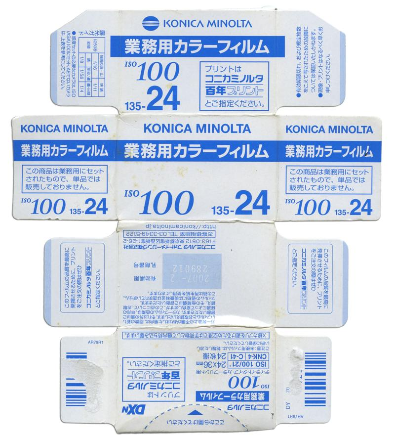
</a>

#### [2007] Fujifilm Fujichrome Velvia 100F (ref: 32d4)

```
Format: 35mm         |  Process : E-6     
ISO   : 100          |  Expiry  : 2007-03 
Type  : Single Pack  |  Quantity: 36exp   
Added : 2025-02-21   |  Author  : @seklerek
UUID  : ce5c1d786286427ba5633091b06432d4
```

<a href="./archive/00056_000.jpg" target="_blank">
	
</a>

#### [2007] Kodak MAX (ref: 2361)

```
Format: 35mm         |  Process : C-41    
ISO   : 400          |  Expiry  : 2007-03 
Type  : Multi-Pack-3 |  Quantity: 24exp   
Added : 2025-08-20   |  Author  : @photos.by.qi
UUID  : 5d0c054ebc17452397de86653bf42361
```

<a href="./archive/00234_000.jpg" target="_blank">
	
</a>

#### [2007] Fujifilm Fujicolor Superia Reala (ref: a7de)

```
Format: 35mm         |  Process : C-41    
ISO   : 100          |  Expiry  : 2007-04 
Type  : Single Pack  |  Quantity: 36exp   
Added : 2025-07-28   |  Author  : @recycling.film
UUID  : bab5fa204b25431a9872c4ce8e9aa7de
```

<a href="./archive/00087_000.jpg" target="_blank">
	
</a>

#### [2007] Kodak Kodachrome 64 (ref: 3206)

```
Format: 35mm         |  Process : K-14    
ISO   : 64           |  Expiry  : 2007-05 
Type  : Single Pack  |  Quantity: 36exp   
Added : 2025-05-24   |  Author  : dekuNukem
UUID  : dc9c151b87de48339e564e6692663206
```

<a href="./archive/00060_000.jpg" target="_blank">
	
</a>

#### [2007] Klick Max Extra Definition Multi Purpose Film (ref: 8ae4)

```
Format: 35mm         |  Process : C-41    
ISO   : 200          |  Expiry  : 2007-06 
Type  : Single Pack  |  Quantity: 36exp   
Added : 2025-09-28   |  Author  : dekuNukem
UUID  : b1affc3985b44a4781729ffa50908ae4
```

<a href="./archive/00351_000.jpg" target="_blank">
	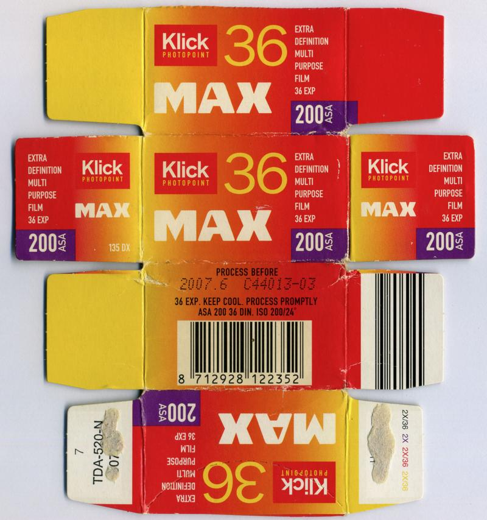
</a>

#### [2007] Ilford Delta 400 Professional (ref: 8f8b)

```
Format: 35mm         |  Process : BW      
ISO   : 400          |  Expiry  : 2007-07 
Type  : Single Pack  |  Quantity: 24exp   
Added : 2025-09-07   |  Author  : dekuNukem
UUID  : f38dd0735c2e441088b421eec4678f8b
```

<a href="./archive/00309_000.jpg" target="_blank">
	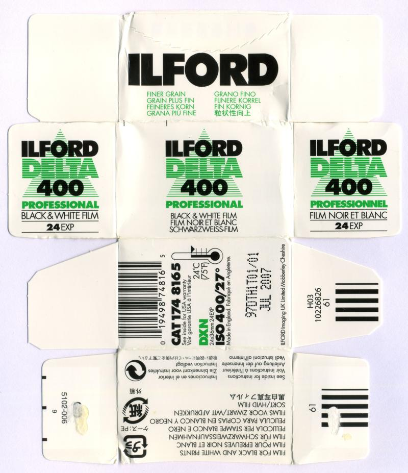
</a>


`UUID: c32ca8b644b54348a71dab9414ec61d4`↓

<a href="./archive/00309_001.jpg" target="_blank">
	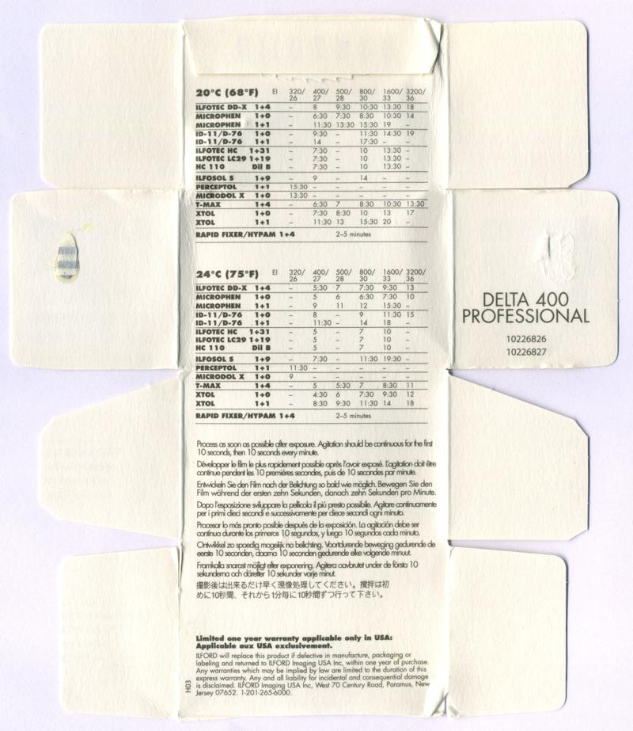
</a>

#### [2007] Polaroid Image Instant Film (ref: ee6d)

```
Format: Integral Film|  Process : Instant 
ISO   : 640          |  Expiry  : 2007-07 
Type  : Single Pack  |  Quantity: 10exp   
Added : 2025-10-03   |  Author  : @ellafridalindblom
UUID  : 6a3ab27a3a964d7c9ecc38dbce2fee6d
```

<a href="./archive/00364_000.jpg" target="_blank">
	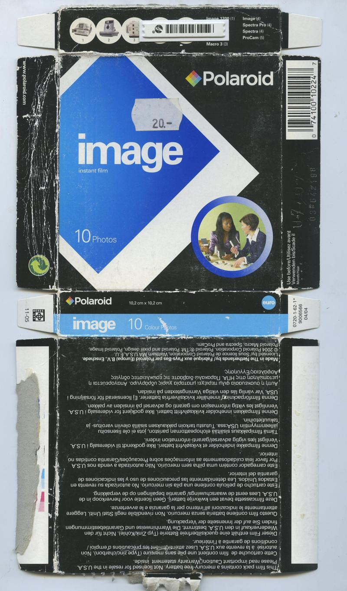
</a>


`UUID: c2742bb793f34d90a0365bb82e0160df`↓

<a href="./archive/00364_001.jpg" target="_blank">
	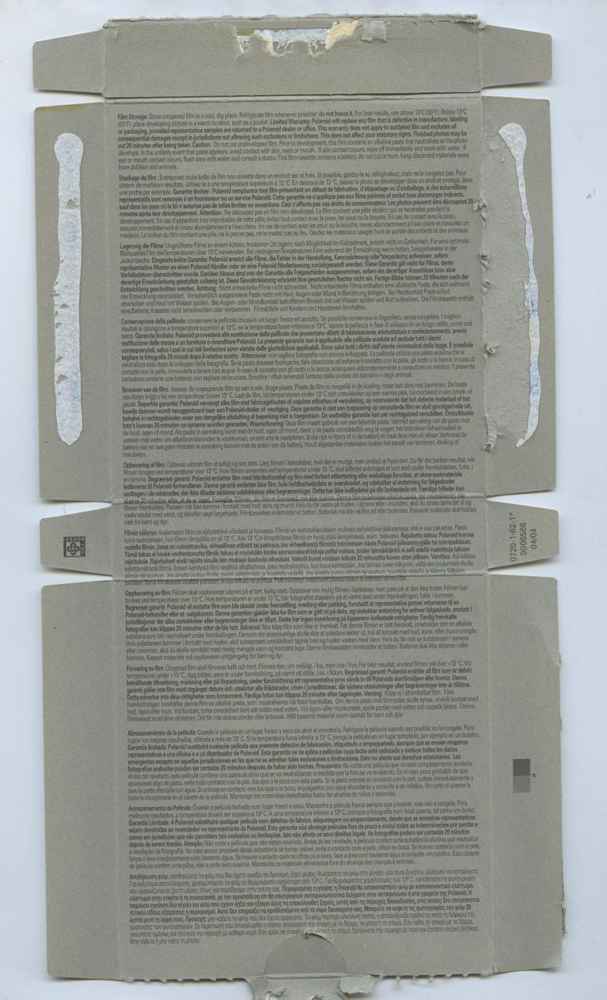
</a>

#### [2007] Lloyds Pharmacy APS Film (ref: c7cf)

```
Format: APS          |  Process : C-41    
ISO   : 200          |  Expiry  : 2007-08 
Type  : Single Pack  |  Quantity: 40exp   
Added : 2025-05-24   |  Author  : dekuNukem
UUID  : 44bd7d4688e04d19a958d961c2abc7cf
```

<a href="./archive/00067_000.jpg" target="_blank">
	
</a>

#### [2007] Fujifilm Fujicolor Pro 400H (ref: 48ed)

```
Format: 220          |  Process : C-41    
ISO   : 400          |  Expiry  : 2007-10 
Type  : Multi-Pack-5 |  Quantity: N/A     
Added : 2025-08-20   |  Author  : @photos.by.qi
UUID  : fae60be8fc0745c3965f24b1778e48ed
```

<a href="./archive/00247_000.jpg" target="_blank">
	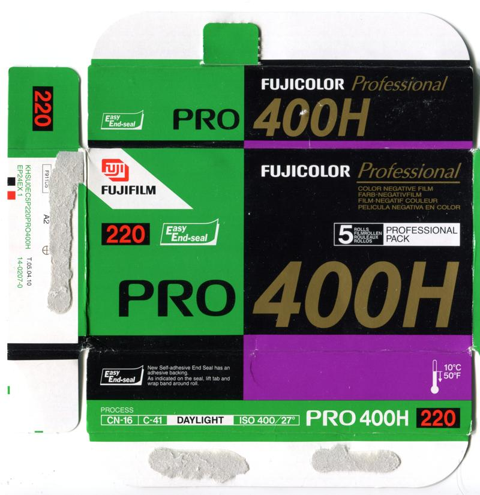
</a>


`UUID: a305e39dc3f041d1bf59e7dc2504835c`↓

<a href="./archive/00247_001.jpg" target="_blank">
	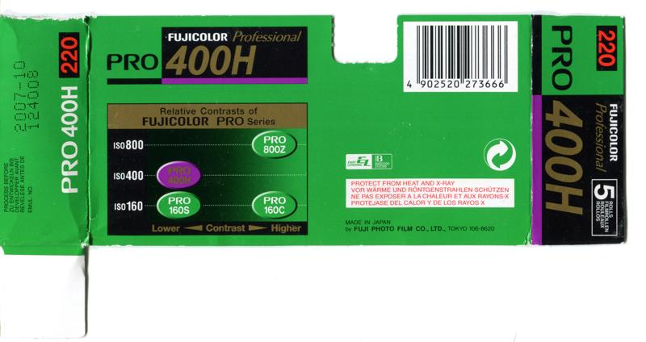
</a>


`UUID: a10a19f268084ce881ab55f247f1035f`↓

<a href="./archive/00247_002.jpg" target="_blank">
	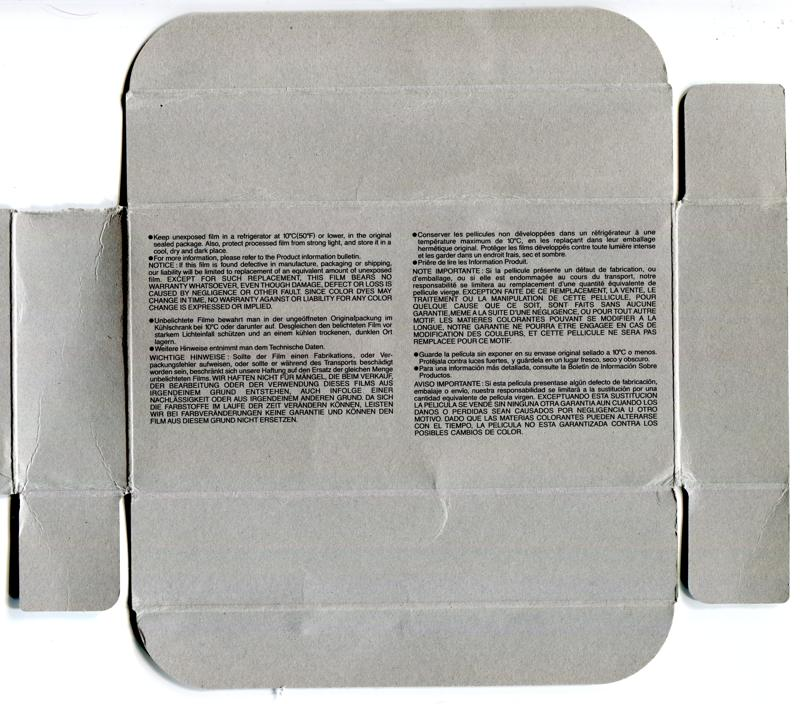
</a>

#### [2007] Kodak Elite Chrome (ref: 3943)

```
Format: 35mm         |  Process : E-6     
ISO   : 400          |  Expiry  : 2007-10 
Type  : Single Pack  |  Quantity: 24exp   
Added : 2025-08-14   |  Author  : Camera.Riley
UUID  : c9ba81252c5f438ca70922a2b5703943
```

<a href="./archive/00178_000.jpg" target="_blank">
	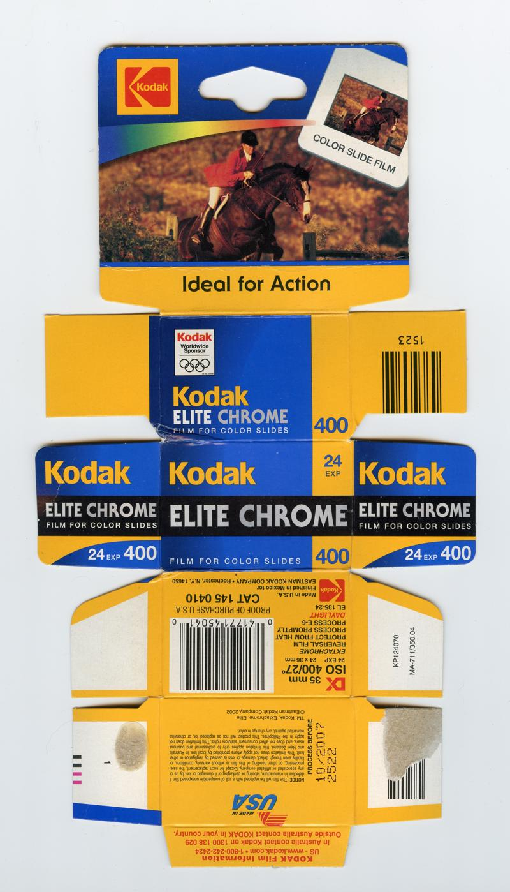
</a>


`UUID: 7c1650085c4146e0bec821475e25219f`↓

<a href="./archive/00178_001.jpg" target="_blank">
	
</a>

#### [2007] Kodak Ultra (ref: 5701)

```
Format: 110          |  Process : C-41    
ISO   : 400          |  Expiry  : 2007-11 
Type  : Single Pack  |  Quantity: 24exp   
Added : 2025-09-13   |  Author  : @filmfotofella
UUID  : d01783be3b70456095411ca387865701
```

<a href="./archive/00333_000.jpg" target="_blank">
	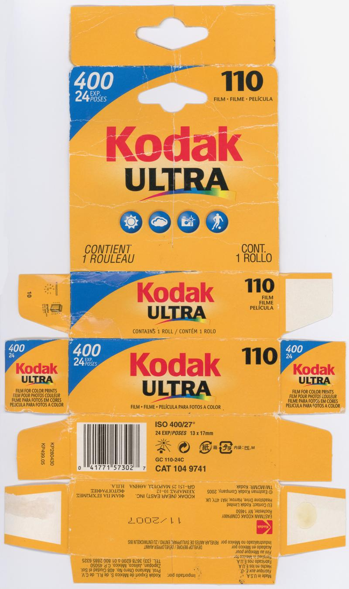
</a>

#### [2008] Agfa APX (ref: 12c7)

```
Format: 120          |  Process : BW      
ISO   : 100          |  Expiry  : 2008-07 
Type  : Single Pack  |  Quantity: N/A     
Added : 2025-01-04   |  Author  : dekuNukem
UUID  : a20bbca534454915a6970b6ede2212c7
```

<a href="./archive/00011_000.jpg" target="_blank">
	
</a>


`UUID: dd262792b6a446dcab73a07738f8a8dd`↓

<a href="./archive/00011_001.jpg" target="_blank">
	
</a>

#### [2008] Agfa CT Precisa 100 (ref: bc36)

```
Format: 35mm         |  Process : E-6     
ISO   : 100          |  Expiry  : 2008-09 
Type  : Single Pack  |  Quantity: 36exp   
Added : 2025-10-21   |  Author  : dekuNukem
UUID  : 087e9a1b5cc7447dbd0b7d5b81c9bc36
```

<a href="./archive/00428_000.jpg" target="_blank">
	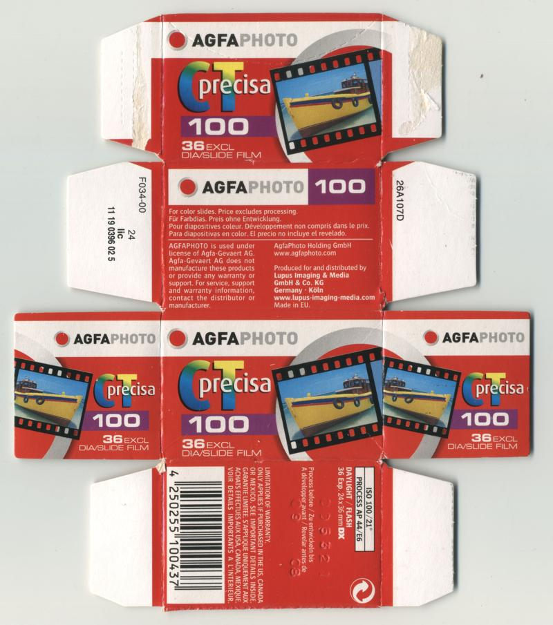
</a>


`UUID: ae783a67ce214185b13ee707c56dad58`↓

<a href="./archive/00428_001.jpg" target="_blank">
	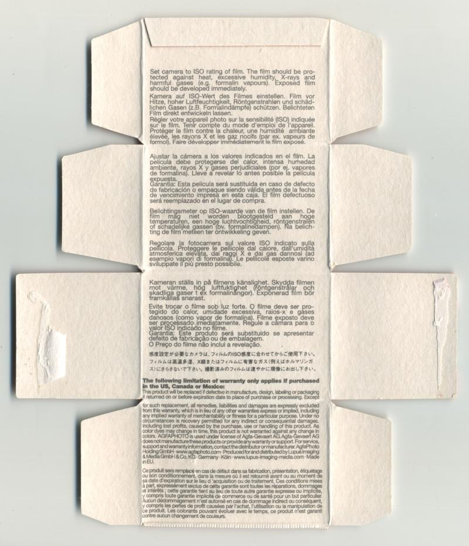
</a>

#### [2008] Kodak High Speed Infrared (ref: 883e)

```
Format: 35mm         |  Process : BW      
ISO   : 80           |  Expiry  : 2008-10 
Type  : Single Pack  |  Quantity: 36exp   
Added : 2025-07-29   |  Author  : Nano_Burger
UUID  : 77352e93d73748eca98cff7b30d7883e
```

<a href="./archive/00103_000.jpg" target="_blank">
	
</a>


`UUID: 5667abf6f7f04edba88137bd54153841`↓

<a href="./archive/00103_001.jpg" target="_blank">
	
</a>

#### [2008] Polaroid 990 (ref: e3bc)

```
Format: Integral Film|  Process : Instant 
ISO   : 640          |  Expiry  : 2008-10 
Type  : Multi-Pack-2 |  Quantity: 10exp   
Added : 2025-09-18   |  Author  : dekuNukem
UUID  : 79f8183905d443aaaab84c6f0944e3bc
```

<a href="./archive/00349_000.jpg" target="_blank">
	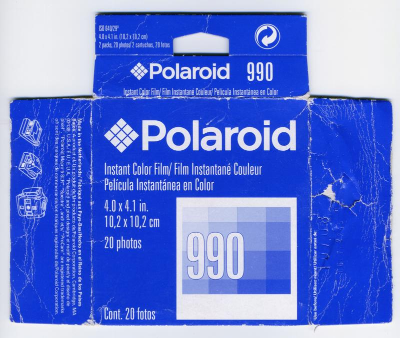
</a>


`UUID: 6e2ec8c800b140baaf1a2438e722931c`↓

<a href="./archive/00349_001.jpg" target="_blank">
	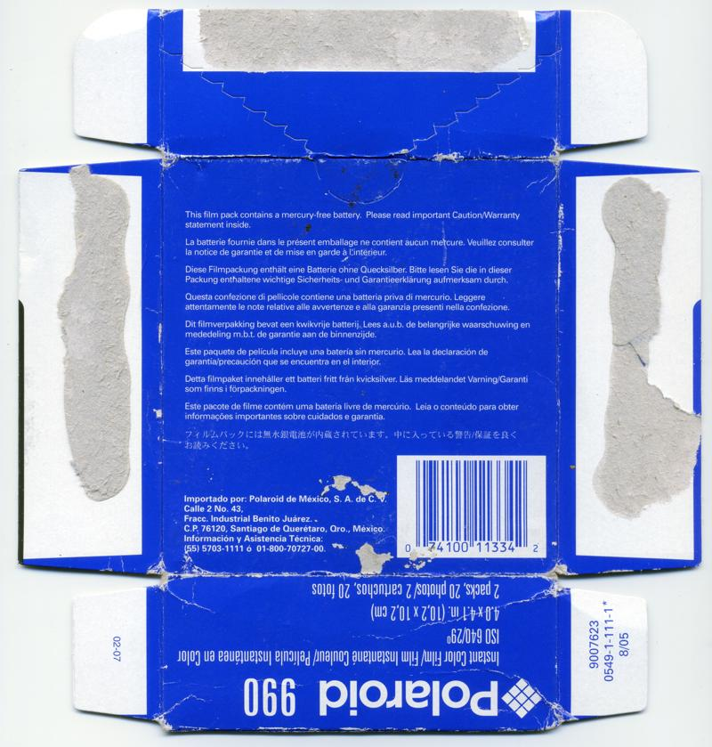
</a>


`UUID: d4caa7bc6e1a46e1a5712fccfe5003e0`↓

<a href="./archive/00349_002.jpg" target="_blank">
	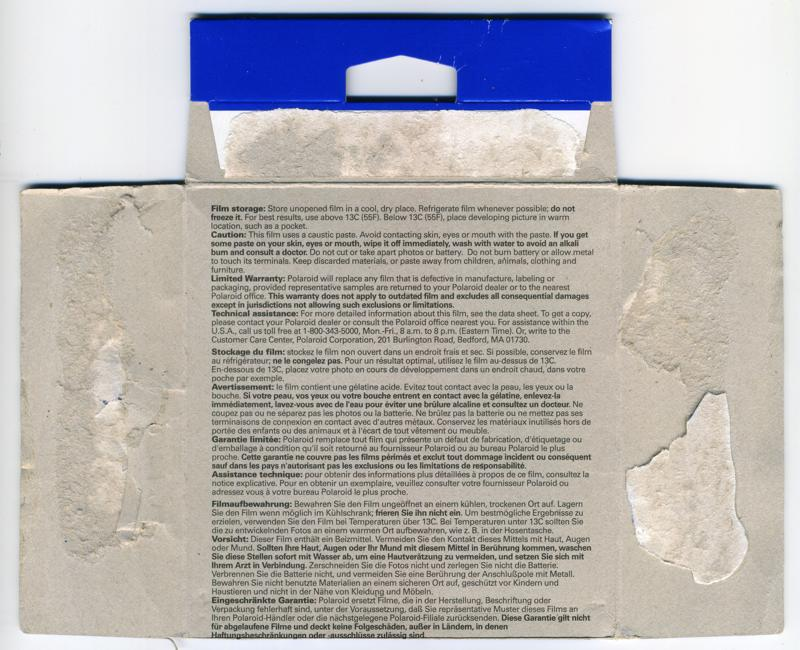
</a>


`UUID: 99e7ca19be7b412ba276d45c7a09369f`↓

<a href="./archive/00349_003.jpg" target="_blank">
	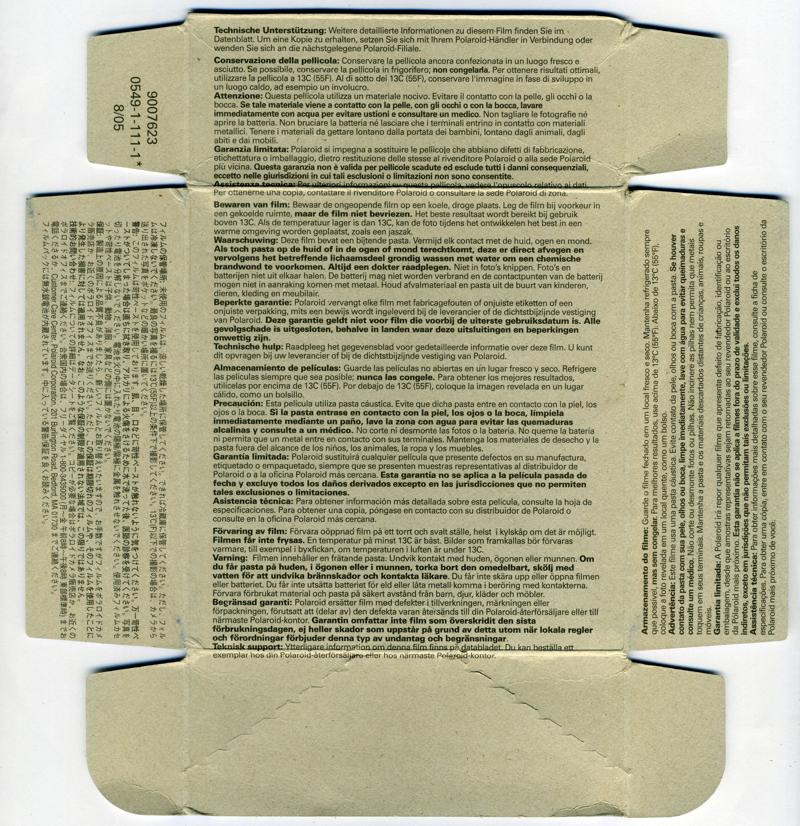
</a>

#### [2009] Fujifilm Fujicolor Pro 400H (ref: dc37)

```
Format: 35mm         |  Process : C-41    
ISO   : 400          |  Expiry  : 2009-01 
Type  : Single Pack  |  Quantity: 36exp   
Added : 2025-08-20   |  Author  : @photos.by.qi
UUID  : 9934366ea7a04b65b3c300352fa8dc37
```

<a href="./archive/00249_000.jpg" target="_blank">
	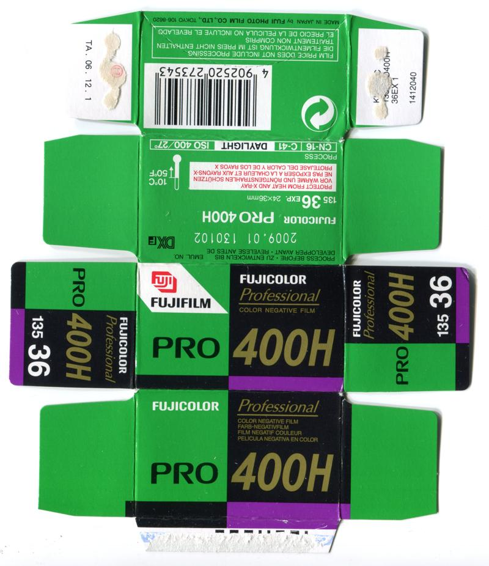
</a>


`UUID: df9f856987284644858ab4590872c133`↓

<a href="./archive/00249_001.jpg" target="_blank">
	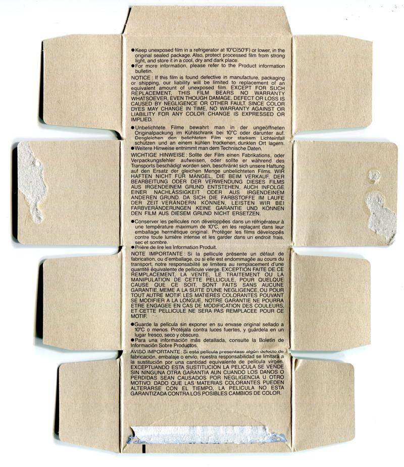
</a>

#### [2009] Kodak Portra 400VC (ref: 7669)

```
Format: 35mm         |  Process : C-41    
ISO   : 400          |  Expiry  : 2009-04 
Type  : Multi-Pack-5 |  Quantity: 36exp   
Added : 2025-08-20   |  Author  : @photos.by.qi
UUID  : 2152a58cb08c463ea298a61858ff7669
```

<a href="./archive/00242_000.jpg" target="_blank">
	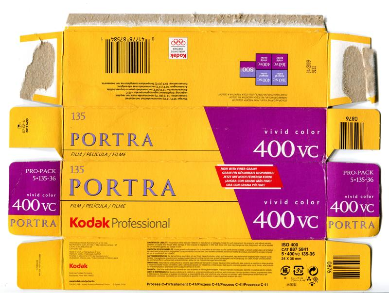
</a>

#### [2009] Fujifilm Fujicolor Superia (ref: 0d8e)

```
Format: 35mm         |  Process : C-41    
ISO   : 200          |  Expiry  : 2009-06 
Type  : Single Pack  |  Quantity: 36exp   
Added : 2025-08-18   |  Author  : @recycling.film
UUID  : a57061210f17463fae293851f2130d8e
```

<a href="./archive/00199_000.jpg" target="_blank">
	
</a>

#### [2009] Lloyds Pharmacy Colour Film (ref: 77d9)

```
Format: 35mm         |  Process : C-41    
ISO   : 200          |  Expiry  : 2009-07 
Type  : Single Pack  |  Quantity: 36exp   
Added : 2025-01-04   |  Author  : dekuNukem
UUID  : c58dda071d1741fda90e20b4252277d9
```

<a href="./archive/00013_000.jpg" target="_blank">
	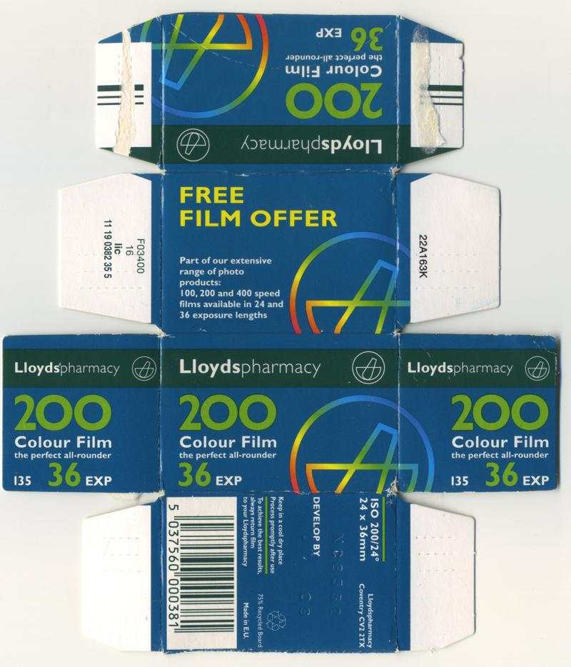
</a>

#### [2009] Kodak FarbWelt 400 (ref: e9b6)

```
Format: 35mm         |  Process : C-41    
ISO   : 400          |  Expiry  : 2009-09 
Type  : Multi-Pack-2 |  Quantity: 36exp   
Added : 2025-09-04   |  Author  : dekuNukem
UUID  : dc04ec32aeda4b9ba394437272fde9b6
```

<a href="./archive/00297_000.jpg" target="_blank">
	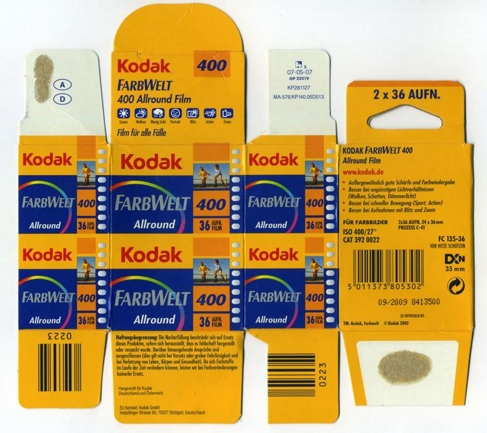
</a>

#### [2010] Fujifilm Fujicolor Superia Reala (ref: a624)

```
Format: 35mm         |  Process : C-41    
ISO   : 100          |  Expiry  : 2010-04 
Type  : Single Pack  |  Quantity: 36exp   
Added : 2025-08-20   |  Author  : @photos.by.qi
UUID  : 47af4374c1474eb3b20cb1894b43a624
```

<a href="./archive/00230_000.jpg" target="_blank">
	
</a>

#### [2010] Fujifilm Neopan 400 Presto (ref: 21a7)

```
Format: 120          |  Process : BW      
ISO   : 400          |  Expiry  : 2010-04 
Type  : Single Pack  |  Quantity: N/A     
Added : 2025-09-17   |  Author  : @ellafridalindblom
UUID  : cd3f61fd84d844c0810b9a508c4721a7
```

<a href="./archive/00341_000.jpg" target="_blank">
	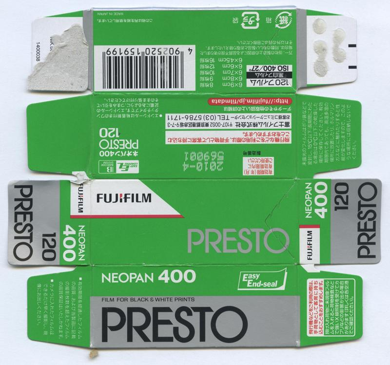
</a>

#### [2010] Kodak Ektachrome E100VS (ref: a8d3)

```
Format: 120          |  Process : E-6     
ISO   : 100          |  Expiry  : 2010-04 
Type  : Multi-Pack-5 |  Quantity: N/A     
Added : 2025-08-03   |  Author  : dekuNukem
UUID  : e8673d04cee440bd9c065a37a485a8d3
```

<a href="./archive/00160_000.jpg" target="_blank">
	
</a>

#### [2010] Fujifilm Fujicolor 100 (ref: 013b)

```
Format: 35mm         |  Process : C-41    
ISO   : 100          |  Expiry  : 2010-07 
Type  : Single Pack  |  Quantity: 12exp   
Added : 2025-01-12   |  Author  : b0baspace
UUID  : 27d88b35933b4ede958b5b5b5b42013b
```

<a href="./archive/00040_000.jpg" target="_blank">
	
</a>

#### [2012] Fujifilm Fujicolor Professional (ref: 28da)

```
Format: 35mm         |  Process : C-41    
ISO   : 100          |  Expiry  : 2012-02 
Type  : Single Pack  |  Quantity: 24exp   
Added : 2025-07-31   |  Author  : The Compartmentalist
UUID  : cb85af928a7f454e9673960e22b428da
```

<a href="./archive/00117_000.jpg" target="_blank">
	
</a>

#### [2012] Kodak Kodacolor VR Plus (ref: f8bf)

```
Format: 35mm         |  Process : C-41    
ISO   : 400          |  Expiry  : 2012-03 
Type  : Multi-Pack-2 |  Quantity: 36exp   
Added : 2025-07-31   |  Author  : fine-seat
UUID  : faf0a44eece541a9b701feb772f4f8bf
```

<a href="./archive/00153_000.jpg" target="_blank">
	
</a>

#### [2012] Ilford HP5 Plus (ref: 11a8)

```
Format: 120          |  Process : BW      
ISO   : 400          |  Expiry  : 2012-06 
Type  : Single Pack  |  Quantity: N/A     
Added : 2025-07-31   |  Author  : Pelicram
UUID  : dbf3817f506a444b9d394745dba311a8
```

<a href="./archive/00140_000.jpg" target="_blank">
	
</a>


`UUID: 17ab4481b81243c9bbc211688ba2336a`↓

<a href="./archive/00140_001.jpg" target="_blank">
	
</a>

#### [2013] Mr. Negative Eterna 250D (ref: 6d6e)

```
Format: 35mm         |  Process : ECN-2   
ISO   : 250          |  Expiry  : 2013-01 
Type  : Single Pack  |  Quantity: 36exp   
Added : 2025-09-11   |  Author  : @sachynmital
UUID  : 955fbe87cb4c45dfb7f198cc638d6d6e
```

<a href="./archive/00322_000.jpg" target="_blank">
	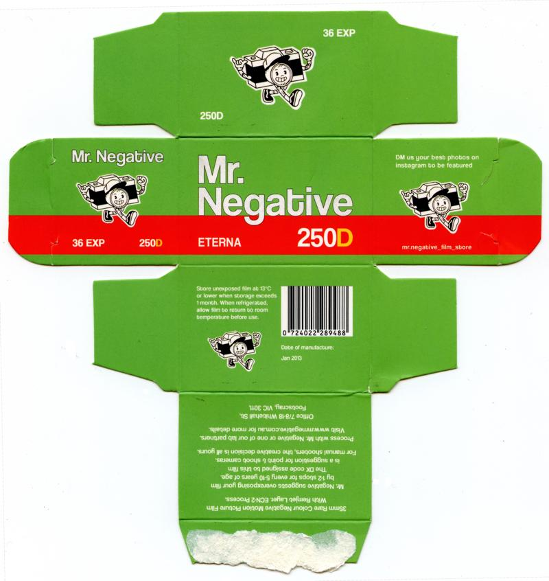
</a>

#### [2013] Boots Colour Print Film (ref: a30f)

```
Format: 35mm         |  Process : C-41    
ISO   : 200          |  Expiry  : 2013-02 
Type  : Single Pack  |  Quantity: 36exp   
Added : 2025-08-07   |  Author  : @Hol.m35
UUID  : bd601340027a4c9daa7e219b414fa30f
```

<a href="./archive/00166_000.jpg" target="_blank">
	
</a>

#### [2013] Efke IR 820 Aura (ref: 43c9)

```
Format: 120          |  Process : BW      
ISO   : 100          |  Expiry  : 2013-03 
Type  : Single Pack  |  Quantity: N/A     
Added : 2025-01-05   |  Author  : dekuNukem
UUID  : 716e410a3823476e9befa704361f43c9
```

<a href="./archive/00038_000.jpg" target="_blank">
	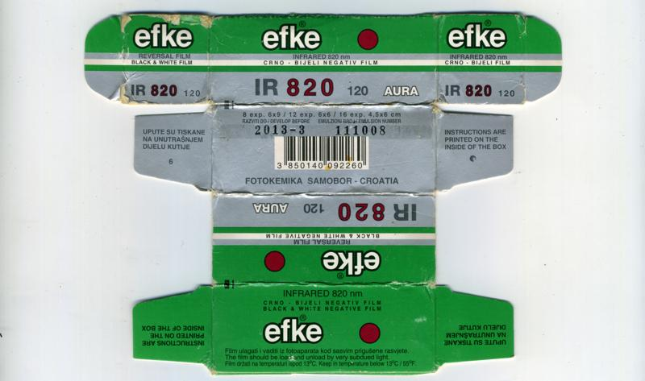
</a>


`UUID: 4c7b545000f04f4da046d18c43575e19`↓

<a href="./archive/00038_001.jpg" target="_blank">
	
</a>

#### [2013] Kodak Portra 160 (ref: ce56)

```
Format: 35mm         |  Process : C-41    
ISO   : 160          |  Expiry  : 2013-08 
Type  : Multi-Pack-5 |  Quantity: 36exp   
Added : 2025-07-28   |  Author  : @recycling.film
UUID  : 9131fb90db70475dbad5f63f1448ce56
```

<a href="./archive/00089_000.jpg" target="_blank">
	
</a>

#### [2013] Ilford SFX 200 (ref: 6057)

```
Format: 120          |  Process : BW      
ISO   : 200          |  Expiry  : 2013-09 
Type  : Single Pack  |  Quantity: N/A     
Added : 2025-01-04   |  Author  : dekuNukem
UUID  : 7856b5442362453caa67628c93be6057
```

<a href="./archive/00009_000.jpg" target="_blank">
	
</a>


`UUID: 2579a55634474187bac08797a02f422d`↓

<a href="./archive/00009_001.jpg" target="_blank">
	
</a>

#### [2013] Efiniti UXi Super 200 (ref: 471a)

```
Format: 35mm         |  Process : C-41    
ISO   : 200          |  Expiry  : 2013-10 
Type  : Single Pack  |  Quantity: 36exp   
Added : 2025-01-04   |  Author  : dekuNukem
UUID  : cde1122dafbc47088a11d9ee12b6471a
```

<a href="./archive/00002_000.jpg" target="_blank">
	
</a>

#### [2013] Impossible Project Color Instant Film for Polaroid SX-70 Type Cameras (ref: 861c)

```
Format: Integral Film|  Process : Instant 
ISO   : 160          |  Expiry  : 2013-11 
Type  : Single Pack  |  Quantity: 8exp    
Added : 2025-10-14   |  Author  : dekuNukem
UUID  : 0543dd31cf204c8499f5f1e51a9b861c
```

<a href="./archive/00395_000.jpg" target="_blank">
	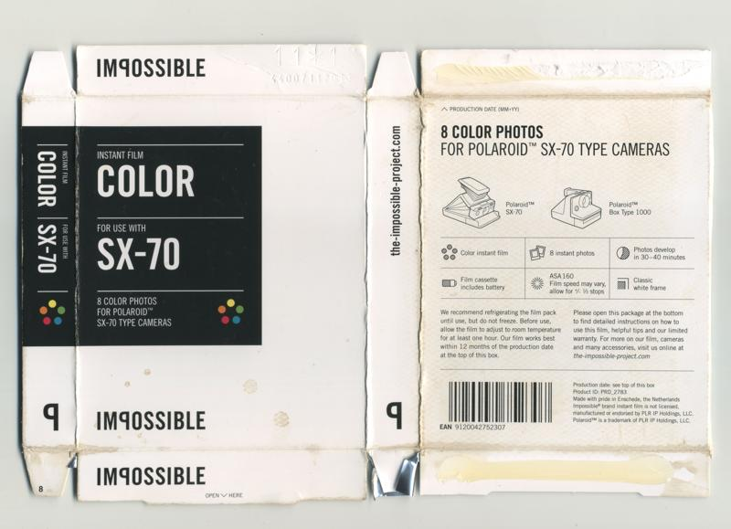
</a>


`UUID: c8261d3d4696463091c1e946521ba6b8`↓

<a href="./archive/00395_001.jpg" target="_blank">
	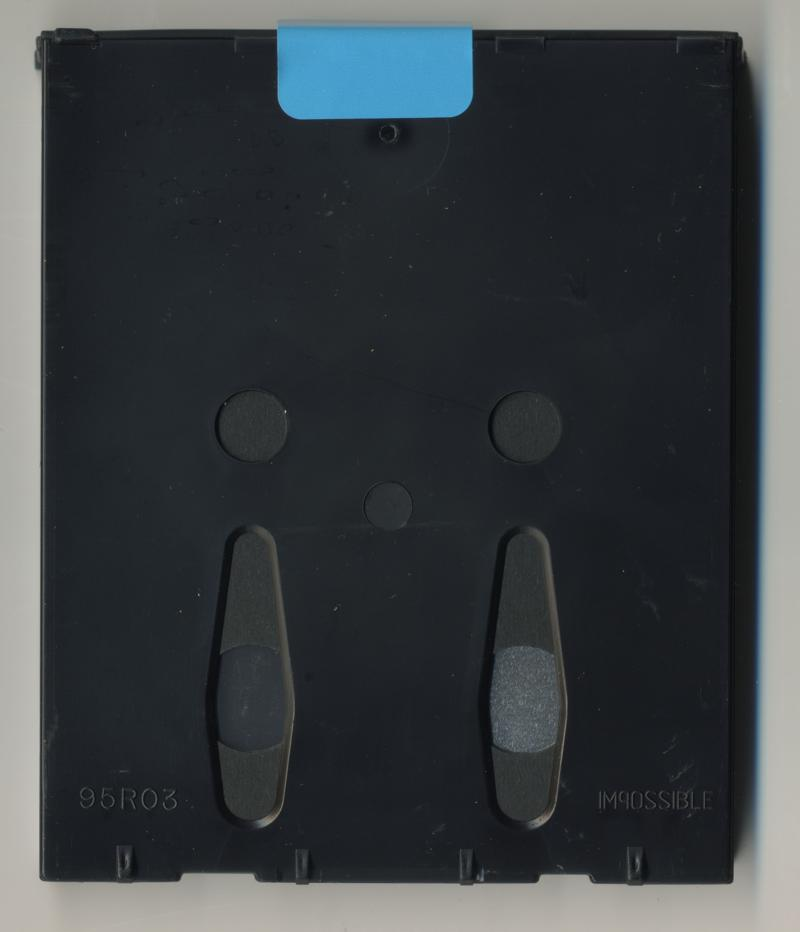
</a>


`UUID: f6f40232e62741eb8bbc5f22f9e38dc8`↓

<a href="./archive/00395_002.jpg" target="_blank">
	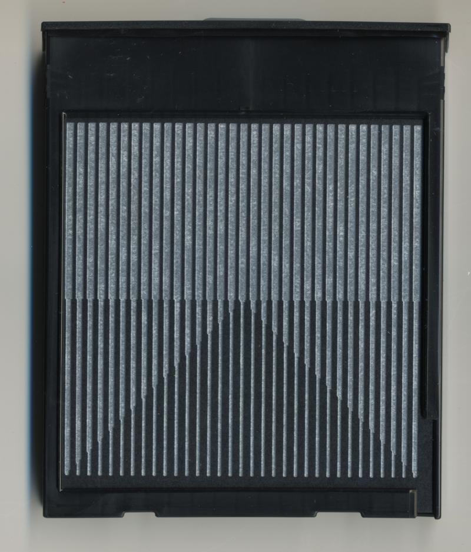
</a>


`UUID: e0caa1919c6d4af3a5478f7e16c3664d`↓

<a href="./archive/00395_003.jpg" target="_blank">
	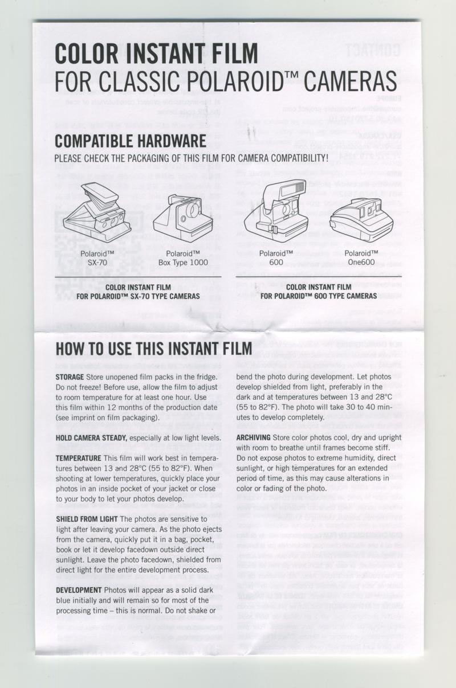
</a>


`UUID: 771ae62e2ca14e40a13c15c815d42ff0`↓

<a href="./archive/00395_004.jpg" target="_blank">
	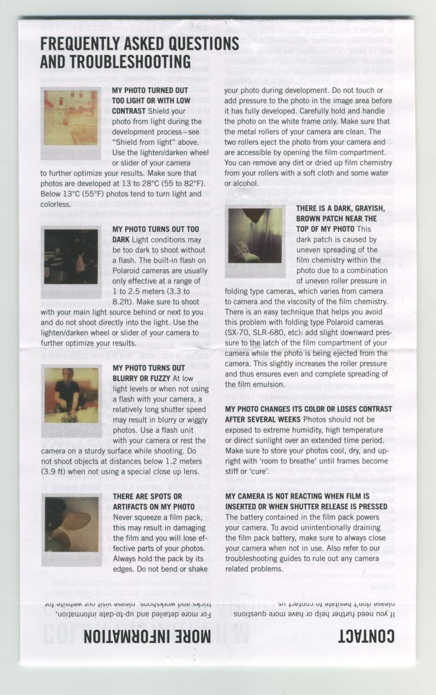
</a>


`UUID: fe686e709acd4d8eb81aa903bc07d146`↓

<a href="./archive/00395_005.jpg" target="_blank">
	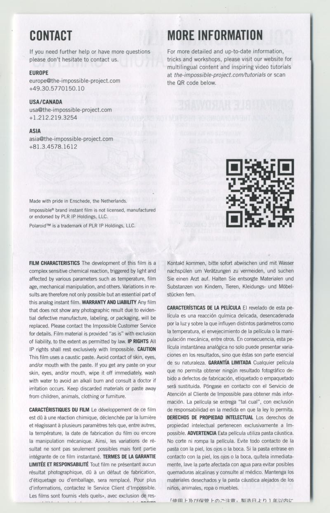
</a>


`UUID: 1bb9712c568140bd86d5d2ba361b85c9`↓

<a href="./archive/00395_006.jpg" target="_blank">
	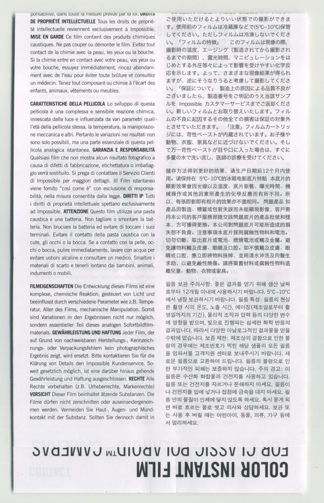
</a>

#### [2013] Kodak Professional Microfilm Type I (ref: a444)

```
Format: 35mm         |  Process : BW      
ISO   : Unknown      |  Expiry  : 2013-12 
Type  : Bulk Roll    |  Quantity: 100ft   
Added : 2025-08-14   |  Author  : Camera.Riley
UUID  : 90304019395a4c62bb9c6fe1cb2ba444
```

<a href="./archive/00172_000.jpg" target="_blank">
	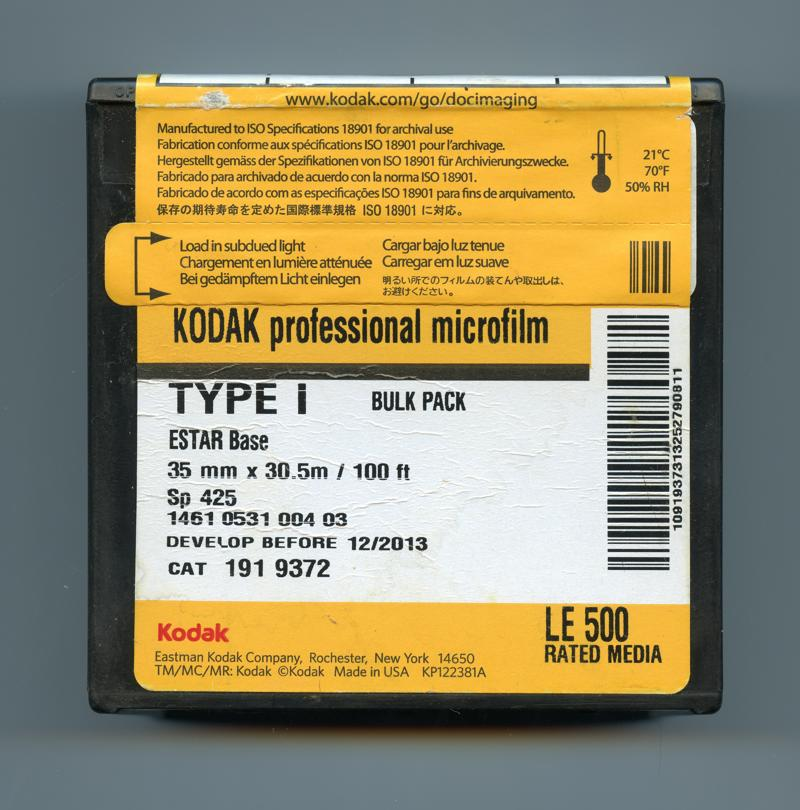
</a>

#### [2014] Ilford HP5 Plus (ref: 072e)

```
Format: 120          |  Process : BW      
ISO   : 400          |  Expiry  : 2014-05 
Type  : Single Pack  |  Quantity: N/A     
Added : 2025-10-13   |  Author  : @recycling.film
UUID  : 3c726f85acc246d99f3e8c55c4cf072e
```

<a href="./archive/00392_000.jpg" target="_blank">
	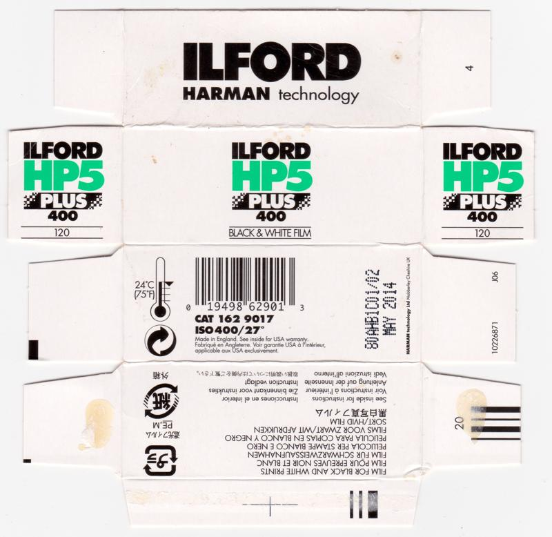
</a>


`UUID: 21e61895c4f64c35a0a1ee7f59988917`↓

<a href="./archive/00392_001.jpg" target="_blank">
	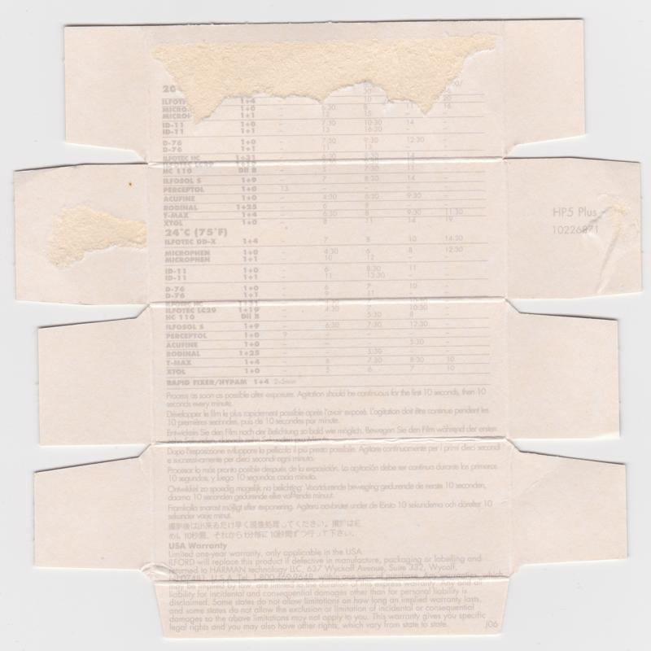
</a>

#### [2014] Kodak Portra 400 (ref: cf9c)

```
Format: 35mm         |  Process : C-41    
ISO   : 400          |  Expiry  : 2014-06 
Type  : Multi-Pack-5 |  Quantity: 36exp   
Added : 2025-08-18   |  Author  : @recycling.film
UUID  : 5bdddffe29bd464cab4630d85485cf9c
```

<a href="./archive/00200_000.jpg" target="_blank">
	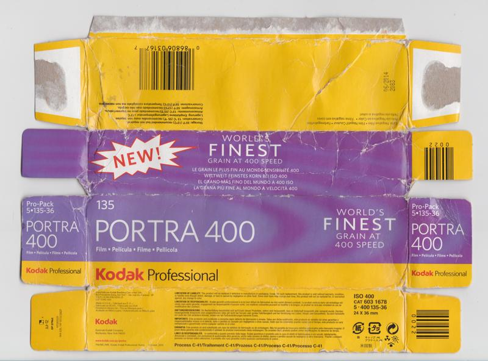
</a>

#### [2014] Fujifilm Fujicolor Natura 1600 (ref: 2e06)

```
Format: 35mm         |  Process : C-41    
ISO   : 1600         |  Expiry  : 2014-11 
Type  : Multi-Pack-3 |  Quantity: 36exp   
Added : 2025-08-14   |  Author  : Camera.Riley
UUID  : 8abda51b18d84ec4939df489457d2e06
```

<a href="./archive/00177_000.jpg" target="_blank">
	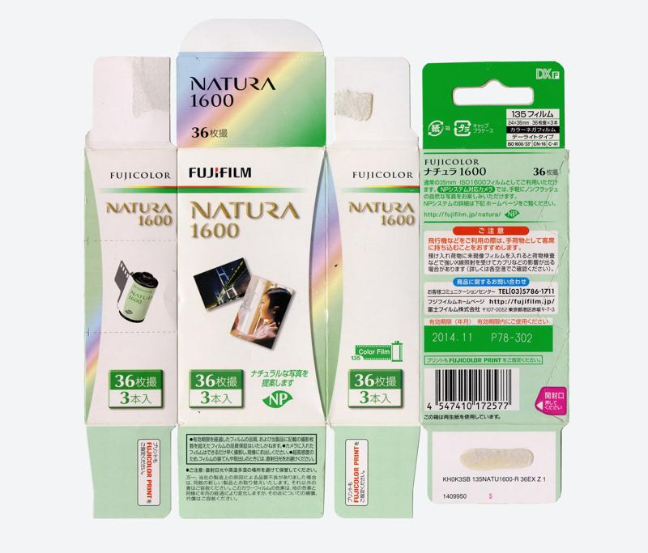
</a>


`UUID: 85bc1b0ff9694798a9f92915ab267978`↓

<a href="./archive/00177_001.jpg" target="_blank">
	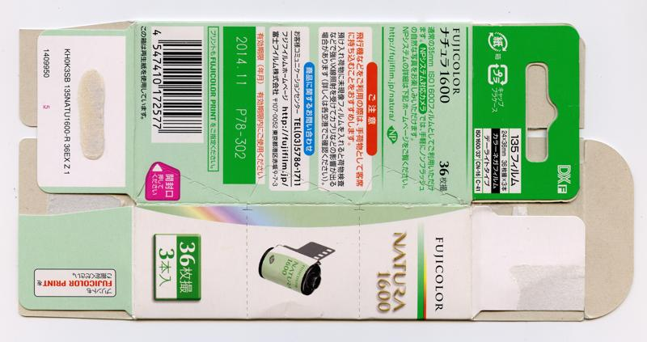
</a>


`UUID: dd126451b04a42b19a705cec886addf0`↓

<a href="./archive/00177_002.jpg" target="_blank">
	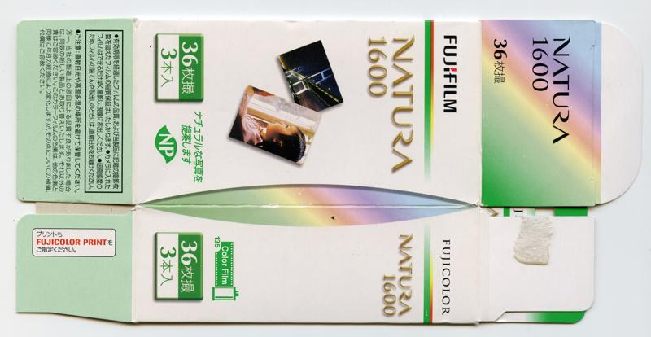
</a>

#### [2014] Fujifilm Fujichrome Provia 400X (ref: 3c08)

```
Format: 120          |  Process : E-6     
ISO   : 400          |  Expiry  : 2014-12 
Type  : Multi-Pack-5 |  Quantity: N/A     
Added : 2025-08-20   |  Author  : @photos.by.qi
UUID  : 3a84e3b505004d069104ff0042d03c08
```

<a href="./archive/00248_000.jpg" target="_blank">
	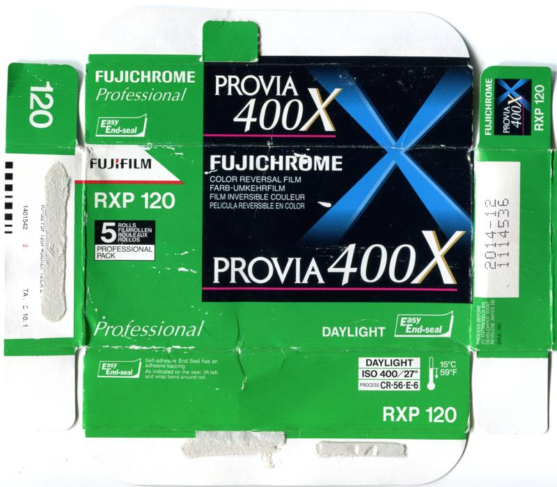
</a>


`UUID: db24477938104d81beddac492c8d637e`↓

<a href="./archive/00248_001.jpg" target="_blank">
	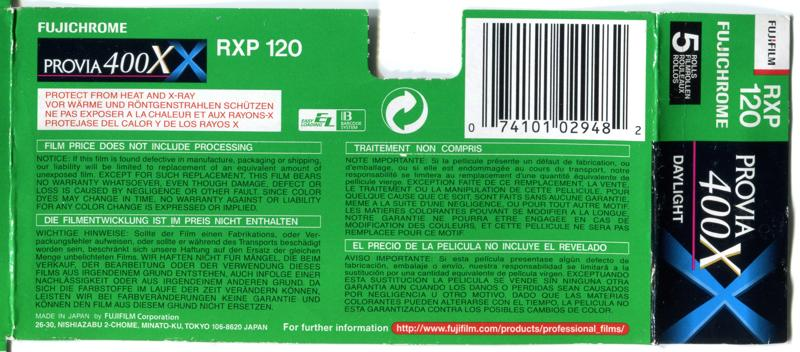
</a>

#### [2015] Fujifilm FP-100C (ref: 5cda)

```
Format: Pack Film    |  Process : Instant 
ISO   : 100          |  Expiry  : 2015-01 
Type  : Single Pack  |  Quantity: 10exp   
Added : 2025-09-01   |  Author  : @recycling.film
UUID  : 9bf3702e732a42adb54727a565645cda
```

<a href="./archive/00277_000.jpg" target="_blank">
	
</a>


`UUID: bfb832790e754aa0ba98a030969ab95d`↓

<a href="./archive/00277_001.jpg" target="_blank">
	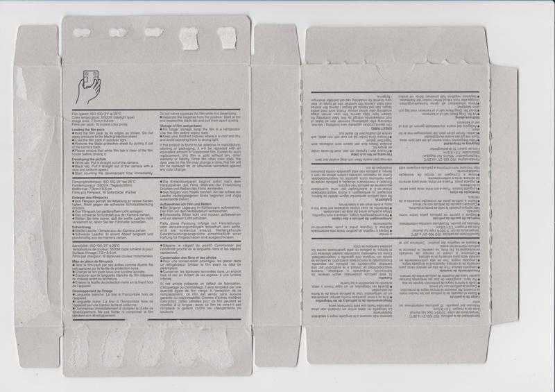
</a>

#### [2015] Lomography Tiger (ref: 5b62)

```
Format: 110          |  Process : C-41    
ISO   : 200          |  Expiry  : 2015-09 
Type  : Single Pack  |  Quantity: 24exp   
Added : 2025-10-14   |  Author  : dekuNukem
UUID  : 141712bb8988495d811441f1e5fb5b62
```

<a href="./archive/00396_000.jpg" target="_blank">
	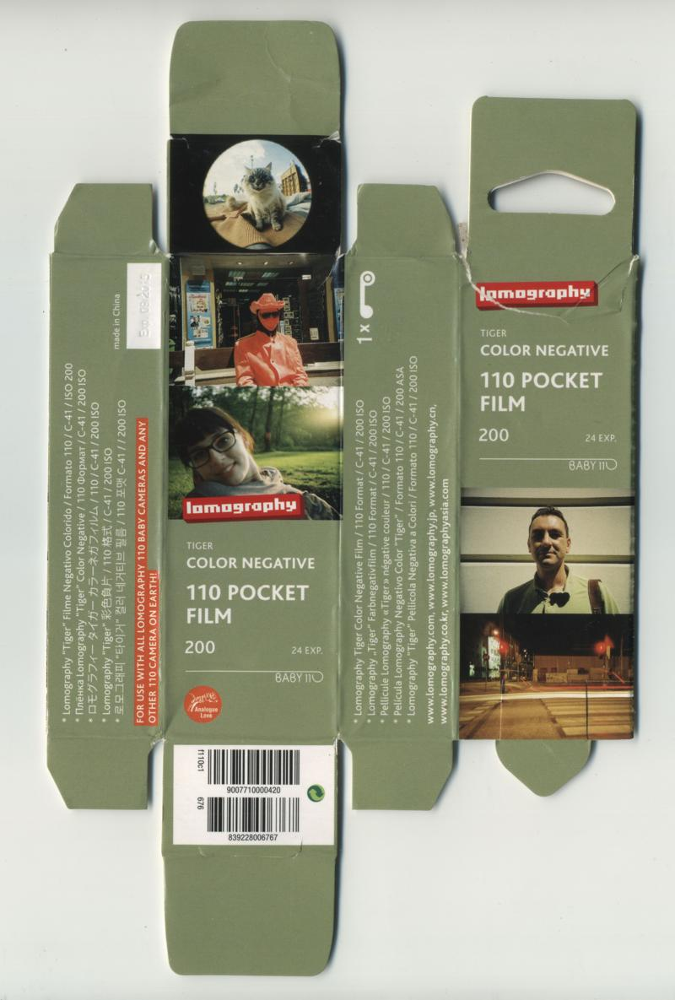
</a>


`UUID: 23cf98004a95479ebb6992d73ee36d36`↓

<a href="./archive/00396_001.jpg" target="_blank">
	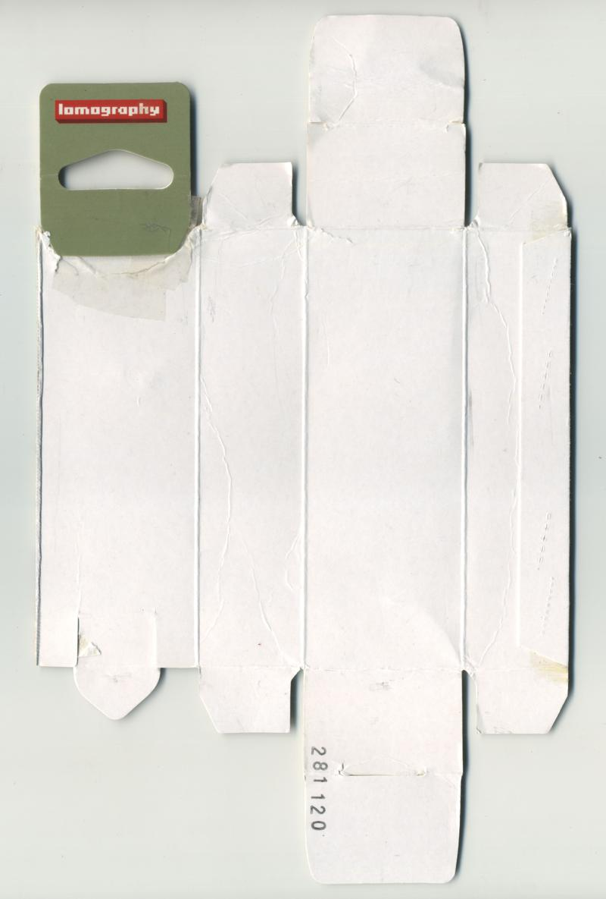
</a>


`UUID: 9275565ac1d046c5a72f553b7f73e124`↓

<a href="./archive/00396_002.jpg" target="_blank">
	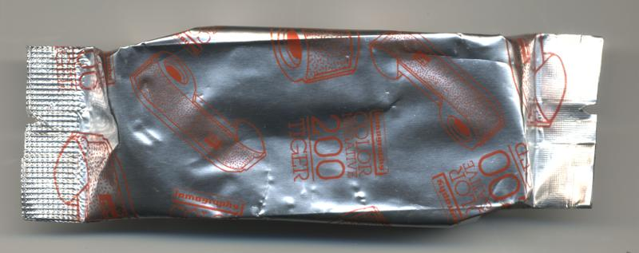
</a>

#### [2015] Lomography Lobster Redscale Negative (ref: 4dcd)

```
Format: 110          |  Process : C-41    
ISO   : 200          |  Expiry  : 2015-10 
Type  : Single Pack  |  Quantity: 24exp   
Added : 2025-10-21   |  Author  : dekuNukem
UUID  : bfb2bdd4749b474f8fe1f971f2a14dcd
```

<a href="./archive/00422_000.jpg" target="_blank">
	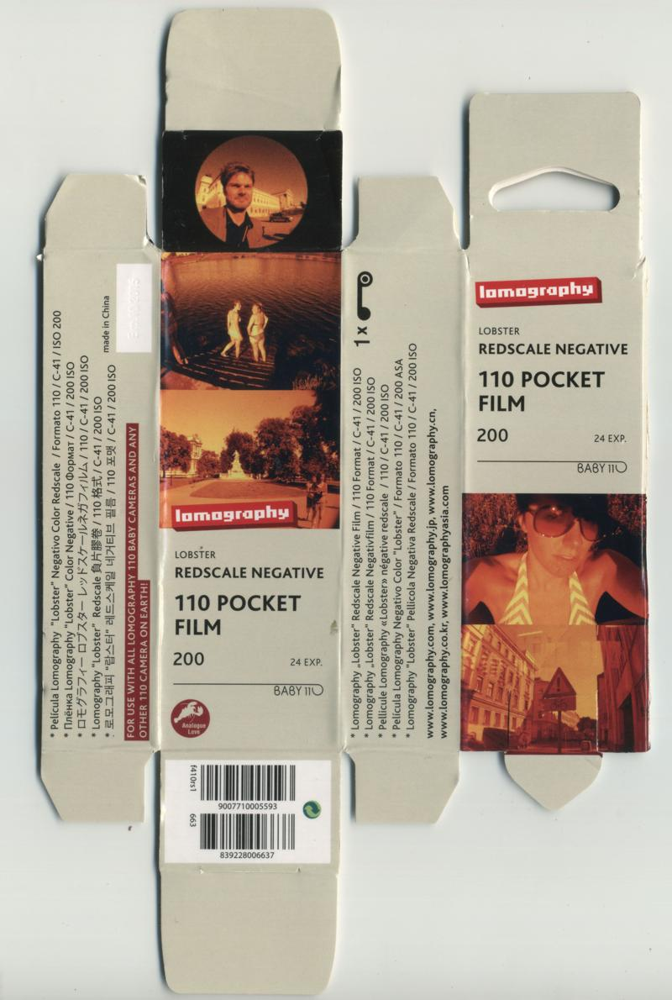
</a>


`UUID: e5403e7603b24ed995890c4faa3ab25b`↓

<a href="./archive/00422_001.jpg" target="_blank">
	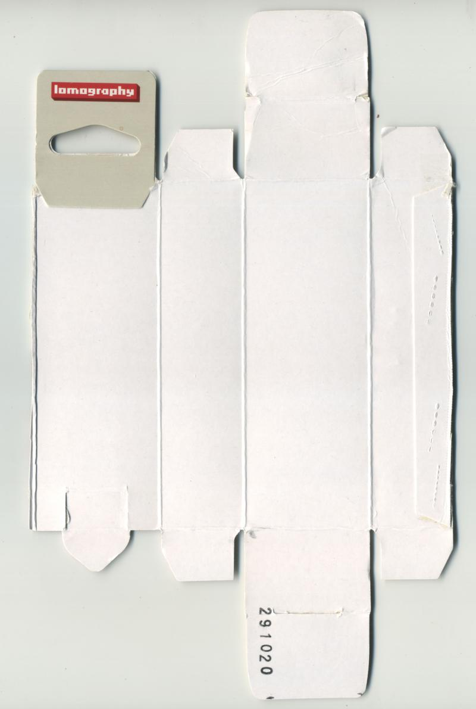
</a>

#### [2018] CineStill 800T (ref: c86a)

```
Format: 120          |  Process : C-41    
ISO   : 800          |  Expiry  : 2018-03 
Type  : Single Pack  |  Quantity: N/A     
Added : 2025-01-04   |  Author  : dekuNukem
UUID  : 53253eca96d841f5b98bfb3590fec86a
```

<a href="./archive/00006_000.jpg" target="_blank">
	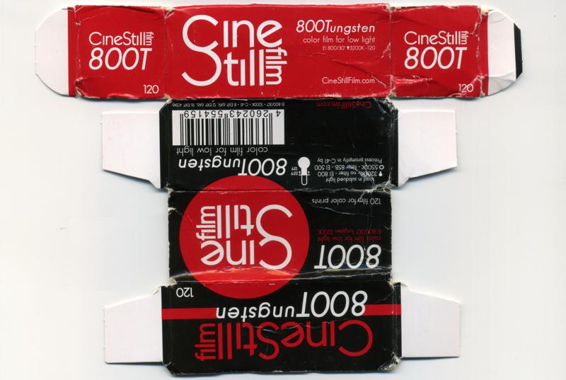
</a>


`UUID: 6576b3b48e8244469a692f2e0edcd1a6`↓

<a href="./archive/00006_001.jpg" target="_blank">
	
</a>

#### [2018] Agfa Vista Plus 200 (ref: f5f7)

```
Format: 35mm         |  Process : C-41    
ISO   : 200          |  Expiry  : 2018-08 
Type  : Single Pack  |  Quantity: 24exp   
Added : 2025-10-06   |  Author  : @Hol.m35
UUID  : ca7affc001374aa882b4c2edd3e8f5f7
```

<a href="./archive/00371_000.jpg" target="_blank">
	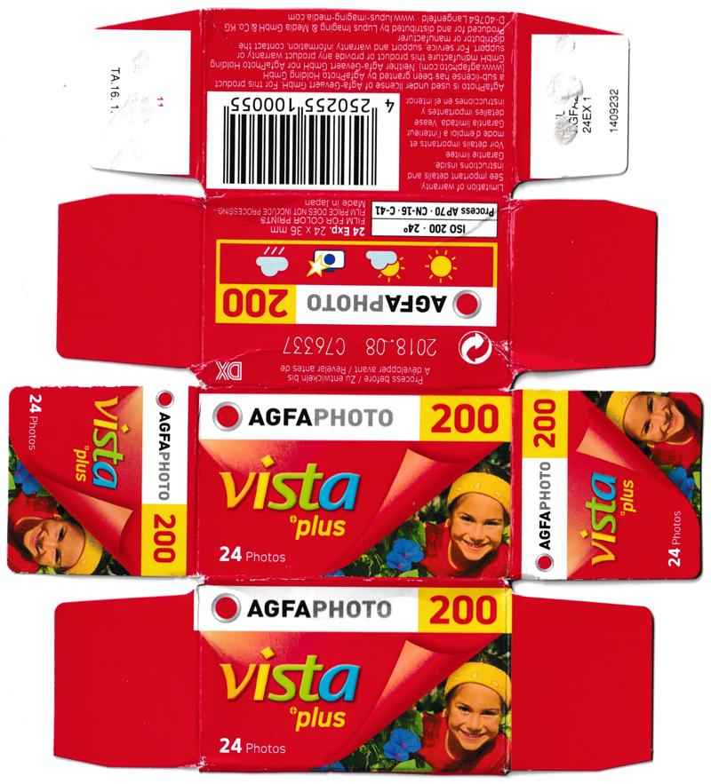
</a>


`UUID: e3caf8b1d9ec4d0495a5908c202bca61`↓

<a href="./archive/00371_001.jpg" target="_blank">
	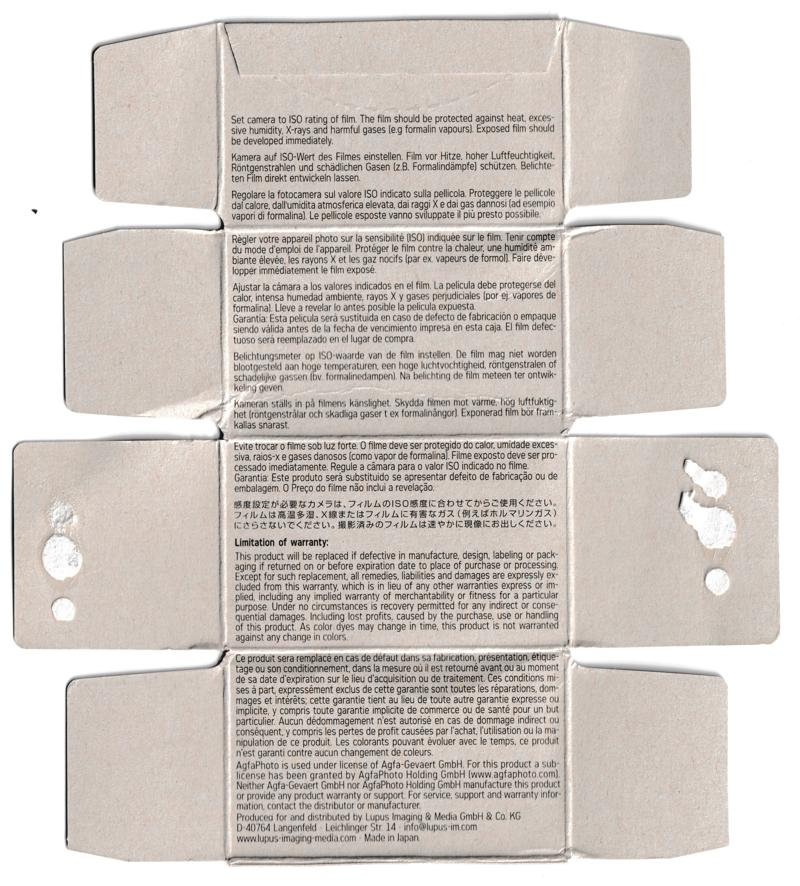
</a>

#### [2018] Fujifilm Fujicolor Pro 400H (ref: 66e3)

```
Format: 120          |  Process : C-41    
ISO   : 400          |  Expiry  : 2018-09 
Type  : Multi-Pack-5 |  Quantity: N/A     
Added : 2025-01-04   |  Author  : dekuNukem
UUID  : 0d89ecf11f3c46deb52171aa909566e3
```

<a href="./archive/00022_000.jpg" target="_blank">
	
</a>

#### [2019] Agfa Vista Plus 200 (ref: f08a)

```
Format: 35mm         |  Process : C-41    
ISO   : 200          |  Expiry  : 2019-01 
Type  : Single Pack  |  Quantity: 36exp   
Added : 2025-08-20   |  Author  : @photos.by.qi
UUID  : b1c4d56515954c8d98bd0b8f9591f08a
```

<a href="./archive/00257_000.jpg" target="_blank">
	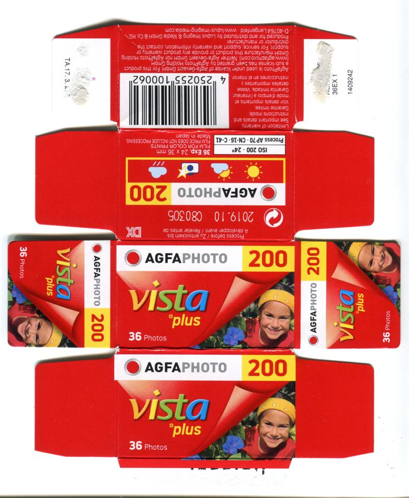
</a>


`UUID: 0088411d14c547aa96ea5d28bf04d9ea`↓

<a href="./archive/00257_001.jpg" target="_blank">
	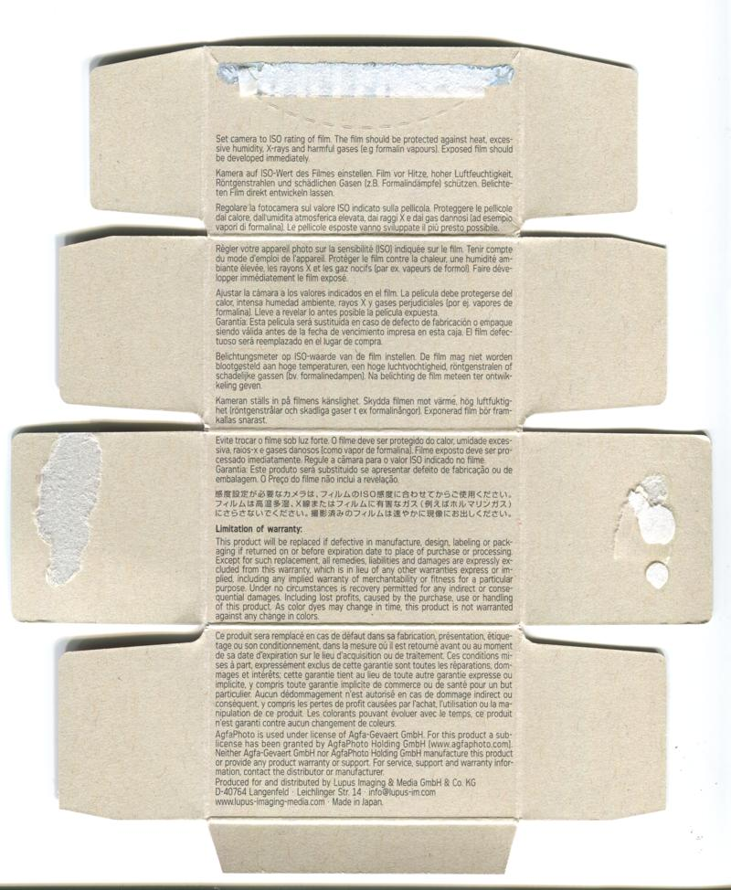
</a>

#### [2019] Fujifilm Fujicolor Professional (ref: 02f7)

```
Format: 35mm         |  Process : C-41    
ISO   : 400          |  Expiry  : 2019-12 
Type  : Single Pack  |  Quantity: 36exp   
Added : 2025-08-20   |  Author  : @photos.by.qi
UUID  : 8f934c948478459386443596e74c02f7
```

<a href="./archive/00219_000.jpg" target="_blank">
	
</a>

#### [2020] Fujifilm Fujicolor C200 (ref: 2ff8)

```
Format: 35mm         |  Process : C-41    
ISO   : 200          |  Expiry  : 2020-03 
Type  : Single Pack  |  Quantity: 36exp   
Added : 2025-08-18   |  Author  : @recycling.film
UUID  : 271054727291471392db72d5556f2ff8
```

<a href="./archive/00202_000.jpg" target="_blank">
	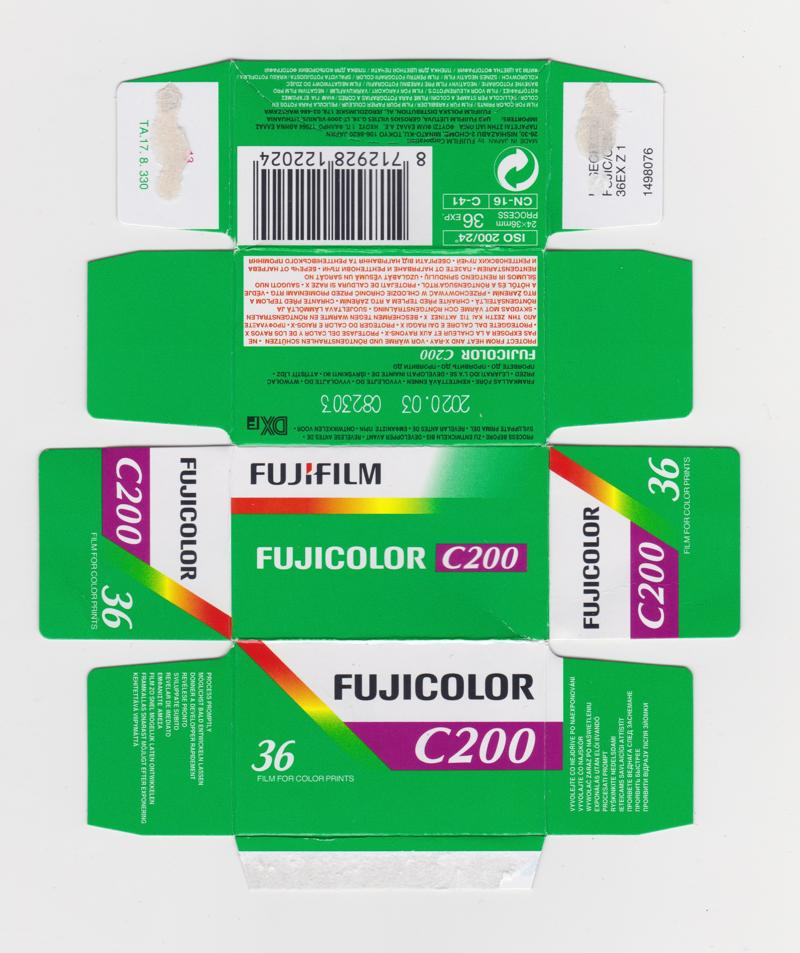
</a>

#### [2020] Fujifilm Fujichrome Provia 100F (ref: 356d)

```
Format: 35mm         |  Process : E-6     
ISO   : 100          |  Expiry  : 2020-09 
Type  : Single Pack  |  Quantity: 36exp   
Added : 2025-02-21   |  Author  : @seklerek
UUID  : a3603dbdd8ca49b893c8ce2bc76f356d
```

<a href="./archive/00055_000.jpg" target="_blank">
	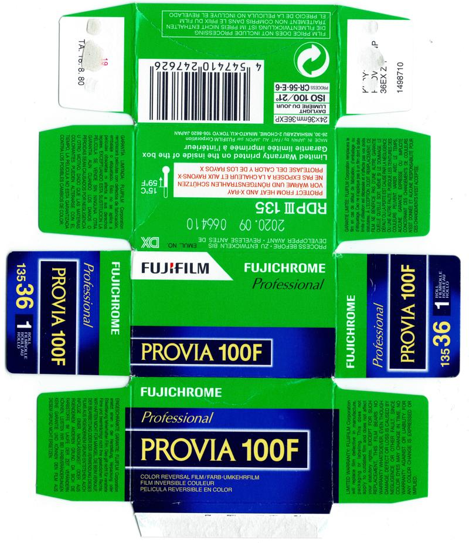
</a>

#### [2020] Building 2 250D (ref: 7d4f)

```
Format: 35mm         |  Process : ECN-2   
ISO   : 250          |  Expiry  : 2020-12 
Type  : Single Pack  |  Quantity: 36exp   
Added : 2025-08-20   |  Author  : @photos.by.qi
UUID  : 693d77ba06bc4823bd4f43112d957d4f
```

<a href="./archive/00211_000.jpg" target="_blank">
	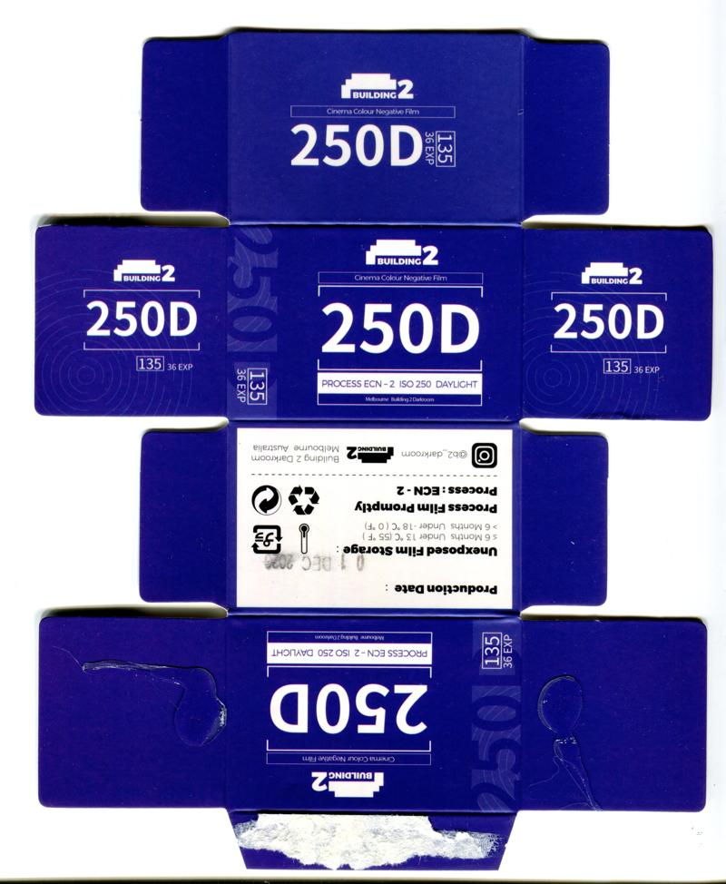
</a>

#### [2021] Building 2 200T (ref: c025)

```
Format: 35mm         |  Process : ECN-2   
ISO   : 200          |  Expiry  : 2021-06 
Type  : Single Pack  |  Quantity: 36exp   
Added : 2025-08-20   |  Author  : @photos.by.qi
UUID  : 4e05091526684626b09f6f957dd9c025
```

<a href="./archive/00210_000.jpg" target="_blank">
	
</a>

#### [2021] Building 2 500T (ref: 70d9)

```
Format: 35mm         |  Process : ECN-2   
ISO   : 500          |  Expiry  : 2021-06 
Type  : Single Pack  |  Quantity: 36exp   
Added : 2025-08-20   |  Author  : @photos.by.qi
UUID  : 2e9e8e40ac154f4f9ac497837e2470d9
```

<a href="./archive/00212_000.jpg" target="_blank">
	
</a>

#### [2021] Building 2 50D (ref: e548)

```
Format: 35mm         |  Process : ECN-2   
ISO   : 50           |  Expiry  : 2021-06 
Type  : Single Pack  |  Quantity: 36exp   
Added : 2025-08-20   |  Author  : @photos.by.qi
UUID  : f0c8cbdc08d146ba8690d19a70dbe548
```

<a href="./archive/00213_000.jpg" target="_blank">
	
</a>

#### [2021] Rollei RPX 100 (ref: 7cd1)

```
Format: 35mm         |  Process : BW      
ISO   : 100          |  Expiry  : 2021-11 
Type  : Single Pack  |  Quantity: 36exp   
Added : 2025-08-21   |  Author  : Pelicram
UUID  : 201ce1e1831a483ab7fd569cc50e7cd1
```

<a href="./archive/00258_000.jpg" target="_blank">
	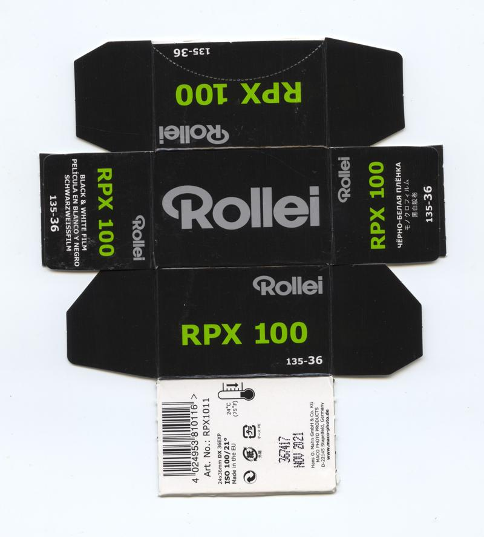
</a>


`UUID: f8b9f798c2d34459955fd96c84c414b3`↓

<a href="./archive/00258_001.jpg" target="_blank">
	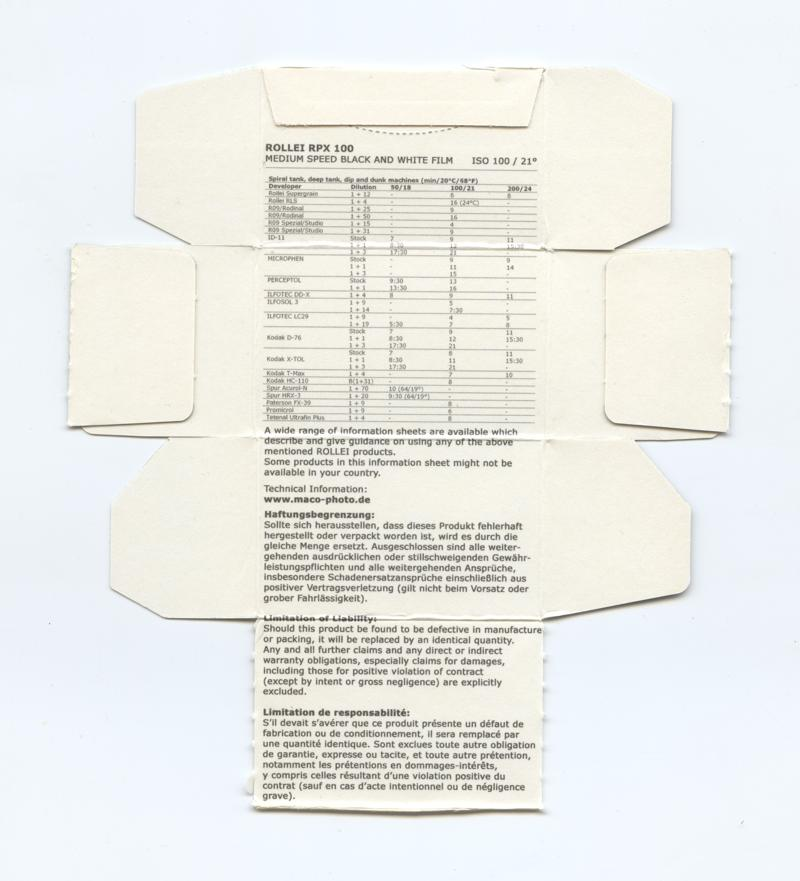
</a>

#### [2022] Kodak Ektar 100 (ref: 4631)

```
Format: 120          |  Process : C-41    
ISO   : 100          |  Expiry  : 2022-04 
Type  : Multi-Pack-5 |  Quantity: N/A     
Added : 2025-08-20   |  Author  : @photos.by.qi
UUID  : 22bb063ec2ca4f2ea5b9f4be4dce4631
```

<a href="./archive/00251_000.jpg" target="_blank">
	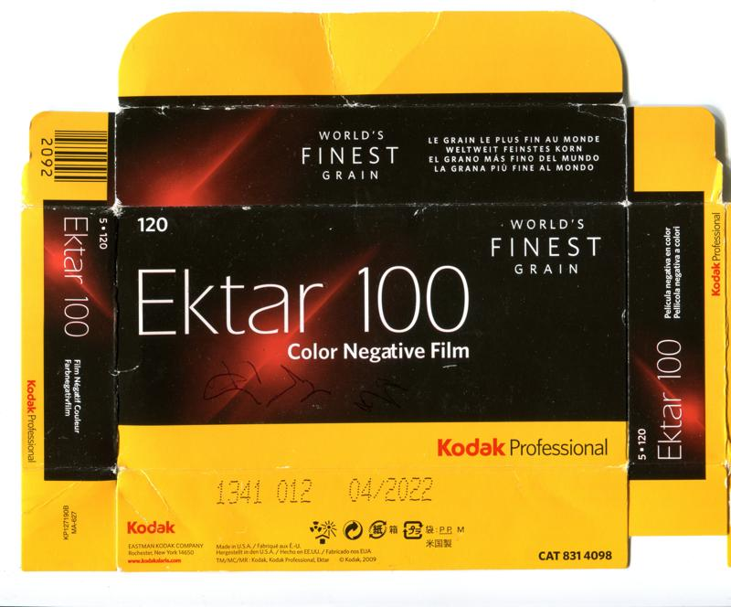
</a>


`UUID: 5ee59977ab8f4902b82e22de1767d131`↓

<a href="./archive/00251_001.jpg" target="_blank">
	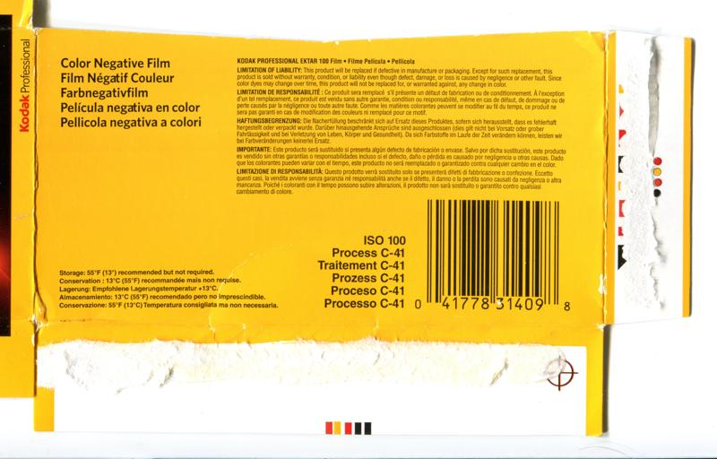
</a>

#### [2022] Film Never Die IRO (ref: 2a22)

```
Format: 35mm         |  Process : C-41    
ISO   : 400          |  Expiry  : 2022-05 
Type  : Single Pack  |  Quantity: 27exp   
Added : 2025-08-20   |  Author  : @photos.by.qi
UUID  : 03b12b9d23dc4e059a9149ca4f682a22
```

<a href="./archive/00215_000.jpg" target="_blank">
	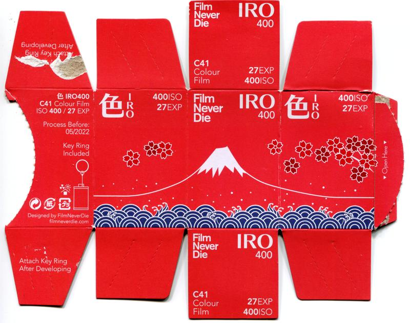
</a>

#### [2022] Film Never Die Kiro (ref: 796d)

```
Format: 35mm         |  Process : C-41    
ISO   : 400          |  Expiry  : 2022-05 
Type  : Single Pack  |  Quantity: 27exp   
Added : 2025-08-20   |  Author  : @photos.by.qi
UUID  : a6bb919bc40b4000a753bf9d3367796d
```

<a href="./archive/00216_000.jpg" target="_blank">
	
</a>

#### [2022] Ilford HP5 Plus (ref: c725)

```
Format: 35mm         |  Process : BW      
ISO   : 400          |  Expiry  : 2022-08 
Type  : Single Pack  |  Quantity: 36exp   
Added : 2025-07-28   |  Author  : @recycling.film
UUID  : fcbc3377fa3d4ca9b58779f86ed7c725
```

<a href="./archive/00090_000.jpg" target="_blank">
	
</a>

#### [2022] Lomography Lomochrome Purple (ref: 8b00)

```
Format: 35mm         |  Process : C-41    
ISO   : 100          |  Expiry  : 2022-08 
Type  : Single Pack  |  Quantity: 36exp   
Added : 2025-08-20   |  Author  : @photos.by.qi
UUID  : 5589454d652e4771b024a9901acb8b00
```

<a href="./archive/00226_000.jpg" target="_blank">
	
</a>

#### [2022] Rollei RPX 400 (ref: c097)

```
Format: 35mm         |  Process : BW      
ISO   : 400          |  Expiry  : 2022-09 
Type  : Single Pack  |  Quantity: 36exp   
Added : 2025-08-21   |  Author  : Pelicram
UUID  : 1b741df3125e4a77bd28c50ce3dcc097
```

<a href="./archive/00259_000.jpg" target="_blank">
	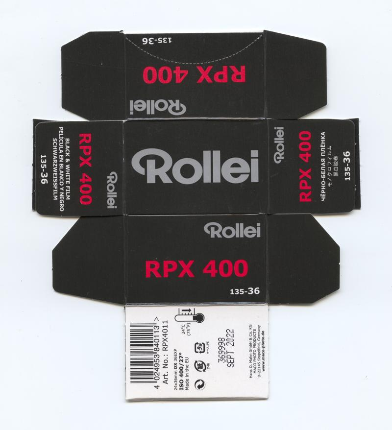
</a>


`UUID: 8fbb971a033b4a848831c97822b67601`↓

<a href="./archive/00259_001.jpg" target="_blank">
	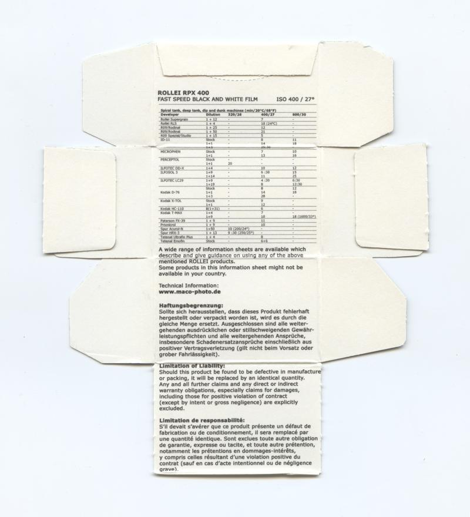
</a>

#### [2022] Kodak Portra 800 (ref: 21f9)

```
Format: 120          |  Process : C-41    
ISO   : 800          |  Expiry  : 2022-10 
Type  : Multi-Pack-5 |  Quantity: N/A     
Added : 2025-08-20   |  Author  : @photos.by.qi
UUID  : 3663afb2b2d340d3a5c9e0d0e9f021f9
```

<a href="./archive/00240_000.jpg" target="_blank">
	
</a>


`UUID: 63ef586862154b94aeccdbdb4227ad5c`↓

<a href="./archive/00240_001.jpg" target="_blank">
	
</a>

#### [2022] Fujifilm Fujicolor Pro 400H (ref: ff20)

```
Format: 35mm         |  Process : C-41    
ISO   : 400          |  Expiry  : 2022-11 
Type  : Single Pack  |  Quantity: 36exp   
Added : 2025-08-20   |  Author  : @photos.by.qi
UUID  : 3167bab31b134176a6d637dc1491ff20
```

<a href="./archive/00250_000.jpg" target="_blank">
	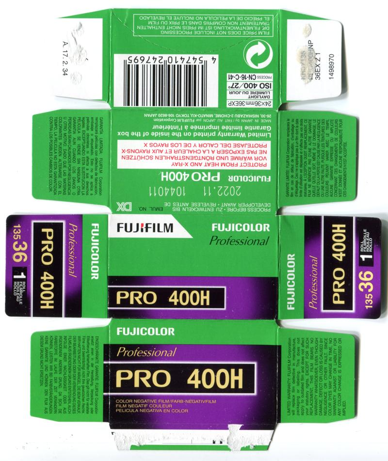
</a>

#### [2023] Kodak ProImage 100 (ref: fe32)

```
Format: 35mm         |  Process : C-41    
ISO   : 100          |  Expiry  : 2023-01 
Type  : Multi-Pack-5 |  Quantity: 36exp   
Added : 2025-08-20   |  Author  : @photos.by.qi
UUID  : 76cf680b7e1a407f92eb84541d21fe32
```

<a href="./archive/00239_000.jpg" target="_blank">
	
</a>

#### [2023] Kodak UltraMax (ref: 3b23)

```
Format: 35mm         |  Process : C-41    
ISO   : 400          |  Expiry  : 2023-03 
Type  : Multi-Pack-3 |  Quantity: 24exp   
Added : 2025-08-20   |  Author  : @photos.by.qi
UUID  : 1a68334cdfc146b98a7fa95672e33b23
```

<a href="./archive/00235_000.jpg" target="_blank">
	
</a>

#### [2023] Lomography Lomochrome Metropolis (ref: 5546)

```
Format: 35mm         |  Process : C-41    
ISO   : 100          |  Expiry  : 2023-03 
Type  : Single Pack  |  Quantity: 36exp   
Added : 2025-08-20   |  Author  : @photos.by.qi
UUID  : eba9730505104dfd8c12254eeafd5546
```

<a href="./archive/00236_000.jpg" target="_blank">
	
</a>


`UUID: 415e6aeb12db4efbba5f290d09d7beba`↓

<a href="./archive/00236_001.jpg" target="_blank">
	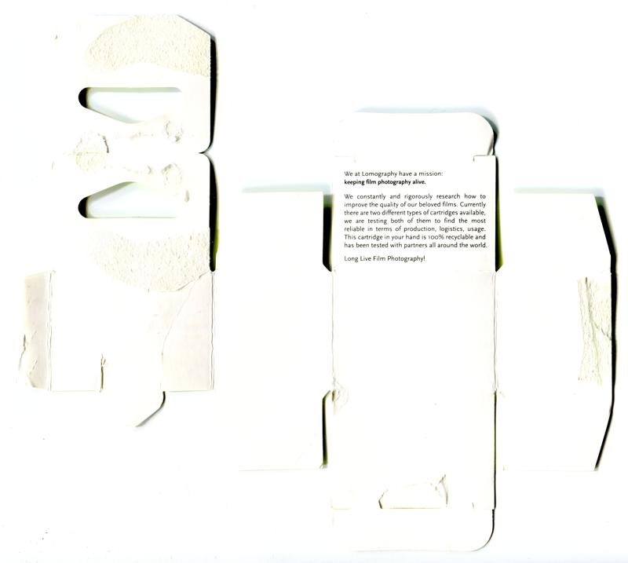
</a>

#### [2023] CineStill 50D (ref: 3452)

```
Format: 35mm         |  Process : C-41    
ISO   : 50           |  Expiry  : 2023-05 
Type  : Single Pack  |  Quantity: 36exp   
Added : 2025-08-20   |  Author  : @photos.by.qi
UUID  : 9213a1fbffc44178878f7bd9c5d33452
```

<a href="./archive/00254_000.jpg" target="_blank">
	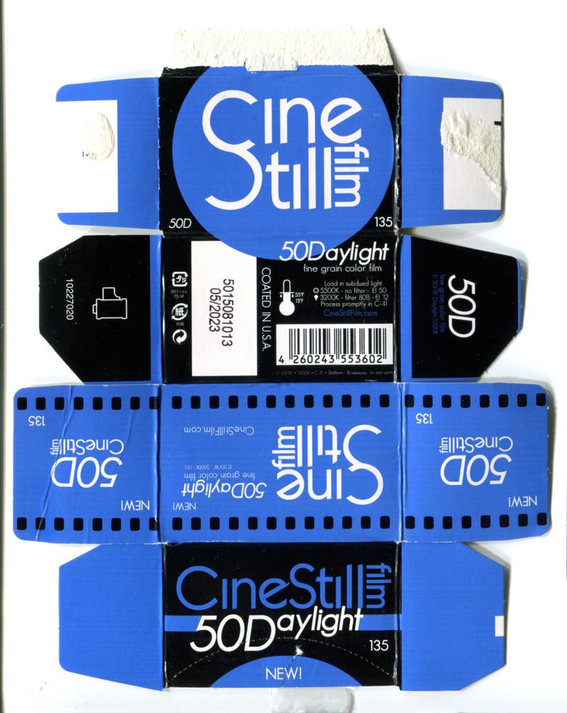
</a>


`UUID: 219350408c3c45c7b9c23de73db1ed40`↓

<a href="./archive/00254_001.jpg" target="_blank">
	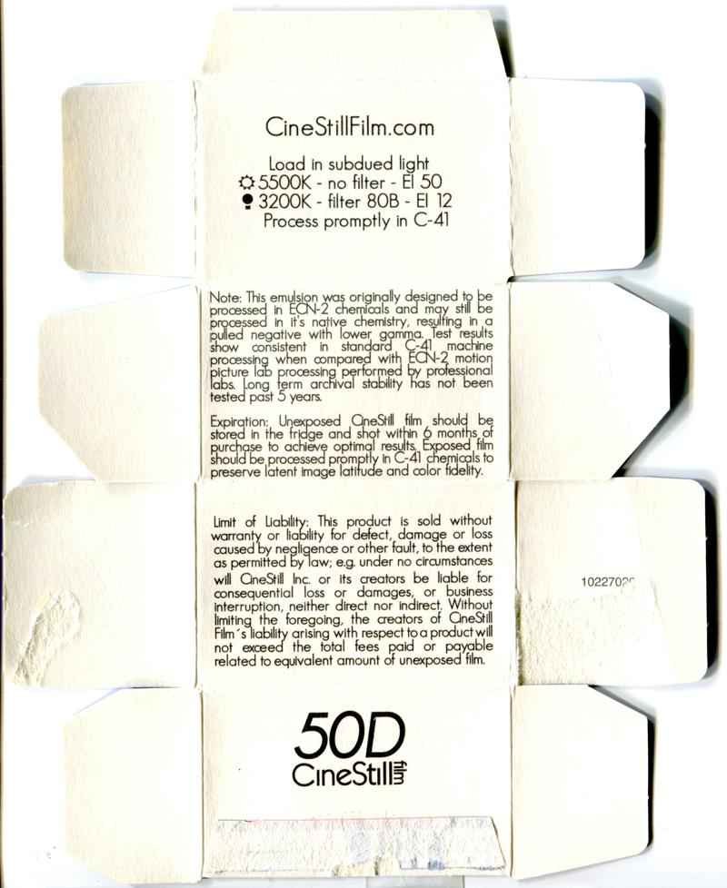
</a>

#### [2023] Kodak Gold (ref: d48d)

```
Format: 35mm         |  Process : C-41    
ISO   : 200          |  Expiry  : 2023-06 
Type  : Single Pack  |  Quantity: 36exp   
Added : 2025-08-20   |  Author  : @photos.by.qi
UUID  : e0db5edb5d3046e99d019b901088d48d
```

<a href="./archive/00233_000.jpg" target="_blank">
	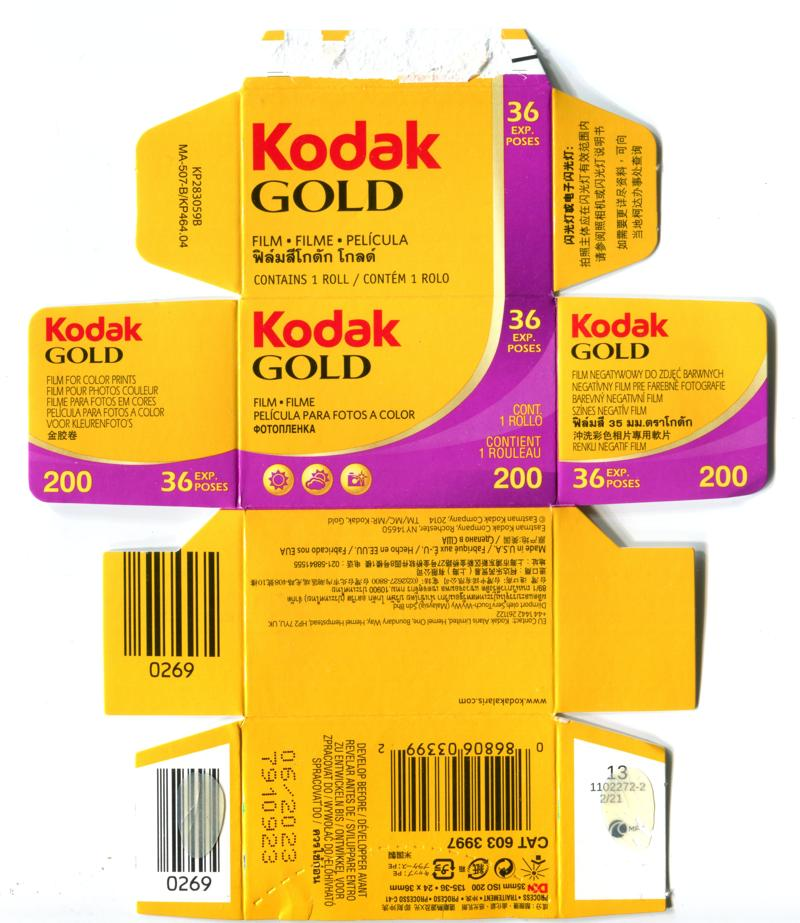
</a>

#### [2023] Kodak TMAX 100 (ref: b3b1)

```
Format: 120          |  Process : BW      
ISO   : 100          |  Expiry  : 2023-07 
Type  : Multi-Pack-5 |  Quantity: N/A     
Added : 2025-05-24   |  Author  : dekuNukem
UUID  : 9a43d0c373354e1989ea7bb7a43db3b1
```

<a href="./archive/00069_000.jpg" target="_blank">
	
</a>

#### [2023] CineStill BWXX (ref: 66eb)

```
Format: 120          |  Process : D96     
ISO   : 200-400      |  Expiry  : 2023-10 
Type  : Single Pack  |  Quantity: N/A     
Added : 2025-08-20   |  Author  : @photos.by.qi
UUID  : e4493fbb55e044edaaca55ecd22366eb
```

<a href="./archive/00256_000.jpg" target="_blank">
	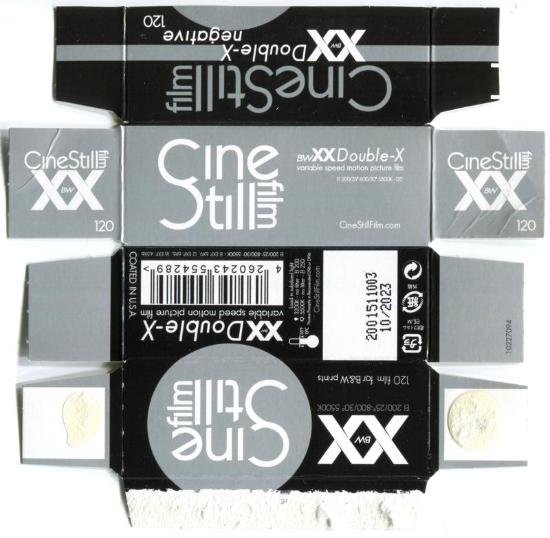
</a>


`UUID: 6e4b285456d1438ab0cdad81440b9761`↓

<a href="./archive/00256_001.jpg" target="_blank">
	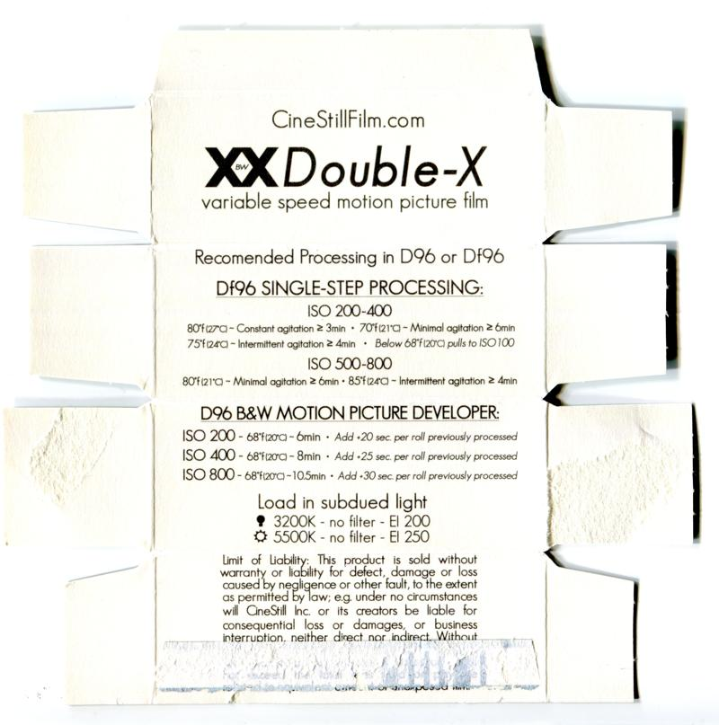
</a>

#### [2023] Fujifilm Fujicolor C200 (ref: a0de)

```
Format: 35mm         |  Process : C-41    
ISO   : 200          |  Expiry  : 2023-10 
Type  : Multi-Pack-2 |  Quantity: 36exp   
Added : 2025-08-20   |  Author  : @photos.by.qi
UUID  : b290e4b860364420924596fc3330a0de
```

<a href="./archive/00220_000.jpg" target="_blank">
	
</a>

#### [2024] Kodak Ektar 100 (ref: 95ec)

```
Format: 35mm         |  Process : C-41    
ISO   : 100          |  Expiry  : 2024-01 
Type  : Single Pack  |  Quantity: 36exp   
Added : 2025-08-20   |  Author  : @photos.by.qi
UUID  : eef92f5fa5b244518890b1ba52b895ec
```

<a href="./archive/00224_000.jpg" target="_blank">
	
</a>

#### [2024] Mr. Negative 250D (ref: 3574)

```
Format: 35mm         |  Process : ECN-2   
ISO   : 250          |  Expiry  : 2024-01 
Type  : Single Pack  |  Quantity: 36exp   
Added : 2025-09-11   |  Author  : @sachynmital
UUID  : e5b29575691e43d8bc17578978083574
```

<a href="./archive/00321_000.jpg" target="_blank">
	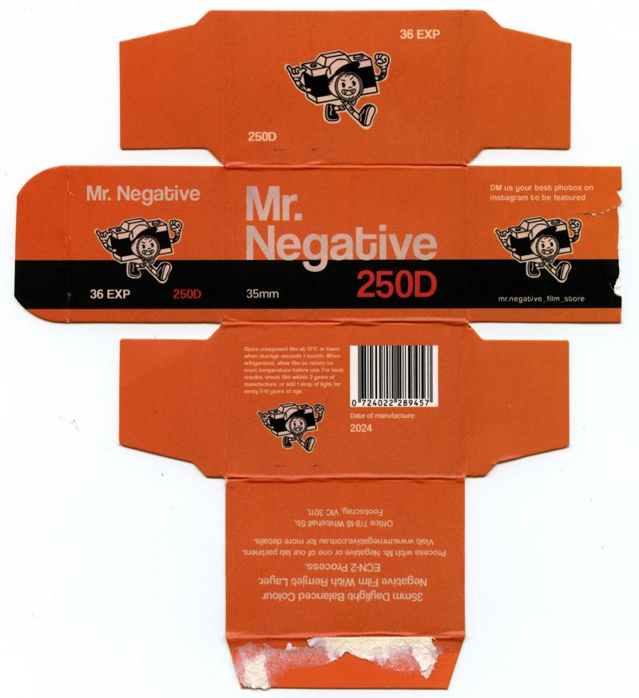
</a>

#### [2024] Mr. Negative Silver Screen Negative (ref: c968)

```
Format: 35mm         |  Process : ECN-2   
ISO   : 200          |  Expiry  : 2024-01 
Type  : Single Pack  |  Quantity: 36exp   
Added : 2025-09-11   |  Author  : @sachynmital
UUID  : 4acd5aeda3a34bc89b646a14bb4dc968
```

<a href="./archive/00323_000.jpg" target="_blank">
	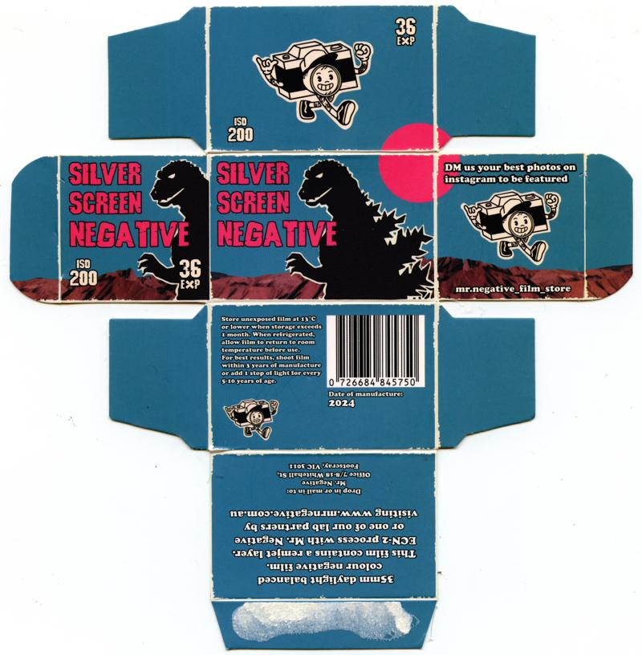
</a>

#### [2024] Alien Film 5222/XX (ref: 3e49)

```
Format: 35mm         |  Process : BW      
ISO   : 250          |  Expiry  : 2024-06 
Type  : Single Pack  |  Quantity: 36exp   
Added : 2025-05-24   |  Author  : dekuNukem
UUID  : 9984ed6c13cd4be496e7e4b58e313e49
```

<a href="./archive/00057_000.jpg" target="_blank">
	
</a>

#### [2024] CineStill 400Dynamic (ref: 88dc)

```
Format: 120          |  Process : C-41    
ISO   : 400          |  Expiry  : 2024-06 
Type  : Single Pack  |  Quantity: N/A     
Added : 2025-08-20   |  Author  : @photos.by.qi
UUID  : 9e2bc75381ca4ca68e59dbf6c3a388dc
```

<a href="./archive/00255_000.jpg" target="_blank">
	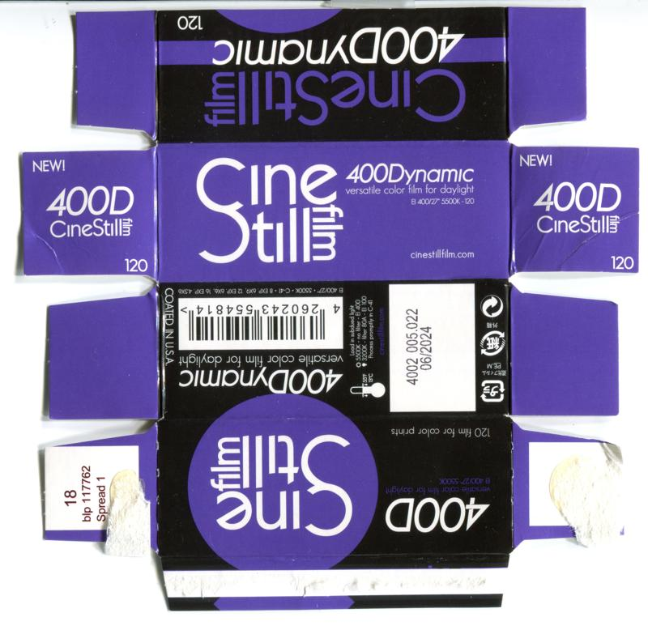
</a>


`UUID: 42d565d0fdbc4e12bcc11d172b36f779`↓

<a href="./archive/00255_001.jpg" target="_blank">
	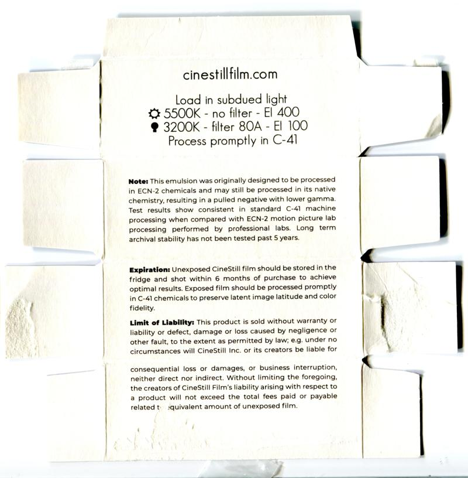
</a>

#### [2024] Shanghai GP3 (ref: 52aa)

```
Format: 127          |  Process : BW      
ISO   : 100          |  Expiry  : 2024-07 
Type  : Single Pack  |  Quantity: N/A     
Added : 2025-01-21   |  Author  : @ob.skura
UUID  : 0e16f7ae50164c658acd22b8d62e52aa
```

<a href="./archive/00050_000.jpg" target="_blank">
	
</a>

#### [2024] Fujifilm Fujicolor Superia X-TRA (ref: 8923)

```
Format: 35mm         |  Process : C-41    
ISO   : 400          |  Expiry  : 2024-08 
Type  : Multi-Pack-2 |  Quantity: 36exp   
Added : 2025-08-20   |  Author  : @photos.by.qi
UUID  : de6b17f5230e4052b6b166977a418923
```

<a href="./archive/00231_000.jpg" target="_blank">
	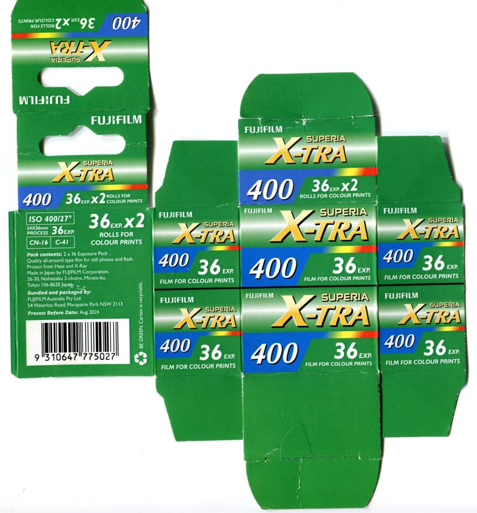
</a>

#### [2024] Ilford Delta 100 Professional (ref: eb8d)

```
Format: 120          |  Process : BW      
ISO   : 100          |  Expiry  : 2024-08 
Type  : Single Pack  |  Quantity: N/A     
Added : 2025-01-21   |  Author  : @ob.skura
UUID  : e39c5eca4e3e4e5badfa00ee512deb8d
```

<a href="./archive/00048_000.jpg" target="_blank">
	
</a>


`UUID: e4c76c5b957347178af448f4aa6001d0`↓

<a href="./archive/00048_001.jpg" target="_blank">
	
</a>

#### [2024] Kodak Portra 400 (ref: 9f18)

```
Format: 120          |  Process : C-41    
ISO   : 400          |  Expiry  : 2024-08 
Type  : Multi-Pack-5 |  Quantity: N/A     
Added : 2025-08-20   |  Author  : @photos.by.qi
UUID  : 12ee41c6f8fe493fbda516802e039f18
```

<a href="./archive/00246_000.jpg" target="_blank">
	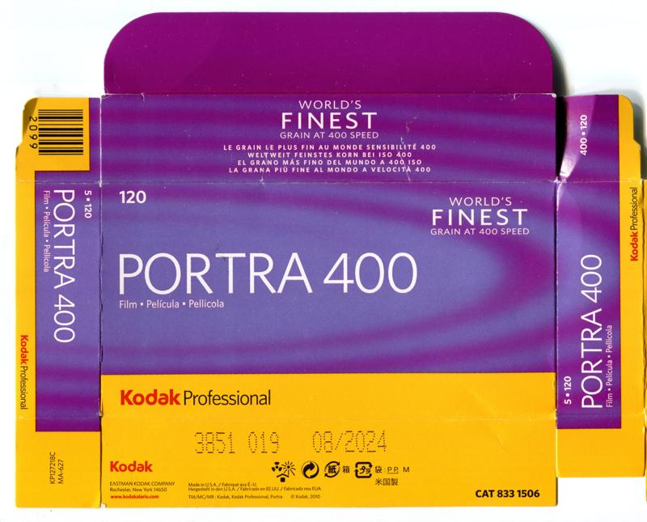
</a>


`UUID: 6407fec85c4344a1bbc2ae930e51ae8e`↓

<a href="./archive/00246_001.jpg" target="_blank">
	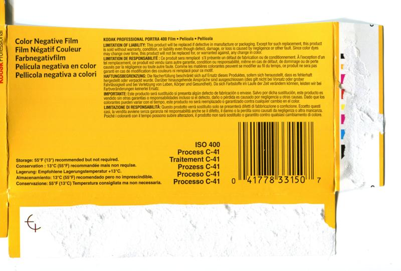
</a>

#### [2024] Kodak Gold (ref: 6587)

```
Format: 35mm         |  Process : C-41    
ISO   : 200          |  Expiry  : 2024-09 
Type  : Single Pack  |  Quantity: 36exp   
Added : 2025-08-20   |  Author  : @photos.by.qi
UUID  : 99836199940848569bab40a438546587
```

<a href="./archive/00252_000.jpg" target="_blank">
	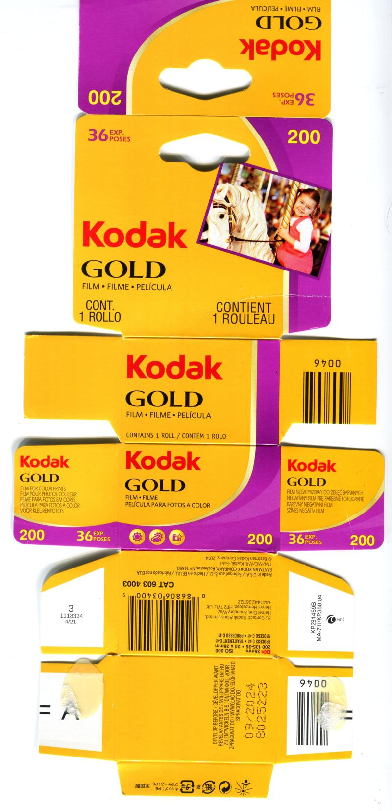
</a>


`UUID: b9bddee9f550460c837c5489aff72400`↓

<a href="./archive/00252_001.jpg" target="_blank">
	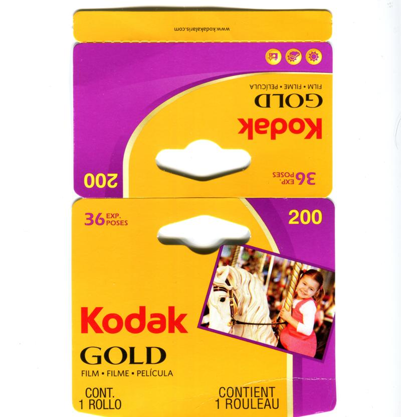
</a>

#### [2024] Kodak Ektachrome E100 (ref: 94ff)

```
Format: 35mm         |  Process : E-6     
ISO   : 100          |  Expiry  : 2024-12 
Type  : Single Pack  |  Quantity: 36exp   
Added : 2025-08-20   |  Author  : @photos.by.qi
UUID  : 1d1d6ca155874b6dba4333cf6f6194ff
```

<a href="./archive/00223_000.jpg" target="_blank">
	
</a>

#### [2024] Kodak Portra 400 (ref: 8b1c)

```
Format: 35mm         |  Process : C-41    
ISO   : 400          |  Expiry  : 2024-12 
Type  : Multi-Pack-5 |  Quantity: 36exp   
Added : 2025-08-20   |  Author  : @photos.by.qi
UUID  : 282ef0c08f374148afc8a5efaf5b8b1c
```

<a href="./archive/00244_000.jpg" target="_blank">
	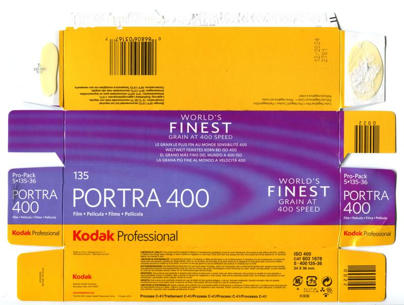
</a>

#### [2024] Kodak UltraMax (ref: 3c02)

```
Format: 35mm         |  Process : C-41    
ISO   : 400          |  Expiry  : 2024-12 
Type  : Single Pack  |  Quantity: 36exp   
Added : 2025-08-20   |  Author  : @photos.by.qi
UUID  : 05d59d140f584adcaf97f6acb69f3c02
```

<a href="./archive/00241_000.jpg" target="_blank">
	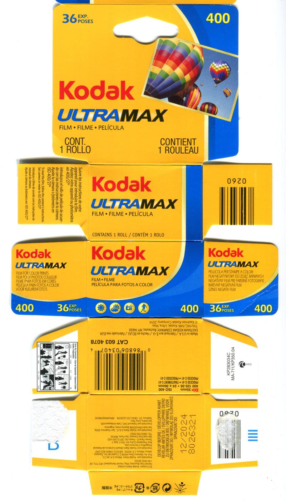
</a>


`UUID: 6ed0486400df45eab9b7465642ecee9d`↓

<a href="./archive/00241_001.jpg" target="_blank">
	
</a>

#### [2024] Polaroid Color 600 Film Round Frame (ref: d985)

```
Format: Integral Film|  Process : Instant 
ISO   : 640          |  Expiry  : 2024-12 
Type  : Single Pack  |  Quantity: 8exp    
Added : 2025-08-02   |  Author  : toader  
UUID  : e798fdd114be4a018cb7651bba94d985
```

<a href="./archive/00157_000.jpg" target="_blank">
	
</a>


`UUID: b9ec4052b0d548ef90f77d7fc99d0ccb`↓

<a href="./archive/00157_001.jpg" target="_blank">
	
</a>


`UUID: 95b81cc72d3646d6966a2341510333aa`↓

<a href="./archive/00157_002.jpg" target="_blank">
	
</a>


`UUID: 038f964e849d4fd1a0c6f1aeb6dd4b0e`↓

<a href="./archive/00157_003.jpg" target="_blank">
	
</a>

#### [2024] Reto Amber D400 (ref: 08ad)

```
Format: 35mm         |  Process : C-41    
ISO   : 400          |  Expiry  : 2024-12 
Type  : Single Pack  |  Quantity: 27exp   
Added : 2025-08-07   |  Author  : TheSelousScout
UUID  : 075938ec54de4c4bbee63671e4c208ad
```

<a href="./archive/00168_000.jpg" target="_blank">
	
</a>

#### [2025] JCH Streetpan (ref: 6e58)

```
Format: 35mm         |  Process : BW      
ISO   : 400          |  Expiry  : 2025-02 
Type  : Single Pack  |  Quantity: 36exp   
Added : 2025-07-31   |  Author  : Pelicram
UUID  : 1873b4d20d2a47659ab15d0af4146e58
```

<a href="./archive/00132_000.jpg" target="_blank">
	
</a>


`UUID: 19dfce255f604980b0f596b8895d923f`↓

<a href="./archive/00132_001.jpg" target="_blank">
	
</a>

#### [2025] Foma Fomapan Classic 100 (ref: 1731)

```
Format: 35mm         |  Process : BW      
ISO   : 100          |  Expiry  : 2025-03 
Type  : Single Pack  |  Quantity: 36exp   
Added : 2025-09-07   |  Author  : @zruk_ts
UUID  : 295bd5709b1e4dd88204bd2c67bd1731
```

<a href="./archive/00317_000.jpg" target="_blank">
	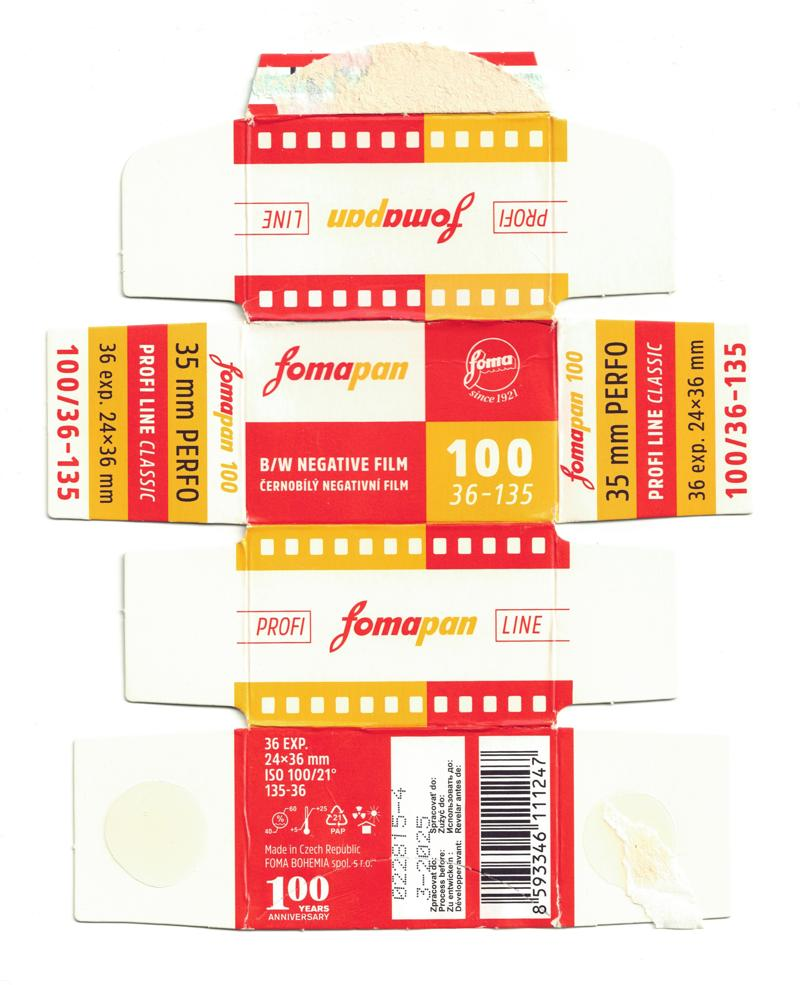
</a>


`UUID: cafaee7054534b7284726cab6f56c367`↓

<a href="./archive/00317_001.jpg" target="_blank">
	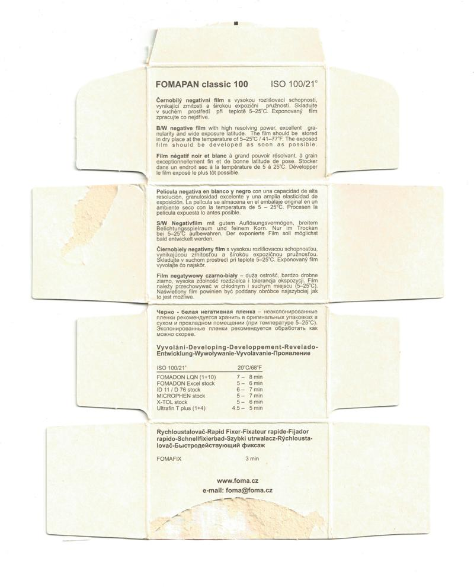
</a>

#### [2025] Polaroid Color SX-70 Film (ref: dc7f)

```
Format: Integral Film|  Process : Instant 
ISO   : 160          |  Expiry  : 2025-04 
Type  : Single Pack  |  Quantity: 8exp    
Added : 2025-08-02   |  Author  : toader  
UUID  : b4af154cea6f40c0aa1d4154d0c2dc7f
```

<a href="./archive/00156_000.jpg" target="_blank">
	
</a>


`UUID: 5ce2d6b8b1894bf7b67c5a9fdd635a6e`↓

<a href="./archive/00156_001.jpg" target="_blank">
	
</a>


`UUID: 170151c0a84e459db08a9b3718b67743`↓

<a href="./archive/00156_002.jpg" target="_blank">
	
</a>


`UUID: 3c3020e2767a48b88a7dd8662a0ec06d`↓

<a href="./archive/00156_003.jpg" target="_blank">
	
</a>

#### [2025] Ilford Delta 3200 Professional (ref: 920f)

```
Format: 120          |  Process : BW      
ISO   : 3200         |  Expiry  : 2025-05 
Type  : Single Pack  |  Quantity: N/A     
Added : 2025-07-31   |  Author  : Pelicram
UUID  : 78d1111d1b234dcfb272c00d7935920f
```

<a href="./archive/00125_000.jpg" target="_blank">
	
</a>


`UUID: 06dcb1f1f350482ba935ad30bd5a42b6`↓

<a href="./archive/00125_001.jpg" target="_blank">
	
</a>

#### [2025] Kodak Portra 800 (ref: 7d65)

```
Format: 35mm         |  Process : C-41    
ISO   : 800          |  Expiry  : 2025-06 
Type  : Single Pack  |  Quantity: 36exp   
Added : 2025-07-28   |  Author  : @recycling.film
UUID  : 7ebac9d7fb8c4ff9b7fbabcaec1d7d65
```

<a href="./archive/00088_000.jpg" target="_blank">
	
</a>

#### [2025] Lomography Lomochrome Turquoise (ref: 0d90)

```
Format: 120          |  Process : C-41    
ISO   : 100-400      |  Expiry  : 2025-07 
Type  : Single Pack  |  Quantity: N/A     
Added : 2025-01-04   |  Author  : dekuNukem
UUID  : 99643a4fc27b4ff298e834fc72970d90
```

<a href="./archive/00008_000.jpg" target="_blank">
	
</a>


`UUID: adc4ed82e419439c8bec5348db4a1ca2`↓

<a href="./archive/00008_001.jpg" target="_blank">
	
</a>

#### [2025] CineStill 400Dynamic (ref: fccd)

```
Format: 35mm         |  Process : C-41    
ISO   : 400          |  Expiry  : 2025-08 
Type  : Single Pack  |  Quantity: 36exp   
Added : 2025-09-13   |  Author  : @filmfotofella
UUID  : 587ac1b471994b54bb5f472d6975fccd
```

<a href="./archive/00330_000.jpg" target="_blank">
	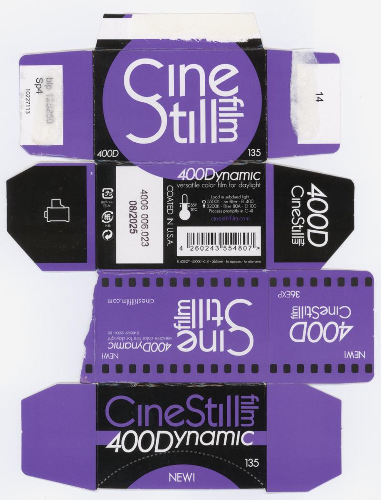
</a>


`UUID: 96209110f95e4744b78b1d31a44f73cf`↓

<a href="./archive/00330_001.jpg" target="_blank">
	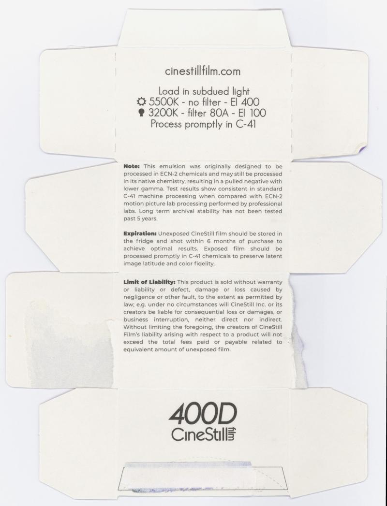
</a>

#### [2025] Fujifilm 400 (ref: 82be)

```
Format: 35mm         |  Process : C-41    
ISO   : 400          |  Expiry  : 2025-08 
Type  : Single Pack  |  Quantity: 36exp   
Added : 2025-08-20   |  Author  : @photos.by.qi
UUID  : f3193ccd9b9d4a929904a6a2e8b682be
```

<a href="./archive/00222_000.jpg" target="_blank">
	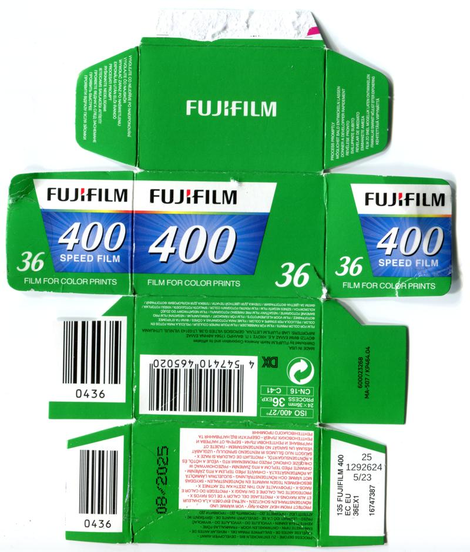
</a>

#### [2025] Kodak ColorPlus (ref: 79ca)

```
Format: 35mm         |  Process : C-41    
ISO   : 200          |  Expiry  : 2025-08 
Type  : Single Pack  |  Quantity: 36exp   
Added : 2025-07-22   |  Author  : @SirBrentsworth
UUID  : 087223fc24654e3882a4596e3cea79ca
```

<a href="./archive/00084_000.jpg" target="_blank">
	
</a>

#### [2025] Fujifilm Fujicolor 100 (ref: b3c9)

```
Format: 35mm         |  Process : C-41    
ISO   : 100          |  Expiry  : 2025-09 
Type  : Single Pack  |  Quantity: 36exp   
Added : 2025-08-20   |  Author  : @photos.by.qi
UUID  : ac13f69474544179a4a2513e8641b3c9
```

<a href="./archive/00217_000.jpg" target="_blank">
	
</a>

#### [2025] Lomography Babylon (ref: 7afa)

```
Format: 35mm         |  Process : BW      
ISO   : 13           |  Expiry  : 2025-09 
Type  : Single Pack  |  Quantity: 36exp   
Added : 2025-07-31   |  Author  : Pelicram
UUID  : 9d7f531c7a764f9689228ab477297afa
```

<a href="./archive/00147_000.jpg" target="_blank">
	
</a>

#### [2025] Rollei Retro 80S (ref: e23d)

```
Format: 35mm         |  Process : BW      
ISO   : 80           |  Expiry  : 2025-09 
Type  : Single Pack  |  Quantity: 36exp   
Added : 2025-08-08   |  Author  : Pelicram
UUID  : 406a06d6d4df49cfa27378242ef6e23d
```

<a href="./archive/00169_000.jpg" target="_blank">
	
</a>


`UUID: 1dea328c77d74bf19135dc04194df311`↓

<a href="./archive/00169_001.jpg" target="_blank">
	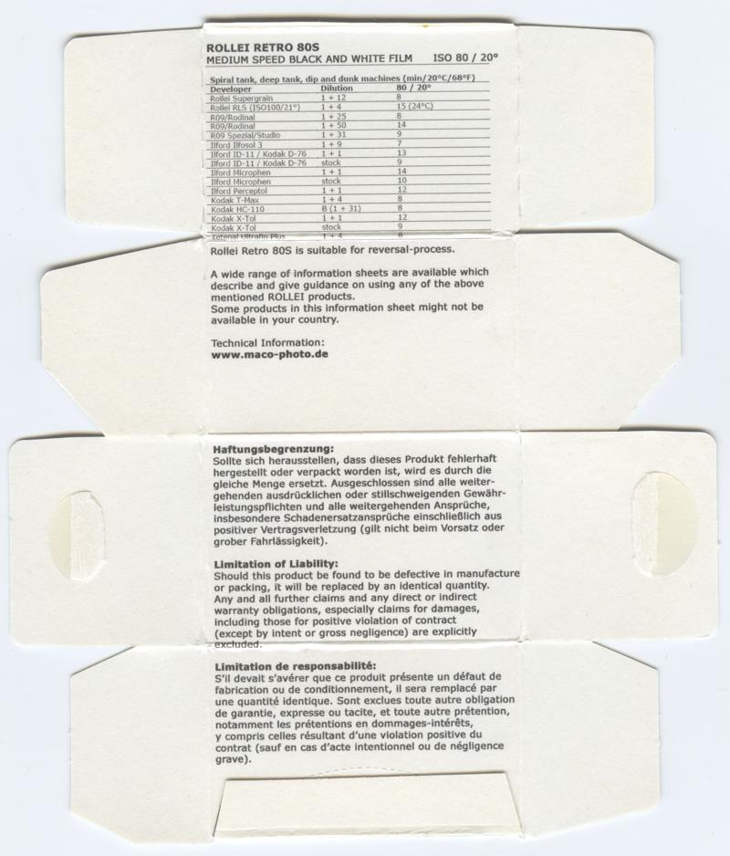
</a>

#### [2025] SantaColor SantaColor (ref: cb58)

```
Format: 35mm         |  Process : C-41    
ISO   : 100          |  Expiry  : 2025-09 
Type  : Single Pack  |  Quantity: 36exp   
Added : 2025-07-30   |  Author  : yc128   
UUID  : e54ce68c797b4846b9aee3f5818ecb58
```

<a href="./archive/00112_000.jpg" target="_blank">
	
</a>

#### [2025] SantaColor SantaColor (ref: f3a7)

```
Format: 35mm         |  Process : C-41    
ISO   : 100          |  Expiry  : 2025-09 
Type  : Multi-Pack-5 |  Quantity: 36exp   
Added : 2025-07-31   |  Author  : Pelicram
UUID  : 0a141b49a84a4b06a18355308940f3a7
```

<a href="./archive/00128_000.jpg" target="_blank">
	
</a>

#### [2025] Ilford HP5 Plus (ref: efad)

```
Format: 120          |  Process : BW      
ISO   : 400          |  Expiry  : 2025-11 
Type  : Single Pack  |  Quantity: N/A     
Added : 2025-01-04   |  Author  : dekuNukem
UUID  : ddf9b76e633f43718144af7dcb89efad
```

<a href="./archive/00016_000.jpg" target="_blank">
	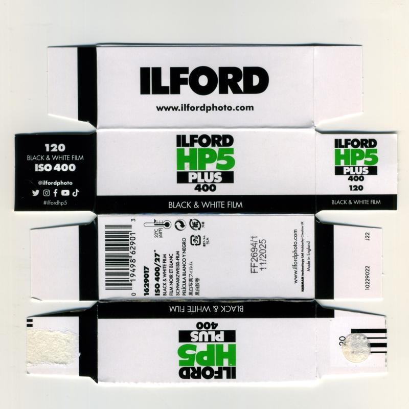
</a>


`UUID: 1d938d2d844d498caf9fe2bc83618dda`↓

<a href="./archive/00016_001.jpg" target="_blank">
	
</a>

#### [2025] Harman Phoenix (ref: 8eb4)

```
Format: 35mm         |  Process : C-41    
ISO   : 200          |  Expiry  : 2025-12 
Type  : Single Pack  |  Quantity: 36exp   
Added : 2025-06-25   |  Author  : yc128   
UUID  : 2fe522ef01b84a9aa6263807135f8eb4
```

<a href="./archive/00076_000.jpg" target="_blank">
	
</a>


`UUID: a7a70b20b4224baeb85c732245eb31d1`↓

<a href="./archive/00076_001.jpg" target="_blank">
	
</a>

#### [2025] Kodak Tri-X 400 (ref: 88c5)

```
Format: 120          |  Process : BW      
ISO   : 400          |  Expiry  : 2025-12 
Type  : Single Pack  |  Quantity: N/A     
Added : 2025-01-04   |  Author  : dekuNukem
UUID  : f7f99b9d46a4491c9cbfda4f030f88c5
```

<a href="./archive/00028_000.jpg" target="_blank">
	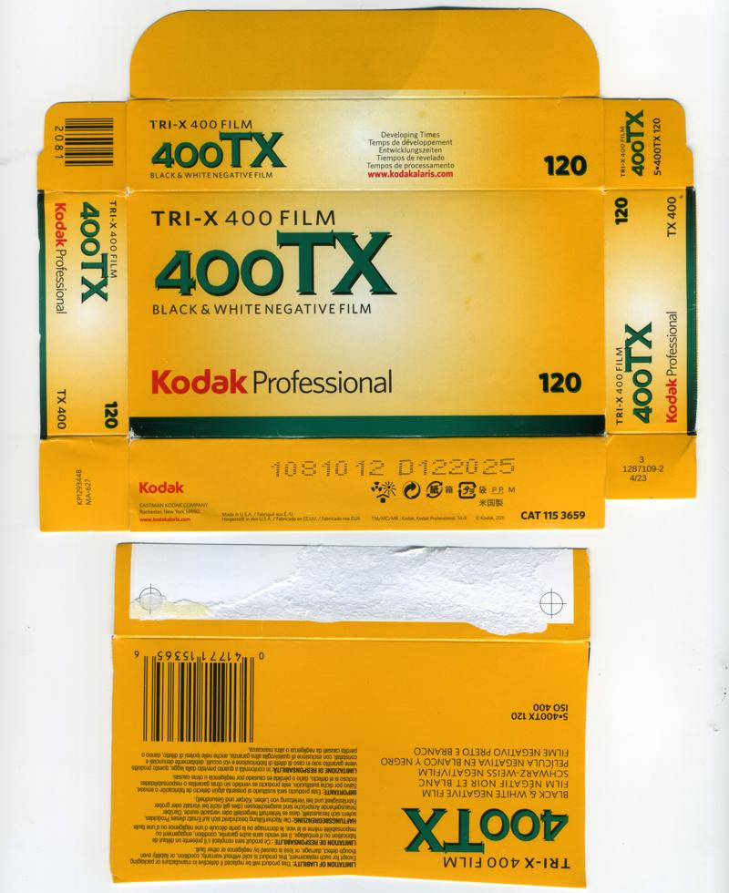
</a>

#### [2025] Three Film Rolls 5207 (ref: 0292)

```
Format: 35mm         |  Process : ECN-2   
ISO   : 250          |  Expiry  : 2025-12 
Type  : Single Pack  |  Quantity: 36exp   
Added : 2025-05-24   |  Author  : dekuNukem
UUID  : 4de0f5e76dd748c488fa81be23340292
```

<a href="./archive/00059_000.jpg" target="_blank">
	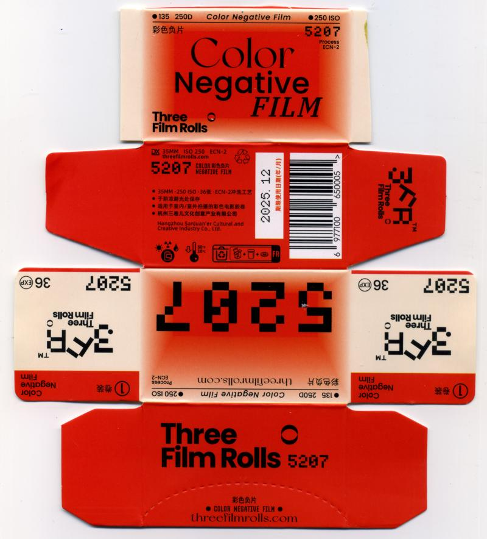
</a>

#### [2026] Alien Film Aeronega (ref: d1c5)

```
Format: 120          |  Process : C-41    
ISO   : 100          |  Expiry  : 2026-01 
Type  : Single Pack  |  Quantity: N/A     
Added : 2025-09-07   |  Author  : @zruk_ts
UUID  : 46e2cf3d6d78474ca55da2c510d0d1c5
```

<a href="./archive/00311_000.jpg" target="_blank">
	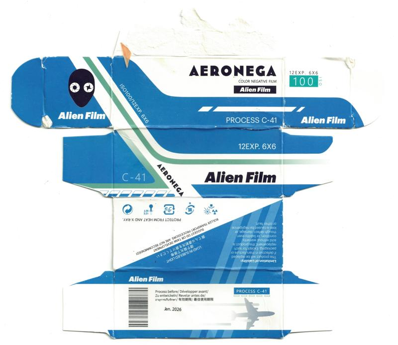
</a>

#### [2026] Fujifilm Fujicolor Superia X-TRA (ref: 6b8a)

```
Format: 35mm         |  Process : C-41    
ISO   : 400          |  Expiry  : 2026-01 
Type  : Single Pack  |  Quantity: 36exp   
Added : 2025-08-07   |  Author  : @Hol.m35
UUID  : 64b5e2e7f9a841d2a99c8f1bd8766b8a
```

<a href="./archive/00165_000.jpg" target="_blank">
	
</a>

#### [2026] Kodak Portra 160 (ref: 6b0a)

```
Format: 35mm         |  Process : C-41    
ISO   : 160          |  Expiry  : 2026-01 
Type  : Multi-Pack-5 |  Quantity: 36exp   
Added : 2025-09-17   |  Author  : The Compartmentalist
UUID  : 404910cf04a14b8ab5116ec9c2f86b0a
```

<a href="./archive/00345_000.jpg" target="_blank">
	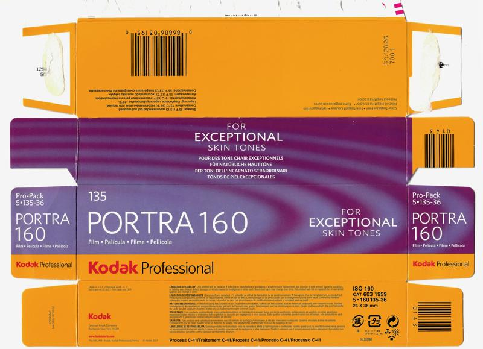
</a>

#### [2026] Kodak UltraMax (ref: e3ba)

```
Format: 35mm         |  Process : C-41    
ISO   : 400          |  Expiry  : 2026-01 
Type  : Multi-Pack-3 |  Quantity: 36exp   
Added : 2025-09-17   |  Author  : The Compartmentalist
UUID  : 7fc91e3ef9cf4519adde24e24938e3ba
```

<a href="./archive/00337_000.jpg" target="_blank">
	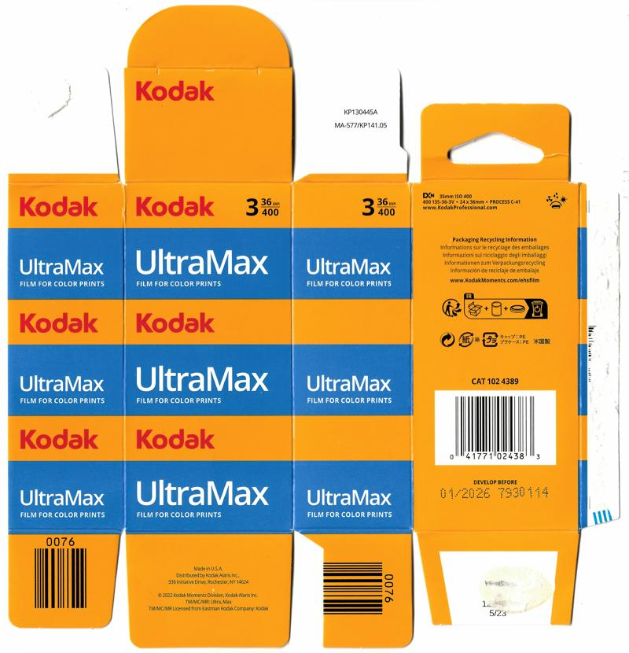
</a>

#### [2026] Lomography Fantome (ref: 4340)

```
Format: 35mm         |  Process : BW      
ISO   : 8            |  Expiry  : 2026-01 
Type  : Single Pack  |  Quantity: 36exp   
Added : 2025-07-31   |  Author  : Pelicram
UUID  : 538e7611233a4cc3bd733763bf694340
```

<a href="./archive/00141_000.jpg" target="_blank">
	
</a>

#### [2026] Rollei Retro 80S (ref: e6c0)

```
Format: 120          |  Process : BW      
ISO   : 80           |  Expiry  : 2026-02 
Type  : Single Pack  |  Quantity: N/A     
Added : 2025-01-04   |  Author  : dekuNukem
UUID  : fb2ccfebcf2f4a17afe00acaaea5e6c0
```

<a href="./archive/00005_000.jpg" target="_blank">
	
</a>


`UUID: a57794309f6b44d784d9555b416a200c`↓

<a href="./archive/00005_001.jpg" target="_blank">
	
</a>

#### [2026] Bergger Pancro400 (ref: ad7b)

```
Format: 120          |  Process : BW      
ISO   : 400          |  Expiry  : 2026-03 
Type  : Single Pack  |  Quantity: N/A     
Added : 2025-07-31   |  Author  : Pelicram
UUID  : 73396128854a4c6ab3723a549225ad7b
```

<a href="./archive/00124_000.jpg" target="_blank">
	
</a>


`UUID: 5643e1130f1949c48dfdeddc7c7a955f`↓

<a href="./archive/00124_001.jpg" target="_blank">
	
</a>

#### [2026] Foma Ortho 400 (ref: 89e7)

```
Format: 120          |  Process : BW      
ISO   : 400          |  Expiry  : 2026-04 
Type  : Single Pack  |  Quantity: N/A     
Added : 2025-07-31   |  Author  : Pelicram
UUID  : 4c97e2b7413b42278b0fd129c1c589e7
```

<a href="./archive/00127_000.jpg" target="_blank">
	
</a>


`UUID: 728d195752464a448163dbb0ad4e8aa0`↓

<a href="./archive/00127_001.jpg" target="_blank">
	
</a>

#### [2026] Ilford FP4 Plus (ref: 76e7)

```
Format: 120          |  Process : BW      
ISO   : 125          |  Expiry  : 2026-04 
Type  : Single Pack  |  Quantity: N/A     
Added : 2025-07-30   |  Author  : yc128   
UUID  : c6c88d6d009048e9ac3721bdc7f076e7
```

<a href="./archive/00111_000.jpg" target="_blank">
	
</a>


`UUID: 95c6d78d0b0540a9ba70dc769609a112`↓

<a href="./archive/00111_001.jpg" target="_blank">
	
</a>

#### [2026] JCH Streetpan (ref: 5c70)

```
Format: 120          |  Process : BW      
ISO   : 400          |  Expiry  : 2026-04 
Type  : Single Pack  |  Quantity: N/A     
Added : 2025-09-28   |  Author  : @Hol.m35
UUID  : f32d9e32d43441b79220744cdb4e5c70
```

<a href="./archive/00355_000.jpg" target="_blank">
	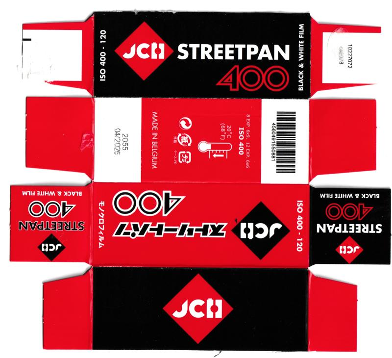
</a>


`UUID: 7935fbe7f8a44593a172f1e9fc2fd2bc`↓

<a href="./archive/00355_001.jpg" target="_blank">
	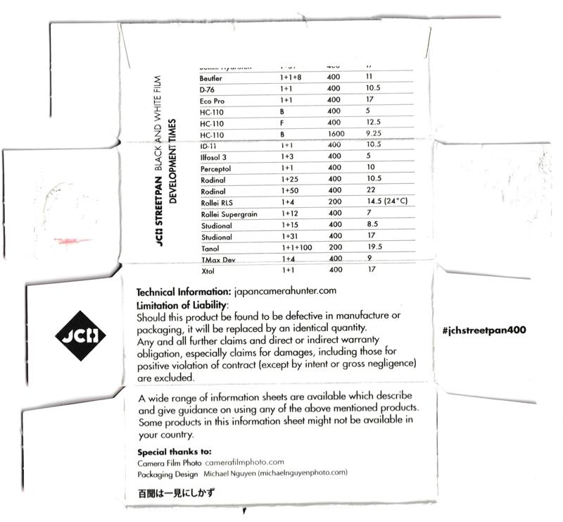
</a>

#### [2026] Kodak TMAX P3200 (ref: 521a)

```
Format: 35mm         |  Process : BW      
ISO   : 3200         |  Expiry  : 2026-04 
Type  : Single Pack  |  Quantity: 36exp   
Added : 2025-07-31   |  Author  : Pelicram
UUID  : 39fa3ae0251e4cdbaf8240602537521a
```

<a href="./archive/00144_000.jpg" target="_blank">
	
</a>

#### [2026] Lomography Lomochrome Color'92 (ref: 12b4)

```
Format: 35mm         |  Process : C-41    
ISO   : 400          |  Expiry  : 2026-04 
Type  : Single Pack  |  Quantity: 36exp   
Added : 2025-08-20   |  Author  : @photos.by.qi
UUID  : 81d185de4ddf494785362046cada12b4
```

<a href="./archive/00225_000.jpg" target="_blank">
	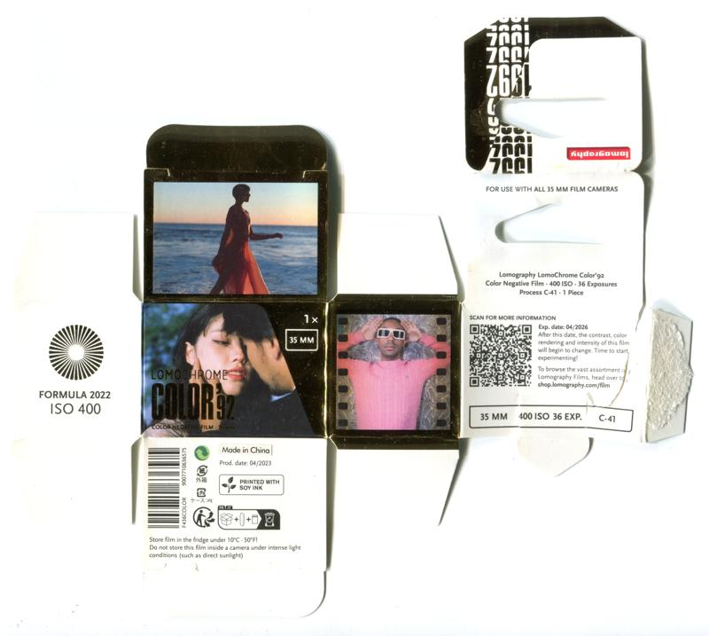
</a>

#### [2026] Svema Foto 200 (ref: 6991)

```
Format: 35mm         |  Process : BW      
ISO   : 200          |  Expiry  : 2026-04 
Type  : Single Pack  |  Quantity: 36exp   
Added : 2025-09-07   |  Author  : @zruk_ts
UUID  : 031527052b0d4c4daf74708dde626991
```

<a href="./archive/00316_000.jpg" target="_blank">
	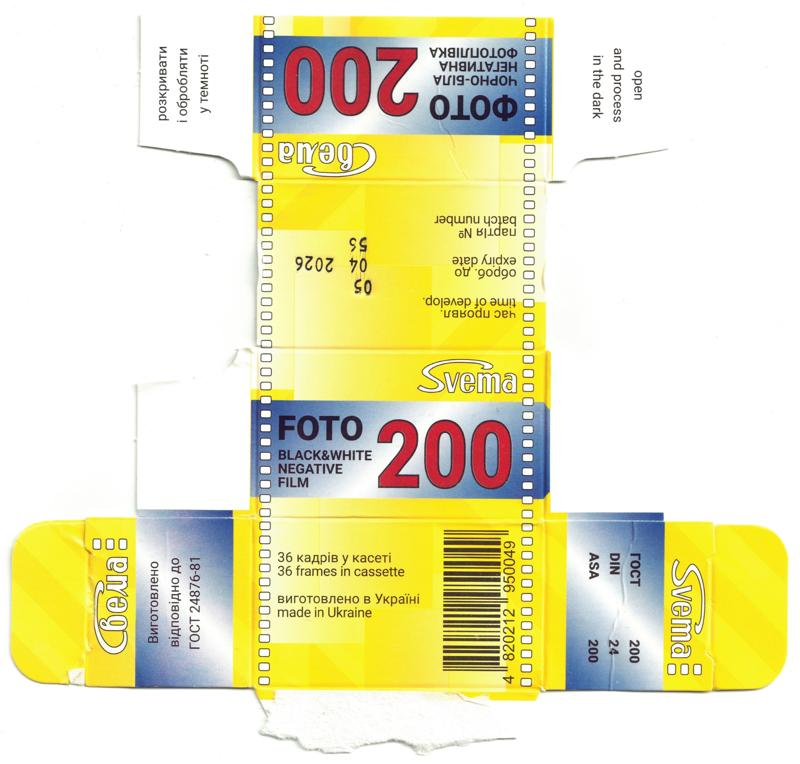
</a>

#### [2026] Svema Foto 400 (ref: 26ad)

```
Format: 35mm         |  Process : BW      
ISO   : 400          |  Expiry  : 2026-04 
Type  : Single Pack  |  Quantity: 36exp   
Added : 2025-07-31   |  Author  : Pelicram
UUID  : 6e9f27ffcfea4f298be7d33d7f3826ad
```

<a href="./archive/00130_000.jpg" target="_blank">
	
</a>

#### [2026] Hands On Film Midnight 1600 (ref: 4411)

```
Format: 35mm         |  Process : C-41    
ISO   : 1600         |  Expiry  : 2026-05 
Type  : Single Pack  |  Quantity: 36exp   
Added : 2025-08-19   |  Author  : @ellafridalindblom
UUID  : 515a9a246a8e4eed87d77142623a4411
```

<a href="./archive/00206_000.jpg" target="_blank">
	
</a>

#### [2026] Ilford Ilfochrome (ref: ac24)

```
Format: 35mm         |  Process : E-6     
ISO   : 100          |  Expiry  : 2026-05 
Type  : Single Pack  |  Quantity: 36exp   
Added : 2025-09-06   |  Author  : kaimon  
UUID  : e7713fa57cac41e3ae3f416f3ea5ac24
```

<a href="./archive/00302_000.jpg" target="_blank">
	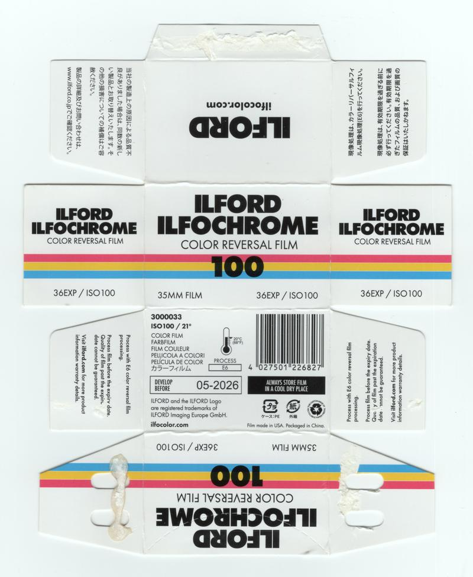
</a>

#### [2026] Alien Film 5207/250D (ref: 8820)

```
Format: 120          |  Process : ECN-2   
ISO   : 250          |  Expiry  : 2026-06 
Type  : Single Pack  |  Quantity: N/A     
Added : 2025-01-04   |  Author  : dekuNukem
UUID  : aedc4b00bd174e0baf7c744ed21d8820
```

<a href="./archive/00001_000.jpg" target="_blank">
	
</a>

#### [2026] Fujifilm 200 (ref: 5b41)

```
Format: 35mm         |  Process : C-41    
ISO   : 200          |  Expiry  : 2026-06 
Type  : Single Pack  |  Quantity: 36exp   
Added : 2025-06-05   |  Author  : Yrikonchik
UUID  : fe02d85cb9294ee2ba64e8543ce65b41
```

<a href="./archive/00073_000.jpg" target="_blank">
	
</a>

#### [2026] Kodak Gold (ref: 3e7f)

```
Format: 35mm         |  Process : C-41    
ISO   : 200          |  Expiry  : 2026-06 
Type  : Single Pack  |  Quantity: 36exp   
Added : 2025-07-22   |  Author  : @SirBrentsworth
UUID  : d2e434e91001465dbea2d815d5e23e7f
```

<a href="./archive/00080_000.jpg" target="_blank">
	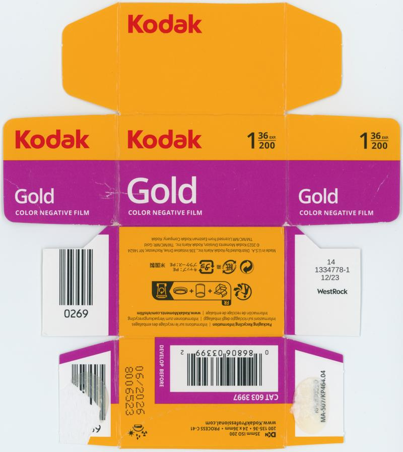
</a>

#### [2026] Harman Red (ref: da3a)

```
Format: 35mm         |  Process : C-41    
ISO   : 125          |  Expiry  : 2026-07 
Type  : Single Pack  |  Quantity: 36exp   
Added : 2025-09-06   |  Author  : @toastergod101
UUID  : 3903165bcfbc43ad9a6ee42e7922da3a
```

<a href="./archive/00306_000.jpg" target="_blank">
	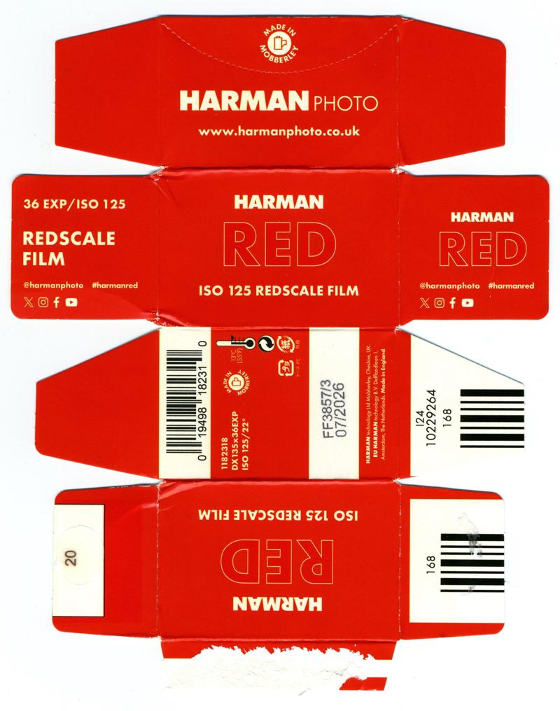
</a>


`UUID: e4133b6a1709448dbe4efa97d028e25a`↓

<a href="./archive/00306_001.jpg" target="_blank">
	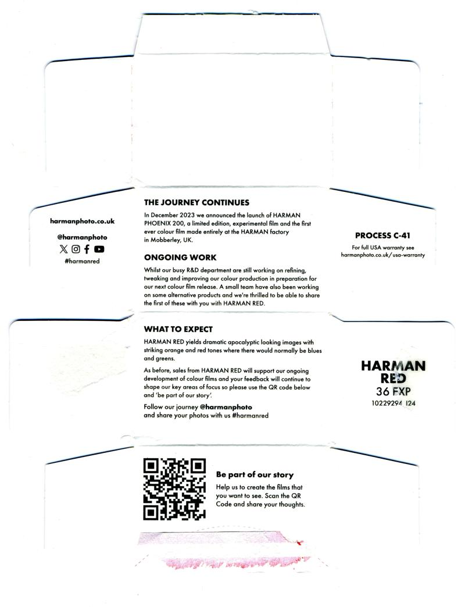
</a>

#### [2026] Kodak UltraMax (ref: e4ad)

```
Format: 35mm         |  Process : C-41    
ISO   : 400          |  Expiry  : 2026-07 
Type  : Single Pack  |  Quantity: 24exp   
Added : 2025-08-18   |  Author  : @recycling.film
UUID  : d14bbf440f3a4ac9aa4169c8bba7e4ad
```

<a href="./archive/00201_000.jpg" target="_blank">
	
</a>

#### [2026] Lomography Lomochrome Color’92 (ref: 0960)

```
Format: 120          |  Process : C-41    
ISO   : 400          |  Expiry  : 2026-07 
Type  : Single Pack  |  Quantity: N/A     
Added : 2025-09-17   |  Author  : The Compartmentalist
UUID  : e72a327c49d3440c85ab03647ff00960
```

<a href="./archive/00336_000.jpg" target="_blank">
	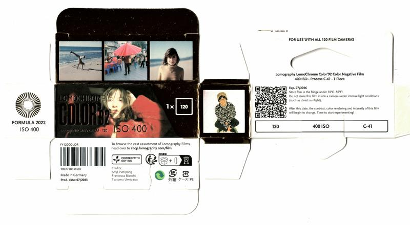
</a>

#### [2026] Harman Phoenix (ref: 637f)

```
Format: 120          |  Process : C-41    
ISO   : 200          |  Expiry  : 2026-08 
Type  : Single Pack  |  Quantity: N/A     
Added : 2025-01-04   |  Author  : dekuNukem
UUID  : 0b11ba38c9a34f58a2f13d696b05637f
```

<a href="./archive/00004_000.jpg" target="_blank">
	
</a>


`UUID: c5a0132ac51a488ba35ebd6cc48911e7`↓

<a href="./archive/00004_001.jpg" target="_blank">
	
</a>

#### [2026] Hazenfilm Sorolla Chrome (ref: 889f)

```
Format: 35mm         |  Process : E-6     
ISO   : 100          |  Expiry  : 2026-08 
Type  : Single Pack  |  Quantity: 36exp   
Added : 2025-07-31   |  Author  : Pelicram
UUID  : 462e32d45cd740cf866732a73a00889f
```

<a href="./archive/00137_000.jpg" target="_blank">
	
</a>

#### [2026] Kodak ColorPlus (ref: 6637)

```
Format: 35mm         |  Process : C-41    
ISO   : 200          |  Expiry  : 2026-08 
Type  : Single Pack  |  Quantity: 36exp   
Added : 2025-07-28   |  Author  : @recycling.film
UUID  : bd00cd25958d4108a7501bf4be9d6637
```

<a href="./archive/00091_000.jpg" target="_blank">
	
</a>

#### [2026] Kodak TMAX P3200 (ref: 43a2)

```
Format: 35mm         |  Process : BW      
ISO   : 3200         |  Expiry  : 2026-08 
Type  : Single Pack  |  Quantity: 36exp   
Added : 2025-07-31   |  Author  : Pelicram
UUID  : 8f91948e930f491a8684337e32d443a2
```

<a href="./archive/00142_000.jpg" target="_blank">
	
</a>

#### [2026] CineStill 800T (ref: b3ff)

```
Format: 35mm         |  Process : C-41    
ISO   : 800          |  Expiry  : 2026-09 
Type  : Single Pack  |  Quantity: 36exp   
Added : 2025-07-22   |  Author  : @SirBrentsworth
UUID  : 81978ca6f6d048b3a759dffdb80fb3ff
```

<a href="./archive/00085_000.jpg" target="_blank">
	
</a>


`UUID: fbd9b946fd4d46f8a45a46112dcd16ae`↓

<a href="./archive/00085_001.jpg" target="_blank">
	
</a>

#### [2026] Ilford HP5 Plus (ref: 1a5d)

```
Format: 120          |  Process : BW      
ISO   : 400          |  Expiry  : 2026-09 
Type  : Single Pack  |  Quantity: N/A     
Added : 2025-01-04   |  Author  : dekuNukem
UUID  : 36151f6b7cc045c2b43d7f5cbee41a5d
```

<a href="./archive/00000_000.jpg" target="_blank">
	
</a>


`UUID: 3d64b751d4dd412889855a65731d5f25`↓

<a href="./archive/00000_001.jpg" target="_blank">
	
</a>

#### [2026] Kentmere PAN 400 (ref: d223)

```
Format: 35mm         |  Process : BW      
ISO   : 400          |  Expiry  : 2026-09 
Type  : Single Pack  |  Quantity: 36exp   
Added : 2025-05-24   |  Author  : dekuNukem
UUID  : e876f866f1e9430494356ad098c7d223
```

<a href="./archive/00058_000.jpg" target="_blank">
	
</a>


`UUID: ecc653f10f124afe9b4225edb7e06587`↓

<a href="./archive/00058_001.jpg" target="_blank">
	
</a>

#### [2026] Kodak Ektar 100 (ref: 3498)

```
Format: 35mm         |  Process : C-41    
ISO   : 100          |  Expiry  : 2026-09 
Type  : Single Pack  |  Quantity: 36exp   
Added : 2025-07-22   |  Author  : @SirBrentsworth
UUID  : 8552091a80a844a5aec3e9b8185e3498
```

<a href="./archive/00081_000.jpg" target="_blank">
	
</a>

#### [2026] Kodak Tri-X 400 (ref: c671)

```
Format: 35mm         |  Process : BW      
ISO   : 400          |  Expiry  : 2026-09 
Type  : Single Pack  |  Quantity: 36exp   
Added : 2025-07-31   |  Author  : Pelicram
UUID  : 0417faf4f5be42538db49741140bc671
```

<a href="./archive/00135_000.jpg" target="_blank">
	
</a>

#### [2026] Lomography Tiger (ref: 26dd)

```
Format: 110          |  Process : C-41    
ISO   : 200          |  Expiry  : 2026-09 
Type  : Single Pack  |  Quantity: 24exp   
Added : 2025-07-31   |  Author  : Pelicram
UUID  : e8a5b04ef68c43ae9e79df89123726dd
```

<a href="./archive/00143_000.jpg" target="_blank">
	
</a>

#### [2026] Fujifilm Fujichrome Provia 100F (ref: df27)

```
Format: 35mm         |  Process : E-6     
ISO   : 100          |  Expiry  : 2026-10 
Type  : Single Pack  |  Quantity: 36exp   
Added : 2025-08-07   |  Author  : The Compartmentalist
UUID  : 480a75f9978b4fba84c81a8a9e95df27
```

<a href="./archive/00167_000.jpg" target="_blank">
	
</a>

#### [2026] Kodak Portra 400 (ref: c869)

```
Format: 35mm         |  Process : C-41    
ISO   : 400          |  Expiry  : 2026-10 
Type  : Multi-Pack-5 |  Quantity: 36exp   
Added : 2025-08-20   |  Author  : @photos.by.qi
UUID  : 848f67976c48465a8c245ba2a4d0c869
```

<a href="./archive/00245_000.jpg" target="_blank">
	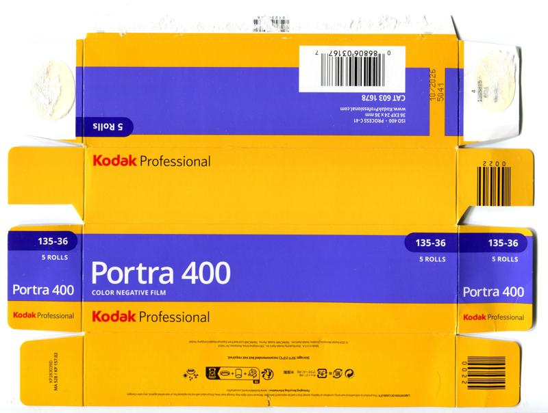
</a>

#### [2026] Ilford XP2 Super (ref: 484f)

```
Format: 120          |  Process : C-41    
ISO   : 400          |  Expiry  : 2026-11 
Type  : Single Pack  |  Quantity: N/A     
Added : 2025-10-12   |  Author  : kaimon  
UUID  : 08ab5616c0644099aceffb457b7e484f
```

<a href="./archive/00391_000.jpg" target="_blank">
	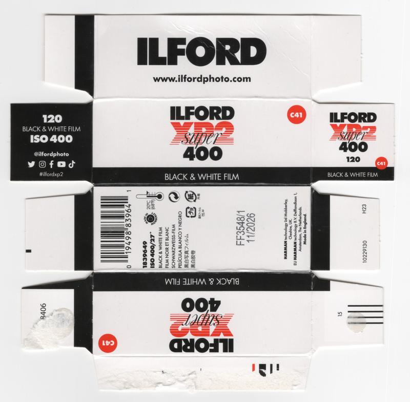
</a>


`UUID: b1a79997109841788a563a01c59c6acc`↓

<a href="./archive/00391_001.jpg" target="_blank">
	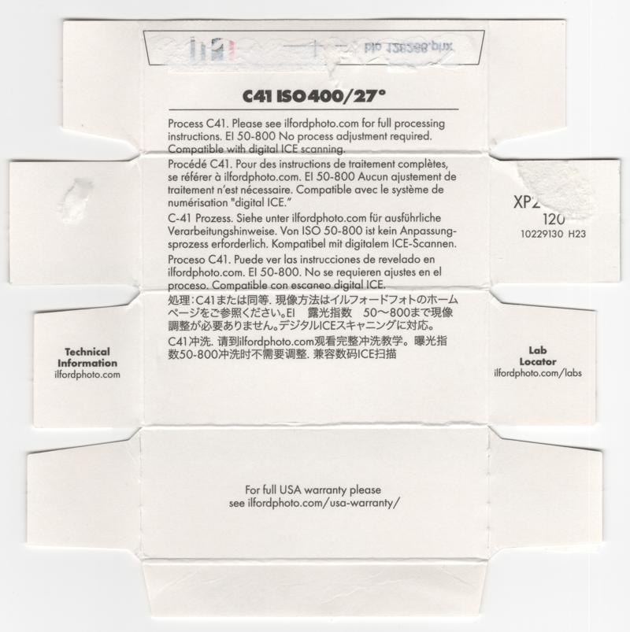
</a>

#### [2026] Kodak Gold 200 (ref: 933f)

```
Format: 120          |  Process : C-41    
ISO   : 200          |  Expiry  : 2026-11 
Type  : Multi-Pack-5 |  Quantity: N/A     
Added : 2025-01-04   |  Author  : dekuNukem
UUID  : e8aefc10fa0d43cebbac73bdcf10933f
```

<a href="./archive/00021_000.jpg" target="_blank">
	
</a>

#### [2026] Bergger Pancro400 (ref: f619)

```
Format: 35mm         |  Process : BW      
ISO   : 400          |  Expiry  : 2026-12 
Type  : Single Pack  |  Quantity: 36exp   
Added : 2025-07-31   |  Author  : Pelicram
UUID  : 0d9fee6b29f445f089acde3247d1f619
```

<a href="./archive/00123_000.jpg" target="_blank">
	
</a>


`UUID: 29d10e873e704093bd65148f288f968b`↓

<a href="./archive/00123_001.jpg" target="_blank">
	
</a>

#### [2026] CatLABS X Film 320 Pro (ref: 1c69)

```
Format: 120          |  Process : BW      
ISO   : 320          |  Expiry  : 2026-12 
Type  : Single Pack  |  Quantity: N/A     
Added : 2025-08-18   |  Author  : lt_col_tall
UUID  : b5423225b6b2496eaf713a5a38731c69
```

<a href="./archive/00196_000.jpg" target="_blank">
	
</a>


`UUID: 3fa90851d420466183f638184ce9a49a`↓

<a href="./archive/00196_001.jpg" target="_blank">
	
</a>

#### [2026] Hope Film Bubble (ref: 41f4)

```
Format: 35mm         |  Process : C-41    
ISO   : 200          |  Expiry  : 2026-12 
Type  : Single Pack  |  Quantity: 24exp   
Added : 2025-08-06   |  Author  : @Hol.m35
UUID  : b09848420a1a4d76b099d82d76bc41f4
```

<a href="./archive/00164_000.jpg" target="_blank">
	
</a>

#### [2026] Ilford Delta 400 Professional (ref: f3da)

```
Format: 35mm         |  Process : BW      
ISO   : 400          |  Expiry  : 2026-12 
Type  : Single Pack  |  Quantity: 36exp   
Added : 2025-09-06   |  Author  : @toastergod101
UUID  : 3b21d893a52242f886e7057855d7f3da
```

<a href="./archive/00305_000.jpg" target="_blank">
	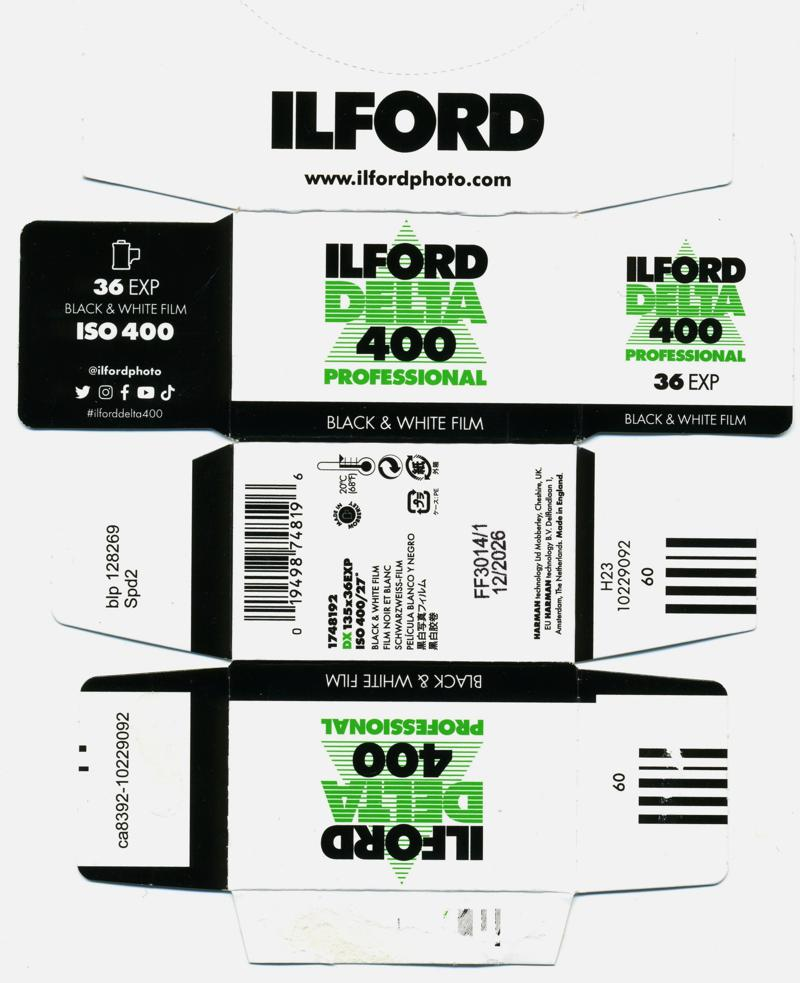
</a>


`UUID: be7e29869fd34099b29753fc5dc86b02`↓

<a href="./archive/00305_001.jpg" target="_blank">
	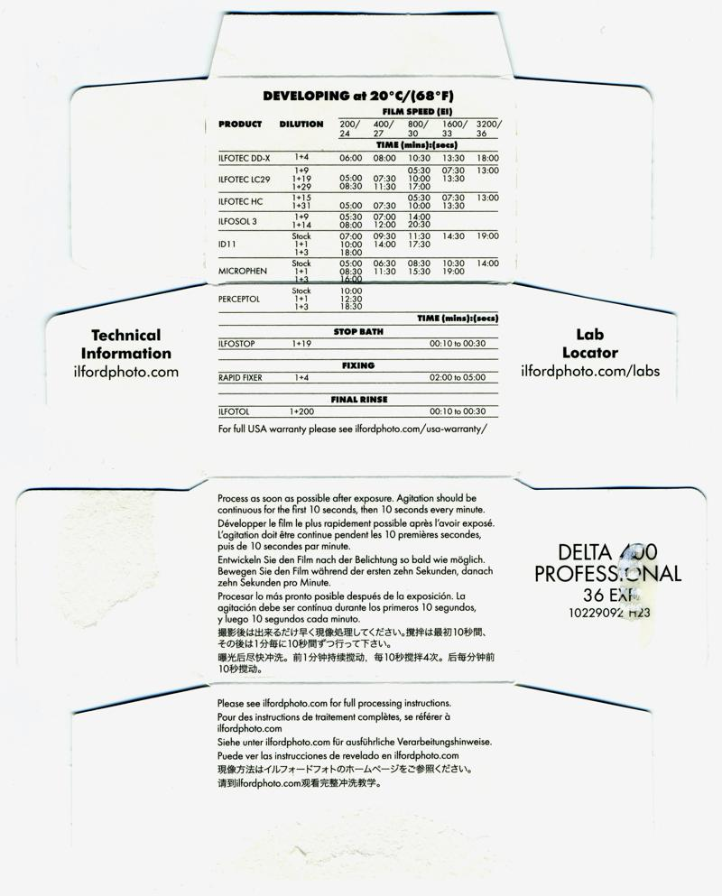
</a>

#### [2026] Marix Professional Negative Movie Color Film (ref: c457)

```
Format: 35mm         |  Process : C-41    
ISO   : 320          |  Expiry  : 2026-12 
Type  : Single Pack  |  Quantity: 36exp   
Added : 2025-08-16   |  Author  : Kraksen 
UUID  : 715e5119d4b941d98ce52bcd8596c457
```

<a href="./archive/00188_000.jpg" target="_blank">
	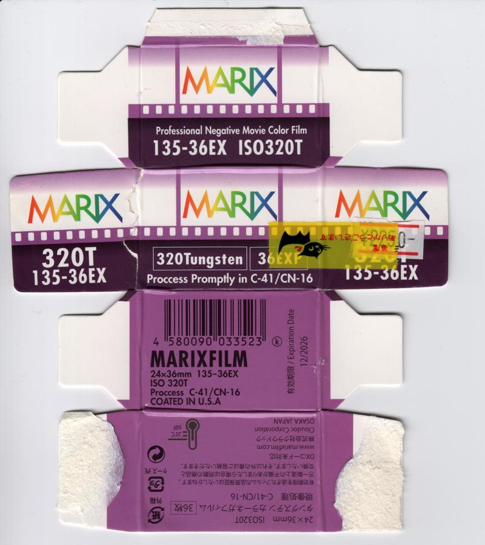
</a>

#### [2026] Wolfen NC500 (ref: 91c1)

```
Format: 35mm         |  Process : C-41    
ISO   : 400          |  Expiry  : 2026-12 
Type  : Single Pack  |  Quantity: 36exp   
Added : 2025-01-21   |  Author  : @ob.skura
UUID  : 6e3408d7e97247e380ea52077a7491c1
```

<a href="./archive/00049_000.jpg" target="_blank">
	
</a>

#### [2027] CatLABS X Film 80 MKII (ref: bcd1)

```
Format: 120          |  Process : BW      
ISO   : 80           |  Expiry  : 2027-01 
Type  : Single Pack  |  Quantity: N/A     
Added : 2025-10-01   |  Author  : lt_col_tall
UUID  : 98b415dbd4184372b8568b2b99a1bcd1
```

<a href="./archive/00360_000.jpg" target="_blank">
	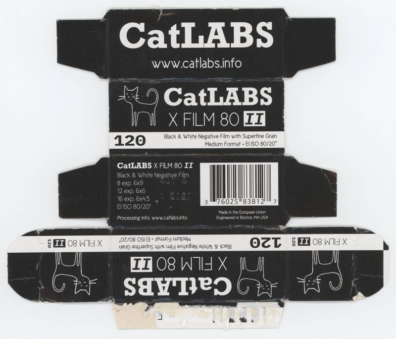
</a>


`UUID: aefb75faa42949bb9a8093770ec9fac8`↓

<a href="./archive/00360_001.jpg" target="_blank">
	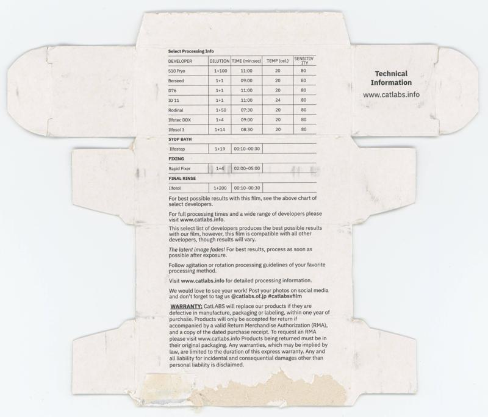
</a>

#### [2027] Ilford Delta 100 Professional (ref: bf01)

```
Format: 35mm         |  Process : BW      
ISO   : 100          |  Expiry  : 2027-02 
Type  : Single Pack  |  Quantity: 36exp   
Added : 2025-10-02   |  Author  : kaimon  
UUID  : 179f22ce3d644d728b189f6ef7a9bf01
```

<a href="./archive/00361_000.jpg" target="_blank">
	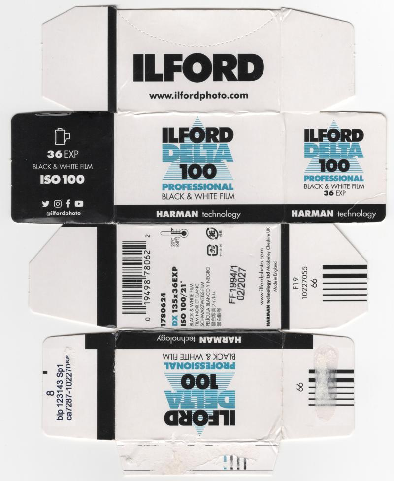
</a>


`UUID: 52be7e5732274b03a9a7423e31c12fce`↓

<a href="./archive/00361_001.jpg" target="_blank">
	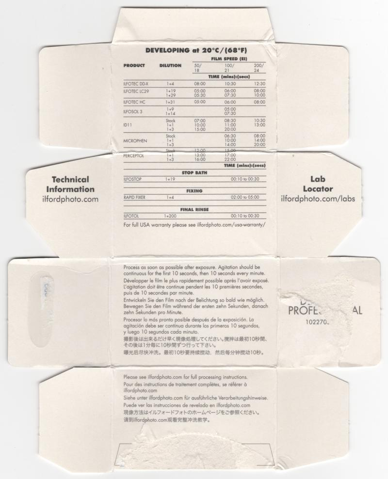
</a>

#### [2027] Kodak Ektachrome E100 (ref: ae10)

```
Format: 35mm         |  Process : E-6     
ISO   : 100          |  Expiry  : 2027-02 
Type  : Single Pack  |  Quantity: 36exp   
Added : 2025-08-02   |  Author  : toader  
UUID  : 829cd9dd98cd489f8bff71e403c1ae10
```

<a href="./archive/00155_000.jpg" target="_blank">
	
</a>

#### [2027] Foma Fomapan Creative 200 (ref: 3e4f)

```
Format: 120          |  Process : BW      
ISO   : 200          |  Expiry  : 2027-03 
Type  : Single Pack  |  Quantity: N/A     
Added : 2025-06-05   |  Author  : benikum 
UUID  : 7be1cb0047f14034a7386cd7b1843e4f
```

<a href="./archive/00070_000.jpg" target="_blank">
	
</a>


`UUID: b049b10ae15b40319e7b70fed1ccbd71`↓

<a href="./archive/00070_001.jpg" target="_blank">
	
</a>

#### [2027] Kodak UltraMax (ref: aaa6)

```
Format: 35mm         |  Process : C-41    
ISO   : 400          |  Expiry  : 2027-03 
Type  : Single Pack  |  Quantity: 36exp   
Added : 2025-07-22   |  Author  : @SirBrentsworth
UUID  : 8b0e255948ad4bbc8689d371569caaa6
```

<a href="./archive/00079_000.jpg" target="_blank">
	
</a>

#### [2027] Foma Fomapan Classic 100 (ref: 65ad)

```
Format: 120          |  Process : BW      
ISO   : 100          |  Expiry  : 2027-04 
Type  : Single Pack  |  Quantity: N/A     
Added : 2025-07-31   |  Author  : Pelicram
UUID  : a0786cc1bc884f66bbb84118d55665ad
```

<a href="./archive/00133_000.jpg" target="_blank">
	
</a>


`UUID: 0d7f7062ffb34d0c91f0080e3749cbe4`↓

<a href="./archive/00133_001.jpg" target="_blank">
	
</a>

#### [2027] Fujifilm Instax Mini (ref: e5e7)

```
Format: Integral Film|  Process : Instant 
ISO   : 800          |  Expiry  : 2027-04 
Type  : Multi-Pack-2 |  Quantity: 10exp   
Added : 2025-09-06   |  Author  : @toastergod101
UUID  : b8ea314888b244f8ab8ace49c734e5e7
```

<a href="./archive/00307_000.jpg" target="_blank">
	
</a>

#### [2027] Kodak Gold (ref: 855e)

```
Format: 35mm         |  Process : C-41    
ISO   : 200          |  Expiry  : 2027-04 
Type  : Multi-Pack-3 |  Quantity: 36exp   
Added : 2025-07-22   |  Author  : @SirBrentsworth
UUID  : 856af2ca15fd4a0bad0df6eb29a2855e
```

<a href="./archive/00086_000.jpg" target="_blank">
	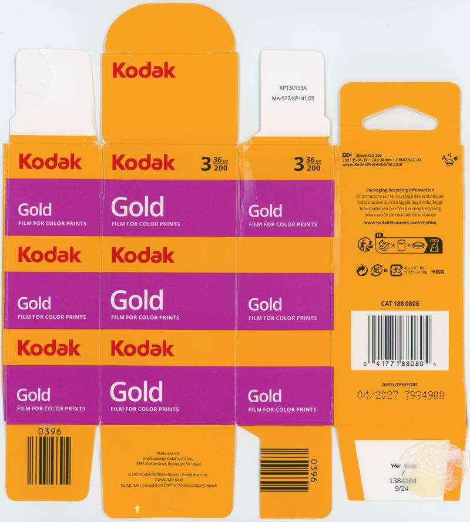
</a>

#### [2027] Kosmo Foto Mono (ref: b74f)

```
Format: 35mm         |  Process : BW      
ISO   : 100          |  Expiry  : 2027-04 
Type  : Single Pack  |  Quantity: 36exp   
Added : 2025-06-25   |  Author  : yc128   
UUID  : 678648d080ba4e3e8f8e3bd7f429b74f
```

<a href="./archive/00077_000.jpg" target="_blank">
	
</a>

#### [2027] Lomography Lomochrome Color'92 (ref: 9fdb)

```
Format: 120          |  Process : C-41    
ISO   : 400          |  Expiry  : 2027-04 
Type  : Single Pack  |  Quantity: N/A     
Added : 2025-09-07   |  Author  : @zruk_ts
UUID  : 48a192dcc8f44c17a449dfccf8279fdb
```

<a href="./archive/00314_000.jpg" target="_blank">
	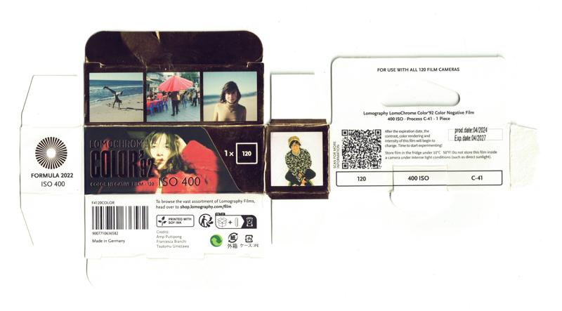
</a>


`UUID: d7e77f89cf4549d383b81dad410adff4`↓

<a href="./archive/00314_001.jpg" target="_blank">
	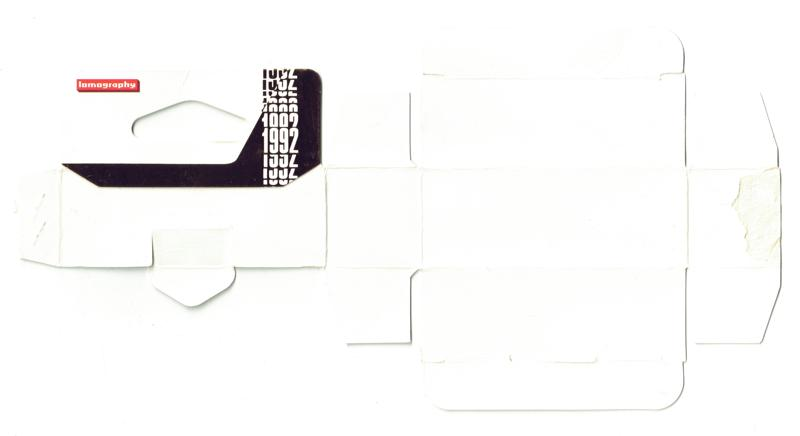
</a>

#### [2027] Rollei Infrared (ref: eae2)

```
Format: 35mm         |  Process : BW      
ISO   : 200          |  Expiry  : 2027-04 
Type  : Single Pack  |  Quantity: 36exp   
Added : 2025-01-21   |  Author  : @ob.skura
UUID  : 9ef642a09d294cbfad7e040a701deae2
```

<a href="./archive/00047_000.jpg" target="_blank">
	
</a>


`UUID: 5bbaeaec47a046a683f87f266c73e71e`↓

<a href="./archive/00047_001.jpg" target="_blank">
	
</a>

#### [2027] Foma Ortho 400 (ref: c559)

```
Format: 35mm         |  Process : BW      
ISO   : 400          |  Expiry  : 2027-05 
Type  : Single Pack  |  Quantity: 36exp   
Added : 2025-08-15   |  Author  : Pelicram
UUID  : 676655ff95914769b0869d71d824c559
```

<a href="./archive/00187_000.jpg" target="_blank">
	
</a>


`UUID: 51e4fc9142fa45039f5d4a5d823f1ab5`↓

<a href="./archive/00187_001.jpg" target="_blank">
	
</a>

#### [2027] Fujifilm Superia Premium 400 (ref: ef1f)

```
Format: 35mm         |  Process : C-41    
ISO   : 400          |  Expiry  : 2027-05 
Type  : Single Pack  |  Quantity: 36exp   
Added : 2025-10-06   |  Author  : @Hol.m35
UUID  : 433055f5732e4d53b4245da4dfe0ef1f
```

<a href="./archive/00372_000.jpg" target="_blank">
	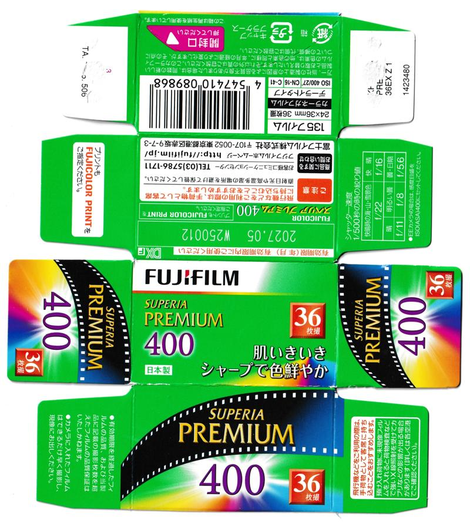
</a>

#### [2027] Lomography Lomochrome Purple (ref: 068f)

```
Format: 35mm         |  Process : C-41    
ISO   : 100-400      |  Expiry  : 2027-05 
Type  : Single Pack  |  Quantity: 36exp   
Added : 2025-07-22   |  Author  : @SirBrentsworth
UUID  : b02540ba4b454a639f8096f9474d068f
```

<a href="./archive/00078_000.jpg" target="_blank">
	
</a>


`UUID: bd02e2aa40df4da59c616139d8d06db6`↓

<a href="./archive/00078_001.jpg" target="_blank">
	
</a>

#### [2027] Reflx Lab Pro 100 (ref: 8bec)

```
Format: 127          |  Process : C-41    
ISO   : 100          |  Expiry  : 2027-05 
Type  : Single Pack  |  Quantity: N/A     
Added : 2025-08-28   |  Author  : The Compartmentalist
UUID  : a361e3b88dde4e0482027e58f12d8bec
```

<a href="./archive/00264_000.jpg" target="_blank">
	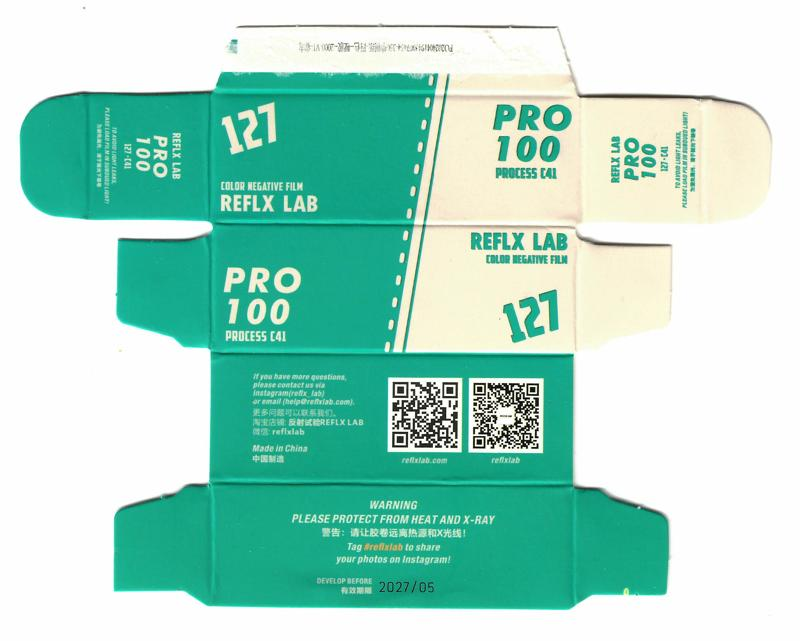
</a>

#### [2027] Harman Phoenix II (ref: f686)

```
Format: 120          |  Process : C-41    
ISO   : 200          |  Expiry  : 2027-06 
Type  : Single Pack  |  Quantity: N/A     
Added : 2025-07-30   |  Author  : yc128   
UUID  : 42f9d40379814cf8b02c3f0daf74f686
```

<a href="./archive/00109_000.jpg" target="_blank">
	
</a>


`UUID: db80264f66ae451abd1b0cc6f34e3280`↓

<a href="./archive/00109_001.jpg" target="_blank">
	
</a>

#### [2027] Harman Phoenix II (ref: 40df)

```
Format: 35mm         |  Process : C-41    
ISO   : 200          |  Expiry  : 2027-06 
Type  : Single Pack  |  Quantity: 36exp   
Added : 2025-07-30   |  Author  : yc128   
UUID  : f12ed23e31e14008a969fe05f29940df
```

<a href="./archive/00110_000.jpg" target="_blank">
	
</a>


`UUID: b6dcbe9ae6ea4aebabaf290f3160a553`↓

<a href="./archive/00110_001.jpg" target="_blank">
	
</a>

#### [2027] Ilford Delta 3200 Professional (ref: 9b54)

```
Format: 35mm         |  Process : BW      
ISO   : 3200         |  Expiry  : 2027-06 
Type  : Single Pack  |  Quantity: 36exp   
Added : 2025-07-31   |  Author  : Pelicram
UUID  : d6f377dbe74745a0aacdf51ce7669b54
```

<a href="./archive/00126_000.jpg" target="_blank">
	
</a>


`UUID: 3921b5a404564bb2b4231bf59d22e6d3`↓

<a href="./archive/00126_001.jpg" target="_blank">
	
</a>

#### [2027] ADOX CHS 100 II (ref: 8adf)

```
Format: 35mm         |  Process : BW      
ISO   : 100          |  Expiry  : 2027-07 
Type  : Single Pack  |  Quantity: 36exp   
Added : 2025-10-16   |  Author  : nick    
UUID  : edb6848680f443f2a73b70b13c028adf
```

<a href="./archive/00402_000.jpg" target="_blank">
	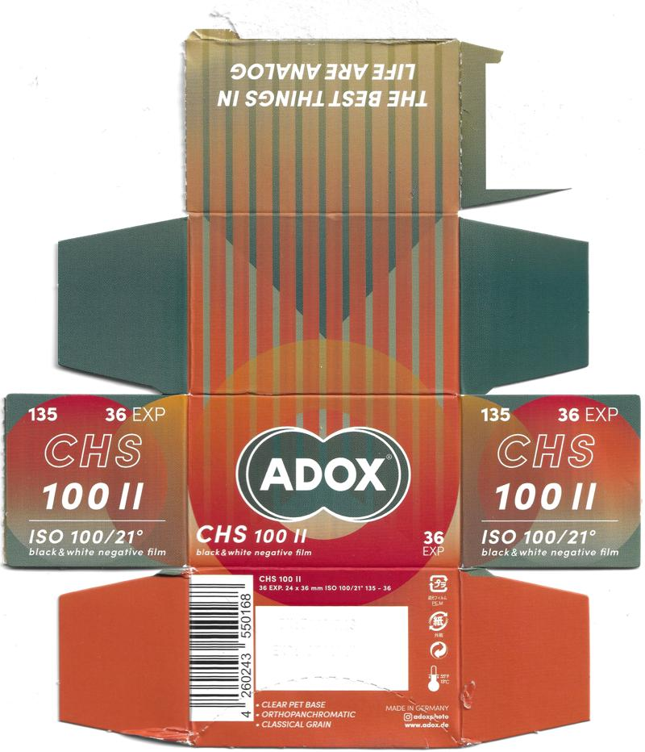
</a>


`UUID: e08156a89f334bd785397e498b9710f7`↓

<a href="./archive/00402_001.jpg" target="_blank">
	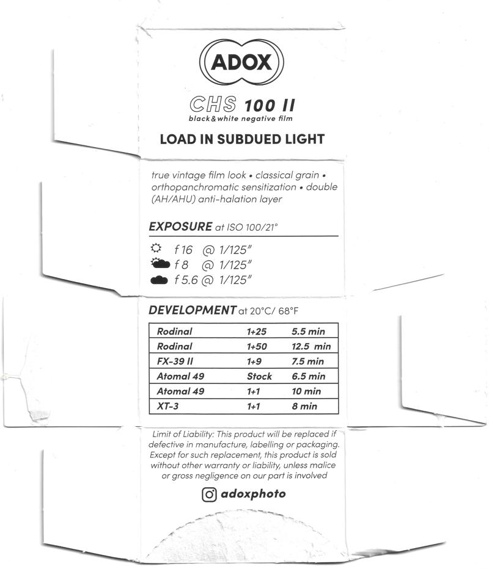
</a>

#### [2027] ADOX HR 50 (ref: 4da7)

```
Format: 35mm         |  Process : BW      
ISO   : 50           |  Expiry  : 2027-07 
Type  : Single Pack  |  Quantity: 36exp   
Added : 2025-08-13   |  Author  : Pelicram
UUID  : a504b8da97b642908de921d1053d4da7
```

<a href="./archive/00182_000.jpg" target="_blank">
	
</a>


`UUID: f5e745758ed2479ea297dce9275f3508`↓

<a href="./archive/00182_001.jpg" target="_blank">
	
</a>

#### [2027] Foma Fomapan Classic 100 (ref: 0030)

```
Format: 35mm         |  Process : BW      
ISO   : 100          |  Expiry  : 2027-07 
Type  : Single Pack  |  Quantity: 36exp   
Added : 2025-07-31   |  Author  : Pelicram
UUID  : bf1734a1ea48495d92afb7d03bdf0030
```

<a href="./archive/00129_000.jpg" target="_blank">
	
</a>


`UUID: 01adf7d0b4df41f990c60d5cafb7f55f`↓

<a href="./archive/00129_001.jpg" target="_blank">
	
</a>

#### [2027] Lomography Orca (ref: d506)

```
Format: 110          |  Process : BW      
ISO   : 100          |  Expiry  : 2027-07 
Type  : Single Pack  |  Quantity: 24exp   
Added : 2025-07-31   |  Author  : Pelicram
UUID  : 6d10288df24748fa8944774857f3d506
```

<a href="./archive/00134_000.jpg" target="_blank">
	
</a>

#### [2027] Rollei RPX 25 (ref: b14c)

```
Format: 35mm         |  Process : BW      
ISO   : 25           |  Expiry  : 2027-07 
Type  : Single Pack  |  Quantity: 36exp   
Added : 2025-10-16   |  Author  : nick    
UUID  : 38e7af3c3ff34abeb7ae0badd310b14c
```

<a href="./archive/00400_000.jpg" target="_blank">
	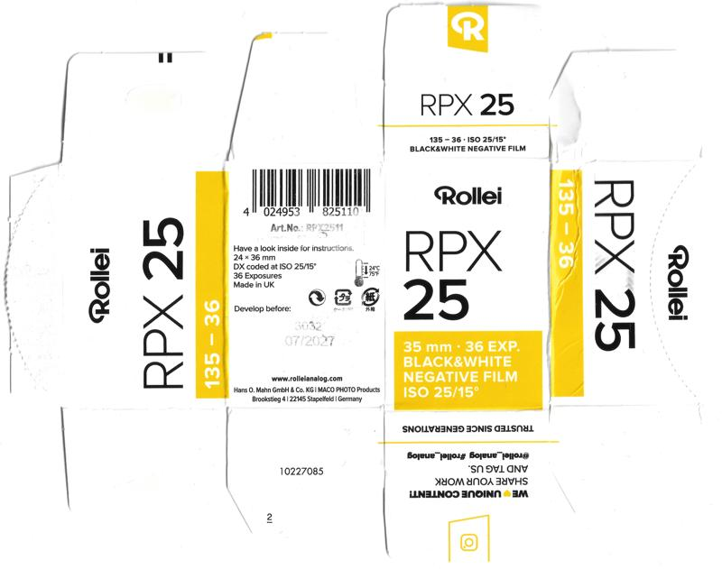
</a>


`UUID: 60733808afbf441da74f97bdd47b9733`↓

<a href="./archive/00400_001.jpg" target="_blank">
	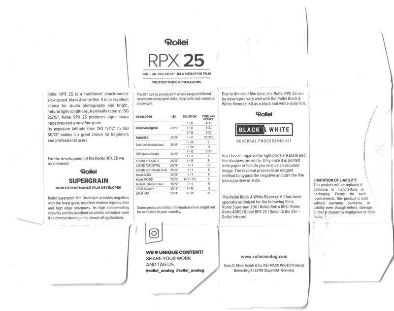
</a>

#### [2027] Rollei Infrared (ref: 4f54)

```
Format: 120          |  Process : BW      
ISO   : 200          |  Expiry  : 2027-08 
Type  : Single Pack  |  Quantity: N/A     
Added : 2025-01-05   |  Author  : dekuNukem
UUID  : b7bb7d65979543d0a8e5c9179d734f54
```

<a href="./archive/00030_000.jpg" target="_blank">
	
</a>


`UUID: a950a24ab9da4b23b33e0b4b9d28d5d5`↓

<a href="./archive/00030_001.jpg" target="_blank">
	
</a>

#### [2027] Ilford XP2 Super (ref: 622a)

```
Format: 35mm         |  Process : C-41    
ISO   : 400          |  Expiry  : 2027-09 
Type  : Single Pack  |  Quantity: 36exp   
Added : 2025-08-08   |  Author  : TheSelousScout
UUID  : 5863564ab1ef43a4b41fb5312dd0622a
```

<a href="./archive/00170_000.jpg" target="_blank">
	
</a>


`UUID: 2e9c0e4f84414bb192512b4ce5b1e212`↓

<a href="./archive/00170_001.jpg" target="_blank">
	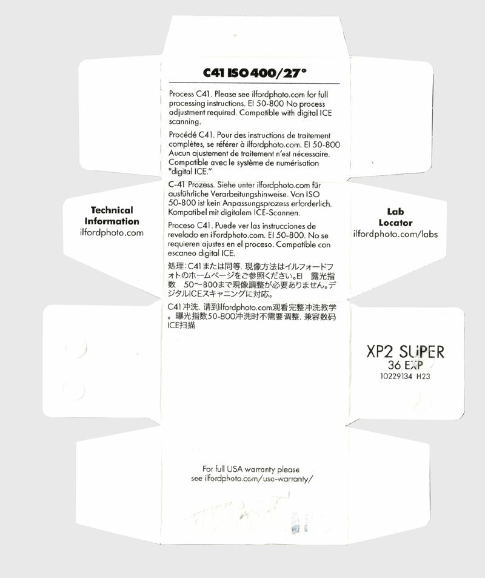
</a>

#### [2027] Kodak Kodacolor 100 (ref: 73e0)

```
Format: 35mm         |  Process : C-41    
ISO   : 100          |  Expiry  : 2027-09 
Type  : Single Pack  |  Quantity: 36exp   
Added : 2025-10-25   |  Author  : minidiscus
UUID  : 930ee2c830af4f0a957649764d5873e0
```

<a href="./archive/00453_000.jpg" target="_blank">
	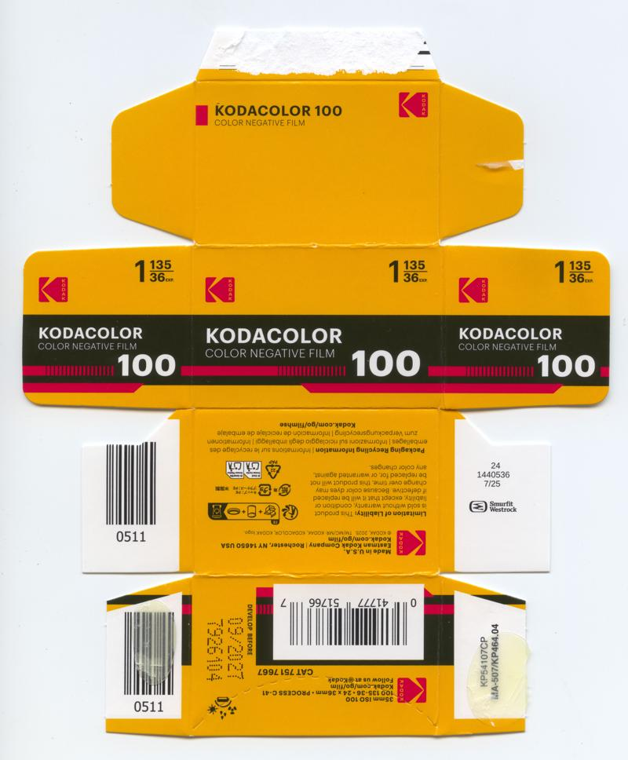
</a>

#### [2027] Lomography Color Negative Film (ref: 1529)

```
Format: 120          |  Process : C-41    
ISO   : 800          |  Expiry  : 2027-09 
Type  : Single Pack  |  Quantity: N/A     
Added : 2025-09-07   |  Author  : @zruk_ts
UUID  : e200ab98ca5746cbb6f3af1afb481529
```

<a href="./archive/00313_000.jpg" target="_blank">
	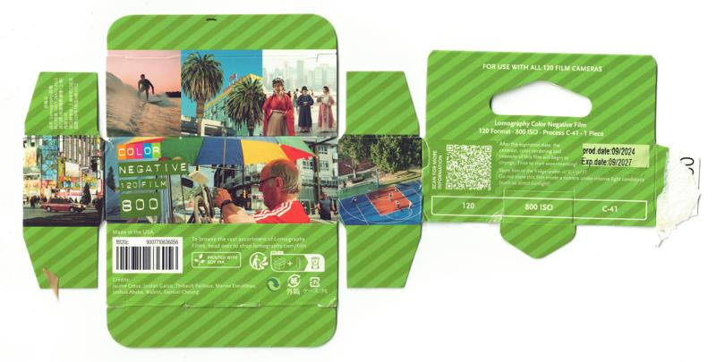
</a>


`UUID: b59730221b5f438388c4a9cbcba44676`↓

<a href="./archive/00313_001.jpg" target="_blank">
	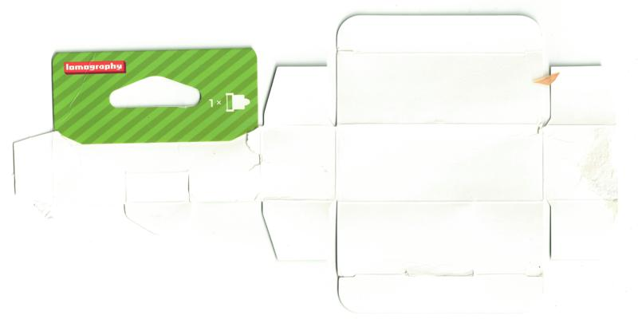
</a>

#### [2027] ADOX CMS 20 II Pro (ref: 0bea)

```
Format: 35mm         |  Process : BW      
ISO   : 20           |  Expiry  : 2027-10 
Type  : Single Pack  |  Quantity: 36exp   
Added : 2025-10-16   |  Author  : nick    
UUID  : 092f316a772246018a8de96ebd380bea
```

<a href="./archive/00401_000.jpg" target="_blank">
	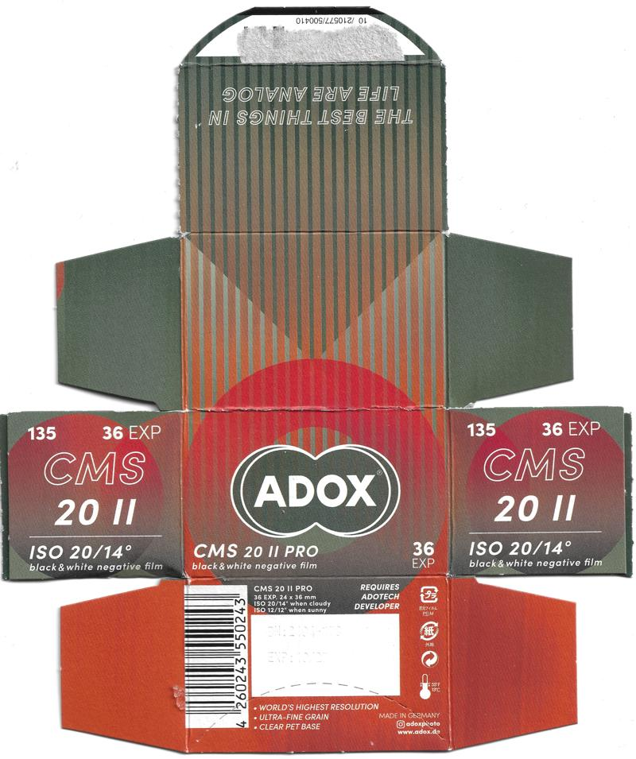
</a>


`UUID: d255a9a922f64c6da3cb801c7906b63b`↓

<a href="./archive/00401_001.jpg" target="_blank">
	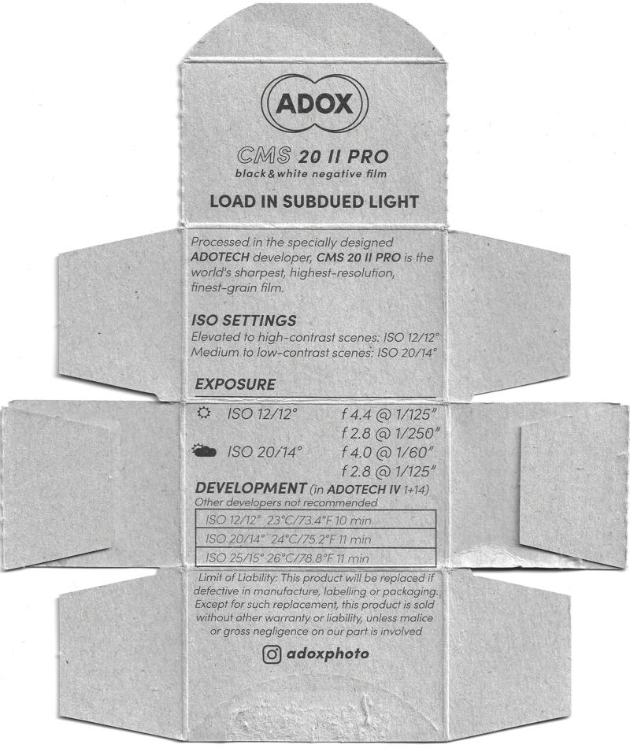
</a>

#### [2027] Reflx Lab 250D (ref: 1a3e)

```
Format: 120          |  Process : ECN-2   
ISO   : 250          |  Expiry  : 2027-12 
Type  : Single Pack  |  Quantity: N/A     
Added : 2025-08-18   |  Author  : lt_col_tall
UUID  : ce8b081c148f43f7921e2fb4d7aa1a3e
```

<a href="./archive/00194_000.jpg" target="_blank">
	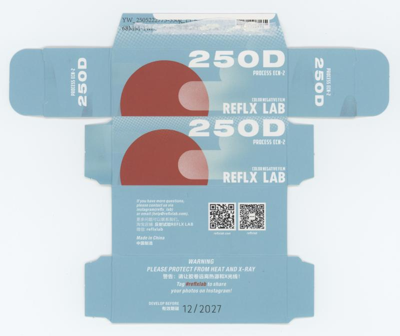
</a>

#### [2027] Reflx Lab Pro 100 (ref: 1311)

```
Format: 220          |  Process : C-41    
ISO   : 100          |  Expiry  : 2027-12 
Type  : Single Pack  |  Quantity: N/A     
Added : 2025-08-18   |  Author  : lt_col_tall
UUID  : f7bc85a093744f3084883876ecc51311
```

<a href="./archive/00195_000.jpg" target="_blank">
	
</a>

#### [2027] Wolfen NP100 (ref: 71a6)

```
Format: 35mm         |  Process : BW      
ISO   : 100          |  Expiry  : 2027-12 
Type  : Single Pack  |  Quantity: 36exp   
Added : 2025-07-31   |  Author  : Pelicram
UUID  : 898148fa3a754866a407bbecec4a71a6
```

<a href="./archive/00131_000.jpg" target="_blank">
	
</a>

#### [2028] Foma Fomapan Creative 200 (ref: 84a5)

```
Format: 35mm         |  Process : BW      
ISO   : 200          |  Expiry  : 2028-01 
Type  : Single Pack  |  Quantity: 36exp   
Added : 2025-07-28   |  Author  : lilyu.xyz
UUID  : c3d51159b481435b90dbe2411de784a5
```

<a href="./archive/00092_000.jpg" target="_blank">
	
</a>


`UUID: ae13defc8e3d43e2988974430ea63335`↓

<a href="./archive/00092_001.jpg" target="_blank">
	
</a>

#### [2028] Rollei SUPERPAN 200 (ref: ee8f)

```
Format: 35mm         |  Process : BW      
ISO   : 200          |  Expiry  : 2028-01 
Type  : Single Pack  |  Quantity: 36exp   
Added : 2025-06-05   |  Author  : benikum 
UUID  : f22d3e1e2f70453f87aea4b67db3ee8f
```

<a href="./archive/00071_000.jpg" target="_blank">
	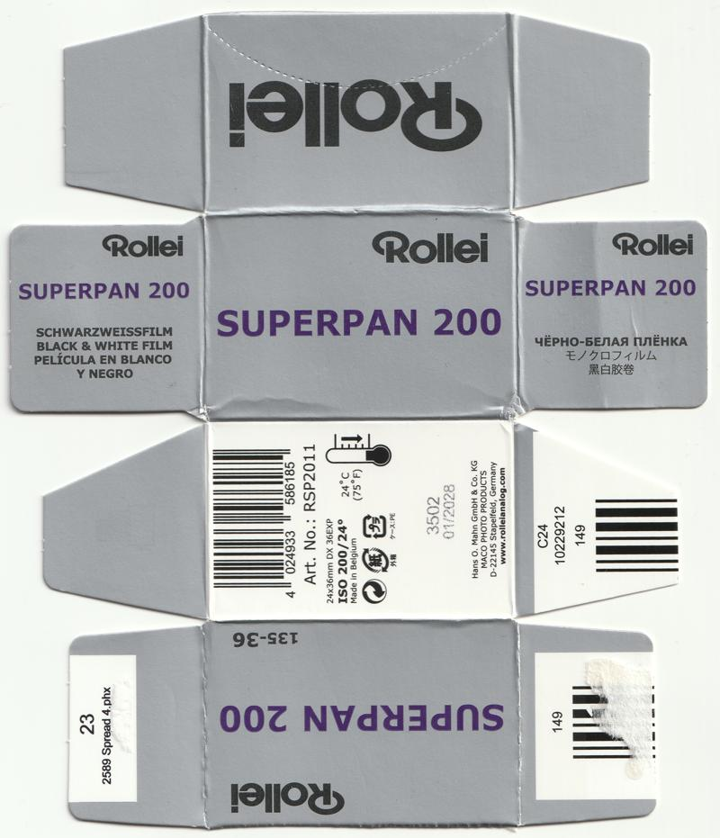
</a>


`UUID: 7c96a37e3f0f4550876f507554b2a6dd`↓

<a href="./archive/00071_001.jpg" target="_blank">
	
</a>

#### [2028] Agfa APX (ref: 5276)

```
Format: 35mm         |  Process : BW      
ISO   : 100          |  Expiry  : 2028-05 
Type  : Single Pack  |  Quantity: 36exp   
Added : 2025-07-28   |  Author  : lilyu.xyz
UUID  : ecf4e081ccf64a9a8606601f9f665276
```

<a href="./archive/00093_000.jpg" target="_blank">
	
</a>


`UUID: 286ea2dbf5394a36b8f013b9aaa33a46`↓

<a href="./archive/00093_001.jpg" target="_blank">
	
</a>

#### [2028] Foma Fomapan 200 (ref: 60ee)

```
Format: 35mm         |  Process : BW      
ISO   : 200          |  Expiry  : 2028-05 
Type  : Bulk Roll    |  Quantity: 100ft   
Added : 2025-08-13   |  Author  : Pelicram
UUID  : 840026a068594c3389b34374204f60ee
```

<a href="./archive/00183_000.jpg" target="_blank">
	
</a>

#### [2028] Harman Phoenix II (ref: 37c7)

```
Format: 120          |  Process : C-41    
ISO   : 200          |  Expiry  : 2028-06 
Type  : Single Pack  |  Quantity: N/A     
Added : 2025-10-05   |  Author  : dekuNukem
UUID  : df238026e7c84a89961248cec20737c7
Notes : Chinese version
```

<a href="./archive/00366_000.jpg" target="_blank">
	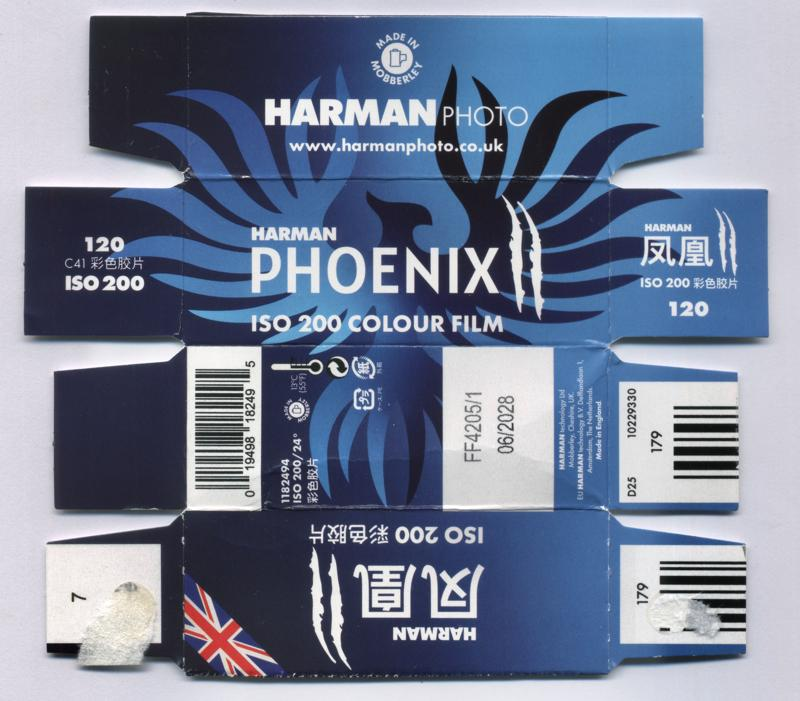
</a>


`UUID: fcc0cdbabdd246f7a2de58209827f9c3`↓

<a href="./archive/00366_001.jpg" target="_blank">
	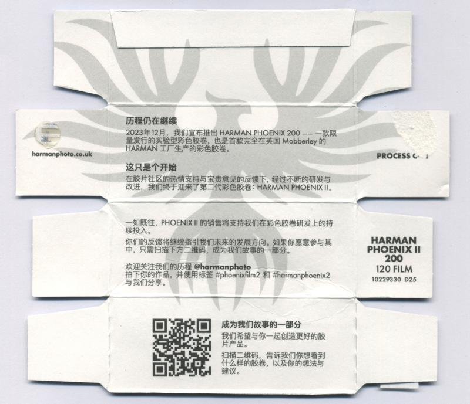
</a>

#### [2028] Harman Phoenix II (ref: 41d4)

```
Format: 35mm         |  Process : C-41    
ISO   : 200          |  Expiry  : 2028-06 
Type  : Single Pack  |  Quantity: 36exp   
Added : 2025-10-05   |  Author  : dekuNukem
UUID  : 1989020e64ed45108cb6e45a389641d4
Notes : Chinese version
```

<a href="./archive/00367_000.jpg" target="_blank">
	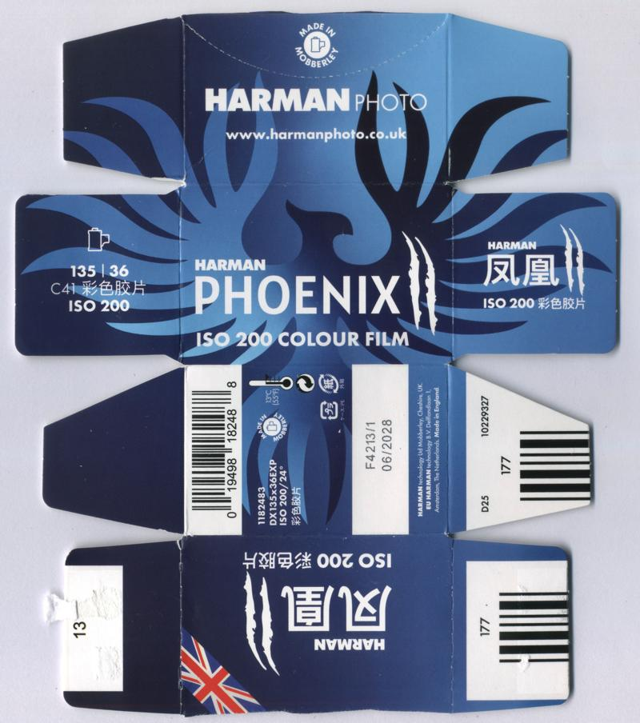
</a>


`UUID: 32693b43dc864734a3514bada3537ae3`↓

<a href="./archive/00367_001.jpg" target="_blank">
	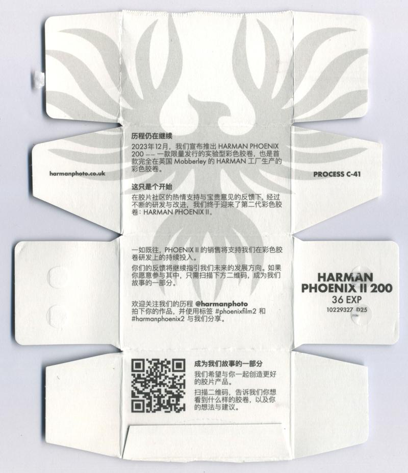
</a>

#### [2028] Ilford HP5 Plus (ref: df49)

```
Format: 35mm         |  Process : BW      
ISO   : 400          |  Expiry  : 2028-06 
Type  : Single Pack  |  Quantity: 36exp   
Added : 2025-07-22   |  Author  : @SirBrentsworth
UUID  : 8db6d8343d544c21bfd539c32525df49
```

<a href="./archive/00083_000.jpg" target="_blank">
	
</a>


`UUID: aa635d75717e4083a0ab53a0c2e1b892`↓

<a href="./archive/00083_001.jpg" target="_blank">
	
</a>

#### [2028] Rollei RPX 400 (ref: 2155)

```
Format: 35mm         |  Process : BW      
ISO   : 400          |  Expiry  : 2028-08 
Type  : Single Pack  |  Quantity: 36exp   
Added : 2025-07-31   |  Author  : Pelicram
UUID  : 19ef81d6d03844b088250c7b54032155
```

<a href="./archive/00136_000.jpg" target="_blank">
	
</a>


`UUID: 962831862dbc4da89c8b979e5fb6584b`↓

<a href="./archive/00136_001.jpg" target="_blank">
	
</a>

#### [2028] Ilford FP4 Plus (ref: 3bc0)

```
Format: 35mm         |  Process : BW      
ISO   : 125          |  Expiry  : 2028-09 
Type  : Single Pack  |  Quantity: 24exp   
Added : 2025-09-06   |  Author  : @toastergod101
UUID  : c1bab96948014588adbde72665853bc0
```

<a href="./archive/00304_000.jpg" target="_blank">
	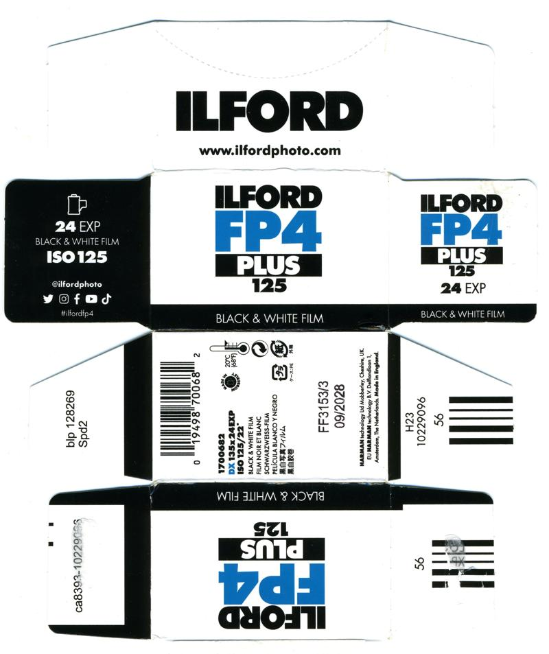
</a>


`UUID: 627cee08157e4e5c9277b0e02fe7eb6c`↓

<a href="./archive/00304_001.jpg" target="_blank">
	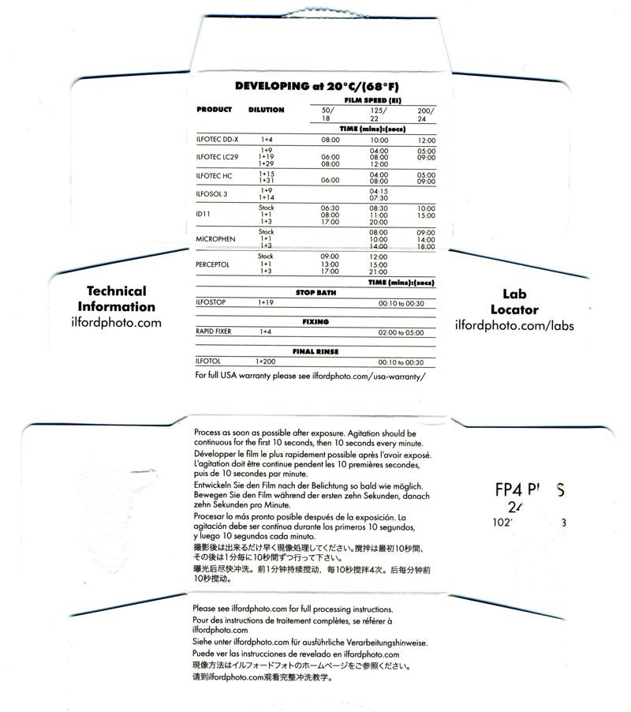
</a>

#### [2028] Kentmere PAN 100 (ref: c907)

```
Format: 35mm         |  Process : BW      
ISO   : 100          |  Expiry  : 2028-11 
Type  : Single Pack  |  Quantity: 24exp   
Added : 2025-07-22   |  Author  : @SirBrentsworth
UUID  : c4c934a23c59430f8b99c71a9322c907
```

<a href="./archive/00082_000.jpg" target="_blank">
	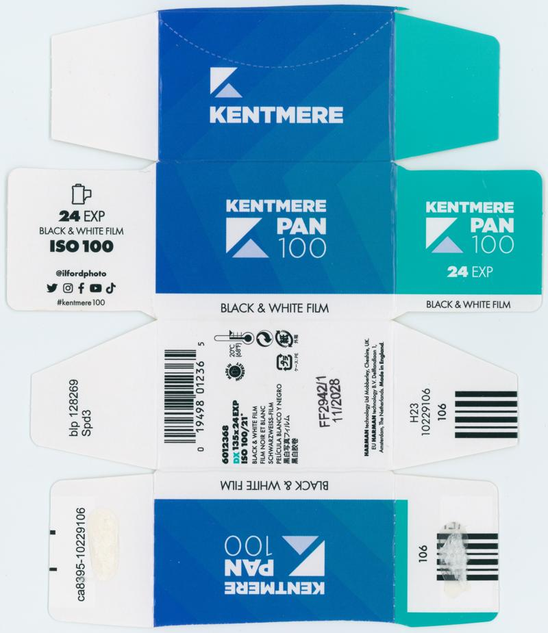
</a>


`UUID: c91fc253637a47dc8507a7dab7d38475`↓

<a href="./archive/00082_001.jpg" target="_blank">
	
</a>

#### [2029] Kentmere PAN 400 (ref: 827e)

```
Format: 35mm         |  Process : BW      
ISO   : 400          |  Expiry  : 2029-06 
Type  : Single Pack  |  Quantity: 36exp   
Added : 2025-01-04   |  Author  : dekuNukem
UUID  : d2cf9753f6fd49a78404c72d848a827e
```

<a href="./archive/00015_000.jpg" target="_blank">
	
</a>


`UUID: 3514628a650741c8abb104047d809f55`↓

<a href="./archive/00015_001.jpg" target="_blank">
	
</a>

#### [2029] Kentmere PAN 400 (ref: a327)

```
Format: 35mm         |  Process : BW      
ISO   : 400          |  Expiry  : 2029-07 
Type  : Single Pack  |  Quantity: 24exp   
Added : 2025-07-31   |  Author  : Pelicram
UUID  : 58f2bea3a3204a1dafebf2881d99a327
```

<a href="./archive/00145_000.jpg" target="_blank">
	
</a>


`UUID: c771fff8ecbb4c9b981f3606dd4fa428`↓

<a href="./archive/00145_001.jpg" target="_blank">
	
</a>

#### [2030] Kentmere PAN 200 (ref: 0e32)

```
Format: 35mm         |  Process : BW      
ISO   : 200          |  Expiry  : 2030-04 
Type  : Single Pack  |  Quantity: 36exp   
Added : 2025-08-15   |  Author  : Pelicram
UUID  : b0e988456d7444b1b879dc6ca4a80e32
```

<a href="./archive/00186_000.jpg" target="_blank">
	
</a>

#### [Unknown] Agfa Agfacolor Umkehr-Ultra T (ref: 01db)

```
Format: 35mm         |  Process : Unknown 
ISO   : Unknown      |  Expiry  : Unknown 
Type  : Single Pack  |  Quantity: 20exp   
Added : 2025-10-07   |  Author  : Pelicram
UUID  : b79dcd08bc514df3982630e3401f01db
```

<a href="./archive/00380_000.jpg" target="_blank">
	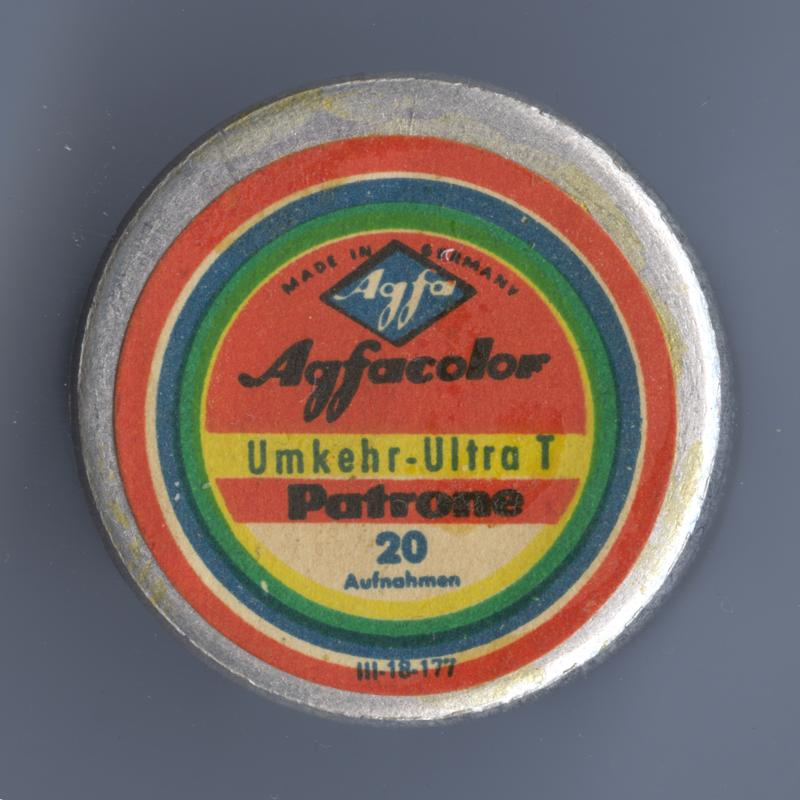
</a>

#### [Unknown] Agfa Agfapan  APX 25 (ref: 805f)

```
Format: 35mm         |  Process : BW      
ISO   : 25           |  Expiry  : Unknown 
Type  : Single Pack  |  Quantity: 36exp   
Added : 2025-08-18   |  Author  : @recycling.film
UUID  : 4ef7e8e28d2c4c589d24d9e12135805f
```

<a href="./archive/00198_000.jpg" target="_blank">
	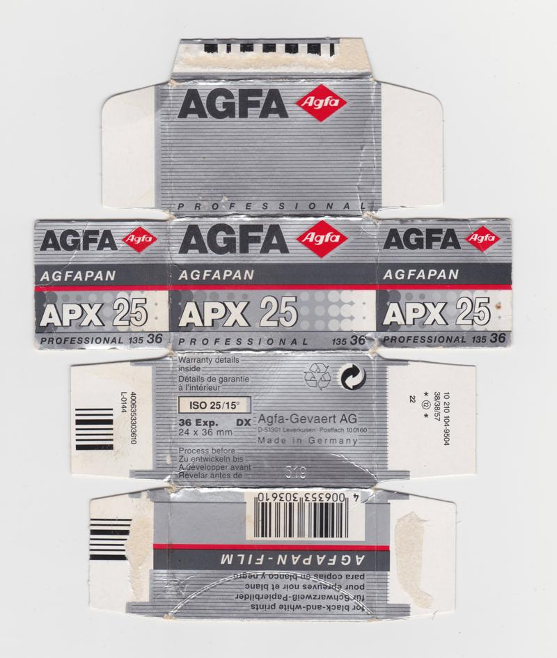
</a>


`UUID: 757b2d5a25cc41aab1220ff909f90fb0`↓

<a href="./archive/00198_001.jpg" target="_blank">
	
</a>

#### [Unknown] Agfa Autolith Repo (ref: 8e68)

```
Format: 9x12cm       |  Process : BW      
ISO   : Unknown      |  Expiry  : Unknown 
Type  : Single Pack  |  Quantity: 12 Sheets
Added : 2025-07-29   |  Author  : Nano_Burger
UUID  : 952823ad9ef14c75a83ac8e230b38e68
```

<a href="./archive/00098_000.jpg" target="_blank">
	
</a>

#### [Unknown] Agfa Extra Rapid Platten (ref: 7418)

```
Format: 9x12cm       |  Process : BW      
ISO   : Unknown      |  Expiry  : Unknown 
Type  : Single Pack  |  Quantity: 12 Sheets
Added : 2025-09-03   |  Author  : @ellafridalindblom
UUID  : b3c3d2e18aed443fb89465bd6f257418
```

<a href="./archive/00287_000.jpg" target="_blank">
	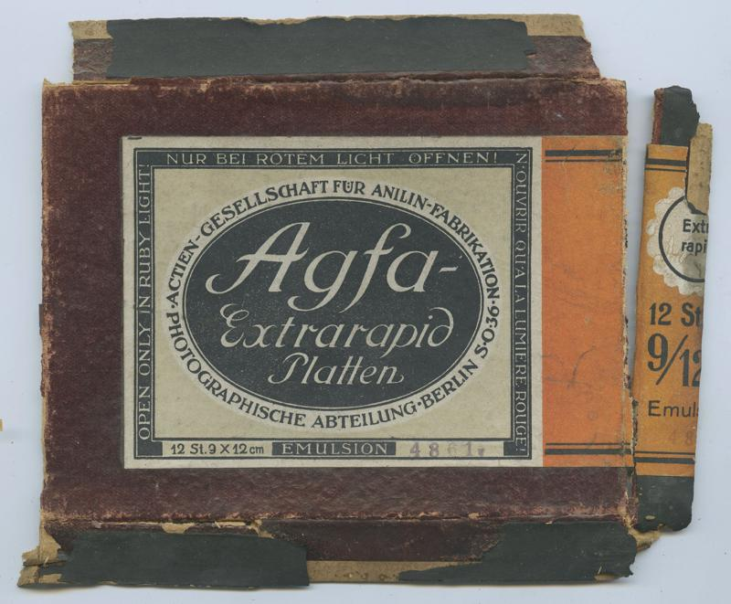
</a>

#### [Unknown] Agfa Isopan ISS (ref: b9d7)

```
Format: 35mm         |  Process : BW      
ISO   : 100          |  Expiry  : Unknown 
Type  : Bulk Roll    |  Quantity: 5m      
Added : 2025-10-07   |  Author  : Pelicram
UUID  : 25cfa8cb048141e38ed79df6bf38b9d7
```

<a href="./archive/00374_000.jpg" target="_blank">
	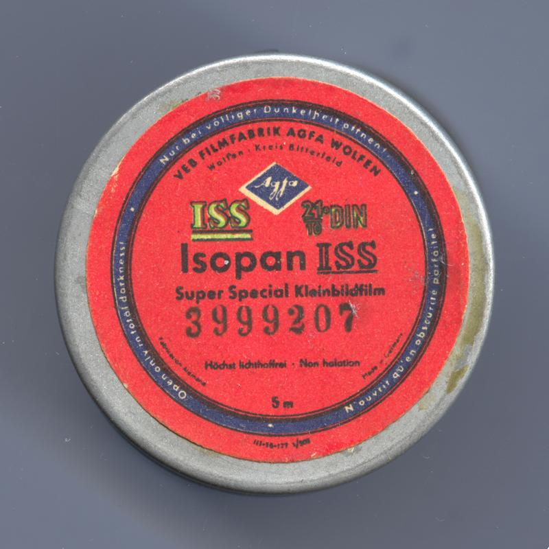
</a>

#### [Unknown] Agfa Trockenplatten (ref: 0937)

```
Format: 9x12cm       |  Process : BW      
ISO   : Unknown      |  Expiry  : Unknown 
Type  : Single Pack  |  Quantity: 12 Sheets
Added : 2025-09-03   |  Author  : @ellafridalindblom
UUID  : ad700b1b71964ee3a1f2aaa78d8a0937
```

<a href="./archive/00283_000.jpg" target="_blank">
	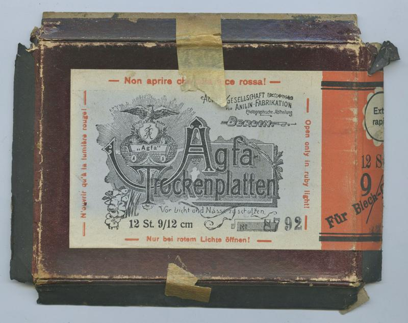
</a>

#### [Unknown] Defender Extra Fast Panchromatic (ref: 348b)

```
Format: 12x16.5cm    |  Process : BW      
ISO   : Unknown      |  Expiry  : Unknown 
Type  : Single Pack  |  Quantity: 12 Sheets
Added : 2025-09-03   |  Author  : @ellafridalindblom
UUID  : 0d51ddb121144fe6a26519a75517348b
```

<a href="./archive/00284_000.jpg" target="_blank">
	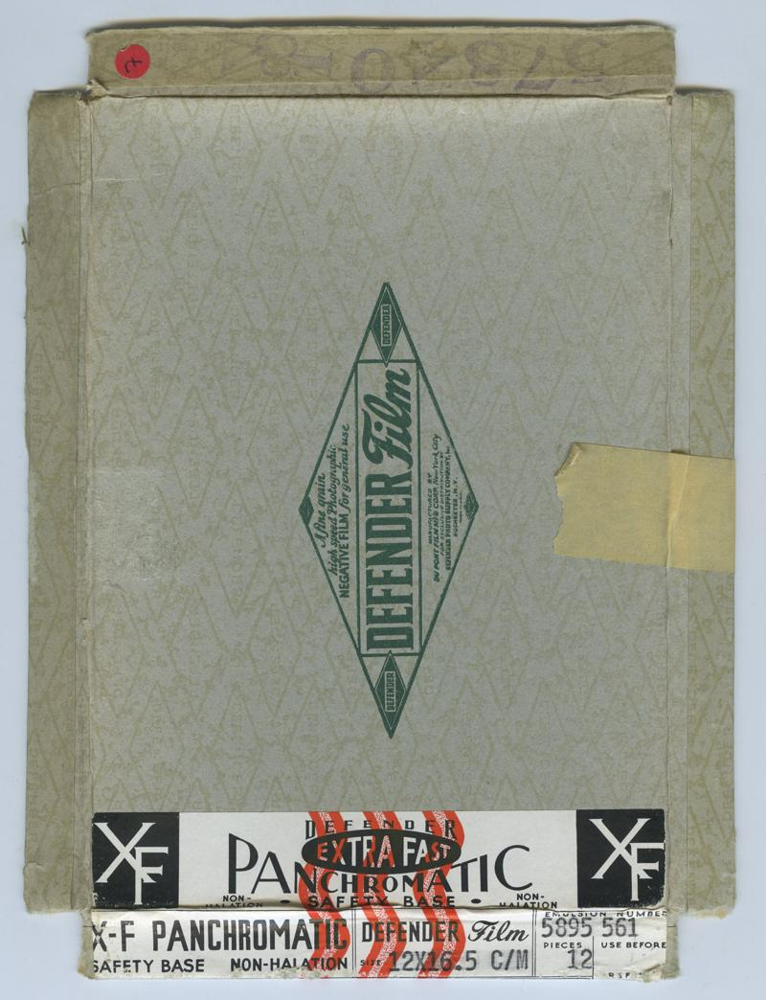
</a>

#### [Unknown] Defender Extra Special Fast Panchromatic (ref: afcf)

```
Format: 12x16.5cm    |  Process : BW      
ISO   : Unknown      |  Expiry  : Unknown 
Type  : Single Pack  |  Quantity: 12 Sheets
Added : 2025-09-03   |  Author  : @ellafridalindblom
UUID  : bacfd600baf843a694225c99ed99afcf
```

<a href="./archive/00285_000.jpg" target="_blank">
	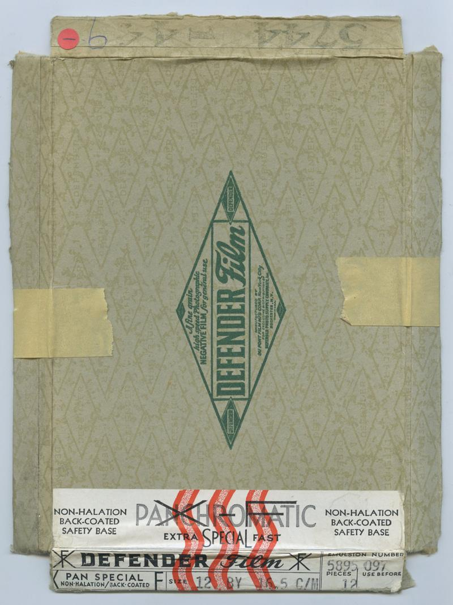
</a>

#### [Unknown] Defender Portrait HGS (ref: d69c)

```
Format: 12x16.5cm    |  Process : BW      
ISO   : Unknown      |  Expiry  : Unknown 
Type  : Single Pack  |  Quantity: 12 Sheets
Added : 2025-08-19   |  Author  : @ellafridalindblom
UUID  : 24c9c3108671446dae824d00093fd69c
```

<a href="./archive/00208_000.jpg" target="_blank">
	
</a>


`UUID: 5782545b9d15462e93943f2b62f605f5`↓

<a href="./archive/00208_001.jpg" target="_blank">
	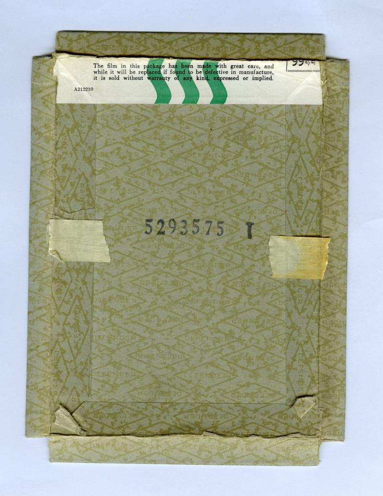
</a>

#### [Unknown] Ferrania Solaris (ref: a929)

```
Format: 35mm         |  Process : C-41    
ISO   : 200          |  Expiry  : Unknown 
Type  : Single Pack  |  Quantity: 36exp   
Added : 2025-08-20   |  Author  : @photos.by.qi
UUID  : 37936bef9f314a45b9ed57f7091fa929
```

<a href="./archive/00214_000.jpg" target="_blank">
	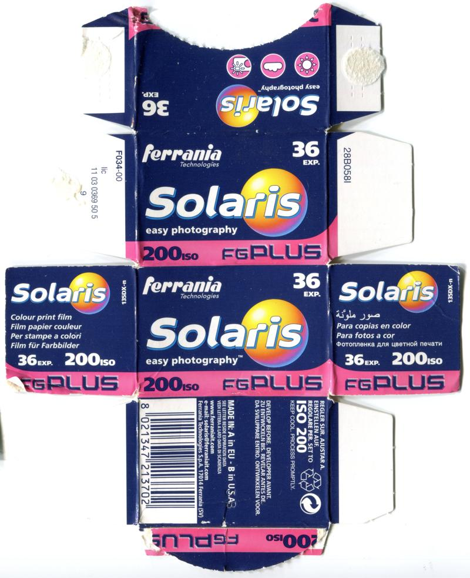
</a>

#### [Unknown] Film Corporation of America TriFCA 120 (ref: 9937)

```
Format: 120          |  Process : Unknown 
ISO   : 80           |  Expiry  : Unknown 
Type  : Single Pack  |  Quantity: N/A     
Added : 2025-09-18   |  Author  : dekuNukem
UUID  : 49fdf7859f354d85933ce875998c9937
Notes : Expiry is probably later than the other one, due to the increase of the processing cost.
```

<a href="./archive/00348_000.jpg" target="_blank">
	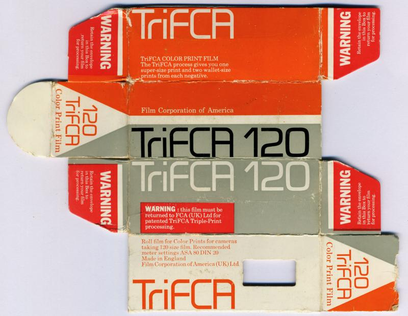
</a>


`UUID: 6ecc1d182bf8420d9d0c02e83bda565d`↓

<a href="./archive/00348_001.jpg" target="_blank">
	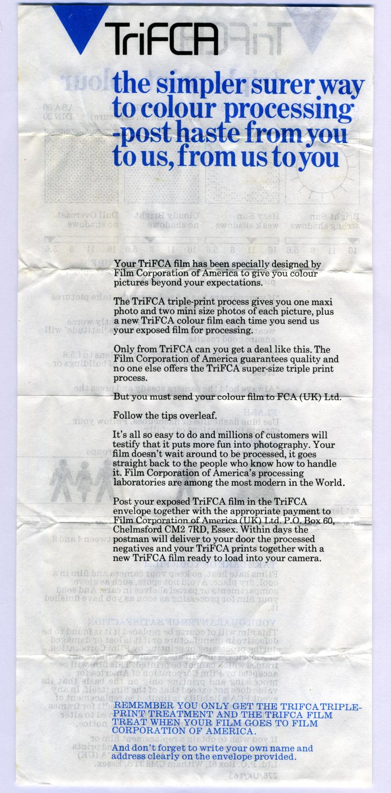
</a>


`UUID: 273677a3c51140c781c4f2bcc7da1ce3`↓

<a href="./archive/00348_002.jpg" target="_blank">
	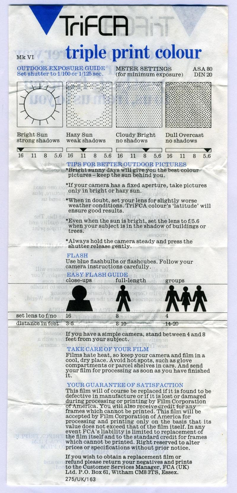
</a>


`UUID: 98f8c5fced3c41198779e0bc6342b785`↓

<a href="./archive/00348_003.jpg" target="_blank">
	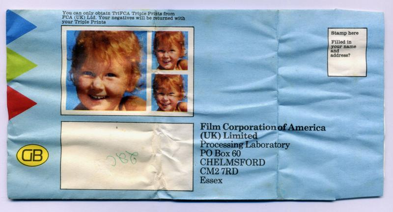
</a>


`UUID: 1ea1b9e629554579aa058a12e7d4c721`↓

<a href="./archive/00348_004.jpg" target="_blank">
	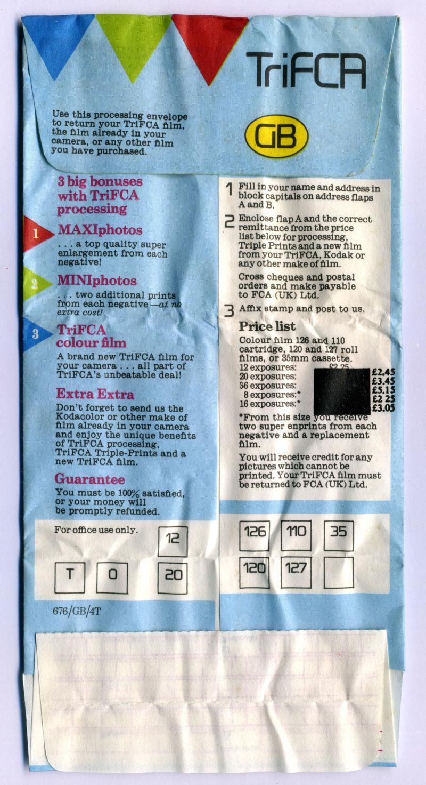
</a>


`UUID: 1d879777e90646b7958f04a7b03c4569`↓

<a href="./archive/00348_005.jpg" target="_blank">
	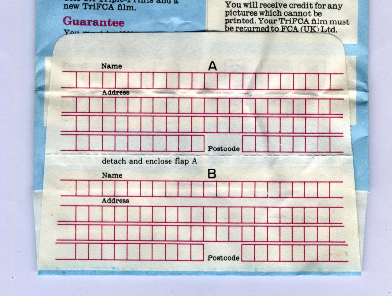
</a>

#### [Unknown] Gevaert Infra-R (ref: fc88)

```
Format: 120          |  Process : BW      
ISO   : Unknown      |  Expiry  : Unknown 
Type  : Single Pack  |  Quantity: N/A     
Added : 2025-10-21   |  Author  : dekuNukem
UUID  : 5700b2c507254c36ac9b05eabf04fc88
```

<a href="./archive/00429_000.jpg" target="_blank">
	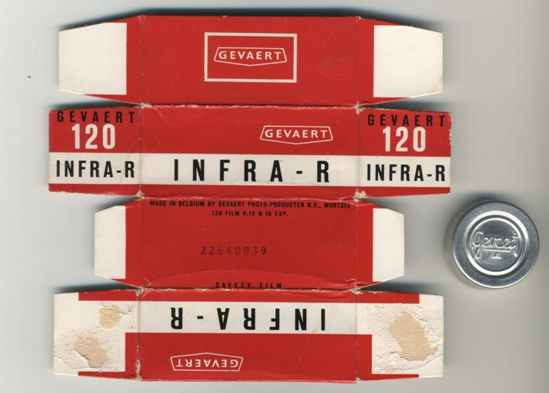
</a>

#### [Unknown] Gevaert Studio Film (ref: 75f9)

```
Format: 12x16.5cm    |  Process : BW      
ISO   : Unknown      |  Expiry  : Unknown 
Type  : Single Pack  |  Quantity: Unknown 
Added : 2025-10-27   |  Author  : @ellafridalindblom
UUID  : e585128e844941a98145d4fca88075f9
Notes : Muster Matt
```

<a href="./archive/00457_000.jpg" target="_blank">
	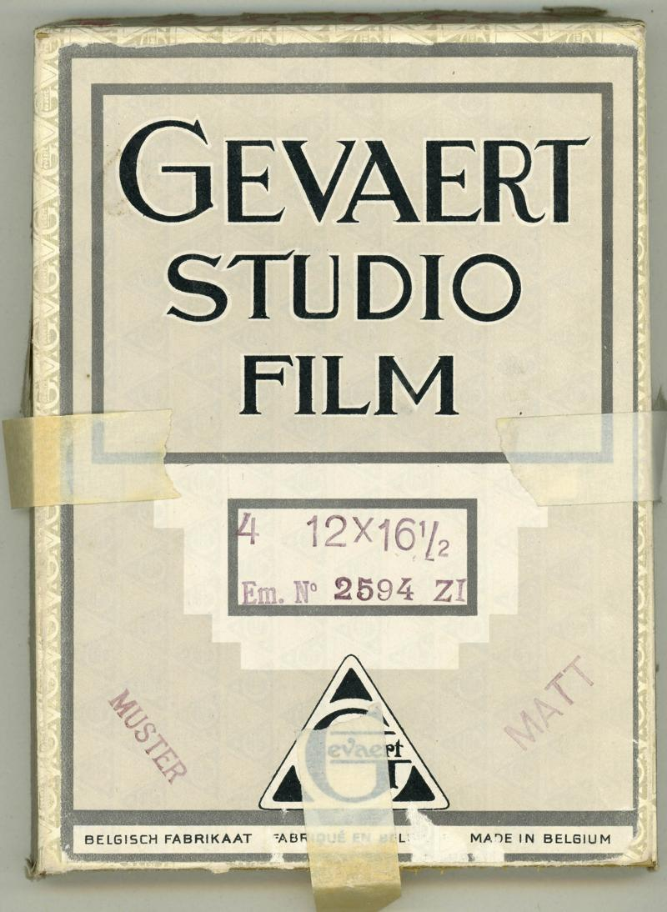
</a>

#### [Unknown] Gevaert Ultra Panchro Normal (ref: 1ff6)

```
Format: 12x16.5cm    |  Process : BW      
ISO   : 800          |  Expiry  : Unknown 
Type  : Single Pack  |  Quantity: 12 Sheets
Added : 2025-09-03   |  Author  : @ellafridalindblom
UUID  : 9a6b4771688d43c58b96c254e43d1ff6
```

<a href="./archive/00288_000.jpg" target="_blank">
	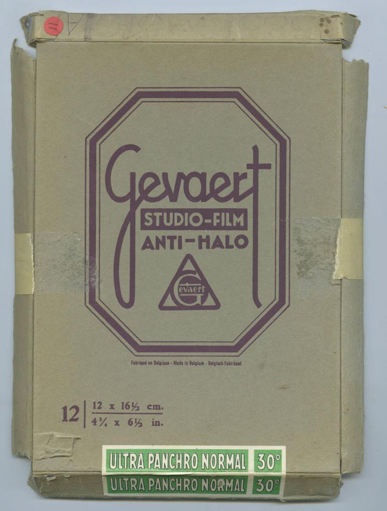
</a>

#### [Unknown] Great Films Processing Kodachrome (ref: c012)

```
Format: 35mm         |  Process : K-14    
ISO   : Unknown      |  Expiry  : Unknown 
Type  : Single Pack  |  Quantity: 20exp   
Added : 2025-10-21   |  Author  : dekuNukem
UUID  : 0f14cf86439a4009a252f730c308c012
```

<a href="./archive/00445_000.jpg" target="_blank">
	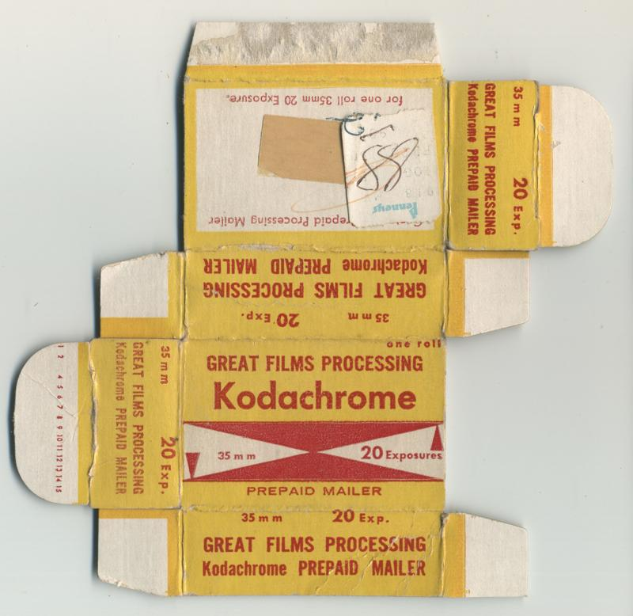
</a>


`UUID: 4080798f7349471c9bc69513abf6b36e`↓

<a href="./archive/00445_001.jpg" target="_blank">
	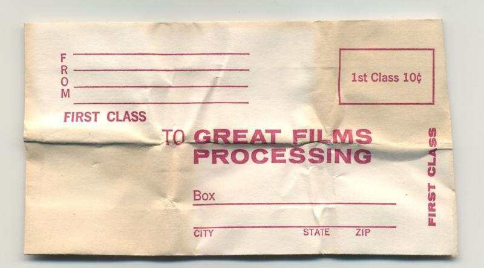
</a>


`UUID: 3d6c1f5381464108a2758a210b1223f5`↓

<a href="./archive/00445_002.jpg" target="_blank">
	
</a>


`UUID: f8c3bdcd064b46b6b5cf8d32372e6e6f`↓

<a href="./archive/00445_003.jpg" target="_blank">
	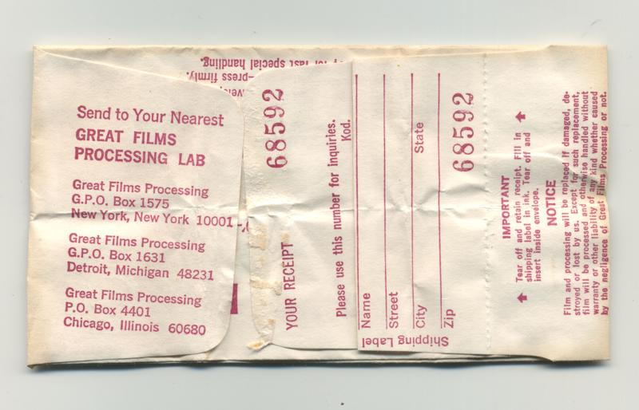
</a>

#### [Unknown] Hasselblad Hassel-plåtar E.R.Orto (ref: ec67)

```
Format: 6.5x9cm      |  Process : BW      
ISO   : Unknown      |  Expiry  : Unknown 
Type  : Single Pack  |  Quantity: 12 Sheets
Added : 2025-08-19   |  Author  : @ellafridalindblom
UUID  : 1056543f30334a238387be8abe2dec67
```

<a href="./archive/00204_000.jpg" target="_blank">
	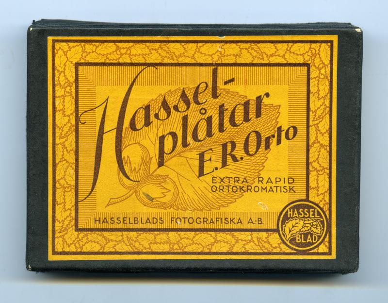
</a>

#### [Unknown] Ilford HP3 (ref: ae35)

```
Format: Unknown      |  Process : BW      
ISO   : 200          |  Expiry  : Unknown 
Type  : Single Pack  |  Quantity: Unknown 
Added : 2025-10-27   |  Author  : @ellafridalindblom
UUID  : dbfd040081714492bd8bcc80d496ae35
```

<a href="./archive/00455_000.jpg" target="_blank">
	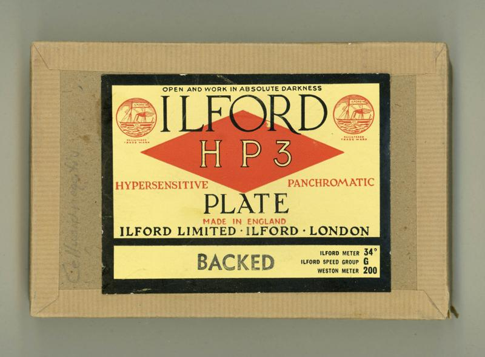
</a>

#### [Unknown] Illingworth's Fleet H&D (ref: 54fe)

```
Format: 6.5x9cm      |  Process : BW      
ISO   : Unknown      |  Expiry  : Unknown 
Type  : Single Pack  |  Quantity: 12 Sheets
Added : 2025-08-19   |  Author  : @ellafridalindblom
UUID  : bec584ee60f3462381719b3e908f54fe
```

<a href="./archive/00207_000.jpg" target="_blank">
	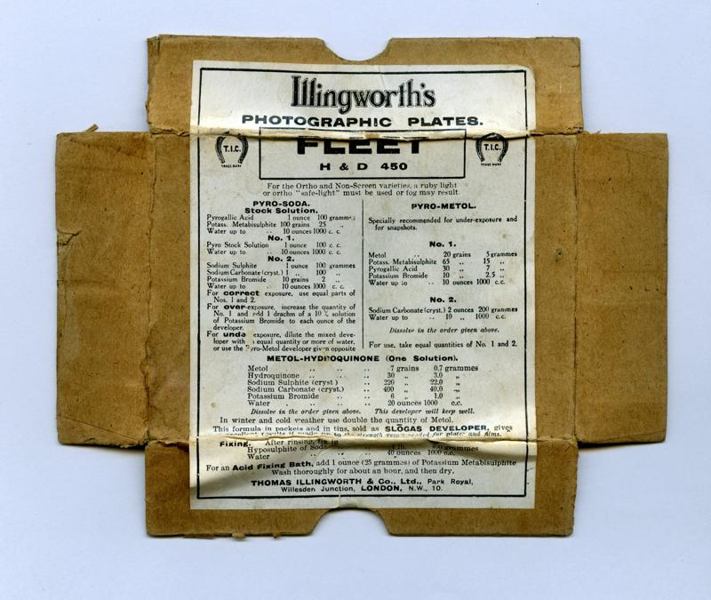
</a>

#### [Unknown] Impossible Project PX 600 Silver Shade UV+ (ref: 20f3)

```
Format: Integral Film|  Process : Instant 
ISO   : 600          |  Expiry  : Unknown 
Type  : Single Pack  |  Quantity: 8exp    
Added : 2025-09-28   |  Author  : @ellafridalindblom
UUID  : 28ed6948476d4d7baeb8e7fd7c3520f3
```

<a href="./archive/00354_000.jpg" target="_blank">
	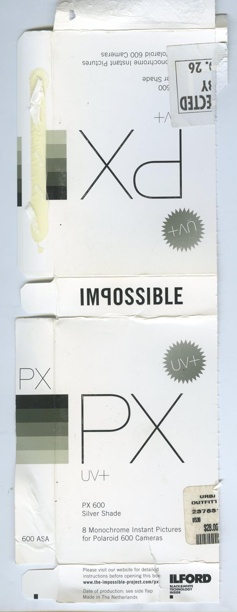
</a>

#### [Unknown] Kodak Eastman High Contrast Panchromatic 7369 (ref: faec)

```
Format: 16mm         |  Process : D-97    
ISO   : Unknown      |  Expiry  : Unknown 
Type  : Single Pack  |  Quantity: 100ft   
Added : 2025-07-29   |  Author  : Nano_Burger
UUID  : 46cc0a179fc34cb4832e1d3336bafaec
```

<a href="./archive/00099_000.jpg" target="_blank">
	
</a>

#### [Unknown] Kodak Eastman Tri-X Reversal Film 7278 (ref: 8468)

```
Format: 16mm         |  Process : BW      
ISO   : 200          |  Expiry  : Unknown 
Type  : Bulk Roll    |  Quantity: 100ft   
Added : 2025-08-14   |  Author  : Camera.Riley
UUID  : e214a4d756ac48c4ac6dbe515fd38468
```

<a href="./archive/00176_000.jpg" target="_blank">
	
</a>

#### [Unknown] Kodak Super-XX (ref: e684)

```
Format: 12x16.5cm    |  Process : BW      
ISO   : 80           |  Expiry  : Unknown 
Type  : Single Pack  |  Quantity: 24 Sheets
Added : 2025-10-27   |  Author  : @ellafridalindblom
UUID  : 098d684d4be64821a80474b771d8e684
```

<a href="./archive/00458_000.jpg" target="_blank">
	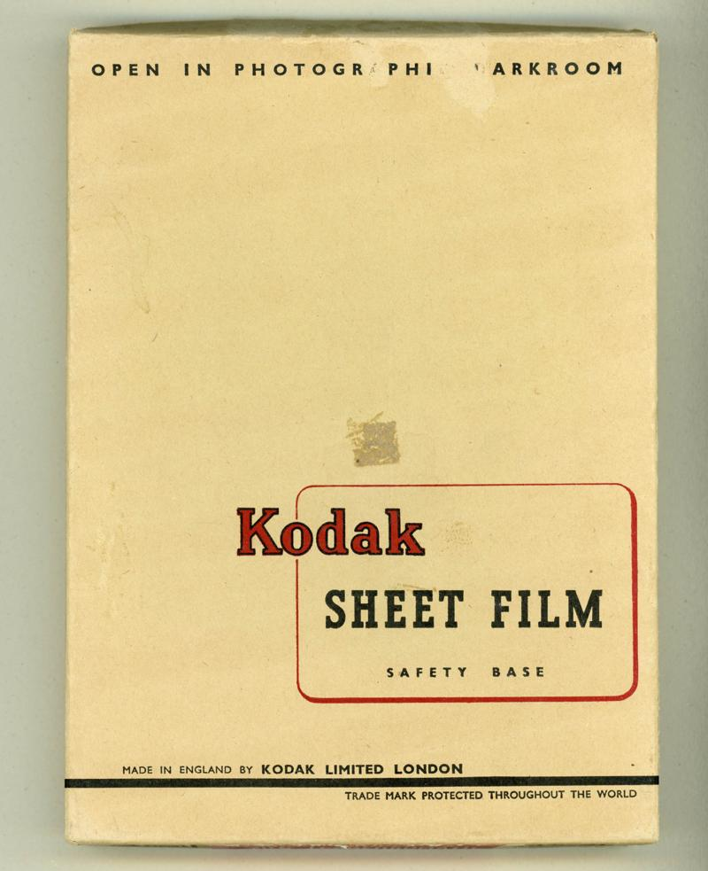
</a>


`UUID: 9ab3d1a84be64e17bf9e78b59ddee3f3`↓

<a href="./archive/00458_001.jpg" target="_blank">
	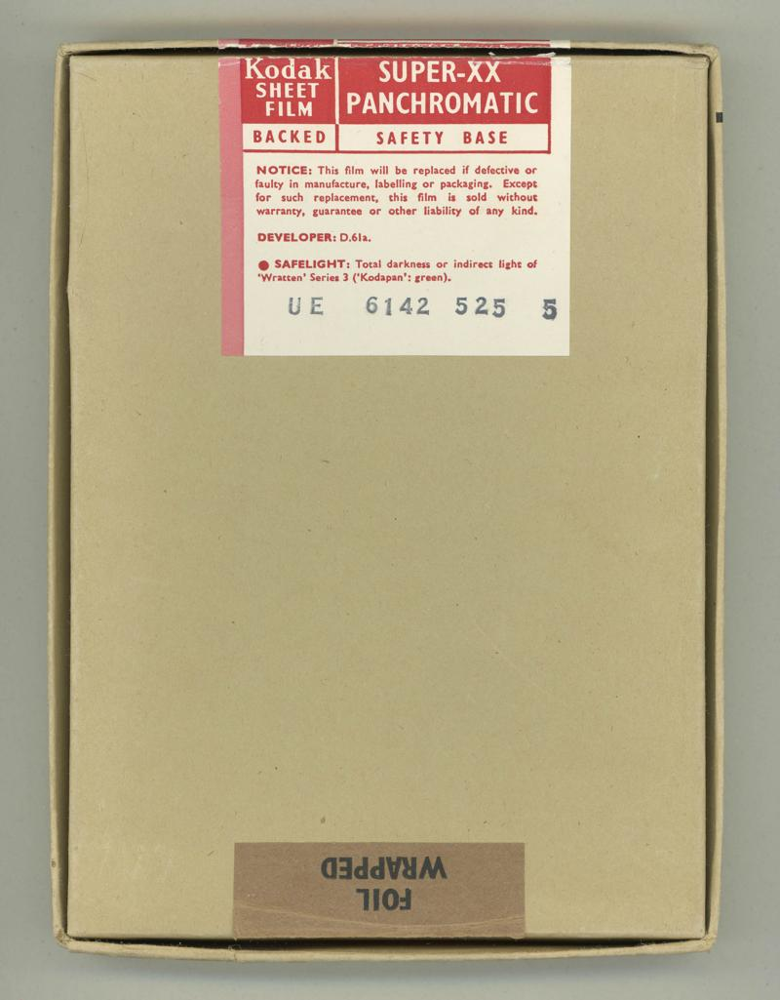
</a>


`UUID: bd0852f5b5964fda80affbb0d7b002fc`↓

<a href="./archive/00458_002.jpg" target="_blank">
	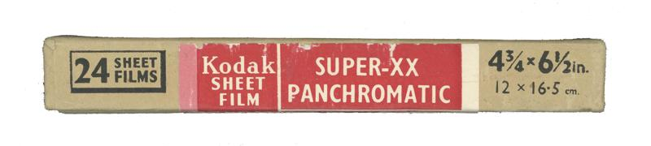
</a>

#### [Unknown] Kodak Super-sensitive Panchromatic Films (ref: 21a0)

```
Format: 12x16.5cm    |  Process : BW      
ISO   : Unknown      |  Expiry  : Unknown 
Type  : Single Pack  |  Quantity: 12 Sheets
Added : 2025-10-27   |  Author  : @ellafridalindblom
UUID  : 56136448523d428b88330cf0427221a0
Notes : Nitrate base
```

<a href="./archive/00459_000.jpg" target="_blank">
	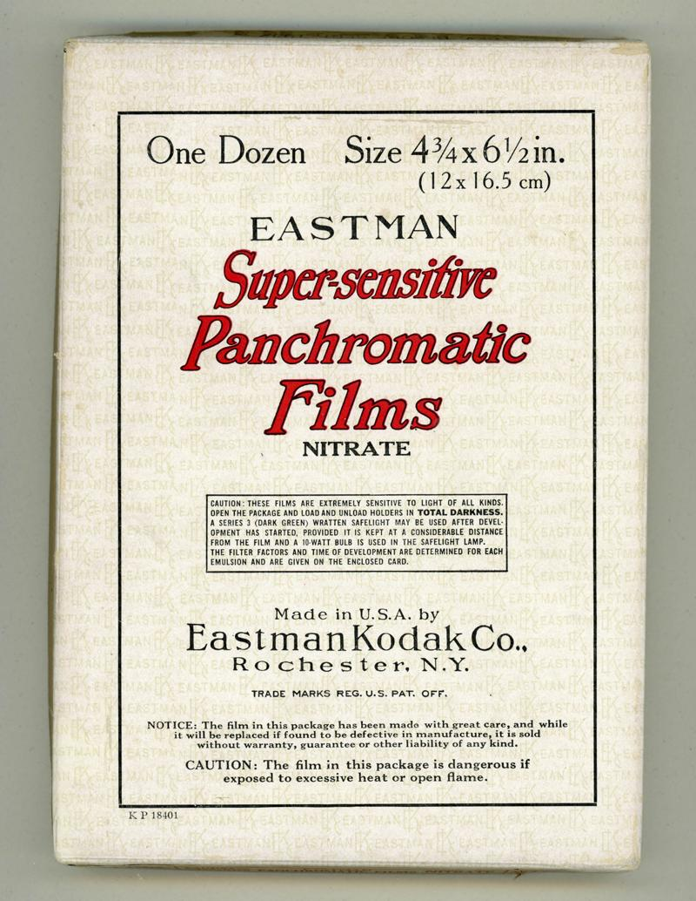
</a>


`UUID: c685c5c86b864b4aa64cfa127b67b049`↓

<a href="./archive/00459_001.jpg" target="_blank">
	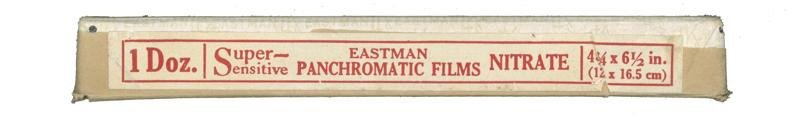
</a>

#### [Unknown] Kodak Tri-X 400 Pro (ref: f05c)

```
Format: 120          |  Process : BW      
ISO   : 400          |  Expiry  : Unknown 
Type  : Multi-Pack-5 |  Quantity: N/A     
Added : 2025-10-03   |  Author  : @ellafridalindblom
UUID  : dd34c2bc1fe34b17b67c6ad002bef05c
```

<a href="./archive/00365_000.jpg" target="_blank">
	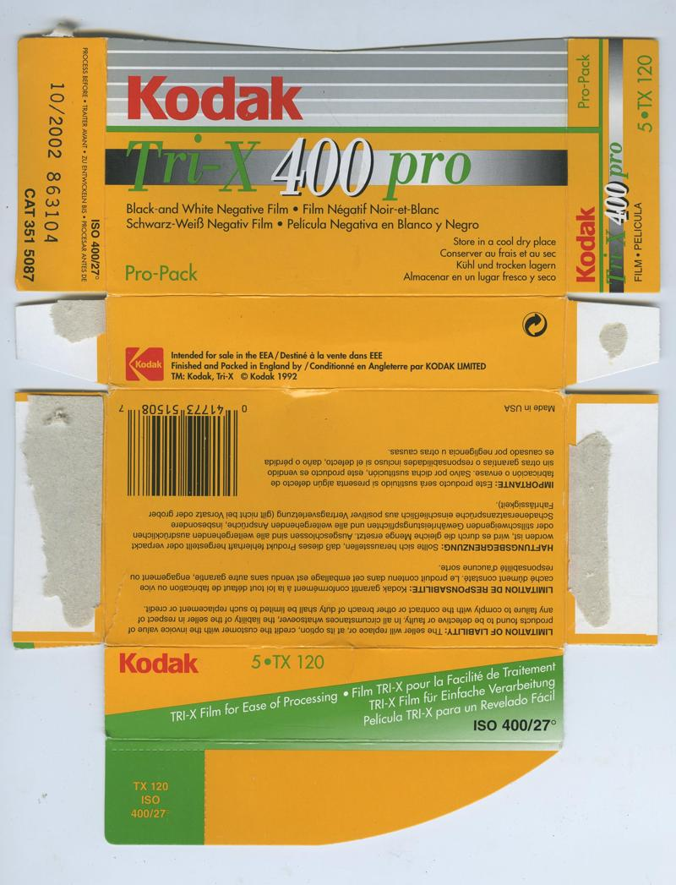
</a>


`UUID: 7cde8a5a159c441f9bad7f7f5d8cba98`↓

<a href="./archive/00365_001.jpg" target="_blank">
	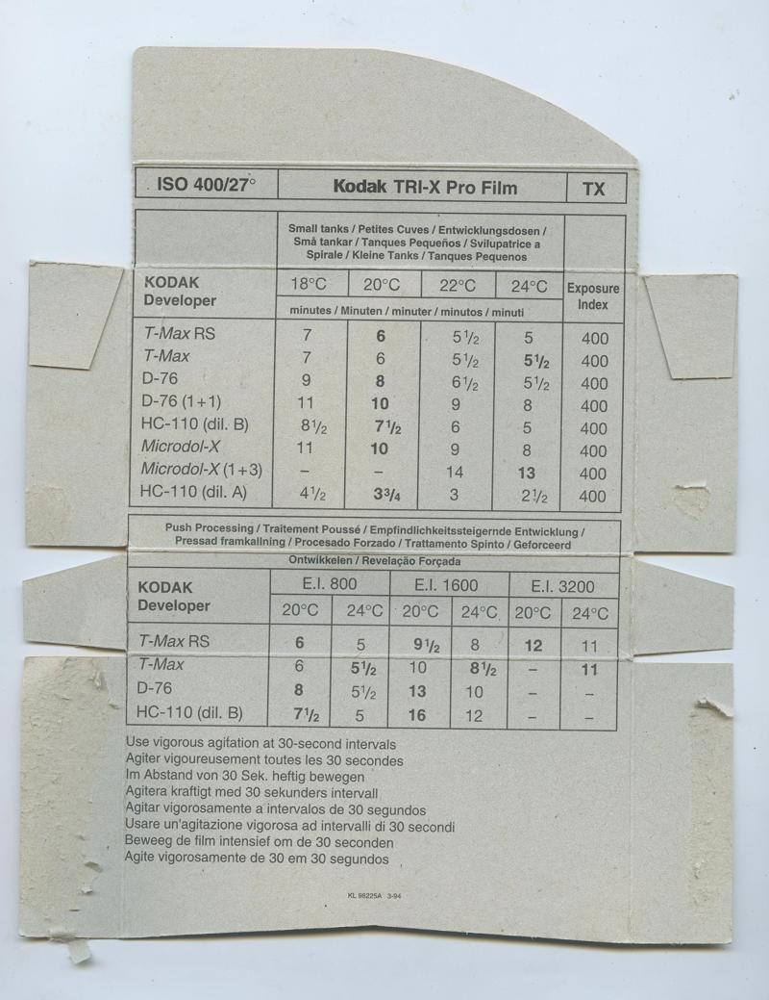
</a>

#### [Unknown] Minox MinoColor 100 Pro (ref: 5338)

```
Format: 8x11mm       |  Process : C-41    
ISO   : 100          |  Expiry  : Unknown 
Type  : Single Pack  |  Quantity: 30exp   
Added : 2025-10-14   |  Author  : dekuNukem
UUID  : 2b69cd822cf44b0a833b845e7b515338
```

<a href="./archive/00397_000.jpg" target="_blank">
	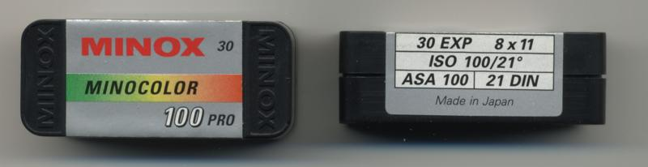
</a>


`UUID: e73e0dd7193c4cfa9b8d4eed881bb328`↓

<a href="./archive/00397_001.jpg" target="_blank">
	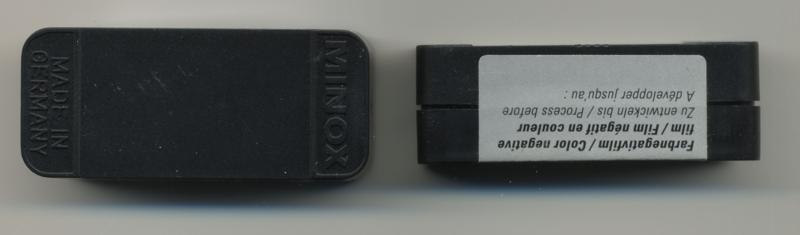
</a>

#### [Unknown] Mutascan Kodak Vision3 500T/5219 (ref: 5150)

```
Format: 35mm         |  Process : ECN-2   
ISO   : 500          |  Expiry  : Unknown 
Type  : Bulk Roll    |  Quantity: 100ft   
Added : 2025-08-15   |  Author  : Pelicram
UUID  : e4d2af3a69704509a07e108fcb4b5150
```

<a href="./archive/00185_000.jpg" target="_blank">
	
</a>

#### [Unknown] Northwest Custom Film Processing Ultra Minituature Film (ref: 70b1)

```
Format: Unknown      |  Process : Unknown 
ISO   : 64           |  Expiry  : Unknown 
Type  : Single Pack  |  Quantity: 20exp   
Added : 2025-10-21   |  Author  : dekuNukem
UUID  : e01d49f304864a7d95976d57624370b1
Notes : There was a roll of 127 ekfe R100 inside, not sure if it's the original, or someone put it there afterwards.
```

<a href="./archive/00425_000.jpg" target="_blank">
	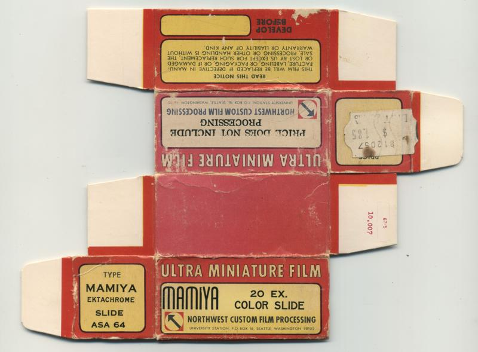
</a>


`UUID: 273b6c40428c40acb9fee444125a0426`↓

<a href="./archive/00425_001.jpg" target="_blank">
	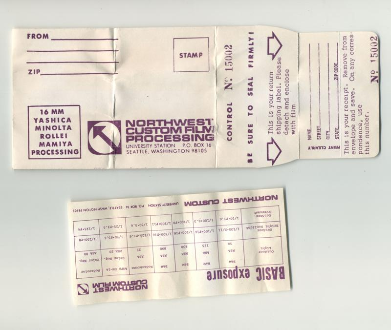
</a>


`UUID: adc9a88efca146d687fba7dcb75501f0`↓

<a href="./archive/00425_002.jpg" target="_blank">
	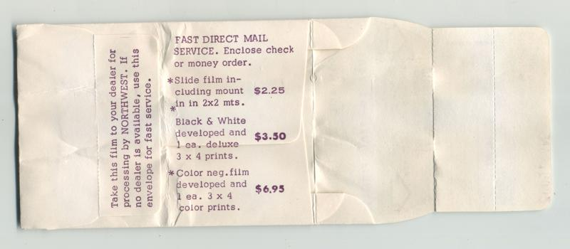
</a>

#### [Unknown] ORWO Chrom UT18 (ref: 81b7)

```
Format: 35mm         |  Process : Unknown 
ISO   : 50           |  Expiry  : Unknown 
Type  : Single Pack  |  Quantity: 36exp   
Added : 2025-10-17   |  Author  : @recycling.film
UUID  : d82a8047531f4e4bbdfe4c0bb95c81b7
```

<a href="./archive/00408_000.jpg" target="_blank">
	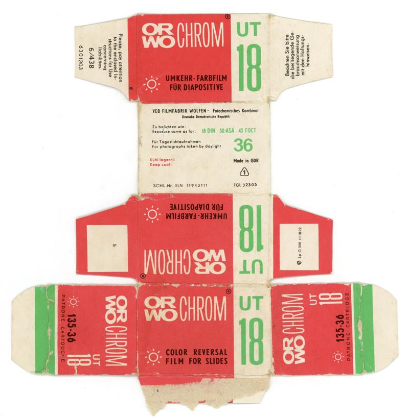
</a>


`UUID: 1515034bddc345419da08ea6a497ee34`↓

<a href="./archive/00408_001.jpg" target="_blank">
	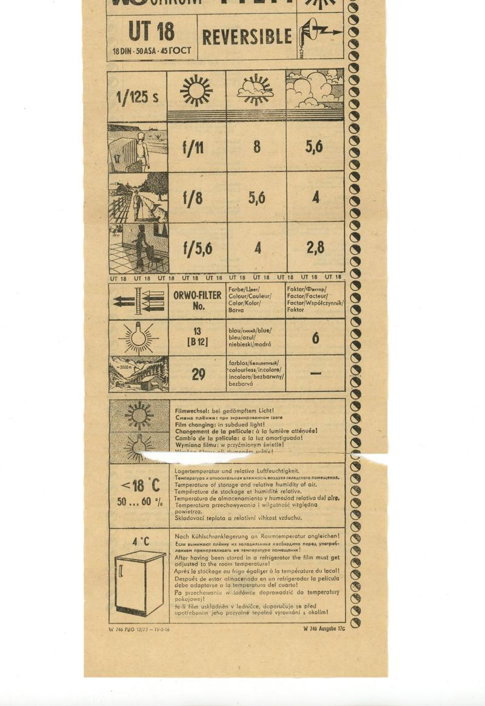
</a>


`UUID: 062fdd558f6c48fda2979f72c7443cad`↓

<a href="./archive/00408_002.jpg" target="_blank">
	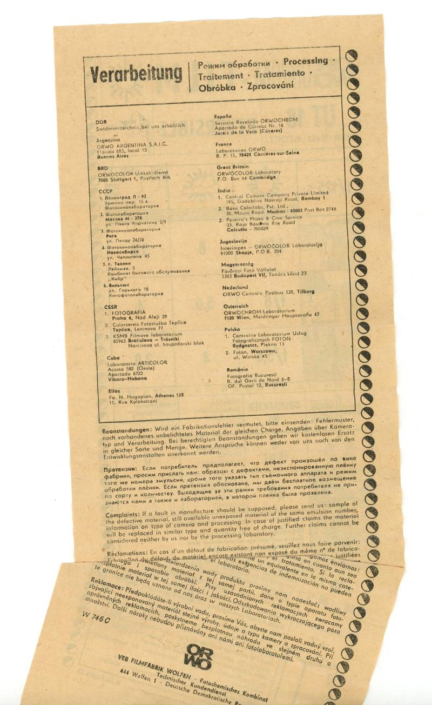
</a>


`UUID: acc4b02a5b2d422ebda7149636e817b3`↓

<a href="./archive/00408_003.jpg" target="_blank">
	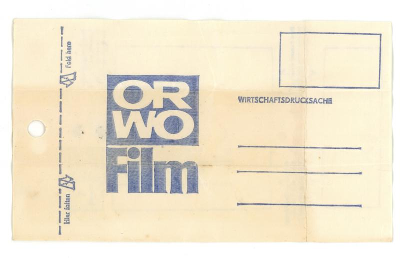
</a>


`UUID: 437046f79d2141bfb2af8247bc1a6ba3`↓

<a href="./archive/00408_004.jpg" target="_blank">
	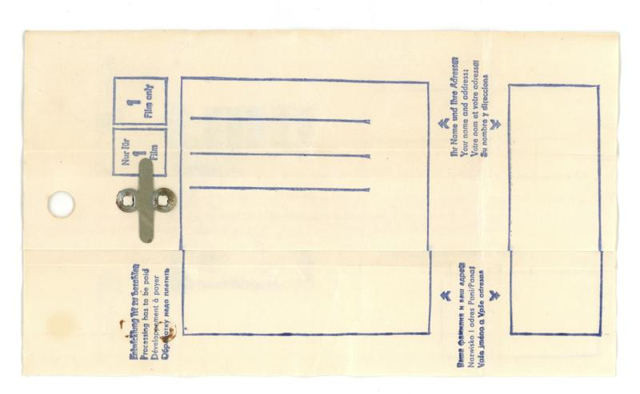
</a>

#### [Unknown] Optik Oldschool OptiColour 200 (ref: 80d7)

```
Format: 120          |  Process : C-41    
ISO   : 200          |  Expiry  : Unknown 
Type  : Single Pack  |  Quantity: N/A     
Added : 2025-10-23   |  Author  : @Hol.m35
UUID  : f0bf478daf444011b6ee52954d9f80d7
Notes : preproduction package
```

<a href="./archive/00450_000.jpg" target="_blank">
	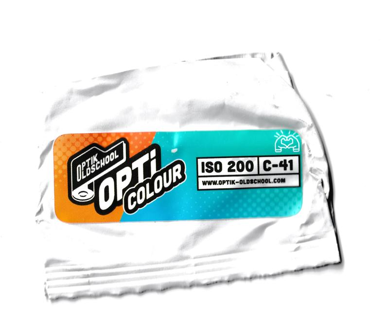
</a>

#### [Unknown] Perutz Superomnia (ref: c90d)

```
Format: 9x12cm       |  Process : BW      
ISO   : 125          |  Expiry  : Unknown 
Type  : Single Pack  |  Quantity: 12 Sheets
Added : 2025-07-28   |  Author  : lilyu.xyz
UUID  : b220e7d5dbee49898fbd1d42ee67c90d
```

<a href="./archive/00096_000.jpg" target="_blank">
	
</a>

#### [Unknown] Phöbus-Platten Sheet Film (ref: d505)

```
Format: 12x16.5cm    |  Process : BW      
ISO   : Unknown      |  Expiry  : Unknown 
Type  : Single Pack  |  Quantity: 12 Sheets
Added : 2025-09-03   |  Author  : @ellafridalindblom
UUID  : d9b0fa92fbbb494085ce494cc407d505
```

<a href="./archive/00282_000.jpg" target="_blank">
	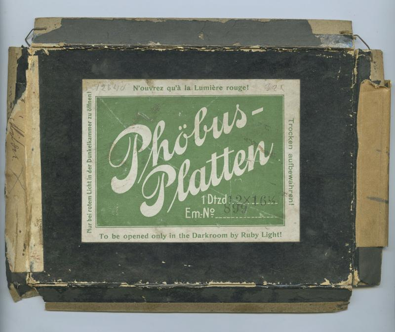
</a>

#### [Unknown] Robot NR-Cassette (ref: bc7a)

```
Format: 35mm         |  Process : Unknown 
ISO   : Unknown      |  Expiry  : Unknown 
Type  : Single Pack  |  Quantity: N/A     
Added : 2025-10-12   |  Author  : dekuNukem
UUID  : 55a2616da3a9456a90f763ed8ac5bc7a
```

<a href="./archive/00384_000.jpg" target="_blank">
	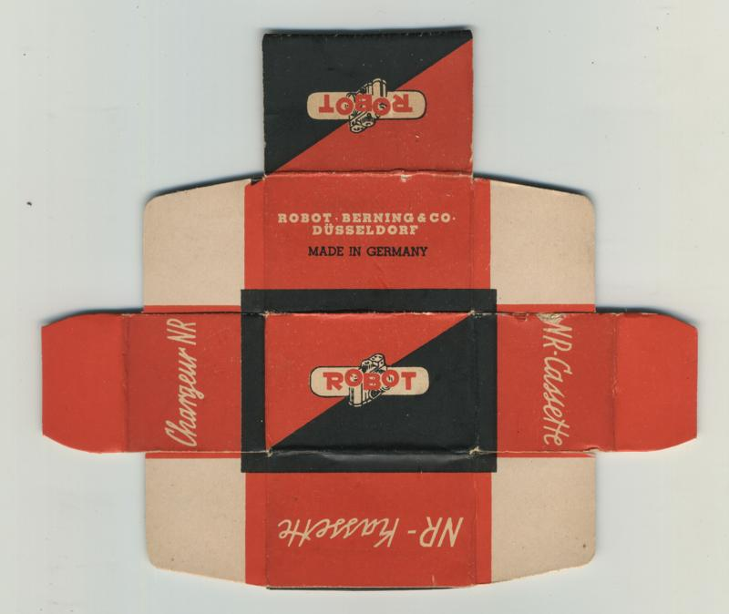
</a>

#### [Unknown] Sharan Black-and-white Negative Film (ref: a884)

```
Format: 8x11mm       |  Process : BW      
ISO   : 100          |  Expiry  : Unknown 
Type  : Single Pack  |  Quantity: 30exp   
Added : 2025-10-14   |  Author  : dekuNukem
UUID  : f51e641835b543e592ea57ddb0c2a884
Notes : ACMEL embossed on box
```

<a href="./archive/00398_000.jpg" target="_blank">
	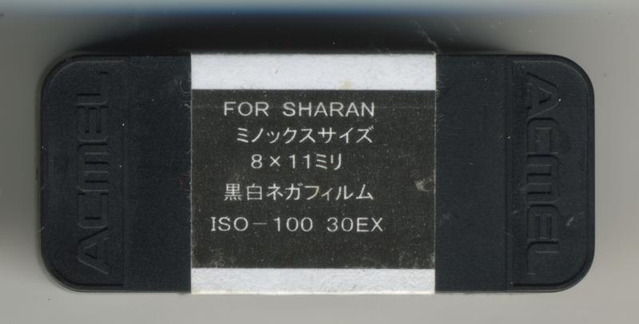
</a>


`UUID: 863a7bdf1a704c8581b85715cfeaf4b6`↓

<a href="./archive/00398_001.jpg" target="_blank">
	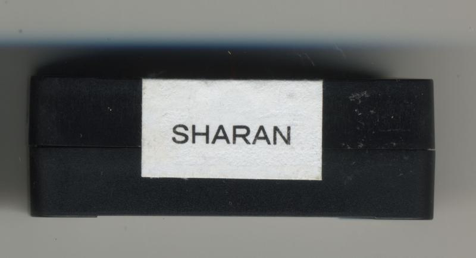
</a>


`UUID: 181802a92d784d7bb55da9b320456623`↓

<a href="./archive/00398_002.jpg" target="_blank">
	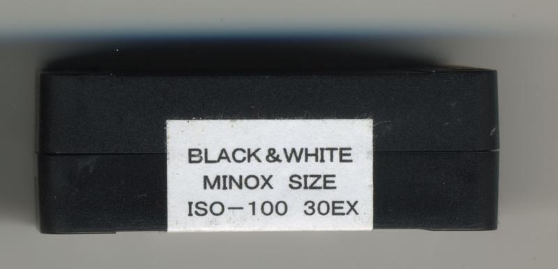
</a>


`UUID: aff927d754b94e4a8e02b5db988feb9c`↓

<a href="./archive/00398_003.jpg" target="_blank">
	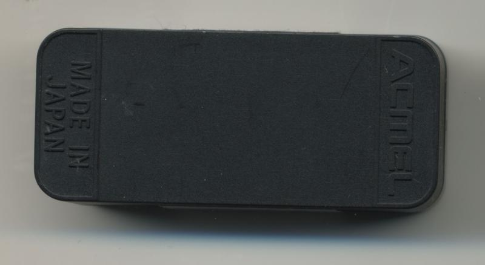
</a>

#### [Unknown] Sharan Color Negative Film (ref: 4913)

```
Format: 8x11mm       |  Process : C-41    
ISO   : 400          |  Expiry  : Unknown 
Type  : Single Pack  |  Quantity: 30exp   
Added : 2025-10-14   |  Author  : dekuNukem
UUID  : 52bf2ed6baac480dbc32d05e569f4913
```

<a href="./archive/00399_000.jpg" target="_blank">
	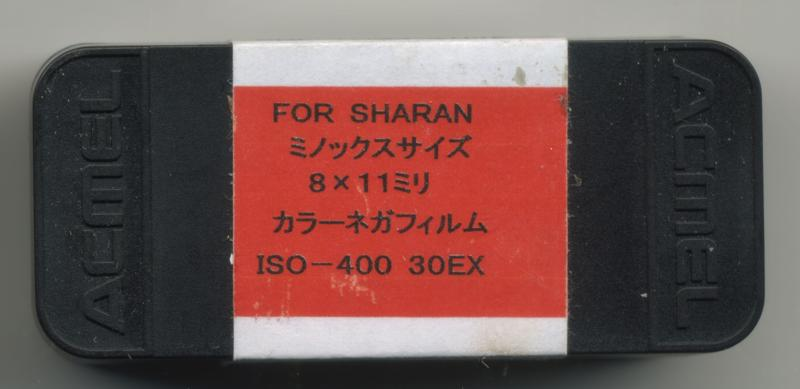
</a>


`UUID: 9bbddf2ace8b430c87ae445ede2a99f1`↓

<a href="./archive/00399_001.jpg" target="_blank">
	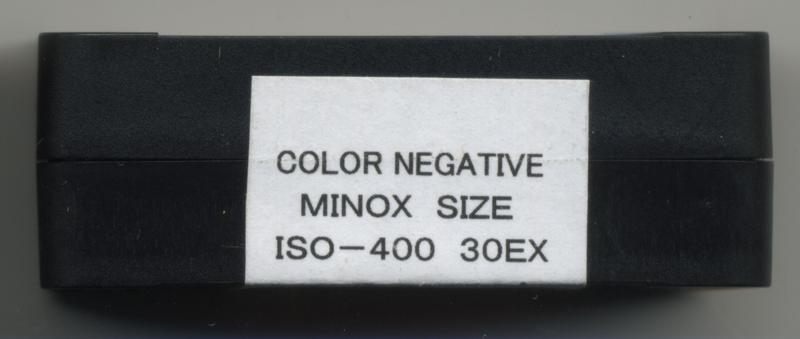
</a>


`UUID: b4abaf59baa1429c8085e9f20e115e73`↓

<a href="./archive/00399_002.jpg" target="_blank">
	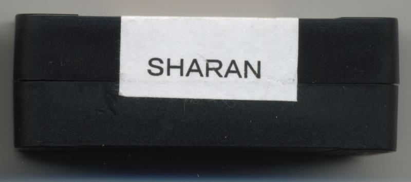
</a>


`UUID: e481850cf5ef471ca1c4d116ca79a5b8`↓

<a href="./archive/00399_003.jpg" target="_blank">
	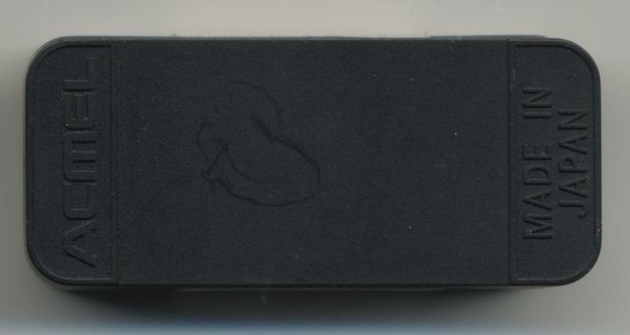
</a>

#### [Unknown] Space Cat Film Mars 250D (ref: 5027)

```
Format: 35mm         |  Process : C-41    
ISO   : 250          |  Expiry  : Unknown 
Type  : Single Pack  |  Quantity: 36exp   
Added : 2025-08-20   |  Author  : @photos.by.qi
UUID  : 1595b93966854178a03bc6d0de705027
```

<a href="./archive/00227_000.jpg" target="_blank">
	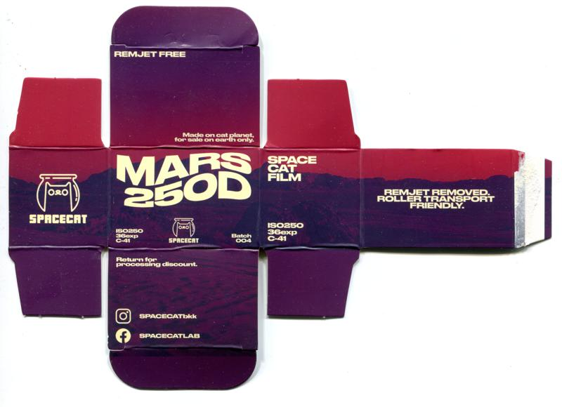
</a>

#### [Unknown] Svema Foto 64 (ref: 10cb)

```
Format: 35mm         |  Process : BW      
ISO   : 64           |  Expiry  : Unknown 
Type  : Single Pack  |  Quantity: 36exp   
Added : 2025-10-17   |  Author  : @recycling.film
UUID  : e783964d8b4f48e8bd12d7d2c3c510cb
```

<a href="./archive/00403_000.jpg" target="_blank">
	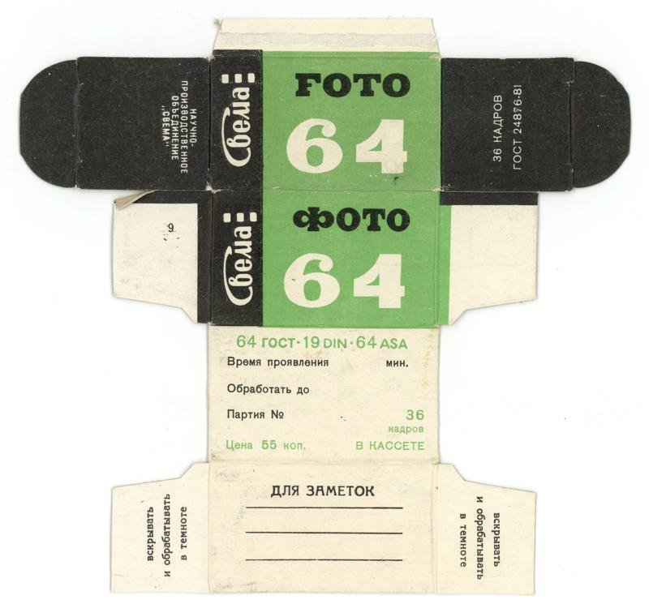
</a>

#### [Unknown] Walkens Speed 400 (ref: 740f)

```
Format: 35mm         |  Process : C-41    
ISO   : 400          |  Expiry  : Unknown 
Type  : Single Pack  |  Quantity: 36exp   
Added : 2025-08-20   |  Author  : @photos.by.qi
UUID  : 198465748a5e41f8ad634fffa08a740f
```

<a href="./archive/00228_000.jpg" target="_blank">
	
</a>

#### [Unkonwn] Agfa Trockenplatten (ref: 41a8)

```
Format: 9x12cm       |  Process : BW      
ISO   : Unknown      |  Expiry  : Unkonwn 
Type  : Single Pack  |  Quantity: 12 Sheets
Added : 2025-09-03   |  Author  : @ellafridalindblom
UUID  : 80d64fa269454c5589109c68a40541a8
```

<a href="./archive/00286_000.jpg" target="_blank">
	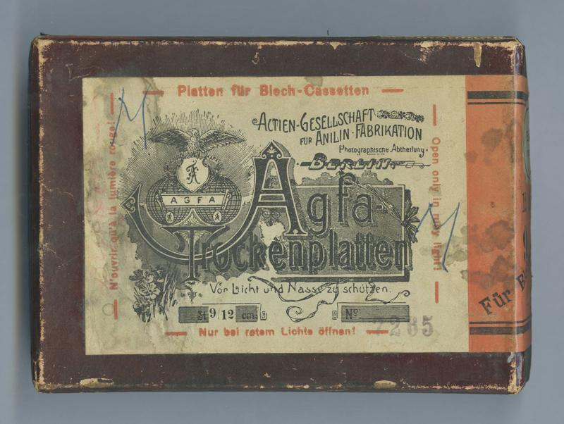
</a>


`UUID: 90348c8ca8bf424eb54a73d1f129afb1`↓

<a href="./archive/00286_001.jpg" target="_blank">
	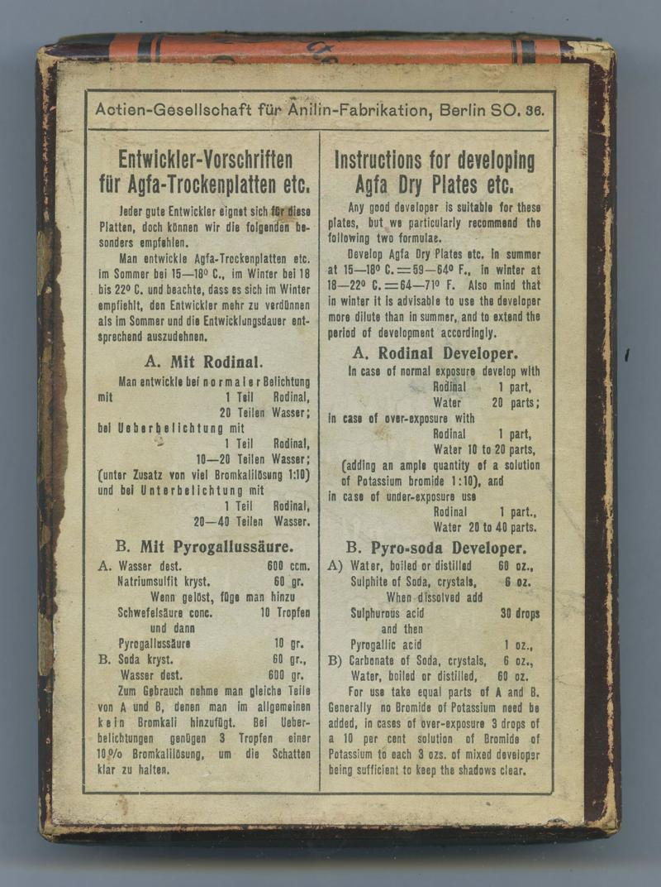
</a>

## Want to Contribute?

[Check out the guidelines!](../contribution_guide.md)

## Contributor List

```
Rank  Username                      Contributions
--------------------------------------------------
1     dekuNukem                     338   
2     @photos.by.qi                 72    
3     Pelicram                      67    
4     @ellafridalindblom            57    
5     @recycling.film               56    
6     The Compartmentalist          25    
7     fine-seat                     19    
8     Camera.Riley                  19    
9     Nano_Burger                   18    
10    @ob.skura                     16    
11    b0baspace                     14    
12    @SirBrentsworth               13    
13    toader                        13    
14    yc128                         11    
15    @zruk_ts                      10    
16    benikum                       9     
17    lilyu.xyz                     9     
18    @Hol.m35                      9     
19    kaimon                        8     
20    @toastergod101                7     
21    @filmfotofella                7     
22    lt_col_tall                   6     
23    GreatGizmo74                  6     
24    nick                          6     
25    Kraksen                       5     
26    Henry Gunn                    4     
27    u/ReeeSchmidtyWerber          4     
28    TheSelousScout                3     
29    @sachynmital                  3     
30    @seklerek                     2     
31    @ftfilmphotos                 2     
32    Yrikonchik                    1     
33    @ad.astra.per.aspera.1894     1     
34    Aoi Yuki                      1     
35    lemoniter                     1     
36    minidiscus                    1     
```

## Questions or Comments?

Get in touch by joining [the Discord chatroom](https://discord.gg/yvBx7dVG4B), or `email skate.huddle-6r@icloud.com` !

## Back to Home Page

[Click me](../README.md)

