# Film Packaging Archive (Sorted by FILM FORMAT)

[Home Page](../README.md) | [GitHub Repo](https://github.com/dekuNukem/Film-Packaging)

-----

Find this useful? Please [credit the project page](../README.md)!

Want to contribute? [Check out the guidelines!](../contribution_guide.md)

üëáüëáüëáüëáüëáüëáüëáüëáüëáüëáüëáüëáüëáüëáüëáüëáüëáüëáüëáüëáüëáüëá

üîéüîé **CLICK IMAGE FOR FULL SIZE** üîçüîç

☝️☝️☝️☝️☝️☝️☝️☝️☝️☝️☝️☝️☝️☝️☝️☝️☝️☝️☝️☝️☝️☝️

```
Last Updated: Aug 20 2025
Unique items: 241
Total scans : 402
```

-----

- [[110] Klick XD200 (ref: 44d7)](#110-klick-xd200-ref-44d7)
- [[110] Kodak Ektachrome 64 (ref: 07c0)](#110-kodak-ektachrome-64-ref-07c0)
- [[110] Kodak Kodachrome 64 (ref: 3145)](#110-kodak-kodachrome-64-ref-3145)
- [[110] Kodak Kodacolor Gold 200 (ref: f368)](#110-kodak-kodacolor-gold-200-ref-f368)
- [[110] Lomography Orca (ref: d506)](#110-lomography-orca-ref-d506)
- [[110] Lomography Tiger (ref: 26dd)](#110-lomography-tiger-ref-26dd)
- [[120] Agfa APX (ref: 12c7)](#120-agfa-apx-ref-12c7)
- [[120] Alien Film 5207/250D (ref: 8820)](#120-alien-film-5207250d-ref-8820)
- [[120] Bergger Pancro400 (ref: ad7b)](#120-bergger-pancro400-ref-ad7b)
- [[120] CatLABS X Film 320 Pro (ref: 1c69)](#120-catlabs-x-film-320-pro-ref-1c69)
- [[120] CineStill 800T (ref: c86a)](#120-cinestill-800t-ref-c86a)
- [[120] Efke IR 820 (ref: 43c9)](#120-efke-ir-820-ref-43c9)
- [[120] Foma Fomapan (ref: 3e4f)](#120-foma-fomapan-ref-3e4f)
- [[120] Foma Fomapan (ref: 65ad)](#120-foma-fomapan-ref-65ad)
- [[120] Foma Fomapan21 (ref: 75d9)](#120-foma-fomapan21-ref-75d9)
- [[120] Foma Ortho (ref: 89e7)](#120-foma-ortho-ref-89e7)
- [[120] Foton Fotopan F (ref: 0ad6)](#120-foton-fotopan-f-ref-0ad6)
- [[120] Fujifilm Fujichrome Professional 100D (ref: 439d)](#120-fujifilm-fujichrome-professional-100d-ref-439d)
- [[120] Fujifilm Fujicolor NPL 160 (ref: d10b)](#120-fujifilm-fujicolor-npl-160-ref-d10b)
- [[120] Fujifilm Fujicolor Pro400 (ref: 1b8d)](#120-fujifilm-fujicolor-pro400-ref-1b8d)
- [[120] Fujifilm Fujicolor Super G (ref: 55ff)](#120-fujifilm-fujicolor-super-g-ref-55ff)
- [[120] Fujifilm Fujicolor Superia (ref: 0683)](#120-fujifilm-fujicolor-superia-ref-0683)
- [[120] Fujifilm Pro 400H (ref: 66e3)](#120-fujifilm-pro-400h-ref-66e3)
- [[120] Fujifilm Superia X-TRA (ref: 7980)](#120-fujifilm-superia-x-tra-ref-7980)
- [[120] Fujifilm Velvia 100F (ref: f7fb)](#120-fujifilm-velvia-100f-ref-f7fb)
- [[120] Harman Phoenix (ref: 637f)](#120-harman-phoenix-ref-637f)
- [[120] Harman Phoenix II (ref: f686)](#120-harman-phoenix-ii-ref-f686)
- [[120] Ilford Delta 100 (ref: eb8d)](#120-ilford-delta-100-ref-eb8d)
- [[120] Ilford Delta 3200 (ref: 920f)](#120-ilford-delta-3200-ref-920f)
- [[120] Ilford FP4 Plus (ref: 76e7)](#120-ilford-fp4-plus-ref-76e7)
- [[120] Ilford HP5 Plus (ref: 11a8)](#120-ilford-hp5-plus-ref-11a8)
- [[120] Ilford HP5 Plus (ref: efad)](#120-ilford-hp5-plus-ref-efad)
- [[120] Ilford HP5 Plus (ref: 1a5d)](#120-ilford-hp5-plus-ref-1a5d)
- [[120] Ilford SFX 200 (ref: 6057)](#120-ilford-sfx-200-ref-6057)
- [[120] Kodak Ektachrome E100VS (ref: a8d3)](#120-kodak-ektachrome-e100vs-ref-a8d3)
- [[120] Kodak Gold 200 (ref: 933f)](#120-kodak-gold-200-ref-933f)
- [[120] Kodak High Speed Ektachrome (ref: ce7f)](#120-kodak-high-speed-ektachrome-ref-ce7f)
- [[120] Kodak Kodacolor-X (ref: a4b1)](#120-kodak-kodacolor-x-ref-a4b1)
- [[120] Kodak Portra 400VC (ref: b67b)](#120-kodak-portra-400vc-ref-b67b)
- [[120] Kodak Portra 800 (ref: 21f9)](#120-kodak-portra-800-ref-21f9)
- [[120] Kodak TMAX 100 (ref: b3b1)](#120-kodak-tmax-100-ref-b3b1)
- [[120] Kodak Technical Pan 6415 (ref: 03be)](#120-kodak-technical-pan-6415-ref-03be)
- [[120] Kodak Tri-X 400 (ref: 88c5)](#120-kodak-tri-x-400-ref-88c5)
- [[120] Kodak Vericolor 400 Plus (ref: bd88)](#120-kodak-vericolor-400-plus-ref-bd88)
- [[120] Kodak Vericolor III (ref: 4b3e)](#120-kodak-vericolor-iii-ref-4b3e)
- [[120] Konica Infrared 750nm (ref: e696)](#120-konica-infrared-750nm-ref-e696)
- [[120] Konica Infrared 750nm (ref: 2d93)](#120-konica-infrared-750nm-ref-2d93)
- [[120] Lomography Lomochrome Turquoise (ref: 0d90)](#120-lomography-lomochrome-turquoise-ref-0d90)
- [[120] Reflx Lab 250D (ref: 1a3e)](#120-reflx-lab-250d-ref-1a3e)
- [[120] Rollei Infrared (ref: 4f54)](#120-rollei-infrared-ref-4f54)
- [[120] Rollei Retro 80S (ref: e6c0)](#120-rollei-retro-80s-ref-e6c0)
- [[126] GAF Color Slide Film (ref: dea6)](#126-gaf-color-slide-film-ref-dea6)
- [[126] Kodak Kodacolor-X (ref: 5302)](#126-kodak-kodacolor-x-ref-5302)
- [[127] Shanghai GP3 (ref: 52aa)](#127-shanghai-gp3-ref-52aa)
- [[12x16.5cm] Defender Portrait HGS (ref: d69c)](#12x165cm-defender-portrait-hgs-ref-d69c)
- [[16mm] Kodak Eastman High Contrast Panchromatic 7369 (ref: faec)](#16mm-kodak-eastman-high-contrast-panchromatic-7369-ref-faec)
- [[16mm] Kodak Eastman Tri-X Reversal Film 7278 (ref: 8468)](#16mm-kodak-eastman-tri-x-reversal-film-7278-ref-8468)
- [[16mm] Minolta Minolta 16 Color Film For Prints (ref: a2ff)](#16mm-minolta-minolta-16-color-film-for-prints-ref-a2ff)
- [[220] Kodak Ektacolor Pro Gold (ref: c3f8)](#220-kodak-ektacolor-pro-gold-ref-c3f8)
- [[220] Reflx Lab Pro 100 (ref: 1311)](#220-reflx-lab-pro-100-ref-1311)
- [[35mm] ADOX KB17 (ref: 2c95)](#35mm-adox-kb17-ref-2c95)
- [[35mm] Adox HR 50 (ref: 4da7)](#35mm-adox-hr-50-ref-4da7)
- [[35mm] Agfa APX (ref: 5276)](#35mm-agfa-apx-ref-5276)
- [[35mm] Agfa APX 25 (ref: 805f)](#35mm-agfa-apx-25-ref-805f)
- [[35mm] Agfa Agfacolor XRG (ref: 689e)](#35mm-agfa-agfacolor-xrg-ref-689e)
- [[35mm] Agfa Agfapan APX 100 (ref: e271)](#35mm-agfa-agfapan-apx-100-ref-e271)
- [[35mm] Agfa Agfapan APX 400 (ref: 19bc)](#35mm-agfa-agfapan-apx-400-ref-19bc)
- [[35mm] Agfa Agfapan Rapid (ref: 5e7b)](#35mm-agfa-agfapan-rapid-ref-5e7b)
- [[35mm] Agfa Fine-Grain Plenachrome (ref: e5d4)](#35mm-agfa-fine-grain-plenachrome-ref-e5d4)
- [[35mm] Agfa Isopan FF (ref: 3700)](#35mm-agfa-isopan-ff-ref-3700)
- [[35mm] Agfa Isopan ISS (ref: 75fa)](#35mm-agfa-isopan-iss-ref-75fa)
- [[35mm] Agfa ULTRA 50 (ref: 4faa)](#35mm-agfa-ultra-50-ref-4faa)
- [[35mm] Agfa Vista (ref: d3af)](#35mm-agfa-vista-ref-d3af)
- [[35mm] Alfo ALFOcolor PR-G (ref: 94b9)](#35mm-alfo-alfocolor-pr-g-ref-94b9)
- [[35mm] Alien Film 5222/XX (ref: 3e49)](#35mm-alien-film-5222xx-ref-3e49)
- [[35mm] Bergger Pancro400 (ref: f619)](#35mm-bergger-pancro400-ref-f619)
- [[35mm] Boots Colour Print Film (ref: a30f)](#35mm-boots-colour-print-film-ref-a30f)
- [[35mm] Building 2 200T (ref: c025)](#35mm-building-2-200t-ref-c025)
- [[35mm] Building 2 250D (ref: 7d4f)](#35mm-building-2-250d-ref-7d4f)
- [[35mm] Building 2 500T (ref: 70d9)](#35mm-building-2-500t-ref-70d9)
- [[35mm] Building 2 50D (ref: e548)](#35mm-building-2-50d-ref-e548)
- [[35mm] CineStill 800T (ref: b3ff)](#35mm-cinestill-800t-ref-b3ff)
- [[35mm] Efiniti UXi Super 200 (ref: 471a)](#35mm-efiniti-uxi-super-200-ref-471a)
- [[35mm] Ferrania Solaris (ref: a929)](#35mm-ferrania-solaris-ref-a929)
- [[35mm] Film Never Die IRO (ref: 2a22)](#35mm-film-never-die-iro-ref-2a22)
- [[35mm] Film Never Die Kiro (ref: 796d)](#35mm-film-never-die-kiro-ref-796d)
- [[35mm] Foma Fomapan (ref: 0030)](#35mm-foma-fomapan-ref-0030)
- [[35mm] Foma Fomapan (ref: 84a5)](#35mm-foma-fomapan-ref-84a5)
- [[35mm] Foma Fomapan (ref: 60ee)](#35mm-foma-fomapan-ref-60ee)
- [[35mm] Foma Ortho 400 (ref: c559)](#35mm-foma-ortho-400-ref-c559)
- [[35mm] Fujifilm 200 (ref: 5b41)](#35mm-fujifilm-200-ref-5b41)
- [[35mm] Fujifilm 400 (ref: 82be)](#35mm-fujifilm-400-ref-82be)
- [[35mm] Fujifilm Fujichrome 64T Type II Professional (ref: 74a1)](#35mm-fujifilm-fujichrome-64t-type-ii-professional-ref-74a1)
- [[35mm] Fujifilm Fujichrome Velvia (ref: 3182)](#35mm-fujifilm-fujichrome-velvia-ref-3182)
- [[35mm] Fujifilm Fujicolor 100 (ref: 013b)](#35mm-fujifilm-fujicolor-100-ref-013b)
- [[35mm] Fujifilm Fujicolor 100 (ref: b3c9)](#35mm-fujifilm-fujicolor-100-ref-b3c9)
- [[35mm] Fujifilm Fujicolor C200 (ref: 2ff8)](#35mm-fujifilm-fujicolor-c200-ref-2ff8)
- [[35mm] Fujifilm Fujicolor C200 (ref: a0de)](#35mm-fujifilm-fujicolor-c200-ref-a0de)
- [[35mm] Fujifilm Fujicolor Natura 1600 (ref: 2e06)](#35mm-fujifilm-fujicolor-natura-1600-ref-2e06)
- [[35mm] Fujifilm Fujicolor Professional (ref: 28da)](#35mm-fujifilm-fujicolor-professional-ref-28da)
- [[35mm] Fujifilm Fujicolor Professional (ref: 02f7)](#35mm-fujifilm-fujicolor-professional-ref-02f7)
- [[35mm] Fujifilm Fujicolor Super HG (ref: ee94)](#35mm-fujifilm-fujicolor-super-hg-ref-ee94)
- [[35mm] Fujifilm Fujicolor Super HR (ref: aaa0)](#35mm-fujifilm-fujicolor-super-hr-ref-aaa0)
- [[35mm] Fujifilm Fujicolor Superia (ref: d1b7)](#35mm-fujifilm-fujicolor-superia-ref-d1b7)
- [[35mm] Fujifilm NPS 160 (ref: 5e85)](#35mm-fujifilm-nps-160-ref-5e85)
- [[35mm] Fujifilm Neopan SS Rapid (ref: 9db3)](#35mm-fujifilm-neopan-ss-rapid-ref-9db3)
- [[35mm] Fujifilm Provia 100F (ref: 356d)](#35mm-fujifilm-provia-100f-ref-356d)
- [[35mm] Fujifilm Provia 100F (ref: df27)](#35mm-fujifilm-provia-100f-ref-df27)
- [[35mm] Fujifilm Sensia (ref: a59b)](#35mm-fujifilm-sensia-ref-a59b)
- [[35mm] Fujifilm Superia (ref: 9272)](#35mm-fujifilm-superia-ref-9272)
- [[35mm] Fujifilm Superia (ref: 0d8e)](#35mm-fujifilm-superia-ref-0d8e)
- [[35mm] Fujifilm Superia Reala (ref: a7de)](#35mm-fujifilm-superia-reala-ref-a7de)
- [[35mm] Fujifilm Superia Reala (ref: a624)](#35mm-fujifilm-superia-reala-ref-a624)
- [[35mm] Fujifilm Superia X-TRA (ref: 713b)](#35mm-fujifilm-superia-x-tra-ref-713b)
- [[35mm] Fujifilm Superia X-TRA (ref: 0446)](#35mm-fujifilm-superia-x-tra-ref-0446)
- [[35mm] Fujifilm Superia X-TRA (ref: 8923)](#35mm-fujifilm-superia-x-tra-ref-8923)
- [[35mm] Fujifilm Superia X-TRA (ref: 6b8a)](#35mm-fujifilm-superia-x-tra-ref-6b8a)
- [[35mm] Fujifilm Velvia 100F (ref: 32d4)](#35mm-fujifilm-velvia-100f-ref-32d4)
- [[35mm] Hands On Film Midnight 1600 (ref: 4411)](#35mm-hands-on-film-midnight-1600-ref-4411)
- [[35mm] Harman Phoenix (ref: 8eb4)](#35mm-harman-phoenix-ref-8eb4)
- [[35mm] Harman Phoenix II (ref: 40df)](#35mm-harman-phoenix-ii-ref-40df)
- [[35mm] Hazenfilm Sorolla Chrome (ref: 889f)](#35mm-hazenfilm-sorolla-chrome-ref-889f)
- [[35mm] Hope Film Bubble (ref: 41f4)](#35mm-hope-film-bubble-ref-41f4)
- [[35mm] Ilford Delta 3200 (ref: 9b54)](#35mm-ilford-delta-3200-ref-9b54)
- [[35mm] Ilford HP5 Plus (ref: c725)](#35mm-ilford-hp5-plus-ref-c725)
- [[35mm] Ilford HP5 Plus (ref: df49)](#35mm-ilford-hp5-plus-ref-df49)
- [[35mm] Ilford XP2 Super (ref: 622a)](#35mm-ilford-xp2-super-ref-622a)
- [[35mm] JCH Streetpan (ref: 6e58)](#35mm-jch-streetpan-ref-6e58)
- [[35mm] Kentmere PAN 100 (ref: c907)](#35mm-kentmere-pan-100-ref-c907)
- [[35mm] Kentmere PAN 200 (ref: 0e32)](#35mm-kentmere-pan-200-ref-0e32)
- [[35mm] Kentmere PAN 400 (ref: d223)](#35mm-kentmere-pan-400-ref-d223)
- [[35mm] Kentmere PAN 400 (ref: 827e)](#35mm-kentmere-pan-400-ref-827e)
- [[35mm] Kentmere PAN 400 (ref: a327)](#35mm-kentmere-pan-400-ref-a327)
- [[35mm] Kirkland Signature Color Print Film (ref: 0441)](#35mm-kirkland-signature-color-print-film-ref-0441)
- [[35mm] Kodak Black & White + (ref: 2ff3)](#35mm-kodak-black-white-ref-2ff3)
- [[35mm] Kodak ColorPlus (ref: 79ca)](#35mm-kodak-colorplus-ref-79ca)
- [[35mm] Kodak ColorPlus (ref: 6637)](#35mm-kodak-colorplus-ref-6637)
- [[35mm] Kodak Ektachrome 100 Plus (ref: 5d9f)](#35mm-kodak-ektachrome-100-plus-ref-5d9f)
- [[35mm] Kodak Ektachrome 200 (ref: b21e)](#35mm-kodak-ektachrome-200-ref-b21e)
- [[35mm] Kodak Ektachrome 400 (ref: 3c96)](#35mm-kodak-ektachrome-400-ref-3c96)
- [[35mm] Kodak Ektachrome 64T (ref: 8f4f)](#35mm-kodak-ektachrome-64t-ref-8f4f)
- [[35mm] Kodak Ektachrome E100 (ref: 94ff)](#35mm-kodak-ektachrome-e100-ref-94ff)
- [[35mm] Kodak Ektachrome E100 (ref: ae10)](#35mm-kodak-ektachrome-e100-ref-ae10)
- [[35mm] Kodak Ektachrome Elite 100 (ref: 26ef)](#35mm-kodak-ektachrome-elite-100-ref-26ef)
- [[35mm] Kodak Ektachrome Slide Duplicating Film (ref: d53a)](#35mm-kodak-ektachrome-slide-duplicating-film-ref-d53a)
- [[35mm] Kodak Ektachrome-X (ref: aec5)](#35mm-kodak-ektachrome-x-ref-aec5)
- [[35mm] Kodak Ektar 100 (ref: 95ec)](#35mm-kodak-ektar-100-ref-95ec)
- [[35mm] Kodak Ektar 100 (ref: 3498)](#35mm-kodak-ektar-100-ref-3498)
- [[35mm] Kodak Elite Chrome (ref: 523c)](#35mm-kodak-elite-chrome-ref-523c)
- [[35mm] Kodak Elite Chrome (ref: 3943)](#35mm-kodak-elite-chrome-ref-3943)
- [[35mm] Kodak Gold (ref: 2f8d)](#35mm-kodak-gold-ref-2f8d)
- [[35mm] Kodak Gold (ref: ea58)](#35mm-kodak-gold-ref-ea58)
- [[35mm] Kodak Gold (ref: d48d)](#35mm-kodak-gold-ref-d48d)
- [[35mm] Kodak Gold (ref: 3e7f)](#35mm-kodak-gold-ref-3e7f)
- [[35mm] Kodak Gold (ref: 855e)](#35mm-kodak-gold-ref-855e)
- [[35mm] Kodak Gold Ultra 400 (ref: 1358)](#35mm-kodak-gold-ultra-400-ref-1358)
- [[35mm] Kodak High Contrast Copy Film (ref: db52)](#35mm-kodak-high-contrast-copy-film-ref-db52)
- [[35mm] Kodak High Speed Ektachrome (ref: ec3d)](#35mm-kodak-high-speed-ektachrome-ref-ec3d)
- [[35mm] Kodak High Speed Ektachrome (ref: b8f8)](#35mm-kodak-high-speed-ektachrome-ref-b8f8)
- [[35mm] Kodak High Speed Infrared (ref: 4294)](#35mm-kodak-high-speed-infrared-ref-4294)
- [[35mm] Kodak High Speed Infrared (ref: 883e)](#35mm-kodak-high-speed-infrared-ref-883e)
- [[35mm] Kodak Kodachrome 25 (ref: 6477)](#35mm-kodak-kodachrome-25-ref-6477)
- [[35mm] Kodak Kodachrome 25 (ref: 8833)](#35mm-kodak-kodachrome-25-ref-8833)
- [[35mm] Kodak Kodachrome 64 (ref: 3206)](#35mm-kodak-kodachrome-64-ref-3206)
- [[35mm] Kodak Kodacolor VR (ref: 035f)](#35mm-kodak-kodacolor-vr-ref-035f)
- [[35mm] Kodak Kodacolor VR Plus (ref: f8bf)](#35mm-kodak-kodacolor-vr-plus-ref-f8bf)
- [[35mm] Kodak MAX (ref: 2361)](#35mm-kodak-max-ref-2361)
- [[35mm] Kodak Panatomic-X (ref: 8d69)](#35mm-kodak-panatomic-x-ref-8d69)
- [[35mm] Kodak Panatomic-X (ref: 35f6)](#35mm-kodak-panatomic-x-ref-35f6)
- [[35mm] Kodak Portra 160 (ref: ce56)](#35mm-kodak-portra-160-ref-ce56)
- [[35mm] Kodak Portra 400 (ref: cf9c)](#35mm-kodak-portra-400-ref-cf9c)
- [[35mm] Kodak Portra 400VC (ref: 7669)](#35mm-kodak-portra-400vc-ref-7669)
- [[35mm] Kodak Portra 800 (ref: 7d65)](#35mm-kodak-portra-800-ref-7d65)
- [[35mm] Kodak ProImage 100 (ref: fe32)](#35mm-kodak-proimage-100-ref-fe32)
- [[35mm] Kodak Professional Microfilm Type I (ref: a444)](#35mm-kodak-professional-microfilm-type-i-ref-a444)
- [[35mm] Kodak Rapid Process Copy Film (ref: e66e)](#35mm-kodak-rapid-process-copy-film-ref-e66e)
- [[35mm] Kodak TMAX P3200 (ref: 1dff)](#35mm-kodak-tmax-p3200-ref-1dff)
- [[35mm] Kodak TMAX P3200 (ref: 521a)](#35mm-kodak-tmax-p3200-ref-521a)
- [[35mm] Kodak TMAX P3200 (ref: 43a2)](#35mm-kodak-tmax-p3200-ref-43a2)
- [[35mm] Kodak Technical Pan (ref: f4cf)](#35mm-kodak-technical-pan-ref-f4cf)
- [[35mm] Kodak Tri-X 400 (ref: c671)](#35mm-kodak-tri-x-400-ref-c671)
- [[35mm] Kodak Ultra (ref: 69a1)](#35mm-kodak-ultra-ref-69a1)
- [[35mm] Kodak UltraMax (ref: 3b23)](#35mm-kodak-ultramax-ref-3b23)
- [[35mm] Kodak UltraMax (ref: 3c02)](#35mm-kodak-ultramax-ref-3c02)
- [[35mm] Kodak UltraMax (ref: e4ad)](#35mm-kodak-ultramax-ref-e4ad)
- [[35mm] Kodak UltraMax (ref: aaa6)](#35mm-kodak-ultramax-ref-aaa6)
- [[35mm] Kodak Värikuvafilmi (ref: f9ff)](#35mm-kodak-värikuvafilmi-ref-f9ff)
- [[35mm] Konica Konica Color II (ref: fb5b)](#35mm-konica-konica-color-ii-ref-fb5b)
- [[35mm] Konica VX200 (ref: fe53)](#35mm-konica-vx200-ref-fe53)
- [[35mm] Kosmo Foto Mono (ref: b74f)](#35mm-kosmo-foto-mono-ref-b74f)
- [[35mm] Lloyds Pharmacy Colour Film (ref: 77d9)](#35mm-lloyds-pharmacy-colour-film-ref-77d9)
- [[35mm] Lomochrome Metropolis (ref: 5546)](#35mm-lomochrome-metropolis-ref-5546)
- [[35mm] Lomography Babylon (ref: 7afa)](#35mm-lomography-babylon-ref-7afa)
- [[35mm] Lomography Fantome (ref: 4340)](#35mm-lomography-fantome-ref-4340)
- [[35mm] Lomography Lomochrome Color 92 (ref: 12b4)](#35mm-lomography-lomochrome-color-92-ref-12b4)
- [[35mm] Lomography Lomochrome Purple (ref: 8b00)](#35mm-lomography-lomochrome-purple-ref-8b00)
- [[35mm] Lomography Lomochrome Purple (ref: 068f)](#35mm-lomography-lomochrome-purple-ref-068f)
- [[35mm] Marix Professional Negative Movie Color Film (ref: c457)](#35mm-marix-professional-negative-movie-color-film-ref-c457)
- [[35mm] Mutascan Kodak Vision3 500T/5219 (ref: 5150)](#35mm-mutascan-kodak-vision3-500t5219-ref-5150)
- [[35mm] ORWO NP 20 SL (ref: b16c)](#35mm-orwo-np-20-sl-ref-b16c)
- [[35mm] Polaroid PolaBlue 35mm (ref: df66)](#35mm-polaroid-polablue-35mm-ref-df66)
- [[35mm] Polaroid PolaChrome 35mm (ref: 3b60)](#35mm-polaroid-polachrome-35mm-ref-3b60)
- [[35mm] Polaroid PolaChrome 35mm (ref: b202)](#35mm-polaroid-polachrome-35mm-ref-b202)
- [[35mm] Polaroid PolaPan 35mm (ref: 9825)](#35mm-polaroid-polapan-35mm-ref-9825)
- [[35mm] Porst Color N21 (ref: 494a)](#35mm-porst-color-n21-ref-494a)
- [[35mm] Reto Amber D400 (ref: 08ad)](#35mm-reto-amber-d400-ref-08ad)
- [[35mm] Rollei Infrared (ref: eae2)](#35mm-rollei-infrared-ref-eae2)
- [[35mm] Rollei RPX 400 (ref: 2155)](#35mm-rollei-rpx-400-ref-2155)
- [[35mm] Rollei Retro 80S (ref: e23d)](#35mm-rollei-retro-80s-ref-e23d)
- [[35mm] Rollei SUPERPAN 200 (ref: ee8f)](#35mm-rollei-superpan-200-ref-ee8f)
- [[35mm] Rossmann Jahreszeiten Pack (ref: 7670)](#35mm-rossmann-jahreszeiten-pack-ref-7670)
- [[35mm] Sakura Sakuracolor II (ref: 4f7d)](#35mm-sakura-sakuracolor-ii-ref-4f7d)
- [[35mm] SantaColor SantaColor (ref: cb58)](#35mm-santacolor-santacolor-ref-cb58)
- [[35mm] SantaColor SantaColor (ref: f3a7)](#35mm-santacolor-santacolor-ref-f3a7)
- [[35mm] Space Cat Film Mars 250D (ref: 5027)](#35mm-space-cat-film-mars-250d-ref-5027)
- [[35mm] Svema Foto (ref: 26ad)](#35mm-svema-foto-ref-26ad)
- [[35mm] Tasma OCh 50 (ref: 5c43)](#35mm-tasma-och-50-ref-5c43)
- [[35mm] Three Film Rolls 5207 (ref: 0292)](#35mm-three-film-rolls-5207-ref-0292)
- [[35mm] Walkens Speed 400 (ref: 740f)](#35mm-walkens-speed-400-ref-740f)
- [[35mm] Wolfen NC500 (ref: 91c1)](#35mm-wolfen-nc500-ref-91c1)
- [[35mm] Wolfen NP100 (ref: 71a6)](#35mm-wolfen-np100-ref-71a6)
- [[35mm] York Photo Labs DXG 200 (ref: 4bf8)](#35mm-york-photo-labs-dxg-200-ref-4bf8)
- [[6.5x9cm] Hasselblad Hassel-plåtar E.R.Orto (ref: ec67)](#65x9cm-hasselblad-hassel-plåtar-erorto-ref-ec67)
- [[6.5x9cm] Illingworth's Fleet H&D (ref: 54fe)](#65x9cm-illingworths-fleet-h-d-ref-54fe)
- [[620] Kodak Verichrome Pan (ref: 0195)](#620-kodak-verichrome-pan-ref-0195)
- [[70mm] Kodak Portra 400NC (ref: b8de)](#70mm-kodak-portra-400nc-ref-b8de)
- [[828] Kodak Ektachrome-X (ref: ae7e)](#828-kodak-ektachrome-x-ref-ae7e)
- [[9x12cm] Agfa Autolith Repo (ref: 8e68)](#9x12cm-agfa-autolith-repo-ref-8e68)
- [[9x12cm] Perutz Superomnia (ref: c90d)](#9x12cm-perutz-superomnia-ref-c90d)
- [[APS] Jessops Diamond Everyday (ref: 67d3)](#aps-jessops-diamond-everyday-ref-67d3)
- [[APS] Klick APS Film (ref: 4b88)](#aps-klick-aps-film-ref-4b88)
- [[APS] Kodak Advantix Ultra (ref: 566b)](#aps-kodak-advantix-ultra-ref-566b)
- [[APS] Lloyds Pharmacy APS Film (ref: c7cf)](#aps-lloyds-pharmacy-aps-film-ref-c7cf)
- [[Integral Film] Polaroid Color 600 Film Round Frame (ref: d985)](#integral-film-polaroid-color-600-film-round-frame-ref-d985)
- [[Integral Film] Polaroid Color SX-70 Film (ref: dc7f)](#integral-film-polaroid-color-sx-70-film-ref-dc7f)
- [[Integral Film] Polaroid GridFilm (ref: 8deb)](#integral-film-polaroid-gridfilm-ref-8deb)
- [[Pack Film] Polaroid 665 (ref: e054)](#pack-film-polaroid-665-ref-e054)
- [[Pack Film] Polaroid 669 (ref: 3566)](#pack-film-polaroid-669-ref-3566)
- [[Pack Film] Polaroid 87 (ref: 62ef)](#pack-film-polaroid-87-ref-62ef)
- [[Pack Film] Polaroid Polacolor 679 (ref: 625c)](#pack-film-polaroid-polacolor-679-ref-625c)
- [[Super 8] Kodak Ektachrome 160 Movie Film Type A (ref: 8f62)](#super-8-kodak-ektachrome-160-movie-film-type-a-ref-8f62)


-----

#### [110] Klick XD200 (ref: 44d7)

```
Format: 110          |  Process : C-41    
ISO   : 200          |  Expiry  : 1998-02 
Type  : Single Pack  |  Quantity: 24exp   
Added : 2025-05-24   |  Author  : dekuNukem
UUID  : 2276628aa2794442ae81221329fc44d7
```

<a href="./archive/00062_000.jpg">
	
</a>

#### [110] Kodak Ektachrome 64 (ref: 07c0)

```
Format: 110          |  Process : Unknown 
ISO   : 64           |  Expiry  : 1979-10 
Type  : Single Pack  |  Quantity: 20exp   
Added : 2025-01-04   |  Author  : dekuNukem
UUID  : 8131d8c6fbf14016be9c17a2586b07c0
```

<a href="./archive/00025_000.jpg">
	
</a>

#### [110] Kodak Kodachrome 64 (ref: 3145)

```
Format: 110          |  Process : K-14    
ISO   : 64           |  Expiry  : 1979-10 
Type  : Single Pack  |  Quantity: 20exp   
Added : 2025-01-04   |  Author  : dekuNukem
UUID  : 68c945b76fc14ab699b944a3c7b93145
```

<a href="./archive/00026_000.jpg">
	
</a>


`UUID: 54ea8372830b463391dec9cc43789bdf`‚Üì

<a href="./archive/00026_001.jpg">
	
</a>


`UUID: 045746d5a421440487c431bf74ad0091`‚Üì

<a href="./archive/00026_002.jpg">
	
</a>

#### [110] Kodak Kodacolor Gold 200 (ref: f368)

```
Format: 110          |  Process : C-41    
ISO   : 200          |  Expiry  : 1988-12 
Type  : Single Pack  |  Quantity: 24exp   
Added : 2025-05-24   |  Author  : dekuNukem
UUID  : 78bfeed667154d819902ec92d7dcf368
```

<a href="./archive/00068_000.jpg">
	
</a>

#### [110] Lomography Orca (ref: d506)

```
Format: 110          |  Process : BW      
ISO   : 100          |  Expiry  : 2027-07 
Type  : Single Pack  |  Quantity: 24exp   
Added : 2025-07-31   |  Author  : Pelicram
UUID  : 6d10288df24748fa8944774857f3d506
```

<a href="./archive/00134_000.jpg">
	
</a>

#### [110] Lomography Tiger (ref: 26dd)

```
Format: 110          |  Process : C-41    
ISO   : 200          |  Expiry  : 2026-09 
Type  : Single Pack  |  Quantity: 24exp   
Added : 2025-07-31   |  Author  : Pelicram
UUID  : e8a5b04ef68c43ae9e79df89123726dd
```

<a href="./archive/00143_000.jpg">
	
</a>

#### [120] Agfa APX (ref: 12c7)

```
Format: 120          |  Process : BW      
ISO   : 100          |  Expiry  : 2008-07 
Type  : Single Pack  |  Quantity: N/A     
Added : 2025-01-04   |  Author  : dekuNukem
UUID  : a20bbca534454915a6970b6ede2212c7
```

<a href="./archive/00011_000.jpg">
	
</a>


`UUID: dd262792b6a446dcab73a07738f8a8dd`‚Üì

<a href="./archive/00011_001.jpg">
	
</a>

#### [120] Alien Film 5207/250D (ref: 8820)

```
Format: 120          |  Process : ECN-2   
ISO   : 250          |  Expiry  : 2026-06 
Type  : Single Pack  |  Quantity: N/A     
Added : 2025-01-04   |  Author  : dekuNukem
UUID  : aedc4b00bd174e0baf7c744ed21d8820
```

<a href="./archive/00001_000.jpg">
	
</a>

#### [120] Bergger Pancro400 (ref: ad7b)

```
Format: 120          |  Process : BW      
ISO   : 400          |  Expiry  : 2026-03 
Type  : Single Pack  |  Quantity: N/A     
Added : 2025-07-31   |  Author  : Pelicram
UUID  : 73396128854a4c6ab3723a549225ad7b
```

<a href="./archive/00124_000.jpg">
	
</a>


`UUID: 5643e1130f1949c48dfdeddc7c7a955f`‚Üì

<a href="./archive/00124_001.jpg">
	
</a>

#### [120] CatLABS X Film 320 Pro (ref: 1c69)

```
Format: 120          |  Process : BW      
ISO   : 320          |  Expiry  : 2026-12 
Type  : Single Pack  |  Quantity: N/A     
Added : 2025-08-18   |  Author  : lt_col_tall
UUID  : b5423225b6b2496eaf713a5a38731c69
```

<a href="./archive/00196_000.jpg">
	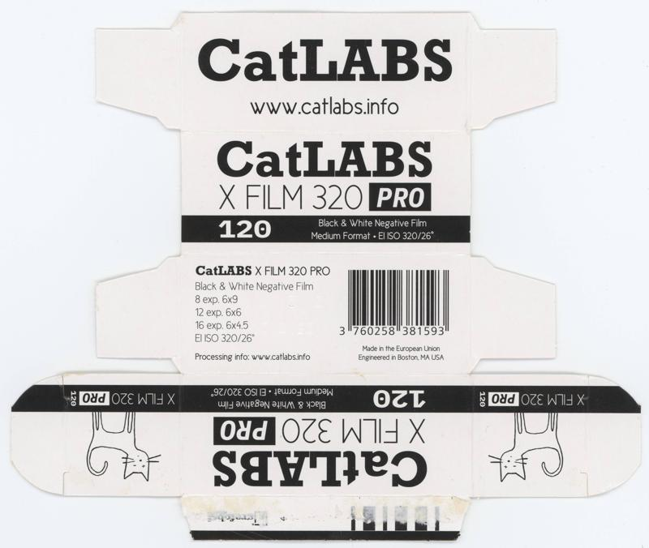
</a>


`UUID: 3fa90851d420466183f638184ce9a49a`‚Üì

<a href="./archive/00196_001.jpg">
	
</a>

#### [120] CineStill 800T (ref: c86a)

```
Format: 120          |  Process : C-41    
ISO   : 800          |  Expiry  : 2018-03 
Type  : Single Pack  |  Quantity: N/A     
Added : 2025-01-04   |  Author  : dekuNukem
UUID  : 53253eca96d841f5b98bfb3590fec86a
```

<a href="./archive/00006_000.jpg">
	
</a>


`UUID: 6576b3b48e8244469a692f2e0edcd1a6`‚Üì

<a href="./archive/00006_001.jpg">
	
</a>

#### [120] Efke IR 820 (ref: 43c9)

```
Format: 120          |  Process : BW      
ISO   : 100          |  Expiry  : 2013-03 
Type  : Single Pack  |  Quantity: N/A     
Added : 2025-01-05   |  Author  : dekuNukem
UUID  : 716e410a3823476e9befa704361f43c9
```

<a href="./archive/00038_000.jpg">
	
</a>


`UUID: 4c7b545000f04f4da046d18c43575e19`‚Üì

<a href="./archive/00038_001.jpg">
	
</a>

#### [120] Foma Fomapan (ref: 3e4f)

```
Format: 120          |  Process : BW      
ISO   : 200          |  Expiry  : 2027-03 
Type  : Single Pack  |  Quantity: N/A     
Added : 2025-06-05   |  Author  : benikum 
UUID  : 7be1cb0047f14034a7386cd7b1843e4f
```

<a href="./archive/00070_000.jpg">
	
</a>


`UUID: b049b10ae15b40319e7b70fed1ccbd71`‚Üì

<a href="./archive/00070_001.jpg">
	
</a>

#### [120] Foma Fomapan (ref: 65ad)

```
Format: 120          |  Process : BW      
ISO   : 100          |  Expiry  : 2027-04 
Type  : Single Pack  |  Quantity: N/A     
Added : 2025-07-31   |  Author  : Pelicram
UUID  : a0786cc1bc884f66bbb84118d55665ad
```

<a href="./archive/00133_000.jpg">
	
</a>


`UUID: 0d7f7062ffb34d0c91f0080e3749cbe4`‚Üì

<a href="./archive/00133_001.jpg">
	
</a>

#### [120] Foma Fomapan21 (ref: 75d9)

```
Format: 120          |  Process : BW      
ISO   : 100          |  Expiry  : 1971-04 
Type  : Single Pack  |  Quantity: N/A     
Added : 2025-06-21   |  Author  : benikum 
UUID  : 098e510bfaa14be39697b9d8218475d9
```

<a href="./archive/00074_000.jpg">
	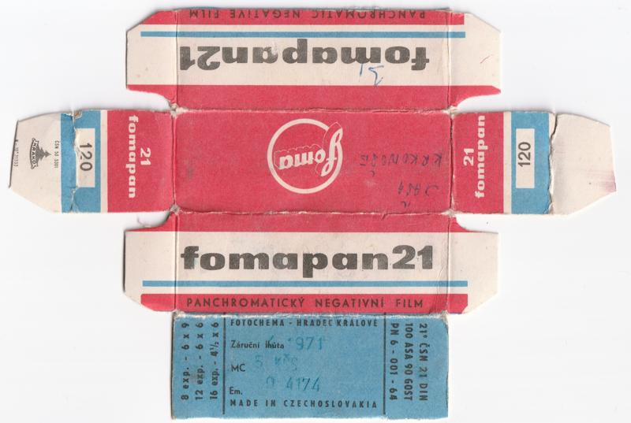
</a>

#### [120] Foma Ortho (ref: 89e7)

```
Format: 120          |  Process : BW      
ISO   : 400          |  Expiry  : 2026-04 
Type  : Single Pack  |  Quantity: N/A     
Added : 2025-07-31   |  Author  : Pelicram
UUID  : 4c97e2b7413b42278b0fd129c1c589e7
```

<a href="./archive/00127_000.jpg">
	
</a>


`UUID: 728d195752464a448163dbb0ad4e8aa0`‚Üì

<a href="./archive/00127_001.jpg">
	
</a>

#### [120] Foton Fotopan F (ref: 0ad6)

```
Format: 120          |  Process : BW      
ISO   : 50           |  Expiry  : 1969-01 
Type  : Single Pack  |  Quantity: N/A     
Added : 2025-08-19   |  Author  : @ellafridalindblom
UUID  : f2002785f14a4aba9fd1da2386890ad6
```

<a href="./archive/00205_000.jpg">
	
</a>

#### [120] Fujifilm Fujichrome Professional 100D (ref: 439d)

```
Format: 120          |  Process : E-6     
ISO   : 100          |  Expiry  : 1992-12 
Type  : Single Pack  |  Quantity: N/A     
Added : 2025-01-05   |  Author  : dekuNukem
UUID  : 5dcdd19ddf654415b7eac69183e7439d
```

<a href="./archive/00032_000.jpg">
	
</a>


`UUID: 2e00754170744438a318b7f71da1c977`‚Üì

<a href="./archive/00032_001.jpg">
	
</a>


`UUID: 2d0ef64e672342509bad0f88d7908974`‚Üì

<a href="./archive/00032_002.jpg">
	
</a>

#### [120] Fujifilm Fujicolor NPL 160 (ref: d10b)

```
Format: 120          |  Process : C-41    
ISO   : 160          |  Expiry  : 1998-07 
Type  : Single Pack  |  Quantity: N/A     
Added : 2025-01-05   |  Author  : dekuNukem
UUID  : ce40cc432d9e445b987fdd72fd88d10b
```

<a href="./archive/00034_000.jpg">
	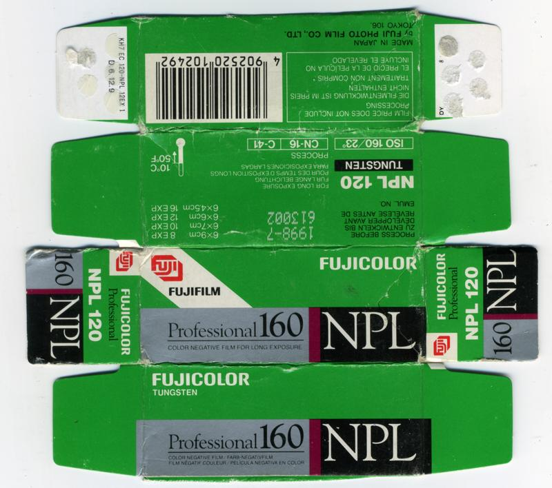
</a>


`UUID: 2e3f349e094b49d8ba6e026a98eb1455`‚Üì

<a href="./archive/00034_001.jpg">
	
</a>


`UUID: 10efb3e22574460db3db552e55684945`‚Üì

<a href="./archive/00034_002.jpg">
	
</a>

#### [120] Fujifilm Fujicolor Pro400 (ref: 1b8d)

```
Format: 120          |  Process : C-41    
ISO   : 400          |  Expiry  : 2003-06 
Type  : Single Pack  |  Quantity: N/A     
Added : 2025-08-20   |  Author  : @photos.by.qi
UUID  : 0b59ba932e214f03a5069488e9651b8d
```

<a href="./archive/00221_000.jpg">
	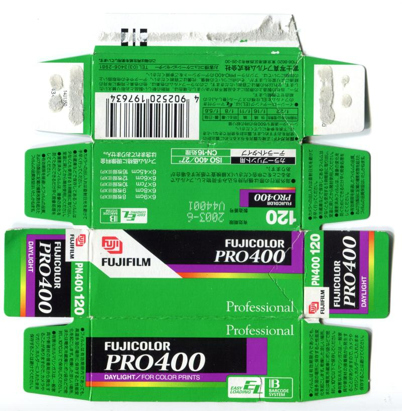
</a>

#### [120] Fujifilm Fujicolor Super G (ref: 55ff)

```
Format: 120          |  Process : C-41    
ISO   : 100          |  Expiry  : 2003-05 
Type  : Single Pack  |  Quantity: N/A     
Added : 2025-08-20   |  Author  : @photos.by.qi
UUID  : 331bb2ddb04f4cd8ab637f79324e55ff
```

<a href="./archive/00218_000.jpg">
	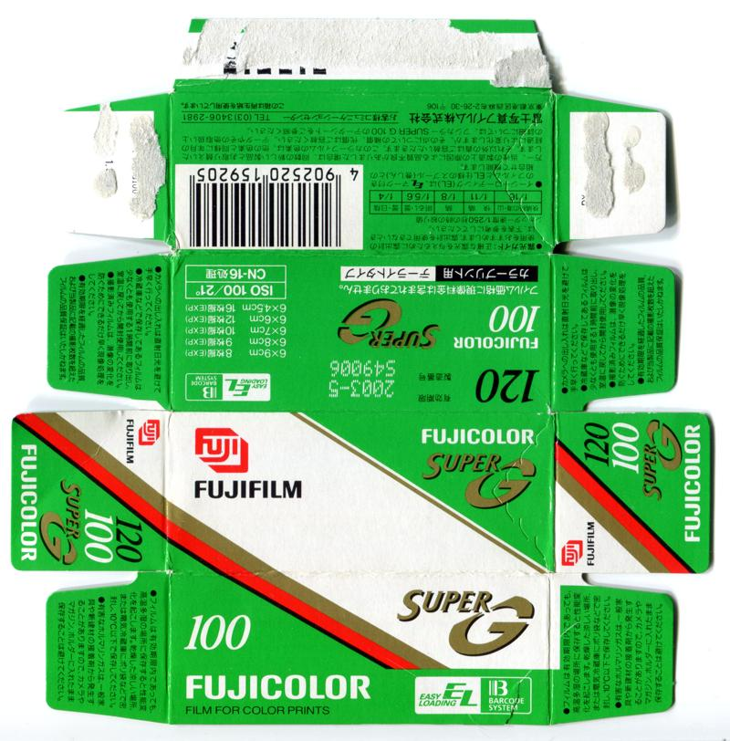
</a>

#### [120] Fujifilm Fujicolor Superia (ref: 0683)

```
Format: 120          |  Process : C-41    
ISO   : 400          |  Expiry  : 2002-05 
Type  : Single Pack  |  Quantity: N/A     
Added : 2025-01-04   |  Author  : dekuNukem
UUID  : c3d9e51d22e241f69133be30d5a00683
```

<a href="./archive/00012_000.jpg">
	
</a>


`UUID: 5cd39510c35f4b9cbae3089311db118f`‚Üì

<a href="./archive/00012_001.jpg">
	
</a>

#### [120] Fujifilm Pro 400H (ref: 66e3)

```
Format: 120          |  Process : C-41    
ISO   : 400          |  Expiry  : 2018-09 
Type  : Multi-Pack-5 |  Quantity: N/A     
Added : 2025-01-04   |  Author  : dekuNukem
UUID  : 0d89ecf11f3c46deb52171aa909566e3
```

<a href="./archive/00022_000.jpg">
	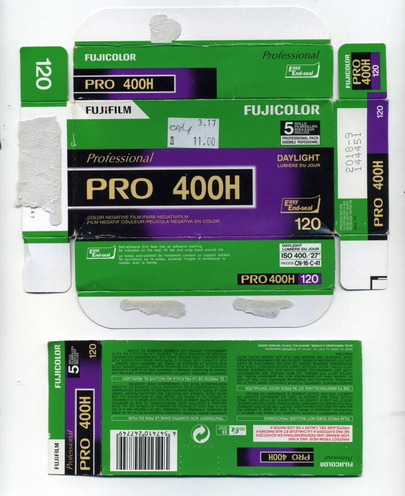
</a>

#### [120] Fujifilm Superia X-TRA (ref: 7980)

```
Format: 120          |  Process : C-41    
ISO   : 400          |  Expiry  : 2004-06 
Type  : Single Pack  |  Quantity: N/A     
Added : 2025-08-19   |  Author  : @ellafridalindblom
UUID  : 9e774f36e4d34b3c81a30a5b44da7980
```

<a href="./archive/00209_000.jpg">
	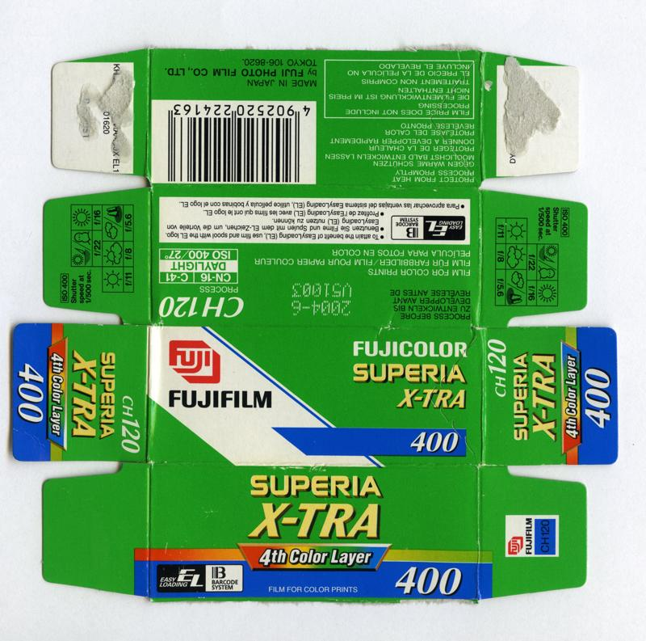
</a>


`UUID: 434f763fea0d4c4c9dc5aeb2eb10e8aa`‚Üì

<a href="./archive/00209_001.jpg">
	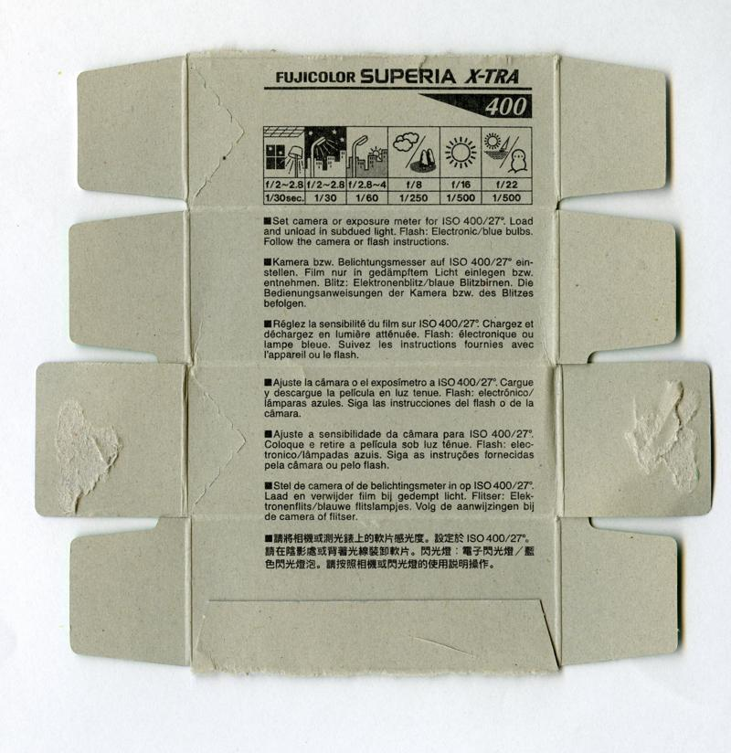
</a>

#### [120] Fujifilm Velvia 100F (ref: f7fb)

```
Format: 120          |  Process : E-6     
ISO   : 100          |  Expiry  : 2006-04 
Type  : Multi-Pack-5 |  Quantity: N/A     
Added : 2025-01-04   |  Author  : dekuNukem
UUID  : 0fef128c3b17437eb25d5c4f0520f7fb
```

<a href="./archive/00023_000.jpg">
	
</a>

#### [120] Harman Phoenix (ref: 637f)

```
Format: 120          |  Process : C-41    
ISO   : 200          |  Expiry  : 2026-08 
Type  : Single Pack  |  Quantity: N/A     
Added : 2025-01-04   |  Author  : dekuNukem
UUID  : 0b11ba38c9a34f58a2f13d696b05637f
```

<a href="./archive/00004_000.jpg">
	
</a>


`UUID: c5a0132ac51a488ba35ebd6cc48911e7`‚Üì

<a href="./archive/00004_001.jpg">
	
</a>

#### [120] Harman Phoenix II (ref: f686)

```
Format: 120          |  Process : C-41    
ISO   : 200          |  Expiry  : 2027-06 
Type  : Single Pack  |  Quantity: N/A     
Added : 2025-07-30   |  Author  : yc128   
UUID  : 42f9d40379814cf8b02c3f0daf74f686
```

<a href="./archive/00109_000.jpg">
	
</a>


`UUID: db80264f66ae451abd1b0cc6f34e3280`‚Üì

<a href="./archive/00109_001.jpg">
	
</a>

#### [120] Ilford Delta 100 (ref: eb8d)

```
Format: 120          |  Process : BW      
ISO   : 100          |  Expiry  : 2024-08 
Type  : Single Pack  |  Quantity: N/A     
Added : 2025-01-21   |  Author  : @ob.skura
UUID  : e39c5eca4e3e4e5badfa00ee512deb8d
```

<a href="./archive/00048_000.jpg">
	
</a>


`UUID: e4c76c5b957347178af448f4aa6001d0`‚Üì

<a href="./archive/00048_001.jpg">
	
</a>

#### [120] Ilford Delta 3200 (ref: 920f)

```
Format: 120          |  Process : BW      
ISO   : 3200         |  Expiry  : 2025-05 
Type  : Single Pack  |  Quantity: N/A     
Added : 2025-07-31   |  Author  : Pelicram
UUID  : 78d1111d1b234dcfb272c00d7935920f
```

<a href="./archive/00125_000.jpg">
	
</a>


`UUID: 06dcb1f1f350482ba935ad30bd5a42b6`‚Üì

<a href="./archive/00125_001.jpg">
	
</a>

#### [120] Ilford FP4 Plus (ref: 76e7)

```
Format: 120          |  Process : BW      
ISO   : 125          |  Expiry  : 2026-04 
Type  : Single Pack  |  Quantity: N/A     
Added : 2025-07-30   |  Author  : yc128   
UUID  : c6c88d6d009048e9ac3721bdc7f076e7
```

<a href="./archive/00111_000.jpg">
	
</a>


`UUID: 95c6d78d0b0540a9ba70dc769609a112`‚Üì

<a href="./archive/00111_001.jpg">
	
</a>

#### [120] Ilford HP5 Plus (ref: 11a8)

```
Format: 120          |  Process : BW      
ISO   : 400          |  Expiry  : 2012-06 
Type  : Single Pack  |  Quantity: N/A     
Added : 2025-07-31   |  Author  : Pelicram
UUID  : dbf3817f506a444b9d394745dba311a8
```

<a href="./archive/00140_000.jpg">
	
</a>


`UUID: 17ab4481b81243c9bbc211688ba2336a`‚Üì

<a href="./archive/00140_001.jpg">
	
</a>

#### [120] Ilford HP5 Plus (ref: efad)

```
Format: 120          |  Process : BW      
ISO   : 400          |  Expiry  : 2025-11 
Type  : Single Pack  |  Quantity: N/A     
Added : 2025-01-04   |  Author  : dekuNukem
UUID  : ddf9b76e633f43718144af7dcb89efad
```

<a href="./archive/00016_000.jpg">
	
</a>


`UUID: 1d938d2d844d498caf9fe2bc83618dda`‚Üì

<a href="./archive/00016_001.jpg">
	
</a>

#### [120] Ilford HP5 Plus (ref: 1a5d)

```
Format: 120          |  Process : BW      
ISO   : 400          |  Expiry  : 2026-09 
Type  : Single Pack  |  Quantity: N/A     
Added : 2025-01-04   |  Author  : dekuNukem
UUID  : 36151f6b7cc045c2b43d7f5cbee41a5d
```

<a href="./archive/00000_000.jpg">
	
</a>


`UUID: 3d64b751d4dd412889855a65731d5f25`‚Üì

<a href="./archive/00000_001.jpg">
	
</a>

#### [120] Ilford SFX 200 (ref: 6057)

```
Format: 120          |  Process : BW      
ISO   : 200          |  Expiry  : 2013-09 
Type  : Single Pack  |  Quantity: N/A     
Added : 2025-01-04   |  Author  : dekuNukem
UUID  : 7856b5442362453caa67628c93be6057
```

<a href="./archive/00009_000.jpg">
	
</a>


`UUID: 2579a55634474187bac08797a02f422d`‚Üì

<a href="./archive/00009_001.jpg">
	
</a>

#### [120] Kodak Ektachrome E100VS (ref: a8d3)

```
Format: 120          |  Process : E-6     
ISO   : 100          |  Expiry  : 2010-04 
Type  : Multi-Pack-5 |  Quantity: N/A     
Added : 2025-08-03   |  Author  : dekuNukem
UUID  : e8673d04cee440bd9c065a37a485a8d3
```

<a href="./archive/00160_000.jpg">
	
</a>

#### [120] Kodak Gold 200 (ref: 933f)

```
Format: 120          |  Process : C-41    
ISO   : 200          |  Expiry  : 2026-11 
Type  : Multi-Pack-5 |  Quantity: N/A     
Added : 2025-01-04   |  Author  : dekuNukem
UUID  : e8aefc10fa0d43cebbac73bdcf10933f
```

<a href="./archive/00021_000.jpg">
	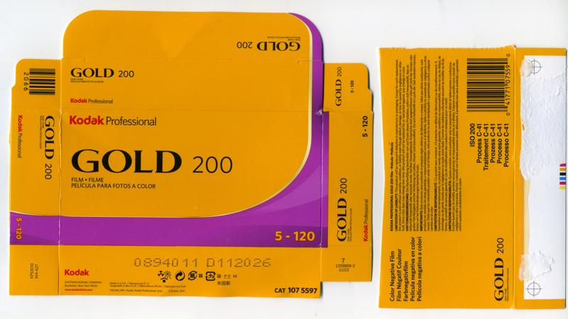
</a>

#### [120] Kodak High Speed Ektachrome (ref: ce7f)

```
Format: 120          |  Process : E-2     
ISO   : 160          |  Expiry  : 1963-01 
Type  : Single Pack  |  Quantity: N/A     
Added : 2025-01-04   |  Author  : dekuNukem
UUID  : ec7cf78858fc48c59e5a0875ec74ce7f
```

<a href="./archive/00017_000.jpg">
	
</a>

#### [120] Kodak Kodacolor-X (ref: a4b1)

```
Format: 120          |  Process : C-22    
ISO   : 80           |  Expiry  : 1974-01 
Type  : Single Pack  |  Quantity: N/A     
Added : 2025-05-24   |  Author  : dekuNukem
UUID  : 01bfcffd1db54d6eadefbc1442f7a4b1
```

<a href="./archive/00064_000.jpg">
	
</a>


`UUID: 20e8ec19e41a4c1e99eac4cd7ce097fa`‚Üì

<a href="./archive/00064_001.jpg">
	
</a>


`UUID: fc168256a6044253a1cf1c8362cf5c50`‚Üì

<a href="./archive/00064_002.jpg">
	
</a>

#### [120] Kodak Portra 400VC (ref: b67b)

```
Format: 120          |  Process : C-41    
ISO   : 400          |  Expiry  : 2004-12 
Type  : Multi-Pack-5 |  Quantity: N/A     
Added : 2025-08-20   |  Author  : @photos.by.qi
UUID  : 348bccb01edc4a6ea9a2f5c4d88cb67b
```

<a href="./archive/00243_000.jpg">
	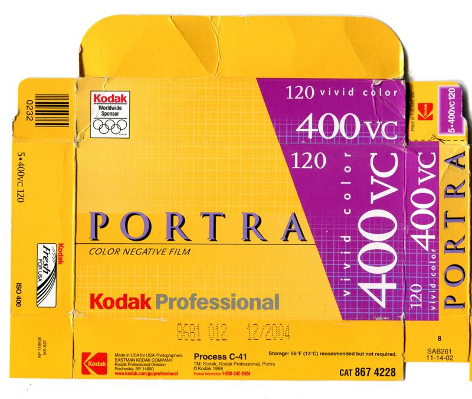
</a>


`UUID: 154cd3f3c85944ab87c33eaad232c3b6`‚Üì

<a href="./archive/00243_001.jpg">
	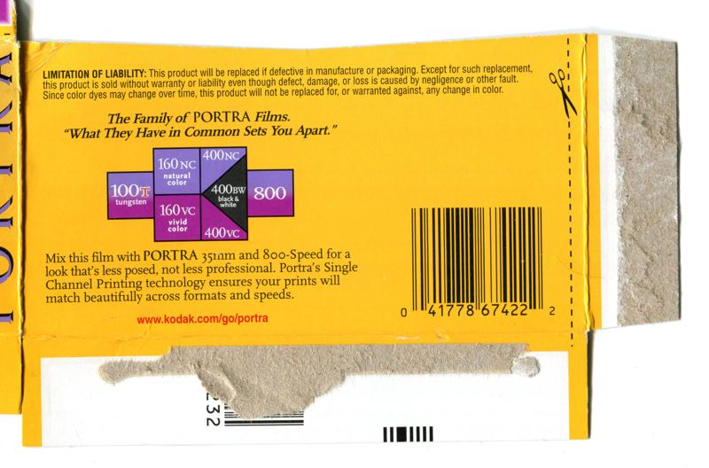
</a>


`UUID: de89359102c54df797bee4229920e191`‚Üì

<a href="./archive/00243_002.jpg">
	
</a>


`UUID: c4a365adef6546cf945a04e9a6088a02`‚Üì

<a href="./archive/00243_003.jpg">
	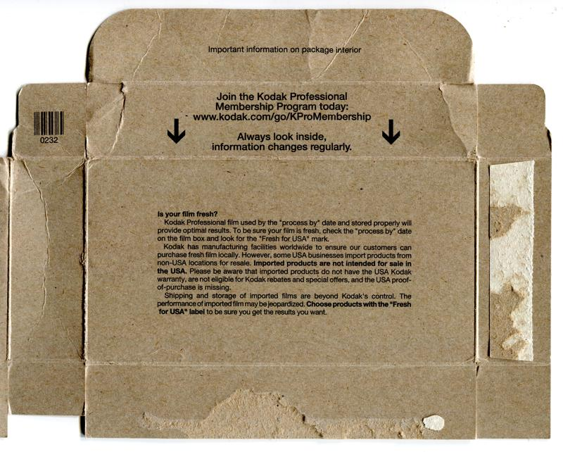
</a>

#### [120] Kodak Portra 800 (ref: 21f9)

```
Format: 120          |  Process : C-41    
ISO   : 800          |  Expiry  : 2022-10 
Type  : Multi-Pack-5 |  Quantity: N/A     
Added : 2025-08-20   |  Author  : @photos.by.qi
UUID  : 3663afb2b2d340d3a5c9e0d0e9f021f9
```

<a href="./archive/00240_000.jpg">
	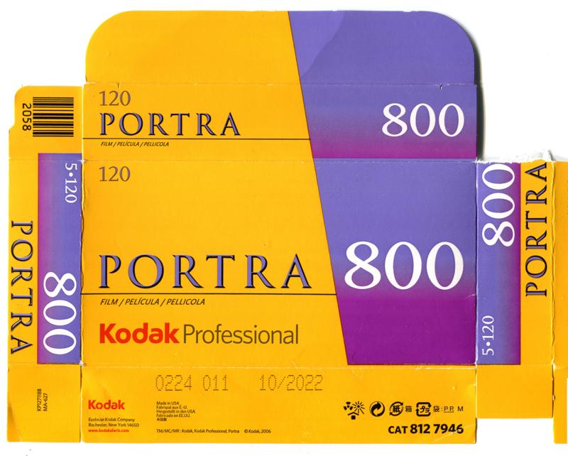
</a>


`UUID: 63ef586862154b94aeccdbdb4227ad5c`‚Üì

<a href="./archive/00240_001.jpg">
	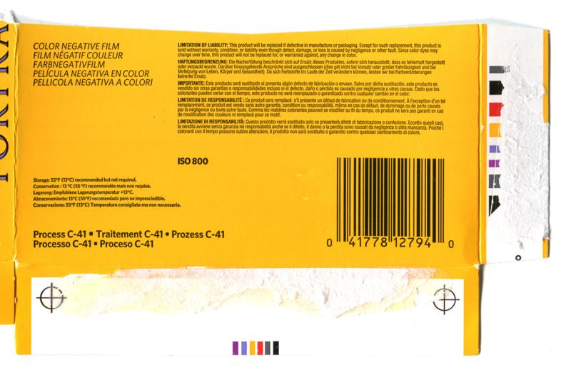
</a>

#### [120] Kodak TMAX 100 (ref: b3b1)

```
Format: 120          |  Process : BW      
ISO   : 100          |  Expiry  : 2023-07 
Type  : Multi-Pack-5 |  Quantity: N/A     
Added : 2025-05-24   |  Author  : dekuNukem
UUID  : 9a43d0c373354e1989ea7bb7a43db3b1
```

<a href="./archive/00069_000.jpg">
	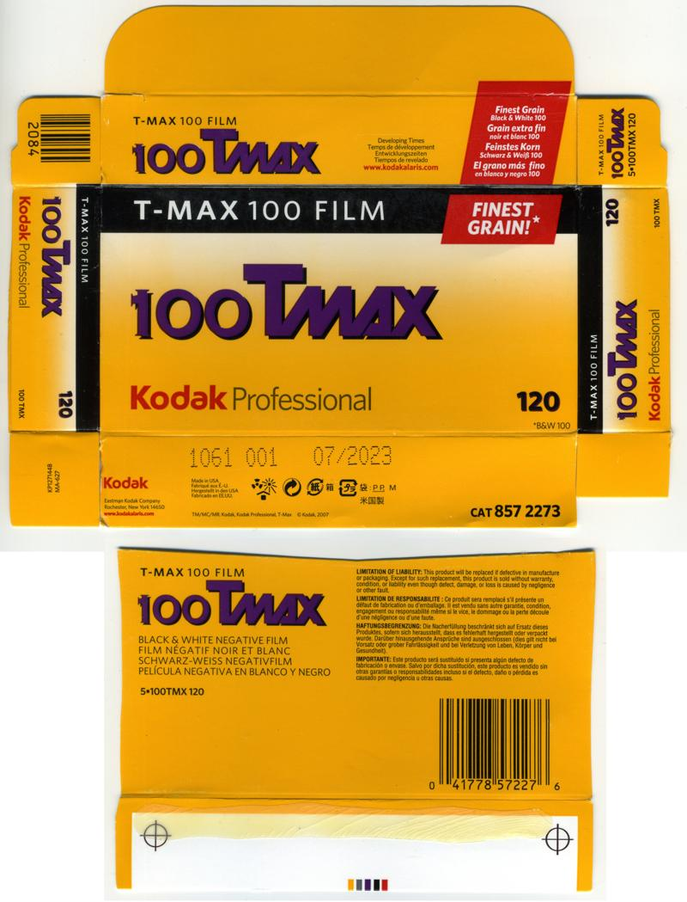
</a>

#### [120] Kodak Technical Pan 6415 (ref: 03be)

```
Format: 120          |  Process : BW      
ISO   : 25           |  Expiry  : 1988-05 
Type  : Single Pack  |  Quantity: N/A     
Added : 2025-01-05   |  Author  : dekuNukem
UUID  : 3a03860d64d2400caee97955197703be
```

<a href="./archive/00037_000.jpg">
	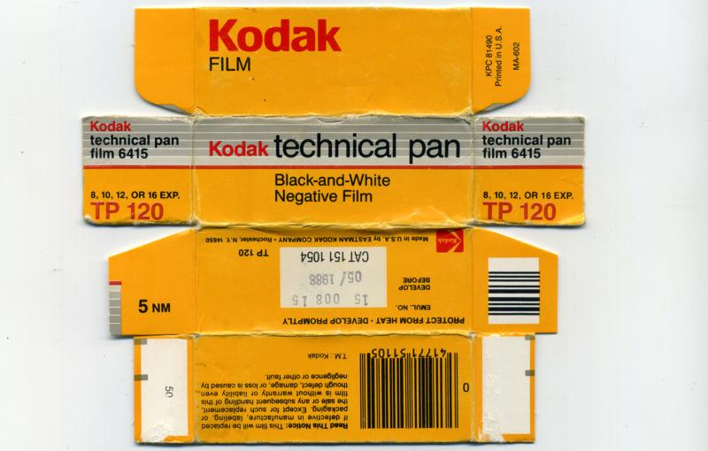
</a>


`UUID: 579e1eee184e49669d586cf512ec1bc8`‚Üì

<a href="./archive/00037_001.jpg">
	
</a>


`UUID: 6bcd669b9d2e44c6929e55a446d1d075`‚Üì

<a href="./archive/00037_002.jpg">
	
</a>

#### [120] Kodak Tri-X 400 (ref: 88c5)

```
Format: 120          |  Process : BW      
ISO   : 400          |  Expiry  : 2025-12 
Type  : Single Pack  |  Quantity: N/A     
Added : 2025-01-04   |  Author  : dekuNukem
UUID  : f7f99b9d46a4491c9cbfda4f030f88c5
```

<a href="./archive/00028_000.jpg">
	
</a>

#### [120] Kodak Vericolor 400 Plus (ref: bd88)

```
Format: 120          |  Process : C-41    
ISO   : 400          |  Expiry  : 1998-10 
Type  : Multi-Pack-5 |  Quantity: N/A     
Added : 2025-08-20   |  Author  : @photos.by.qi
UUID  : 8b882b8198ca4aeb8180b8743269bd88
```

<a href="./archive/00238_000.jpg">
	
</a>


`UUID: 07052f2a4fd8445aa344c21b79c06d9d`‚Üì

<a href="./archive/00238_001.jpg">
	
</a>


`UUID: 8a605cec4f594f37823796472cfb7005`‚Üì

<a href="./archive/00238_002.jpg">
	
</a>


`UUID: cb3839d18fe44552bb710d82020a7743`‚Üì

<a href="./archive/00238_003.jpg">
	
</a>

#### [120] Kodak Vericolor III (ref: 4b3e)

```
Format: 120          |  Process : C-41    
ISO   : 160          |  Expiry  : 2000-09 
Type  : Multi-Pack-5 |  Quantity: N/A     
Added : 2025-08-20   |  Author  : @photos.by.qi
UUID  : bcb6ab106d2941429eaf1088c1194b3e
```

<a href="./archive/00237_000.jpg">
	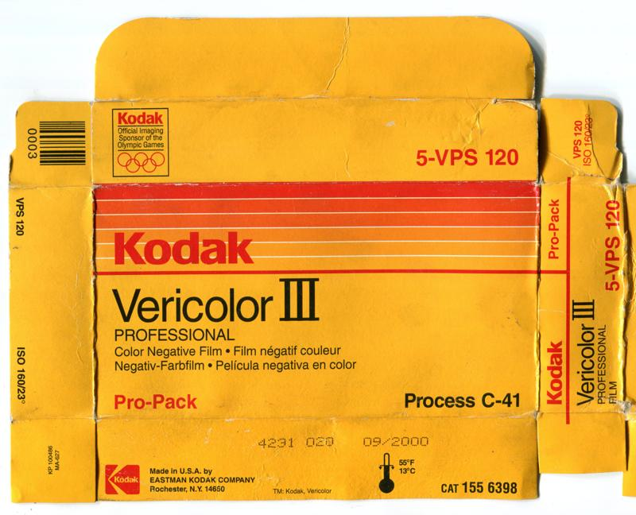
</a>


`UUID: e4c84e87bd66459cbea1954dc32b5920`‚Üì

<a href="./archive/00237_001.jpg">
	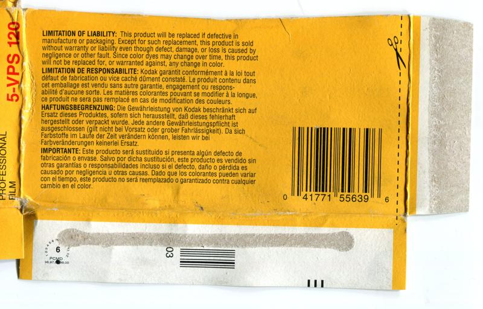
</a>


`UUID: 6cbb4abac86e407d99055015b4719e95`‚Üì

<a href="./archive/00237_002.jpg">
	
</a>


`UUID: ed6cc093b4e44b8b81bb19f6d1e6a4f2`‚Üì

<a href="./archive/00237_003.jpg">
	
</a>

#### [120] Konica Infrared 750nm (ref: e696)

```
Format: 120          |  Process : BW      
ISO   : 32           |  Expiry  : 1991-02 
Type  : Single Pack  |  Quantity: N/A     
Added : 2025-01-05   |  Author  : dekuNukem
UUID  : 79a0275aee8e43e895b5794a8538e696
```

<a href="./archive/00039_000.jpg">
	
</a>


`UUID: b5abc293fb26450eab9bfdda971cf1ad`‚Üì

<a href="./archive/00039_001.jpg">
	
</a>

#### [120] Konica Infrared 750nm (ref: 2d93)

```
Format: 120          |  Process : BW      
ISO   : 32           |  Expiry  : 2000-03 
Type  : Single Pack  |  Quantity: N/A     
Added : 2025-01-05   |  Author  : dekuNukem
UUID  : 63b2857f2df549878446cc1963362d93
```

<a href="./archive/00036_000.jpg">
	
</a>

#### [120] Lomography Lomochrome Turquoise (ref: 0d90)

```
Format: 120          |  Process : C-41    
ISO   : 100-400      |  Expiry  : 2025-07 
Type  : Single Pack  |  Quantity: N/A     
Added : 2025-01-04   |  Author  : dekuNukem
UUID  : 99643a4fc27b4ff298e834fc72970d90
```

<a href="./archive/00008_000.jpg">
	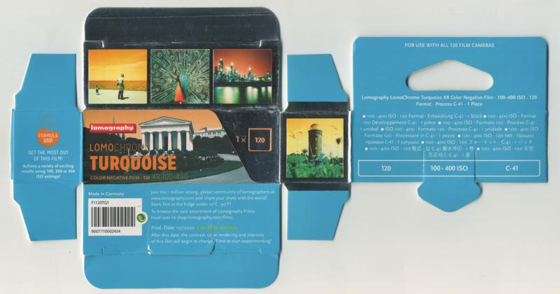
</a>


`UUID: adc4ed82e419439c8bec5348db4a1ca2`‚Üì

<a href="./archive/00008_001.jpg">
	
</a>

#### [120] Reflx Lab 250D (ref: 1a3e)

```
Format: 120          |  Process : ECN-2   
ISO   : 250          |  Expiry  : 2027-12 
Type  : Single Pack  |  Quantity: N/A     
Added : 2025-08-18   |  Author  : lt_col_tall
UUID  : ce8b081c148f43f7921e2fb4d7aa1a3e
```

<a href="./archive/00194_000.jpg">
	
</a>

#### [120] Rollei Infrared (ref: 4f54)

```
Format: 120          |  Process : BW      
ISO   : 200          |  Expiry  : 2027-08 
Type  : Single Pack  |  Quantity: N/A     
Added : 2025-01-05   |  Author  : dekuNukem
UUID  : b7bb7d65979543d0a8e5c9179d734f54
```

<a href="./archive/00030_000.jpg">
	
</a>


`UUID: a950a24ab9da4b23b33e0b4b9d28d5d5`‚Üì

<a href="./archive/00030_001.jpg">
	
</a>

#### [120] Rollei Retro 80S (ref: e6c0)

```
Format: 120          |  Process : BW      
ISO   : 80           |  Expiry  : 2026-02 
Type  : Single Pack  |  Quantity: N/A     
Added : 2025-01-04   |  Author  : dekuNukem
UUID  : fb2ccfebcf2f4a17afe00acaaea5e6c0
```

<a href="./archive/00005_000.jpg">
	
</a>


`UUID: a57794309f6b44d784d9555b416a200c`‚Üì

<a href="./archive/00005_001.jpg">
	
</a>

#### [126] GAF Color Slide Film (ref: dea6)

```
Format: 126          |  Process : AR-1    
ISO   : 64           |  Expiry  : 1974-01 
Type  : Single Pack  |  Quantity: 20exp   
Added : 2025-02-04   |  Author  : b0baspace
UUID  : c426ea17398c4c549c6a2720103adea6
```

<a href="./archive/00054_000.jpg">
	
</a>


`UUID: f8987f712bca4daaae3f732500332332`‚Üì

<a href="./archive/00054_001.jpg">
	
</a>


`UUID: 02c9a3b0b9f547c4ab3cabb2d1173fdf`‚Üì

<a href="./archive/00054_002.jpg">
	
</a>


`UUID: a332a7492f2b4a708c8a0ead5b9af986`‚Üì

<a href="./archive/00054_003.jpg">
	
</a>


`UUID: dd9347600c9a47299504239d1038f0dd`‚Üì

<a href="./archive/00054_004.jpg">
	
</a>


`UUID: 90cc6194552d42dd873d9af54a9bc283`‚Üì

<a href="./archive/00054_005.jpg">
	
</a>

#### [126] Kodak Kodacolor-X (ref: 5302)

```
Format: 126          |  Process : C-22    
ISO   : 80           |  Expiry  : 1975-05 
Type  : Single Pack  |  Quantity: 20exp   
Added : 2025-01-04   |  Author  : dekuNukem
UUID  : 5a3d2ba8ff7649c9b3450d7069445302
```

<a href="./archive/00024_000.jpg">
	
</a>

#### [127] Shanghai GP3 (ref: 52aa)

```
Format: 127          |  Process : BW      
ISO   : 100          |  Expiry  : 2024-07 
Type  : Single Pack  |  Quantity: N/A     
Added : 2025-01-21   |  Author  : @ob.skura
UUID  : 0e16f7ae50164c658acd22b8d62e52aa
```

<a href="./archive/00050_000.jpg">
	
</a>

#### [12x16.5cm] Defender Portrait HGS (ref: d69c)

```
Format: 12x16.5cm    |  Process : BW      
ISO   : Unknown      |  Expiry  : Unknown 
Type  : Single Pack  |  Quantity: 12 Sheets
Added : 2025-08-19   |  Author  : @ellafridalindblom
UUID  : 24c9c3108671446dae824d00093fd69c
```

<a href="./archive/00208_000.jpg">
	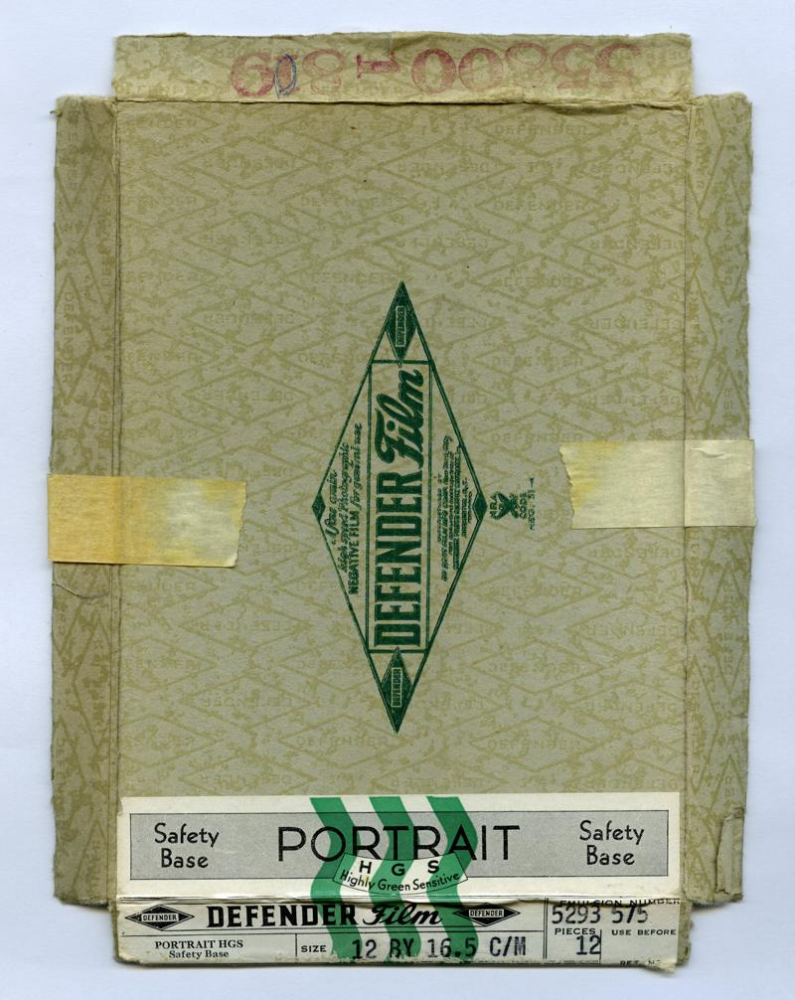
</a>


`UUID: 5782545b9d15462e93943f2b62f605f5`‚Üì

<a href="./archive/00208_001.jpg">
	
</a>

#### [16mm] Kodak Eastman High Contrast Panchromatic 7369 (ref: faec)

```
Format: 16mm         |  Process : D-97    
ISO   : Unknown      |  Expiry  : Unknown 
Type  : Single Pack  |  Quantity: 100ft   
Added : 2025-07-29   |  Author  : Nano_Burger
UUID  : 46cc0a179fc34cb4832e1d3336bafaec
```

<a href="./archive/00099_000.jpg">
	
</a>

#### [16mm] Kodak Eastman Tri-X Reversal Film 7278 (ref: 8468)

```
Format: 16mm         |  Process : BW      
ISO   : 200          |  Expiry  : Unknown 
Type  : Bulk Roll    |  Quantity: 100ft   
Added : 2025-08-14   |  Author  : Camera.Riley
UUID  : e214a4d756ac48c4ac6dbe515fd38468
```

<a href="./archive/00176_000.jpg">
	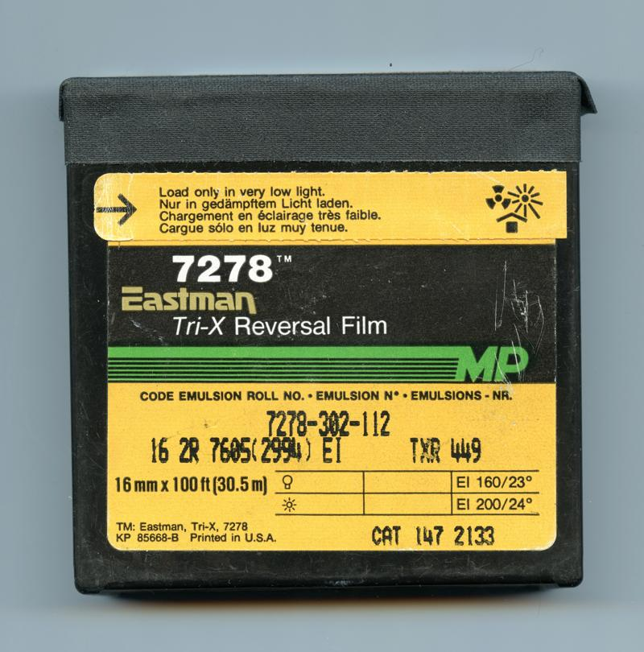
</a>

#### [16mm] Minolta Minolta 16 Color Film For Prints (ref: a2ff)

```
Format: 16mm         |  Process : C-41    
ISO   : 100          |  Expiry  : 1992-06 
Type  : Single Pack  |  Quantity: 20exp   
Added : 2025-08-05   |  Author  : The Compartmentalist
UUID  : a2cfc71ac0e24ea58f4e3350423aa2ff
```

<a href="./archive/00162_000.jpg">
	
</a>

#### [220] Kodak Ektacolor Pro Gold (ref: c3f8)

```
Format: 220          |  Process : C-41    
ISO   : 160          |  Expiry  : 2000-07 
Type  : Multi-Pack-5 |  Quantity: N/A     
Added : 2025-01-04   |  Author  : dekuNukem
UUID  : 7456456d09c844c8ab046abd9c17c3f8
```

<a href="./archive/00027_000.jpg">
	
</a>


`UUID: e9e4b4c649dc4b62aecc7bc004a1a6ff`‚Üì

<a href="./archive/00027_001.jpg">
	
</a>


`UUID: c13296cf46f04c1dba4ef93110f3ca71`‚Üì

<a href="./archive/00027_002.jpg">
	
</a>


`UUID: 53e024b9a272410888a6d44549f7ceb0`‚Üì

<a href="./archive/00027_003.jpg">
	
</a>

#### [220] Reflx Lab Pro 100 (ref: 1311)

```
Format: 220          |  Process : C-41    
ISO   : 100          |  Expiry  : 2027-12 
Type  : Single Pack  |  Quantity: N/A     
Added : 2025-08-18   |  Author  : lt_col_tall
UUID  : f7bc85a093744f3084883876ecc51311
```

<a href="./archive/00195_000.jpg">
	
</a>

#### [35mm] ADOX KB17 (ref: 2c95)

```
Format: 35mm         |  Process : BW      
ISO   : 40           |  Expiry  : 1964-01 
Type  : Single Pack  |  Quantity: 36exp   
Added : 2025-05-24   |  Author  : dekuNukem
UUID  : 14047842e1a641268bfd4d01fcf02c95
```

<a href="./archive/00065_000.jpg">
	
</a>


`UUID: 04f60deb3d044553a9d662db1d30d3b7`‚Üì

<a href="./archive/00065_001.jpg">
	
</a>

#### [35mm] Adox HR 50 (ref: 4da7)

```
Format: 35mm         |  Process : BW      
ISO   : 50           |  Expiry  : 2027-07 
Type  : Single Pack  |  Quantity: 36exp   
Added : 2025-08-13   |  Author  : Pelicram
UUID  : a504b8da97b642908de921d1053d4da7
```

<a href="./archive/00182_000.jpg">
	
</a>


`UUID: f5e745758ed2479ea297dce9275f3508`‚Üì

<a href="./archive/00182_001.jpg">
	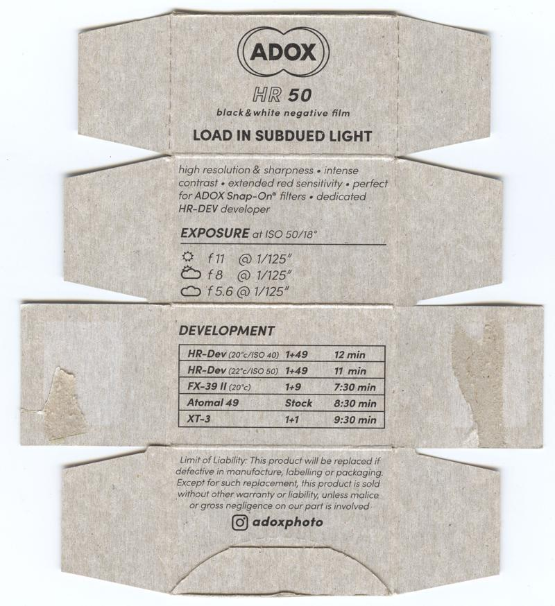
</a>

#### [35mm] Agfa APX (ref: 5276)

```
Format: 35mm         |  Process : BW      
ISO   : 100          |  Expiry  : 2028-05 
Type  : Single Pack  |  Quantity: 36exp   
Added : 2025-07-28   |  Author  : lilyu.xyz
UUID  : ecf4e081ccf64a9a8606601f9f665276
```

<a href="./archive/00093_000.jpg">
	
</a>


`UUID: 286ea2dbf5394a36b8f013b9aaa33a46`‚Üì

<a href="./archive/00093_001.jpg">
	
</a>

#### [35mm] Agfa APX 25 (ref: 805f)

```
Format: 35mm         |  Process : BW      
ISO   : 25           |  Expiry  : Unknown 
Type  : Single Pack  |  Quantity: 36exp   
Added : 2025-08-18   |  Author  : @recycling.film
UUID  : 4ef7e8e28d2c4c589d24d9e12135805f
```

<a href="./archive/00198_000.jpg">
	
</a>


`UUID: 757b2d5a25cc41aab1220ff909f90fb0`‚Üì

<a href="./archive/00198_001.jpg">
	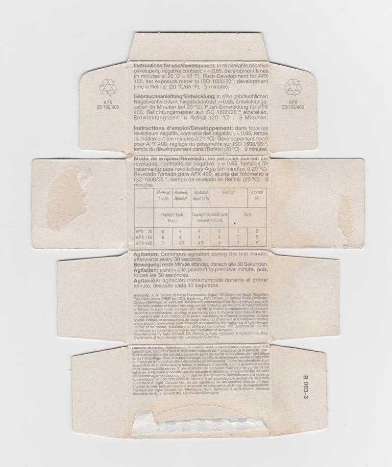
</a>

#### [35mm] Agfa Agfacolor XRG (ref: 689e)

```
Format: 35mm         |  Process : C-41    
ISO   : 200          |  Expiry  : 2005-03 
Type  : Single Pack  |  Quantity: 36exp   
Added : 2025-07-31   |  Author  : stefanie
UUID  : 86136eea89d14e15b60dfcdf45b1689e
```

<a href="./archive/00152_000.jpg">
	
</a>


`UUID: 5598d8aac5844772a87d019a7d37e9f6`‚Üì

<a href="./archive/00152_001.jpg">
	
</a>

#### [35mm] Agfa Agfapan APX 100 (ref: e271)

```
Format: 35mm         |  Process : BW      
ISO   : 100          |  Expiry  : 2005-07 
Type  : Single Pack  |  Quantity: 24exp   
Added : 2025-08-16   |  Author  : Kraksen 
UUID  : e00a9a59b3d74a1d85ff4331bc73e271
```

<a href="./archive/00191_000.jpg">
	
</a>

#### [35mm] Agfa Agfapan APX 400 (ref: 19bc)

```
Format: 35mm         |  Process : BW      
ISO   : 400          |  Expiry  : 2006-01 
Type  : Single Pack  |  Quantity: 36exp   
Added : 2025-08-16   |  Author  : Kraksen 
UUID  : 7dd80a6f50584141ba1752071b9419bc
```

<a href="./archive/00190_000.jpg">
	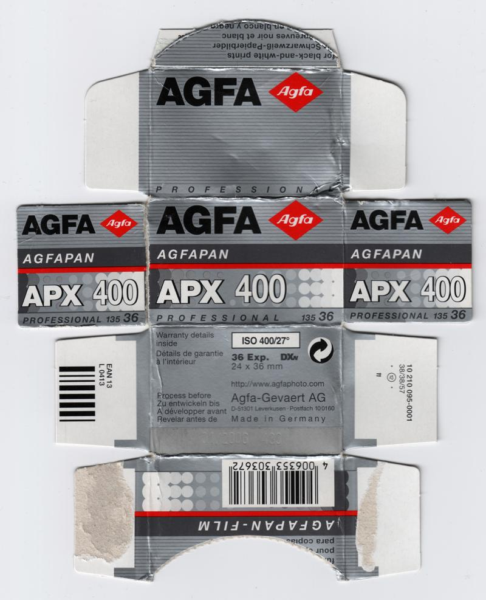
</a>


`UUID: 4ecb4b290f4845c196358776429baaec`‚Üì

<a href="./archive/00190_001.jpg">
	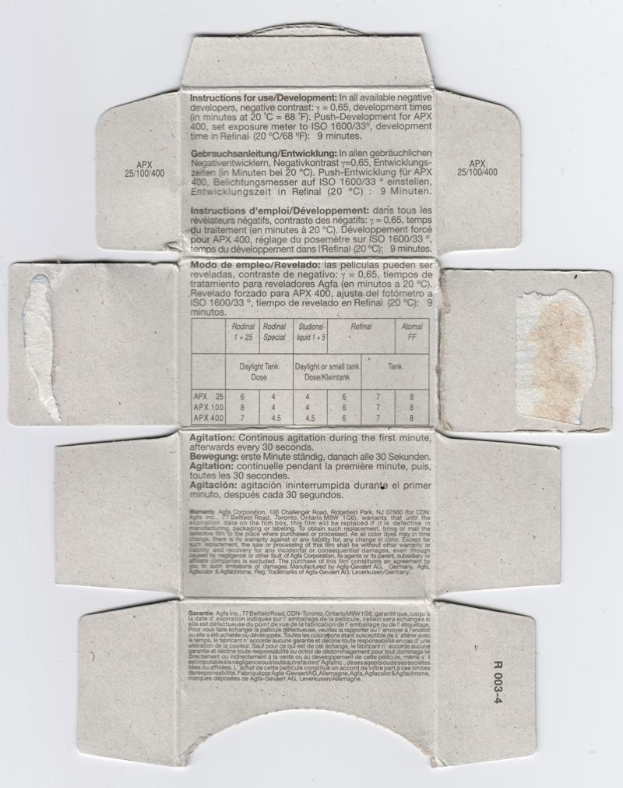
</a>

#### [35mm] Agfa Agfapan Rapid (ref: 5e7b)

```
Format: 35mm         |  Process : BW      
ISO   : 40           |  Expiry  : 1969-02 
Type  : Single Pack  |  Quantity: 12exp   
Added : 2025-07-31   |  Author  : The Compartmentalist
UUID  : b2470c1734d344698f6e1c01eaa85e7b
```

<a href="./archive/00115_000.jpg">
	
</a>

#### [35mm] Agfa Fine-Grain Plenachrome (ref: e5d4)

```
Format: 35mm         |  Process : BW      
ISO   : Unknown      |  Expiry  : 1941-01 
Type  : Bulk Roll    |  Quantity: 27.5ft  
Added : 2025-08-14   |  Author  : Camera.Riley
UUID  : 66a105cd605748d78884e5c305a4e5d4
```

<a href="./archive/00179_000.jpg">
	
</a>


`UUID: c199fff31c474139afcea6ed0b66ff7e`‚Üì

<a href="./archive/00179_001.jpg">
	
</a>

#### [35mm] Agfa Isopan FF (ref: 3700)

```
Format: 35mm         |  Process : BW      
ISO   : 8            |  Expiry  : 1946-10 
Type  : Single Pack  |  Quantity: 36exp   
Added : 2025-07-29   |  Author  : Nano_Burger
UUID  : 9ea6437ea85442048ffe63b8b64c3700
```

<a href="./archive/00101_000.jpg">
	
</a>

#### [35mm] Agfa Isopan ISS (ref: 75fa)

```
Format: 35mm         |  Process : BW      
ISO   : 100          |  Expiry  : 1963-11 
Type  : Single Pack  |  Quantity: 20exp   
Added : 2025-07-31   |  Author  : Pelicram
UUID  : cdcaa912ee0142c3b76eb1500e2375fa
```

<a href="./archive/00148_000.jpg">
	
</a>

#### [35mm] Agfa ULTRA 50 (ref: 4faa)

```
Format: 35mm         |  Process : C-41    
ISO   : 50           |  Expiry  : 2001-10 
Type  : Single Pack  |  Quantity: 36exp   
Added : 2025-01-04   |  Author  : dekuNukem
UUID  : d10e846ba5154f1d940ed7009a904faa
```

<a href="./archive/00010_000.jpg">
	
</a>


`UUID: 8594d11f816c45b6a18dd122f8e38fc0`‚Üì

<a href="./archive/00010_001.jpg">
	
</a>

#### [35mm] Agfa Vista (ref: d3af)

```
Format: 35mm         |  Process : C-41    
ISO   : 200          |  Expiry  : 2003-12 
Type  : Single Pack  |  Quantity: 24exp   
Added : 2025-01-04   |  Author  : dekuNukem
UUID  : f1e50745927f4b7cb16af36fd30dd3af
```

<a href="./archive/00014_000.jpg">
	
</a>


`UUID: 300a430fc19f4eeeb4892e58d3c3cd56`‚Üì

<a href="./archive/00014_001.jpg">
	
</a>

#### [35mm] Alfo ALFOcolor PR-G (ref: 94b9)

```
Format: 35mm         |  Process : C-41    
ISO   : 1600         |  Expiry  : 1993-08 
Type  : Single Pack  |  Quantity: 24exp   
Added : 2025-07-31   |  Author  : stefanie
UUID  : cc723aa89e9e43ec8ac1ebd18efa94b9
```

<a href="./archive/00151_000.jpg">
	
</a>

#### [35mm] Alien Film 5222/XX (ref: 3e49)

```
Format: 35mm         |  Process : BW      
ISO   : 250          |  Expiry  : 2024-06 
Type  : Single Pack  |  Quantity: 36exp   
Added : 2025-05-24   |  Author  : dekuNukem
UUID  : 9984ed6c13cd4be496e7e4b58e313e49
```

<a href="./archive/00057_000.jpg">
	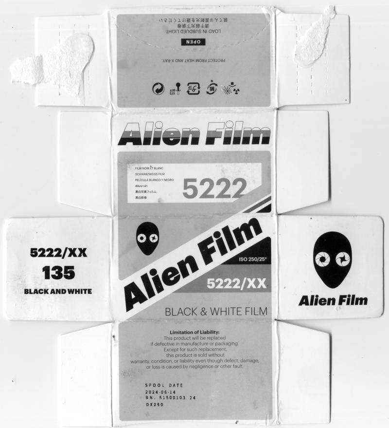
</a>

#### [35mm] Bergger Pancro400 (ref: f619)

```
Format: 35mm         |  Process : BW      
ISO   : 400          |  Expiry  : 2026-12 
Type  : Single Pack  |  Quantity: 36exp   
Added : 2025-07-31   |  Author  : Pelicram
UUID  : 0d9fee6b29f445f089acde3247d1f619
```

<a href="./archive/00123_000.jpg">
	
</a>


`UUID: 29d10e873e704093bd65148f288f968b`‚Üì

<a href="./archive/00123_001.jpg">
	
</a>

#### [35mm] Boots Colour Print Film (ref: a30f)

```
Format: 35mm         |  Process : C-41    
ISO   : 200          |  Expiry  : 2013-02 
Type  : Single Pack  |  Quantity: 36exp   
Added : 2025-08-07   |  Author  : @Hol.m35
UUID  : bd601340027a4c9daa7e219b414fa30f
```

<a href="./archive/00166_000.jpg">
	
</a>

#### [35mm] Building 2 200T (ref: c025)

```
Format: 35mm         |  Process : ECN-2   
ISO   : 200          |  Expiry  : 2021-06 
Type  : Single Pack  |  Quantity: 36exp   
Added : 2025-08-20   |  Author  : @photos.by.qi
UUID  : 4e05091526684626b09f6f957dd9c025
```

<a href="./archive/00210_000.jpg">
	
</a>

#### [35mm] Building 2 250D (ref: 7d4f)

```
Format: 35mm         |  Process : ECN-2   
ISO   : 250          |  Expiry  : 2020-12 
Type  : Single Pack  |  Quantity: 36exp   
Added : 2025-08-20   |  Author  : @photos.by.qi
UUID  : 693d77ba06bc4823bd4f43112d957d4f
```

<a href="./archive/00211_000.jpg">
	
</a>

#### [35mm] Building 2 500T (ref: 70d9)

```
Format: 35mm         |  Process : ECN-2   
ISO   : 500          |  Expiry  : 2021-06 
Type  : Single Pack  |  Quantity: 36exp   
Added : 2025-08-20   |  Author  : @photos.by.qi
UUID  : 2e9e8e40ac154f4f9ac497837e2470d9
```

<a href="./archive/00212_000.jpg">
	
</a>

#### [35mm] Building 2 50D (ref: e548)

```
Format: 35mm         |  Process : ECN-2   
ISO   : 50           |  Expiry  : 2021-06 
Type  : Single Pack  |  Quantity: 36exp   
Added : 2025-08-20   |  Author  : @photos.by.qi
UUID  : f0c8cbdc08d146ba8690d19a70dbe548
```

<a href="./archive/00213_000.jpg">
	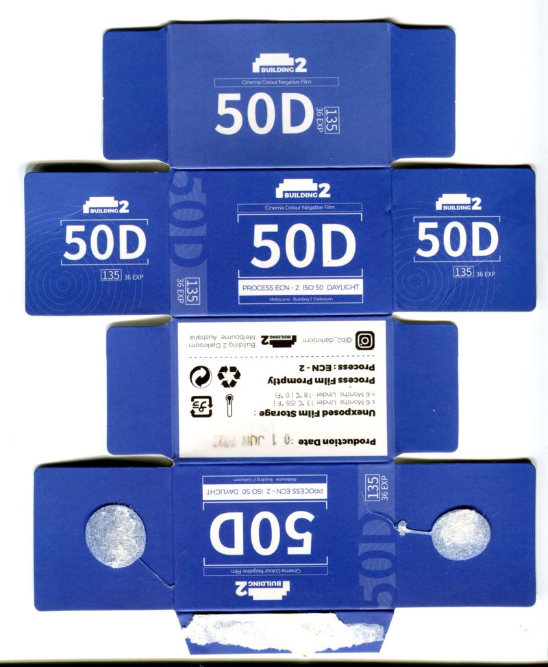
</a>

#### [35mm] CineStill 800T (ref: b3ff)

```
Format: 35mm         |  Process : C-41    
ISO   : 800          |  Expiry  : 2026-09 
Type  : Single Pack  |  Quantity: 36exp   
Added : 2025-07-22   |  Author  : @SirBrentsworth
UUID  : 81978ca6f6d048b3a759dffdb80fb3ff
```

<a href="./archive/00085_000.jpg">
	
</a>


`UUID: fbd9b946fd4d46f8a45a46112dcd16ae`‚Üì

<a href="./archive/00085_001.jpg">
	
</a>

#### [35mm] Efiniti UXi Super 200 (ref: 471a)

```
Format: 35mm         |  Process : C-41    
ISO   : 200          |  Expiry  : 2013-10 
Type  : Single Pack  |  Quantity: 36exp   
Added : 2025-01-04   |  Author  : dekuNukem
UUID  : cde1122dafbc47088a11d9ee12b6471a
```

<a href="./archive/00002_000.jpg">
	
</a>

#### [35mm] Ferrania Solaris (ref: a929)

```
Format: 35mm         |  Process : C-41    
ISO   : 200          |  Expiry  : Unknown 
Type  : Single Pack  |  Quantity: 36exp   
Added : 2025-08-20   |  Author  : @photos.by.qi
UUID  : 37936bef9f314a45b9ed57f7091fa929
```

<a href="./archive/00214_000.jpg">
	
</a>

#### [35mm] Film Never Die IRO (ref: 2a22)

```
Format: 35mm         |  Process : C-41    
ISO   : 400          |  Expiry  : 2022-05 
Type  : Single Pack  |  Quantity: 27exp   
Added : 2025-08-20   |  Author  : @photos.by.qi
UUID  : 03b12b9d23dc4e059a9149ca4f682a22
```

<a href="./archive/00215_000.jpg">
	
</a>

#### [35mm] Film Never Die Kiro (ref: 796d)

```
Format: 35mm         |  Process : C-41    
ISO   : 400          |  Expiry  : 2022-05 
Type  : Single Pack  |  Quantity: 27exp   
Added : 2025-08-20   |  Author  : @photos.by.qi
UUID  : a6bb919bc40b4000a753bf9d3367796d
```

<a href="./archive/00216_000.jpg">
	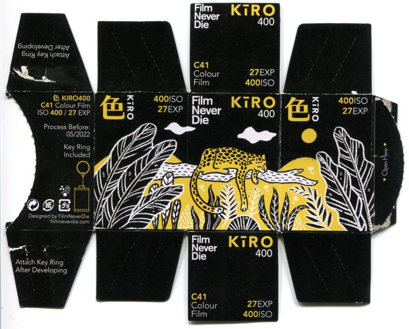
</a>

#### [35mm] Foma Fomapan (ref: 0030)

```
Format: 35mm         |  Process : BW      
ISO   : 100          |  Expiry  : 2027-07 
Type  : Single Pack  |  Quantity: 36exp   
Added : 2025-07-31   |  Author  : Pelicram
UUID  : bf1734a1ea48495d92afb7d03bdf0030
```

<a href="./archive/00129_000.jpg">
	
</a>


`UUID: 01adf7d0b4df41f990c60d5cafb7f55f`‚Üì

<a href="./archive/00129_001.jpg">
	
</a>

#### [35mm] Foma Fomapan (ref: 84a5)

```
Format: 35mm         |  Process : BW      
ISO   : 200          |  Expiry  : 2028-01 
Type  : Single Pack  |  Quantity: 36exp   
Added : 2025-07-28   |  Author  : lilyu.xyz
UUID  : c3d51159b481435b90dbe2411de784a5
```

<a href="./archive/00092_000.jpg">
	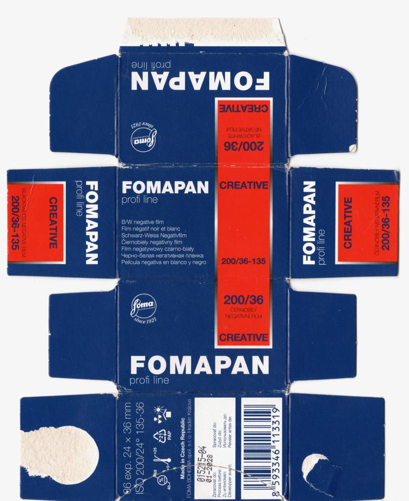
</a>


`UUID: ae13defc8e3d43e2988974430ea63335`‚Üì

<a href="./archive/00092_001.jpg">
	
</a>

#### [35mm] Foma Fomapan (ref: 60ee)

```
Format: 35mm         |  Process : BW      
ISO   : 200          |  Expiry  : 2028-05 
Type  : Bulk Roll    |  Quantity: 100ft   
Added : 2025-08-13   |  Author  : Pelicram
UUID  : 840026a068594c3389b34374204f60ee
```

<a href="./archive/00183_000.jpg">
	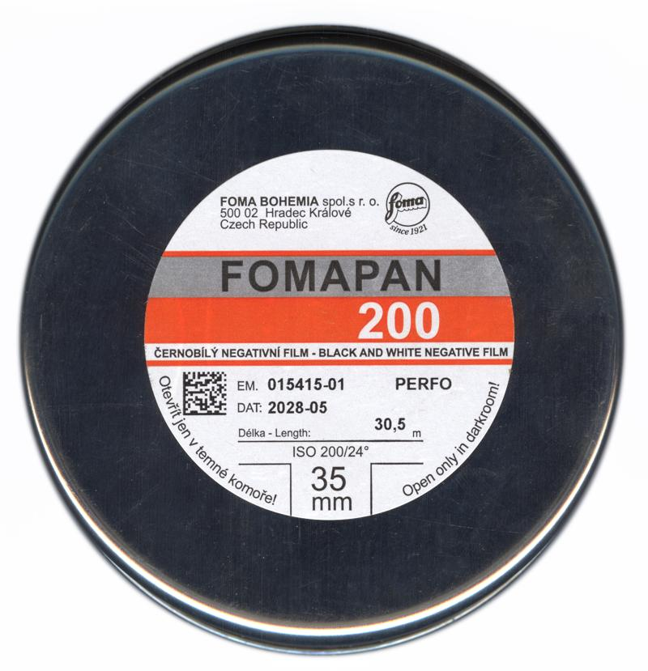
</a>

#### [35mm] Foma Ortho 400 (ref: c559)

```
Format: 35mm         |  Process : BW      
ISO   : 400          |  Expiry  : 2027-05 
Type  : Single Pack  |  Quantity: 36exp   
Added : 2025-08-15   |  Author  : Pelicram
UUID  : 676655ff95914769b0869d71d824c559
```

<a href="./archive/00187_000.jpg">
	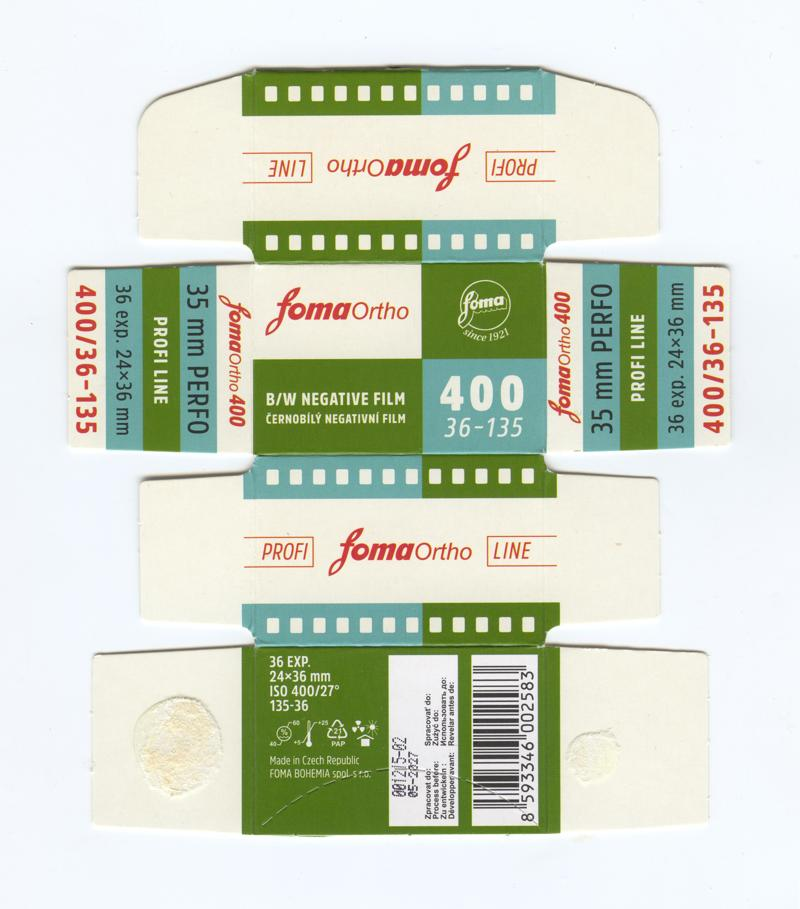
</a>


`UUID: 51e4fc9142fa45039f5d4a5d823f1ab5`‚Üì

<a href="./archive/00187_001.jpg">
	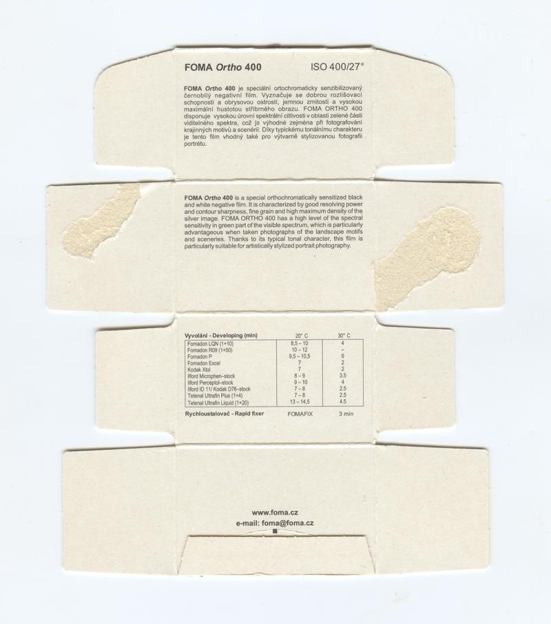
</a>

#### [35mm] Fujifilm 200 (ref: 5b41)

```
Format: 35mm         |  Process : C-41    
ISO   : 200          |  Expiry  : 2026-06 
Type  : Single Pack  |  Quantity: 36exp   
Added : 2025-06-05   |  Author  : Yrikonchik
UUID  : fe02d85cb9294ee2ba64e8543ce65b41
```

<a href="./archive/00073_000.jpg">
	
</a>

#### [35mm] Fujifilm 400 (ref: 82be)

```
Format: 35mm         |  Process : C-41    
ISO   : 400          |  Expiry  : 2025-08 
Type  : Single Pack  |  Quantity: 36exp   
Added : 2025-08-20   |  Author  : @photos.by.qi
UUID  : f3193ccd9b9d4a929904a6a2e8b682be
```

<a href="./archive/00222_000.jpg">
	
</a>

#### [35mm] Fujifilm Fujichrome 64T Type II Professional (ref: 74a1)

```
Format: 35mm         |  Process : E-6     
ISO   : 64           |  Expiry  : 2001-10 
Type  : Bulk Roll    |  Quantity: 100ft   
Added : 2025-08-14   |  Author  : Camera.Riley
UUID  : f3d8be37c34a4055823836987a0a74a1
```

<a href="./archive/00171_000.jpg">
	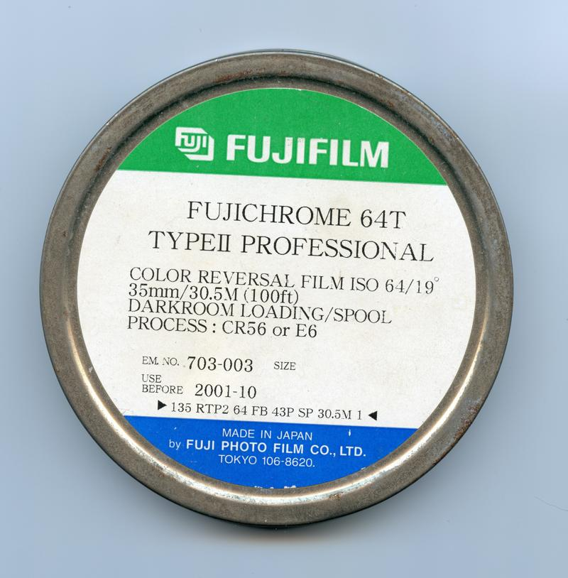
</a>

#### [35mm] Fujifilm Fujichrome Velvia (ref: 3182)

```
Format: 35mm         |  Process : E-6     
ISO   : 50           |  Expiry  : 2001-01 
Type  : Single Pack  |  Quantity: 36exp   
Added : 2025-01-14   |  Author  : @ob.skura
UUID  : 9b9ee1c1c0e94d968674987799d33182
```

<a href="./archive/00044_000.jpg">
	
</a>


`UUID: 2e2e20a0b57542e4908ad9fc825e7e76`‚Üì

<a href="./archive/00044_001.jpg">
	
</a>


`UUID: 03951cb49c8a44229aa4b5760744fc6f`‚Üì

<a href="./archive/00044_002.jpg">
	
</a>

#### [35mm] Fujifilm Fujicolor 100 (ref: 013b)

```
Format: 35mm         |  Process : C-41    
ISO   : 100          |  Expiry  : 2010-07 
Type  : Single Pack  |  Quantity: 12exp   
Added : 2025-01-12   |  Author  : b0baspace
UUID  : 27d88b35933b4ede958b5b5b5b42013b
```

<a href="./archive/00040_000.jpg">
	
</a>

#### [35mm] Fujifilm Fujicolor 100 (ref: b3c9)

```
Format: 35mm         |  Process : C-41    
ISO   : 100          |  Expiry  : 2025-09 
Type  : Single Pack  |  Quantity: 36exp   
Added : 2025-08-20   |  Author  : @photos.by.qi
UUID  : ac13f69474544179a4a2513e8641b3c9
```

<a href="./archive/00217_000.jpg">
	
</a>

#### [35mm] Fujifilm Fujicolor C200 (ref: 2ff8)

```
Format: 35mm         |  Process : C-41    
ISO   : 200          |  Expiry  : 2020-03 
Type  : Single Pack  |  Quantity: 36exp   
Added : 2025-08-18   |  Author  : @recycling.film
UUID  : 271054727291471392db72d5556f2ff8
```

<a href="./archive/00202_000.jpg">
	
</a>

#### [35mm] Fujifilm Fujicolor C200 (ref: a0de)

```
Format: 35mm         |  Process : C-41    
ISO   : 200          |  Expiry  : 2023-10 
Type  : Multi-Pack-2 |  Quantity: 36exp   
Added : 2025-08-20   |  Author  : @photos.by.qi
UUID  : b290e4b860364420924596fc3330a0de
```

<a href="./archive/00220_000.jpg">
	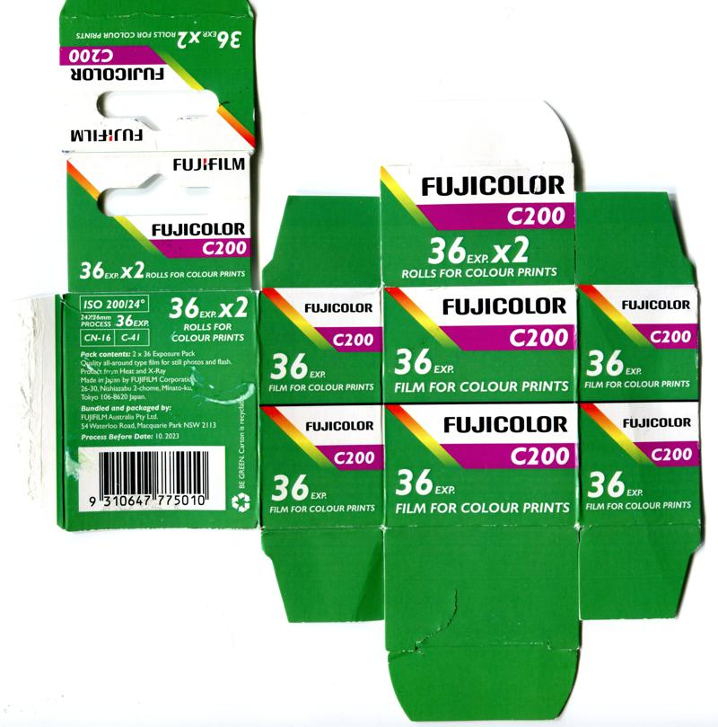
</a>

#### [35mm] Fujifilm Fujicolor Natura 1600 (ref: 2e06)

```
Format: 35mm         |  Process : C-41    
ISO   : 1600         |  Expiry  : 2014-11 
Type  : Multi-Pack-3 |  Quantity: 36exp   
Added : 2025-08-14   |  Author  : Camera.Riley
UUID  : 8abda51b18d84ec4939df489457d2e06
```

<a href="./archive/00177_000.jpg">
	
</a>


`UUID: 85bc1b0ff9694798a9f92915ab267978`‚Üì

<a href="./archive/00177_001.jpg">
	
</a>


`UUID: dd126451b04a42b19a705cec886addf0`‚Üì

<a href="./archive/00177_002.jpg">
	
</a>

#### [35mm] Fujifilm Fujicolor Professional (ref: 28da)

```
Format: 35mm         |  Process : C-41    
ISO   : 100          |  Expiry  : 2012-02 
Type  : Single Pack  |  Quantity: 24exp   
Added : 2025-07-31   |  Author  : The Compartmentalist
UUID  : cb85af928a7f454e9673960e22b428da
```

<a href="./archive/00117_000.jpg">
	
</a>

#### [35mm] Fujifilm Fujicolor Professional (ref: 02f7)

```
Format: 35mm         |  Process : C-41    
ISO   : 400          |  Expiry  : 2019-12 
Type  : Single Pack  |  Quantity: 36exp   
Added : 2025-08-20   |  Author  : @photos.by.qi
UUID  : 8f934c948478459386443596e74c02f7
```

<a href="./archive/00219_000.jpg">
	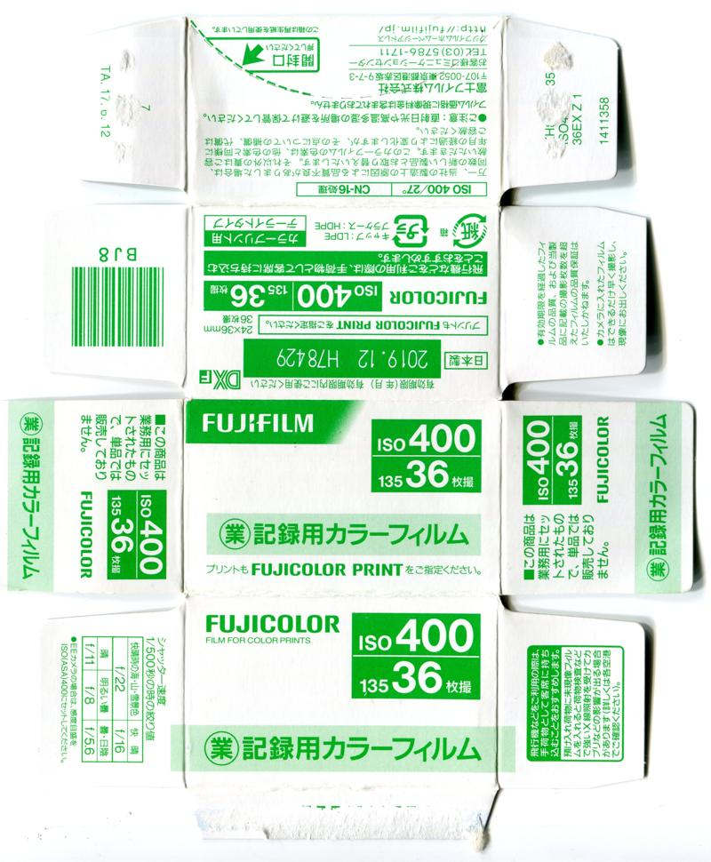
</a>

#### [35mm] Fujifilm Fujicolor Super HG (ref: ee94)

```
Format: 35mm         |  Process : C-41    
ISO   : 100          |  Expiry  : 1994-07 
Type  : Single Pack  |  Quantity: 36exp   
Added : 2025-07-31   |  Author  : stefanie
UUID  : 9233714654ff481089c2d4ff1334ee94
```

<a href="./archive/00150_000.jpg">
	
</a>


`UUID: 302969081f4442239212b8e123d38378`‚Üì

<a href="./archive/00150_001.jpg">
	
</a>

#### [35mm] Fujifilm Fujicolor Super HR (ref: aaa0)

```
Format: 35mm         |  Process : C-41    
ISO   : 200          |  Expiry  : 1990-02 
Type  : Single Pack  |  Quantity: 36exp   
Added : 2025-01-04   |  Author  : dekuNukem
UUID  : 2d27c9a865aa4de19ad8dc0bcdc8aaa0
```

<a href="./archive/00007_000.jpg">
	
</a>


`UUID: a179b7257aaf455fa69df546545457f6`‚Üì

<a href="./archive/00007_001.jpg">
	
</a>


`UUID: e5688fcb7e8943a987ca6b882275ca7b`‚Üì

<a href="./archive/00007_002.jpg">
	
</a>

#### [35mm] Fujifilm Fujicolor Superia (ref: d1b7)

```
Format: 35mm         |  Process : C-41    
ISO   : 200          |  Expiry  : 2000-07 
Type  : Multi-Pack-3 |  Quantity: 24exp   
Added : 2025-07-31   |  Author  : Pelicram
UUID  : 2b50b3d82a7340ffbe9bff871793d1b7
```

<a href="./archive/00139_000.jpg">
	
</a>


`UUID: a193a13c20a24dada68357552593974f`‚Üì

<a href="./archive/00139_001.jpg">
	
</a>

#### [35mm] Fujifilm NPS 160 (ref: 5e85)

```
Format: 35mm         |  Process : C-41    
ISO   : 160          |  Expiry  : 2003-08 
Type  : Single Pack  |  Quantity: 36exp   
Added : 2025-02-04   |  Author  : b0baspace
UUID  : 576142521c2f4fe5abc387032bcc5e85
```

<a href="./archive/00053_000.jpg">
	
</a>


`UUID: a11cf7e8abea41a8854da816157269c4`‚Üì

<a href="./archive/00053_001.jpg">
	
</a>

#### [35mm] Fujifilm Neopan SS Rapid (ref: 9db3)

```
Format: 35mm         |  Process : BW      
ISO   : 100          |  Expiry  : 1975-02 
Type  : Single Pack  |  Quantity: 12exp   
Added : 2025-07-31   |  Author  : The Compartmentalist
UUID  : 1c541b4c837944d788eab8986f349db3
```

<a href="./archive/00118_000.jpg">
	
</a>

#### [35mm] Fujifilm Provia 100F (ref: 356d)

```
Format: 35mm         |  Process : E-6     
ISO   : 100          |  Expiry  : 2020-09 
Type  : Single Pack  |  Quantity: 36exp   
Added : 2025-02-21   |  Author  : @seklerek
UUID  : a3603dbdd8ca49b893c8ce2bc76f356d
```

<a href="./archive/00055_000.jpg">
	
</a>

#### [35mm] Fujifilm Provia 100F (ref: df27)

```
Format: 35mm         |  Process : E-6     
ISO   : 100          |  Expiry  : 2026-10 
Type  : Single Pack  |  Quantity: 36exp   
Added : 2025-08-07   |  Author  : The Compartmentalist
UUID  : 480a75f9978b4fba84c81a8a9e95df27
```

<a href="./archive/00167_000.jpg">
	
</a>

#### [35mm] Fujifilm Sensia (ref: a59b)

```
Format: 35mm         |  Process : E-6     
ISO   : 100          |  Expiry  : 1998-01 
Type  : Single Pack  |  Quantity: 36exp   
Added : 2025-07-31   |  Author  : The Compartmentalist
UUID  : d4fdfa0d829f4fcab984381a31f2a59b
```

<a href="./archive/00116_000.jpg">
	
</a>


`UUID: 4f21cef93ed3401caed74619ffa2b595`‚Üì

<a href="./archive/00116_001.jpg">
	
</a>

#### [35mm] Fujifilm Superia (ref: 9272)

```
Format: 35mm         |  Process : C-41    
ISO   : 200          |  Expiry  : 2003-07 
Type  : Multi-Pack-2 |  Quantity: 36exp   
Added : 2025-08-20   |  Author  : @photos.by.qi
UUID  : 2acd2ce4aefb44b4a4c72b130edb9272
```

<a href="./archive/00229_000.jpg">
	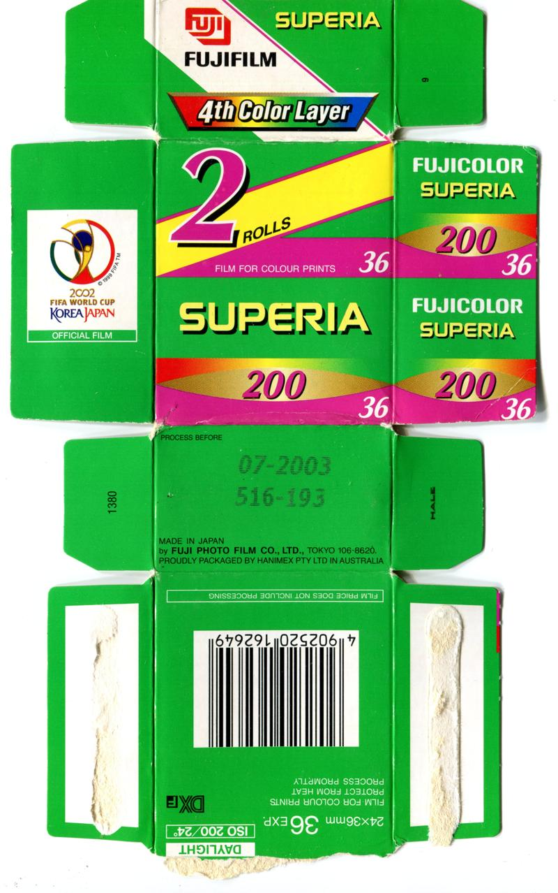
</a>

#### [35mm] Fujifilm Superia (ref: 0d8e)

```
Format: 35mm         |  Process : C-41    
ISO   : 200          |  Expiry  : 2009-06 
Type  : Single Pack  |  Quantity: 36exp   
Added : 2025-08-18   |  Author  : @recycling.film
UUID  : a57061210f17463fae293851f2130d8e
```

<a href="./archive/00199_000.jpg">
	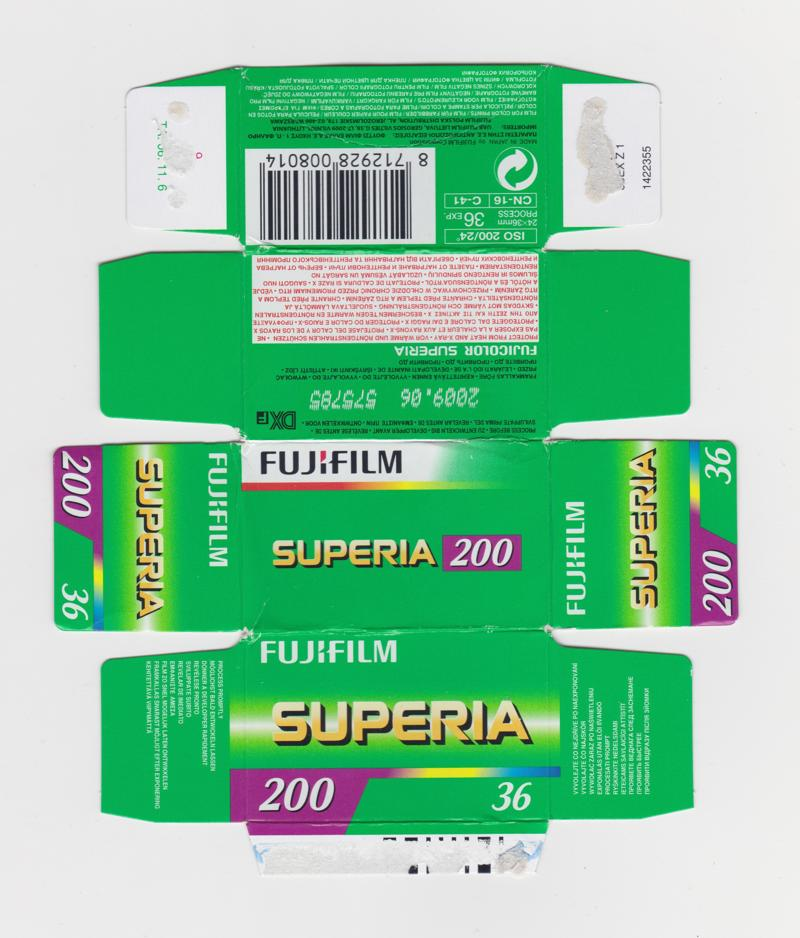
</a>

#### [35mm] Fujifilm Superia Reala (ref: a7de)

```
Format: 35mm         |  Process : C-41    
ISO   : 100          |  Expiry  : 2007-04 
Type  : Single Pack  |  Quantity: 36exp   
Added : 2025-07-28   |  Author  : @recycling.film
UUID  : bab5fa204b25431a9872c4ce8e9aa7de
```

<a href="./archive/00087_000.jpg">
	
</a>

#### [35mm] Fujifilm Superia Reala (ref: a624)

```
Format: 35mm         |  Process : C-41    
ISO   : 100          |  Expiry  : 2010-04 
Type  : Single Pack  |  Quantity: 36exp   
Added : 2025-08-20   |  Author  : @photos.by.qi
UUID  : 47af4374c1474eb3b20cb1894b43a624
```

<a href="./archive/00230_000.jpg">
	
</a>

#### [35mm] Fujifilm Superia X-TRA (ref: 713b)

```
Format: 35mm         |  Process : C-41    
ISO   : 400          |  Expiry  : 2003-04 
Type  : Single Pack  |  Quantity: 24exp   
Added : 2025-08-18   |  Author  : @recycling.film
UUID  : 89750d8a18fe4e238c76b97b4578713b
```

<a href="./archive/00197_000.jpg">
	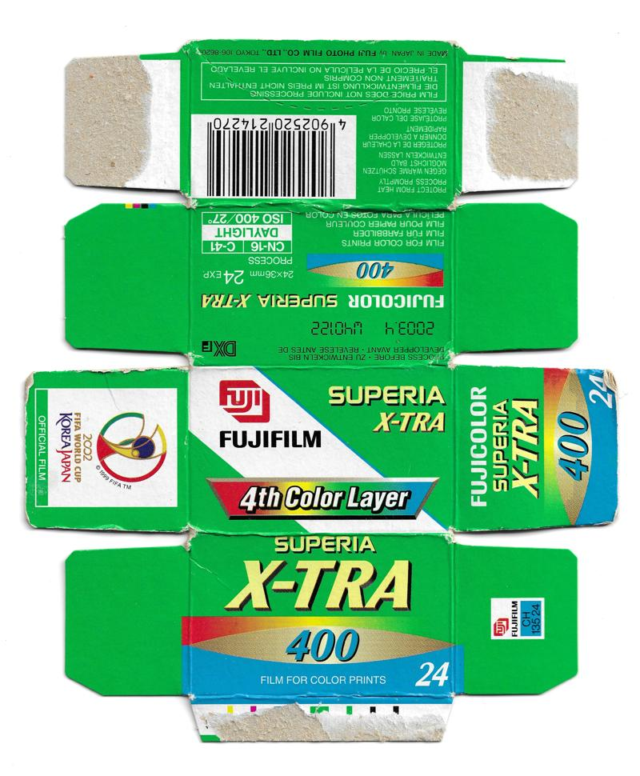
</a>


`UUID: 560832b2cfff4e60930fd3116f1ccffc`‚Üì

<a href="./archive/00197_001.jpg">
	
</a>

#### [35mm] Fujifilm Superia X-TRA (ref: 0446)

```
Format: 35mm         |  Process : C-41    
ISO   : 400          |  Expiry  : 2005-02 
Type  : Multi-Pack-3 |  Quantity: 24exp   
Added : 2025-08-20   |  Author  : @photos.by.qi
UUID  : 16351828954846229e7a4ca1193d0446
```

<a href="./archive/00232_000.jpg">
	
</a>

#### [35mm] Fujifilm Superia X-TRA (ref: 8923)

```
Format: 35mm         |  Process : C-41    
ISO   : 400          |  Expiry  : 2024-08 
Type  : Multi-Pack-2 |  Quantity: 36exp   
Added : 2025-08-20   |  Author  : @photos.by.qi
UUID  : de6b17f5230e4052b6b166977a418923
```

<a href="./archive/00231_000.jpg">
	
</a>

#### [35mm] Fujifilm Superia X-TRA (ref: 6b8a)

```
Format: 35mm         |  Process : C-41    
ISO   : 400          |  Expiry  : 2026-01 
Type  : Single Pack  |  Quantity: 36exp   
Added : 2025-08-07   |  Author  : @Hol.m35
UUID  : 64b5e2e7f9a841d2a99c8f1bd8766b8a
```

<a href="./archive/00165_000.jpg">
	
</a>

#### [35mm] Fujifilm Velvia 100F (ref: 32d4)

```
Format: 35mm         |  Process : E-6     
ISO   : 100          |  Expiry  : 2007-03 
Type  : Single Pack  |  Quantity: 36exp   
Added : 2025-02-21   |  Author  : @seklerek
UUID  : ce5c1d786286427ba5633091b06432d4
```

<a href="./archive/00056_000.jpg">
	
</a>

#### [35mm] Hands On Film Midnight 1600 (ref: 4411)

```
Format: 35mm         |  Process : C-41    
ISO   : 1600         |  Expiry  : 2026-05 
Type  : Single Pack  |  Quantity: 36exp   
Added : 2025-08-19   |  Author  : @ellafridalindblom
UUID  : 515a9a246a8e4eed87d77142623a4411
```

<a href="./archive/00206_000.jpg">
	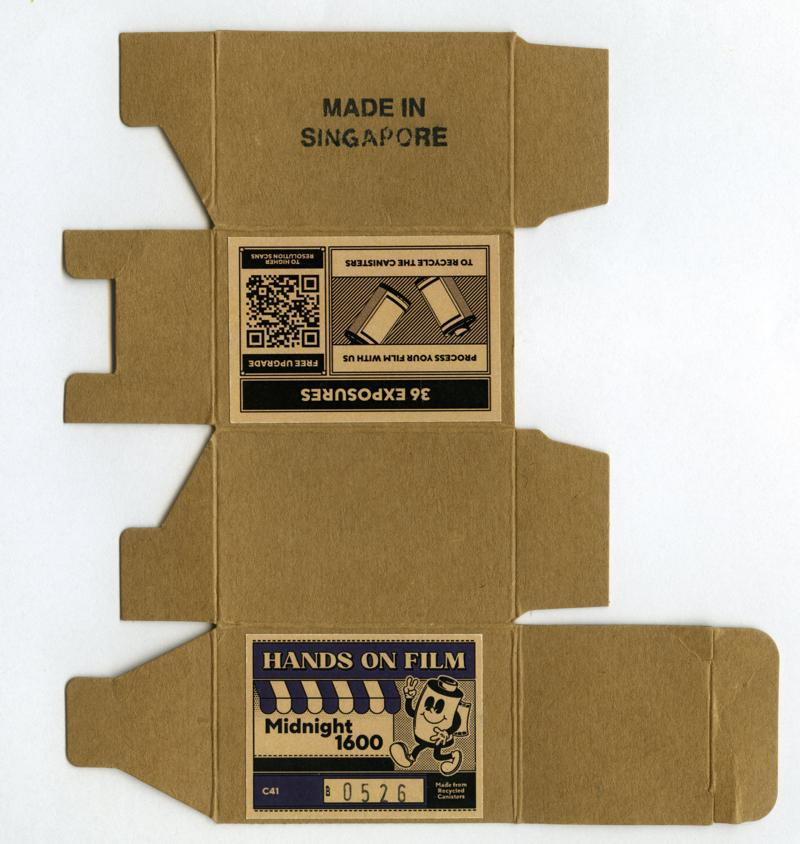
</a>

#### [35mm] Harman Phoenix (ref: 8eb4)

```
Format: 35mm         |  Process : C-41    
ISO   : 200          |  Expiry  : 2025-12 
Type  : Single Pack  |  Quantity: 36exp   
Added : 2025-06-25   |  Author  : yc128   
UUID  : 2fe522ef01b84a9aa6263807135f8eb4
```

<a href="./archive/00076_000.jpg">
	
</a>


`UUID: a7a70b20b4224baeb85c732245eb31d1`‚Üì

<a href="./archive/00076_001.jpg">
	
</a>

#### [35mm] Harman Phoenix II (ref: 40df)

```
Format: 35mm         |  Process : C-41    
ISO   : 200          |  Expiry  : 2027-06 
Type  : Single Pack  |  Quantity: 36exp   
Added : 2025-07-30   |  Author  : yc128   
UUID  : f12ed23e31e14008a969fe05f29940df
```

<a href="./archive/00110_000.jpg">
	
</a>


`UUID: b6dcbe9ae6ea4aebabaf290f3160a553`‚Üì

<a href="./archive/00110_001.jpg">
	
</a>

#### [35mm] Hazenfilm Sorolla Chrome (ref: 889f)

```
Format: 35mm         |  Process : E-6     
ISO   : 100          |  Expiry  : 2026-08 
Type  : Single Pack  |  Quantity: 36exp   
Added : 2025-07-31   |  Author  : Pelicram
UUID  : 462e32d45cd740cf866732a73a00889f
```

<a href="./archive/00137_000.jpg">
	
</a>

#### [35mm] Hope Film Bubble (ref: 41f4)

```
Format: 35mm         |  Process : C-41    
ISO   : 200          |  Expiry  : 2026-12 
Type  : Single Pack  |  Quantity: 24exp   
Added : 2025-08-06   |  Author  : @Hol.m35
UUID  : b09848420a1a4d76b099d82d76bc41f4
```

<a href="./archive/00164_000.jpg">
	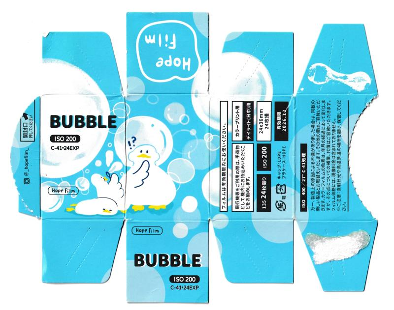
</a>

#### [35mm] Ilford Delta 3200 (ref: 9b54)

```
Format: 35mm         |  Process : BW      
ISO   : 3200         |  Expiry  : 2027-06 
Type  : Single Pack  |  Quantity: 36exp   
Added : 2025-07-31   |  Author  : Pelicram
UUID  : d6f377dbe74745a0aacdf51ce7669b54
```

<a href="./archive/00126_000.jpg">
	
</a>


`UUID: 3921b5a404564bb2b4231bf59d22e6d3`‚Üì

<a href="./archive/00126_001.jpg">
	
</a>

#### [35mm] Ilford HP5 Plus (ref: c725)

```
Format: 35mm         |  Process : BW      
ISO   : 400          |  Expiry  : 2022-08 
Type  : Single Pack  |  Quantity: 36exp   
Added : 2025-07-28   |  Author  : @recycling.film
UUID  : fcbc3377fa3d4ca9b58779f86ed7c725
```

<a href="./archive/00090_000.jpg">
	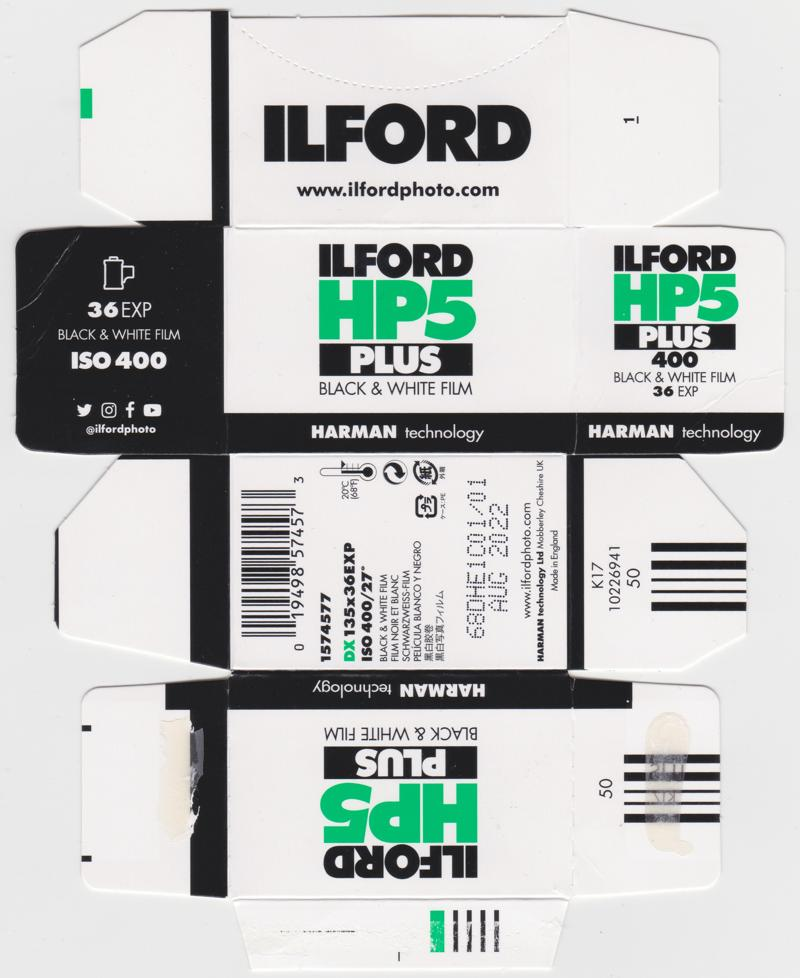
</a>

#### [35mm] Ilford HP5 Plus (ref: df49)

```
Format: 35mm         |  Process : BW      
ISO   : 400          |  Expiry  : 2028-06 
Type  : Single Pack  |  Quantity: 36exp   
Added : 2025-07-22   |  Author  : @SirBrentsworth
UUID  : 8db6d8343d544c21bfd539c32525df49
```

<a href="./archive/00083_000.jpg">
	
</a>


`UUID: aa635d75717e4083a0ab53a0c2e1b892`‚Üì

<a href="./archive/00083_001.jpg">
	
</a>

#### [35mm] Ilford XP2 Super (ref: 622a)

```
Format: 35mm         |  Process : C-41    
ISO   : 400          |  Expiry  : 2027-09 
Type  : Single Pack  |  Quantity: 36exp   
Added : 2025-08-08   |  Author  : TheSelousScout
UUID  : 5863564ab1ef43a4b41fb5312dd0622a
```

<a href="./archive/00170_000.jpg">
	
</a>


`UUID: 2e9c0e4f84414bb192512b4ce5b1e212`‚Üì

<a href="./archive/00170_001.jpg">
	
</a>

#### [35mm] JCH Streetpan (ref: 6e58)

```
Format: 35mm         |  Process : BW      
ISO   : 400          |  Expiry  : 2025-02 
Type  : Single Pack  |  Quantity: 36exp   
Added : 2025-07-31   |  Author  : Pelicram
UUID  : 1873b4d20d2a47659ab15d0af4146e58
```

<a href="./archive/00132_000.jpg">
	
</a>


`UUID: 19dfce255f604980b0f596b8895d923f`‚Üì

<a href="./archive/00132_001.jpg">
	
</a>

#### [35mm] Kentmere PAN 100 (ref: c907)

```
Format: 35mm         |  Process : BW      
ISO   : 100          |  Expiry  : 2028-11 
Type  : Single Pack  |  Quantity: 24exp   
Added : 2025-07-22   |  Author  : @SirBrentsworth
UUID  : c4c934a23c59430f8b99c71a9322c907
```

<a href="./archive/00082_000.jpg">
	
</a>


`UUID: c91fc253637a47dc8507a7dab7d38475`‚Üì

<a href="./archive/00082_001.jpg">
	
</a>

#### [35mm] Kentmere PAN 200 (ref: 0e32)

```
Format: 35mm         |  Process : BW      
ISO   : 200          |  Expiry  : 2030-04 
Type  : Single Pack  |  Quantity: 36exp   
Added : 2025-08-15   |  Author  : Pelicram
UUID  : b0e988456d7444b1b879dc6ca4a80e32
```

<a href="./archive/00186_000.jpg">
	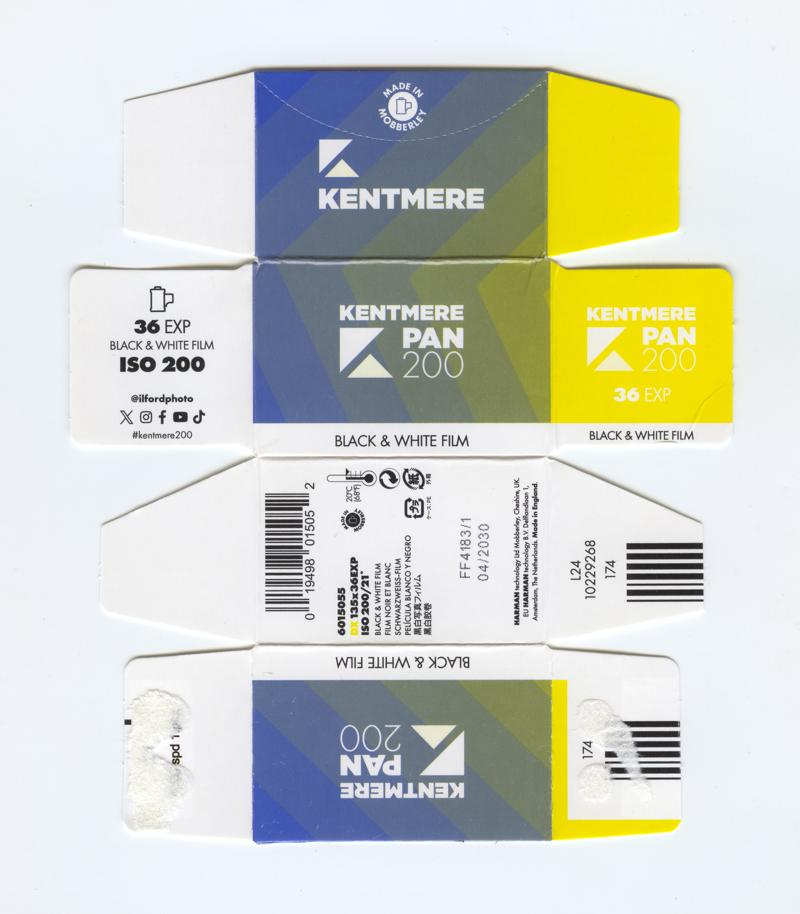
</a>

#### [35mm] Kentmere PAN 400 (ref: d223)

```
Format: 35mm         |  Process : BW      
ISO   : 400          |  Expiry  : 2026-09 
Type  : Single Pack  |  Quantity: 36exp   
Added : 2025-05-24   |  Author  : dekuNukem
UUID  : e876f866f1e9430494356ad098c7d223
```

<a href="./archive/00058_000.jpg">
	
</a>


`UUID: ecc653f10f124afe9b4225edb7e06587`‚Üì

<a href="./archive/00058_001.jpg">
	
</a>

#### [35mm] Kentmere PAN 400 (ref: 827e)

```
Format: 35mm         |  Process : BW      
ISO   : 400          |  Expiry  : 2029-06 
Type  : Single Pack  |  Quantity: 36exp   
Added : 2025-01-04   |  Author  : dekuNukem
UUID  : d2cf9753f6fd49a78404c72d848a827e
```

<a href="./archive/00015_000.jpg">
	
</a>


`UUID: 3514628a650741c8abb104047d809f55`‚Üì

<a href="./archive/00015_001.jpg">
	
</a>

#### [35mm] Kentmere PAN 400 (ref: a327)

```
Format: 35mm         |  Process : BW      
ISO   : 400          |  Expiry  : 2029-07 
Type  : Single Pack  |  Quantity: 24exp   
Added : 2025-07-31   |  Author  : Pelicram
UUID  : 58f2bea3a3204a1dafebf2881d99a327
```

<a href="./archive/00145_000.jpg">
	
</a>


`UUID: c771fff8ecbb4c9b981f3606dd4fa428`‚Üì

<a href="./archive/00145_001.jpg">
	
</a>

#### [35mm] Kirkland Signature Color Print Film (ref: 0441)

```
Format: 35mm         |  Process : C-41    
ISO   : 200          |  Expiry  : 2002-12 
Type  : Single Pack  |  Quantity: 24exp   
Added : 2025-08-15   |  Author  : @ad.astra.per.aspera.1894
UUID  : 7f4a0fbd6be7494ab097f7f816700441
```

<a href="./archive/00184_000.jpg">
	
</a>

#### [35mm] Kodak Black & White + (ref: 2ff3)

```
Format: 35mm         |  Process : C-41    
ISO   : 400          |  Expiry  : 2004-07 
Type  : Single Pack  |  Quantity: 24exp   
Added : 2025-08-16   |  Author  : Kraksen 
UUID  : 8ae6d75c042c48318fa711a412b72ff3
```

<a href="./archive/00189_000.jpg">
	
</a>

#### [35mm] Kodak ColorPlus (ref: 79ca)

```
Format: 35mm         |  Process : C-41    
ISO   : 200          |  Expiry  : 2025-08 
Type  : Single Pack  |  Quantity: 36exp   
Added : 2025-07-22   |  Author  : @SirBrentsworth
UUID  : 087223fc24654e3882a4596e3cea79ca
```

<a href="./archive/00084_000.jpg">
	
</a>

#### [35mm] Kodak ColorPlus (ref: 6637)

```
Format: 35mm         |  Process : C-41    
ISO   : 200          |  Expiry  : 2026-08 
Type  : Single Pack  |  Quantity: 36exp   
Added : 2025-07-28   |  Author  : @recycling.film
UUID  : bd00cd25958d4108a7501bf4be9d6637
```

<a href="./archive/00091_000.jpg">
	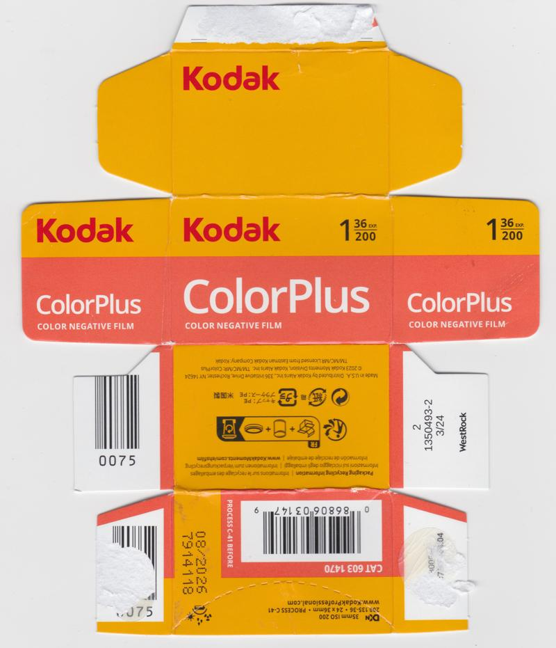
</a>

#### [35mm] Kodak Ektachrome 100 Plus (ref: 5d9f)

```
Format: 35mm         |  Process : E-6     
ISO   : 100          |  Expiry  : 2002-08 
Type  : Single Pack  |  Quantity: 36exp   
Added : 2025-07-31   |  Author  : toader  
UUID  : b17b7b46926e49ae88a7b74904245d9f
```

<a href="./archive/00113_000.jpg">
	
</a>


`UUID: 1ac536af04e3459fa3389050a3c93bee`‚Üì

<a href="./archive/00113_001.jpg">
	
</a>

#### [35mm] Kodak Ektachrome 200 (ref: b21e)

```
Format: 35mm         |  Process : E-6     
ISO   : 200          |  Expiry  : 1992-10 
Type  : Single Pack  |  Quantity: 36exp   
Added : 2025-02-04   |  Author  : b0baspace
UUID  : 7d8346073bbe4d6a84e57cc2bb28b21e
```

<a href="./archive/00052_000.jpg">
	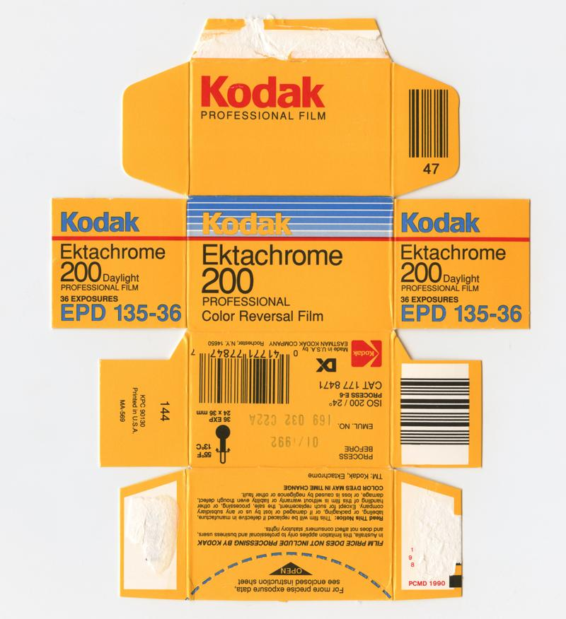
</a>


`UUID: cbae471aa4184cbeabc5b1f8b49f8943`‚Üì

<a href="./archive/00052_001.jpg">
	
</a>


`UUID: c6c1d49626e14661a700da5b26e07ca8`‚Üì

<a href="./archive/00052_002.jpg">
	
</a>

#### [35mm] Kodak Ektachrome 400 (ref: 3c96)

```
Format: 35mm         |  Process : E-6     
ISO   : 400          |  Expiry  : 1990-11 
Type  : Single Pack  |  Quantity: 24exp   
Added : 2025-07-29   |  Author  : Nano_Burger
UUID  : 2330da9237ad4dbaac0028199f363c96
```

<a href="./archive/00100_000.jpg">
	
</a>


`UUID: c8ecef6f805d4a7eab60f82855687e17`‚Üì

<a href="./archive/00100_001.jpg">
	
</a>

#### [35mm] Kodak Ektachrome 64T (ref: 8f4f)

```
Format: 35mm         |  Process : E-6     
ISO   : 64           |  Expiry  : 1998-10 
Type  : Bulk Roll    |  Quantity: 100ft   
Added : 2025-08-14   |  Author  : Camera.Riley
UUID  : 25961b13fd6943a9b7dd77b2eba18f4f
```

<a href="./archive/00180_000.jpg">
	
</a>


`UUID: 78441115e27d4fe8a442ce240ec160ef`‚Üì

<a href="./archive/00180_001.jpg">
	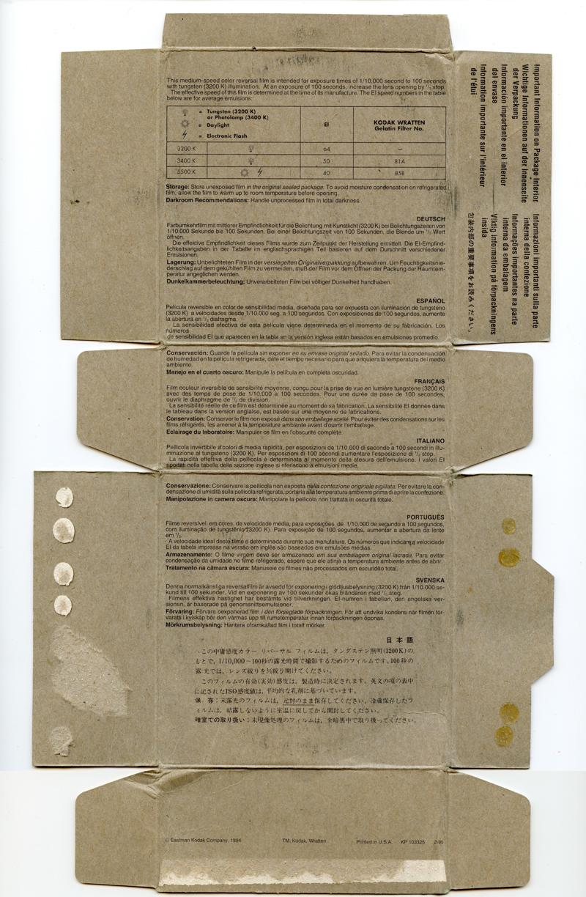
</a>

#### [35mm] Kodak Ektachrome E100 (ref: 94ff)

```
Format: 35mm         |  Process : E-6     
ISO   : 100          |  Expiry  : 2024-12 
Type  : Single Pack  |  Quantity: 36exp   
Added : 2025-08-20   |  Author  : @photos.by.qi
UUID  : 1d1d6ca155874b6dba4333cf6f6194ff
```

<a href="./archive/00223_000.jpg">
	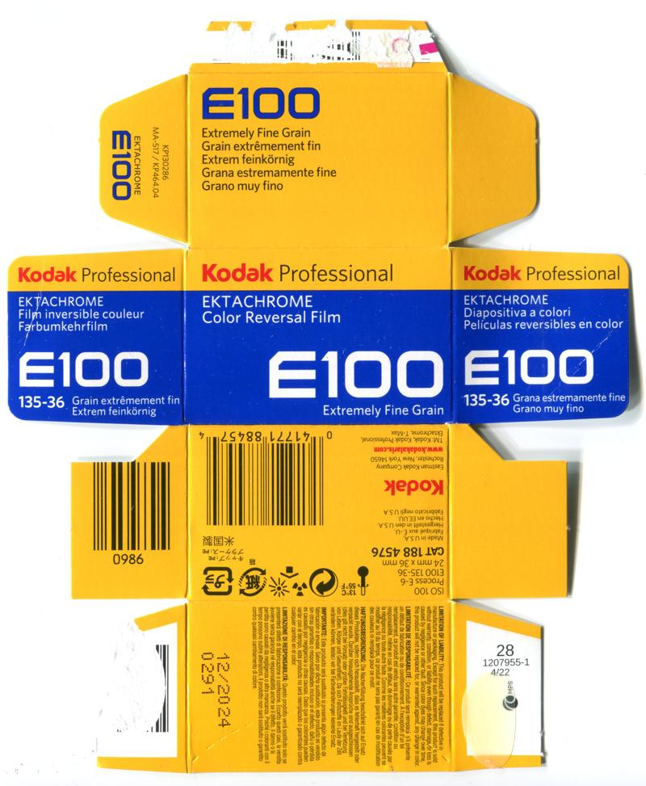
</a>

#### [35mm] Kodak Ektachrome E100 (ref: ae10)

```
Format: 35mm         |  Process : E-6     
ISO   : 100          |  Expiry  : 2027-02 
Type  : Single Pack  |  Quantity: 36exp   
Added : 2025-08-02   |  Author  : toader  
UUID  : 829cd9dd98cd489f8bff71e403c1ae10
```

<a href="./archive/00155_000.jpg">
	
</a>

#### [35mm] Kodak Ektachrome Elite 100 (ref: 26ef)

```
Format: 35mm         |  Process : E-6     
ISO   : 100          |  Expiry  : 1995-11 
Type  : Single Pack  |  Quantity: 24exp   
Added : 2025-07-31   |  Author  : toader  
UUID  : 175cf2b69fe3413093d9d7f9ea0d26ef
```

<a href="./archive/00114_000.jpg">
	
</a>


`UUID: 89d1b19f3e364f55adc2523a07ed9ddb`‚Üì

<a href="./archive/00114_001.jpg">
	
</a>

#### [35mm] Kodak Ektachrome Slide Duplicating Film (ref: d53a)

```
Format: 35mm         |  Process : E-6     
ISO   : Unknown      |  Expiry  : 1999-12 
Type  : Single Pack  |  Quantity: 36exp   
Added : 2025-08-19   |  Author  : @ellafridalindblom
UUID  : 59aa1c52cf434a60976debe684a3d53a
```

<a href="./archive/00203_000.jpg">
	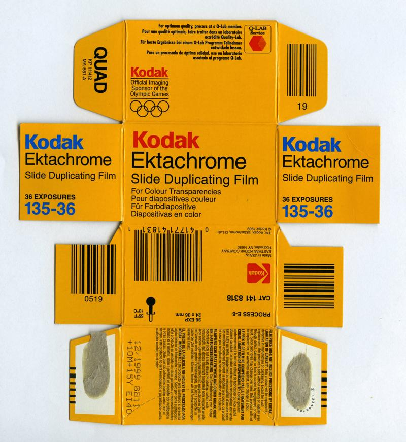
</a>


`UUID: a15217b7a9c34d25a71276e952a8dce0`‚Üì

<a href="./archive/00203_001.jpg">
	
</a>


`UUID: 70ffb21210374c97a9fa3b819e9b3a1a`‚Üì

<a href="./archive/00203_002.jpg">
	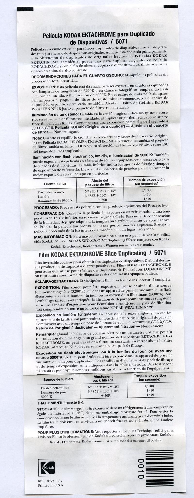
</a>

#### [35mm] Kodak Ektachrome-X (ref: aec5)

```
Format: 35mm         |  Process : E-4     
ISO   : 64           |  Expiry  : 1973-06 
Type  : Single Pack  |  Quantity: 20exp   
Added : 2025-07-31   |  Author  : The Compartmentalist
UUID  : 6a81b1428cfe46c8b9cf187fb672aec5
```

<a href="./archive/00119_000.jpg">
	
</a>

#### [35mm] Kodak Ektar 100 (ref: 95ec)

```
Format: 35mm         |  Process : C-41    
ISO   : 100          |  Expiry  : 2024-01 
Type  : Single Pack  |  Quantity: 36exp   
Added : 2025-08-20   |  Author  : @photos.by.qi
UUID  : eef92f5fa5b244518890b1ba52b895ec
```

<a href="./archive/00224_000.jpg">
	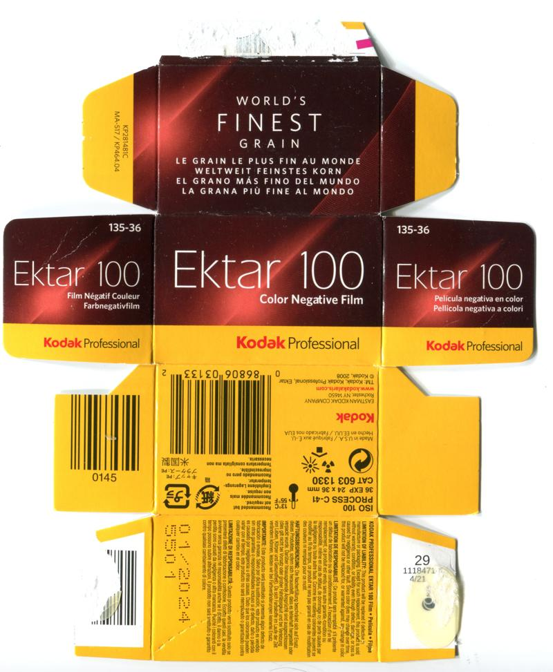
</a>

#### [35mm] Kodak Ektar 100 (ref: 3498)

```
Format: 35mm         |  Process : C-41    
ISO   : 100          |  Expiry  : 2026-09 
Type  : Single Pack  |  Quantity: 36exp   
Added : 2025-07-22   |  Author  : @SirBrentsworth
UUID  : 8552091a80a844a5aec3e9b8185e3498
```

<a href="./archive/00081_000.jpg">
	
</a>

#### [35mm] Kodak Elite Chrome (ref: 523c)

```
Format: 35mm         |  Process : E-6     
ISO   : 100          |  Expiry  : 2001-08 
Type  : Single Pack  |  Quantity: 36exp   
Added : 2025-01-14   |  Author  : @ob.skura
UUID  : e0b3ec957ade47a99d5cd5abe2a4523c
```

<a href="./archive/00042_000.jpg">
	
</a>

#### [35mm] Kodak Elite Chrome (ref: 3943)

```
Format: 35mm         |  Process : E-6     
ISO   : 400          |  Expiry  : 2007-10 
Type  : Single Pack  |  Quantity: 24exp   
Added : 2025-08-14   |  Author  : Camera.Riley
UUID  : c9ba81252c5f438ca70922a2b5703943
```

<a href="./archive/00178_000.jpg">
	
</a>


`UUID: 7c1650085c4146e0bec821475e25219f`‚Üì

<a href="./archive/00178_001.jpg">
	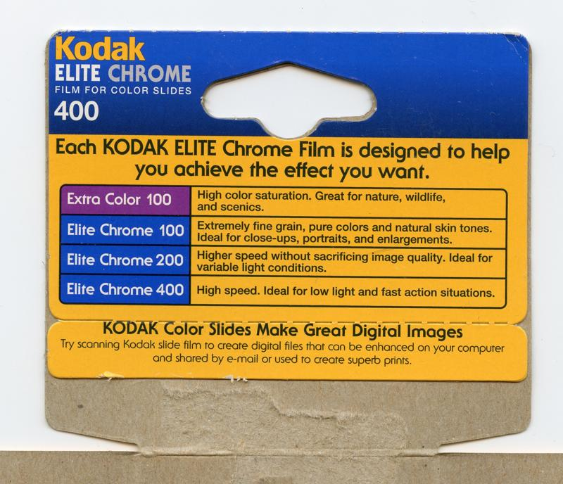
</a>

#### [35mm] Kodak Gold (ref: 2f8d)

```
Format: 35mm         |  Process : C-41    
ISO   : 100          |  Expiry  : 1999-05 
Type  : Single Pack  |  Quantity: 36exp   
Added : 2025-07-31   |  Author  : stefanie
UUID  : c56f944bf87d40dcac75cf41aeb82f8d
```

<a href="./archive/00149_000.jpg">
	
</a>

#### [35mm] Kodak Gold (ref: ea58)

```
Format: 35mm         |  Process : C-41    
ISO   : 100          |  Expiry  : 2001-10 
Type  : Multi-Pack-3 |  Quantity: 36exp   
Added : 2025-07-28   |  Author  : lilyu.xyz
UUID  : e45118f7bd5e4ae682e5747a81f0ea58
```

<a href="./archive/00095_000.jpg">
	
</a>


`UUID: 86ebec2c1a1d41359d84654d24dbac69`‚Üì

<a href="./archive/00095_001.jpg">
	
</a>

#### [35mm] Kodak Gold (ref: d48d)

```
Format: 35mm         |  Process : C-41    
ISO   : 200          |  Expiry  : 2023-06 
Type  : Single Pack  |  Quantity: 36exp   
Added : 2025-08-20   |  Author  : @photos.by.qi
UUID  : e0db5edb5d3046e99d019b901088d48d
```

<a href="./archive/00233_000.jpg">
	
</a>

#### [35mm] Kodak Gold (ref: 3e7f)

```
Format: 35mm         |  Process : C-41    
ISO   : 200          |  Expiry  : 2026-06 
Type  : Single Pack  |  Quantity: 36exp   
Added : 2025-07-22   |  Author  : @SirBrentsworth
UUID  : d2e434e91001465dbea2d815d5e23e7f
```

<a href="./archive/00080_000.jpg">
	
</a>

#### [35mm] Kodak Gold (ref: 855e)

```
Format: 35mm         |  Process : C-41    
ISO   : 200          |  Expiry  : 2027-04 
Type  : Multi-Pack-3 |  Quantity: 36exp   
Added : 2025-07-22   |  Author  : @SirBrentsworth
UUID  : 856af2ca15fd4a0bad0df6eb29a2855e
```

<a href="./archive/00086_000.jpg">
	
</a>

#### [35mm] Kodak Gold Ultra 400 (ref: 1358)

```
Format: 35mm         |  Process : C-41    
ISO   : 400          |  Expiry  : 2001-01 
Type  : Multi-Pack-2 |  Quantity: 24exp   
Added : 2025-07-28   |  Author  : lilyu.xyz
UUID  : c2dc7711cd38434da5cfea8750f61358
```

<a href="./archive/00094_000.jpg">
	
</a>


`UUID: 1501f7eec7f34d3788b6c7b94a4134df`‚Üì

<a href="./archive/00094_001.jpg">
	
</a>

#### [35mm] Kodak High Contrast Copy Film (ref: db52)

```
Format: 35mm         |  Process : BW      
ISO   : Unknown      |  Expiry  : 1970-09 
Type  : Bulk Roll    |  Quantity: 100ft   
Added : 2025-08-14   |  Author  : Camera.Riley
UUID  : 7a518ce06cc242f9a5af067c1ffedb52
```

<a href="./archive/00181_000.jpg">
	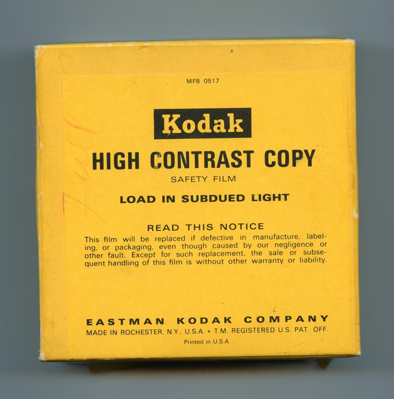
</a>


`UUID: c18af4a6fe504e6bab7aaa0cdccb02a1`‚Üì

<a href="./archive/00181_001.jpg">
	
</a>


`UUID: 312da1e64f2f416f9b394ea7e4e34e86`‚Üì

<a href="./archive/00181_002.jpg">
	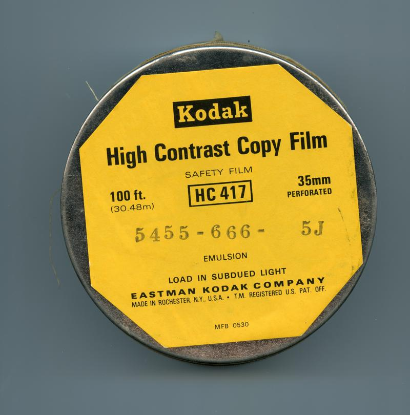
</a>


`UUID: 917cdc09fdc9435c90eb61f470def180`‚Üì

<a href="./archive/00181_003.jpg">
	
</a>

#### [35mm] Kodak High Speed Ektachrome (ref: ec3d)

```
Format: 35mm         |  Process : E-4     
ISO   : 160          |  Expiry  : 1970-06 
Type  : Single Pack  |  Quantity: 36exp   
Added : 2025-01-14   |  Author  : @ob.skura
UUID  : 9702189f65de43c59fce151094a7ec3d
```

<a href="./archive/00045_000.jpg">
	
</a>


`UUID: 1fc1082f5b524367820b31b7669e86cd`‚Üì

<a href="./archive/00045_001.jpg">
	
</a>


`UUID: 6b248d300438476aa38c9b6bce04fc87`‚Üì

<a href="./archive/00045_002.jpg">
	
</a>

#### [35mm] Kodak High Speed Ektachrome (ref: b8f8)

```
Format: 35mm         |  Process : E-4     
ISO   : 125          |  Expiry  : 1977-01 
Type  : Single Pack  |  Quantity: 36exp   
Added : 2025-07-29   |  Author  : Henry Gunn
UUID  : 86470a73e4b5436b97ffb272be6bb8f8
```

<a href="./archive/00107_000.jpg">
	
</a>


`UUID: 6d7d9f75f74b4caebbb7a7c6e27c663b`‚Üì

<a href="./archive/00107_001.jpg">
	
</a>


`UUID: e582ca2ca6ec44e49e9d9e96a56b930e`‚Üì

<a href="./archive/00107_002.jpg">
	
</a>

#### [35mm] Kodak High Speed Infrared (ref: 4294)

```
Format: 35mm         |  Process : BW      
ISO   : 80           |  Expiry  : 1990-03 
Type  : Single Pack  |  Quantity: 36exp   
Added : 2025-07-29   |  Author  : Nano_Burger
UUID  : 7b611fc399af469a80ac1a0124c84294
```

<a href="./archive/00102_000.jpg">
	
</a>


`UUID: 5cdb927687974c8db4458239ed9a09b4`‚Üì

<a href="./archive/00102_001.jpg">
	
</a>


`UUID: 1058c3167209457aac0f4336c911c8b3`‚Üì

<a href="./archive/00102_002.jpg">
	
</a>

#### [35mm] Kodak High Speed Infrared (ref: 883e)

```
Format: 35mm         |  Process : BW      
ISO   : 80           |  Expiry  : 2008-10 
Type  : Single Pack  |  Quantity: 36exp   
Added : 2025-07-29   |  Author  : Nano_Burger
UUID  : 77352e93d73748eca98cff7b30d7883e
```

<a href="./archive/00103_000.jpg">
	
</a>


`UUID: 5667abf6f7f04edba88137bd54153841`‚Üì

<a href="./archive/00103_001.jpg">
	
</a>

#### [35mm] Kodak Kodachrome 25 (ref: 6477)

```
Format: 35mm         |  Process : K-14    
ISO   : 25           |  Expiry  : 1978-01 
Type  : Single Pack  |  Quantity: 20exp   
Added : 2025-01-05   |  Author  : dekuNukem
UUID  : 483191da2aa742bba3343cbe9f296477
```

<a href="./archive/00035_000.jpg">
	
</a>


`UUID: 71a9b098894d4f00a8006ba4b37783b8`‚Üì

<a href="./archive/00035_001.jpg">
	
</a>


`UUID: 547384566f7d4aff89c18059a11e7f0b`‚Üì

<a href="./archive/00035_002.jpg">
	
</a>


`UUID: a64a927ad3a348ae9eeb445a9725acfa`‚Üì

<a href="./archive/00035_003.jpg">
	
</a>


`UUID: 754d321490a3453981be592ac6221b8d`‚Üì

<a href="./archive/00035_004.jpg">
	
</a>

#### [35mm] Kodak Kodachrome 25 (ref: 8833)

```
Format: 35mm         |  Process : K-14    
ISO   : 25           |  Expiry  : 1983-03 
Type  : Single Pack  |  Quantity: 36exp   
Added : 2025-07-31   |  Author  : The Compartmentalist
UUID  : 6239a04366d74208a9010cd231688833
```

<a href="./archive/00121_000.jpg">
	
</a>

#### [35mm] Kodak Kodachrome 64 (ref: 3206)

```
Format: 35mm         |  Process : K-14    
ISO   : 64           |  Expiry  : 2007-05 
Type  : Single Pack  |  Quantity: 36exp   
Added : 2025-05-24   |  Author  : dekuNukem
UUID  : dc9c151b87de48339e564e6692663206
```

<a href="./archive/00060_000.jpg">
	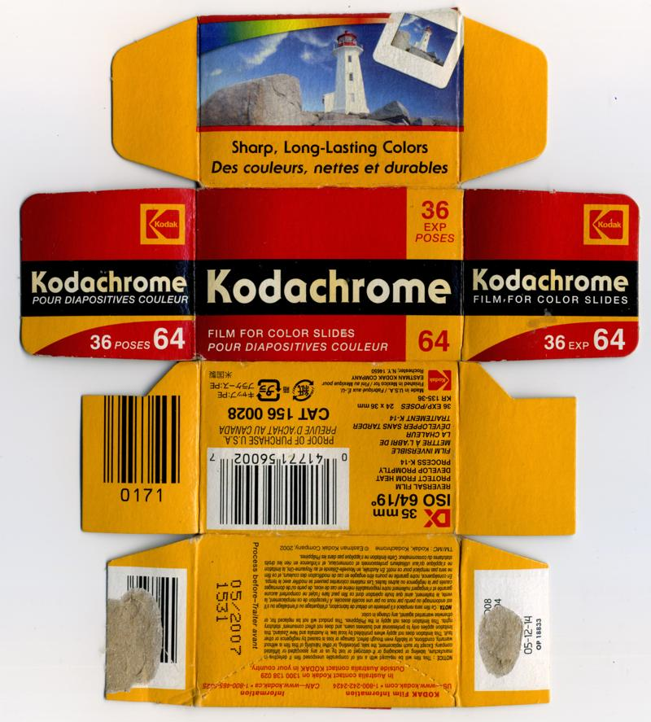
</a>

#### [35mm] Kodak Kodacolor VR (ref: 035f)

```
Format: 35mm         |  Process : C-41    
ISO   : 200          |  Expiry  : 1987-06 
Type  : Single Pack  |  Quantity: 36exp   
Added : 2025-07-28   |  Author  : @ftfilmphotos
UUID  : a26daa2cb6e44957af3d978bc67e035f
```

<a href="./archive/00097_000.jpg">
	
</a>


`UUID: 185225c336bc491683c7a1806458c4e8`‚Üì

<a href="./archive/00097_001.jpg">
	
</a>

#### [35mm] Kodak Kodacolor VR Plus (ref: f8bf)

```
Format: 35mm         |  Process : C-41    
ISO   : 400          |  Expiry  : 2012-03 
Type  : Multi-Pack-2 |  Quantity: 36exp   
Added : 2025-07-31   |  Author  : stefanie
UUID  : faf0a44eece541a9b701feb772f4f8bf
```

<a href="./archive/00153_000.jpg">
	
</a>

#### [35mm] Kodak MAX (ref: 2361)

```
Format: 35mm         |  Process : C-41    
ISO   : 400          |  Expiry  : 2007-03 
Type  : Multi-Pack-3 |  Quantity: 24exp   
Added : 2025-08-20   |  Author  : @photos.by.qi
UUID  : 5d0c054ebc17452397de86653bf42361
```

<a href="./archive/00234_000.jpg">
	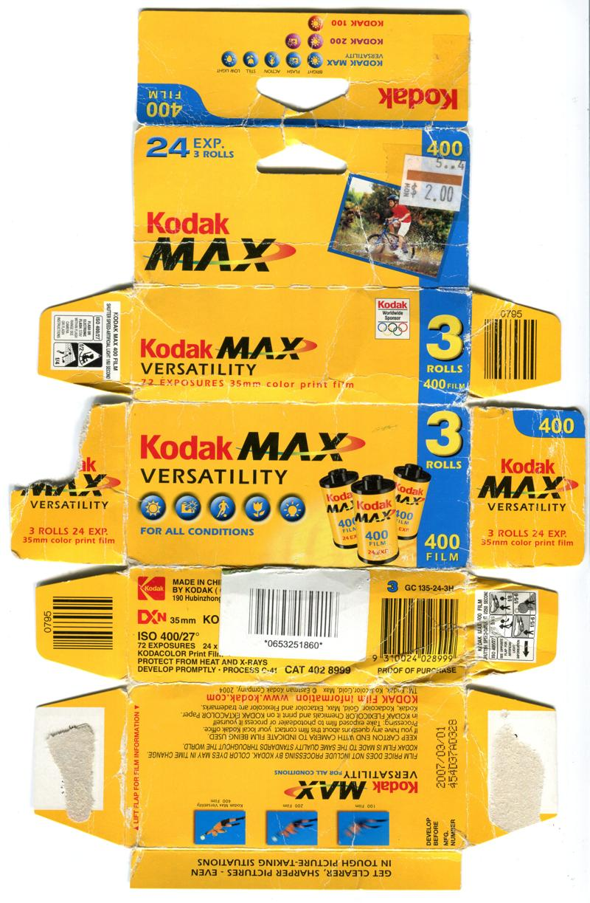
</a>

#### [35mm] Kodak Panatomic-X (ref: 8d69)

```
Format: 35mm         |  Process : BW      
ISO   : 32           |  Expiry  : 1976-12 
Type  : Bulk Roll    |  Quantity: 100ft   
Added : 2025-08-16   |  Author  : u/ReeeSchmidtyWerber
UUID  : 386384f6be954ddc8ab42f3bcb1d8d69
```

<a href="./archive/00193_000.jpg">
	
</a>

#### [35mm] Kodak Panatomic-X (ref: 35f6)

```
Format: 35mm         |  Process : BW      
ISO   : 32           |  Expiry  : 1977013 
Type  : Single Pack  |  Quantity: 20exp   
Added : 2025-08-16   |  Author  : u/ReeeSchmidtyWerber
UUID  : 475b6bf4c66141b48fc73ace756435f6
```

<a href="./archive/00192_000.jpg">
	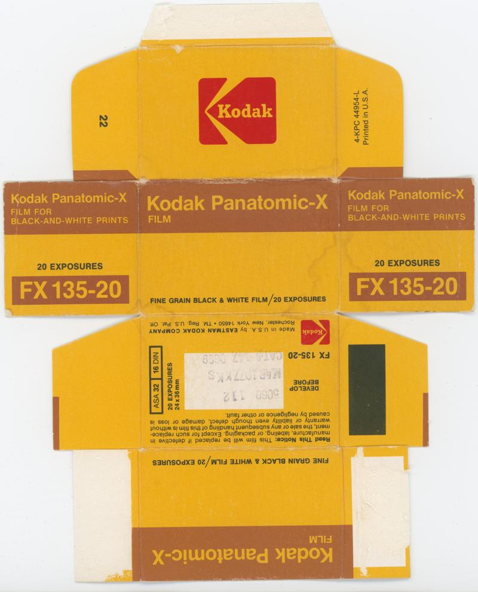
</a>


`UUID: 662f12bfdc864efb861dd9ede2973332`‚Üì

<a href="./archive/00192_001.jpg">
	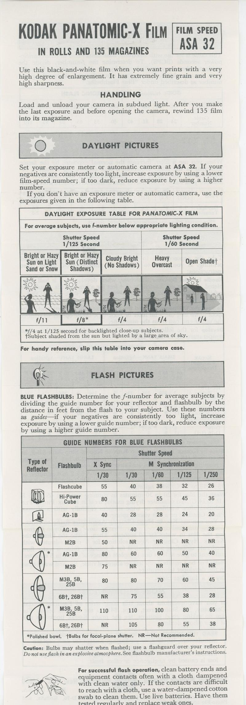
</a>


`UUID: 85fea329b0a34765987a30d8a728a8e0`‚Üì

<a href="./archive/00192_002.jpg">
	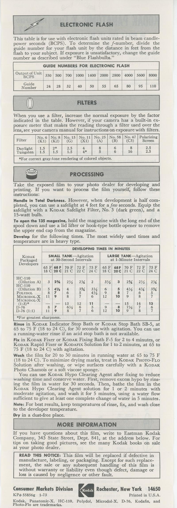
</a>

#### [35mm] Kodak Portra 160 (ref: ce56)

```
Format: 35mm         |  Process : C-41    
ISO   : 160          |  Expiry  : 2013-08 
Type  : Multi-Pack-5 |  Quantity: 36exp   
Added : 2025-07-28   |  Author  : @recycling.film
UUID  : 9131fb90db70475dbad5f63f1448ce56
```

<a href="./archive/00089_000.jpg">
	
</a>

#### [35mm] Kodak Portra 400 (ref: cf9c)

```
Format: 35mm         |  Process : C-41    
ISO   : 400          |  Expiry  : 2014-06 
Type  : Multi-Pack-5 |  Quantity: 36exp   
Added : 2025-08-18   |  Author  : @recycling.film
UUID  : 5bdddffe29bd464cab4630d85485cf9c
```

<a href="./archive/00200_000.jpg">
	
</a>

#### [35mm] Kodak Portra 400VC (ref: 7669)

```
Format: 35mm         |  Process : C-41    
ISO   : 400          |  Expiry  : 2009-04 
Type  : Multi-Pack-5 |  Quantity: 36exp   
Added : 2025-08-20   |  Author  : @photos.by.qi
UUID  : 2152a58cb08c463ea298a61858ff7669
```

<a href="./archive/00242_000.jpg">
	
</a>

#### [35mm] Kodak Portra 800 (ref: 7d65)

```
Format: 35mm         |  Process : C-41    
ISO   : 800          |  Expiry  : 2025-06 
Type  : Single Pack  |  Quantity: 36exp   
Added : 2025-07-28   |  Author  : @recycling.film
UUID  : 7ebac9d7fb8c4ff9b7fbabcaec1d7d65
```

<a href="./archive/00088_000.jpg">
	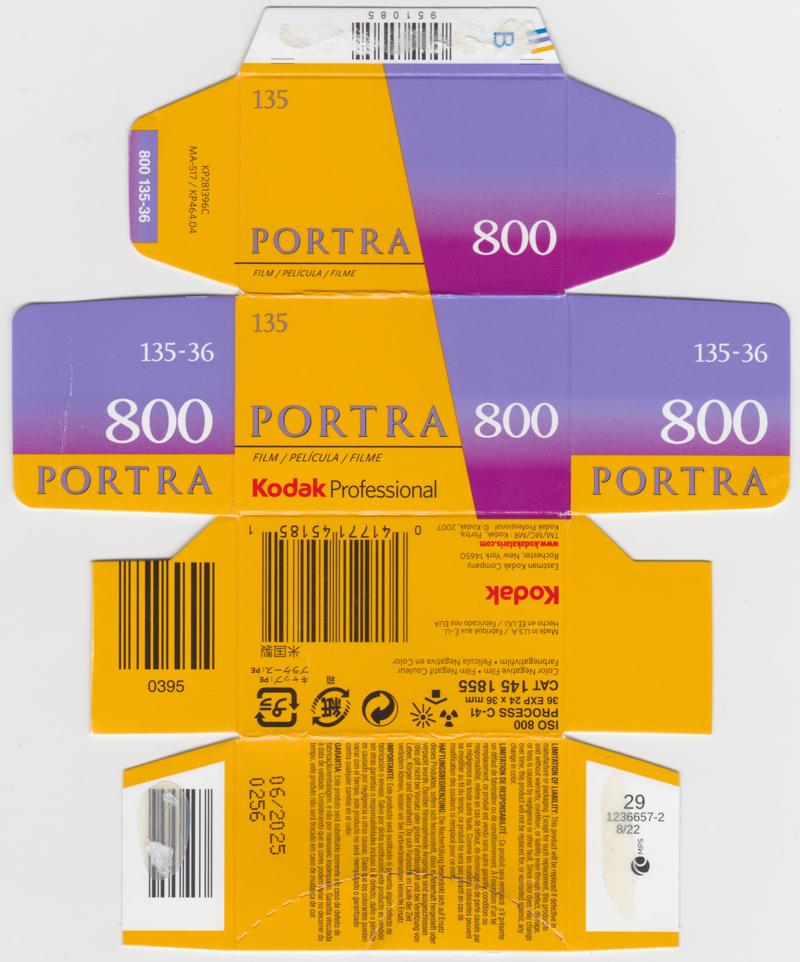
</a>

#### [35mm] Kodak ProImage 100 (ref: fe32)

```
Format: 35mm         |  Process : C-41    
ISO   : 100          |  Expiry  : 2023-01 
Type  : Multi-Pack-5 |  Quantity: 36exp   
Added : 2025-08-20   |  Author  : @photos.by.qi
UUID  : 76cf680b7e1a407f92eb84541d21fe32
```

<a href="./archive/00239_000.jpg">
	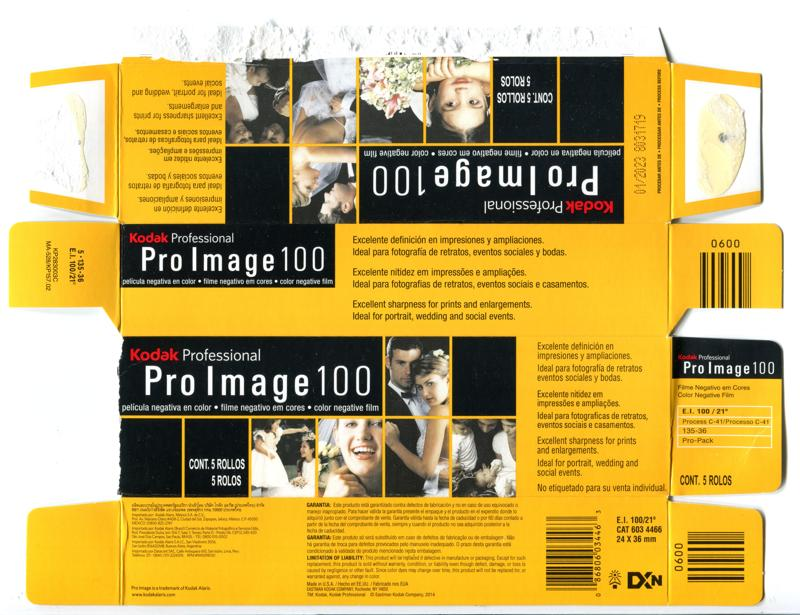
</a>

#### [35mm] Kodak Professional Microfilm Type I (ref: a444)

```
Format: 35mm         |  Process : BW      
ISO   : Unknown      |  Expiry  : 2013-12 
Type  : Bulk Roll    |  Quantity: 100ft   
Added : 2025-08-14   |  Author  : Camera.Riley
UUID  : 90304019395a4c62bb9c6fe1cb2ba444
```

<a href="./archive/00172_000.jpg">
	
</a>

#### [35mm] Kodak Rapid Process Copy Film (ref: e66e)

```
Format: 35mm         |  Process : BW      
ISO   : 0.06         |  Expiry  : 2000-06 
Type  : Single Pack  |  Quantity: 36exp   
Added : 2025-07-29   |  Author  : Nano_Burger
UUID  : 396a3645cb9a40a4b0a6dd2fd854e66e
```

<a href="./archive/00105_000.jpg">
	
</a>


`UUID: bab6cc70d0044171a1afcf33b6cb5556`‚Üì

<a href="./archive/00105_001.jpg">
	
</a>


`UUID: fc2e102fecae4f2dbd04fd341fdb7afd`‚Üì

<a href="./archive/00105_002.jpg">
	
</a>

#### [35mm] Kodak TMAX P3200 (ref: 1dff)

```
Format: 35mm         |  Process : BW      
ISO   : 3200         |  Expiry  : 1991-07 
Type  : Single Pack  |  Quantity: 36exp   
Added : 2025-07-29   |  Author  : Nano_Burger
UUID  : 9e4ea1efa5a54938985fdf8901951dff
```

<a href="./archive/00104_000.jpg">
	
</a>


`UUID: b9d1b08379d9482bbc799101f6881f12`‚Üì

<a href="./archive/00104_001.jpg">
	
</a>


`UUID: a6740f1fc4df4b80a8a4dee83a26c04b`‚Üì

<a href="./archive/00104_002.jpg">
	
</a>

#### [35mm] Kodak TMAX P3200 (ref: 521a)

```
Format: 35mm         |  Process : BW      
ISO   : 3200         |  Expiry  : 2026-04 
Type  : Single Pack  |  Quantity: 36exp   
Added : 2025-07-31   |  Author  : Pelicram
UUID  : 39fa3ae0251e4cdbaf8240602537521a
```

<a href="./archive/00144_000.jpg">
	
</a>

#### [35mm] Kodak TMAX P3200 (ref: 43a2)

```
Format: 35mm         |  Process : BW      
ISO   : 3200         |  Expiry  : 2026-08 
Type  : Single Pack  |  Quantity: 36exp   
Added : 2025-07-31   |  Author  : Pelicram
UUID  : 8f91948e930f491a8684337e32d443a2
```

<a href="./archive/00142_000.jpg">
	
</a>

#### [35mm] Kodak Technical Pan (ref: f4cf)

```
Format: 35mm         |  Process : BW      
ISO   : 25           |  Expiry  : 1995-04 
Type  : Bulk Roll    |  Quantity: 150ft   
Added : 2025-07-29   |  Author  : Nano_Burger
UUID  : e65b4252384141028ee037892c6bf4cf
```

<a href="./archive/00106_000.jpg">
	
</a>


`UUID: fd713c7576534f62832529c13f74996b`‚Üì

<a href="./archive/00106_001.jpg">
	
</a>

#### [35mm] Kodak Tri-X 400 (ref: c671)

```
Format: 35mm         |  Process : BW      
ISO   : 400          |  Expiry  : 2026-09 
Type  : Single Pack  |  Quantity: 36exp   
Added : 2025-07-31   |  Author  : Pelicram
UUID  : 0417faf4f5be42538db49741140bc671
```

<a href="./archive/00135_000.jpg">
	
</a>

#### [35mm] Kodak Ultra (ref: 69a1)

```
Format: 35mm         |  Process : C-41    
ISO   : 400          |  Expiry  : 2005-12 
Type  : Single Pack  |  Quantity: 24exp   
Added : 2025-01-14   |  Author  : @ob.skura
UUID  : 77dfbdf80e3a4950b40c7ea8c1e369a1
```

<a href="./archive/00043_000.jpg">
	
</a>

#### [35mm] Kodak UltraMax (ref: 3b23)

```
Format: 35mm         |  Process : C-41    
ISO   : 400          |  Expiry  : 2023-03 
Type  : Multi-Pack-3 |  Quantity: 24exp   
Added : 2025-08-20   |  Author  : @photos.by.qi
UUID  : 1a68334cdfc146b98a7fa95672e33b23
```

<a href="./archive/00235_000.jpg">
	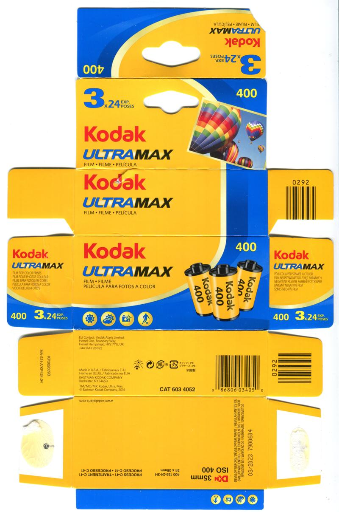
</a>

#### [35mm] Kodak UltraMax (ref: 3c02)

```
Format: 35mm         |  Process : C-41    
ISO   : 400          |  Expiry  : 2024-12 
Type  : Single Pack  |  Quantity: 36exp   
Added : 2025-08-20   |  Author  : @photos.by.qi
UUID  : 05d59d140f584adcaf97f6acb69f3c02
```

<a href="./archive/00241_000.jpg">
	
</a>


`UUID: 6ed0486400df45eab9b7465642ecee9d`‚Üì

<a href="./archive/00241_001.jpg">
	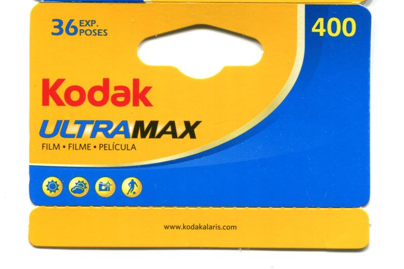
</a>

#### [35mm] Kodak UltraMax (ref: e4ad)

```
Format: 35mm         |  Process : C-41    
ISO   : 400          |  Expiry  : 2026-07 
Type  : Single Pack  |  Quantity: 24exp   
Added : 2025-08-18   |  Author  : @recycling.film
UUID  : d14bbf440f3a4ac9aa4169c8bba7e4ad
```

<a href="./archive/00201_000.jpg">
	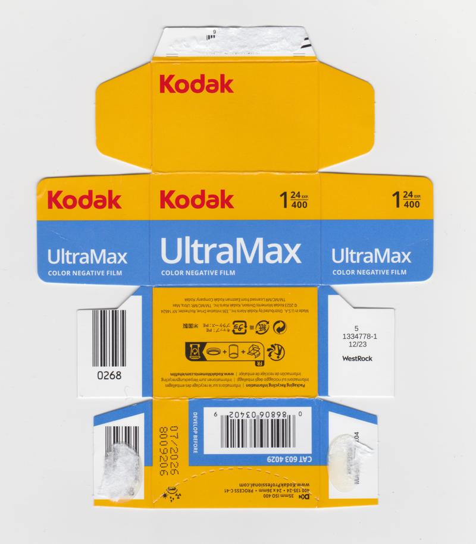
</a>

#### [35mm] Kodak UltraMax (ref: aaa6)

```
Format: 35mm         |  Process : C-41    
ISO   : 400          |  Expiry  : 2027-03 
Type  : Single Pack  |  Quantity: 36exp   
Added : 2025-07-22   |  Author  : @SirBrentsworth
UUID  : 8b0e255948ad4bbc8689d371569caaa6
```

<a href="./archive/00079_000.jpg">
	
</a>

#### [35mm] Kodak Värikuvafilmi (ref: f9ff)

```
Format: 35mm         |  Process : C-41    
ISO   : 200          |  Expiry  : 2001-12 
Type  : Multi-Pack-2 |  Quantity: 24exp   
Added : 2025-07-31   |  Author  : Pelicram
UUID  : b8795d19697a453c8f27fde773eaf9ff
```

<a href="./archive/00146_000.jpg">
	
</a>

#### [35mm] Konica Konica Color II (ref: fb5b)

```
Format: 35mm         |  Process : C-41    
ISO   : 100          |  Expiry  : 1985-01 
Type  : Bulk Roll    |  Quantity: 110ft   
Added : 2025-08-14   |  Author  : Camera.Riley
UUID  : 34d91c79c1704ac49f5376ca6424fb5b
```

<a href="./archive/00173_000.jpg">
	
</a>

#### [35mm] Konica VX200 (ref: fe53)

```
Format: 35mm         |  Process : C-41    
ISO   : 200          |  Expiry  : 2003-03 
Type  : Multi-Pack-3 |  Quantity: 24exp   
Added : 2025-07-31   |  Author  : Pelicram
UUID  : dd3a6c347560484295ca09c86e3dfe53
```

<a href="./archive/00138_000.jpg">
	
</a>


`UUID: 9f45eb2e52134da79a732605103a6f39`‚Üì

<a href="./archive/00138_001.jpg">
	
</a>

#### [35mm] Kosmo Foto Mono (ref: b74f)

```
Format: 35mm         |  Process : BW      
ISO   : 100          |  Expiry  : 2027-04 
Type  : Single Pack  |  Quantity: 36exp   
Added : 2025-06-25   |  Author  : yc128   
UUID  : 678648d080ba4e3e8f8e3bd7f429b74f
```

<a href="./archive/00077_000.jpg">
	
</a>

#### [35mm] Lloyds Pharmacy Colour Film (ref: 77d9)

```
Format: 35mm         |  Process : C-41    
ISO   : 200          |  Expiry  : 2009-07 
Type  : Single Pack  |  Quantity: 36exp   
Added : 2025-01-04   |  Author  : dekuNukem
UUID  : c58dda071d1741fda90e20b4252277d9
```

<a href="./archive/00013_000.jpg">
	
</a>

#### [35mm] Lomochrome Metropolis (ref: 5546)

```
Format: 35mm         |  Process : C-41    
ISO   : 100          |  Expiry  : 2023-03 
Type  : Single Pack  |  Quantity: 36exp   
Added : 2025-08-20   |  Author  : @photos.by.qi
UUID  : eba9730505104dfd8c12254eeafd5546
```

<a href="./archive/00236_000.jpg">
	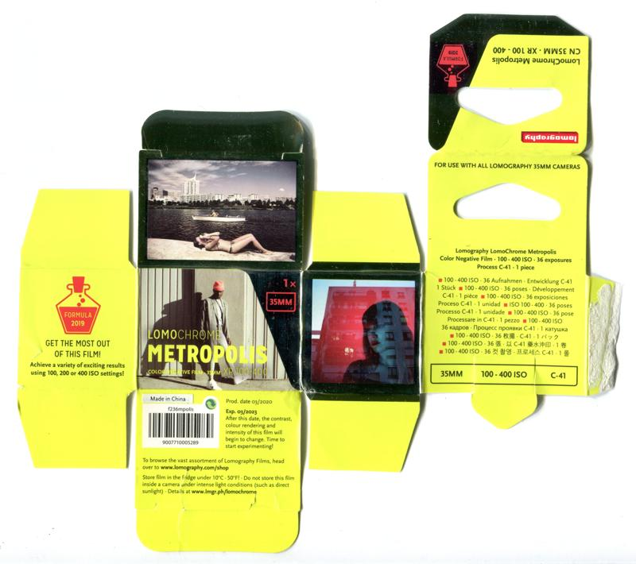
</a>


`UUID: 415e6aeb12db4efbba5f290d09d7beba`‚Üì

<a href="./archive/00236_001.jpg">
	
</a>

#### [35mm] Lomography Babylon (ref: 7afa)

```
Format: 35mm         |  Process : BW      
ISO   : 13           |  Expiry  : 2025-09 
Type  : Single Pack  |  Quantity: 36exp   
Added : 2025-07-31   |  Author  : Pelicram
UUID  : 9d7f531c7a764f9689228ab477297afa
```

<a href="./archive/00147_000.jpg">
	
</a>

#### [35mm] Lomography Fantome (ref: 4340)

```
Format: 35mm         |  Process : BW      
ISO   : 8            |  Expiry  : 2026-01 
Type  : Single Pack  |  Quantity: 36exp   
Added : 2025-07-31   |  Author  : Pelicram
UUID  : 538e7611233a4cc3bd733763bf694340
```

<a href="./archive/00141_000.jpg">
	
</a>

#### [35mm] Lomography Lomochrome Color 92 (ref: 12b4)

```
Format: 35mm         |  Process : C-41    
ISO   : 400          |  Expiry  : 2026-04 
Type  : Single Pack  |  Quantity: 36exp   
Added : 2025-08-20   |  Author  : @photos.by.qi
UUID  : 81d185de4ddf494785362046cada12b4
```

<a href="./archive/00225_000.jpg">
	
</a>

#### [35mm] Lomography Lomochrome Purple (ref: 8b00)

```
Format: 35mm         |  Process : C-41    
ISO   : 100          |  Expiry  : 2022-08 
Type  : Single Pack  |  Quantity: 36exp   
Added : 2025-08-20   |  Author  : @photos.by.qi
UUID  : 5589454d652e4771b024a9901acb8b00
```

<a href="./archive/00226_000.jpg">
	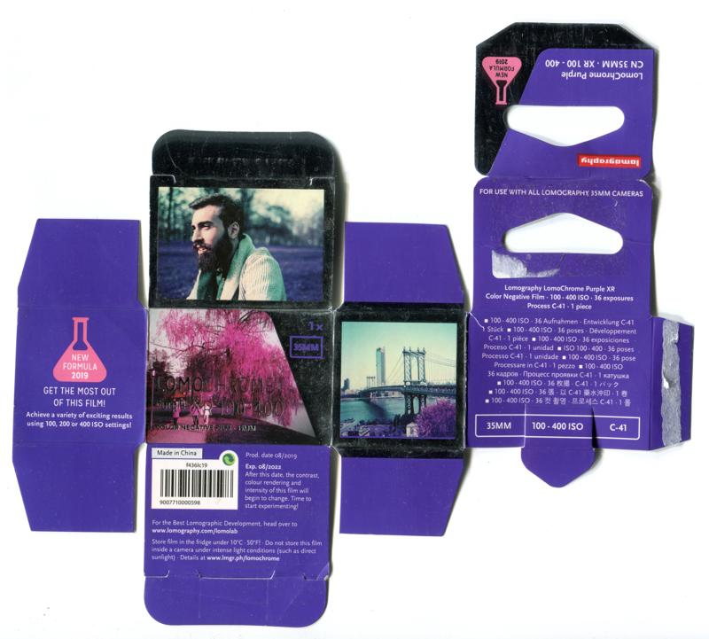
</a>

#### [35mm] Lomography Lomochrome Purple (ref: 068f)

```
Format: 35mm         |  Process : C-41    
ISO   : 100-400      |  Expiry  : 2027-05 
Type  : Single Pack  |  Quantity: 36exp   
Added : 2025-07-22   |  Author  : @SirBrentsworth
UUID  : b02540ba4b454a639f8096f9474d068f
```

<a href="./archive/00078_000.jpg">
	
</a>


`UUID: bd02e2aa40df4da59c616139d8d06db6`‚Üì

<a href="./archive/00078_001.jpg">
	
</a>

#### [35mm] Marix Professional Negative Movie Color Film (ref: c457)

```
Format: 35mm         |  Process : C-41    
ISO   : 320          |  Expiry  : 2026-12 
Type  : Single Pack  |  Quantity: 36exp   
Added : 2025-08-16   |  Author  : Kraksen 
UUID  : 715e5119d4b941d98ce52bcd8596c457
```

<a href="./archive/00188_000.jpg">
	
</a>

#### [35mm] Mutascan Kodak Vision3 500T/5219 (ref: 5150)

```
Format: 35mm         |  Process : ECN-2   
ISO   : 500          |  Expiry  : Unknown 
Type  : Bulk Roll    |  Quantity: 100ft   
Added : 2025-08-15   |  Author  : Pelicram
UUID  : e4d2af3a69704509a07e108fcb4b5150
```

<a href="./archive/00185_000.jpg">
	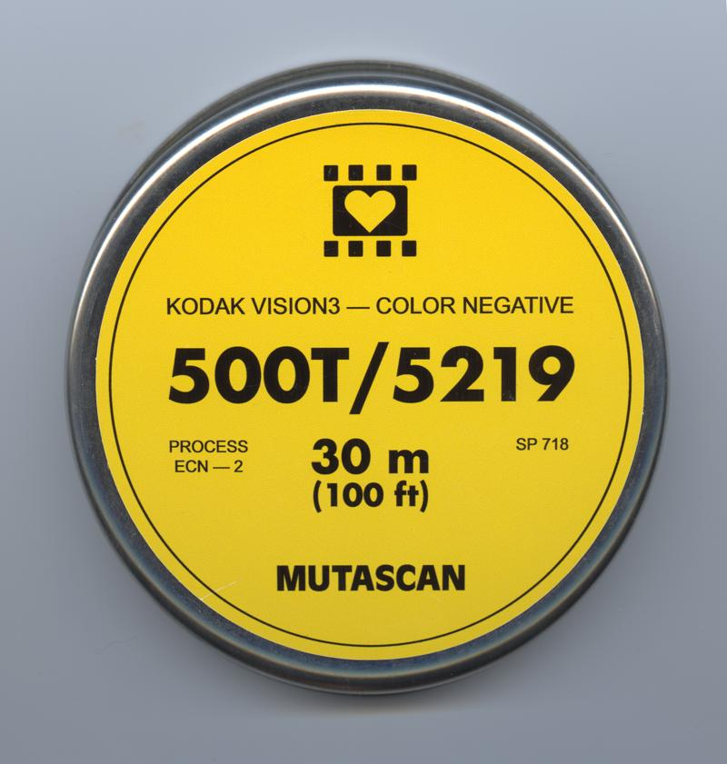
</a>

#### [35mm] ORWO NP 20 SL (ref: b16c)

```
Format: 35mm         |  Process : BW      
ISO   : 80           |  Expiry  : 1992-12 
Type  : Single Pack  |  Quantity: 12exp   
Added : 2025-08-05   |  Author  : The Compartmentalist
UUID  : 9791c2074fdd4340a1463312ed77b16c
```

<a href="./archive/00163_000.jpg">
	
</a>

#### [35mm] Polaroid PolaBlue 35mm (ref: df66)

```
Format: 35mm         |  Process : Instant 
ISO   : 8            |  Expiry  : 1992-08 
Type  : Single Pack  |  Quantity: 12exp   
Added : 2025-01-04   |  Author  : dekuNukem
UUID  : 8236180d686f4e9ca4aa8e6fc397df66
```

<a href="./archive/00019_000.jpg">
	
</a>


`UUID: 6f0d7187f2aa4396ab9879964db7a22a`‚Üì

<a href="./archive/00019_001.jpg">
	
</a>


`UUID: 69c6bc7256f542acadde9fa0441c8c8f`‚Üì

<a href="./archive/00019_002.jpg">
	
</a>


`UUID: 6a168a96e48f45c5b2e4e730e1644fb4`‚Üì

<a href="./archive/00019_003.jpg">
	
</a>


`UUID: 21253e4311ae4a25b46ba931aa78f266`‚Üì

<a href="./archive/00019_004.jpg">
	
</a>


`UUID: de72b5b522a749fbb6aa280253eea1bd`‚Üì

<a href="./archive/00019_005.jpg">
	
</a>


`UUID: e48473352ab04761b968bdcae19a1ab5`‚Üì

<a href="./archive/00019_006.jpg">
	
</a>

#### [35mm] Polaroid PolaChrome 35mm (ref: 3b60)

```
Format: 35mm         |  Process : Instant 
ISO   : 40           |  Expiry  : 1992-09 
Type  : Single Pack  |  Quantity: 36exp   
Added : 2025-01-05   |  Author  : dekuNukem
UUID  : b0041b1e44a64f6591d49e918e033b60
```

<a href="./archive/00029_000.jpg">
	
</a>


`UUID: 1d0b621cf6f44481b941423f04103243`‚Üì

<a href="./archive/00029_001.jpg">
	
</a>


`UUID: ca6b169f6ec949a4a77874ccee054951`‚Üì

<a href="./archive/00029_002.jpg">
	
</a>


`UUID: 705197bbfdc24b92a581a8070d4ee0d2`‚Üì

<a href="./archive/00029_003.jpg">
	
</a>


`UUID: 67abf5aa56574fafab78e2ade2112475`‚Üì

<a href="./archive/00029_004.jpg">
	
</a>

#### [35mm] Polaroid PolaChrome 35mm (ref: b202)

```
Format: 35mm         |  Process : Instant 
ISO   : 40           |  Expiry  : 1993-08 
Type  : Single Pack  |  Quantity: 12exp   
Added : 2025-08-14   |  Author  : Camera.Riley
UUID  : 30947745f405445e88808deab9a4b202
```

<a href="./archive/00174_000.jpg">
	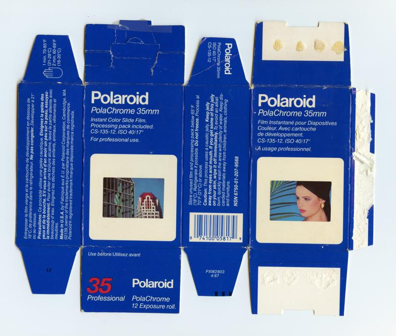
</a>

#### [35mm] Polaroid PolaPan 35mm (ref: 9825)

```
Format: 35mm         |  Process : Instant 
ISO   : 125          |  Expiry  : 1988-04 
Type  : Single Pack  |  Quantity: 12exp   
Added : 2025-08-03   |  Author  : dekuNukem
UUID  : 24a8ae46c50049afb35fc44e956a9825
```

<a href="./archive/00159_000.jpg">
	
</a>


`UUID: a650b451e12b4e1fabb05b4f1f23fb29`‚Üì

<a href="./archive/00159_001.jpg">
	
</a>


`UUID: 30abcb19f7ce46d39021fb057efb95f6`‚Üì

<a href="./archive/00159_002.jpg">
	
</a>


`UUID: 61e5cb43037441ca9a06dd2a4883833c`‚Üì

<a href="./archive/00159_003.jpg">
	
</a>


`UUID: d4369d4ac7bc432cb5bf9acdb0d835d7`‚Üì

<a href="./archive/00159_004.jpg">
	
</a>

#### [35mm] Porst Color N21 (ref: 494a)

```
Format: 35mm         |  Process : C-22    
ISO   : 100          |  Expiry  : 1974-01 
Type  : Single Pack  |  Quantity: 20exp   
Added : 2025-01-14   |  Author  : @ob.skura
UUID  : e08418889f714c9dbda0858718e0494a
```

<a href="./archive/00046_000.jpg">
	
</a>


`UUID: e9bc17db34fa4b779e283c96c92b2359`‚Üì

<a href="./archive/00046_001.jpg">
	
</a>

#### [35mm] Reto Amber D400 (ref: 08ad)

```
Format: 35mm         |  Process : C-41    
ISO   : 400          |  Expiry  : 2024-12 
Type  : Single Pack  |  Quantity: 27exp   
Added : 2025-08-07   |  Author  : TheSelousScout
UUID  : 075938ec54de4c4bbee63671e4c208ad
```

<a href="./archive/00168_000.jpg">
	
</a>

#### [35mm] Rollei Infrared (ref: eae2)

```
Format: 35mm         |  Process : BW      
ISO   : 200          |  Expiry  : 2027-04 
Type  : Single Pack  |  Quantity: 36exp   
Added : 2025-01-21   |  Author  : @ob.skura
UUID  : 9ef642a09d294cbfad7e040a701deae2
```

<a href="./archive/00047_000.jpg">
	
</a>


`UUID: 5bbaeaec47a046a683f87f266c73e71e`‚Üì

<a href="./archive/00047_001.jpg">
	
</a>

#### [35mm] Rollei RPX 400 (ref: 2155)

```
Format: 35mm         |  Process : BW      
ISO   : 400          |  Expiry  : 2028-08 
Type  : Single Pack  |  Quantity: 36exp   
Added : 2025-07-31   |  Author  : Pelicram
UUID  : 19ef81d6d03844b088250c7b54032155
```

<a href="./archive/00136_000.jpg">
	
</a>


`UUID: 962831862dbc4da89c8b979e5fb6584b`‚Üì

<a href="./archive/00136_001.jpg">
	
</a>

#### [35mm] Rollei Retro 80S (ref: e23d)

```
Format: 35mm         |  Process : BW      
ISO   : 80           |  Expiry  : 2025-09 
Type  : Single Pack  |  Quantity: 36exp   
Added : 2025-08-08   |  Author  : Pelicram
UUID  : 406a06d6d4df49cfa27378242ef6e23d
```

<a href="./archive/00169_000.jpg">
	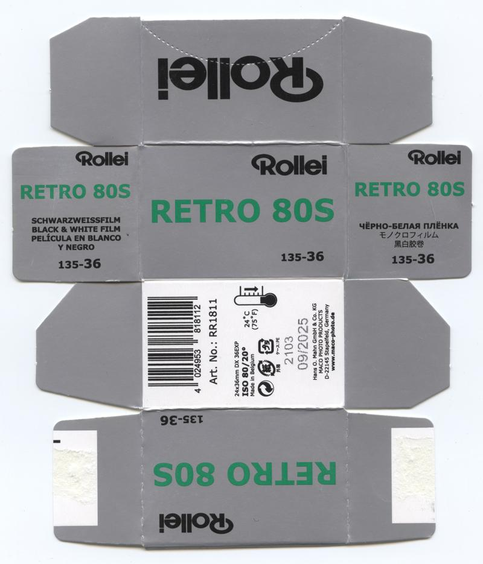
</a>


`UUID: 1dea328c77d74bf19135dc04194df311`‚Üì

<a href="./archive/00169_001.jpg">
	
</a>

#### [35mm] Rollei SUPERPAN 200 (ref: ee8f)

```
Format: 35mm         |  Process : BW      
ISO   : 200          |  Expiry  : 2028-01 
Type  : Single Pack  |  Quantity: 36exp   
Added : 2025-06-05   |  Author  : benikum 
UUID  : f22d3e1e2f70453f87aea4b67db3ee8f
```

<a href="./archive/00071_000.jpg">
	
</a>


`UUID: 7c96a37e3f0f4550876f507554b2a6dd`‚Üì

<a href="./archive/00071_001.jpg">
	
</a>

#### [35mm] Rossmann Jahreszeiten Pack (ref: 7670)

```
Format: 35mm         |  Process : C-41    
ISO   : 100          |  Expiry  : 2006-05 
Type  : Multi-Pack-3 |  Quantity: 36exp   
Added : 2025-06-05   |  Author  : benikum 
UUID  : b09413c4c1f44fceaa31ea8e50bf7670
```

<a href="./archive/00072_000.jpg">
	
</a>

#### [35mm] Sakura Sakuracolor II (ref: 4f7d)

```
Format: 35mm         |  Process : C-41    
ISO   : 100          |  Expiry  : 1978-02 
Type  : Single Pack  |  Quantity: 36exp   
Added : 2025-07-31   |  Author  : The Compartmentalist
UUID  : 0143ad8539d84710845f4d2dc82e4f7d
```

<a href="./archive/00122_000.jpg">
	
</a>

#### [35mm] SantaColor SantaColor (ref: cb58)

```
Format: 35mm         |  Process : C-41    
ISO   : 100          |  Expiry  : 2025-09 
Type  : Single Pack  |  Quantity: 36exp   
Added : 2025-07-30   |  Author  : yc128   
UUID  : e54ce68c797b4846b9aee3f5818ecb58
```

<a href="./archive/00112_000.jpg">
	
</a>

#### [35mm] SantaColor SantaColor (ref: f3a7)

```
Format: 35mm         |  Process : C-41    
ISO   : 100          |  Expiry  : 2025-09 
Type  : Multi-Pack-5 |  Quantity: 36exp   
Added : 2025-07-31   |  Author  : Pelicram
UUID  : 0a141b49a84a4b06a18355308940f3a7
```

<a href="./archive/00128_000.jpg">
	
</a>

#### [35mm] Space Cat Film Mars 250D (ref: 5027)

```
Format: 35mm         |  Process : C-41    
ISO   : 250          |  Expiry  : Unknown 
Type  : Single Pack  |  Quantity: 36exp   
Added : 2025-08-20   |  Author  : @photos.by.qi
UUID  : 1595b93966854178a03bc6d0de705027
```

<a href="./archive/00227_000.jpg">
	
</a>

#### [35mm] Svema Foto (ref: 26ad)

```
Format: 35mm         |  Process : BW      
ISO   : 400          |  Expiry  : 2026-04 
Type  : Single Pack  |  Quantity: 36exp   
Added : 2025-07-31   |  Author  : Pelicram
UUID  : 6e9f27ffcfea4f298be7d33d7f3826ad
```

<a href="./archive/00130_000.jpg">
	
</a>

#### [35mm] Tasma OCh 50 (ref: 5c43)

```
Format: 35mm         |  Process : BW      
ISO   : 50           |  Expiry  : 1991-05 
Type  : Single Pack  |  Quantity: 36exp   
Added : 2025-07-29   |  Author  : Henry Gunn
UUID  : 58211887217046be9d2dfcce8d0c5c43
```

<a href="./archive/00108_000.jpg">
	
</a>

#### [35mm] Three Film Rolls 5207 (ref: 0292)

```
Format: 35mm         |  Process : ECN-2   
ISO   : 250          |  Expiry  : 2025-12 
Type  : Single Pack  |  Quantity: 36exp   
Added : 2025-05-24   |  Author  : dekuNukem
UUID  : 4de0f5e76dd748c488fa81be23340292
```

<a href="./archive/00059_000.jpg">
	
</a>

#### [35mm] Walkens Speed 400 (ref: 740f)

```
Format: 35mm         |  Process : C-41    
ISO   : 400          |  Expiry  : Unknown 
Type  : Single Pack  |  Quantity: 36exp   
Added : 2025-08-20   |  Author  : @photos.by.qi
UUID  : 198465748a5e41f8ad634fffa08a740f
```

<a href="./archive/00228_000.jpg">
	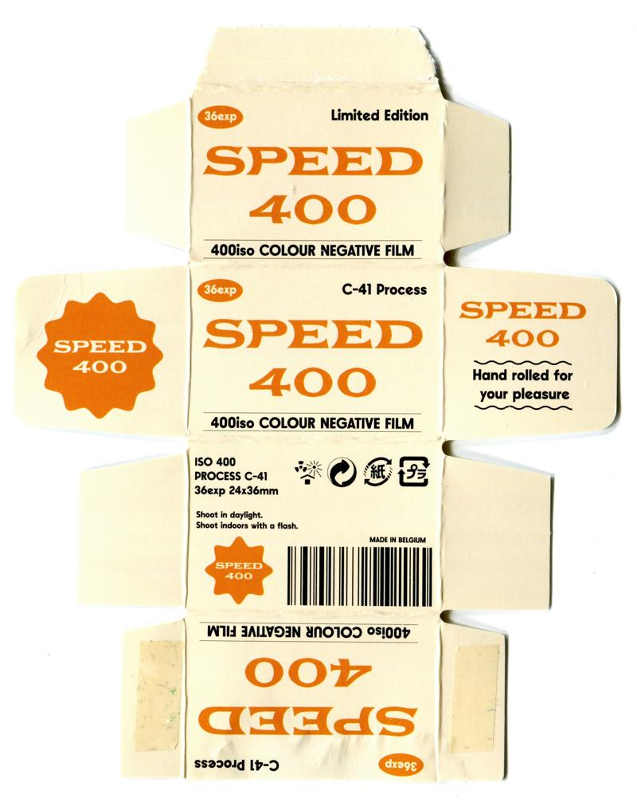
</a>

#### [35mm] Wolfen NC500 (ref: 91c1)

```
Format: 35mm         |  Process : C-41    
ISO   : 400          |  Expiry  : 2026-12 
Type  : Single Pack  |  Quantity: 36exp   
Added : 2025-01-21   |  Author  : @ob.skura
UUID  : 6e3408d7e97247e380ea52077a7491c1
```

<a href="./archive/00049_000.jpg">
	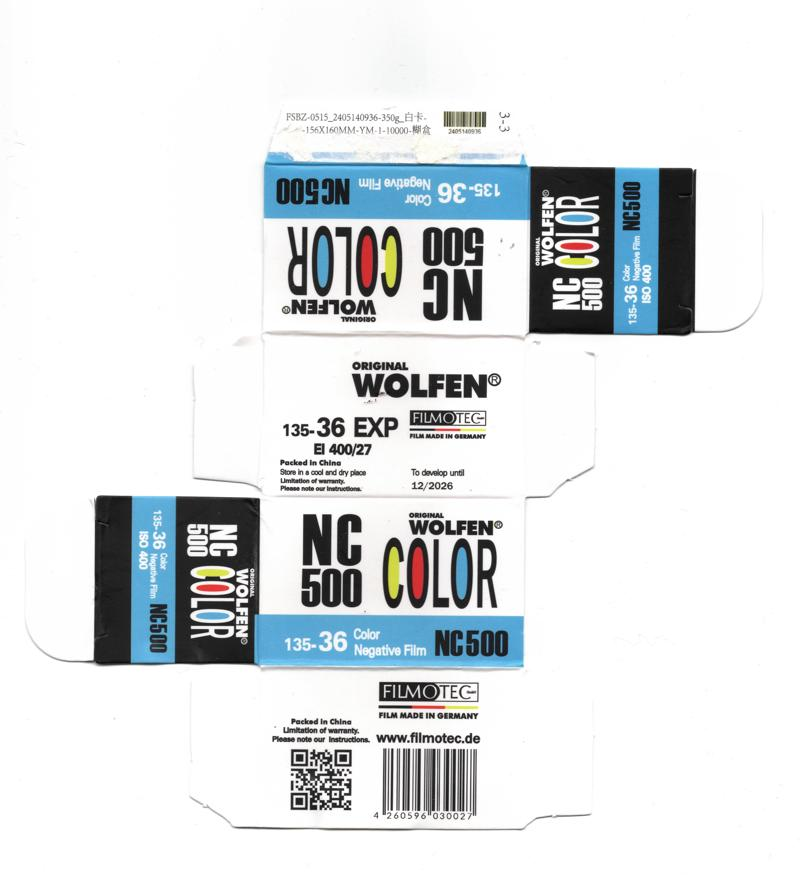
</a>

#### [35mm] Wolfen NP100 (ref: 71a6)

```
Format: 35mm         |  Process : BW      
ISO   : 100          |  Expiry  : 2027-12 
Type  : Single Pack  |  Quantity: 36exp   
Added : 2025-07-31   |  Author  : Pelicram
UUID  : 898148fa3a754866a407bbecec4a71a6
```

<a href="./archive/00131_000.jpg">
	
</a>

#### [35mm] York Photo Labs DXG 200 (ref: 4bf8)

```
Format: 35mm         |  Process : C-41    
ISO   : 200          |  Expiry  : 1994-09 
Type  : Single Pack  |  Quantity: 36exp   
Added : 2025-02-04   |  Author  : b0baspace
UUID  : 46037fb6c55244b6ae47c55d0e454bf8
```

<a href="./archive/00051_000.jpg">
	
</a>

#### [6.5x9cm] Hasselblad Hassel-plåtar E.R.Orto (ref: ec67)

```
Format: 6.5x9cm      |  Process : BW      
ISO   : Unknown      |  Expiry  : Unknown 
Type  : Single Pack  |  Quantity: 12 Sheets
Added : 2025-08-19   |  Author  : @ellafridalindblom
UUID  : 1056543f30334a238387be8abe2dec67
```

<a href="./archive/00204_000.jpg">
	
</a>

#### [6.5x9cm] Illingworth's Fleet H&D (ref: 54fe)

```
Format: 6.5x9cm      |  Process : BW      
ISO   : Unknown      |  Expiry  : Unknown 
Type  : Single Pack  |  Quantity: 12 Sheets
Added : 2025-08-19   |  Author  : @ellafridalindblom
UUID  : bec584ee60f3462381719b3e908f54fe
```

<a href="./archive/00207_000.jpg">
	
</a>

#### [620] Kodak Verichrome Pan (ref: 0195)

```
Format: 620          |  Process : BW      
ISO   : 125          |  Expiry  : 1971-03 
Type  : Single Pack  |  Quantity: N/A     
Added : 2025-01-12   |  Author  : b0baspace
UUID  : 75c7c232d44949c3b1d766b0d2580195
```

<a href="./archive/00041_000.jpg">
	
</a>

#### [70mm] Kodak Portra 400NC (ref: b8de)

```
Format: 70mm         |  Process : C-41    
ISO   : 400          |  Expiry  : 2006-08 
Type  : Bulk Roll    |  Quantity: 100ft   
Added : 2025-08-14   |  Author  : Camera.Riley
UUID  : 88ebc10c01ea46238c48e65157ddb8de
```

<a href="./archive/00175_000.jpg">
	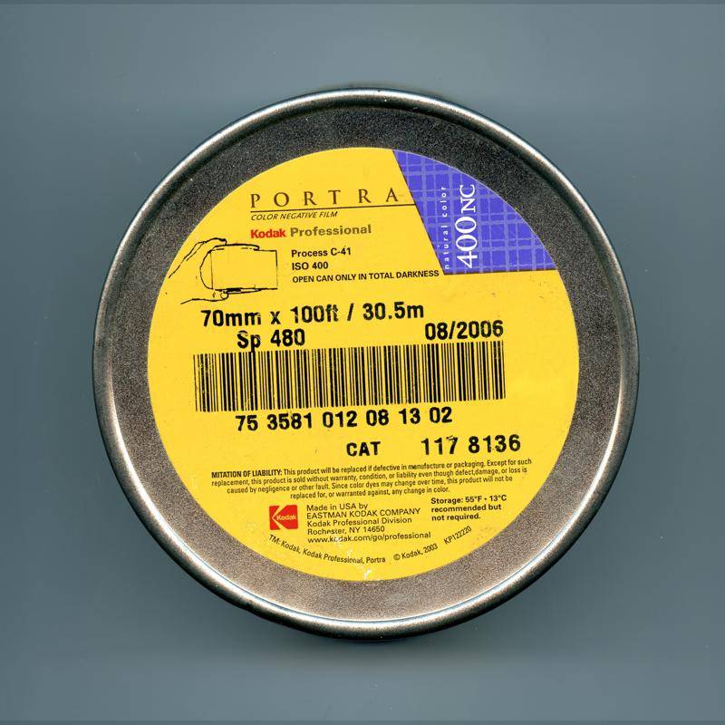
</a>

#### [828] Kodak Ektachrome-X (ref: ae7e)

```
Format: 828          |  Process : E-4     
ISO   : 64           |  Expiry  : 1972-03 
Type  : Single Pack  |  Quantity: 8exp    
Added : 2025-07-31   |  Author  : The Compartmentalist
UUID  : 4ee1eec740dd4838a83384cc19c6ae7e
```

<a href="./archive/00120_000.jpg">
	
</a>

#### [9x12cm] Agfa Autolith Repo (ref: 8e68)

```
Format: 9x12cm       |  Process : BW      
ISO   : Unknown      |  Expiry  : Unknown 
Type  : Single Pack  |  Quantity: 12 Sheets
Added : 2025-07-29   |  Author  : Nano_Burger
UUID  : 952823ad9ef14c75a83ac8e230b38e68
```

<a href="./archive/00098_000.jpg">
	
</a>

#### [9x12cm] Perutz Superomnia (ref: c90d)

```
Format: 9x12cm       |  Process : BW      
ISO   : 125          |  Expiry  : Unknown 
Type  : Single Pack  |  Quantity: 12 Sheets
Added : 2025-07-28   |  Author  : lilyu.xyz
UUID  : b220e7d5dbee49898fbd1d42ee67c90d
```

<a href="./archive/00096_000.jpg">
	
</a>

#### [APS] Jessops Diamond Everyday (ref: 67d3)

```
Format: APS          |  Process : C-41    
ISO   : 200          |  Expiry  : 2006-10 
Type  : Single Pack  |  Quantity: 40exp   
Added : 2025-01-05   |  Author  : dekuNukem
UUID  : b53e5c167866448d812a4dc8e85967d3
```

<a href="./archive/00033_000.jpg">
	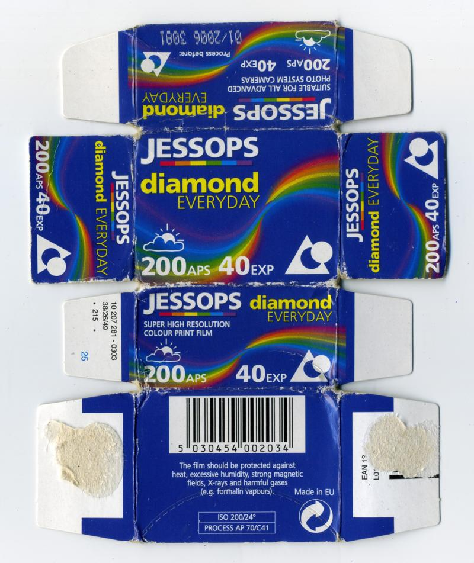
</a>

#### [APS] Klick APS Film (ref: 4b88)

```
Format: APS          |  Process : C-41    
ISO   : 200          |  Expiry  : 2006-10 
Type  : Single Pack  |  Quantity: 25exp   
Added : 2025-05-24   |  Author  : dekuNukem
UUID  : 1dc3d9dbb8bb42b4acfbfbe0737a4b88
```

<a href="./archive/00063_000.jpg">
	
</a>


`UUID: dff53610cf16453fb97135efcc0eed86`‚Üì

<a href="./archive/00063_001.jpg">
	
</a>

#### [APS] Kodak Advantix Ultra (ref: 566b)

```
Format: APS          |  Process : C-41    
ISO   : 200          |  Expiry  : 2006-08 
Type  : Single Pack  |  Quantity: 25exp   
Added : 2025-05-24   |  Author  : dekuNukem
UUID  : 041622f239024ffb8b75c367619a566b
```

<a href="./archive/00066_000.jpg">
	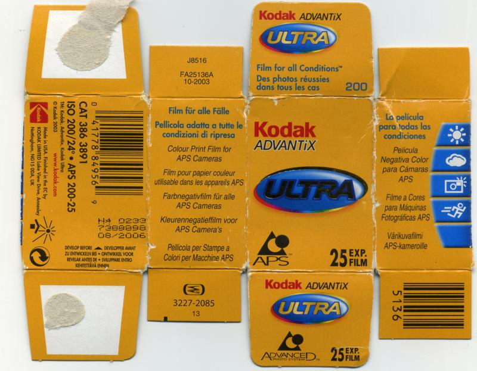
</a>

#### [APS] Lloyds Pharmacy APS Film (ref: c7cf)

```
Format: APS          |  Process : C-41    
ISO   : 200          |  Expiry  : 2007-08 
Type  : Single Pack  |  Quantity: 40exp   
Added : 2025-05-24   |  Author  : dekuNukem
UUID  : 44bd7d4688e04d19a958d961c2abc7cf
```

<a href="./archive/00067_000.jpg">
	
</a>

#### [Integral Film] Polaroid Color 600 Film Round Frame (ref: d985)

```
Format: Integral Film|  Process : Instant 
ISO   : 640          |  Expiry  : 2024-12 
Type  : Single Pack  |  Quantity: 8exp    
Added : 2025-08-02   |  Author  : toader  
UUID  : e798fdd114be4a018cb7651bba94d985
```

<a href="./archive/00157_000.jpg">
	
</a>


`UUID: b9ec4052b0d548ef90f77d7fc99d0ccb`‚Üì

<a href="./archive/00157_001.jpg">
	
</a>


`UUID: 95b81cc72d3646d6966a2341510333aa`‚Üì

<a href="./archive/00157_002.jpg">
	
</a>


`UUID: 038f964e849d4fd1a0c6f1aeb6dd4b0e`‚Üì

<a href="./archive/00157_003.jpg">
	
</a>

#### [Integral Film] Polaroid Color SX-70 Film (ref: dc7f)

```
Format: Integral Film|  Process : Instant 
ISO   : 160          |  Expiry  : 2025-04 
Type  : Single Pack  |  Quantity: 8exp    
Added : 2025-08-02   |  Author  : toader  
UUID  : b4af154cea6f40c0aa1d4154d0c2dc7f
```

<a href="./archive/00156_000.jpg">
	
</a>


`UUID: 5ce2d6b8b1894bf7b67c5a9fdd635a6e`‚Üì

<a href="./archive/00156_001.jpg">
	
</a>


`UUID: 170151c0a84e459db08a9b3718b67743`‚Üì

<a href="./archive/00156_002.jpg">
	
</a>


`UUID: 3c3020e2767a48b88a7dd8662a0ec06d`‚Üì

<a href="./archive/00156_003.jpg">
	
</a>

#### [Integral Film] Polaroid GridFilm (ref: 8deb)

```
Format: Integral Film|  Process : Instant 
ISO   : 640          |  Expiry  : 2006-10 
Type  : Multi-Pack-2 |  Quantity: 10exp   
Added : 2025-01-05   |  Author  : dekuNukem
UUID  : 4f1aabf29f724c9ea3b2bee414b08deb
```

<a href="./archive/00031_000.jpg">
	
</a>


`UUID: 1dda008c9a844e1b9b64527511fdc282`‚Üì

<a href="./archive/00031_001.jpg">
	
</a>


`UUID: 727d6925fdca4834bd96d71c32f40077`‚Üì

<a href="./archive/00031_002.jpg">
	
</a>


`UUID: aa6fba27f7c9484291dbf8279a8e3d18`‚Üì

<a href="./archive/00031_003.jpg">
	
</a>

#### [Pack Film] Polaroid 665 (ref: e054)

```
Format: Pack Film    |  Process : Instant 
ISO   : 80           |  Expiry  : 1996-08 
Type  : Single Pack  |  Quantity: 8exp    
Added : 2025-01-04   |  Author  : dekuNukem
UUID  : 311d896d68b74b1193afcfa129c5e054
```

<a href="./archive/00018_000.jpg">
	
</a>

#### [Pack Film] Polaroid 669 (ref: 3566)

```
Format: Pack Film    |  Process : Instant 
ISO   : 80           |  Expiry  : 2006-03 
Type  : Single Pack  |  Quantity: 20exp   
Added : 2025-01-04   |  Author  : dekuNukem
UUID  : bb62de3a22c04f699c780aeae7c83566
```

<a href="./archive/00020_000.jpg">
	
</a>

#### [Pack Film] Polaroid 87 (ref: 62ef)

```
Format: Pack Film    |  Process : Instant 
ISO   : 3000         |  Expiry  : 2006-07 
Type  : Single Pack  |  Quantity: 10exp   
Added : 2025-08-03   |  Author  : dekuNukem
UUID  : 5a63521777ca4f788d01aac5f94862ef
```

<a href="./archive/00158_000.jpg">
	
</a>


`UUID: 55178f72127944e898f8804ac2663c79`‚Üì

<a href="./archive/00158_001.jpg">
	
</a>

#### [Pack Film] Polaroid Polacolor 679 (ref: 625c)

```
Format: Pack Film    |  Process : Instant 
ISO   : 100          |  Expiry  : 1998-06 
Type  : Multi-Pack-2 |  Quantity: 10exp   
Added : 2025-08-03   |  Author  : dekuNukem
UUID  : 5844215c1fc74612b6118648b845625c
```

<a href="./archive/00161_000.jpg">
	
</a>


`UUID: cca2cc887edb44adb3b00fc9b6cb0dfd`‚Üì

<a href="./archive/00161_001.jpg">
	
</a>


`UUID: 35d7f44a3b59463fabb387917d8f4808`‚Üì

<a href="./archive/00161_002.jpg">
	
</a>


`UUID: cc5370f8b582460ebd5a9e27380bd3d2`‚Üì

<a href="./archive/00161_003.jpg">
	
</a>

#### [Super 8] Kodak Ektachrome 160 Movie Film Type A (ref: 8f62)

```
Format: Super 8      |  Process : Unknown 
ISO   : 160          |  Expiry  : 1980-11 
Type  : Single Pack  |  Quantity: 50ft    
Added : 2025-07-31   |  Author  : stefanie
UUID  : 6032680a3aba41b39c600d7e23998f62
```

<a href="./archive/00154_000.jpg">
	
</a>


`UUID: 28c6f19bd37e4199a072687d11b19961`‚Üì

<a href="./archive/00154_001.jpg">
	
</a>


`UUID: 5d06a8833e0e44e8ab8d53bc0ce11095`‚Üì

<a href="./archive/00154_002.jpg">
	
</a>


`UUID: 870ff01807e949a7b361cdad01dddf7f`‚Üì

<a href="./archive/00154_003.jpg">
	
</a>


`UUID: 31df442b386446679540b0cf52c92fd7`‚Üì

<a href="./archive/00154_004.jpg">
	
</a>

## Want to Contribute?

[Check out the guidelines!](../contribution_guide.md)

## Contributor List

```
Rank  Username                      Contributions
--------------------------------------------------
1     dekuNukem                     111   
2     Pelicram                      48    
3     @photos.by.qi                 46    
4     Camera.Riley                  19    
5     Nano_Burger                   18    
6     @ob.skura                     16    
7     b0baspace                     14    
8     The Compartmentalist          13    
9     @SirBrentsworth               13    
10    @recycling.film               13    
11    toader                        13    
12    stefanie                      12    
13    yc128                         11    
14    @ellafridalindblom            11    
15    lilyu.xyz                     9     
16    benikum                       6     
17    Kraksen                       5     
18    Henry Gunn                    4     
19    u/ReeeSchmidtyWerber          4     
20    lt_col_tall                   4     
21    @Hol.m35                      3     
22    TheSelousScout                3     
23    @seklerek                     2     
24    @ftfilmphotos                 2     
25    Yrikonchik                    1     
26    @ad.astra.per.aspera.1894     1     
```

## Questions or Comments?

Get in touch by joining [the Discord chatroom](https://discord.gg/yvBx7dVG4B), or `email skate.huddle-6r@icloud.com` !

## Back to Home Page

[Click me](../README.md)

